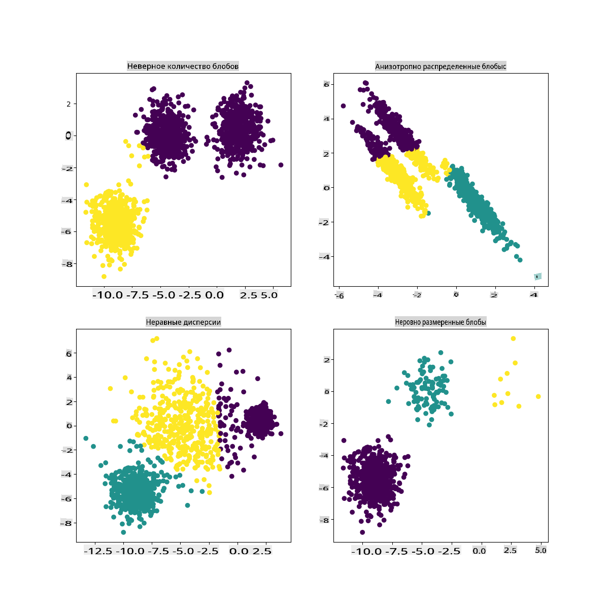

# Кластеризация K-Means

## [Предварительный тест](https://gray-sand-07a10f403.1.azurestaticapps.net/quiz/29/)

На этом уроке вы узнаете, как создавать кластеры с помощью Scikit-learn и набора данных о нигерийской музыке, который вы импортировали ранее. Мы рассмотрим основы K-Means для кластеризации. Имейте в виду, что, как вы узнали на предыдущем уроке, существует множество способов работы с кластерами, и метод, который вы используете, зависит от ваших данных. Мы попробуем K-Means, так как это наиболее распространенная техника кластеризации. Давайте начнем!

Термины, о которых вы узнаете:

- Оценка силуэта
- Метод локтя
- Инерция
- Дисперсия

## Введение

[Кластеризация K-Means](https://wikipedia.org/wiki/K-means_clustering) — это метод, полученный из области обработки сигналов. Он используется для деления и разделения групп данных на 'k' кластеров с использованием серии наблюдений. Каждое наблюдение помогает сгруппировать данный объект данных ближе к его ближайшему 'среднему' значению, или центру кластера.

Кластеры можно визуализировать в виде [диаграмм Вороного](https://wikipedia.org/wiki/Voronoi_diagram), которые включают точку (или 'семя') и соответствующий ей регион. 


> Инфографика от [Jen Looper](https://twitter.com/jenlooper)

Процесс кластеризации K-Means [выполняется в три этапа](https://scikit-learn.org/stable/modules/clustering.html#k-means):

1. Алгоритм выбирает k-число центров, выбирая из набора данных. После этого он зацикливается:
    1. Он присваивает каждому образцу ближайший центроид.
    2. Он создает новые центроиды, беря среднее значение всех образцов, присвоенных предыдущим центроидам.
    3. Затем он вычисляет разницу между новыми и старыми центроидами и повторяет процесс, пока центроиды не стабилизируются.

Одним из недостатков использования K-Means является то, что вам нужно установить 'k', то есть количество центроидов. К счастью, 'метод локтя' помогает оценить хорошее начальное значение для 'k'. Вы попробуете это через минуту.

## Предварительные требования

Вы будете работать в файле [_notebook.ipynb_](https://github.com/microsoft/ML-For-Beginners/blob/main/5-Clustering/2-K-Means/notebook.ipynb) этого урока, который включает импорт данных и предварительную очистку, которую вы сделали на последнем уроке.

## Упражнение - подготовка

Начните с того, чтобы еще раз взглянуть на данные о песнях.

1. Создайте боксплот, вызвав `boxplot()` для каждого столбца:

    ```python
    plt.figure(figsize=(20,20), dpi=200)
    
    plt.subplot(4,3,1)
    sns.boxplot(x = 'popularity', data = df)
    
    plt.subplot(4,3,2)
    sns.boxplot(x = 'acousticness', data = df)
    
    plt.subplot(4,3,3)
    sns.boxplot(x = 'energy', data = df)
    
    plt.subplot(4,3,4)
    sns.boxplot(x = 'instrumentalness', data = df)
    
    plt.subplot(4,3,5)
    sns.boxplot(x = 'liveness', data = df)
    
    plt.subplot(4,3,6)
    sns.boxplot(x = 'loudness', data = df)
    
    plt.subplot(4,3,7)
    sns.boxplot(x = 'speechiness', data = df)
    
    plt.subplot(4,3,8)
    sns.boxplot(x = 'tempo', data = df)
    
    plt.subplot(4,3,9)
    sns.boxplot(x = 'time_signature', data = df)
    
    plt.subplot(4,3,10)
    sns.boxplot(x = 'danceability', data = df)
    
    plt.subplot(4,3,11)
    sns.boxplot(x = 'length', data = df)
    
    plt.subplot(4,3,12)
    sns.boxplot(x = 'release_date', data = df)
    ```

    Эти данные немного шумные: наблюдая за каждым столбцом в виде боксплота, вы можете увидеть выбросы.

    

Вы могли бы просмотреть набор данных и удалить эти выбросы, но это сделает данные довольно минимальными.

1. На данный момент выберите, какие столбцы вы будете использовать для вашего упражнения по кластеризации. Выберите столбцы с похожими диапазонами и закодируйте столбец `artist_top_genre` как числовые данные:

    ```python
    from sklearn.preprocessing import LabelEncoder
    le = LabelEncoder()
    
    X = df.loc[:, ('artist_top_genre','popularity','danceability','acousticness','loudness','energy')]
    
    y = df['artist_top_genre']
    
    X['artist_top_genre'] = le.fit_transform(X['artist_top_genre'])
    
    y = le.transform(y)
    ```

1. Теперь вам нужно выбрать, сколько кластеров вы хотите получить. Вы знаете, что в наборе данных есть 3 музыкальных жанра, которые мы выделили, так что давайте попробуем 3:

    ```python
    from sklearn.cluster import KMeans
    
    nclusters = 3 
    seed = 0
    
    km = KMeans(n_clusters=nclusters, random_state=seed)
    km.fit(X)
    
    # Predict the cluster for each data point
    
    y_cluster_kmeans = km.predict(X)
    y_cluster_kmeans
    ```

Вы видите массив, напечатанный с предсказанными кластерами (0, 1 или 2) для каждой строки датафрейма.

1. Используйте этот массив, чтобы рассчитать 'оценку силуэта':

    ```python
    from sklearn import metrics
    score = metrics.silhouette_score(X, y_cluster_kmeans)
    score
    ```

## Оценка силуэта

Ищите оценку силуэта, ближе к 1. Эта оценка варьируется от -1 до 1, и если оценка равна 1, кластер плотный и хорошо отделен от других кластеров. Значение около 0 представляет собой перекрывающиеся кластеры с образцами, очень близкими к границе решения соседних кластеров. [(Источник)](https://dzone.com/articles/kmeans-silhouette-score-explained-with-python-exam)

Наша оценка **.53**, что означает, что она находится посередине. Это указывает на то, что наши данные не очень хорошо подходят для этого типа кластеризации, но давайте продолжим.

### Упражнение - создание модели

1. Импортируйте `KMeans` и начните процесс кластеризации.

    ```python
    from sklearn.cluster import KMeans
    wcss = []
    
    for i in range(1, 11):
        kmeans = KMeans(n_clusters = i, init = 'k-means++', random_state = 42)
        kmeans.fit(X)
        wcss.append(kmeans.inertia_)
    
    ```

    Здесь есть несколько частей, которые требуют объяснения.

    > 🎓 диапазон: Это итерации процесса кластеризации

    > 🎓 random_state: "Определяет генерацию случайных чисел для инициализации центроидов." [Источник](https://scikit-learn.org/stable/modules/generated/sklearn.cluster.KMeans.html#sklearn.cluster.KMeans)

    > 🎓 WCSS: "суммы квадратов внутри кластера" измеряют среднее квадратное расстояние всех точек внутри кластера до центроида кластера. [Источник](https://medium.com/@ODSC/unsupervised-learning-evaluating-clusters-bd47eed175ce). 

    > 🎓 Инерция: Алгоритмы K-Means пытаются выбрать центроиды, чтобы минимизировать 'инерцию', "меру того, насколько внутренне согласованны кластеры." [Источник](https://scikit-learn.org/stable/modules/clustering.html). Значение добавляется к переменной wcss на каждой итерации.

    > 🎓 k-means++: В [Scikit-learn](https://scikit-learn.org/stable/modules/clustering.html#k-means) вы можете использовать оптимизацию 'k-means++', которая "инициализирует центроиды так, чтобы они (в целом) были далеки друг от друга, что приводит к, вероятно, лучшим результатам, чем случайная инициализация."

### Метод локтя

Ранее вы предположили, что, поскольку вы нацелились на 3 музыкальных жанра, вам следует выбрать 3 кластера. Но так ли это?

1. Используйте 'метод локтя', чтобы убедиться.

    ```python
    plt.figure(figsize=(10,5))
    sns.lineplot(x=range(1, 11), y=wcss, marker='o', color='red')
    plt.title('Elbow')
    plt.xlabel('Number of clusters')
    plt.ylabel('WCSS')
    plt.show()
    ```

    Используйте переменную `wcss`, которую вы создали на предыдущем шаге, чтобы создать график, показывающий, где находится 'изгиб' в локте, что указывает на оптимальное количество кластеров. Может быть, это **и есть** 3!

    

## Упражнение - отображение кластеров

1. Попробуйте процесс снова, на этот раз установив три кластера, и отобразите кластеры в виде точечного графика:

    ```python
    from sklearn.cluster import KMeans
    kmeans = KMeans(n_clusters = 3)
    kmeans.fit(X)
    labels = kmeans.predict(X)
    plt.scatter(df['popularity'],df['danceability'],c = labels)
    plt.xlabel('popularity')
    plt.ylabel('danceability')
    plt.show()
    ```

1. Проверьте точность модели:

    ```python
    labels = kmeans.labels_
    
    correct_labels = sum(y == labels)
    
    print("Result: %d out of %d samples were correctly labeled." % (correct_labels, y.size))
    
    print('Accuracy score: {0:0.2f}'. format(correct_labels/float(y.size)))
    ```

    Точность этой модели не очень хороша, и форма кластеров подсказывает вам, почему. 

    

    Эти данные слишком несбалансированы, слишком слабо коррелированы, и между значениями столбцов слишком велика дисперсия для хорошей кластеризации. На самом деле, кластеры, которые формируются, вероятно, сильно влияют или искажены тремя жанровыми категориями, которые мы определили выше. Это был процесс обучения!

    В документации Scikit-learn вы можете увидеть, что модель, подобная этой, с плохо очерченными кластерами, имеет проблему 'дисперсии':

    
    > Инфографика от Scikit-learn

## Дисперсия

Дисперсия определяется как "среднее квадратных отклонений от среднего" [(Источник)](https://www.mathsisfun.com/data/standard-deviation.html). В контексте этой проблемы кластеризации это относится к данным, которые имеют тенденцию сильно отклоняться от среднего.

✅ Это отличный момент, чтобы подумать обо всех способах, которыми вы могли бы исправить эту проблему. Попробуйте немного изменить данные? Используйте другие столбцы? Используйте другой алгоритм? Подсказка: попробуйте [масштабировать ваши данные](https://www.mygreatlearning.com/blog/learning-data-science-with-k-means-clustering/), чтобы нормализовать их и протестировать другие столбцы.

> Попробуйте этот '[калькулятор дисперсии](https://www.calculatorsoup.com/calculators/statistics/variance-calculator.php)', чтобы лучше понять концепцию.

---

## 🚀Вызов

Проведите некоторое время с этим ноутбуком, изменяя параметры. Можете ли вы улучшить точность модели, очистив данные больше (например, удаляя выбросы)? Вы можете использовать веса, чтобы придать большее значение определенным образцам данных. Что еще вы можете сделать, чтобы создать лучшие кластеры?

Подсказка: попробуйте масштабировать ваши данные. В ноутбуке есть закомментированный код, который добавляет стандартное масштабирование, чтобы столбцы данных больше походили друг на друга по диапазону. Вы заметите, что, хотя оценка силуэта снижается, 'изгиб' на графике локтя сглаживается. Это связано с тем, что оставление данных несмасштабированными позволяет данным с меньшей дисперсией иметь больший вес. Прочитайте немного больше об этой проблеме [здесь](https://stats.stackexchange.com/questions/21222/are-mean-normalization-and-feature-scaling-needed-for-k-means-clustering/21226#21226).

## [Посттест](https://gray-sand-07a10f403.1.azurestaticapps.net/quiz/30/)

## Обзор и самостоятельное изучение

Посмотрите на симулятор K-Means [например, этот](https://user.ceng.metu.edu.tr/~akifakkus/courses/ceng574/k-means/). Вы можете использовать этот инструмент для визуализации образцов данных и определения их центроидов. Вы можете редактировать случайность данных, количество кластеров и количество центроидов. Помогает ли это вам понять, как данные могут быть сгруппированы?

Также посмотрите на [этот раздаточный материал о K-Means](https://stanford.edu/~cpiech/cs221/handouts/kmeans.html) от Стэнфорда.

## Задание

[Попробуйте разные методы кластеризации](assignment.md)

**Отказ от ответственности**:  
Этот документ был переведен с использованием машинных переводческих сервисов на основе ИИ. Хотя мы стремимся к точности, пожалуйста, имейте в виду, что автоматические переводы могут содержать ошибки или неточности. Оригинальный документ на его родном языке следует считать авторитетным источником. Для критически важной информации рекомендуется профессиональный человеческий перевод. Мы не несем ответственности за любые недоразумения или неправильные толкования, возникающие в результате использования этого перевода.