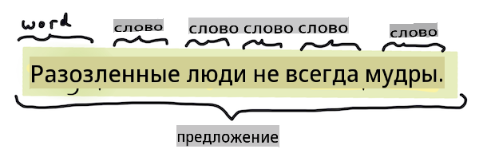
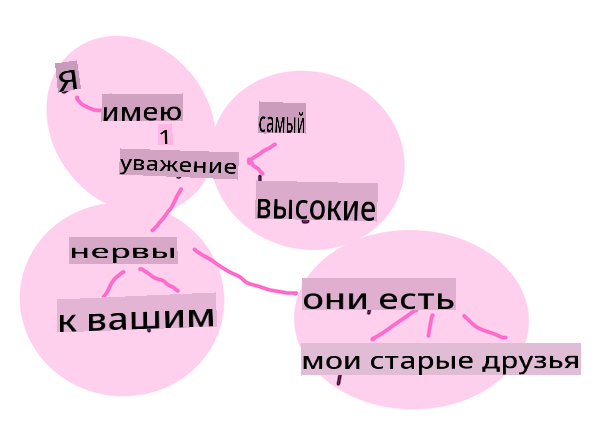
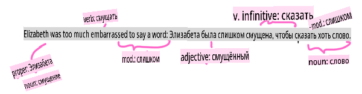

# Общие задачи и методы обработки естественного языка

Для большинства задач *обработки естественного языка* текст, который нужно обработать, должен быть разбит на части, проанализирован, а результаты сохранены или сопоставлены с правилами и наборами данных. Эти задачи позволяют программисту извлечь _значение_ или _намерение_, или только _частоту_ терминов и слов в тексте.

## [Предварительный тест](https://gray-sand-07a10f403.1.azurestaticapps.net/quiz/33/)

Давайте исследуем общие методы, используемые в обработке текста. В сочетании с машинным обучением эти методы помогают эффективно анализировать большие объемы текста. Однако перед тем, как применять ML к этим задачам, давайте разберемся с проблемами, с которыми сталкиваются специалисты по NLP.

## Задачи, общие для NLP

Существует множество способов анализа текста, над которым вы работаете. Есть задачи, которые вы можете выполнять, и через эти задачи вы можете оценить понимание текста и сделать выводы. Обычно вы выполняете эти задачи в последовательности.

### Токенизация

Вероятно, первой задачей, которую должны решить большинство алгоритмов NLP, является разделение текста на токены или слова. Хотя это звучит просто, учет пунктуации и разделителей слов и предложений в разных языках может усложнить задачу. Вам, возможно, придется использовать различные методы для определения границ.


> Токенизация предложения из **Гордость и предубеждение**. Инфографика от [Jen Looper](https://twitter.com/jenlooper)

### Встраивания

[Встраивания слов](https://wikipedia.org/wiki/Word_embedding) — это способ числового преобразования ваших текстовых данных. Встраивания выполняются так, чтобы слова с похожим значением или слова, используемые вместе, сгруппировались.


> "Я испытываю величайшее уважение к вашим нервам, они мои старые друзья." - Встраивания слов для предложения из **Гордость и предубеждение**. Инфографика от [Jen Looper](https://twitter.com/jenlooper)

✅ Попробуйте [этот интересный инструмент](https://projector.tensorflow.org/), чтобы поэкспериментировать с встраиваниями слов. Нажатие на одно слово показывает кластеры похожих слов: 'игрушка' группируется с 'дисней', 'лего', 'плейстейшен' и 'консоль'.

### Парсинг и тегирование частей речи

Каждое слово, которое было токенизировано, может быть помечено как часть речи — существительное, глагол или прилагательное. Предложение `the quick red fox jumped over the lazy brown dog` может быть помечено как fox = существительное, jumped = глагол.



> Парсинг предложения из **Гордость и предубеждение**. Инфографика от [Jen Looper](https://twitter.com/jenlooper)

Парсинг — это распознавание того, какие слова связаны друг с другом в предложении — например, `the quick red fox jumped` представляет собой последовательность прилагательное-сущностное-глагол, которая отделена от последовательности `lazy brown dog`.  

### Частоты слов и фраз

Полезной процедурой при анализе большого объема текста является создание словаря каждого слова или фразы, представляющих интерес, и того, как часто они появляются. Фраза `the quick red fox jumped over the lazy brown dog` имеет частоту слова 2 для the.

Давайте рассмотрим пример текста, в котором мы подсчитываем частоту слов. Стихотворение Редьярда Киплинга "Победители" содержит следующие строки:

```output
What the moral? Who rides may read.
When the night is thick and the tracks are blind
A friend at a pinch is a friend, indeed,
But a fool to wait for the laggard behind.
Down to Gehenna or up to the Throne,
He travels the fastest who travels alone.
```

Так как частоты фраз могут быть нечувствительными к регистру или чувствительными к регистру по мере необходимости, фраза `a friend` has a frequency of 2 and `the` has a frequency of 6, and `travels` равна 2.

### N-граммы

Текст можно разбить на последовательности слов заданной длины: одно слово (униграмма), два слова (биграммы), три слова (триграммы) или любое количество слов (n-граммы).

Например, `the quick red fox jumped over the lazy brown dog` с n-граммным значением 2 производит следующие n-граммы:

1. the quick 
2. quick red 
3. red fox
4. fox jumped 
5. jumped over 
6. over the 
7. the lazy 
8. lazy brown 
9. brown dog

Визуализировать это может быть проще в виде скользящего окна над предложением. Вот пример для n-грамм из 3 слов, n-грамма выделена жирным шрифтом в каждом предложении:

1.   <u>**the quick red**</u> fox jumped over the lazy brown dog
2.   the **<u>quick red fox</u>** jumped over the lazy brown dog
3.   the quick **<u>red fox jumped</u>** over the lazy brown dog
4.   the quick red **<u>fox jumped over</u>** the lazy brown dog
5.   the quick red fox **<u>jumped over the</u>** lazy brown dog
6.   the quick red fox jumped **<u>over the lazy</u>** brown dog
7.   the quick red fox jumped over <u>**the lazy brown**</u> dog
8.   the quick red fox jumped over the **<u>lazy brown dog</u>**


> Значение n-граммы 3: Инфографика от [Jen Looper](https://twitter.com/jenlooper)

### Извлечение именных фраз

В большинстве предложений есть существительное, которое является подлежащим или дополнением. В английском языке его часто можно идентифицировать по наличию перед ним 'a', 'an' или 'the'. Определение подлежащего или дополнения в предложении путем 'извлечения именной фразы' является распространенной задачей в NLP, когда пытаются понять значение предложения.

✅ В предложении "Я не могу определить час, или место, или взгляд, или слова, которые положили начало. Это было слишком давно. Я был в середине, прежде чем узнал, что я начал." можете ли вы определить именные фразы?

В предложении `the quick red fox jumped over the lazy brown dog` есть 2 именные фразы: **quick red fox** и **lazy brown dog**.

### Анализ настроений

Предложение или текст могут быть проанализированы на предмет настроения, или насколько *позитивными* или *негативными* они являются. Настроение измеряется по *полярности* и *объективности/субъективности*. Полярность измеряется от -1.0 до 1.0 (от негативного к позитивному) и от 0.0 до 1.0 (от наиболее объективного к наиболее субъективному).

✅ Позже вы узнаете, что существуют различные способы определения настроения с использованием машинного обучения, но один из способов заключается в наличии списка слов и фраз, которые классифицируются как положительные или отрицательные человеческим экспертом, и применении этой модели к тексту для вычисления полярного значения. Можете ли вы увидеть, как это будет работать в некоторых обстоятельствах и менее эффективно в других?

### Флексия

Флексия позволяет вам взять слово и получить его единственное или множественное число.

### Лемматизация

*Лемма* — это корень или основное слово для набора слов, например *flew*, *flies*, *flying* имеют лемму глагола *fly*.

Также существуют полезные базы данных, доступные для исследователей NLP, в частности:

### WordNet

[WordNet](https://wordnet.princeton.edu/) — это база данных слов, синонимов, антонимов и многих других деталей для каждого слова на многих разных языках. Это невероятно полезно при попытке построить переводы, проверку правописания или языковые инструменты любого типа.

## Библиотеки NLP

К счастью, вам не нужно разрабатывать все эти методы самостоятельно, поскольку существуют отличные библиотеки Python, которые делают их гораздо более доступными для разработчиков, не специализирующихся на обработке естественного языка или машинном обучении. В следующих уроках будут приведены дополнительные примеры этих библиотек, но здесь вы узнаете несколько полезных примеров, которые помогут вам с следующей задачей.

### Упражнение - использование `TextBlob` library

Let's use a library called TextBlob as it contains helpful APIs for tackling these types of tasks. TextBlob "stands on the giant shoulders of [NLTK](https://nltk.org) and [pattern](https://github.com/clips/pattern), and plays nicely with both." It has a considerable amount of ML embedded in its API.

> Note: A useful [Quick Start](https://textblob.readthedocs.io/en/dev/quickstart.html#quickstart) guide is available for TextBlob that is recommended for experienced Python developers 

When attempting to identify *noun phrases*, TextBlob offers several options of extractors to find noun phrases. 

1. Take a look at `ConllExtractor`.

    ```python
    from textblob import TextBlob
    from textblob.np_extractors import ConllExtractor
    # import and create a Conll extractor to use later 
    extractor = ConllExtractor()
    
    # later when you need a noun phrase extractor:
    user_input = input("> ")
    user_input_blob = TextBlob(user_input, np_extractor=extractor)  # note non-default extractor specified
    np = user_input_blob.noun_phrases                                    
    ```

    > Что здесь происходит? [ConllExtractor](https://textblob.readthedocs.io/en/dev/api_reference.html?highlight=Conll#textblob.en.np_extractors.ConllExtractor) — это "Извлекатель именных фраз, который использует парсинг чанков, обученный на тренировочном корпусе ConLL-2000." ConLL-2000 относится к 2000 году, когда проходила Конференция по вычислительному обучению естественного языка. Каждый год на конференции проводился семинар для решения сложной проблемы NLP, и в 2000 году это была задача извлечения именных фраз. Модель была обучена на Wall Street Journal, с "разделами 15-18 в качестве обучающих данных (211727 токенов) и разделом 20 в качестве тестовых данных (47377 токенов)". Вы можете ознакомиться с процедурами, использованными [здесь](https://www.clips.uantwerpen.be/conll2000/chunking/), и с [результатами](https://ifarm.nl/erikt/research/np-chunking.html).

### Задача - улучшение вашего бота с помощью NLP

В предыдущем уроке вы создали очень простой бот для вопросов и ответов. Теперь вы сделаете Марвина немного более отзывчивым, анализируя ваш ввод на предмет настроения и выводя ответ, соответствующий этому настроению. Вам также нужно будет определить `noun_phrase` и задать вопрос о нем.

Ваши шаги при создании лучшего разговорного бота:

1. Выведите инструкции, сообщающие пользователю, как взаимодействовать с ботом
2. Начните цикл 
   1. Примите ввод пользователя
   2. Если пользователь запросил выход, то выходите
   3. Обработайте ввод пользователя и определите подходящий ответ на основе настроения
   4. Если в настроении обнаружена именная фраза, сделайте ее множественной и спросите дополнительную информацию на эту тему
   5. Выведите ответ
3. вернитесь к шагу 2

Вот фрагмент кода для определения настроения с использованием TextBlob. Обратите внимание, что существует только четыре *градиента* ответа на настроение (вы можете добавить больше, если хотите):

```python
if user_input_blob.polarity <= -0.5:
  response = "Oh dear, that sounds bad. "
elif user_input_blob.polarity <= 0:
  response = "Hmm, that's not great. "
elif user_input_blob.polarity <= 0.5:
  response = "Well, that sounds positive. "
elif user_input_blob.polarity <= 1:
  response = "Wow, that sounds great. "
```

Вот некоторые примеры вывода, которые могут вам помочь (ввод пользователя на строках, начинающихся с >):

```output
Hello, I am Marvin, the friendly robot.
You can end this conversation at any time by typing 'bye'
After typing each answer, press 'enter'
How are you today?
> I am ok
Well, that sounds positive. Can you tell me more?
> I went for a walk and saw a lovely cat
Well, that sounds positive. Can you tell me more about lovely cats?
> cats are the best. But I also have a cool dog
Wow, that sounds great. Can you tell me more about cool dogs?
> I have an old hounddog but he is sick
Hmm, that's not great. Can you tell me more about old hounddogs?
> bye
It was nice talking to you, goodbye!
```

Одно из возможных решений задачи можно найти [здесь](https://github.com/microsoft/ML-For-Beginners/blob/main/6-NLP/2-Tasks/solution/bot.py)

✅ Проверка знаний

1. Думаете ли вы, что отзывчивые ответы могут 'обмануть' кого-то, заставив их думать, что бот действительно их понимает?
2. Делает ли определение именной фразы бота более 'убедительным'?
3. Почему извлечение 'именной фразы' из предложения может быть полезным?

---

Реализуйте бота в рамках проверки знаний и протестируйте его на друге. Может ли он обмануть их? Можете ли вы сделать вашего бота более 'убедительным'?

## 🚀Задача

Возьмите задачу из проверки знаний и попробуйте реализовать ее. Протестируйте бота на друге. Может ли он обмануть их? Можете ли вы сделать вашего бота более 'убедительным'?

## [Посттест](https://gray-sand-07a10f403.1.azurestaticapps.net/quiz/34/)

## Обзор и самостоятельное изучение

В следующих уроках вы узнаете больше о анализе настроений. Изучите эту интересную технику в статьях, таких как эти на [KDNuggets](https://www.kdnuggets.com/tag/nlp)

## Задание 

[Заставьте бота отвечать](assignment.md)

**Отказ от ответственности**:  
Этот документ был переведен с использованием машинных переводческих сервисов на основе ИИ. Хотя мы стремимся к точности, пожалуйста, имейте в виду, что автоматические переводы могут содержать ошибки или неточности. Оригинальный документ на родном языке должен считаться авторитетным источником. Для критически важной информации рекомендуется профессиональный человеческий перевод. Мы не несем ответственности за любые недоразумения или неправильные толкования, возникающие в результате использования этого перевода.