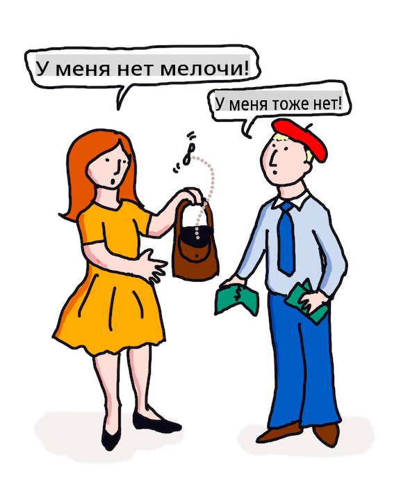

# Перевод и анализ настроений с помощью ML

На предыдущих уроках вы узнали, как создать базового бота, используя `TextBlob`, библиотеку, которая использует машинное обучение за кулисами для выполнения базовых задач обработки естественного языка, таких как извлечение именных фраз. Еще одной важной задачей в вычислительной лингвистике является точный _перевод_ предложения с одного устного или письменного языка на другой.

## [Тест перед лекцией](https://gray-sand-07a10f403.1.azurestaticapps.net/quiz/35/)

Перевод — это очень сложная задача, усугубленная тем фактом, что существует тысячи языков, и у каждого могут быть очень разные грамматические правила. Один из подходов заключается в том, чтобы преобразовать формальные грамматические правила одного языка, например, английского, в структуру, независимую от языка, а затем перевести ее, преобразовав обратно на другой язык. Этот подход подразумевает выполнение следующих шагов:

1. **Идентификация**. Определите или отметьте слова на входном языке как существительные, глаголы и т. д.
2. **Создание перевода**. Произведите прямой перевод каждого слова в формате целевого языка.

### Пример предложения, английский на ирландский

В 'английском' языке предложение _I feel happy_ состоит из трех слов в следующем порядке:

- **подлежащее** (I)
- **глагол** (feel)
- **прилагательное** (happy)

Однако в 'ирландском' языке то же самое предложение имеет совершенно другую грамматическую структуру — эмоции, такие как "*happy*" или "*sad*", выражаются как *на* вас.

Английская фраза `I feel happy` на ирландском будет `Tá athas orm`. *Буквальный* перевод будет `Happy is upon me`.

Ирландский носитель языка, переводя на английский, скажет `I feel happy`, а не `Happy is upon me`, потому что он понимает смысл предложения, даже если слова и структура предложения различны.

Формальный порядок для предложения на ирландском языке таков:

- **глагол** (Tá или is)
- **прилагательное** (athas, или happy)
- **подлежащее** (orm, или upon me)

## Перевод

Наивная программа перевода может переводить только слова, игнорируя структуру предложения.

✅ Если вы изучали второй (или третий и более) язык во взрослом возрасте, вы могли начать с того, что думали на своем родном языке, переводя концепцию слово за словом в своей голове на второй язык, а затем произнося свой перевод. Это похоже на то, что делают наивные компьютерные программы перевода. Важно преодолеть эту фазу, чтобы достичь беглости!

Наивный перевод приводит к плохим (а иногда и смешным) ошибкам перевода: `I feel happy` переводится буквально как `Mise bhraitheann athas` на ирландском. Это значит (буквально) `me feel happy` и не является действительным ирландским предложением. Несмотря на то, что английский и ирландский являются языками, на которых говорят на двух соседних островах, они очень разные языки с различными грамматическими структурами.

> Вы можете посмотреть несколько видео о ирландских лингвистических традициях, например, [это](https://www.youtube.com/watch?v=mRIaLSdRMMs)

### Подходы машинного обучения

До сих пор вы узнали о подходе формальных правил к обработке естественного языка. Другой подход заключается в том, чтобы игнорировать смысл слов и _вместо этого использовать машинное обучение для выявления шаблонов_. Это может сработать в переводе, если у вас есть много текста (корпус) или текстов (корпуса) как на исходном, так и на целевом языках.

Например, рассмотрим случай *Гордости и предубеждения*, известного английского романа, написанного Джейн Остин в 1813 году. Если вы обратитесь к книге на английском и человеческому переводу книги на *французский*, вы сможете выявить фразы в одном, которые _идоматически_ переведены на другой. Вы сделаете это через минуту.

Например, когда английская фраза `I have no money` переводится буквально на французский, она может стать `Je n'ai pas de monnaie`. "Monnaie" — это сложное французское 'ложное созвучие', так как 'money' и 'monnaie' не являются синонимами. Лучший перевод, который мог бы сделать человек, был бы `Je n'ai pas d'argent`, потому что он лучше передает смысл того, что у вас нет денег (в отличие от 'мелочи', что является значением 'monnaie').



> Изображение от [Jen Looper](https://twitter.com/jenlooper)

Если у модели ML достаточно человеческих переводов для построения модели, она может улучшить точность переводов, выявляя общие шаблоны в текстах, которые ранее были переведены экспертными носителями обоих языков.

### Упражнение - перевод

Вы можете использовать `TextBlob` для перевода предложений. Попробуйте знаменитую первую строку **Гордости и предубеждения**:

```python
from textblob import TextBlob

blob = TextBlob(
    "It is a truth universally acknowledged, that a single man in possession of a good fortune, must be in want of a wife!"
)
print(blob.translate(to="fr"))

```

`TextBlob` делает довольно хорошую работу с переводом: "C'est une vérité universellement reconnue, qu'un homme célibataire en possession d'une bonne fortune doit avoir besoin d'une femme!". 

Можно утверждать, что перевод TextBlob гораздо более точен, чем французский перевод книги 1932 года В. Леконта и Ш. Прессуара:

"C'est une vérité universelle qu'un célibataire pourvu d'une belle fortune doit avoir envie de se marier, et, si peu que l'on sache de son sentiment à cet égard, lorsqu'il arrive dans une nouvelle résidence, эта идея так прочно укоренена в сознании его соседей, что они немедленно считают его законной собственностью одной из их дочерей."

В этом случае перевод, основанный на ML, делает лучшую работу, чем человеческий переводчик, который ненужным образом вставляет слова в уста оригинального автора для 'ясности'.

> Что здесь происходит? И почему TextBlob так хорош в переводе? Ну, за кулисами он использует Google Translate, сложный ИИ, способный анализировать миллионы фраз, чтобы предсказать лучшие строки для поставленной задачи. Здесь ничего ручного не происходит, и вам нужно подключение к интернету, чтобы использовать `blob.translate`.

✅ Try some more sentences. Which is better, ML or human translation? In which cases?

## Sentiment analysis

Another area where machine learning can work very well is sentiment analysis. A non-ML approach to sentiment is to identify words and phrases which are 'positive' and 'negative'. Then, given a new piece of text, calculate the total value of the positive, negative and neutral words to identify the overall sentiment. 

This approach is easily tricked as you may have seen in the Marvin task - the sentence `Great, that was a wonderful waste of time, I'm glad we are lost on this dark road` — это саркастическое предложение с негативным настроением, но простой алгоритм обнаруживает 'great', 'wonderful', 'glad' как положительные, а 'waste', 'lost' и 'dark' как негативные. Общий настрой подвержен влиянию этих противоречивых слов.

✅ Остановитесь на секунду и подумайте о том, как мы передаем сарказм как носители языка. Интонация играет большую роль. Попробуйте произнести фразу "Что ж, этот фильм был потрясающим" по-разному, чтобы выяснить, как ваш голос передает смысл.

### Подходы ML

Подход ML будет заключаться в том, чтобы вручную собрать негативные и положительные тексты — твиты, рецензии на фильмы или что угодно, где человек дал оценку *и* написанное мнение. Затем можно применить техники NLP к мнениям и оценкам, чтобы выявить шаблоны (например, положительные рецензии на фильмы, как правило, содержат фразу 'Oscar worthy' чаще, чем негативные рецензии на фильмы, или положительные рецензии на рестораны говорят 'gourmet' гораздо чаще, чем 'disgusting').

> ⚖️ **Пример**: Если бы вы работали в офисе политика и обсуждался какой-то новый закон, избиратели могли бы писать в офис письма с поддержкой или против конкретного нового закона. Предположим, вам поручено читать письма и сортировать их на 2 кучи, *за* и *против*. Если бы писем было много, вы могли бы быть перегружены, пытаясь прочитать их все. Не было бы здорово, если бы бот мог прочитать их все за вас, понять их и сказать вам, в какую кучу попало каждое письмо? 
> 
> Один из способов достичь этого — использовать машинное обучение. Вы бы обучили модель на части писем *против* и части писем *за*. Модель бы, как правило, ассоциировала фразы и слова с противной и поддерживающей стороной, *но она не понимала бы никакого содержания*, только то, что определенные слова и шаблоны с большей вероятностью встречаются в письмах *против* или *за*. Вы могли бы протестировать ее на некоторых письмах, которые не использовали для обучения модели, и посмотреть, пришла ли она к такому же выводу, как и вы. Затем, когда вы будете довольны точностью модели, вы сможете обрабатывать будущие письма, не читая каждое из них.

✅ Звучит ли этот процесс как процессы, которые вы использовали на предыдущих уроках?

## Упражнение - сентиментальные предложения

Сентимент измеряется по *полярности* от -1 до 1, где -1 — это самый негативный сентимент, а 1 — самый позитивный. Сентимент также измеряется по шкале от 0 до 1 для объективности (0) и субъективности (1).

Еще раз посмотрите на *Гордость и предубеждение* Джейн Остин. Текст доступен здесь на [Project Gutenberg](https://www.gutenberg.org/files/1342/1342-h/1342-h.htm). Пример ниже показывает короткую программу, которая анализирует сентимент первых и последних предложений из книги и отображает его полярность сентимента и оценку субъективности/объективности.

Вы должны использовать библиотеку `TextBlob` (описанную выше), чтобы определить `sentiment` (вам не нужно писать свой собственный калькулятор сентимента) в следующем задании.

```python
from textblob import TextBlob

quote1 = """It is a truth universally acknowledged, that a single man in possession of a good fortune, must be in want of a wife."""

quote2 = """Darcy, as well as Elizabeth, really loved them; and they were both ever sensible of the warmest gratitude towards the persons who, by bringing her into Derbyshire, had been the means of uniting them."""

sentiment1 = TextBlob(quote1).sentiment
sentiment2 = TextBlob(quote2).sentiment

print(quote1 + " has a sentiment of " + str(sentiment1))
print(quote2 + " has a sentiment of " + str(sentiment2))
```

Вы видите следующий вывод:

```output
It is a truth universally acknowledged, that a single man in possession of a good fortune, must be in want # of a wife. has a sentiment of Sentiment(polarity=0.20952380952380953, subjectivity=0.27142857142857146)

Darcy, as well as Elizabeth, really loved them; and they were
     both ever sensible of the warmest gratitude towards the persons
      who, by bringing her into Derbyshire, had been the means of
      uniting them. has a sentiment of Sentiment(polarity=0.7, subjectivity=0.8)
```

## Задача - проверьте полярность сентимента

Ваша задача — определить, используя полярность сентимента, имеет ли *Гордость и предубеждение* больше абсолютно позитивных предложений, чем абсолютно негативных. Для этой задачи вы можете предположить, что полярность 1 или -1 является абсолютно позитивной или негативной соответственно.

**Шаги:**

1. Скачайте [копию Гордости и предубеждения](https://www.gutenberg.org/files/1342/1342-h/1342-h.htm) с Project Gutenberg в виде .txt файла. Удалите метаданные в начале и в конце файла, оставив только оригинальный текст.
2. Откройте файл в Python и извлеките содержимое как строку.
3. Создайте TextBlob, используя строку книги.
4. Анализируйте каждое предложение в книге в цикле.
   1. Если полярность равна 1 или -1, сохраните предложение в массиве или списке положительных или негативных сообщений.
5. В конце распечатайте все положительные и негативные предложения (по отдельности) и количество каждого.

Вот пример [решения](https://github.com/microsoft/ML-For-Beginners/blob/main/6-NLP/3-Translation-Sentiment/solution/notebook.ipynb).

✅ Проверка знаний

1. Сентимент основан на словах, используемых в предложении, но понимает ли код *слова*?
2. Считаете ли вы, что полярность сентимента точна, или, другими словами, вы *согласны* с оценками?
   1. В частности, вы согласны или не согласны с абсолютной **позитивной** полярностью следующих предложений?
      * “Какой отличный отец у вас, девочки!” — сказала она, когда дверь закрылась.
      * “Ваше исследование мистера Дарси завершено, я полагаю,” — сказала мисс Бингли; “и каков результат?” “Я совершенно убеждена в том, что у мистера Дарси нет недостатков.”
      * Как замечательно происходят такие вещи!
      * У меня самая большая неприязнь к таким вещам.
      * Шарлотта — отличный менеджер, я осмелюсь сказать.
      * “Это действительно восхитительно!”
      * Я так счастлива!
      * Ваша идея о пони замечательна.
   2. Следующие 3 предложения были оценены с абсолютным позитивным сентиментом, но при близком чтении они не являются позитивными предложениями. Почему анализ сентимента счел их позитивными предложениями?
      * "Я буду так счастлива, когда его пребывание в Нетерфилде закончится!" "Я wish I could say anything to comfort you," replied Elizabeth; "but it is wholly out of my power."
      * "Если бы я только могла видеть вас таким счастливым!"
      * "Наше бедственное положение, дорогая Лиззи, очень велико."
   3. Вы согласны или не согласны с абсолютной **негативной** полярностью следующих предложений?
      - Все недовольны его гордостью.
      - "Мне бы хотелось знать, как он ведет себя среди незнакомцев." "Вы тогда услышите — но приготовьтесь к чему-то очень ужасному."
      - Пауза была для чувств Элизабеты ужасной.
      - Это было бы ужасно!

✅ Любой поклонник Джейн Остин поймет, что она часто использует свои книги для критики более абсурдных аспектов английского общества регентства. Элизабет Беннет, главная героиня *Гордости и предубеждения*, является внимательным социальным наблюдателем (как и автор), и ее язык часто сильно нюансирован. Даже мистер Дарси (возлюбленный в истории) отмечает игривое и насмешливое использование языка Элизабет: "Я имел удовольствие вашего знакомства достаточно долго, чтобы знать, что вы получаете огромное удовольствие от того, чтобы время от времени высказывать мнения, которые на самом деле не являются вашими."

---

## 🚀Задача

Можете ли вы сделать Марвина еще лучше, извлекая другие характеристики из пользовательского ввода?

## [Тест после лекции](https://gray-sand-07a10f403.1.azurestaticapps.net/quiz/36/)

## Обзор и самостоятельное изучение

Существует множество способов извлечения сентимента из текста. Подумайте о бизнес-приложениях, которые могут использовать эту технику. Подумайте о том, как это может пойти не так. Узнайте больше о сложных системах, готовых к использованию в бизнесе, которые анализируют сентимент, таких как [Azure Text Analysis](https://docs.microsoft.com/azure/cognitive-services/Text-Analytics/how-tos/text-analytics-how-to-sentiment-analysis?tabs=version-3-1?WT.mc_id=academic-77952-leestott). Протестируйте некоторые из предложений *Гордости и предубеждения* выше и посмотрите, сможет ли она обнаружить нюансы.

## Задание 

[Поэтическая лицензия](assignment.md)

**Отказ от ответственности**:  
Этот документ был переведен с использованием услуг машинного перевода на основе ИИ. Хотя мы стремимся к точности, пожалуйста, имейте в виду, что автоматические переводы могут содержать ошибки или неточности. Оригинальный документ на родном языке должен считаться авторитетным источником. Для критически важной информации рекомендуется профессиональный человеческий перевод. Мы не несем ответственности за любые недоразумения или неверные толкования, возникающие в результате использования этого перевода.