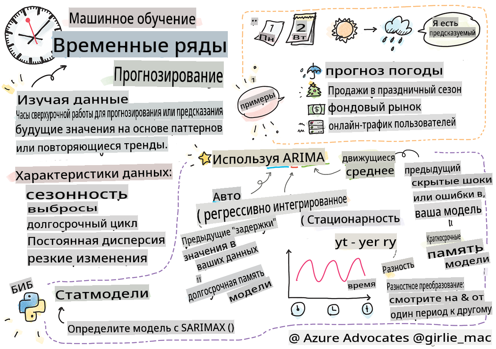
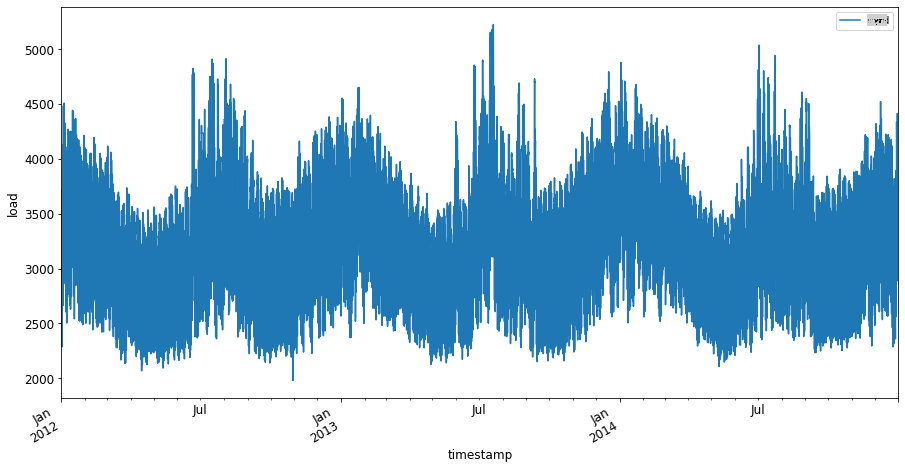
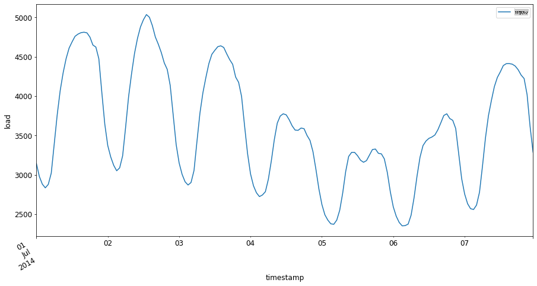

# Введение в прогнозирование временных рядов



> Скетч-заметка от [Томоми Имуры](https://www.twitter.com/girlie_mac)

В этом уроке и следующем вы немного узнаете о прогнозировании временных рядов, интересной и ценной части репертуара ученого в области машинного обучения, которая менее известна, чем другие темы. Прогнозирование временных рядов — это своего рода "хрустальный шар": основываясь на прошлых показателях переменной, такой как цена, вы можете предсказать ее будущую потенциальную стоимость.

[](https://youtu.be/cBojo1hsHiI "Введение в прогнозирование временных рядов")

> 🎥 Нажмите на изображение выше, чтобы посмотреть видео о прогнозировании временных рядов

## [Викторина перед лекцией](https://gray-sand-07a10f403.1.azurestaticapps.net/quiz/41/)

Это полезная и интересная область с реальной ценностью для бизнеса, учитывая ее прямое применение к проблемам ценообразования, инвентаризации и цепочки поставок. Хотя методы глубокого обучения начали использоваться для получения более глубоких инсайтов и лучшего прогнозирования будущей производительности, прогнозирование временных рядов остается областью, в значительной степени основанной на классических методах машинного обучения.

> Полезная учебная программа по временным рядам от Пенсильванского университета доступна [здесь](https://online.stat.psu.edu/stat510/lesson/1)

## Введение

Предположим, вы управляете массивом умных парковочных счетчиков, которые предоставляют данные о том, как часто они используются и как долго со временем.

> Что если вы сможете предсказать, основываясь на прошлых показателях счетчика, его будущую стоимость в соответствии с законами спроса и предложения?

Точно предсказать, когда действовать, чтобы достичь своей цели, — это задача, которую можно решить с помощью прогнозирования временных рядов. Людям не понравится, если их будут взимать больше в загруженные часы, когда они ищут парковочное место, но это был бы надежный способ увеличить доход для уборки улиц!

Давайте исследуем некоторые типы алгоритмов временных рядов и начнем блокнот для очистки и подготовки данных. Данные, которые вы будете анализировать, взяты из соревнования по прогнозированию GEFCom2014. Они состоят из 3 лет почасовых значений нагрузки на электрическую сеть и температуры с 2012 по 2014 год. Учитывая исторические паттерны нагрузки на электрическую сеть и температуры, вы сможете предсказать будущие значения нагрузки на электрическую сеть.

В этом примере вы узнаете, как прогнозировать на один временной шаг вперед, используя только исторические данные нагрузки. Однако прежде чем начать, полезно понять, что происходит за кулисами.

## Некоторые определения

При столкновении с термином "временной ряд" вам нужно понимать его использование в нескольких различных контекстах.

🎓 **Временной ряд**

В математике "временной ряд — это ряд данных, индексированных (или перечисленных или изображенных) в хронологическом порядке. Чаще всего временной ряд представляет собой последовательность, взятую в последовательные равномерно распределенные моменты времени." Примером временного ряда является ежедневная закрывающая стоимость [Dow Jones Industrial Average](https://wikipedia.org/wiki/Time_series). Использование графиков временных рядов и статистического моделирования часто встречается в обработке сигналов, прогнозировании погоды, предсказании землетрясений и других областях, где происходят события, и данные могут быть отображены во времени.

🎓 **Анализ временных рядов**

Анализ временных рядов — это анализ вышеупомянутых данных временных рядов. Данные временных рядов могут принимать различные формы, включая "прерывистые временные ряды", которые выявляют паттерны в эволюции временного ряда до и после прерывающего события. Тип анализа, необходимый для временного ряда, зависит от природы данных. Данные временных рядов сами по себе могут принимать форму серии чисел или символов.

Для выполнения анализа используются различные методы, включая частотный и временной домены, линейные и нелинейные методы и многое другое. [Узнайте больше](https://www.itl.nist.gov/div898/handbook/pmc/section4/pmc4.htm) о многих способах анализа этого типа данных.

🎓 **Прогнозирование временных рядов**

Прогнозирование временных рядов — это использование модели для предсказания будущих значений на основе паттернов, отображаемых ранее собранными данными, как это происходило в прошлом. Хотя возможно использовать регрессионные модели для исследования данных временных рядов, с временными индексами как переменными x на графике, такие данные лучше анализировать с использованием специальных типов моделей.

Данные временных рядов представляют собой список упорядоченных наблюдений, в отличие от данных, которые можно анализировать с помощью линейной регрессии. Наиболее распространенной моделью является ARIMA, аббревиатура, которая расшифровывается как "Автопараметрическая интегрированная скользящая средняя".

[Модели ARIMA](https://online.stat.psu.edu/stat510/lesson/1/1.1) "связывают текущее значение ряда с прошлыми значениями и прошлыми ошибками предсказания." Они наиболее подходят для анализа данных временного домена, где данные упорядочены во времени.

> Существует несколько типов моделей ARIMA, с которыми вы можете ознакомиться [здесь](https://people.duke.edu/~rnau/411arim.htm), и которые вы затронете в следующем уроке.

В следующем уроке вы создадите модель ARIMA, используя [Унивариантные временные ряды](https://itl.nist.gov/div898/handbook/pmc/section4/pmc44.htm), которая фокусируется на одной переменной, изменяющей свою стоимость со временем. Примером такого типа данных является [этот набор данных](https://itl.nist.gov/div898/handbook/pmc/section4/pmc4411.htm), который фиксирует ежемесячную концентрацию CO2 в обсерватории Маунт-Лоа:

|  CO2   | YearMonth | Год  | Месяц |
| :----: | :-------: | :---: | :---: |
| 330.62 |  1975.04  | 1975  |   1   |
| 331.40 |  1975.13  | 1975  |   2   |
| 331.87 |  1975.21  | 1975  |   3   |
| 333.18 |  1975.29  | 1975  |   4   |
| 333.92 |  1975.38  | 1975  |   5   |
| 333.43 |  1975.46  | 1975  |   6   |
| 331.85 |  1975.54  | 1975  |   7   |
| 330.01 |  1975.63  | 1975  |   8   |
| 328.51 |  1975.71  | 1975  |   9   |
| 328.41 |  1975.79  | 1975  |  10   |
| 329.25 |  1975.88  | 1975  |  11   |
| 330.97 |  1975.96  | 1975  |  12   |

✅ Определите переменную, которая изменяется со временем в этом наборе данных

## Характеристики данных временных рядов, которые следует учитывать

При анализе данных временных рядов вы можете заметить, что у них есть [определенные характеристики](https://online.stat.psu.edu/stat510/lesson/1/1.1), которые необходимо учитывать и уменьшать, чтобы лучше понять их паттерны. Если рассматривать данные временных рядов как потенциально предоставляющие "сигнал", который вы хотите проанализировать, эти характеристики можно считать "шумом". Вам часто потребуется уменьшить этот "шум", нейтрализуя некоторые из этих характеристик с помощью статистических методов.

Вот некоторые концепции, которые вам следует знать, чтобы работать с временными рядами:

🎓 **Тренды**

Тренды определяются как измеримые увеличения и уменьшения со временем. [Читать далее](https://machinelearningmastery.com/time-series-trends-in-python). В контексте временных рядов речь идет о том, как использовать и, если необходимо, удалять тренды из вашего временного ряда.

🎓 **[Сезонность](https://machinelearningmastery.com/time-series-seasonality-with-python/)**

Сезонность определяется как периодические колебания, такие как праздничные всплески, которые могут повлиять на продажи, например. [Посмотрите](https://itl.nist.gov/div898/handbook/pmc/section4/pmc443.htm), как различные типы графиков отображают сезонность в данных.

🎓 **Выбросы**

Выбросы значительно отклоняются от стандартной дисперсии данных.

🎓 **Долгосрочный цикл**

Независимо от сезонности данные могут демонстрировать долгосрочный цикл, например, экономический спад, который длится дольше года.

🎓 **Постоянная дисперсия**

Со временем некоторые данные показывают постоянные колебания, такие как потребление энергии в течение дня и ночи.

🎓 **Резкие изменения**

Данные могут демонстрировать резкие изменения, которые могут потребовать дальнейшего анализа. Например, резкое закрытие бизнеса из-за COVID привело к изменениям в данных.

✅ Вот [пример графика временных рядов](https://www.kaggle.com/kashnitsky/topic-9-part-1-time-series-analysis-in-python), показывающий ежедневные расходы виртуальной валюты на протяжении нескольких лет. Можете ли вы определить какие-либо из характеристик, перечисленных выше, в этих данных?


## Упражнение - начнем с данных о потреблении электроэнергии

Давайте начнем создавать модель временного ряда для прогнозирования будущего потребления электроэнергии на основе прошлых данных.

> Данные в этом примере взяты из соревнования по прогнозированию GEFCom2014. Они состоят из 3 лет почасовых значений нагрузки на электрическую сеть и температуры с 2012 по 2014 год.
>
> Tao Hong, Pierre Pinson, Shu Fan, Hamidreza Zareipour, Alberto Troccoli и Rob J. Hyndman, "Вероятностное прогнозирование энергии: Глобальное соревнование по прогнозированию энергии 2014 года и позже", Международный журнал прогнозирования, т. 32, № 3, стр. 896-913, июль-сентябрь 2016 года.

1. В папке `working` этого урока откройте файл _notebook.ipynb_. Начните с добавления библиотек, которые помогут вам загружать и визуализировать данные.

    ```python
    import os
    import matplotlib.pyplot as plt
    from common.utils import load_data
    %matplotlib inline
    ```

    Обратите внимание, что вы используете файлы из включенной `common` folder which set up your environment and handle downloading the data.

2. Next, examine the data as a dataframe calling `load_data()` and `head()`:

    ```python
    data_dir = './data'
    energy = load_data(data_dir)[['load']]
    energy.head()
    ```

    Вы можете увидеть, что есть два столбца, представляющих дату и нагрузку:

    |                     |  load  |
    | :-----------------: | :----: |
    | 2012-01-01 00:00:00 | 2698.0 |
    | 2012-01-01 01:00:00 | 2558.0 |
    | 2012-01-01 02:00:00 | 2444.0 |
    | 2012-01-01 03:00:00 | 2402.0 |
    | 2012-01-01 04:00:00 | 2403.0 |

3. Теперь постройте график данных, вызвав `plot()`:

    ```python
    energy.plot(y='load', subplots=True, figsize=(15, 8), fontsize=12)
    plt.xlabel('timestamp', fontsize=12)
    plt.ylabel('load', fontsize=12)
    plt.show()
    ```

    

4. Теперь постройте график первой недели июля 2014 года, предоставив его в качестве входных данных в шаблоне `energy` in `[от даты]: [до даты]`:

    ```python
    energy['2014-07-01':'2014-07-07'].plot(y='load', subplots=True, figsize=(15, 8), fontsize=12)
    plt.xlabel('timestamp', fontsize=12)
    plt.ylabel('load', fontsize=12)
    plt.show()
    ```

    

    Прекрасный график! Взгляните на эти графики и посмотрите, можете ли вы определить какие-либо из характеристик, перечисленных выше. Что мы можем предположить, визуализируя данные?

В следующем уроке вы создадите модель ARIMA для создания прогнозов.

---

## 🚀Задача

Составьте список всех отраслей и областей исследования, которые, по вашему мнению, могут извлечь выгоду из прогнозирования временных рядов. Можете ли вы придумать применение этих методов в искусстве? В эконометрике? Экологии? Розничной торговле? Промышленности? Финансах? Где еще?

## [Викторина после лекции](https://gray-sand-07a10f403.1.azurestaticapps.net/quiz/42/)

## Обзор и самообучение

Хотя мы не будем рассматривать их здесь, нейронные сети иногда используются для улучшения классических методов прогнозирования временных рядов. Узнайте больше об этом [в этой статье](https://medium.com/microsoftazure/neural-networks-for-forecasting-financial-and-economic-time-series-6aca370ff412)

## Задание

[Визуализируйте еще несколько временных рядов](assignment.md)

**Отказ от ответственности**:  
Этот документ был переведен с использованием услуг машинного перевода на основе ИИ. Хотя мы стремимся к точности, пожалуйста, имейте в виду, что автоматические переводы могут содержать ошибки или неточности. Оригинальный документ на его родном языке следует считать авторитетным источником. Для критически важной информации рекомендуется профессиональный человеческий перевод. Мы не несем ответственности за любые недопонимания или неверные истолкования, возникающие в результате использования этого перевода.