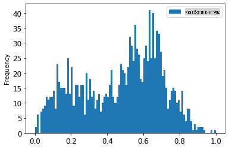
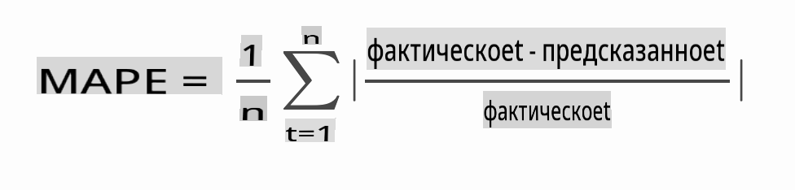

<!--
CO_OP_TRANSLATOR_METADATA:
{
  "original_hash": "2f400075e003e749fdb0d6b3b4787a99",
  "translation_date": "2025-08-29T20:39:42+00:00",
  "source_file": "7-TimeSeries/2-ARIMA/README.md",
  "language_code": "ru"
}
-->
# Прогнозирование временных рядов с помощью ARIMA

В предыдущем уроке вы узнали немного о прогнозировании временных рядов и загрузили набор данных, показывающий колебания электрической нагрузки за определённый период времени.

[](https://youtu.be/IUSk-YDau10 "Введение в ARIMA")

> 🎥 Нажмите на изображение выше, чтобы посмотреть видео: Краткое введение в модели ARIMA. Пример выполнен на языке R, но концепции универсальны.

## [Тест перед лекцией](https://gray-sand-07a10f403.1.azurestaticapps.net/quiz/43/)

## Введение

В этом уроке вы познакомитесь с конкретным способом построения моделей с использованием [ARIMA: *A*uto*R*egressive *I*ntegrated *M*oving *A*verage](https://wikipedia.org/wiki/Autoregressive_integrated_moving_average). Модели ARIMA особенно хорошо подходят для работы с данными, которые демонстрируют [нестационарность](https://wikipedia.org/wiki/Stationary_process).

## Основные концепции

Чтобы работать с ARIMA, необходимо знать несколько ключевых понятий:

- 🎓 **Стационарность**. В статистическом контексте стационарность относится к данным, распределение которых не меняется при сдвиге во времени. Нестационарные данные, напротив, демонстрируют колебания из-за трендов, которые необходимо преобразовать для анализа. Например, сезонность может вызывать колебания в данных, которые можно устранить с помощью процесса "сезонного дифференцирования".

- 🎓 **[Дифференцирование](https://wikipedia.org/wiki/Autoregressive_integrated_moving_average#Differencing)**. Дифференцирование данных в статистическом контексте — это процесс преобразования нестационарных данных в стационарные путём удаления их неконстантного тренда. "Дифференцирование устраняет изменения уровня временного ряда, устраняя тренд и сезонность, тем самым стабилизируя среднее значение временного ряда." [Статья Шиксиона и др.](https://arxiv.org/abs/1904.07632)

## ARIMA в контексте временных рядов

Давайте разберём части ARIMA, чтобы лучше понять, как она помогает моделировать временные ряды и делать прогнозы.

- **AR - авторегрессия (AutoRegressive)**. Авторегрессионные модели, как следует из названия, "смотрят назад" во времени, чтобы анализировать предыдущие значения данных и делать предположения о них. Эти предыдущие значения называются "лагами". Примером могут быть данные о ежемесячных продажах карандашей. Продажи за каждый месяц будут считаться "изменяющейся переменной" в наборе данных. Эта модель строится как "регрессия изменяющейся переменной на её собственные лаговые (т.е. предыдущие) значения." [wikipedia](https://wikipedia.org/wiki/Autoregressive_integrated_moving_average)

- **I - интегрированность (Integrated)**. В отличие от похожих моделей ARMA, буква "I" в ARIMA указывает на её *[интегрированную](https://wikipedia.org/wiki/Order_of_integration)* составляющую. Данные становятся "интегрированными", когда применяются шаги дифференцирования для устранения нестационарности.

- **MA - скользящее среднее (Moving Average)**. Составляющая [скользящего среднего](https://wikipedia.org/wiki/Moving-average_model) в этой модели относится к выходной переменной, которая определяется путём наблюдения текущих и прошлых значений лагов.

Итог: ARIMA используется для того, чтобы модель максимально точно соответствовала особенностям данных временных рядов.

## Упражнение - построение модели ARIMA

Откройте папку [_/working_](https://github.com/microsoft/ML-For-Beginners/tree/main/7-TimeSeries/2-ARIMA/working) в этом уроке и найдите файл [_notebook.ipynb_](https://github.com/microsoft/ML-For-Beginners/blob/main/7-TimeSeries/2-ARIMA/working/notebook.ipynb).

1. Запустите ноутбук, чтобы загрузить библиотеку Python `statsmodels`; она понадобится для работы с моделями ARIMA.

1. Загрузите необходимые библиотеки.

1. Теперь загрузите несколько дополнительных библиотек, полезных для визуализации данных:

    ```python
    import os
    import warnings
    import matplotlib.pyplot as plt
    import numpy as np
    import pandas as pd
    import datetime as dt
    import math

    from pandas.plotting import autocorrelation_plot
    from statsmodels.tsa.statespace.sarimax import SARIMAX
    from sklearn.preprocessing import MinMaxScaler
    from common.utils import load_data, mape
    from IPython.display import Image

    %matplotlib inline
    pd.options.display.float_format = '{:,.2f}'.format
    np.set_printoptions(precision=2)
    warnings.filterwarnings("ignore") # specify to ignore warning messages
    ```

1. Загрузите данные из файла `/data/energy.csv` в DataFrame Pandas и ознакомьтесь с ними:

    ```python
    energy = load_data('./data')[['load']]
    energy.head(10)
    ```

1. Постройте график всех доступных данных об энергопотреблении с января 2012 года по декабрь 2014 года. Никаких сюрпризов быть не должно, так как мы видели эти данные в прошлом уроке:

    ```python
    energy.plot(y='load', subplots=True, figsize=(15, 8), fontsize=12)
    plt.xlabel('timestamp', fontsize=12)
    plt.ylabel('load', fontsize=12)
    plt.show()
    ```

    Теперь давайте построим модель!

### Создание обучающего и тестового наборов данных

Теперь, когда данные загружены, вы можете разделить их на обучающий и тестовый наборы. Вы будете обучать модель на обучающем наборе. Как обычно, после завершения обучения модели вы оцените её точность, используя тестовый набор. Важно, чтобы тестовый набор охватывал более поздний период времени по сравнению с обучающим набором, чтобы модель не получала информацию из будущих временных периодов.

1. Выделите двухмесячный период с 1 сентября по 31 октября 2014 года для обучающего набора. Тестовый набор будет включать двухмесячный период с 1 ноября по 31 декабря 2014 года:

    ```python
    train_start_dt = '2014-11-01 00:00:00'
    test_start_dt = '2014-12-30 00:00:00'
    ```

    Поскольку эти данные отражают ежедневное потребление энергии, в них наблюдается сильная сезонная составляющая, но потребление наиболее похоже на потребление в более недавние дни.

1. Визуализируйте различия:

    ```python
    energy[(energy.index < test_start_dt) & (energy.index >= train_start_dt)][['load']].rename(columns={'load':'train'}) \
        .join(energy[test_start_dt:][['load']].rename(columns={'load':'test'}), how='outer') \
        .plot(y=['train', 'test'], figsize=(15, 8), fontsize=12)
    plt.xlabel('timestamp', fontsize=12)
    plt.ylabel('load', fontsize=12)
    plt.show()
    ```

    

    Таким образом, использование относительно небольшого временного окна для обучения данных должно быть достаточным.

    > Примечание: Поскольку функция, которую мы используем для подгонки модели ARIMA, использует валидацию на выборке во время подгонки, мы исключим данные для валидации.

### Подготовка данных для обучения

Теперь необходимо подготовить данные для обучения, выполнив фильтрацию и масштабирование данных. Отфильтруйте набор данных, чтобы включить только нужные временные периоды и столбцы, а также выполните масштабирование, чтобы данные находились в интервале 0,1.

1. Отфильтруйте исходный набор данных, чтобы включить только указанные временные периоды для каждого набора и только нужный столбец 'load' плюс дату:

    ```python
    train = energy.copy()[(energy.index >= train_start_dt) & (energy.index < test_start_dt)][['load']]
    test = energy.copy()[energy.index >= test_start_dt][['load']]

    print('Training data shape: ', train.shape)
    print('Test data shape: ', test.shape)
    ```

    Вы можете увидеть форму данных:

    ```output
    Training data shape:  (1416, 1)
    Test data shape:  (48, 1)
    ```

1. Масштабируйте данные, чтобы они находились в диапазоне (0, 1).

    ```python
    scaler = MinMaxScaler()
    train['load'] = scaler.fit_transform(train)
    train.head(10)
    ```

1. Визуализируйте исходные и масштабированные данные:

    ```python
    energy[(energy.index >= train_start_dt) & (energy.index < test_start_dt)][['load']].rename(columns={'load':'original load'}).plot.hist(bins=100, fontsize=12)
    train.rename(columns={'load':'scaled load'}).plot.hist(bins=100, fontsize=12)
    plt.show()
    ```

    

    > Исходные данные

    

    > Масштабированные данные

1. Теперь, когда вы откалибровали масштабированные данные, вы можете масштабировать тестовые данные:

    ```python
    test['load'] = scaler.transform(test)
    test.head()
    ```

### Реализация ARIMA

Пришло время реализовать ARIMA! Теперь вы будете использовать библиотеку `statsmodels`, которую установили ранее.

Теперь вам нужно выполнить несколько шагов:

   1. Определите модель, вызвав `SARIMAX()` и передав параметры модели: параметры p, d и q, а также параметры P, D и Q.
   2. Подготовьте модель для обучающих данных, вызвав функцию `fit()`.
   3. Сделайте прогнозы, вызвав функцию `forecast()` и указав количество шагов (горизонт), которые нужно спрогнозировать.

> 🎓 Что означают все эти параметры? В модели ARIMA есть 3 параметра, которые используются для моделирования основных аспектов временного ряда: сезонности, тренда и шума. Эти параметры:

`p`: параметр, связанный с авторегрессионной частью модели, который учитывает *прошлые* значения.  
`d`: параметр, связанный с интегрированной частью модели, который влияет на количество *дифференцирования* (🎓 помните дифференцирование 👆?), применяемого к временным рядам.  
`q`: параметр, связанный с частью модели скользящего среднего.

> Примечание: Если ваши данные имеют сезонный аспект — как в данном случае — мы используем сезонную модель ARIMA (SARIMA). В этом случае вам нужно использовать другой набор параметров: `P`, `D` и `Q`, которые описывают те же ассоциации, что и `p`, `d` и `q`, но соответствуют сезонным компонентам модели.

1. Начните с установки предпочтительного значения горизонта. Попробуем 3 часа:

    ```python
    # Specify the number of steps to forecast ahead
    HORIZON = 3
    print('Forecasting horizon:', HORIZON, 'hours')
    ```

    Выбор лучших значений для параметров модели ARIMA может быть сложным, так как это довольно субъективно и требует времени. Вы можете рассмотреть возможность использования функции `auto_arima()` из библиотеки [`pyramid`](https://alkaline-ml.com/pmdarima/0.9.0/modules/generated/pyramid.arima.auto_arima.html).

1. Пока попробуйте вручную подобрать параметры для нахождения подходящей модели.

    ```python
    order = (4, 1, 0)
    seasonal_order = (1, 1, 0, 24)

    model = SARIMAX(endog=train, order=order, seasonal_order=seasonal_order)
    results = model.fit()

    print(results.summary())
    ```

    Таблица результатов будет выведена.

Вы построили свою первую модель! Теперь нужно найти способ её оценки.

### Оценка модели

Для оценки модели вы можете использовать так называемую валидацию `walk forward`. На практике модели временных рядов переобучаются каждый раз, когда становятся доступны новые данные. Это позволяет модели делать наиболее точный прогноз на каждом временном шаге.

Начав с начала временного ряда, используя эту технику, обучите модель на обучающем наборе данных. Затем сделайте прогноз на следующий временной шаг. Прогноз оценивается по известному значению. Затем обучающий набор расширяется, чтобы включить известное значение, и процесс повторяется.

> Примечание: Вы должны фиксировать окно обучающего набора для более эффективного обучения, чтобы каждый раз, когда вы добавляете новое наблюдение в обучающий набор, вы удаляли наблюдение из начала набора.

Этот процесс обеспечивает более надёжную оценку того, как модель будет работать на практике. Однако это требует значительных вычислительных ресурсов из-за необходимости создания большого количества моделей. Это приемлемо, если данные небольшие или модель проста, но может стать проблемой при масштабировании.

Валидация `walk forward` является золотым стандартом оценки моделей временных рядов и рекомендуется для ваших собственных проектов.

1. Сначала создайте тестовую точку данных для каждого шага HORIZON.

    ```python
    test_shifted = test.copy()

    for t in range(1, HORIZON+1):
        test_shifted['load+'+str(t)] = test_shifted['load'].shift(-t, freq='H')

    test_shifted = test_shifted.dropna(how='any')
    test_shifted.head(5)
    ```

    |            |          | load | load+1 | load+2 |
    | ---------- | -------- | ---- | ------ | ------ |
    | 2014-12-30 | 00:00:00 | 0.33 | 0.29   | 0.27   |
    | 2014-12-30 | 01:00:00 | 0.29 | 0.27   | 0.27   |
    | 2014-12-30 | 02:00:00 | 0.27 | 0.27   | 0.30   |
    | 2014-12-30 | 03:00:00 | 0.27 | 0.30   | 0.41   |
    | 2014-12-30 | 04:00:00 | 0.30 | 0.41   | 0.57   |

    Данные сдвигаются по горизонтали в соответствии с точкой горизонта.

1. Сделайте прогнозы на тестовых данных, используя этот подход скользящего окна в цикле длиной тестового набора данных:

    ```python
    %%time
    training_window = 720 # dedicate 30 days (720 hours) for training

    train_ts = train['load']
    test_ts = test_shifted

    history = [x for x in train_ts]
    history = history[(-training_window):]

    predictions = list()

    order = (2, 1, 0)
    seasonal_order = (1, 1, 0, 24)

    for t in range(test_ts.shape[0]):
        model = SARIMAX(endog=history, order=order, seasonal_order=seasonal_order)
        model_fit = model.fit()
        yhat = model_fit.forecast(steps = HORIZON)
        predictions.append(yhat)
        obs = list(test_ts.iloc[t])
        # move the training window
        history.append(obs[0])
        history.pop(0)
        print(test_ts.index[t])
        print(t+1, ': predicted =', yhat, 'expected =', obs)
    ```

    Вы можете наблюдать процесс обучения:

    ```output
    2014-12-30 00:00:00
    1 : predicted = [0.32 0.29 0.28] expected = [0.32945389435989236, 0.2900626678603402, 0.2739480752014323]

    2014-12-30 01:00:00
    2 : predicted = [0.3  0.29 0.3 ] expected = [0.2900626678603402, 0.2739480752014323, 0.26812891674127126]

    2014-12-30 02:00:00
    3 : predicted = [0.27 0.28 0.32] expected = [0.2739480752014323, 0.26812891674127126, 0.3025962399283795]
    ```

1. Сравните прогнозы с фактической нагрузкой:

    ```python
    eval_df = pd.DataFrame(predictions, columns=['t+'+str(t) for t in range(1, HORIZON+1)])
    eval_df['timestamp'] = test.index[0:len(test.index)-HORIZON+1]
    eval_df = pd.melt(eval_df, id_vars='timestamp', value_name='prediction', var_name='h')
    eval_df['actual'] = np.array(np.transpose(test_ts)).ravel()
    eval_df[['prediction', 'actual']] = scaler.inverse_transform(eval_df[['prediction', 'actual']])
    eval_df.head()
    ```

    Результат:
    |     |            | timestamp | h   | prediction | actual   |
    | --- | ---------- | --------- | --- | ---------- | -------- |
    | 0   | 2014-12-30 | 00:00:00  | t+1 | 3,008.74   | 3,023.00 |
    | 1   | 2014-12-30 | 01:00:00  | t+1 | 2,955.53   | 2,935.00 |
    | 2   | 2014-12-30 | 02:00:00  | t+1 | 2,900.17   | 2,899.00 |
    | 3   | 2014-12-30 | 03:00:00  | t+1 | 2,917.69   | 2,886.00 |
    | 4   | 2014-12-30 | 04:00:00  | t+1 | 2,946.99   | 2,963.00 |

    Наблюдайте за прогнозами почасовых данных в сравнении с фактической нагрузкой. Насколько точен прогноз?

### Проверка точности модели

Проверьте точность вашей модели, протестировав её среднюю абсолютную процентную ошибку (MAPE) по всем прогнозам.
> **🧮 Покажите математику**
>
> 
>
> [MAPE](https://www.linkedin.com/pulse/what-mape-mad-msd-time-series-allameh-statistics/) используется для отображения точности прогноза в виде отношения, определяемого приведенной выше формулой. Разница между фактическим и прогнозируемым значением делится на фактическое.
>
> "Абсолютное значение в этом расчете суммируется для каждой прогнозируемой точки во времени и делится на количество точек n." [wikipedia](https://wikipedia.org/wiki/Mean_absolute_percentage_error)
1. Выразите уравнение в коде:

    ```python
    if(HORIZON > 1):
        eval_df['APE'] = (eval_df['prediction'] - eval_df['actual']).abs() / eval_df['actual']
        print(eval_df.groupby('h')['APE'].mean())
    ```

1. Рассчитайте MAPE для одного шага:

    ```python
    print('One step forecast MAPE: ', (mape(eval_df[eval_df['h'] == 't+1']['prediction'], eval_df[eval_df['h'] == 't+1']['actual']))*100, '%')
    ```

    MAPE прогноза на один шаг:  0.5570581332313952 %

1. Выведите MAPE прогноза на несколько шагов:

    ```python
    print('Multi-step forecast MAPE: ', mape(eval_df['prediction'], eval_df['actual'])*100, '%')
    ```

    ```output
    Multi-step forecast MAPE:  1.1460048657704118 %
    ```

    Низкое значение — это хорошо: учтите, что прогноз с MAPE 10 отклоняется на 10%.

1. Но, как всегда, проще визуально оценить точность такого измерения, поэтому давайте построим график:

    ```python
     if(HORIZON == 1):
        ## Plotting single step forecast
        eval_df.plot(x='timestamp', y=['actual', 'prediction'], style=['r', 'b'], figsize=(15, 8))

    else:
        ## Plotting multi step forecast
        plot_df = eval_df[(eval_df.h=='t+1')][['timestamp', 'actual']]
        for t in range(1, HORIZON+1):
            plot_df['t+'+str(t)] = eval_df[(eval_df.h=='t+'+str(t))]['prediction'].values

        fig = plt.figure(figsize=(15, 8))
        ax = plt.plot(plot_df['timestamp'], plot_df['actual'], color='red', linewidth=4.0)
        ax = fig.add_subplot(111)
        for t in range(1, HORIZON+1):
            x = plot_df['timestamp'][(t-1):]
            y = plot_df['t+'+str(t)][0:len(x)]
            ax.plot(x, y, color='blue', linewidth=4*math.pow(.9,t), alpha=math.pow(0.8,t))

        ax.legend(loc='best')

    plt.xlabel('timestamp', fontsize=12)
    plt.ylabel('load', fontsize=12)
    plt.show()
    ```

    

🏆 Очень красивый график, демонстрирующий модель с хорошей точностью. Отличная работа!

---

## 🚀Задание

Изучите способы проверки точности модели временных рядов. В этом уроке мы рассмотрели MAPE, но существуют ли другие методы, которые можно использовать? Исследуйте их и сделайте заметки. Полезный документ можно найти [здесь](https://otexts.com/fpp2/accuracy.html)

## [Тест после лекции](https://gray-sand-07a10f403.1.azurestaticapps.net/quiz/44/)

## Обзор и самостоятельное изучение

В этом уроке рассматриваются только основы прогнозирования временных рядов с использованием ARIMA. Уделите время углублению знаний, изучив [этот репозиторий](https://microsoft.github.io/forecasting/) и его различные типы моделей, чтобы узнать другие способы построения моделей временных рядов.

## Задание

[Новая модель ARIMA](assignment.md)

---

**Отказ от ответственности**:  
Этот документ был переведен с помощью сервиса автоматического перевода [Co-op Translator](https://github.com/Azure/co-op-translator). Несмотря на наши усилия обеспечить точность, автоматические переводы могут содержать ошибки или неточности. Оригинальный документ на его родном языке следует считать авторитетным источником. Для получения критически важной информации рекомендуется профессиональный перевод человеком. Мы не несем ответственности за любые недоразумения или неправильные интерпретации, возникшие в результате использования данного перевода.