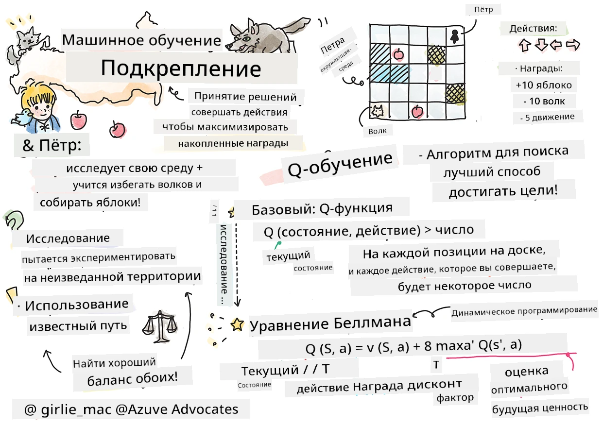
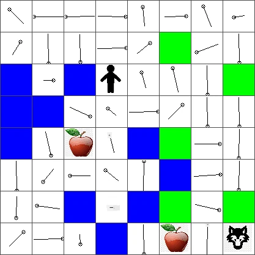

# Введение в обучение с подкреплением и Q-обучение


> Скетчноут от [Tomomi Imura](https://www.twitter.com/girlie_mac)

Обучение с подкреплением включает три важных понятия: агент, некоторые состояния и набор действий для каждого состояния. Выполняя действие в заданном состоянии, агент получает награду. Снова представьте себе компьютерную игру Super Mario. Вы — Марио, вы на уровне игры, стоите рядом с краем обрыва. Над вами монета. Вы — Марио, на уровне игры, в конкретной позиции ... это ваше состояние. Сделать шаг вправо (действие) приведёт к тому, что вы упадёте с обрыва, и получите низкий числовой балл. Однако нажатие кнопки прыжка позволит вам заработать очко и остаться в живых. Это положительный исход, и за него вам должна быть присуждена положительная числовая награда.

Используя обучение с подкреплением и симулятор (игру), вы можете научиться играть так, чтобы максимизировать награду — оставаться в живых и набирать как можно больше очков.

[](https://www.youtube.com/watch?v=lDq_en8RNOo)

> 🎥 Нажмите на изображение выше, чтобы послушать Дмитрия, рассказывающего об обучении с подкреплением

## [Предлекционный тест](https://ff-quizzes.netlify.app/en/ml/)

## Требования и настройка

В этом уроке мы будем экспериментировать с кодом на Python. Вы должны иметь возможность запустить код Jupyter Notebook из этого урока либо на своём компьютере, либо где-то в облаке.

Вы можете открыть [блокнот урока](https://github.com/microsoft/ML-For-Beginners/blob/main/8-Reinforcement/1-QLearning/notebook.ipynb) и пройти этот урок для практики.

> **Примечание:** Если вы открываете этот код из облака, вам также нужно скачать файл [`rlboard.py`](https://github.com/microsoft/ML-For-Beginners/blob/main/8-Reinforcement/1-QLearning/rlboard.py), который используется в коде блокнота. Поместите его в ту же папку, что и блокнот.

## Введение

В этом уроке мы исследуем мир **[Петра и Волка](https://ru.wikipedia.org/wiki/Петя_и_волк)**, вдохновлённый музыкальной сказкой русского композитора, [Сергей Прокофьев](https://ru.wikipedia.org/wiki/Сергей_Прокофьев). Мы будем использовать **обучение с подкреплением**, чтобы позволить Петру исследовать окружение, собирать вкусные яблоки и избегать встречи с волком.

**Обучение с подкреплением** (RL) — это метод обучения, позволяющий нам узнать оптимальное поведение **агента** в некоторой **среде** путём проведения множества экспериментов. Агент в этой среде должен иметь некоторую **цель**, определённую через **функцию награды**.

## Среда

Для простоты давайте представим мир Петра в виде квадратной доски размером `width` x `height`, вот такой:


Каждая ячейка в этой доске может быть:

* **землёй**, по которой Петя и другие существа могут ходить.
* **водой**, по которой, очевидно, ходить нельзя.
* **деревом** или **травой**, местом, где можно отдохнуть.
* **яблоком**, которое Петя будет рад найти, чтобы накормить себя.
* **волком**, который опасен и которого следует избегать.

Существует отдельный модуль Python, [`rlboard.py`](https://github.com/microsoft/ML-For-Beginners/blob/main/8-Reinforcement/1-QLearning/rlboard.py), который содержит код для работы с этой средой. Поскольку этот код не важен для понимания наших концепций, мы импортируем модуль и используем его для создания примерной доски (кодовый блок 1):

```python
from rlboard import *

width, height = 8,8
m = Board(width,height)
m.randomize(seed=13)
m.plot()
```

Этот код должен вывести изображение среды, похожее на приведённое выше.

## Действия и политика

В нашем примере целью Петра будет найти яблоко, избегая волка и других препятствий. Для этого он по сути может ходить, пока не найдёт яблоко.

Следовательно, в любой позиции он может выбрать одно из следующих действий: вверх, вниз, влево и вправо.

Мы определим эти действия как словарь и сопоставим их с парами соответствующих изменений координат. Например, движение вправо (`R`) будет соответствовать паре `(1,0)`. (кодовый блок 2):

```python
actions = { "U" : (0,-1), "D" : (0,1), "L" : (-1,0), "R" : (1,0) }
action_idx = { a : i for i,a in enumerate(actions.keys()) }
```

В итоге стратегия и цель этого сценария таковы:

- **Стратегия** нашего агента (Петра) определяется так называемой **политикой**. Политика — это функция, возвращающая действие для любого заданного состояния. В нашем случае состояние задачи представлено доской, включая текущую позицию игрока.

- **Цель** обучения с подкреплением — в конечном итоге научиться хорошей политике, которая позволит эффективно решать задачу. Однако, для базового варианта рассмотрим самую простую политику, называемую **случайным блужданием**.

## Случайное блуждание

Давайте сначала решим нашу задачу, реализовав стратегию случайного блуждания. При случайном блуждании мы будем случайно выбирать следующее действие из разрешённых, пока не достигнем яблока (кодовый блок 3).

1. Реализуйте случайное блуждание с помощью следующего кода:

    ```python
    def random_policy(m):
        return random.choice(list(actions))
    
    def walk(m,policy,start_position=None):
        n = 0 # количество шагов
        # установить начальную позицию
        if start_position:
            m.human = start_position 
        else:
            m.random_start()
        while True:
            if m.at() == Board.Cell.apple:
                return n # успешно!
            if m.at() in [Board.Cell.wolf, Board.Cell.water]:
                return -1 # съеден волком или утонул
            while True:
                a = actions[policy(m)]
                new_pos = m.move_pos(m.human,a)
                if m.is_valid(new_pos) and m.at(new_pos)!=Board.Cell.water:
                    m.move(a) # выполнить фактическое движение
                    break
            n+=1
    
    walk(m,random_policy)
    ```

    Вызов `walk` должен возвращать длину соответствующего пути, которая может варьироваться от запуска к запуску.

1. Запустите эксперимент блуждания несколько раз (например, 100), и выведите статистику (кодовый блок 4):

    ```python
    def print_statistics(policy):
        s,w,n = 0,0,0
        for _ in range(100):
            z = walk(m,policy)
            if z<0:
                w+=1
            else:
                s += z
                n += 1
        print(f"Average path length = {s/n}, eaten by wolf: {w} times")
    
    print_statistics(random_policy)
    ```

    Обратите внимание, что средняя длина пути около 30-40 шагов, что довольно много, учитывая, что среднее расстояние до ближайшего яблока около 5-6 шагов.

    Также вы можете увидеть, как выглядят перемещения Петра во время случайного блуждания:

    

## Функция награды

Чтобы сделать нашу политику более «умной», нам нужно понять, какие ходы «лучше» других. Для этого нужно определить нашу цель.

Цель можно выразить через **функцию награды**, которая возвращает численное значение для каждого состояния. Чем выше число, тем лучше награда. (кодовый блок 5)

```python
move_reward = -0.1
goal_reward = 10
end_reward = -10

def reward(m,pos=None):
    pos = pos or m.human
    if not m.is_valid(pos):
        return end_reward
    x = m.at(pos)
    if x==Board.Cell.water or x == Board.Cell.wolf:
        return end_reward
    if x==Board.Cell.apple:
        return goal_reward
    return move_reward
```

Интересная особенность функций награды заключается в том, что в большинстве случаев *нам даётся существенная награда только в конце игры*. Это означает, что наш алгоритм должен как-то запоминать «хорошие» шаги, которые приводят к положительной награде в конце, и повышать их значимость. Аналогично, все действия, ведущие к плохим результатам, должны поощряться меньше.

## Q-обучение

Алгоритм, который мы здесь рассмотрим, называется **Q-обучение**. В этом алгоритме политика определяется функцией (или структурой данных), называемой **Q-таблицей**. Она хранит «качество» каждого действия в каждом состоянии.

Её называют Q-таблицей, потому что удобно представить её в виде таблицы или многомерного массива. Поскольку наша доска имеет размеры `width` x `height`, мы можем представить Q-таблицу с помощью массива numpy с формой `width` x `height` x `len(actions)`: (кодовый блок 6)

```python
Q = np.ones((width,height,len(actions)),dtype=np.float)*1.0/len(actions)
```

Обратите внимание, что все значения Q-таблицы инициализируются одинаковым значением, в нашем случае — 0.25. Это соответствует политике случайного блуждания, поскольку все действия в каждом состоянии равнозначны. Мы можем передать Q-таблицу в функцию `plot` для визуализации таблицы на доске: `m.plot(Q)`.


В центре каждой ячейки показана «стрелка», указывающая предпочтительное направление движения. Поскольку все направления равны, отображается точка.

Теперь нам нужно запустить симуляцию, исследовать среду и обучить лучшее распределение значений Q-таблицы, что позволит нам гораздо быстрее находить путь к яблоку.

## Суть Q-обучения: уравнение Беллмана

Как только мы начнём движение, каждое действие будет иметь соответствующую награду, то есть мы теоретически можем выбрать следующее действие, основываясь на наивысшей немедленной награде. Однако во многих состояниях ход не приведёт к нашей цели — достижению яблока, и поэтому мы не можем сразу определить, какое направление лучше.

> Помните, что важен не немедленный результат, а итоговый результат, который мы получим в конце симуляции.

Чтобы учитывать эту отложенную награду, нам нужно использовать принципы **[динамического программирования](https://ru.wikipedia.org/wiki/Динамическое_программирование)**, позволяющие рекурсивно рассматривать нашу задачу.

Предположим, что мы сейчас в состоянии *s* и хотим перейти в следующее состояние *s'*. При этом мы получим немедленную награду *r(s,a)*, заданную функцией награды, плюс некоторую будущую награду. Если предположить, что наша Q-таблица корректно отражает «привлекательность» каждого действия, то в состоянии *s'* мы выберем действие *a*, соответствующее максимальному значению *Q(s',a')*. Таким образом, лучшая возможная будущая награда для состояния *s* определяется как `max`<sub>a'</sub>*Q(s',a')* (максимум берётся по всем возможным действиям *a'* в состоянии *s'*).

Это даёт **формулу Беллмана** для вычисления значения Q-таблицы в состоянии *s* при выборе действия *a*:


Здесь γ — так называемый **коэффициент дисконтирования**, определяющий, в какой степени нужно отдавать предпочтение текущей награде перед будущей и наоборот.

## Алгоритм обучения

Исходя из приведённого уравнения, мы можем записать псевдокод нашего алгоритма обучения:

* Инициализировать Q-таблицу Q одинаковыми числами для всех состояний и действий
* Установить скорость обучения α ← 1
* Повторять симуляцию много раз
   1. Начать с случайной позиции
   1. Повторять
        1. Выбрать действие *a* в состоянии *s*
        2. Выполнить действие, перейдя в новое состояние *s'*
        3. Если достигнуто условие окончания игры или итоговая награда слишком мала — завершить симуляцию
        4. Вычислить награду *r* в новом состоянии
        5. Обновить Q-функцию согласно уравнению Беллмана: *Q(s,a)* ← *(1-α)Q(s,a)+α(r+γ max<sub>a'</sub>Q(s',a'))*
        6. *s* ← *s'*
        7. Обновить суммарную награду и уменьшить α.

## Использование vs исследование

В приведённом алгоритме не уточняется, как именно выбрать действие на шаге 2.1. Если выбирать действие случайно, то мы будем случайно **исследовать** среду, и, вероятно, часто погибать, а также исследовать области, куда мы обычно не зашли бы. Альтернативным подходом было бы **использовать** значения Q-таблицы, которые мы уже знаем, и выбирать лучшее действие (с наивысшим значением Q) в состоянии *s*. Однако это помешало бы исследовать другие состояния, и, вероятно, мы не нашли бы оптимальное решение.

Таким образом, лучший подход — найти баланс между исследованием и использованием. Это можно сделать, выбирая действие в состоянии *s* с вероятностями, пропорциональными значениям в Q-таблице. Вначале, когда все значения в Q-таблице одинаковы, это будет соответствовать случайному выбору, но по мере нашего обучения мы будем чаще следовать оптимальному маршруту, позволяя агенту иногда выбирать неизведанный путь.

## Реализация на Python

Теперь мы готовы реализовать алгоритм обучения. Перед этим нам нужна функция, которая преобразует произвольные числа из Q-таблицы в вектор вероятностей для соответствующих действий.

1. Создайте функцию `probs()`:

    ```python
    def probs(v,eps=1e-4):
        v = v-v.min()+eps
        v = v/v.sum()
        return v
    ```

    Мы добавляем немного `eps` к исходному вектору, чтобы избежать деления на 0 в начальном случае, когда все компоненты вектора одинаковы.

Запустите алгоритм обучения в течение 5000 экспериментов, также называемых **эпохами**: (кодовый блок 8)
```python
    for epoch in range(5000):
    
        # Выберите начальную точку
        m.random_start()
        
        # Начинайте движение
        n=0
        cum_reward = 0
        while True:
            x,y = m.human
            v = probs(Q[x,y])
            a = random.choices(list(actions),weights=v)[0]
            dpos = actions[a]
            m.move(dpos,check_correctness=False) # мы разрешаем игроку выходить за пределы доски, что завершает эпизод
            r = reward(m)
            cum_reward += r
            if r==end_reward or cum_reward < -1000:
                lpath.append(n)
                break
            alpha = np.exp(-n / 10e5)
            gamma = 0.5
            ai = action_idx[a]
            Q[x,y,ai] = (1 - alpha) * Q[x,y,ai] + alpha * (r + gamma * Q[x+dpos[0], y+dpos[1]].max())
            n+=1
```

После выполнения этого алгоритма Q-таблица должна обновиться значениями, определяющими привлекательность разных действий на каждом шаге. Мы можем попытаться визуализировать Q-таблицу, нарисовав в каждой ячейке вектор, который указывает в желаемом направлении для движения. Для простоты вместо наконечника стрелки рисуем маленький кружок.



## Проверка политики

Поскольку Q-таблица показывает «привлекательность» каждого действия в каждом состоянии, довольно просто использовать её для определения эффективной навигации в нашем мире. В простейшем случае мы можем выбрать действие, соответствующее наивысшему значению Q-таблицы: (кодовый блок 9)

```python
def qpolicy_strict(m):
        x,y = m.human
        v = probs(Q[x,y])
        a = list(actions)[np.argmax(v)]
        return a

walk(m,qpolicy_strict)
```


> Если вы попробуете запустить код выше несколько раз, вы можете заметить, что иногда он "зависает", и вам приходится нажимать кнопку СТОП в блокноте, чтобы прервать выполнение. Это происходит потому, что могут быть ситуации, когда два состояния "смотрят" друг на друга с точки зрения оптимального Q-значения, в результате чего агент бесконечно перемещается между этими состояниями.

## 🚀Задача

> **Задание 1:** Измените функцию `walk`, чтобы ограничить максимальную длину пути определённым числом шагов (например, 100), и наблюдайте, как код выше время от времени возвращает это значение.

> **Задание 2:** Измените функцию `walk` так, чтобы она не возвращалась в места, где уже была ранее. Это предотвратит зацикливание функции `walk`, однако агент всё ещё может оказаться "запертым" в месте, из которого не сможет выбраться.

## Навигация

Лучше навигационная политика — это та, которую мы использовали во время обучения, комбинирующая эксплуатацию и исследование. В этой политике мы выбираем каждое действие с определённой вероятностью, пропорциональной значениям в Q-таблице. Эта стратегия всё ещё может приводить к тому, что агент возвращается на уже исследованные позиции, но, как видно из кода ниже, она даёт очень короткий средний путь до нужного места (не забывайте, что `print_statistics` запускает симуляцию 100 раз): (блок кода 10)

```python
def qpolicy(m):
        x,y = m.human
        v = probs(Q[x,y])
        a = random.choices(list(actions),weights=v)[0]
        return a

print_statistics(qpolicy)
```

После запуска этого кода вы получите значительно меньшую среднюю длину пути, чем раньше, в диапазоне от 3 до 6.

## Исследование процесса обучения

Как мы уже упоминали, процесс обучения — это баланс между исследованием и использованием накопленных знаний о структуре пространства задачи. Мы видели, что результаты обучения (способность помогать агенту находить короткий путь к цели) улучшились, но также интересно наблюдать, как средняя длина пути ведёт себя во время процесса обучения:


Результаты обучения можно обобщить так:

- **Средняя длина пути увеличивается**. Здесь мы видим, что сначала средняя длина пути увеличивается. Это, вероятно, связано с тем, что, не зная ничего об окружении, агент велик шанс «застрять» в плохих состояниях, таких как вода или волк. По мере получения знаний мы можем исследовать окружение дольше, но всё ещё плохо знаем, где находятся яблоки.

- **Длина пути уменьшается по мере обучения**. Когда агент достаточно научился, ему становится легче достигать цели, и длина пути начинает сокращаться. Однако мы всё ещё не исключаем исследование, и агент часто отклоняется от лучшего пути, исследуя новые варианты, из-за чего путь становится длиннее оптимального.

- **Резкий рост длины пути**. Также на этом графике видно, что в какой-то момент длина пути резко увеличилась. Это свидетельствует о стохастической природе процесса и о том, что мы в какой-то момент можем "испортить" коэффициенты Q-таблицы, перезаписав их новыми значениями. Этого желательно избегать, уменьшая скорость обучения (например, к концу тренировки мы корректируем значения Q-таблицы малыми величинами).

В целом важно помнить, что успех и качество процесса обучения существенно зависят от параметров, таких как скорость обучения, затухание скорости обучения и коэффициент дисконтирования. Их часто называют **гиперпараметрами**, чтобы отличить от **параметров**, которые мы оптимизируем во время обучения (например, коэффициенты Q-таблицы). Процесс поиска наилучших значений гиперпараметров называется **оптимизацией гиперпараметров** и заслуживает отдельной темы.

## [Тест после лекции](https://ff-quizzes.netlify.app/en/ml/)

## Задание 
[Более реалистичный мир](assignment.md)

---

<!-- CO-OP TRANSLATOR DISCLAIMER START -->
**Отказ от ответственности**:
Этот документ был переведен с использованием сервиса машинного перевода [Co-op Translator](https://github.com/Azure/co-op-translator). Несмотря на наши усилия по обеспечению точности, имейте в виду, что автоматический перевод может содержать ошибки или неточности. Оригинальный документ на его исходном языке следует считать авторитетным источником. Для получения критически важной информации рекомендуется обратиться к профессиональному человеческому переводу. Мы не несем ответственности за любые недоразумения или неправильные толкования, возникшие в результате использования этого перевода.
<!-- CO-OP TRANSLATOR DISCLAIMER END -->