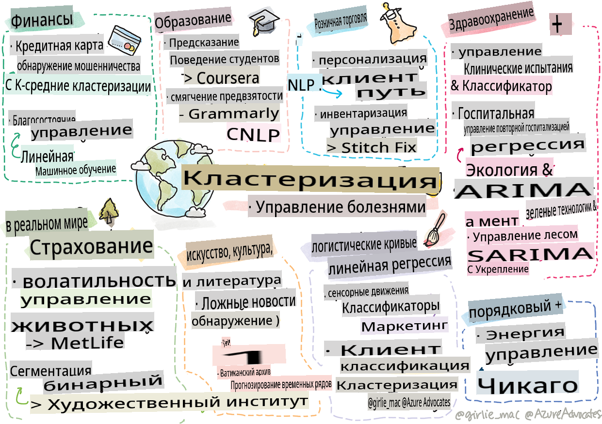

# Постскриптум: Машинное обучение в реальном мире

> Скетч от [Томоми Имуры](https://www.twitter.com/girlie_mac)

В этом курсе вы изучили множество способов подготовки данных для обучения и создания моделей машинного обучения. Вы построили серию классических моделей регрессии, кластеризации, классификации, обработки естественного языка и временных рядов. Поздравляем! Теперь вы, возможно, задаетесь вопросом, для чего все это... каковы реальные приложения этих моделей?

Хотя многие интересы в индустрии связаны с ИИ, который обычно использует глубокое обучение, классические модели машинного обучения все еще имеют ценное применение. Возможно, вы даже используете некоторые из этих приложений сегодня! В этом уроке вы изучите, как восемь различных отраслей и предметных областей используют эти типы моделей для повышения производительности, надежности, интеллектуальности и ценности для пользователей.

## [Предварительный тест](https://gray-sand-07a10f403.1.azurestaticapps.net/quiz/49/)

## 💰 Финансы

Финансовый сектор предлагает множество возможностей для машинного обучения. Многие проблемы в этой области можно моделировать и решать с помощью МЛ.

### Обнаружение мошенничества с кредитными картами

Мы ранее изучали [кластеризацию k-средних](../../5-Clustering/2-K-Means/README.md) в курсе, но как ее можно использовать для решения проблем, связанных с мошенничеством с кредитными картами?

Кластеризация k-средних оказывается полезной в технике обнаружения мошенничества с кредитными картами, называемой **обнаружение выбросов**. Выбросы или отклонения в наблюдениях относительно набора данных могут сообщить нам, используется ли кредитная карта в нормальном режиме или происходит что-то необычное. Как показано в статье, связанной ниже, вы можете сортировать данные кредитных карт с помощью алгоритма кластеризации k-средних и назначать каждой транзакции кластер в зависимости от того, насколько она выглядит как выброс. Затем вы можете оценить самые рискованные кластеры для мошеннических и законных транзакций.
[Ссылка](https://citeseerx.ist.psu.edu/viewdoc/download?doi=10.1.1.680.1195&rep=rep1&type=pdf)

### Управление состоянием

В управлении состоянием индивидуум или компания управляют инвестициями от имени своих клиентов. Их задача — поддерживать и увеличивать состояние в долгосрочной перспективе, поэтому важно выбирать инвестиции, которые хорошо работают.

Один из способов оценить, как работает конкретная инвестиция, — это статистическая регрессия. [Линейная регрессия](../../2-Regression/1-Tools/README.md) является ценным инструментом для понимания того, как фонд работает по сравнению с некоторым эталоном. Мы также можем вывести, являются ли результаты регрессии статистически значимыми или как они повлияют на инвестиции клиента. Вы также можете расширить свой анализ с помощью множественной регрессии, где могут быть учтены дополнительные факторы риска. Для примера того, как это будет работать для конкретного фонда, ознакомьтесь со статьей ниже о оценке производительности фонда с использованием регрессии.
[Ссылка](http://www.brightwoodventures.com/evaluating-fund-performance-using-regression/)

## 🎓 Образование

Образовательный сектор также является очень интересной областью, где можно применить МЛ. Существуют интересные проблемы, которые необходимо решить, такие как обнаружение жульничества на тестах или эссе, или управление предвзятостью, намеренной или нет, в процессе исправления.

### Прогнозирование поведения студентов

[Coursera](https://coursera.com), онлайн-поставщик открытых курсов, имеет отличный технический блог, где они обсуждают множество инженерных решений. В этом исследовании они построили линию регрессии, чтобы попытаться исследовать любую корреляцию между низким NPS (индексом потребительской лояльности) и удержанием курса или его отсеиванием.
[Ссылка](https://medium.com/coursera-engineering/controlled-regression-quantifying-the-impact-of-course-quality-on-learner-retention-31f956bd592a)

### Смягчение предвзятости

[Grammarly](https://grammarly.com), помощник по написанию, который проверяет орфографические и грамматические ошибки, использует сложные [системы обработки естественного языка](../../6-NLP/README.md) в своих продуктах. Они опубликовали интересное исследование в своем техническом блоге о том, как они справлялись с гендерной предвзятостью в машинном обучении, о которой вы узнали на нашем [вводном уроке по справедливости](../../1-Introduction/3-fairness/README.md).
[Ссылка](https://www.grammarly.com/blog/engineering/mitigating-gender-bias-in-autocorrect/)

## 👜 Розничная торговля

Розничный сектор определенно может извлечь выгоду из использования МЛ, начиная от создания лучшего клиентского опыта и заканчивая оптимальным управлением запасами.

### Персонализация клиентского пути

В Wayfair, компании, которая продает товары для дома, такие как мебель, помощь клиентам в поиске правильных продуктов для их вкуса и потребностей имеет первостепенное значение. В этой статье инженеры компании описывают, как они используют МЛ и NLP для "предоставления правильных результатов для клиентов". Примечательно, что их Engine Query Intent был создан для использования извлечения сущностей, обучения классификаторов, извлечения активов и мнений, а также тегирования настроений на основе отзывов клиентов. Это классический пример того, как работает NLP в онлайн-торговле.
[Ссылка](https://www.aboutwayfair.com/tech-innovation/how-we-use-machine-learning-and-natural-language-processing-to-empower-search)

### Управление запасами

Инновационные, гибкие компании, такие как [StitchFix](https://stitchfix.com), сервис, который отправляет одежду потребителям, сильно полагаются на МЛ для рекомендаций и управления запасами. Их стилистические команды работают вместе с командами по мерчендайзингу: "один из наших дата-сайентистов экспериментировал с генетическим алгоритмом и применил его к одежде, чтобы предсказать, какой предмет одежды будет успешным и не существует сегодня. Мы представили это команде мерчендайзинга, и теперь они могут использовать это как инструмент."
[Ссылка](https://www.zdnet.com/article/how-stitch-fix-uses-machine-learning-to-master-the-science-of-styling/)

## 🏥 Здравоохранение

Сектор здравоохранения может использовать МЛ для оптимизации исследовательских задач, а также для решения логистических проблем, таких как повторная госпитализация пациентов или предотвращение распространения болезней.

### Управление клиническими испытаниями

Токсичность в клинических испытаниях является серьезной проблемой для производителей лекарств. Какова допустимая степень токсичности? В этом исследовании анализ различных методов клинических испытаний привел к разработке нового подхода к прогнозированию вероятности исходов клинических испытаний. В частности, им удалось использовать случайный лес для создания [классификатора](../../4-Classification/README.md), который способен различать группы лекарств.
[Ссылка](https://www.sciencedirect.com/science/article/pii/S2451945616302914)

### Управление повторной госпитализацией

Медицинская помощь дорого стоит, особенно когда пациентов необходимо повторно госпитализировать. В этой статье обсуждается компания, которая использует МЛ для прогнозирования вероятности повторной госпитализации с использованием алгоритмов [кластеризации](../../5-Clustering/README.md). Эти кластеры помогают аналитикам "обнаруживать группы повторных госпитализаций, которые могут иметь общую причину".
[Ссылка](https://healthmanagement.org/c/healthmanagement/issuearticle/hospital-readmissions-and-machine-learning)

### Управление болезнями

Недавняя пандемия ярко продемонстрировала, как машинное обучение может помочь в предотвращении распространения болезней. В этой статье вы увидите использование ARIMA, логистических кривых, линейной регрессии и SARIMA. "Эта работа является попыткой рассчитать скорость распространения этого вируса и, таким образом, предсказать количество смертей, выздоровлений и подтвержденных случаев, чтобы помочь нам лучше подготовиться и выжить."
[Ссылка](https://www.ncbi.nlm.nih.gov/pmc/articles/PMC7979218/)

## 🌲 Экология и зеленые технологии

Природа и экология состоят из многих чувствительных систем, где взаимодействие между животными и природой выходит на первый план. Важно уметь точно измерять эти системы и действовать соответствующим образом, если что-то произойдет, например, лесной пожар или снижение численности животных.

### Управление лесами

Вы изучали [обучение с подкреплением](../../8-Reinforcement/README.md) в предыдущих уроках. Оно может быть очень полезным при попытке предсказать закономерности в природе. В частности, его можно использовать для отслеживания экологических проблем, таких как лесные пожары и распространение инвазивных видов. В Канаде группа исследователей использовала обучение с подкреплением для построения моделей динамики лесных пожаров на основе спутниковых изображений. Используя инновационный "пространственно распространяющийся процесс (SSP)", они представили лесной пожар как "агента в любой ячейке ландшафта". "Набор действий, которые пожар может предпринять из конкретного местоположения в любой момент времени, включает распространение на север, юг, восток или запад или отсутствие распространения."

Этот подход инвертирует обычную настройку RL, поскольку динамика соответствующего процесса принятия решений Маркова (MDP) является известной функцией для немедленного распространения лесного пожара." Узнайте больше о классических алгоритмах, используемых этой группой, по ссылке ниже.
[Ссылка](https://www.frontiersin.org/articles/10.3389/fict.2018.00006/full)

### Датчики движения животных

Хотя глубокое обучение произвело революцию в визуальном отслеживании движений животных (вы можете создать свой собственный [трекер белого медведя](https://docs.microsoft.com/learn/modules/build-ml-model-with-azure-stream-analytics/?WT.mc_id=academic-77952-leestott) здесь), классическое МЛ все еще имеет место в этой задаче.

Датчики для отслеживания движений сельскохозяйственных животных и IoT используют этот тип визуальной обработки, но более базовые методы МЛ полезны для предварительной обработки данных. Например, в этой статье позы овец были отслежены и проанализированы с использованием различных алгоритмов классификации. Вы можете узнать кривую ROC на странице 335.
[Ссылка](https://druckhaus-hofmann.de/gallery/31-wj-feb-2020.pdf)

### ⚡️ Управление энергией

В наших уроках по [прогнозированию временных рядов](../../7-TimeSeries/README.md) мы упоминали концепцию умных парковочных счетчиков для генерации доходов для города на основе понимания спроса и предложения. Эта статья подробно обсуждает, как кластеризация, регрессия и прогнозирование временных рядов в совокупности помогли предсказать будущее потребление энергии в Ирландии на основе умного учета.
[Ссылка](https://www-cdn.knime.com/sites/default/files/inline-images/knime_bigdata_energy_timeseries_whitepaper.pdf)

## 💼 Страхование

Сектор страхования — еще одна область, где используется МЛ для построения и оптимизации жизнеспособных финансовых и актуарных моделей.

### Управление волатильностью

MetLife, поставщик страхования жизни, открыто делится своим способом анализа и снижения волатильности в своих финансовых моделях. В этой статье вы заметите визуализации бинарной и порядковой классификации. Вы также откроете для себя визуализации прогнозирования.
[Ссылка](https://investments.metlife.com/content/dam/metlifecom/us/investments/insights/research-topics/macro-strategy/pdf/MetLifeInvestmentManagement_MachineLearnedRanking_070920.pdf)

## 🎨 Искусство, культура и литература

В искусстве, например, в журналистике, существует множество интересных проблем. Обнаружение фейковых новостей является огромной проблемой, поскольку было доказано, что они влияют на мнение людей и даже могут свергать демократии. Музеи также могут извлечь выгоду из использования МЛ везде, начиная от нахождения связей между артефактами и заканчивая планированием ресурсов.

### Обнаружение фейковых новостей

Обнаружение фейковых новостей стало игрой в кошки-мышки в современных СМИ. В этой статье исследователи предполагают, что система, объединяющая несколько изученных нами техник МЛ, может быть протестирована, а лучшая модель развернута: "Эта система основана на обработке естественного языка для извлечения признаков из данных, а затем эти признаки используются для обучения классификаторов машинного обучения, таких как Наивный Байес, Метод опорных векторов (SVM), Случайный лес (RF), Стохастический градиентный спуск (SGD) и Логистическая регрессия (LR)."
[Ссылка](https://www.irjet.net/archives/V7/i6/IRJET-V7I6688.pdf)

Эта статья показывает, как объединение различных областей МЛ может привести к интересным результатам, которые могут помочь остановить распространение фейковых новостей и причинение реального вреда; в данном случае толчком стало распространение слухов о лечении COVID, которые спровоцировали насилие толпы.

### Музейное МЛ

Музеи находятся на пороге революции ИИ, в которой каталогизация и цифровизация коллекций, а также нахождение связей между артефактами становятся проще по мере развития технологий. Проекты, такие как [In Codice Ratio](https://www.sciencedirect.com/science/article/abs/pii/S0306457321001035#:~:text=1.,studies%20over%20large%20historical%20sources.), помогают раскрыть тайны недоступных коллекций, таких как Ватиканские архивы. Но бизнес-аспект музеев также выигрывает от моделей МЛ.

Например, Художественный институт Чикаго построил модели для прогнозирования того, что интересует аудиторию и когда они будут посещать выставки. Цель состоит в том, чтобы создать индивидуализированный и оптимизированный опыт для посетителей каждый раз, когда пользователь посещает музей. "В течение финансового 2017 года модель предсказала посещаемость и поступления с точностью в 1 процент, говорит Эндрю Симник, старший вице-президент Художественного института."
[Reference](https://www.chicagobusiness.com/article/20180518/ISSUE01/180519840/art-institute-of-chicago-uses-data-to-make-exhibit-choices)

## 🏷 Маркетинг

### Сегментация клиентов

Наиболее эффективные маркетинговые стратегии нацелены на клиентов различными способами, основываясь на различных группировках. В этой статье обсуждаются применения алгоритмов кластеризации для поддержки дифференцированного маркетинга. Дифференцированный маркетинг помогает компаниям улучшать узнаваемость бренда, достигать большего числа клиентов и зарабатывать больше денег.
[Reference](https://ai.inqline.com/machine-learning-for-marketing-customer-segmentation/)

## 🚀 Задача

Определите другой сектор, который получает выгоду от некоторых техник, изученных в этой программе, и узнайте, как он использует машинное обучение.

## [Викторина после лекции](https://gray-sand-07a10f403.1.azurestaticapps.net/quiz/50/)

## Обзор и самостоятельное изучение

Команда по анализу данных компании Wayfair имеет несколько интересных видео о том, как они используют машинное обучение в своей компании. Стоит [посмотреть](https://www.youtube.com/channel/UCe2PjkQXqOuwkW1gw6Ameuw/videos)!

## Задание

[Охота за сокровищами в ML](assignment.md)

**Отказ от ответственности**:  
Этот документ был переведен с использованием услуг машинного перевода на основе ИИ. Хотя мы стремимся к точности, пожалуйста, имейте в виду, что автоматические переводы могут содержать ошибки или неточности. Оригинальный документ на родном языке следует считать авторитетным источником. Для критически важной информации рекомендуется профессиональный человеческий перевод. Мы не несем ответственности за любые недоразумения или неверные интерпретации, возникающие в результате использования этого перевода.