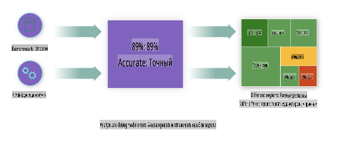
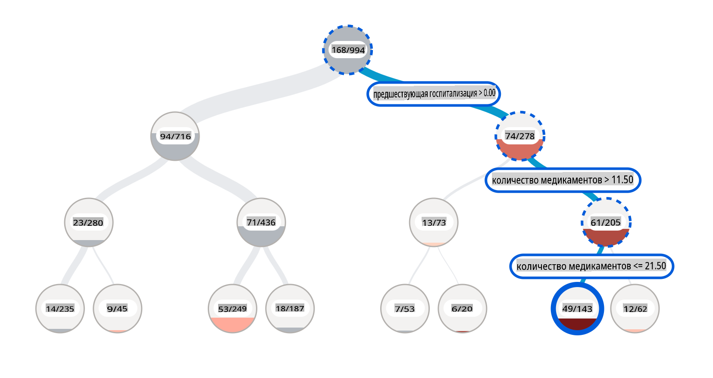
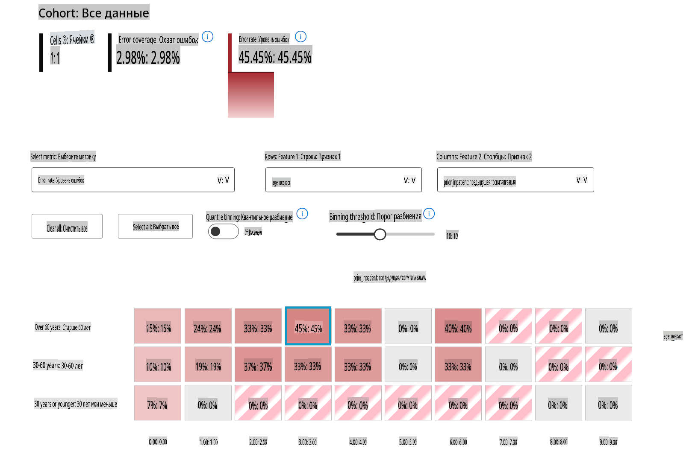
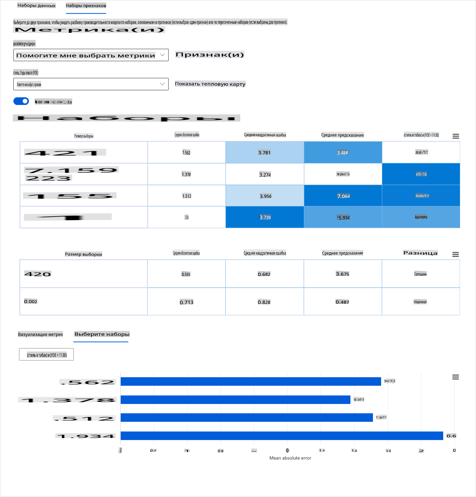
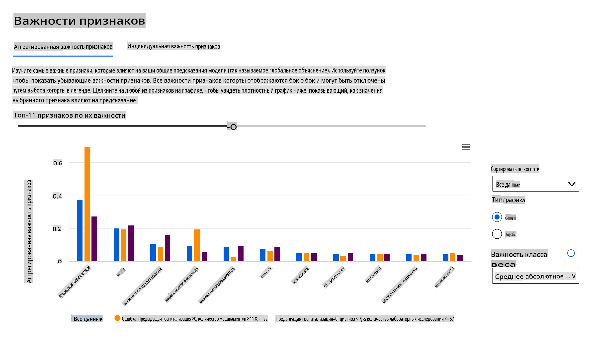

# Постскриптум: Отладка моделей в машинном обучении с использованием компонентов панели ответственного ИИ

## [Предварительная викторина](https://gray-sand-07a10f403.1.azurestaticapps.net/quiz/5/)

## Введение

Машинное обучение влияет на нашу повседневную жизнь. ИИ проникает в некоторые из самых важных систем, которые влияют на нас как на индивидуумов, так и на наше общество, от здравоохранения, финансов, образования до занятости. Например, системы и модели участвуют в ежедневных задачах принятия решений, таких как диагностика в здравоохранении или выявление мошенничества. Следовательно, достижения в области ИИ и ускоренное его внедрение сталкиваются с развивающимися общественными ожиданиями и растущим регулированием в ответ на это. Мы постоянно наблюдаем области, где ИИ-системы продолжают не соответствовать ожиданиям; они выявляют новые проблемы; и правительства начинают регулировать ИИ-решения. Поэтому важно, чтобы эти модели анализировались для обеспечения справедливых, надежных, инклюзивных, прозрачных и ответственных результатов для всех.

В этом учебном плане мы рассмотрим практические инструменты, которые можно использовать для оценки наличия проблем ответственного ИИ в модели. Традиционные техники отладки машинного обучения, как правило, основываются на количественных расчетах, таких как агрегированная точность или средняя ошибка. Представьте, что может произойти, когда данные, которые вы используете для построения этих моделей, не охватывают определенные демографические группы, такие как раса, пол, политические взгляды, религия или непропорционально представляют такие демографические группы. А что, если вывод модели интерпретируется как благоприятный для какой-то демографической группы? Это может привести к избыточному или недостаточному представлению этих чувствительных групп признаков, что в свою очередь может вызвать проблемы со справедливостью, инклюзивностью или надежностью модели. Другой фактор заключается в том, что модели машинного обучения считаются черными ящиками, что затрудняет понимание и объяснение того, что влияет на предсказание модели. Все эти проблемы возникают перед учеными-данными и разработчиками ИИ, когда у них нет адекватных инструментов для отладки и оценки справедливости или надежности модели.

В этом уроке вы узнаете о том, как отлаживать ваши модели с использованием:

- **Анализа ошибок**: определение, где в распределении ваших данных модель имеет высокие показатели ошибок.
- **Обзора модели**: проведение сравнительного анализа различных когорт данных для выявления различий в метриках производительности вашей модели.
- **Анализа данных**: исследование, где может быть избыточное или недостаточное представление ваших данных, что может искажать вашу модель в пользу одной демографической группы по сравнению с другой.
- **Важности признаков**: понимание того, какие признаки влияют на предсказания вашей модели на глобальном или локальном уровне.

## Предварительные требования

В качестве предварительного требования, пожалуйста, пройдите обзор [Инструменты ответственного ИИ для разработчиков](https://www.microsoft.com/ai/ai-lab-responsible-ai-dashboard)

> 

## Анализ ошибок

Традиционные метрики производительности модели, используемые для измерения точности, в основном представляют собой расчеты на основе правильных и неправильных предсказаний. Например, определение того, что модель точна на 89% времени с потерей ошибки 0.001, можно считать хорошей производительностью. Ошибки часто не распределены равномерно в ваших исходных данных. Вы можете получить оценку точности модели 89%, но обнаружить, что в разных областях ваших данных модель ошибается 42% времени. Последствия этих паттернов ошибок с определенными группами данных могут привести к проблемам со справедливостью или надежностью. Важно понимать области, где модель работает хорошо или плохо. Области данных, где наблюдается большое количество неточностей в вашей модели, могут оказаться важной демографической группой данных.

Компонент анализа ошибок на панели RAI иллюстрирует, как распределяются сбои модели среди различных когорт с помощью визуализации в виде дерева. Это полезно для выявления признаков или областей, где наблюдается высокая ошибка в ваших данных. Видя, откуда происходят большинство неточностей модели, вы можете начать исследовать коренные причины. Вы также можете создавать когорты данных для проведения анализа. Эти когорты данных помогают в процессе отладки, чтобы определить, почему производительность модели хороша в одной когорте, но ошибочна в другой.

Визуальные индикаторы на тепловой карте помогают быстрее находить проблемные области. Например, чем темнее оттенок красного цвета у узла дерева, тем выше уровень ошибки.

Тепловая карта — это еще одна функциональность визуализации, которую пользователи могут использовать для исследования уровня ошибки, используя один или два признака, чтобы найти причину ошибок модели по всему набору данных или когортам.

Используйте анализ ошибок, когда вам нужно:

* Получить глубокое понимание того, как сбои модели распределены по набору данных и по нескольким входным и признакным измерениям.
* Разобрать агрегированные метрики производительности, чтобы автоматически выявить ошибочные когорты и проинформировать ваши целенаправленные шаги по смягчению.

## Обзор модели

Оценка производительности модели машинного обучения требует целостного понимания ее поведения. Это можно достичь, рассматривая более одной метрики, такой как уровень ошибок, точность, полнота, точность или MAE (средняя абсолютная ошибка), чтобы найти различия между метриками производительности. Одна метрика производительности может выглядеть отлично, но неточности могут быть выявлены в другой метрике. Кроме того, сравнение метрик на предмет различий по всему набору данных или когортам помогает прояснить, где модель работает хорошо или плохо. Это особенно важно для наблюдения за производительностью модели среди чувствительных и нечувствительных признаков (например, раса пациента, пол или возраст), чтобы выявить потенциальную несправедливость, которую может иметь модель. Например, обнаружение того, что модель более ошибочна в когорте, имеющей чувствительные признаки, может выявить потенциальную несправедливость модели.

Компонент обзора модели на панели RAI помогает не только в анализе метрик производительности представления данных в когорте, но и дает пользователям возможность сравнивать поведение модели среди различных когорт.

Функциональность анализа на основе признаков компонента позволяет пользователям сужать подгруппы данных в пределах определенного признака, чтобы выявить аномалии на более детальном уровне. Например, на панели есть встроенная интеллектуальная система для автоматической генерации когорт для выбранного пользователем признака (например, *"time_in_hospital < 3"* или *"time_in_hospital >= 7"*). Это позволяет пользователю изолировать конкретный признак из более крупной группы данных, чтобы увидеть, является ли он ключевым фактором, влияющим на ошибочные результаты модели.

Компонент обзора модели поддерживает два класса метрик различий:

**Различие в производительности модели**: Эти наборы метрик рассчитывают различие (разницу) в значениях выбранной метрики производительности среди подгрупп данных. Вот несколько примеров:

* Различие в уровне точности
* Различие в уровне ошибок
* Различие в точности
* Различие в полноте
* Различие в средней абсолютной ошибке (MAE)

**Различие в уровне выбора**: Эта метрика содержит разницу в уровне выбора (благоприятное предсказание) среди подгрупп. Примером этого является различие в уровнях одобрения кредитов. Уровень выбора означает долю точек данных в каждом классе, классифицированных как 1 (в бинарной классификации) или распределение значений предсказания (в регрессии).

## Анализ данных

> "Если мучить данные достаточно долго, они признаются в чем угодно" - Рональд Коуз

Это утверждение звучит экстремально, но действительно, данные могут быть манипулированы для поддержки любого вывода. Такая манипуляция иногда может происходить непреднамеренно. Как люди, мы все имеем предвзятость, и часто трудно осознать, когда вы вводите предвзятость в данные. Обеспечение справедливости в ИИ и машинном обучении остается сложной задачей.

Данные являются огромной слепой зоной для традиционных метрик производительности модели. Вы можете иметь высокие оценки точности, но это не всегда отражает скрытую предвзятость данных, которая может присутствовать в вашем наборе данных. Например, если набор данных сотрудников имеет 27% женщин на руководящих должностях в компании и 73% мужчин на том же уровне, ИИ-модель для размещения вакансий, обученная на этих данных, может в основном нацеливаться на мужскую аудиторию для старших должностей. Наличие такого дисбаланса в данных искажает предсказание модели в пользу одного пола. Это выявляет проблему справедливости, где существует предвзятость по полу в модели ИИ.

Компонент анализа данных на панели RAI помогает выявить области, где существует избыточное и недостаточное представление в наборе данных. Он помогает пользователям диагностировать коренные причины ошибок и проблем со справедливостью, вызванных дисбалансом данных или отсутствием представительства определенной группы данных. Это дает пользователям возможность визуализировать наборы данных на основе предсказанных и фактических результатов, групп ошибок и конкретных признаков. Иногда обнаружение недопредставленной группы данных также может показать, что модель плохо обучается, что и приводит к высоким неточностям. Наличие модели с предвзятостью данных — это не только проблема справедливости, но и свидетельствует о том, что модель не является инклюзивной или надежной.

Используйте анализ данных, когда вам нужно:

* Изучить статистику вашего набора данных, выбирая различные фильтры, чтобы разделить ваши данные на разные измерения (также известные как когорты).
* Понять распределение вашего набора данных по различным когортам и группам признаков.
* Определить, являются ли ваши выводы, связанные со справедливостью, анализом ошибок и причинностью (выведенные из других компонентов панели), результатом распределения вашего набора данных.
* Решить, в каких областях следует собрать больше данных, чтобы смягчить ошибки, возникающие из-за проблем представительства, шумов в метках, шумов в признаках, предвзятости меток и аналогичных факторов.

## Интерпретируемость модели

Модели машинного обучения, как правило, являются черными ящиками. Понимание того, какие ключевые признаки данных влияют на предсказание модели, может быть сложным. Важно обеспечить прозрачность относительно того, почему модель делает то или иное предсказание. Например, если ИИ-система предсказывает, что пациент с диабетом подвержен риску повторной госпитализации в течение менее 30 дней, она должна быть в состоянии предоставить поддерживающие данные, которые привели к этому предсказанию. Наличие поддерживающих данных приносит прозрачность, помогая клиницистам или больницам принимать обоснованные решения. Кроме того, возможность объяснить, почему модель сделала предсказание для конкретного пациента, обеспечивает ответственность в соответствии с медицинскими нормами. Когда вы используете модели машинного обучения в способах, влияющих на жизнь людей, крайне важно понимать и объяснять, что влияет на поведение модели. Объяснимость и интерпретируемость модели помогают ответить на вопросы в таких сценариях, как:

* Отладка модели: Почему моя модель допустила эту ошибку? Как я могу улучшить свою модель?
* Сотрудничество человека и ИИ: Как я могу понять и доверять решениям модели?
* Соответствие нормативным требованиям: Соответствует ли моя модель юридическим требованиям?

Компонент важности признаков на панели RAI помогает вам отлаживать и получать полное понимание того, как модель делает предсказания. Это также полезный инструмент для специалистов по машинному обучению и принимающих решения, чтобы объяснить и продемонстрировать доказательства признаков, влияющих на поведение модели для соблюдения нормативных требований. Далее пользователи могут исследовать как глобальные, так и локальные объяснения, чтобы подтвердить, какие признаки влияют на предсказание модели. Глобальные объяснения перечисляют основные признаки, которые повлияли на общее предсказание модели. Локальные объяснения отображают, какие признаки привели к предсказанию модели для конкретного случая. Возможность оценивать локальные объяснения также полезна при отладке или аудите конкретного случая, чтобы лучше понять и интерпретировать, почему модель сделала точное или неточное предсказание.

* Глобальные объяснения: Например, какие признаки влияют на общее поведение модели повторной госпитализации пациентов с диабетом?
* Локальные объяснения: Например, почему пациент с диабетом старше 60 лет с предыдущими госпитализациями был предсказан как повторно госпитализированный или не повторно госпитализированный в течение 30 дней?

В процессе отладки, исследуя производительность модели среди различных когорт, Важность признаков показывает, какой уровень влияния имеет признак среди когорт. Это помогает выявить аномалии при сравнении уровня влияния, который признак имеет на ошибочные предсказания модели. Компонент Важности признаков может показать, какие значения в признаке положительно или отрицательно повлияли на результат модели. Например, если модель сделала неточное предсказание, компонент дает вам возможность углубиться и определить, какие признаки или значения признаков повлияли на предсказание. Этот уровень детализации помогает не только в отладке, но и обеспечивает прозрачность и ответственность в ситуациях аудита. Наконец, компонент может помочь вам выявить проблемы со справедливостью. Для иллюстрации, если чувствительный признак, такой как этничность или пол, имеет высокое влияние на предсказание модели, это может быть признаком предвзятости по расе или полу в модели.

Используйте интерпретируемость, когда вам нужно:

* Определить, насколько надежны предсказания вашей ИИ-системы, понимая, какие признаки наиболее важны для предсказаний.
* Подойти к отладке вашей модели, сначала поняв ее и определив, использует ли модель полезные признаки или лишь ложные корреляции.
* Выявить потенциальные источники несправедливости, понимая, основывает ли модель предсказания на чувствительных признаках или на признаках, которые сильно с ними коррелируют.
* Построить доверие пользователей к решениям вашей модели, создавая локальные объяснения для иллюстрации их результатов.
* Завершить нормативный аудит ИИ-системы, чтобы подтвердить модели и отслеживать влияние решений модели на людей.

## Заключение

Все компоненты панели RAI являются практическими инструментами, которые помогут вам создавать модели машинного обучения, которые менее вредны и более надежны для общества. Они улучшают предотвращение угроз правам человека; дискриминации или исключения определенных групп из жизненных возможностей; и риск физического или психологического ущерба. Они также помогают строить доверие к решениям вашей модели, создавая локальные объяснения для иллюстрации их результатов. Некоторые из потенциальных вредов можно классифицировать как:

- **Распределение**, если, например, один пол или этничность предпочтительнее другого.
- **Качество обслуживания**. Если вы обучаете данные для одного конкретного сценария, но реальность гораздо сложнее, это приводит к плохой производительности сервиса.
- **Стереотипизация**. Ассоциирование данной группы с заранее определенными атрибутами.
- **Уничижение**. Несправедливо критиковать и маркировать что-то или кого-то.
- **Избыточное или недостаточное представление**. Идея в том, что определенная группа не представлена в определенной профессии, и любая служба или функция, которая продолжает это продвигать, способствует вреду.

### Панель Azure RAI

[Панель Azure RAI](https://learn.microsoft.com/en-us/azure/machine-learning/concept-responsible-ai-dashboard?WT.mc_id=aiml-90525-ruyakubu) основана на инструментах с открытым исходным кодом, разработанных ведущими академическими учреждениями и организациями, включая Microsoft, которые являются важными для ученых-данных и разработчиков ИИ, чтобы лучше понять поведение модели, выявлять и смягчать нежелательные проблемы в моделях ИИ.

- Узнайте, как использовать различные компоненты, ознакомившись с [документацией RAI панели.](https://learn.microsoft.com/en-us/azure/machine-learning/how-to-responsible-ai-dashboard?WT.mc_id=aiml-90525-ruyakubu)

- Ознакомьтесь с некоторыми [примерными блокнотами панели RAI](https://github.com/Azure/RAI-vNext-Preview/tree/main/examples/notebooks) для отладки более ответственных сценариев ИИ в Azure Machine Learning.

---
## 🚀 Задача

Чтобы предотвратить введение статистических или данных предвзятостей с самого начала, мы должны:

- иметь разнообразие в происхождении и взглядах среди людей, работающих над системами
- инвестировать в наборы

**Отказ от ответственности**:  
Этот документ был переведен с использованием услуг машинного перевода на основе ИИ. Хотя мы стремимся к точности, пожалуйста, имейте в виду, что автоматические переводы могут содержать ошибки или неточности. Оригинальный документ на его родном языке следует считать авторитетным источником. Для критически важной информации рекомендуется профессиональный перевод человеком. Мы не несем ответственности за любые недоразумения или неправильные интерпретации, возникающие в результате использования этого перевода.