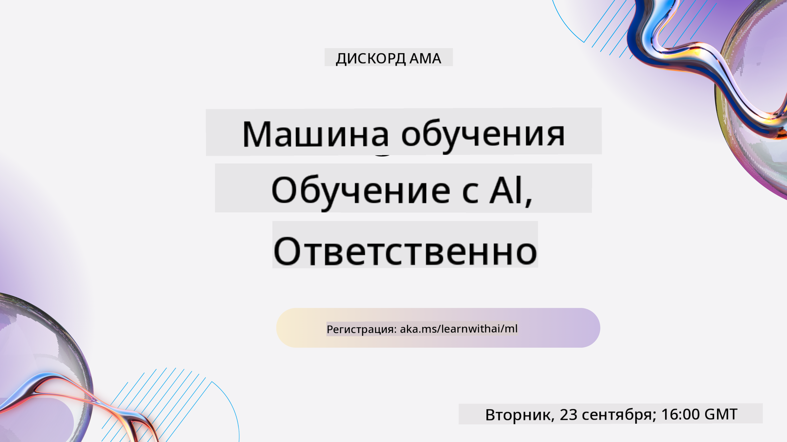

<!--
CO_OP_TRANSLATOR_METADATA:
{
  "original_hash": "7a13afb3674838f557d61f8d67e4d5f8",
  "translation_date": "2025-10-24T08:52:16+00:00",
  "source_file": "README.md",
  "language_code": "ru"
}
-->

### 🌐 Поддержка нескольких языков

#### Поддерживается через GitHub Action (автоматически и всегда актуально)

<!-- CO-OP TRANSLATOR LANGUAGES TABLE START -->
[Арабский](../ar/README.md) | [Бенгальский](../bn/README.md) | [Болгарский](../bg/README.md) | [Бирманский (Мьянма)](../my/README.md) | [Китайский (упрощенный)](../zh/README.md) | [Китайский (традиционный, Гонконг)](../hk/README.md) | [Китайский (традиционный, Макао)](../mo/README.md) | [Китайский (традиционный, Тайвань)](../tw/README.md) | [Хорватский](../hr/README.md) | [Чешский](../cs/README.md) | [Датский](../da/README.md) | [Голландский](../nl/README.md) | [Эстонский](../et/README.md) | [Финский](../fi/README.md) | [Французский](../fr/README.md) | [Немецкий](../de/README.md) | [Греческий](../el/README.md) | [Иврит](../he/README.md) | [Хинди](../hi/README.md) | [Венгерский](../hu/README.md) | [Индонезийский](../id/README.md) | [Итальянский](../it/README.md) | [Японский](../ja/README.md) | [Корейский](../ko/README.md) | [Литовский](../lt/README.md) | [Малайский](../ms/README.md) | [Маратхи](../mr/README.md) | [Непальский](../ne/README.md) | [Норвежский](../no/README.md) | [Персидский (фарси)](../fa/README.md) | [Польский](../pl/README.md) | [Португальский (Бразилия)](../br/README.md) | [Португальский (Португалия)](../pt/README.md) | [Панджаби (Гурмукхи)](../pa/README.md) | [Румынский](../ro/README.md) | [Русский](./README.md) | [Сербский (кириллица)](../sr/README.md) | [Словацкий](../sk/README.md) | [Словенский](../sl/README.md) | [Испанский](../es/README.md) | [Суахили](../sw/README.md) | [Шведский](../sv/README.md) | [Тагальский (Филиппины)](../tl/README.md) | [Тамильский](../ta/README.md) | [Тайский](../th/README.md) | [Турецкий](../tr/README.md) | [Украинский](../uk/README.md) | [Урду](../ur/README.md) | [Вьетнамский](../vi/README.md)
<!-- CO-OP TRANSLATOR LANGUAGES TABLE END -->

#### Присоединяйтесь к нашему сообществу

У нас проходит серия обучения с AI в Discord, узнайте больше и присоединяйтесь к нам на [Learn with AI Series](https://aka.ms/learnwithai/discord) с 18 по 30 сентября 2025 года. Вы узнаете советы и приемы использования GitHub Copilot для Data Science.

# Машинное обучение для начинающих - учебный курс

> 🌍 Путешествуйте по миру, изучая машинное обучение через призму мировых культур 🌍

Команда Cloud Advocates в Microsoft рада предложить 12-недельный курс из 26 уроков, посвященный **машинному обучению**. В этом курсе вы изучите то, что иногда называют **классическим машинным обучением**, используя в основном библиотеку Scikit-learn и избегая глубокого обучения, которое рассматривается в нашем [курсе "AI для начинающих"](https://aka.ms/ai4beginners). Также сочетайте эти уроки с нашим курсом ['Data Science для начинающих'](https://aka.ms/ds4beginners)!

Путешествуйте с нами по миру, применяя классические методы к данным из разных уголков планеты. Каждый урок включает предварительные и итоговые тесты, письменные инструкции для выполнения урока, решение, задание и многое другое. Наш подход, основанный на проектах, позволяет учиться через практику, что доказано способствует лучшему усвоению новых навыков.

**✍️ Огромная благодарность нашим авторам** Джен Лупер, Стивену Хауэллу, Франческе Лаззери, Томоми Имуре, Кэсси Бревиу, Дмитрию Сошникову, Крису Норингу, Анирбану Мукерджи, Орнелле Алтуньян, Рут Якобу и Эми Бойд

**🎨 Благодарность также нашим иллюстраторам** Томоми Имуре, Дасани Мадипалли и Джен Лупер

**🙏 Особая благодарность 🙏 нашим авторам, рецензентам и участникам контента из числа Microsoft Student Ambassador**, особенно Ришиту Дагли, Мухаммаду Сакибу Хану Инану, Рохану Раджу, Александру Петреску, Абхишеку Джайсвалу, Наврин Табассум, Иоану Самуиле и Снигдхе Агарвал

**🤩 Особая благодарность Microsoft Student Ambassadors Эрику Ванджау, Джаслин Сондхи и Видуши Гупте за уроки на R!**

# Начало работы

Следуйте этим шагам:
1. **Сделайте форк репозитория**: Нажмите кнопку "Fork" в правом верхнем углу этой страницы.
2. **Клонируйте репозиторий**:   `git clone https://github.com/microsoft/ML-For-Beginners.git`

> [найдите все дополнительные ресурсы для этого курса в нашей коллекции Microsoft Learn](https://learn.microsoft.com/en-us/collections/qrqzamz1nn2wx3?WT.mc_id=academic-77952-bethanycheum)

> 🔧 **Нужна помощь?** Ознакомьтесь с нашим [Руководством по устранению неполадок](TROUBLESHOOTING.md) для решения распространенных проблем с установкой, настройкой и выполнением уроков.

**[Студенты](https://aka.ms/student-page)**, чтобы использовать этот курс, сделайте форк всего репозитория в свой аккаунт GitHub и выполняйте упражнения самостоятельно или в группе:

- Начните с предварительного теста.
- Прочитайте лекцию и выполните задания, делая паузы и размышляя на каждом этапе проверки знаний.
- Постарайтесь создать проекты, понимая уроки, а не просто запуская код решения; однако этот код доступен в папках `/solution` в каждом проектно-ориентированном уроке.
- Пройдите итоговый тест.
- Выполните вызов.
- Выполните задание.
- После завершения группы уроков посетите [Доску обсуждений](https://github.com/microsoft/ML-For-Beginners/discussions) и "учитесь вслух", заполняя соответствующую рубрику PAT. PAT — это инструмент оценки прогресса, который вы заполняете для углубления своего обучения. Вы также можете реагировать на другие PAT, чтобы учиться вместе.

> Для дальнейшего изучения мы рекомендуем следовать этим [модулям и путям обучения Microsoft Learn](https://docs.microsoft.com/en-us/users/jenlooper-2911/collections/k7o7tg1gp306q4?WT.mc_id=academic-77952-leestott).

**Учителя**, мы [включили некоторые рекомендации](for-teachers.md) о том, как использовать этот курс.

---

## Видеообзоры

Некоторые уроки доступны в виде коротких видеороликов. Вы можете найти их в уроках или на [плейлисте ML для начинающих на YouTube-канале Microsoft Developer](https://aka.ms/ml-beginners-videos), нажав на изображение ниже.

---

## Знакомьтесь с командой

**Gif создан** [Мохитом Джайсалом](https://linkedin.com/in/mohitjaisal)

> 🎥 Нажмите на изображение выше, чтобы посмотреть видео о проекте и людях, которые его создали!

---

## Педагогика

При создании этого курса мы выбрали два педагогических принципа: обеспечение того, чтобы он был практическим **проектно-ориентированным** и включал **частые тесты**. Кроме того, этот курс имеет общую **тему**, которая придает ему целостность.

Обеспечивая связь контента с проектами, процесс становится более увлекательным для студентов, а усвоение концепций усиливается. Кроме того, тест перед занятием задает студенту цель изучения темы, а второй тест после занятия обеспечивает дальнейшее усвоение. Этот курс был разработан как гибкий и увлекательный, его можно проходить полностью или частично. Проекты начинаются с простых и становятся все более сложными к концу 12-недельного цикла. Этот курс также включает постскриптум о реальных приложениях машинного обучения, который можно использовать как дополнительный материал или основу для обсуждения.

> Ознакомьтесь с нашим [Кодексом поведения](CODE_OF_CONDUCT.md), [Руководством по внесению изменений](CONTRIBUTING.md), [Руководством по переводу](TRANSLATIONS.md) и [Руководством по устранению неполадок](TROUBLESHOOTING.md). Мы приветствуем ваши конструктивные отзывы!

## Каждый урок включает

- необязательный скетчноут
- необязательное дополнительное видео
- видеообзор (только для некоторых уроков)
- [предварительный тест](https://ff-quizzes.netlify.app/en/ml/)
- письменный урок
- для проектно-ориентированных уроков, пошаговые инструкции по созданию проекта
- проверки знаний
- вызов
- дополнительное чтение
- задание
- [итоговый тест](https://ff-quizzes.netlify.app/en/ml/)

> **Примечание о языках**: Эти уроки в основном написаны на Python, но многие также доступны на R. Чтобы пройти урок на R, перейдите в папку `/solution` и найдите уроки на R. Они включают расширение .rmd, которое представляет собой **R Markdown** файл, который можно просто определить как объединение `фрагментов кода` (на R или других языках) и `YAML-заголовка` (который определяет, как форматировать выходные данные, такие как PDF) в `Markdown-документе`. Таким образом, он служит примерной авторской платформой для науки о данных, поскольку позволяет объединять ваш код, его вывод и ваши мысли, записывая их в Markdown. Более того, документы R Markdown могут быть преобразованы в выходные форматы, такие как PDF, HTML или Word.

> **Примечание о тестах**: Все тесты содержатся в [папке Quiz App](../../quiz-app), всего 52 теста по три вопроса каждый. Они связаны с уроками, но приложение для тестов можно запустить локально; следуйте инструкциям в папке `quiz-app`, чтобы запустить локально или развернуть в Azure.

| Номер урока |                             Тема                              |                   Группировка уроков                   | Цели обучения                                                                                                             |                                                              Связанный урок                                                               |                        Автор                        |
| :-----------: | :------------------------------------------------------------: | :-------------------------------------------------: | ------------------------------------------------------------------------------------------------------------------------------- | :--------------------------------------------------------------------------------------------------------------------------------------: | :--------------------------------------------------: |
|      01       |                Введение в машинное обучение                   |      [Введение](1-Introduction/README.md)           | Узнайте основные концепции машинного обучения                                                                                   |                                             [Урок](1-Introduction/1-intro-to-ML/README.md)                                              |                       Мухаммад                       |
|      02       |                История машинного обучения                     |      [Введение](1-Introduction/README.md)           | Узнайте историю, лежащую в основе этой области                                                                                  |                                            [Урок](1-Introduction/2-history-of-ML/README.md)                                             |                     Джен и Эми                       |
|      03       |                 Справедливость и машинное обучение            |      [Введение](1-Introduction/README.md)           | Какие важные философские вопросы о справедливости должны учитывать студенты при создании и применении моделей машинного обучения?|                                              [Урок](1-Introduction/3-fairness/README.md)                                                |                        Томоми                         |
|      04       |                Техники машинного обучения                     |      [Введение](1-Introduction/README.md)           | Какие техники используют исследователи для создания моделей машинного обучения?                                                 |                                          [Урок](1-Introduction/4-techniques-of-ML/README.md)                                            |                    Крис и Джен                       |
|      05       |                   Введение в регрессию                       |        [Регрессия](2-Regression/README.md)           | Начните работать с Python и Scikit-learn для моделей регрессии                                                                  |         [Python](2-Regression/1-Tools/README.md) • [R](../../2-Regression/1-Tools/solution/R/lesson_1.html)         |      Джен • Эрик Ванжау       |
|      06       |                Цены на тыквы в Северной Америке 🎃            |        [Регрессия](2-Regression/README.md)           | Визуализируйте и очистите данные для подготовки к машинному обучению                                                            |          [Python](2-Regression/2-Data/README.md) • [R](../../2-Regression/2-Data/solution/R/lesson_2.html)          |      Джен • Эрик Ванжау       |
|      07       |                Цены на тыквы в Северной Америке 🎃            |        [Регрессия](2-Regression/README.md)           | Постройте модели линейной и полиномиальной регрессии                                                                            |        [Python](2-Regression/3-Linear/README.md) • [R](../../2-Regression/3-Linear/solution/R/lesson_3.html)        |      Джен и Дмитрий • Эрик Ванжау       |
|      08       |                Цены на тыквы в Северной Америке 🎃            |        [Регрессия](2-Regression/README.md)           | Постройте модель логистической регрессии                                                                                        |     [Python](2-Regression/4-Logistic/README.md) • [R](../../2-Regression/4-Logistic/solution/R/lesson_4.html)      |      Джен • Эрик Ванжау       |
|      09       |                          Веб-приложение 🔌                    |           [Веб-приложение](3-Web-App/README.md)      | Создайте веб-приложение для использования вашей обученной модели                                                                |                                                 [Python](3-Web-App/1-Web-App/README.md)                                                  |                         Джен                          |
|      10       |                 Введение в классификацию                     |    [Классификация](4-Classification/README.md)       | Очистите, подготовьте и визуализируйте данные; введение в классификацию                                                         | [Python](4-Classification/1-Introduction/README.md) • [R](../../4-Classification/1-Introduction/solution/R/lesson_10.html)  | Джен и Кэсси • Эрик Ванжау |
|      11       |             Вкусные азиатские и индийские блюда 🍜            |    [Классификация](4-Classification/README.md)       | Введение в классификаторы                                                                                                       | [Python](4-Classification/2-Classifiers-1/README.md) • [R](../../4-Classification/2-Classifiers-1/solution/R/lesson_11.html) | Джен и Кэсси • Эрик Ванжау |
|      12       |             Вкусные азиатские и индийские блюда 🍜            |    [Классификация](4-Classification/README.md)       | Дополнительные классификаторы                                                                                                   | [Python](4-Classification/3-Classifiers-2/README.md) • [R](../../4-Classification/3-Classifiers-2/solution/R/lesson_12.html) | Джен и Кэсси • Эрик Ванжау |
|      13       |             Вкусные азиатские и индийские блюда 🍜            |    [Классификация](4-Classification/README.md)       | Создайте веб-приложение рекомендаций, используя вашу модель                                                                      |                                              [Python](4-Classification/4-Applied/README.md)                                              |                         Джен                          |
|      14       |                   Введение в кластеризацию                   |        [Кластеризация](5-Clustering/README.md)       | Очистите, подготовьте и визуализируйте данные; введение в кластеризацию                                                         |         [Python](5-Clustering/1-Visualize/README.md) • [R](../../5-Clustering/1-Visualize/solution/R/lesson_14.html)         |      Джен • Эрик Ванжау       |
|      15       |              Исследование музыкальных вкусов Нигерии 🎧       |        [Кластеризация](5-Clustering/README.md)       | Изучите метод кластеризации K-Means                                                                                            |           [Python](5-Clustering/2-K-Means/README.md) • [R](../../5-Clustering/2-K-Means/solution/R/lesson_15.html)           |      Джен • Эрик Ванжау       |
|      16       |        Введение в обработку естественного языка ☕️          |   [Обработка естественного языка](6-NLP/README.md)   | Узнайте основы обработки естественного языка, создавая простого бота                                                            |                                             [Python](6-NLP/1-Introduction-to-NLP/README.md)                                              |                       Стивен                         |
|      17       |                      Общие задачи NLP ☕️                     |   [Обработка естественного языка](6-NLP/README.md)   | Углубите свои знания NLP, изучая общие задачи, связанные с языковыми структурами                                                |                                                    [Python](6-NLP/2-Tasks/README.md)                                                     |                       Стивен                         |
|      18       |             Перевод и анализ настроений ♥️                   |   [Обработка естественного языка](6-NLP/README.md)   | Перевод и анализ настроений с произведениями Джейн Остин                                                                        |                                            [Python](6-NLP/3-Translation-Sentiment/README.md)                                             |                       Стивен                         |
|      19       |                  Романтические отели Европы ♥️               |   [Обработка естественного языка](6-NLP/README.md)   | Анализ настроений с отзывами об отелях, часть 1                                                                                 |                                               [Python](6-NLP/4-Hotel-Reviews-1/README.md)                                                |                       Стивен                         |
|      20       |                  Романтические отели Европы ♥️               |   [Обработка естественного языка](6-NLP/README.md)   | Анализ настроений с отзывами об отелях, часть 2                                                                                 |                                               [Python](6-NLP/5-Hotel-Reviews-2/README.md)                                                |                       Стивен                         |
|      21       |            Введение в прогнозирование временных рядов        |        [Временные ряды](7-TimeSeries/README.md)      | Введение в прогнозирование временных рядов                                                                                      |                                             [Python](7-TimeSeries/1-Introduction/README.md)                                              |                      Франческа                       |
|      22       | ⚡️ Использование электроэнергии в мире ⚡️ - прогнозирование временных рядов с ARIMA |        [Временные ряды](7-TimeSeries/README.md)      | Прогнозирование временных рядов с использованием ARIMA                                                                          |                                                 [Python](7-TimeSeries/2-ARIMA/README.md)                                                 |                      Франческа                       |
|      23       |  ⚡️ Использование электроэнергии в мире ⚡️ - прогнозирование временных рядов с SVR  |        [Временные ряды](7-TimeSeries/README.md)      | Прогнозирование временных рядов с использованием регрессора опорных векторов                                                    |                                                  [Python](7-TimeSeries/3-SVR/README.md)                                                  |                       Анирбан                         |
|      24       |             Введение в обучение с подкреплением              | [Обучение с подкреплением](8-Reinforcement/README.md)| Введение в обучение с подкреплением с использованием Q-Learning                                                                 |                                             [Python](8-Reinforcement/1-QLearning/README.md)                                              |                        Дмитрий                        |
|      25       |                 Помогите Петру избежать волка! 🐺            | [Обучение с подкреплением](8-Reinforcement/README.md)| Обучение с подкреплением в Gym                                                                                                  |                                                [Python](8-Reinforcement/2-Gym/README.md)                                                 |                        Дмитрий                        |
|  Постскриптум |            Реальные сценарии и приложения ML                 |      [ML в реальном мире](9-Real-World/README.md)    | Интересные и показательные реальные приложения классического машинного обучения                                                  |                                             [Урок](9-Real-World/1-Applications/README.md)                                               |                         Команда                      |
|  Постскриптум |            Отладка моделей ML с использованием панели RAI    |      [ML в реальном мире](9-Real-World/README.md)    | Отладка моделей машинного обучения с использованием компонентов панели Responsible AI                                           |                                             [Урок](9-Real-World/2-Debugging-ML-Models/README.md)                                              |                         Рут Якобу                       |

> [найдите все дополнительные ресурсы для этого курса в нашей коллекции Microsoft Learn](https://learn.microsoft.com/en-us/collections/qrqzamz1nn2wx3?WT.mc_id=academic-77952-bethanycheum)

## Оффлайн-доступ

Вы можете использовать эту документацию оффлайн с помощью [Docsify](https://docsify.js.org/#/). Форкните этот репозиторий, [установите Docsify](https://docsify.js.org/#/quickstart) на вашем локальном компьютере, а затем в корневой папке этого репозитория введите `docsify serve`. Веб-сайт будет доступен на порту 3000 вашего локального хоста: `localhost:3000`.

## PDF-файлы

Найдите PDF-версию учебного плана с ссылками [здесь](https://microsoft.github.io/ML-For-Beginners/pdf/readme.pdf).

## 🎒 Другие курсы 

Наша команда создает и другие курсы! Ознакомьтесь:

### Azure / Edge / MCP / Agents

---

### Серия по генеративному ИИ

[-9333EA?style=for-the-badge&labelColor=E5E7EB&color=9333EA)](https://github.com/microsoft/Generative-AI-for-beginners-dotnet?WT.mc_id=academic-105485-koreyst)
[-C084FC?style=for-the-badge&labelColor=E5E7EB&color=C084FC)](https://github.com/microsoft/generative-ai-for-beginners-java?WT.mc_id=academic-105485-koreyst)
[-E879F9?style=for-the-badge&labelColor=E5E7EB&color=E879F9)](https://github.com/microsoft/generative-ai-with-javascript?WT.mc_id=academic-105485-koreyst)

---

### Основное обучение
  
  
  
  
  
  
  

---

### Серия Copilot  
  
  
  
<!-- CO-OP TRANSLATOR OTHER COURSES END -->

## Получение помощи  

Если вы столкнулись с трудностями или у вас есть вопросы о создании приложений на основе AI, присоединяйтесь:  

  

Если у вас есть отзывы о продукте или возникли ошибки при разработке, посетите:  

  

---

**Отказ от ответственности**:  
Этот документ был переведен с использованием сервиса автоматического перевода [Co-op Translator](https://github.com/Azure/co-op-translator). Несмотря на наши усилия обеспечить точность, автоматические переводы могут содержать ошибки или неточности. Оригинальный документ на его родном языке следует считать авторитетным источником. Для получения критически важной информации рекомендуется профессиональный перевод человеком. Мы не несем ответственности за любые недоразумения или неправильные интерпретации, возникшие в результате использования данного перевода.