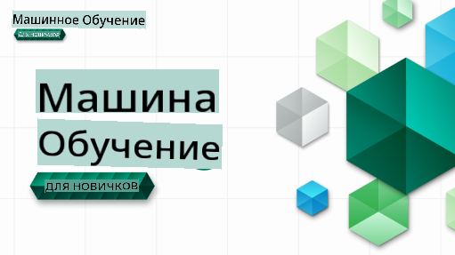

# Машинное обучение для начинающих - Учебная программа

> 🌍 Путешествуйте по миру, изучая машинное обучение через призму культур разных стран 🌍

Облачные адвокаты Microsoft рады представить 12-недельную учебную программу из 26 уроков, посвященную **машинному обучению**. В этой программе вы узнаете о том, что иногда называют **классическим машинным обучением**, используя в основном библиотеку Scikit-learn и избегая глубокого обучения, которое рассматривается в нашей [программе для начинающих по ИИ](https://aka.ms/ai4beginners). Также сочетайте эти уроки с нашей программой ['Наука о данных для начинающих'](https://aka.ms/ds4beginners)!

Путешествуйте с нами по миру, применяя эти классические методы к данным из разных уголков планеты. Каждый урок включает в себя тесты до и после занятия, письменные инструкции для выполнения урока, решение, задание и многое другое. Наша проектная методика обучения позволяет вам учиться, создавая, что является проверенным способом закрепления новых навыков.

**✍️ Огромная благодарность нашим авторам** Джен Лупер, Стивену Хауэллу, Франческе Лаццери, Томоми Имура, Кэсси Бревиу, Дмитрию Сошникову, Крису Норингу, Анирбану Мукерджи, Орнелле Алтунян, Рут Якубу и Эми Бойд

**🎨 Также благодарим наших иллюстраторов** Томоми Имура, Дасани Мадипалли и Джен Лупер

**🙏 Особая благодарность 🙏 нашим авторам, рецензентам и контрибьюторам Microsoft Student Ambassador**, в частности Ришиту Дагли, Мухаммаду Сакибу Хану Инану, Рохану Раджу, Александру Петреску, Абхишеку Джаисвалу, Наурину Табассу, Иоану Самуила и Снигдхе Агарвал

**🤩 Дополнительная благодарность Microsoft Student Ambassadors Эрику Ванджау, Джаслин Сонди и Видуши Гупте за наши уроки по R!**

# Начало работы

Следуйте этим шагам:
1. **Создайте форк репозитория**: Нажмите на кнопку "Fork" в правом верхнем углу этой страницы.
2. **Клонируйте репозиторий**:   `git clone https://github.com/microsoft/ML-For-Beginners.git`

> [найдите все дополнительные ресурсы для этого курса в нашей коллекции Microsoft Learn](https://learn.microsoft.com/en-us/collections/qrqzamz1nn2wx3?WT.mc_id=academic-77952-bethanycheum)

**[Студенты](https://aka.ms/student-page)**, чтобы использовать эту учебную программу, создайте форк всего репозитория на своем аккаунте GitHub и выполняйте задания самостоятельно или в группе:

- Начните с теста перед лекцией.
- Прочитайте лекцию и выполните задания, останавливаясь и размышляя на каждом этапе проверки знаний.
- Постарайтесь создать проекты, понимая уроки, а не просто запуская код решения; однако этот код доступен в папках `/solution` в каждом проектном уроке.
- Пройдите тест после лекции.
- Выполните задание.
- После завершения группы уроков посетите [Доску обсуждений](https://github.com/microsoft/ML-For-Beginners/discussions) и "учитесь вслух", заполнив соответствующую рубрику PAT. 'PAT' — это инструмент оценки прогресса, который представляет собой рубрику, которую вы заполняете для дальнейшего обучения. Вы также можете реагировать на другие PAT, чтобы мы могли учиться вместе.

> Для дальнейшего изучения мы рекомендуем следовать этим модулям и учебным путям [Microsoft Learn](https://docs.microsoft.com/en-us/users/jenlooper-2911/collections/k7o7tg1gp306q4?WT.mc_id=academic-77952-leestott).

**Учителя**, мы [включили некоторые рекомендации](for-teachers.md) о том, как использовать эту учебную программу.

---

## Видеоуроки

Некоторые уроки доступны в формате коротких видео. Вы можете найти все эти видео в уроках или на [плейлисте ML для начинающих на канале Microsoft Developer YouTube](https://aka.ms/ml-beginners-videos), кликнув на изображение ниже.

---

## Знакомьтесь с командой

**Gif от** [Мохита Джайсала](https://linkedin.com/in/mohitjaisal)

> 🎥 Нажмите на изображение выше, чтобы посмотреть видео о проекте и о людях, которые его создали!

---

## Методология

При создании этой учебной программы мы выбрали два педагогических принципа: обеспечить практическое **проектное** обучение и включить **частые тесты**. Кроме того, в этой программе есть общая **тематика**, которая придает ей связность.

Обеспечивая соответствие содержания проектам, процесс становится более увлекательным для студентов, а усвоение концепций усиливается. Кроме того, тест с низкими ставками перед занятием задает намерение студента к изучению темы, в то время как второй тест после занятия обеспечивает дальнейшее усвоение. Эта программа была разработана, чтобы быть гибкой и увлекательной, и ее можно проходить полностью или частично. Проекты начинаются с простых и становятся все более сложными к концу 12-недельного цикла. Эта программа также включает постскриптум о реальных приложениях машинного обучения, который можно использовать как дополнительный кредит или как основу для обсуждения.

> Найдите наш [Кодекс поведения](CODE_OF_CONDUCT.md), [Руководство по участию](CONTRIBUTING.md) и [Руководство по переводу](TRANSLATIONS.md). Мы приветствуем вашу конструктивную обратную связь!

## Каждый урок включает

- необязательная схема
- необязательное дополнительное видео
- видеопроход (только некоторые уроки)
- разминка перед лекцией
- письменный урок
- для проектных уроков пошаговые инструкции по созданию проекта
- проверки знаний
- задание
- дополнительное чтение
- домашнее задание
- тест после лекции

> **Примечание о языках**: Эти уроки в основном написаны на Python, но многие из них также доступны на R. Чтобы завершить урок по R, перейдите в папку `/solution` и найдите уроки по R. Они имеют расширение .rmd, которое представляет собой файл **R Markdown**, который можно просто определить как встраивание `code chunks` (на R или других языках) и `YAML header` (который указывает, как форматировать выходные данные, такие как PDF) в `Markdown document`. Таким образом, он служит образцовым фреймворком для написания для науки о данных, поскольку позволяет вам комбинировать ваш код, его выходные данные и ваши мысли, позволяя записывать их в Markdown. Более того, документы R Markdown могут быть преобразованы в форматы вывода, такие как PDF, HTML или Word.

> **Примечание о тестах**: Все тесты содержатся в [папке Quiz App](../../quiz-app), всего 52 теста по три вопроса каждый. Они связаны с уроками, но приложение для тестирования можно запустить локально; следуйте инструкциям в папке `quiz-app`, чтобы локально разместить или развернуть в Azure.

| Номер урока |                             Тема                              |                   Группировка уроков                   | Цели обучения                                                                                                             |                                                              Связанный урок                                                               |                        Автор                        |
| :---------: | :------------------------------------------------------------: | :-----------------------------------------------------: | ----------------------------------------------------------------------------------------------------------------------- | :--------------------------------------------------------------------------------------------------------------------------------------: | :--------------------------------------------------: |
|      01     |                Введение в машинное обучение                   |      [Введение](1-Introduction/README.md)              | Узнать основные концепции машинного обучения                                                                            |                                             [Урок](1-Introduction/1-intro-to-ML/README.md)                                             |                       Мухаммад                       |
|      02     |                История машинного обучения                      |      [Введение](1-Introduction/README.md)              | Узнать историю, лежащую в основе этой области                                                                           |                                            [Урок](1-Introduction/2-history-of-ML/README.md)                                            |                     Джен и Эми                      |
|      03     |                 Справедливость и машинное обучение            |      [Введение](1-Introduction/README.md)              | Какие важные философские вопросы о справедливости студенты должны учитывать при создании и применении моделей ML?       |                                              [Урок](1-Introduction/3-fairness/README.md)                                               |                        Томоми                        |
|      04       |                Техники машинного обучения                 |      [Введение](1-Introduction/README.md)       | Какие техники используют исследователи машинного обучения для построения моделей?                                                                       |                                          [Урок](1-Introduction/4-techniques-of-ML/README.md)                                           |                    Крис и Джен                     |
|      05       |                   Введение в регрессию                   |        [Регрессия](2-Regression/README.md)         | Начните работать с Python и Scikit-learn для регрессионных моделей                                                                  |         <ul><li>[Python](2-Regression/1-Tools/README.md)</li><li>[R](../../2-Regression/1-Tools/solution/R/lesson_1.html)</li></ul>         |      <ul><li>Джен</li><li>Эрик Уанджау</li></ul>       |
|      06       |                Цены на тыквы в Северной Америке 🎃                |        [Регрессия](2-Regression/README.md)         | Визуализируйте и очистите данные в подготовке к машинному обучению                                                                                  |          <ul><li>[Python](2-Regression/2-Data/README.md)</li><li>[R](../../2-Regression/2-Data/solution/R/lesson_2.html)</li></ul>          |      <ul><li>Джен</li><li>Эрик Уанджау</li></ul>       |
|      07       |                Цены на тыквы в Северной Америке 🎃                |        [Регрессия](2-Regression/README.md)         | Постройте линейные и полиномиальные регрессионные модели                                                                                   |        <ul><li>[Python](2-Regression/3-Linear/README.md)</li><li>[R](../../2-Regression/3-Linear/solution/R/lesson_3.html)</li></ul>        |      <ul><li>Джен и Дмитрий</li><li>Эрик Уанджау</li></ul>       |
|      08       |                Цены на тыквы в Северной Америке 🎃                |        [Регрессия](2-Regression/README.md)         | Постройте логистическую регрессионную модель                                                                                               |     <ul><li>[Python](2-Regression/4-Logistic/README.md) </li><li>[R](../../2-Regression/4-Logistic/solution/R/lesson_4.html)</li></ul>      |      <ul><li>Джен</li><li>Эрик Уанджау</li></ul>       |
|      09       |                          Веб-приложение 🔌                          |           [Веб-приложение](3-Web-App/README.md)            | Создайте веб-приложение для использования вашей обученной модели                                                                                       |                                                 [Python](3-Web-App/1-Web-App/README.md)                                                  |                         Джен                          |
|      10       |                 Введение в классификацию                 |    [Классификация](4-Classification/README.md)     | Очистите, подготовьте и визуализируйте ваши данные; введение в классификацию                                                            | <ul><li> [Python](4-Classification/1-Introduction/README.md) </li><li>[R](../../4-Classification/1-Introduction/solution/R/lesson_10.html)  | <ul><li>Джен и Кэсси</li><li>Эрик Уанджау</li></ul> |
|      11       |             Вкусные азиатские и индийские кухни 🍜             |    [Классификация](4-Classification/README.md)     | Введение в классификаторы                                                                                                     | <ul><li> [Python](4-Classification/2-Classifiers-1/README.md)</li><li>[R](../../4-Classification/2-Classifiers-1/solution/R/lesson_11.html) | <ul><li>Джен и Кэсси</li><li>Эрик Уанджау</li></ul> |
|      12       |             Вкусные азиатские и индийские кухни 🍜             |    [Классификация](4-Classification/README.md)     | Больше классификаторов                                                                                                                | <ul><li> [Python](4-Classification/3-Classifiers-2/README.md)</li><li>[R](../../4-Classification/3-Classifiers-2/solution/R/lesson_12.html) | <ul><li>Джен и Кэсси</li><li>Эрик Уанджау</li></ul> |
|      13       |             Вкусные азиатские и индийские кухни 🍜             |    [Классификация](4-Classification/README.md)     | Создайте веб-приложение-рекомендатель, используя вашу модель                                                                                    |                                              [Python](4-Classification/4-Applied/README.md)                                              |                         Джен                          |
|      14       |                   Введение в кластеризацию                   |        [Кластеризация](5-Clustering/README.md)         | Очистите, подготовьте и визуализируйте ваши данные; введение в кластеризацию                                                                |         <ul><li> [Python](5-Clustering/1-Visualize/README.md)</li><li>[R](../../5-Clustering/1-Visualize/solution/R/lesson_14.html)         |      <ul><li>Джен</li><li>Эрик Уанджау</li></ul>       |
|      15       |              Изучение музыкальных предпочтений Нигерии 🎧              |        [Кластеризация](5-Clustering/README.md)         | Изучите метод кластеризации K-Means                                                                                           |           <ul><li> [Python](5-Clustering/2-K-Means/README.md)</li><li>[R](../../5-Clustering/2-K-Means/solution/R/lesson_15.html)           |      <ul><li>Джен</li><li>Эрик Ванджау</li></ul>       |
|      16       |        Введение в обработку естественного языка ☕️         |   [Обработка естественного языка](6-NLP/README.md)    | Узнайте основы NLP, создавая простого бота                                                                             |                                             [Python](6-NLP/1-Introduction-to-NLP/README.md)                                              |                       Стивен                        |
|      17       |                      Общие задачи NLP ☕️                      |   [Обработка естественного языка](6-NLP/README.md)    | Углубите свои знания в NLP, понимая общие задачи, связанные с языковыми структурами                          |                                                    [Python](6-NLP/2-Tasks/README.md)                                                     |                       Стивен                        |
|      18       |             Перевод и анализ настроений ♥️              |   [Обработка естественного языка](6-NLP/README.md)    | Перевод и анализ настроений с Джейн Остин                                                                             |                                            [Python](6-NLP/3-Translation-Sentiment/README.md)                                             |                       Стивен                        |
|      19       |                  Романтические отели Европы ♥️                  |   [Обработка естественного языка](6-NLP/README.md)    | Анализ настроений по отзывам об отелях 1                                                                                         |                                               [Python](6-NLP/4-Hotel-Reviews-1/README.md)                                                |                       Стивен                        |
|      20       |                  Романтические отели Европы ♥️                  |   [Обработка естественного языка](6-NLP/README.md)    | Анализ настроений по отзывам об отелях 2                                                                                         |                                               [Python](6-NLP/5-Hotel-Reviews-2/README.md)                                                |                       Стивен                        |
|      21       |            Введение в прогнозирование временных рядов             |        [Временные ряды](7-TimeSeries/README.md)        | Введение в прогнозирование временных рядов                                                                                         |                                             [Python](7-TimeSeries/1-Introduction/README.md)                                              |                      Франческа                       |
|      22       | ⚡️ Использование энергии в мире ⚡️ - прогнозирование временных рядов с ARIMA |        [Временные ряды](7-TimeSeries/README.md)        | Прогнозирование временных рядов с помощью ARIMA                                                                                              |                                                 [Python](7-TimeSeries/2-ARIMA/README.md)                                                 |                      Франческа                       |
|      23       |  ⚡️ Использование энергии в мире ⚡️ - прогнозирование временных рядов с SVR  |        [Временные ряды](7-TimeSeries/README.md)        | Прогнозирование временных рядов с помощью регрессора на основе опорных векторов                                                                           |                                                  [Python](7-TimeSeries/3-SVR/README.md)                                                  |                       Анибан                        |
|      24       |             Введение в обучение с подкреплением             | [Обучение с подкреплением](8-Reinforcement/README.md) | Введение в обучение с подкреплением с использованием Q-Learning                                                                          |                                             [Python](8-Reinforcement/1-QLearning/README.md)                                              |                        Дмитрий                        |
|      25       |                 Помогите Питеру избежать волка! 🐺                  | [Обучение с подкреплением](8-Reinforcement/README.md) | Гимнастика для обучения с подкреплением                                                                                                      |                                                [Python](8-Reinforcement/2-Gym/README.md)                                                 |                        Дмитрий                        |
|  Постскриптум   |            Реальные сценарии и приложения машинного обучения            |      [Машинное обучение в реальной жизни](9-Real-World/README.md)       | Интересные и показательные реальные приложения классического машинного обучения                                                               |                                             [Урок](9-Real-World/1-Applications/README.md)                                              |                         Команда                         |
|  Постскриптум   |            Отладка моделей машинного обучения с использованием панели управления RAI          |      [Машинное обучение в реальной жизни](9-Real-World/README.md)       | Отладка моделей машинного обучения с использованием компонентов панели управления Ответственного ИИ                                                              |                                             [Урок](9-Real-World/2-Debugging-ML-Models/README.md)                                              |                         Рут Якобу                       |

> [найдите все дополнительные ресурсы для этого курса в нашей коллекции Microsoft Learn](https://learn.microsoft.com/en-us/collections/qrqzamz1nn2wx3?WT.mc_id=academic-77952-bethanycheum)

## Офлайн доступ

Вы можете использовать эту документацию в офлайн-режиме, воспользовавшись [Docsify](https://docsify.js.org/#/). Форкните этот репозиторий, [установите Docsify](https://docsify.js.org/#/quickstart) на своем локальном компьютере, а затем в корневой папке этого репозитория введите `docsify serve`. Веб-сайт будет доступен на порту 3000 на вашем локальном хосте: `localhost:3000`.

## PDF-файлы
Найдите PDF-версию учебного плана с ссылками [здесь](https://microsoft.github.io/ML-For-Beginners/pdf/readme.pdf).

## Требуется помощь

Хотите внести свой вклад в перевод? Пожалуйста, прочитайте наши [руководства по переводу](TRANSLATIONS.md) и добавьте шаблонный запрос для управления рабочей нагрузкой [здесь](https://github.com/microsoft/ML-For-Beginners/issues).

## Другие учебные планы

Наша команда разрабатывает и другие учебные планы! Ознакомьтесь с:

- [AI для начинающих](https://aka.ms/ai4beginners)
- [Наука о данных для начинающих](https://aka.ms/datascience-beginners)
- [**Новая версия 2.0** - Генеративный ИИ для начинающих](https://aka.ms/genai-beginners)
- [**НОВИНКА** Кибербезопасность для начинающих](https://github.com/microsoft/Security-101??WT.mc_id=academic-96948-sayoung)
- [Веб-разработка для начинающих](https://aka.ms/webdev-beginners)
- [IoT для начинающих](https://aka.ms/iot-beginners)
- [Машинное обучение для начинающих](https://aka.ms/ml4beginners)
- [Разработка XR для начинающих](https://aka.ms/xr-dev-for-beginners)
- [Мастерство GitHub Copilot для парного программирования ИИ](https://aka.ms/GitHubCopilotAI)

**Отказ от ответственности**:  
Этот документ был переведен с использованием услуг машинного перевода на основе ИИ. Хотя мы стремимся к точности, имейте в виду, что автоматические переводы могут содержать ошибки или неточности. Оригинальный документ на его родном языке следует считать авторитетным источником. Для критически важной информации рекомендуется профессиональный человеческий перевод. Мы не несем ответственности за любые недоразумения или неправильные интерпретации, возникающие в результате использования этого перевода.