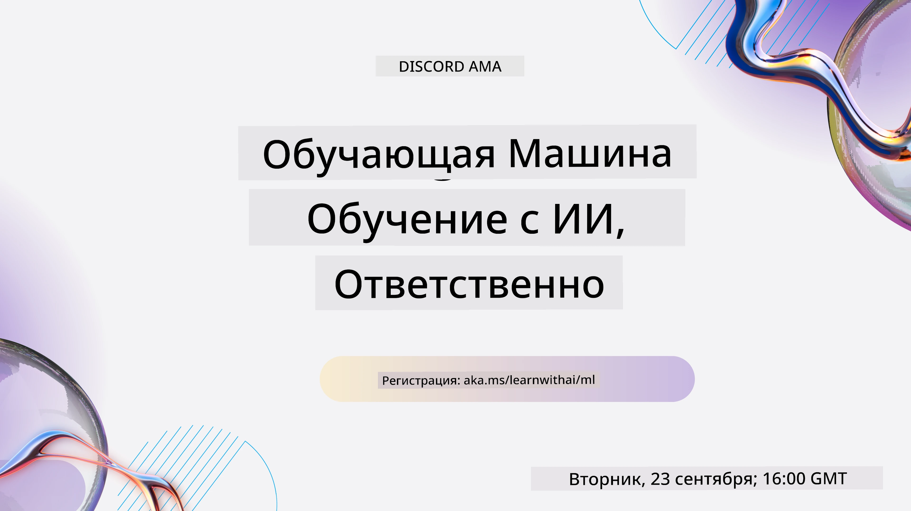
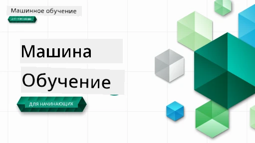

[](https://github.com/microsoft/ML-For-Beginners/blob/master/LICENSE)
[](https://GitHub.com/microsoft/ML-For-Beginners/graphs/contributors/)
[](https://GitHub.com/microsoft/ML-For-Beginners/issues/)
[](https://GitHub.com/microsoft/ML-For-Beginners/pulls/)
[](http://makeapullrequest.com)

[](https://GitHub.com/microsoft/ML-For-Beginners/watchers/)
[](https://GitHub.com/microsoft/ML-For-Beginners/network/)
[](https://GitHub.com/microsoft/ML-For-Beginners/stargazers/)

### 🌐 Поддержка нескольких языков

#### Поддержка через GitHub Action (автоматически и всегда актуально)

<!-- CO-OP TRANSLATOR LANGUAGES TABLE START -->
[Арабский](../ar/README.md) | [Бенгальский](../bn/README.md) | [Болгарский](../bg/README.md) | [Бирманский (Мьянма)](../my/README.md) | [Китайский (упрощённый)](../zh-CN/README.md) | [Китайский (традиционный, Гонконг)](../zh-HK/README.md) | [Китайский (традиционный, Макао)](../zh-MO/README.md) | [Китайский (традиционный, Тайвань)](../zh-TW/README.md) | [Хорватский](../hr/README.md) | [Чешский](../cs/README.md) | [Датский](../da/README.md) | [Нидерландский](../nl/README.md) | [Эстонский](../et/README.md) | [Финский](../fi/README.md) | [Французский](../fr/README.md) | [Немецкий](../de/README.md) | [Греческий](../el/README.md) | [Иврит](../he/README.md) | [Хинди](../hi/README.md) | [Венгерский](../hu/README.md) | [Индонезийский](../id/README.md) | [Итальянский](../it/README.md) | [Японский](../ja/README.md) | [Каннада](../kn/README.md) | [Кхмерский](../km/README.md) | [Корейский](../ko/README.md) | [Литовский](../lt/README.md) | [Малайский](../ms/README.md) | [Малаялам](../ml/README.md) | [Маратхи](../mr/README.md) | [Непальский](../ne/README.md) | [Нигерийский пиджин](../pcm/README.md) | [Норвежский](../no/README.md) | [Персидский (фарси)](../fa/README.md) | [Польский](../pl/README.md) | [Португальский (Бразилия)](../pt-BR/README.md) | [Португальский (Португалия)](../pt-PT/README.md) | [Пенджаби (гурмукхи)](../pa/README.md) | [Румынский](../ro/README.md) | [Русский](./README.md) | [Сербский (кириллица)](../sr/README.md) | [Словацкий](../sk/README.md) | [Словенский](../sl/README.md) | [Испанский](../es/README.md) | [Суахили](../sw/README.md) | [Шведский](../sv/README.md) | [Тагальский (филипо)](../tl/README.md) | [Тамильский](../ta/README.md) | [Телугу](../te/README.md) | [Тайский](../th/README.md) | [Турецкий](../tr/README.md) | [Украинский](../uk/README.md) | [Урду](../ur/README.md) | [Вьетнамский](../vi/README.md)

> **Предпочитаете клонировать локально?**
>
> В этом репозитории есть более 50 переводов, что существенно увеличивает размер загрузки. Чтобы клонировать без переводов, используйте sparse checkout:
>
> **Bash / macOS / Linux:**
> ```bash
> git clone --filter=blob:none --sparse https://github.com/microsoft/ML-For-Beginners.git
> cd ML-For-Beginners
> git sparse-checkout set --no-cone '/*' '!translations' '!translated_images'
> ```
>
> **CMD (Windows):**
> ```cmd
> git clone --filter=blob:none --sparse https://github.com/microsoft/ML-For-Beginners.git
> cd ML-For-Beginners
> git sparse-checkout set --no-cone "/*" "!translations" "!translated_images"
> ```
>
> Это даст вам всё необходимое для прохождения курса с намного более быстрой загрузкой.
<!-- CO-OP TRANSLATOR LANGUAGES TABLE END -->

#### Присоединяйтесь к нашему сообществу

[](https://discord.gg/nTYy5BXMWG)

У нас идет серия «Учись с ИИ» на Discord, узнавайте больше и присоединяйтесь к нам на [серии Learn with AI](https://aka.ms/learnwithai/discord) с 18 по 30 сентября 2025 года. Вы получите советы и трюки по использованию GitHub Copilot для Data Science.



# Машинное обучение для начинающих — учебная программа

> 🌍 Путешествуйте по миру, пока мы исследуем машинное обучение через культуры разных стран 🌍

Команда Cloud Advocates в Microsoft рада представить 12-недельную программу из 26 уроков, целиком посвящённую **машинному обучению**. В этой программе вы изучите то, что иногда называют **классическим машинным обучением**, используя преимущественно библиотеку Scikit-learn и избегая глубокого обучения, которое рассматривается в нашей [программе AI для начинающих](https://aka.ms/ai4beginners). Совмещайте эти уроки с нашей программой ['Data Science для начинающих'](https://aka.ms/ds4beginners)!

Путешествуйте вместе с нами по всему миру, применяя классические методы на данных из разных регионов. Каждый урок включает тесты до и после занятия, письменные инструкции по выполнению, решения, задания и многое другое. Наша проектная педагогика позволяет учиться, создавая проекты, что является проверенным способом усвоения новых навыков.

**✍️ Сердечная благодарность нашим авторам** Джен Лупер, Стивен Хауэлл, Франческа Лаццери, Томоми Имура, Кэсси Бревиу, Дмитрий Сошников, Крис Норинг, Анирбан Мукерджи, Орнелла Алтуньян, Рут Якубу и Эми Бойд

**🎨 Благодарности также нашим иллюстраторам** Томоми Имура, Дасани Мадипалли и Джен Лупер

**🙏 Особая благодарность 🙏 нашим студентам-амбассадорам Microsoft — авторам, рецензентам и контент-участникам**, в частности Ришиту Дагли, Мухаммаду Сакибу Хану Инану, Рохану Раджу, Александру Петреску, Абхишеку Джайсвалу, Наврин Табассум, Иоану Самуиле и Снидхе Агарвал

**🤩 Особая благодарность студентам-амбассадорам Microsoft Эрику Ванджау, Джаслин Сондхи и Видуши Гупте за наши уроки R!**

# Начало работы

Следуйте этим шагам:
1. **Ответвите репозиторий**: Нажмите кнопку «Fork» в верхнем правом углу этой страницы.
2. **Клонируйте репозиторий**: `git clone https://github.com/microsoft/ML-For-Beginners.git`

> 💡 **Совет для быстрого старта:** Хотите начать в браузере, не устанавливая Python локально? Используйте [GitHub Codespaces](https://github.com/features/codespaces) для создания облачной среды разработки для вашего форка. Откройте зелёное меню **Code**, выберите **Codespaces** и создайте codespace; при необходимости установите в нём зависимости каждого урока.

> [найдите все дополнительные ресурсы для этого курса в нашей коллекции Microsoft Learn](https://learn.microsoft.com/en-us/collections/qrqzamz1nn2wx3?WT.mc_id=academic-77952-bethanycheum)

> 🔧 **Нужна помощь?** Ознакомьтесь с нашим [руководством по устранению неполадок](TROUBLESHOOTING.md) для решения типичных проблем с установкой, настройкой и запуском уроков.


**[Студенты](https://aka.ms/student-page)**, чтобы использовать эту программу, сделайте fork всего репозитория на свой GitHub и выполняйте упражнения самостоятельно или в группе:

- Начните с опроса перед лекцией.
- Изучите лекцию и выполните задания, делая паузы и обдумывая каждый проверочный вопрос.
- Пытайтесь создавать проекты, понимая уроки, а не просто запуская готовый код; однако решения есть в папках `/solution` каждого проектного урока.
- Пройдите опрос после лекции.
- Выполните вызов.
- Выполните задание.
- После завершения группы уроков посетите [Дискуссионную доску](https://github.com/microsoft/ML-For-Beginners/discussions) и «обсуждайте вслух», заполняя соответствующую оценочную форму PAT. PAT — это инструмент оценки прогресса, форму которого вы заполняете для углубления обучения. Вы также можете реагировать на другие PAT, чтобы учиться вместе.

> Для дальнейшего изучения мы рекомендуем следовать этим модулям и учебным путям [Microsoft Learn](https://docs.microsoft.com/en-us/users/jenlooper-2911/collections/k7o7tg1gp306q4?WT.mc_id=academic-77952-leestott).

**Учителя**, мы [включили некоторые рекомендации](for-teachers.md) по использованию этой программы.

---

## Видео-инструкции

Некоторые уроки доступны в виде коротких видео. Вы можете найти их встроенными в уроки или на [плейлисте ML for Beginners на канале Microsoft Developer в YouTube](https://aka.ms/ml-beginners-videos), нажав на изображение ниже.

[](https://aka.ms/ml-beginners-videos)

---

## Встречайте команду

[](https://youtu.be/Tj1XWrDSYJU)

**Гифка от** [Mohit Jaisal](https://linkedin.com/in/mohitjaisal)

> 🎥 Нажмите на изображение выше, чтобы посмотреть видео о проекте и людях, которые его создали!

---

## Педагогика

При создании этой программы мы выбрали два педагогических принципа: обеспечение её практической **проектной** направленности и включение **частых тестов**. Кроме того, у программы есть общая **тема**, придающая ей целостность.

Совмещение содержания с проектами делает процесс для студентов более увлекательным и способствует лучшему усвоению концепций. Низконагрузочный тест перед занятием настраивает студента на изучение темы, а второй тест после занятия помогает закрепить материал. Эта программа разработана быть гибкой и интересной, её можно пройти полностью или частично. Проекты начинаются с простых и усложняются к концу 12-недельного цикла. В программе также есть послесловие о реальных применениях машинного обучения, которое можно использовать как дополнительный бонус или для обсуждения.

> Ознакомьтесь с нашими правилами [Кодекса поведения](CODE_OF_CONDUCT.md), [внесения вклада](CONTRIBUTING.md), [переводов](..) и [устранения проблем](TROUBLESHOOTING.md). Мы приветствуем ваши конструктивные отзывы!

## Каждый урок включает

- необязательные заметки-эскизы
- необязательное дополнительное видео
- видео-инструкцию (некоторые уроки)
- [подготовительный опрос перед лекцией](https://ff-quizzes.netlify.app/en/ml/)
- письменный урок
- для проектных уроков — пошаговые инструкции по созданию проекта
- проверочные вопросы
- вызов
- дополнительное чтение
- задание
- [опрос после лекции](https://ff-quizzes.netlify.app/en/ml/)

> **Замечание о языках**: Эти уроки преимущественно написаны на Python, но многие из них также доступны на R. Чтобы пройти урок на R, перейдите в папку `/solution` и найдите уроки на R. Они имеют расширение .rmd, что означает **R Markdown** — формат, который представляет собой встраивание `кодовых блоков` (R или других языков) и `YAML-заголовка` (который указывает, как форматировать вывод, например, в PDF) в `Markdown-документ`. Таким образом, это отличный инструмент для научных вычислений, позволяющий объединять ваш код, его вывод и заметки, записывая их в Markdown. Кроме того, документы R Markdown могут быть преобразованы в форматы вывода, такие как PDF, HTML или Word.

> **Замечание о тестах**: Все тесты находятся в папке [Quiz App](../../quiz-app), всего 52 теста по три вопроса каждый. Они связаны с уроками, но приложение для тестов можно запускать локально; следуйте инструкциям в папке `quiz-app` для локального хостинга или развертывания в Azure.

| Номер урока |                             Тема                              |                  Группа уроков                  | Цели обучения                                                                                                                 |                                                              Связанный урок                                                              |                     Автор                      |
| :-----------: | :------------------------------------------------------------: | :-------------------------------------------------: | ------------------------------------------------------------------------------------------------------------------------------- | :--------------------------------------------------------------------------------------------------------------------------------------: | :--------------------------------------------------: |
|      01       |                Введение в машинное обучение                |      [Introduction](1-Introduction/README.md)       | Изучите основные концепции машинного обучения                                                                                |                                             [Lesson](1-Introduction/1-intro-to-ML/README.md)                                             |                       Мухаммад                       |
|      02       |                История машинного обучения                 |      [Introduction](1-Introduction/README.md)       | Узнайте историю, лежащую в основе этой области                                                                                         |                                            [Lesson](1-Introduction/2-history-of-ML/README.md)                                            |                     Джен и Эми                      |
|      03       |                 Справедливость и машинное обучение                  |      [Introduction](1-Introduction/README.md)       | Какие важные философские вопросы справедливости следует учитывать студентам при создании и применении моделей МО? |                                              [Lesson](1-Introduction/3-fairness/README.md)                                               |                        Томоми                        |
|      04       |                Техники машинного обучения                 |      [Introduction](1-Introduction/README.md)       | Какие техники используют исследователи МО для построения моделей МО?                                                                       |                                          [Lesson](1-Introduction/4-techniques-of-ML/README.md)                                           |                    Крис и Джен                     |
|      05       |                   Введение в регрессию                   |        [Regression](2-Regression/README.md)         | Начните с Python и Scikit-learn для моделей регрессии                                                                  |         [Python](2-Regression/1-Tools/README.md) • [R](../../2-Regression/1-Tools/solution/R/lesson_1.html)         |      Джен • Эрик Ванджау       |
|      06       |                Цены на тыквы в Северной Америке 🎃                |        [Regression](2-Regression/README.md)         | Визуализируйте и очистите данные для подготовки к МО                                                                                  |          [Python](2-Regression/2-Data/README.md) • [R](../../2-Regression/2-Data/solution/R/lesson_2.html)          |      Джен • Эрик Ванджау       |
|      07       |                Цены на тыквы в Северной Америке 🎃                |        [Regression](2-Regression/README.md)         | Постройте линейные и полиномиальные регрессионные модели                                                                                   |        [Python](2-Regression/3-Linear/README.md) • [R](../../2-Regression/3-Linear/solution/R/lesson_3.html)        |      Джен и Дмитрий • Эрик Ванджау       |
|      08       |                Цены на тыквы в Северной Америке 🎃                |        [Regression](2-Regression/README.md)         | Постройте модель логистической регрессии                                                                                               |     [Python](2-Regression/4-Logistic/README.md) • [R](../../2-Regression/4-Logistic/solution/R/lesson_4.html)      |      Джен • Эрик Ванджау       |
|      09       |                          Веб-приложение 🔌                          |           [Web App](3-Web-App/README.md)            | Создайте веб-приложение для использования вашей обученной модели                                                                                       |                                                 [Python](3-Web-App/1-Web-App/README.md)                                                  |                         Джен                          |
|      10       |                 Введение в классификацию                 |    [Classification](4-Classification/README.md)     | Очистите, подготовьте и визуализируйте данные; введение в классификацию                                                            | [Python](4-Classification/1-Introduction/README.md) • [R](../../4-Classification/1-Introduction/solution/R/lesson_10.html)  | Джен и Кэсси • Эрик Ванджау |
|      11       |             Вкусная азиатская и индийская кухня 🍜             |    [Classification](4-Classification/README.md)     | Введение в классификаторы                                                                                                     | [Python](4-Classification/2-Classifiers-1/README.md) • [R](../../4-Classification/2-Classifiers-1/solution/R/lesson_11.html) | Джен и Кэсси • Эрик Ванджау |
|      12       |             Вкусная азиатская и индийская кухня 🍜             |    [Classification](4-Classification/README.md)     | Дополнительные классификаторы                                                                                                                | [Python](4-Classification/3-Classifiers-2/README.md) • [R](../../4-Classification/3-Classifiers-2/solution/R/lesson_12.html) | Джен и Кэсси • Эрик Ванджау |
|      13       |             Вкусная азиатская и индийская кухня 🍜             |    [Classification](4-Classification/README.md)     | Создайте рекомендательное веб-приложение, используя вашу модель                                                                                    |                                              [Python](4-Classification/4-Applied/README.md)                                              |                         Джен                          |
|      14       |                   Введение в кластеризацию                   |        [Clustering](5-Clustering/README.md)         | Очистите, подготовьте и визуализируйте данные; введение в кластеризацию                                                                |         [Python](5-Clustering/1-Visualize/README.md) • [R](../../5-Clustering/1-Visualize/solution/R/lesson_14.html)         |      Джен • Эрик Ванджау       |
|      15       |              Изучение музыкальных предпочтений Нигерии 🎧              |        [Clustering](5-Clustering/README.md)         | Изучите метод кластеризации K-средних                                                                                           |           [Python](5-Clustering/2-K-Means/README.md) • [R](../../5-Clustering/2-K-Means/solution/R/lesson_15.html)           |      Джен • Эрик Ванджау       |
|      16       |        Введение в обработку естественного языка ☕️         |   [Natural language processing](6-NLP/README.md)    | Изучите основы обработки естественного языка, создавая простого бота                                                                             |                                             [Python](6-NLP/1-Introduction-to-NLP/README.md)                                              |                       Стивен                        |
|      17       |                      Общие задачи NLP ☕️                      |   [Natural language processing](6-NLP/README.md)    | Углубите свои знания NLP, понимая общие задачи, необходимые при работе со структурами языка                          |                                                    [Python](6-NLP/2-Tasks/README.md)                                                     |                       Стивен                        |
|      18       |             Перевод и анализ настроений ♥️              |   [Natural language processing](6-NLP/README.md)    | Перевод и анализ настроений на примере Джейн Остин                                                                             |                                            [Python](6-NLP/3-Translation-Sentiment/README.md)                                             |                       Стивен                        |
|      19       |                  Романтические отели Европы ♥️                  |   [Natural language processing](6-NLP/README.md)    | Анализ настроений на основе отзывов об отелях 1                                                                                         |                                               [Python](6-NLP/4-Hotel-Reviews-1/README.md)                                                |                       Стивен                        |
|      20       |                  Романтические отели Европы ♥️                  |   [Natural language processing](6-NLP/README.md)    | Анализ настроений на основе отзывов об отелях 2                                                                                         |                                               [Python](6-NLP/5-Hotel-Reviews-2/README.md)                                                |                       Стивен                        |
|      21       |            Введение в прогнозирование временных рядов             |        [Time series](7-TimeSeries/README.md)        | Введение в прогнозирование временных рядов                                                                                         |                                             [Python](7-TimeSeries/1-Introduction/README.md)                                              |                      Франческа                       |
|      22       | ⚡️ Мировое потребление электроэнергии ⚡️ - прогнозирование временных рядов с ARIMA |        [Time series](7-TimeSeries/README.md)        | Прогнозирование временных рядов с помощью ARIMA                                                                                              |                                                 [Python](7-TimeSeries/2-ARIMA/README.md)                                                 |                      Франческа                       |
|      23       |  ⚡️ Мировое потребление электроэнергии ⚡️ - прогнозирование временных рядов с SVR  |        [Time series](7-TimeSeries/README.md)        | Прогнозирование временных рядов с помощью опорных векторов регрессии                                                                           |                                                  [Python](7-TimeSeries/3-SVR/README.md)                                                  |                       Анирбан                        |
|      24       |             Введение в обучение с подкреплением             | [Reinforcement learning](8-Reinforcement/README.md) | Введение в обучение с подкреплением с использованием Q-обучения                                                                          |                                             [Python](8-Reinforcement/1-QLearning/README.md)                                              |                        Дмитрий                        |
|      25       |                 Помоги Питеру избежать волка! 🐺                  | [Reinforcement learning](8-Reinforcement/README.md) | Обучение с подкреплением в среде Gym                                                                                                      |                                                [Python](8-Reinforcement/2-Gym/README.md)                                                 |                        Дмитрий                        |
|  Постскриптум   |            Реальные сценарии и применения МО            |      [ML in the Wild](9-Real-World/README.md)       | Интересные и познавательные реальные применения классического МО                                                               |                                             [Lesson](9-Real-World/1-Applications/README.md)                                              |                         Команда                         |
|  Постскриптум   |            Отладка моделей МО с использованием RAI dashboard            |      [ML in the Wild](9-Real-World/README.md)       | Отладка моделей машинного обучения с помощью компонентов рабочего стола Responsible AI                                                              |                                             [Lesson](9-Real-World/2-Debugging-ML-Models/README.md)                                              |                     Рут Якубу                      |

> [найдите все дополнительные ресурсы для этого курса в нашей коллекции Microsoft Learn](https://learn.microsoft.com/en-us/collections/qrqzamz1nn2wx3?WT.mc_id=academic-77952-bethanycheum)

## Оффлайн-доступ

Вы можете использовать эту документацию оффлайн с помощью [Docsify](https://docsify.js.org/#/). Форкните этот репозиторий, [установите Docsify](https://docsify.js.org/#/quickstart) на вашу локальную машину, а затем в корневой папке репозитория введите `docsify serve`. Веб-сайт будет запущен на порту 3000 вашего локального хоста: `localhost:3000`.

## PDF-файлы

Найдите PDF версию учебной программы с ссылками [здесь](https://microsoft.github.io/ML-For-Beginners/pdf/readme.pdf).


## 🎒 Другие курсы 

Наша команда выпускает и другие курсы! Посмотрите:

<!-- CO-OP TRANSLATOR OTHER COURSES START -->
### LangChain
[](https://aka.ms/langchain4j-for-beginners)
[](https://aka.ms/langchainjs-for-beginners?WT.mc_id=m365-94501-dwahlin)
[](https://github.com/microsoft/langchain-for-beginners?WT.mc_id=m365-94501-dwahlin)
---

### Azure / Edge / MCP / Агенты
[](https://github.com/microsoft/AZD-for-beginners?WT.mc_id=academic-105485-koreyst)
[](https://github.com/microsoft/edgeai-for-beginners?WT.mc_id=academic-105485-koreyst)
[](https://github.com/microsoft/mcp-for-beginners?WT.mc_id=academic-105485-koreyst)
[](https://github.com/microsoft/ai-agents-for-beginners?WT.mc_id=academic-105485-koreyst)

---
 
### Серия по генеративному ИИ
[](https://github.com/microsoft/generative-ai-for-beginners?WT.mc_id=academic-105485-koreyst)
[-9333EA?style=for-the-badge&labelColor=E5E7EB&color=9333EA)](https://github.com/microsoft/Generative-AI-for-beginners-dotnet?WT.mc_id=academic-105485-koreyst)
[-C084FC?style=for-the-badge&labelColor=E5E7EB&color=C084FC)](https://github.com/microsoft/generative-ai-for-beginners-java?WT.mc_id=academic-105485-koreyst)
[-E879F9?style=for-the-badge&labelColor=E5E7EB&color=E879F9)](https://github.com/microsoft/generative-ai-with-javascript?WT.mc_id=academic-105485-koreyst)

---
 
### Основное обучение
[](https://aka.ms/ml-beginners?WT.mc_id=academic-105485-koreyst)
[](https://aka.ms/datascience-beginners?WT.mc_id=academic-105485-koreyst)
[](https://aka.ms/ai-beginners?WT.mc_id=academic-105485-koreyst)
[](https://github.com/microsoft/Security-101?WT.mc_id=academic-96948-sayoung)
[](https://aka.ms/webdev-beginners?WT.mc_id=academic-105485-koreyst)
[](https://aka.ms/iot-beginners?WT.mc_id=academic-105485-koreyst)
[](https://github.com/microsoft/xr-development-for-beginners?WT.mc_id=academic-105485-koreyst)

---
 
### Серия Copilot
[](https://aka.ms/GitHubCopilotAI?WT.mc_id=academic-105485-koreyst)
[](https://github.com/microsoft/mastering-github-copilot-for-dotnet-csharp-developers?WT.mc_id=academic-105485-koreyst)
[](https://github.com/microsoft/CopilotAdventures?WT.mc_id=academic-105485-koreyst)
<!-- CO-OP TRANSLATOR OTHER COURSES END -->

## Получение помощи

Если вы застряли или у вас возникли вопросы при изучении машинного обучения или создании AI-приложений, не волнуйтесь — помощь доступна.

Вы можете присоединиться к обсуждениям с другими учащимися и разработчиками, задавать вопросы и делиться своими идеями с сообществом.

- Присоединяйтесь к сообществу, чтобы задавать вопросы и учиться вместе
- Обсуждайте концепции машинного обучения и идеи проектов
- Получайте советы от опытных разработчиков

Поддерживающее сообщество — отличный способ развивать навыки и быстрее решать проблемы.

[Microsoft Foundry Discord Community](https://discord.gg/nTYy5BXMWG)

Если вы обнаружите ошибки, сбои или у вас есть предложения по улучшению, вы также можете открыть **Issue** в этом репозитории, чтобы сообщить о проблеме.

Для отзывов о продукте или поиска по существующим публикациям сообщества посетите Форум разработчиков:

[](https://aka.ms/foundry/forum)

## Дополнительные советы по обучению

- Просматривайте записные книжки после каждого урока для лучшего понимания.
- Практикуйтесь в самостоятельной реализации алгоритмов.
- Исследуйте реальные наборы данных, используя изученные концепции.

---

<!-- CO-OP TRANSLATOR DISCLAIMER START -->
**Отказ от ответственности**:
Этот документ был переведен с использованием сервиса машинного перевода [Co-op Translator](https://github.com/Azure/co-op-translator). Несмотря на наши усилия по обеспечению точности, имейте в виду, что автоматический перевод может содержать ошибки или неточности. Оригинальный документ на его исходном языке следует считать авторитетным источником. Для получения критически важной информации рекомендуется обратиться к профессиональному человеческому переводу. Мы не несем ответственности за любые недоразумения или неправильные толкования, возникшие в результате использования этого перевода.
<!-- CO-OP TRANSLATOR DISCLAIMER END -->