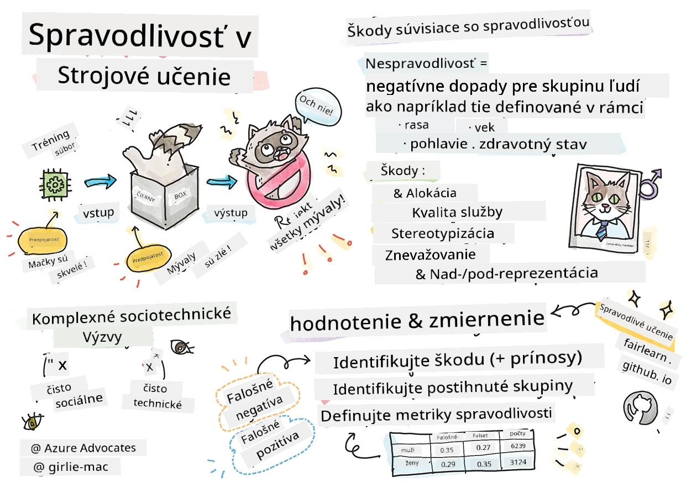

# Budovanie riešení strojového učenia so zodpovednou AI
 

> Sketchnote od [Tomomi Imura](https://www.twitter.com/girlie_mac)

## [Kvíz pred prednáškou](https://ff-quizzes.netlify.app/en/ml/)
 
## Úvod

V tomto učebnom pláne začnete objavovať, ako strojové učenie môže ovplyvňovať a ovplyvňuje náš každodenný život. Už teraz sú systémy a modely zapojené do denných rozhodovacích úloh, ako sú zdravotné diagnózy, schvaľovanie pôžičiek alebo detekcia podvodov. Preto je dôležité, aby tieto modely fungovali dobre a poskytovali dôveryhodné výsledky. Rovnako ako v prípade akéhokoľvek softvérového aplikovania, aj systémy AI môžu nesplniť očakávania alebo mať nežiaduci výsledok. Preto je nevyhnutné vedieť pochopiť a vysvetliť správanie AI modelu.

Predstavte si, čo sa môže stať, keď dáta, ktoré používate na vytváranie týchto modelov, neobsahujú určité demografické údaje, ako je rasa, pohlavie, politický názor, náboženstvo, alebo neprimerane reprezentujú takéto demografické skupiny. Čo ak je výstup modelu interpretovaný tak, že uprednostňuje nejakú demografickú skupinu? Aké sú dôsledky pre aplikáciu? A čo sa stane, keď má model nepriaznivý výsledok a škodí ľuďom? Kto je zodpovedný za správanie AI systému? To sú niektoré otázky, ktoré v tomto kurzu preskúmame.

V tejto lekcii:

- Zvýšite si povedomie o význame spravodlivosti v strojovom učení a škodách súvisiacich so spravodlivosťou.
- Zoznámite sa s praxou skúmania odľahlých a neobvyklých scenárov na zabezpečenie spoľahlivosti a bezpečnosti.
- Získate pochopenie potreby posilniť každého navrhovaním inkluzívnych systémov.
- Preskúmate, aké je dôležité chrániť súkromie a bezpečnosť dát a ľudí.
- Uvidíte význam "skleneného boxu" na vysvetlenie správania AI modelov.
- Budete si uvedomovať, ako je zodpovednosť nevyhnutná na budovanie dôvery v AI systémy.

## Predpoklady

Ako predpoklad si prosím prejdite „Princípy zodpovednej AI“ v Learn Path a pozrite si nižšie uvedené video k téme:

Viac sa dozviete o Zodpovednej AI sledovaním tohto [Learning Path](https://docs.microsoft.com/learn/modules/responsible-ai-principles/?WT.mc_id=academic-77952-leestott)

> 🎥 Kliknite na obrázok vyššie pre video: Microsoftov prístup k zodpovednej AI

## Spravodlivosť

AI systémy by mali zaobchádzať so všetkými spravodlivo a vyhýbať sa tomu, aby rovnaké skupiny ľudí ovplyvňovali rôznym spôsobom. Napríklad, keď AI systémy poskytujú odporúčania o lekárskom ošetrení, žiadostiach o pôžičky alebo zamestnaní, mali by robiť rovnaké odporúčania všetkým s podobnými príznakmi, finančnými pomermi alebo profesijnými kvalifikáciami. Každý z nás ako ľudia nesie dedičné predsudky, ktoré ovplyvňujú naše rozhodnutia a konanie. Tieto predsudky môžu byť zjavné v dátach, ktoré používame na trénovanie AI systémov. Takéto manipulácie sa môžu niekedy stať neúmyselne. Často je ťažké vedome vedieť, kedy zavádzate predsudky do dát.

**„Nespravodlivosť“** zahŕňa negatívne dopady alebo „škody“ pre skupinu ľudí, napríklad definovaných podľa rasy, pohlavia, veku alebo statusu zdravotného postihnutia. Hlavné škody súvisiace so spravodlivosťou možno klasifikovať nasledovne:

- **Pridelenie**, ak je napríklad pohlavie alebo etnicita uprednostňovaná pred iným.
- **Kvalita služby**. Ak trénujete dáta iba pre jeden špecifický scenár, ale realita je oveľa zložitejšia, vedie to k zlej výkonnosti služby. Napríklad dávkovač tekutého mydla, ktorý nevedel rozpoznať osoby s tmavou pokožkou. [Referencie](https://gizmodo.com/why-cant-this-soap-dispenser-identify-dark-skin-1797931773)
- **Očierňovanie**. Nespravodlivo kritizovať a označovať niečo alebo niekoho. Napríklad technológia označovania obrázkov nesprávne označila obrázky tmavších ľudí ako gorily.
- **Nad- alebo podreprezentácia**. Myšlienka je, že určitá skupina nie je v určitej profesii viditeľná a akákoľvek služba alebo funkcia, ktorá to podporuje, prispieva ku škode.
- **Stereotypy**. Spájanie určitej skupiny s prednastavenými atribútmi. Napríklad systém prekladu medzi angličtinou a turečtinou môže mať nepresnosti v dôsledku slov so stereotypnými spojením s pohlavím.

> preklad do turečtiny

> preklad späť do angličtiny

Pri navrhovaní a testovaní AI systémov musíme zabezpečiť, že AI je spravodlivá a nie je naprogramovaná robiť zaujaté alebo diskriminačné rozhodnutia, ktoré sú pre ľudí tiež zakázané. Zabezpečiť spravodlivosť v AI a strojovom učení je komplexná sociotechnická výzva.

### Spoľahlivosť a bezpečnosť

Na vybudovanie dôvery musia byť AI systémy spoľahlivé, bezpečné a konzistentné za bežných aj neočakávaných podmienok. Je dôležité vedieť, ako sa AI systémy budú správať v rôznych situáciách, hlavne keď sú to odľahlé prípady. Pri vytváraní AI riešení musí byť veľký dôraz na to, ako riešiť široké spektrum okolností, s ktorými sa AI riešenia stretnú. Napríklad samo-riadiace auto musí klásť bezpečnosť ľudí na prvé miesto. Výkonná AI auta musí zvážiť všetky možné scenáre, ako napríklad noc, búrky alebo snehové víchrice, deti bežiace cez cestu, domáce zvieratá, cestné práce atď. Ako dobre môže AI systém spoľahlivo a bezpečne zvládnuť širokú škálu podmienok, odráža mieru predvídavosti, ktorú dátový vedec alebo AI vývojár bral do úvahy pri navrhovaní alebo testovaní systému.

> [🎥 Kliknite tu pre video: ](https://www.microsoft.com/videoplayer/embed/RE4vvIl)

### Inkluzívnosť

AI systémy by mali byť navrhnuté tak, aby zapojili a posilnili všetkých. Pri navrhovaní a implementácii AI systémov dátoví vedci a vývojári AI identifikujú a riešia potenciálne prekážky v systéme, ktoré by mohli neúmyselne vylúčiť ľudí. Napríklad na svete je 1 miliarda ľudí so zdravotným postihnutím. Vďaka pokroku AI môžu vo svojom každodennom živote ľahšie získať prístup k širokej škále informácií a príležitostí. Riešením prekážok sa vytvárajú príležitosti inovácií a vývoja AI produktov s lepším používateľským zážitkom, ktorý prospieva všetkým.

> [🎥 Kliknite tu pre video: inkluzívnosť v AI](https://www.microsoft.com/videoplayer/embed/RE4vl9v)

### Bezpečnosť a súkromie

AI systémy by mali byť bezpečné a rešpektovať súkromie ľudí. Ľudia menej dôverujú systémom, ktoré ohrozujú ich súkromie, informácie alebo životy. Pri trénovaní modelov strojového učenia sa spoliehame na dáta, aby sme dosiahli najlepšie výsledky. Pri tom je dôležité zohľadniť pôvod dát a ich integritu. Napríklad, boli dáta od používateľov alebo verejne dostupné? Pri práci s dátami je zásadné vyvíjať AI systémy, ktoré dokážu chrániť dôverné informácie a odolať útokom. Ako AI získava na rozšírení, ochrana súkromia a zabezpečenie dôležitých osobných a obchodných informácií sa stáva kritickejšou a zložitejšou. Otázky súkromia a bezpečnosti dát vyžadujú osobitnú pozornosť, pretože prístup k dátam je pre AI nevyhnutný na presné a informované predpovede a rozhodnutia o ľuďoch.

> [🎥 Kliknite tu pre video: bezpečnosť v AI](https://www.microsoft.com/videoplayer/embed/RE4voJF)

- Ako odvetvie sme dosiahli významné pokroky v oblasti súkromia a bezpečnosti, výrazne poháňané reguláciami ako GDPR (Všeobecné nariadenie o ochrane údajov).
- Avšak u AI systémov musíme uznať napätie medzi potrebou viac osobných dát na personalizovanie a zvýšenie efektívnosti systémov a ochranou súkromia.
- Rovnako ako pri nástupe pripojených počítačov s internetom, pozorujeme prudký nárast bezpečnostných problémov súvisiacich s AI.
- Zároveň sme videli, že AI sa používa na zlepšenie bezpečnosti. Napríklad väčšina moderných antivírusových skenerov je dnes riadená AI heuristikou.
- Musíme zabezpečiť, aby naše procesy dátovej vedy harmonicky zapadali do najnovších postupov ochrany súkromia a bezpečnosti.

### Transparentnosť
AI systémy by mali byť pochopiteľné. Kľúčovou súčasťou transparentnosti je vysvetlenie správania AI systémov a ich komponentov. Zlepšenie porozumenia AI systémov si vyžaduje, aby zainteresované strany pochopili, ako a prečo fungujú tak, aby mohli identifikovať potenciálne problémy s výkonom, bezpečnosťou a súkromím, predsudkami, vylučovacími praktikami alebo neúmyselnými výsledkami. Veríme aj, že tí, ktorí AI systémy používajú, by mali byť čestní a otvorení o tom, kedy, prečo a ako sa rozhodujú ich nasadiť. Rovnako o obmedzeniach systémov, ktoré používajú. Napríklad, ak banka používa AI systém na podporu rozhodnutí o úveroch pre spotrebiteľov, je dôležité preskúmať výsledky a pochopiť, ktoré dáta ovplyvňujú odporúčania systému. Vládne orgány začínajú regulovať AI naprieč odvetviami, preto dátoví vedci a organizácie musia vysvetliť, či AI systém spĺňa regulačné požiadavky, najmä ak nastane nežiaduci výsledok.

> [🎥 Kliknite tu pre video: transparentnosť v AI](https://www.microsoft.com/videoplayer/embed/RE4voJF)

- Pretože AI systémy sú veľmi komplexné, je ťažké pochopiť, ako fungujú a interpretovať výsledky.
- Tento nedostatok porozumenia ovplyvňuje spôsob, akým sú tieto systémy riadené, operacionalizované a dokumentované.
- Tento nedostatok porozumenia predovšetkým ovplyvňuje rozhodnutia prijaté na základe výsledkov, ktoré tieto systémy produkujú.

### Zodpovednosť
 
Ľudia, ktorí navrhujú a nasadzujú AI systémy, musia byť zodpovední za to, ako ich systémy fungujú. Potreba zodpovednosti je obzvlášť dôležitá pri citlivých technológiách, ako je rozpoznávanie tvárí. V poslednej dobe rastie dopyt po technológii rozpoznávania tvárí, najmä od orgánov činných v trestnom konaní, ktoré vidia potenciál tejto technológie pri hľadaní chýbajúcich detí. Avšak tieto technológie by mohli byť tiež zneužité vládou na ohrozenie základných slobôd občanov, napríklad umožnením nepretržitého sledovania určitých jednotlivcov. Preto dátoví vedci a organizácie musia byť zodpovední za to, ako ich AI systém ovplyvňuje jednotlivcov alebo spoločnosť.

> 🎥 Kliknite na obrázok vyššie pre video: Varovania pred masovým dohľadom cez rozpoznávanie tvárí

Nakoniec jedna z najväčších otázok pre našu generáciu, ako prvej generácie, ktorá prináša AI do spoločnosti, je, ako zabezpečiť, aby počítače zostali zodpovedné ľuďom a ako zabezpečiť, aby ľudia, ktorí počítače navrhujú, zostali zodpovední voči všetkým ostatným.

## Hodnotenie dopadov

Pred trénovaním modelu strojového učenia je dôležité vykonať hodnotenie dopadu, aby ste pochopili účel AI systému; na čo sa má používať; kde bude nasadený; a kto bude so systémom interagovať. To pomáha recenzentom alebo testerom hodnotiť systém a vedieť, aké faktory zohľadniť pri identifikovaní potenciálnych rizík a očakávaných dôsledkov.

Nasledujúce oblasti sa zameriavajú pri vykonávaní hodnotenia dopadu:

* **Nepriaznivý dopad na jednotlivcov**. Byť si vedomý akýchkoľvek obmedzení alebo požiadaviek, nepodporovaného použitia alebo akýchkoľvek známych limitácií, ktoré bránia výkonu systému, je nevyhnutné, aby sa zabezpečilo, že systém nebude používaný spôsobom, ktorý by mohol spôsobiť škodu jednotlivcom.
* **Požiadavky na dáta**. Získať pochopenie toho, ako a kde bude systém používať dáta, umožňuje recenzentom preskúmať všetky požiadavky na dáta, ktoré by ste mali mať na pamäti (napríklad GDPR alebo HIPAA). Navyše zvážte, či je zdroj alebo množstvo dát postačujúce pre trénovanie.
* **Zhrnutie dopadov**. Zhromaždite zoznam potenciálnych škôd, ktoré by mohli vzniknúť používaním systému. V priebehu celého životného cyklu ML skontrolujte, či boli identifikované problémy zmiernené alebo riešené.
* **Platné ciele** pre každý zo šiestich základných princípov. Zhodnoťte, či sú ciele z každého princípu splnené a či existujú nejaké medzery.

## Ladenie s ohľadom na zodpovednú AI  

Podobne ako ladenie softvérovej aplikácie, ladenie AI systému je potrebný proces identifikácie a riešenia problémov v systéme. Existuje mnoho faktorov, ktoré by mohli ovplyvniť výkon modelu spôsobom, ktorý nie je očakávaný alebo zodpovedný. Väčšina tradičných metrík výkonnosti modelov sú kvantitatívne agregáty výkonu modelu, ktoré nie sú dostatočné na analýzu, ako model porušuje princípy zodpovednej AI. Ďalej je model strojového učenia čierna skrinka a ťažko sa chápe, čo ovplyvňuje jeho výsledky alebo poskytuje vysvetlenie, keď urobí chybu. Neskôr v tomto kurze sa naučíme, ako používať dashboard Zodpovednej AI na ladenie AI systémov. Dashboard poskytuje komplexný nástroj pre dátových vedcov a AI vývojárov na vykonávanie:

* **Analýzy chýb**. Na identifikovanie rozloženia chýb modelu, ktoré môžu ovplyvniť spravodlivosť alebo spoľahlivosť systému.
* **Prehľadu modelu**. Na zistenie, kde existujú rozdiely vo výkonnosti modelu medzi jednotlivými dátovými skupinami.
* **Analýzy dát**. Na pochopenie rozloženia dát a identifikáciu možných predsudkov v dátach, ktoré by mohli viesť k problémom so spravodlivosťou, inkluzívnosťou a spoľahlivosťou.
* **Interpretovateľnosti modelu**. Na pochopenie, čo ovplyvňuje alebo riadi modelové predpovede. To pomáha vysvetliť správanie modelu, čo je dôležité pre transparentnosť a zodpovednosť.

## 🚀 Výzva 
 
Aby sme predišli vzniku škôd, mali by sme:

- mať rozmanitosť pozadí a pohľadov medzi ľuďmi pracujúcimi na systémoch
- investovať do datasetov, ktoré odrážajú rozmanitosť našej spoločnosti
- vyvíjať lepšie metódy počas celého životného cyklu strojového učenia na detekciu a opravu zodpovednej AI, keď k nej dôjde

Premýšľajte o reálnych scenároch, kde je nedôvera v model zrejmá pri tvorbe a používaní modelu. Čo ešte by sme mali zvážiť?

## [Kvíz po prednáške](https://ff-quizzes.netlify.app/en/ml/)

## Revízia a samostatné štúdium
 

V tejto lekcii ste sa naučili niektoré základy konceptov spravodlivosti a nespravodlivosti v strojovom učení.  
 
Pozrite si tento workshop, aby ste sa hlbšie ponorili do tém: 

- V snahe o zodpovednú umelú inteligenciu: Prinášanie princípov do praxe od Besmira Nushi, Mehrnoosh Sameki a Amit Sharma

> 🎥 Kliknite na obrázok vyššie pre video: RAI Toolbox: Open-source framework pre budovanie zodpovednej umelej inteligencie od Besmira Nushi, Mehrnoosh Sameki a Amit Sharma

Tiež si prečítajte: 

- Centrum zdrojov RAI od Microsoftu: [Responsible AI Resources – Microsoft AI](https://www.microsoft.com/ai/responsible-ai-resources?activetab=pivot1%3aprimaryr4) 

- Výskumná skupina FATE od Microsoftu: [FATE: Fairness, Accountability, Transparency, and Ethics in AI - Microsoft Research](https://www.microsoft.com/research/theme/fate/) 

RAI Toolbox: 

- [GitHub úložisko Responsible AI Toolbox](https://github.com/microsoft/responsible-ai-toolbox)

Prečítajte si o nástrojoch Azure Machine Learning na zabezpečenie spravodlivosti:

- [Azure Machine Learning](https://docs.microsoft.com/azure/machine-learning/concept-fairness-ml?WT.mc_id=academic-77952-leestott) 

## Zadanie

[Preskúmajte RAI Toolbox](assignment.md)

---

<!-- CO-OP TRANSLATOR DISCLAIMER START -->
**Vyhlásenie o zodpovednosti**:
Tento dokument bol preložený pomocou AI prekladateľskej služby [Co-op Translator](https://github.com/Azure/co-op-translator). Hoci sa snažíme o presnosť, vezmite prosím na vedomie, že automatické preklady môžu obsahovať chyby alebo nepresnosti. Pôvodný dokument v jeho natívnom jazyku by mal byť považovaný za autoritatívny zdroj. Pre kritické informácie sa odporúča profesionálny ľudský preklad. Nie sme zodpovední za žiadne nedorozumenia alebo nesprávne interpretácie vyplývajúce z použitia tohto prekladu.
<!-- CO-OP TRANSLATOR DISCLAIMER END -->