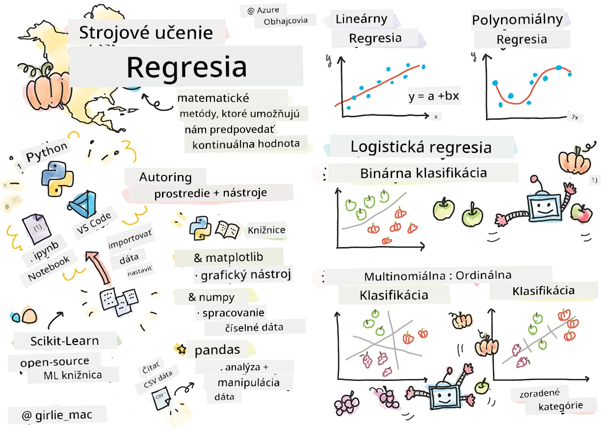
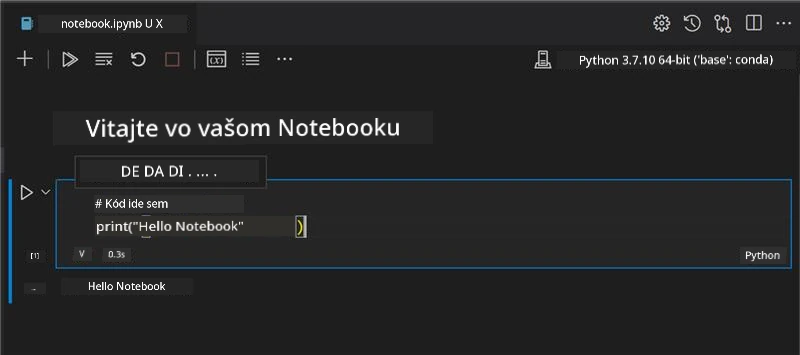
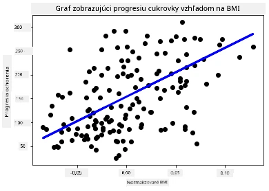

# Začnite s Pythonom a Scikit-learn pre regresné modely



> Skicnote od [Tomomi Imura](https://www.twitter.com/girlie_mac)

## [Začiatočný kvíz pred prednáškou](https://ff-quizzes.netlify.app/en/ml/)

> ### [Táto lekcia je dostupná aj v R!](../../../../2-Regression/1-Tools/solution/R/lesson_1.html)

## Úvod

V týchto štyroch lekciách zistíte, ako stavať regresné modely. O chvíľu si povieme, na čo slúžia. Ale predtým, ako začnete, sa uistite, že máte pripravené správne nástroje na začatie procesu!

V tejto lekcii sa naučíte:

- Nastaviť svoj počítač na lokálne úlohy strojového učenia.
- Pracovať s Jupyter Notebookmi.
- Používať Scikit-learn vrátane inštalácie.
- Preskúmať lineárnu regresiu pomocou praktického cvičenia.

## Inštalácie a konfigurácie

[](https://youtu.be/-DfeD2k2Kj0 "ML pre začiatočníkov - Pripravte si nástroje na tvorbu modelov strojového učenia")

> 🎥 Kliknite na obrázok vyššie pre krátke video o nastavení počítača pre ML.

1. **Nainštalujte Python**. Uistite sa, že máte na počítači nainštalovaný [Python](https://www.python.org/downloads/). Python použijete na mnohé úlohy v dátovej vede a strojovom učení. Väčšina počítačových systémov už obsahuje inštaláciu Pythonu. Existujú tiež užitočné [Python Coding Packy](https://code.visualstudio.com/learn/educators/installers?WT.mc_id=academic-77952-leestott), ktoré uľahčujú nastavenie niektorým používateľom.

   Niektoré použitia Pythonu však vyžadujú rôzne verzie softvéru. Preto je užitočné pracovať vo [virtuálnom prostredí](https://docs.python.org/3/library/venv.html).

2. **Nainštalujte Visual Studio Code**. Uistite sa, že máte na počítači nainštalovaný Visual Studio Code. Postupujte podľa týchto inštrukcií na [inštaláciu Visual Studio Code](https://code.visualstudio.com/) pre základnú inštaláciu. V tomto kurze budete používať Python vo Visual Studio Code, preto možno budete chcieť osviežiť si, ako [nastaviť Visual Studio Code](https://docs.microsoft.com/learn/modules/python-install-vscode?WT.mc_id=academic-77952-leestott) pre vývoj v Pythone.

   > Precvičujte si Python prostredníctvom tejto kolekcie [Learn modulov](https://docs.microsoft.com/users/jenlooper-2911/collections/mp1pagggd5qrq7?WT.mc_id=academic-77952-leestott)
   >
   > [](https://youtu.be/yyQM70vi7V8 "Nastavenie Pythonu s Visual Studio Code")
   >
   > 🎥 Kliknite na obrázok vyššie pre video o používaní Pythonu vo VS Code.

3. **Nainštalujte Scikit-learn**, postupujte podľa [týchto inštrukcií](https://scikit-learn.org/stable/install.html). Keďže musíte použiť Python 3, odporúča sa použiť virtuálne prostredie. Poznámka: ak inštalujete túto knižnicu na M1 Macu, na vyššie uvedenej stránke sú špeciálne inštrukcie.

1. **Nainštalujte Jupyter Notebook**. Budete potrebovať [nainštalovať balík Jupyter](https://pypi.org/project/jupyter/).

## Vaše prostredie na písanie kódu pre ML

Budete používať **notebooky** na vyvíjanie vášho Python kódu a tvorbu modelov strojového učenia. Tento typ súboru je bežný nástroj pre dátových vedcov a ľahko ho spoznáte podľa prípony `.ipynb`.

Notebooky sú interaktívne prostredie, ktoré umožňuje vývojárovi písať kód, pridávať poznámky a dokumentáciu okolo kódu, čo je veľmi užitočné pre experimentálne alebo výskumné projekty.

[](https://youtu.be/7E-jC8FLA2E "ML pre začiatočníkov - Nastavte Jupyter Notebooky na začatie budovania regresných modelov")

> 🎥 Kliknite na obrázok vyššie pre krátke video s týmto cvičením.

### Cvičenie - práca s notebookom

V tomto priečinku nájdete súbor _notebook.ipynb_.

1. Otvorte _notebook.ipynb_ vo Visual Studio Code.

   Spustí sa Jupyter server s Python 3+. V notebooku nájdete časti, ktoré môžete `spustiť`, kusy kódu. Môžete spustiť blok kódu výberom ikony vyzerajúcej ako tlačidlo prehrávania.

1. Vyberte ikonu `md` a pridajte trochu markdownu, napríklad tento text **# Vitajte vo vašom notebooku**.

   Potom pridajte niekoľko riadkov Python kódu.

1. Napíšte **print('hello notebook')** do bloku kódu.
1. Vyberte šípku na spustenie kódu.

   Mali by ste vidieť tlačený výstup:

    ```output
    hello notebook
    ```



Môžete miešať kód s komentármi pre vlastnú dokumentáciu notebooku.

✅ Zamyslite sa chvíľu, ako veľmi sa líši pracovné prostredie webového vývojára od toho dátového vedca.

## Začnite používať Scikit-learn

Teraz keď máte Python nastavený vo vašom lokálnom prostredí a v Jupyter Notebookoch sa cítite pohodlne, zoznámime sa rovnako dobre so Scikit-learn (vyslovujte `sci` ako v slove `science`). Scikit-learn poskytuje [rozsiahle API](https://scikit-learn.org/stable/modules/classes.html#api-ref), ktoré vám pomôže vykonávať úlohy strojového učenia.

Podľa ich [webovej stránky](https://scikit-learn.org/stable/getting_started.html), "Scikit-learn je open source knižnica strojového učenia, ktorá podporuje riadené aj neriadené učenie. Poskytuje tiež rôzne nástroje na prispôsobenie modelu, predspracovanie dát, výber a hodnotenie modelu a mnoho ďalších utilít."

V tomto kurze budete používať Scikit-learn a ďalšie nástroje na tvorbu modelov strojového učenia na vykonávanie úloh nazývaných „tradičné strojové učenie“. Úmyselne sme vylúčili neurónové siete a hlboké učenie, pretože tie sú lepšie pokryté v našom pripravovanom kurze „AI pre začiatočníkov“.

Scikit-learn umožňuje jednoduché vytváranie a hodnotenie modelov. Je primárne zameraný na číselné údaje a obsahuje niekoľko pripravených datasetov na výučbu. Obsahuje tiež zabudované modely na vyskúšanie študentmi. Najskôr preskúmajme postup načítania predpripravených dát a použitia zabudovaného estimátora prvého modelu ML v Scikit-learn s niekoľkými základnými údajmi.

## Cvičenie - váš prvý notebook v Scikit-learn

> Tento tutorial bol inšpirovaný [príkladom lineárnej regresie](https://scikit-learn.org/stable/auto_examples/linear_model/plot_ols.html#sphx-glr-auto-examples-linear-model-plot-ols-py) na stránke Scikit-learn.


[](https://youtu.be/2xkXL5EUpS0 "ML pre začiatočníkov - Váš prvý projekt lineárnej regresie v Pythone")

> 🎥 Kliknite na obrázok vyššie pre krátke video s týmto cvičením.

V súbore _notebook.ipynb_ pripojenom k tejto lekcii vymažte všetky bunky stlačením ikony „koša“.

V tejto časti budete pracovať s malým datasetom o diabete, ktorý je zabudovaný v Scikit-learn pre výučbové účely. Predstavte si, že chcete testovať liečbu pre diabetických pacientov. Modely strojového učenia by vám mohli pomôcť určiť, ktorí pacienti by na liečbu reagovali lepšie, na základe kombinácií premenných. Aj veľmi jednoduchý regresný model, pri vizualizácii, môže ukázať informácie o premenných, ktoré by vám pomohli zorganizovať teoretické klinické skúšky.

✅ Existuje mnoho typov regresných metód a ktorá z nich je vhodná, závisí od hľadaného odpovede. Ak chcete predpovedať pravdepodobnú výšku osoby určitého veku, použijete lineárnu regresiu, pretože hľadáte **číselnú hodnotu**. Ak vás zaujíma, či určitý druh kuchyne by mal byť považovaný za vegánsky alebo nie, hľadáte **priradenie kategórie**, takže by ste použili logistickú regresiu. O logistickej regresii sa dozviete viac neskôr. Zamyslite sa nad niektorými otázkami, ktoré môžete položiť dátam, a ktorá z týchto metód by bola vhodnejšia.

Poďme sa pustiť do tejto úlohy.

### Import knižníc

Na túto úlohu naimportujeme niekoľko knižníc:

- **matplotlib**. Je to užitočný [nástroj na grafy](https://matplotlib.org/) a použijeme ho na vytvorenie čiarového grafu.
- **numpy**. [numpy](https://numpy.org/doc/stable/user/whatisnumpy.html) je užitočná knižnica na prácu s číselnými údajmi v Pythone.
- **sklearn**. Toto je knižnica [Scikit-learn](https://scikit-learn.org/stable/user_guide.html).

Naimportujte knižnice, ktoré vám pomôžu pri úlohách.

1. Pridajte importy napísaním nasledujúceho kódu:

   ```python
   import matplotlib.pyplot as plt
   import numpy as np
   from sklearn import datasets, linear_model, model_selection
   ```

   Hore importujete `matplotlib`, `numpy` a importujete `datasets`, `linear_model` a `model_selection` zo `sklearn`. `model_selection` sa používa na rozdelenie dát na trénovacie a testovacie sady.

### Dataset o diabete

Zabudovaný [diabetes dataset](https://scikit-learn.org/stable/datasets/toy_dataset.html#diabetes-dataset) obsahuje 442 vzoriek o diabete s 10 premennými vlastností, niektoré z nich sú:

- vek: vek v rokoch
- bmi: index telesnej hmotnosti
- bp: priemerný krvný tlak
- s1 tc: T-bunky (typ bielych krviniek)

✅ Tento dataset zahŕňa koncept 'pohlavia' ako dôležitéj vlastnosti pre výskum okolo diabetu. Mnohé medicínske databázy obsahujú tento druh binárnej klasifikácie. Zamyslite sa nad tým, ako by takéto kategorizácie mohli vylúčiť určité časti populácie z liečby.

Teraz načítajte dáta X a y.

> 🎓 Pamätajte, že toto je riadené učenie (supervised learning) a potrebujeme pomenovaný 'y' cieľ.

V novej bunke kódu načítajte diabetes dataset volaním `load_diabetes()`. Vstup `return_X_y=True` znamená, že `X` bude dátová matica a `y` bude cieľ regresie.

1. Pridajte niekoľko príkazov na tlač tvaru dátovej matice a jej prvého prvku:

    ```python
    X, y = datasets.load_diabetes(return_X_y=True)
    print(X.shape)
    print(X[0])
    ```

    Čo dostávate ako odpoveď, je tuple. Čo robíte, je priradenie dvoch prvých hodnôt tuple do `X` a `y`. Viac sa dozviete [o tuple](https://wikipedia.org/wiki/Tuple).

    Vidíte, že dáta obsahujú 442 položiek zoradených do polí s 10 prvkami:

    ```text
    (442, 10)
    [ 0.03807591  0.05068012  0.06169621  0.02187235 -0.0442235  -0.03482076
    -0.04340085 -0.00259226  0.01990842 -0.01764613]
    ```

    ✅ Zamyslite sa nad vzťahom medzi dátami a cieľom regresie. Lineárna regresia predpovedá vzťahy medzi vlastnosťou X a cieľovou premennou y. Môžete nájsť [cieľ](https://scikit-learn.org/stable/datasets/toy_dataset.html#diabetes-dataset) pre diabetes dataset v dokumentácii? Čo tento dataset ukazuje, vzhľadom na cieľ?

2. Ďalej vyberte časť datasetu na vykreslenie výberom 3. stĺpca datasetu. Môžete to urobiť použitím operátora `:` na výber všetkých riadkov a potom výberom 3. stĺpca s indexom (2). Dáta môžete tiež prestaviť na 2D pole - čo je potrebné pre vykresľovanie - pomocou `reshape(n_rows, n_columns)`. Ak je jeden parameter -1, príslušný rozmer sa vypočíta automaticky.

   ```python
   X = X[:, 2]
   X = X.reshape((-1,1))
   ```

   ✅ Kedykoľvek si vypíšte dáta, aby ste si skontrolovali ich tvar.

3. Teraz keď máte dáta pripravené na vykreslenie, zistíte, či vám stroj môže pomôcť určiť logický bod rozdelenia v týchto číslach. Na to musíte rozdeliť dáta (X) aj cieľ (y) na testovaciu a tréningovú sadu. Scikit-learn ponúka jednoduchý spôsob, ako to urobiť; vykonáte rozdelenie dát na danom bode.

   ```python
   X_train, X_test, y_train, y_test = model_selection.train_test_split(X, y, test_size=0.33)
   ```

4. Teraz ste pripravení trénovať svoj model! Načítajte lineárny regresný model a natrénujte ho na vašich trénovacích sadách X a y pomocou `model.fit()`:

    ```python
    model = linear_model.LinearRegression()
    model.fit(X_train, y_train)
    ```

    ✅ `model.fit()` je funkcia, ktorú uvidíte v mnohých ML knižniciach ako TensorFlow

5. Potom vytvorte predikciu s použitím testovacích dát pomocou funkcie `predict()`. Táto predikcia sa použije na vykreslenie čiary medzi skupinami dát.

    ```python
    y_pred = model.predict(X_test)
    ```

6. Teraz je čas ukázať dáta na grafe. Matplotlib je veľmi užitočný nástroj na túto úlohu. Vytvorte bodový graf všetkých testovacích dát X a y a použite predikciu na nakreslenie čiary na najvhodnejšom mieste medzi skupinami dát podľa modelu.

    ```python
    plt.scatter(X_test, y_test,  color='black')
    plt.plot(X_test, y_pred, color='blue', linewidth=3)
    plt.xlabel('Scaled BMIs')
    plt.ylabel('Disease Progression')
    plt.title('A Graph Plot Showing Diabetes Progression Against BMI')
    plt.show()
    ```

   


   ✅ Zamyslite sa trochu nad tým, čo sa tu deje. Priama čiara prechádza viacerými malými bodmi údajov, ale čo vlastne robí? Vidíte, ako by ste mali byť schopní použiť túto čiaru na predpovedanie, kde by sa nový, neznámy údaj mal nachádzať vzhľadom na os y grafu? Pokúste sa slovami opísať praktické využitie tohto modelu.

Blahoželáme, vytvorili ste svoj prvý model lineárnej regresie, vytvorili ste pomocou neho predikciu a zobrazili ju v grafe!

---
## 🚀Výzva

Vykreslite inú premennú z tejto dátovej sady. Tip: upravte tento riadok: `X = X[:,2]`. Vzhľadom na cieľ tejto dátovej sady, čo môžete zistiť o priebehu cukrovky ako choroby?
## [Kvíz po prednáške](https://ff-quizzes.netlify.app/en/ml/)

## Prehľad a samostatná štúdia

V tomto návode ste pracovali s jednoduchou lineárnou regresiou, nie s univariátnou alebo viacnásobnou lineárnou regresiou. Prečítajte si niečo o rozdieloch medzi týmito metódami, alebo si pozrite [toto video](https://www.coursera.org/lecture/quantifying-relationships-regression-models/linear-vs-nonlinear-categorical-variables-ai2Ef)

Prečítajte si viac o koncepte regresie a zamyslite sa nad tým, aké otázky môže táto technika zodpovedať. Prehĺbte si pochopenie týmto [návodom](https://docs.microsoft.com/learn/modules/train-evaluate-regression-models?WT.mc_id=academic-77952-leestott).

## Zadanie

[Iná dátová sada](assignment.md)

---

<!-- CO-OP TRANSLATOR DISCLAIMER START -->
**Vyhlásenie o zodpovednosti**:
Tento dokument bol preložený pomocou AI prekladateľskej služby [Co-op Translator](https://github.com/Azure/co-op-translator). Hoci sa snažíme o presnosť, vezmite prosím na vedomie, že automatické preklady môžu obsahovať chyby alebo nepresnosti. Pôvodný dokument v jeho natívnom jazyku by mal byť považovaný za autoritatívny zdroj. Pre kritické informácie sa odporúča profesionálny ľudský preklad. Nie sme zodpovední za žiadne nedorozumenia alebo nesprávne interpretácie vyplývajúce z použitia tohto prekladu.
<!-- CO-OP TRANSLATOR DISCLAIMER END -->