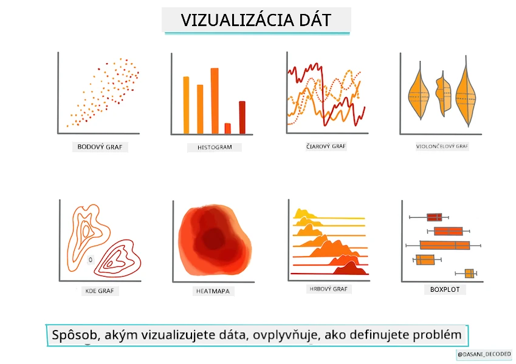
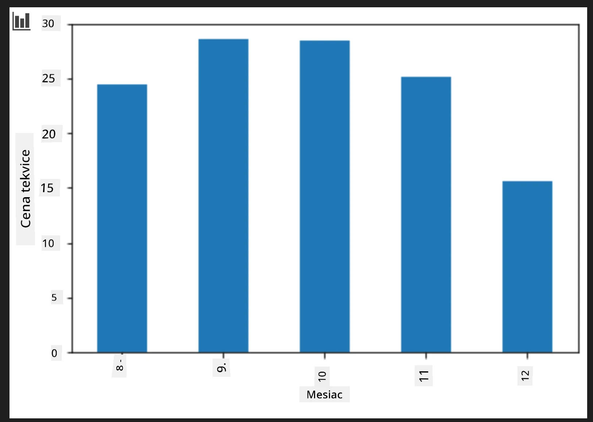
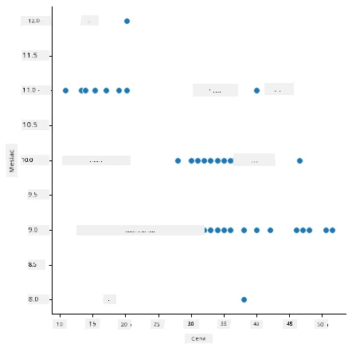
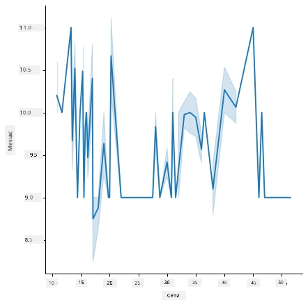
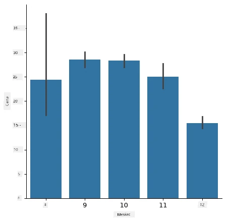
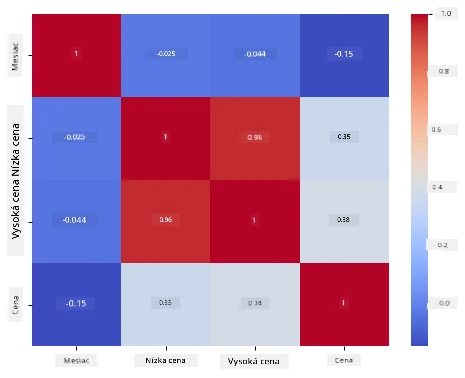

# Vytvorte regresný model pomocou Scikit-learn: príprava a vizualizácia dát



Infografika od [Dasani Madipalli](https://twitter.com/dasani_decoded)

## [Kvíz pred prednáškou](https://ff-quizzes.netlify.app/en/ml/)

> ### [Táto lekcia je dostupná v R!](../../../../2-Regression/2-Data/solution/R/lesson_2.html)

## Úvod

Teraz, keď máte nainštalované nástroje potrebné na začatie práce s tvorbou modelov strojového učenia pomocou Scikit-learn, ste pripravení začať klásť otázky vašim dátam. Pri práci s dátami a aplikovaní riešení ML je veľmi dôležité pochopiť, ako položiť správnu otázku, aby ste správne odomkli potenciál svojho datasetu.

V tejto lekcii sa naučíte:

- Ako pripraviť vaše dáta na tvorbu modelu.
- Ako použiť Matplotlib na vizualizáciu dát.
- Ako použiť Seaborn pre expresívnejšiu vizualizáciu dát.

## Ako položiť správnu otázku vašim dátam

Otázka, na ktorú potrebujete odpoveď, určí, aký typ ML algoritmov použijete. A kvalita odpovede závisí veľmi od povahy vašich dát.

Pozrite sa na [dáta](https://github.com/microsoft/ML-For-Beginners/blob/main/2-Regression/data/US-pumpkins.csv) poskytnuté pre túto lekciu. Môžete otvoriť tento .csv súbor vo VS Code. Rýchly prehľad hneď ukáže, že sú tam prázdne miesta a mix reťazcov a číselných hodnôt. Je tam tiež zvláštna kolóna nazvaná 'Package', kde sú dáta zmiešané medzi 'sacks', 'bins' a inými hodnotami. Dáta sú vlastne trochu neusporiadané.

[](https://youtu.be/5qGjczWTrDQ "ML pre začiatočníkov – Ako analyzovať a upraviť dataset")

> 🎥 Kliknite na obrázok hore pre krátke video o príprave dát pre túto lekciu.

V skutočnosti nie je bežné dostať priamo dataset úplne pripravený na použitie na vytvorenie modelu ML. V tejto lekcii sa naučíte, ako pripraviť surový dataset pomocou štandardných knižníc Pythonu. Tiež sa naučíte rôzne techniky vizualizácie dát.

## Prípadová štúdia: 'trh s tekvicami'

V tomto priečinku nájdete .csv súbor v koreňovom priečinku `data` nazvaný [US-pumpkins.csv](https://github.com/microsoft/ML-For-Beginners/blob/main/2-Regression/data/US-pumpkins.csv), ktorý obsahuje 1757 riadkov dát o trhu s tekvicami, zoradených podľa miest. Sú to surové dáta extrahované z [Specialty Crops Terminal Markets Standard Reports](https://www.marketnews.usda.gov/mnp/fv-report-config-step1?type=termPrice) distribuovaných Ministerstvom poľnohospodárstva Spojených štátov.

### Príprava dát

Tieto dáta sú vo verejnej doméne. Môžu byť stiahnuté v mnohých samostatných súboroch podľa miest zo stránky USDA. Aby sme predišli príliš mnohým samostatným súborom, všetky mestské dáta sme skonsolidovali do jednej tabuľky, takže sme už trochu _pripravili_ dáta. Teraz si dáta pozrime bližšie.

### Dáta o tekviciach – rané závery

Čo si všimnete na týchto dátach? Už ste videli, že tam je mix reťazcov, čísel, prázdnych polí a zvláštnych hodnôt, ktoré je potrebné pochopiť.

Akú otázku môžete položiť týmto dátam použitím regresnej techniky? Napríklad "Predpovedať cenu tekvice na predaj v danom mesiaci". Pri opätovnom pohľade na dáta sú potrebné úpravy na vytvorenie dátovej štruktúry potrebnej pre túto úlohu.
## Cvičenie – analyzujte dáta o tekviciach

Použime [Pandas](https://pandas.pydata.org/) (názov znamená `Python Data Analysis`), nástroj veľmi užitočný na tvarovanie dát, na analýzu a prípravu týchto dát o tekviciach.

### Najprv skontrolujte chýbajúce dátumy

Najprv treba podniknúť kroky na kontrolu chýbajúcich dátumov:

1. Preveďte dátumy na formát mesiaca (ide o americké dátumy, teda formát je `MM/DD/YYYY`).
2. Vytiahnite mesiac do novej kolónky.

Otvorte súbor _notebook.ipynb_ vo Visual Studio Code a naimportujte tabuľku do nového Pandas dataframe.

1. Použite funkciu `head()` pre zobrazenie prvých piatich riadkov.

    ```python
    import pandas as pd
    pumpkins = pd.read_csv('../data/US-pumpkins.csv')
    pumpkins.head()
    ```

    ✅ Ktorú funkciu by ste použili na zobrazenie posledných piatich riadkov?

1. Skontrolujte, či sú v aktuálnom dataframe chýbajúce dáta:

    ```python
    pumpkins.isnull().sum()
    ```

    Niektoré dáta chýbajú, ale možno to nebude pre danú úlohu podstatné.

1. Aby ste si uľahčili prácu s dataframe, vyberte iba potrebné kolónky pomocou funkcie `loc`, ktorá vyberá z pôvodného dataframe skupinu riadkov (ako prvý parameter) a stĺpcov (ako druhý parameter). Výraz `:` v nasledujúcom príklade znamená "všetky riadky".

    ```python
    columns_to_select = ['Package', 'Low Price', 'High Price', 'Date']
    pumpkins = pumpkins.loc[:, columns_to_select]
    ```

### Druhý krok, určte priemernú cenu tekvice

Premyslite si, ako určiť priemernú cenu tekvice v danom mesiaci. Aké stĺpce by ste vybrali pre túto úlohu? Náznak: budete potrebovať 3 stĺpce.

Riešenie: vezmite priemer z kolón `Low Price` a `High Price` pre novú kolónu Price, a prekonvertujte dátum tak, aby zobrazoval iba mesiac. Našťastie podľa predchádzajúcej kontroly v dátach nechýbajú dátumy ani ceny.

1. Pre výpočet priemeru pridajte tento kód:

    ```python
    price = (pumpkins['Low Price'] + pumpkins['High Price']) / 2

    month = pd.DatetimeIndex(pumpkins['Date']).month

    ```

   ✅ Kľudne si vypíšte akékoľvek dáta pomocou `print(month)`, aby ste skontrolovali.

2. Teraz skopírujte prevedené dáta do nového Pandas dataframe:

    ```python
    new_pumpkins = pd.DataFrame({'Month': month, 'Package': pumpkins['Package'], 'Low Price': pumpkins['Low Price'],'High Price': pumpkins['High Price'], 'Price': price})
    ```

    Vytlačenie tohto dataframe vám zobrazí čistý, uprataný dataset, na ktorom môžete stavať váš nový regresný model.

### Ale počkajte! Niečo je tu zvláštne

Ak sa pozriete na kolónu `Package`, tekvice sa predávajú v mnohých rôznych formách. Niektoré sa predávajú v dávkach '1 1/9 bushel', iné v '1/2 bushel', niektoré po kusoch, iné po librách a niektoré v veľkých krabiciach rôznej šírky.

> Tekvice je podľa všetkého veľmi ťažké rovnomerne vážiť.

Pri bližšom skúmaní pôvodných dát je zaujímavé, že všetko s `Unit of Sale` rovnakým 'EACH' alebo 'PER BIN' má tiež `Package` ako na palec, na bin, alebo 'each'. Tekvice je veľmi ťažké vážiť konzistentne, tak ich vyfiltrujme výberom iba tekvíc s reťazcom 'bushel' v kolónke `Package`.

1. Pridajte filter na vrch súboru, pod počiatočný import .csv:

    ```python
    pumpkins = pumpkins[pumpkins['Package'].str.contains('bushel', case=True, regex=True)]
    ```

    Ak teraz vytlačíte dáta, vidíte iba približne 415 riadkov obsahujúcich tekvice predávané po busheloch.

### Ale počkajte! Ešte jedna vec

Všimli ste si, že množstvo bushelov sa líši v jednotlivých riadkoch? Je potrebné normalizovať ceny, aby sa ukazovali ceny za bushel, preto je treba urobiť nejakú matematiku na štandardizáciu.

1. Pridajte tieto riadky za blok vytvárajúci nový dataframe new_pumpkins:

    ```python
    new_pumpkins.loc[new_pumpkins['Package'].str.contains('1 1/9'), 'Price'] = price/(1 + 1/9)

    new_pumpkins.loc[new_pumpkins['Package'].str.contains('1/2'), 'Price'] = price/(1/2)
    ```

✅ Podľa [The Spruce Eats](https://www.thespruceeats.com/how-much-is-a-bushel-1389308) záleží hmotnosť bushelu na druhu plodiny, keďže ide o objemové meranie. "Bushel paradajok napríklad váži 56 libier... Listy a zelenina zaberajú viac miesta pri menšej hmotnosti, takže bushel špenátu váži len 20 libier." Je to celkom komplikované! Nechceme sa pásť na prevody bushel na libru, radšej cenu nastavme za bushel. Toto skúmanie bushelov tekvíc však ukazuje, aké je dôležité rozumieť povahe vašich dát!

Teraz môžete analyzovať ceny za jednotku podľa ich merania bushelmi. Ak vytlačíte dáta ešte raz, uvidíte, ako sú štandardizované.

✅ Všimli ste si, že tekvice predávané po pol busheli sú veľmi drahé? Viete povedať prečo? Náznak: malé tekvice sú omnoho drahšie ako veľké, pravdepodobne preto, že ich je omnoho viac na jeden bushel z dôvodu nevyužitého priestoru, ktorý zaberá jedna veľká dutá tekvica na koláč.

## Stratégie vizualizácie

Súčasťou role dátového vedca je demonštrovať kvalitu a povahu dát, s ktorými pracuje. Na to často vytvárajú zaujímavé vizualizácie, ako grafy, diagramy a tabuľky, ktoré zobrazujú rôzne aspekty dát. Takto môžu vizuálne ukázať vzťahy a medzery, ktoré by inak bolo ťažké objaviť.

[](https://youtu.be/SbUkxH6IJo0 "ML pre začiatočníkov – Ako vizualizovať dáta pomocou Matplotlib")

> 🎥 Kliknite na obrázok hore pre krátke video o vizualizácii dát pre túto lekciu.

Vizualizácie môžu tiež pomôcť určiť najvhodnejšiu techniku strojového učenia pre dáta. Napríklad rozptylový graf (scatterplot), ktorý sa zdá nasledovať líniu, naznačuje, že dáta sú dobrými kandidátmi na lineárnu regresiu.

Jednou z knižníc na vizualizáciu dát, ktorá dobre funguje v Jupyter notebooks, je [Matplotlib](https://matplotlib.org/) (ktorú ste videli aj v predchádzajúcej lekcii).

> Získajte viac skúseností s vizualizáciou dát v [týchto tutoriáloch](https://docs.microsoft.com/learn/modules/explore-analyze-data-with-python?WT.mc_id=academic-77952-leestott).

## Cvičenie – experimentujte s Matplotlib

Vyskúšajte vytvoriť jednoduché grafy zobrazujúce nový dataframe, ktorý ste práve vytvorili. Čo by mohol ukázať jednoduchý čiarový graf?

1. Importujte Matplotlib na vrch súboru, pod Pandas import:

    ```python
    import matplotlib.pyplot as plt
    ```

1. Znova spustite celý notebook pre obnovenie.
1. Na konci notebooku pridajte bunku na vykreslenie box plota:

    ```python
    price = new_pumpkins.Price
    month = new_pumpkins.Month
    plt.scatter(price, month)
    plt.show()
    ```

    

    Je tento graf užitočný? Prekvapuje vás niečo na ňom?

    Nie je veľmi užitočný, pretože iba zobrazuje dáta rozptýlené do mesiacov.

### Spravme ho užitočným

Aby grafy zobrazovali užitočné dáta, zvyčajne ich treba nejako zoskupiť. Skúsme vytvoriť graf, kde os y ukazuje mesiace a dáta ukazujú ich rozloženie.

1. Pridajte bunku na vytvorenie skupinového stĺpcového grafu:

    ```python
    new_pumpkins.groupby(['Month'])['Price'].mean().plot(kind='bar')
    plt.ylabel("Pumpkin Price")
    ```

    

    Toto je užitočnejšia vizualizácia dát! Zdá sa, že najvyššie ceny tekvíc sú v septembri a októbri. Súhlasí to s vaším očakávaním? Prečo áno alebo prečo nie?

## Cvičenie – experimentujte so Seaborn

Matplotlib je výkonný, ale na vytvorenie vylešteného grafu môže byť potrebný veľký kód. [Seaborn](https://seaborn.pydata.org/) je knižnica postavená _na vrchu_ Matplotlibu, určená na štatistickú vizualizáciu dát. Pracuje priamo s Pandas dataframeami, používa atraktívne predvolené štýly a umožňuje vytvárať informatívne grafy s oveľa menším kódom. Keďže Seaborn vracia objekty Matplotlibu, stále môžete použiť všetko, čo už viete o Matplotlib, na doladenie výsledku.

> Ak ešte nemáte Seaborn nainštalovaný, nainštalujte ho pomocou `pip install seaborn`.

1. Importujte Seaborn na vrch notebooku, pod ostatné importy. Konvenciou je importovať ho ako `sns`:

    ```python
    import seaborn as sns
    ```

### Rozptylové grafy na zobrazenie vzťahov

Veľká časť skúmania dát pred tvorbou modelu je hľadanie _vzťahov_ medzi premennými. [Rozptylový graf](https://en.wikipedia.org/wiki/Scatter_plot) je jedným z najlepších nástrojov na to: ak sa body zdajú nasledovať priamku, obe premenné môžu byť korelované, čo je dobrý znak, že lineárny regresný model môže fungovať.

1. Znova vytvorte rozptylový graf ceny podľa mesiaca, tentoraz pomocou Seaborn funkcie [`relplot()`](https://seaborn.pydata.org/generated/seaborn.relplot.html) (relačný plot), ktorá pracuje priamo so stĺpcami vášho dataframe:

    ```python
    sns.relplot(x="Price", y="Month", data=new_pumpkins)
    ```

    

    Všimnite si, ako odovzdáte _názvy stĺpcov_ a dataframe, a Seaborn sa stará o popisky osí za vás.

2. Môžete zmeniť typ grafu na čiarový zadaním `kind="line"`. Seaborn dokonca vykreslí zatienený pás ukazujúci interval dôvery okolo čiary:

    ```python
    sns.relplot(x="Price", y="Month", kind="line", data=new_pumpkins)
    ```

    

    Tieto konkrétne dáta sú dosť hlučné, takže čiarový graf nie je najjasnejšia voľba — ale ukazuje, ako ľahko môžete meniť typ grafu v Seaborn.

### Stĺpcové grafy na zobrazenie rozložení


Skôr ste ručne zoskupovali údaje, aby ste vytvorili stĺpcový graf s Matplotlib. Seabornova funkcia [`catplot()`](https://seaborn.pydata.org/generated/seaborn.catplot.html) (kategorizovaný graf) môže za vás urobiť zoskupovanie a agregáciu. Predvolene `kind="bar"` ukazuje priemer každej kategórie spolu s čiernou čiarou znázorňujúcou interval spoľahlivosti.

1. Vytvorte stĺpcový graf priemernej ceny za mesiac:

    ```python
    sns.catplot(x="Month", y="Price", data=new_pumpkins, kind="bar")
    ```

    

    To potvrdzuje to, čo ste videli s Matplotlib — ceny vrcholia okolo septembra a októbra — ale Seaborn tiež vizualizuje, ako veľmi sa cena _mení_ v rámci každého mesiaca.

### Tepelné mapy na zobrazenie korelácií

Bodové grafy porovnávajú vždy dve premenné. Keď máte viacero číselných stĺpcov, [teplená mapa](https://en.wikipedia.org/wiki/Heat_map) vám umožní naraz vidieť silu vzťahu medzi _každým_ párom stĺpcov. Toto je bežný spôsob, ako spoznať, ktoré vlastnosti sú najviac korelované pred výberom, čo použiť do modelu (a rovnaký typ grafu sa neskôr používa na zobrazenie mätúcich matíc pri klasifikácii).

1. Vytvorte korelačnú maticu pomocou Pandas a potom ju nakreslite pomocou Seabornovej funkcie [`heatmap()`](https://seaborn.pydata.org/generated/seaborn.heatmap.html). Voľba `annot=True` vypíše hodnoty korelácií v každej bunke:

    ```python
    correlations = new_pumpkins[['Month', 'Low Price', 'High Price', 'Price']].corr()
    sns.heatmap(correlations, annot=True, cmap="coolwarm")
    ```

    

    Hodnoty blízke k `1` (alebo `-1`) znamenajú, že stĺpce sú silne _lineárne_ korelované. Všimnite si, že `Low Price` a `High Price` sú takmer úplne korelované. `Month` na druhej strane ukazuje len slabú lineárnu koreláciu s cenou — aj keď vyššie uvedený stĺpcový graf odhalil jasný sezónny vrchol v septembri a októbri. To je dôležitá lekcia: korelačný koeficient meria len _priame čiary_, takže môže prehliadnuť sezónne alebo iné nelineárne vzory. ✅ Prečo je užitočné pozrieť sa na oboje: tepelnú mapu *a* grafy ako stĺpcový graf pred rozhodnutím, ktoré stĺpce použiť?

### Matplotlib alebo Seaborn?

Obe knižnice stoja za poznanie:

- **Matplotlib** vám dáva detailnú kontrolu nad každým prvkom grafu a je základom, na ktorom staví takmer každá iná pythonovská knižnica na kreslenie.
- **Seaborn** poskytuje funkcie na vyššej úrovni a atraktívne prednastavenia pre štatistické grafy, pracuje priamo s dátovými rámcami (dataframes) a je často rýchlejší pre prieskumnú analýzu dát.

Bežný pracovný postup je najskôr použiť Seaborn na rýchlu prieskumnú analýzu, potom prejsť na Matplotlib, keď potrebujete prispôsobiť podrobnosti.

---

## 🚀Výzva

Preskúmajte rôzne typy vizualizácií, ktoré ponúkajú Matplotlib a Seaborn. Ktoré typy sú najvhodnejšie pre regresné problémy?

## [Kvíz po prednáške](https://ff-quizzes.netlify.app/en/ml/)

## Prehľad a samostatné štúdium

Pozrite si množstvo spôsobov vizualizácie dát. Vypracujte si zoznam dostupných knižníc a zaznamenajte, ktoré sú najlepšie pre dané typy úloh, napríklad 2D vizualizácie vs. 3D vizualizácie. Čo zistíte?

## Zadanie

[Preskúmanie vizualizácie](assignment.md)

---

<!-- CO-OP TRANSLATOR DISCLAIMER START -->
**Vyhlásenie o zodpovednosti**:
Tento dokument bol preložený pomocou AI prekladateľskej služby [Co-op Translator](https://github.com/Azure/co-op-translator). Hoci sa snažíme o presnosť, vezmite prosím na vedomie, že automatické preklady môžu obsahovať chyby alebo nepresnosti. Pôvodný dokument v jeho natívnom jazyku by mal byť považovaný za autoritatívny zdroj. Pre kritické informácie sa odporúča profesionálny ľudský preklad. Nie sme zodpovední za žiadne nedorozumenia alebo nesprávne interpretácie vyplývajúce z použitia tohto prekladu.
<!-- CO-OP TRANSLATOR DISCLAIMER END -->