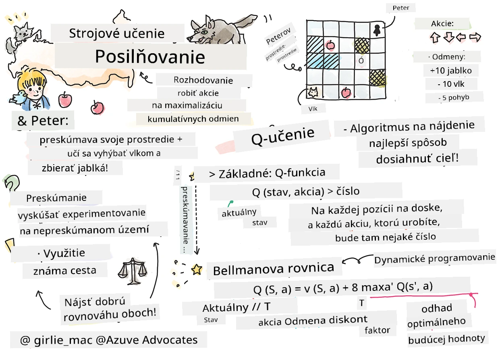

# Úvod do učenia posilňovaním a Q-Learningu


> Sketchnote od [Tomomi Imura](https://www.twitter.com/girlie_mac)

Učenie posilňovaním zahŕňa tri dôležité pojmy: agenta, niekoľko stavov a súbor akcií pre každý stav. Vykonaním akcie v určenom stave dostáva agent odmenu. Predstavte si znova počítačovú hru Super Mario. Ste Mario, ste v úrovni hry, stojíte vedľa okraja útesu. Nad vami je minca. Vy ako Mario, v hernej úrovni, na konkrétnej pozícii ... to je váš stav. Pohyb o jeden krok doprava (akcia) vás zhodí z okraja a dostanete nízke číselné skóre. Stlačenie tlačidla skoku by vám však umožnilo získať bod a prežiť. To je pozitívny výsledok a mal by vám udeliť pozitívne číselné skóre.

Použitím učenia posilňovaním a simulátora (hry) sa môžete naučiť, ako hrať hru tak, aby ste maximalizovali odmenu, ktorou je prežitie a získanie čo najväčšieho počtu bodov.

[](https://www.youtube.com/watch?v=lDq_en8RNOo)

> 🎥 Kliknite na obrázok vyššie, aby ste si vypočuli Dmitryho diskusiu o učenie posilňovaním

## [Kvíz pred prednáškou](https://ff-quizzes.netlify.app/en/ml/)

## Predpoklady a nastavenie

V tejto lekcii budeme experimentovať s kódom v Pythone. Mali by ste byť schopní spustiť kód Jupyter Notebooku z tejto lekcie, buď na vašom počítači alebo niekde v cloude.

Môžete otvoriť [lesson notebook](https://github.com/microsoft/ML-For-Beginners/blob/main/8-Reinforcement/1-QLearning/notebook.ipynb) a prejsť si túto lekciu postupne.

> **Poznámka:** Ak otvárate tento kód z cloudu, musíte si tiež stiahnuť súbor [`rlboard.py`](https://github.com/microsoft/ML-For-Beginners/blob/main/8-Reinforcement/1-QLearning/rlboard.py), ktorý sa používa v kóde notebooku. Pridajte ho do rovnakého adresára ako notebook.

## Úvod

V tejto lekcii preskúmame svet **[Petra a vlka](https://en.wikipedia.org/wiki/Peter_and_the_Wolf)**, ktorý je inšpirovaný hudobnou rozprávkou od ruského skladateľa, [Sergeja Prokofieva](https://en.wikipedia.org/wiki/Sergei_Prokofiev). Použijeme **učenie posilňovaním** na to, aby Peter preskúmal svoje prostredie, zbieral chutné jabĺčka a vyhýbal sa stretnutiu s vlkom.

**Učenie posilňovaním** (RL) je technika učenia, ktorá nám umožňuje naučiť sa optimálne správanie **agenta** v nejakom **prostredí** vykonaním mnohých experimentov. Agent v tomto prostredí by mal mať nejaký **cieľ**, definovaný **funkciou odmeny**.

## Prostredie

Pre jednoduchosť si predstavme Petrovu svet ako štvorcovú dosku veľkosti `width` x `height` takto:


Každá bunka na tejto doske môže byť:

* **zem**, po ktorej sa Peter a ostatné tvory môžu pohybovať.
* **voda**, po ktorej samozrejme nemôžete chodiť.
* **strom** alebo **tráva**, miesto na oddych.
* **jablko**, ktoré predstavuje niečo, čo by Peter rád našiel, aby sa nakŕmil.
* **vlk**, ktorý je nebezpečný a treba sa mu vyhnúť.

Existuje samostatný Python modul, [`rlboard.py`](https://github.com/microsoft/ML-For-Beginners/blob/main/8-Reinforcement/1-QLearning/rlboard.py), ktorý obsahuje kód na prácu s týmto prostredím. Pretože tento kód nie je dôležitý pre pochopenie našich konceptov, importujeme modul a použijeme ho na vytvorenie vzorovej dosky (kódový blok 1):

```python
from rlboard import *

width, height = 8,8
m = Board(width,height)
m.randomize(seed=13)
m.plot()
```

Tento kód by mal vytlačiť obrázok prostredia podobný ako vyššie.

## Akcie a politika

V našom príklade by Petrovým cieľom bolo nájsť jablko a vyhnúť sa vlkovi a iným prekážkam. Na to môže v podstate chodiť, kým nenájde jablko.

Preto si môže zvoliť na akejkoľvek pozícii jednu z nasledujúcich akcií: hore, dole, vľavo a vpravo.

Tieto akcie definujeme ako slovník, a namapujeme ich na dvojice zodpovedajúcich zmien súradníc. Napríklad, pohyb doprava (`R`) zodpovedá dvojici `(1,0)`. (kódový blok 2):

```python
actions = { "U" : (0,-1), "D" : (0,1), "L" : (-1,0), "R" : (1,0) }
action_idx = { a : i for i,a in enumerate(actions.keys()) }
```

Na záver, stratégia a cieľ scénaru sú nasledovné:

- **Stratégia** nášho agenta (Petra) je definovaná tzv. **politikou**. Politika je funkcia, ktorá vracia akciu v danom stave. V našom prípade je stav problému reprezentovaný doskou vrátane aktuálnej pozície hráča.

- **Cieľ** učenia posilňovaním je nakoniec naučiť sa dobrú politiku, ktorá nám umožní problém efektívne vyriešiť. Avšak ako základ zvážme najjednoduchšiu politiku nazvanú **náhodná prechádzka**.

## Náhodná prechádzka

Najskôr vyriešme náš problém implementovaním stratégie náhodnej prechádzky. Pri náhodnej prechádzke náhodne vyberieme ďalšiu akciu z povolených akcií, kým nedosiahneme jablko (kódový blok 3).

1. Implementujte náhodnú prechádzku pomocou nasledujúceho kódu:

    ```python
    def random_policy(m):
        return random.choice(list(actions))
    
    def walk(m,policy,start_position=None):
        n = 0 # počet krokov
        # nastaviť počiatočnú pozíciu
        if start_position:
            m.human = start_position 
        else:
            m.random_start()
        while True:
            if m.at() == Board.Cell.apple:
                return n # úspech!
            if m.at() in [Board.Cell.wolf, Board.Cell.water]:
                return -1 # zožraný vlkom alebo utopený
            while True:
                a = actions[policy(m)]
                new_pos = m.move_pos(m.human,a)
                if m.is_valid(new_pos) and m.at(new_pos)!=Board.Cell.water:
                    m.move(a) # vykonať skutočný pohyb
                    break
            n+=1
    
    walk(m,random_policy)
    ```

    Volanie `walk` by malo vrátiť dĺžku zodpovedajúcej cesty, ktorá sa môže líšiť pri každom spustení.

1. Spustite experiment prechádzky niekoľkokrát (napríklad 100) a vypíšte výslednú štatistiku (kódový blok 4):

    ```python
    def print_statistics(policy):
        s,w,n = 0,0,0
        for _ in range(100):
            z = walk(m,policy)
            if z<0:
                w+=1
            else:
                s += z
                n += 1
        print(f"Average path length = {s/n}, eaten by wolf: {w} times")
    
    print_statistics(random_policy)
    ```

    Všimnite si, že priemerná dĺžka cesty je okolo 30-40 krokov, čo je dosť veľa, vzhľadom na fakt, že priemerná vzdialenosť k najbližšiemu jablku je okolo 5-6 krokov.

    Tiež môžete vidieť, ako vyzerá Peterov pohyb počas náhodnej prechádzky:

    

## Funkcia odmeny

Aby sme našu politiku spravili inteligentnejšou, potrebujeme pochopiť, ktoré ťahy sú „lepšie“ než iné. Na to musíme definovať náš cieľ.

Cieľ môžeme definovať pomocou **funkcie odmeny**, ktorá vráti nejakú hodnotu skóre pre každý stav. Čím vyššie číslo, tým lepšia odmena. (kódový blok 5)

```python
move_reward = -0.1
goal_reward = 10
end_reward = -10

def reward(m,pos=None):
    pos = pos or m.human
    if not m.is_valid(pos):
        return end_reward
    x = m.at(pos)
    if x==Board.Cell.water or x == Board.Cell.wolf:
        return end_reward
    if x==Board.Cell.apple:
        return goal_reward
    return move_reward
```

Zaujímavé na funkciách odmeny je, že vo väčšine prípadov *dostaneme výraznú odmenu až na konci hry*. To znamená, že náš algoritmus by mal nejako „pamätať“ si „dobré“ kroky, ktoré vedú k pozitívnej odmene na konci, a zvýšiť ich význam. Podobne všetky kroky, ktoré vedú k zlým výsledkom, by mali byť odradené.

## Q-Learning

Algoritmus, o ktorom tu budeme diskutovať, sa nazýva **Q-Learning**. V tomto algoritme je politika definovaná funkciou (alebo dátovou štruktúrou) nazývanou **Q-Tabuľka**. Tá zaznamenáva „dobrotu“ každej akcie v danom stave.

Nazýva sa Q-Tabuľka, pretože je často pohodlné ju reprezentovať ako tabuľku alebo viacrozmerné pole. Keďže naša doska má rozmery `width` x `height`, môžeme Q-Tabuľku reprezentovať pomocou numpy poľa s tvarom `width` x `height` x `len(actions)`: (kódový blok 6)

```python
Q = np.ones((width,height,len(actions)),dtype=np.float)*1.0/len(actions)
```

Všimnite si, že inicializujeme všetky hodnoty Q-Tabuľky rovnakou hodnotou, v našom prípade - 0.25. To zodpovedá politike „náhodnej prechádzky“, pretože všetky pohyby v každom stave sú rovnako dobré. Môžeme Q-Tabuľku odovzdať funkcii `plot` na vizualizáciu tabuľky na doske: `m.plot(Q)`.


V strede každej bunky je „šípka“, ktorá ukazuje preferovaný smer pohybu. Keďže všetky smery sú rovnaké, zobrazuje sa bodka.

Teraz musíme spustiť simuláciu, preskúmať naše prostredie a naučiť sa lepšie rozdelenie hodnôt Q-Tabuľky, ktoré nám umožní nájsť cestu k jablku oveľa rýchlejšie.

## Podstata Q-Learningu: Bellmanova rovnice

Keď začneme pohybovať, každá akcia bude mať zodpovedajúcu odmenu, teda teoreticky môžeme vybrať ďalšiu akciu na základe najvyššej okamžitej odmeny. Avšak v väčšine stavov tento pohyb náš cieľ dosiahnuť nedosiahne, a preto nemôžeme okamžite rozhodnúť, ktorý smer je lepší.

> Pamätajte, že nie okamžitý výsledok je podstatný, ale konečný výsledok, ktorý získame na konci simulácie.

Aby sme tento oneskorený odmien započítali, potrebujeme použiť princípy **[dynamického programovania](https://en.wikipedia.org/wiki/Dynamic_programming)**, ktoré nám umožňujú uvažovať o našom probléme rekurzívne.

Predstavme si, že sme teraz v stave *s* a chceme prejsť do ďalšieho stavu *s'*. Tým získame okamžitú odmenu *r(s,a)* definovanú funkciou odmeny, plus nejakú budúcu odmenu. Ak predpokladáme, že naša Q-Tabuľka správne odráža „atraktivitu“ každej akcie, potom v stave *s'* si vyberieme akciu *a*, ktorá zodpovedá maximálnej hodnote *Q(s',a')*. Najlepšia možná budúca odmena, ktorú môžeme získať v stave *s*, bude definovaná ako `max`<sub>a'</sub>*Q(s',a')* (maximálna hodnota je vypočítaná pre všetky možné akcie *a'* v stave *s'*).

Toto dáva **Bellmanovu formulu** na výpočet hodnoty Q-Tabuľky v stave *s* pri akcii *a*:


Tu γ je tzv. **diskontný faktor**, ktorý určuje, do akej miery by ste mali uprednostňovať aktuálnu odmenu pred budúcou odmenou a naopak.

## Učiaci algoritmus

Na základe rovnice vyššie môžeme napísať pseudo-kód nášho učiaceho algoritmu:

* Inicializujte Q-Tabuľku Q rovnakými hodnotami pre všetky stavy a akcie
* Nastavte rýchlosť učenia α ← 1
* Opakujte simuláciu mnohokrát
   1. Začnite na náhodnej pozícii
   1. Opakujte
        1. Vyberte akciu *a* v stave *s*
        2. Vykonajte akciu presunom do nového stavu *s'*
        3. Ak nastane koniec hry alebo je celková odmena príliš nízka - ukončite simuláciu  
        4. Vypočítajte odmenu *r* v novom stave
        5. Aktualizujte Q-Funkciu podľa Bellmanovej rovnice: *Q(s,a)* ← *(1-α)Q(s,a)+α(r+γ max<sub>a'</sub>Q(s',a'))*
        6. *s* ← *s'*
        7. Aktualizujte celkovú odmenu a znížte α.

## Využívanie vs. skúmanie

V algoritme vyššie sme neurčili, ako presne vyberieme akciu v kroku 2.1. Ak vyberáme akciu náhodne, budeme náhodne **preskúmavať** prostredie a pravdepodobne často zomrieme, ako aj preskúmame oblasti, kde by sme normálne nešli. Alternatívnym prístupom je **využiť** hodnoty Q-Tabuľky, ktoré už poznáme, a teda vybrať najlepšiu akciu (s vyššou hodnotou Q-Tabuľky) v stave *s*. To nás však zabrzdí v preskúmaní ďalších stavov a pravdepodobne nenájdeme optimálne riešenie.

Preto je najlepším prístupom nájsť rovnováhu medzi skúmaním a využívaním. To môžeme dosiahnuť výberom akcie v stave *s* s pravdepodobnosťou úmernou hodnotám v Q-Tabuľke. Na začiatku, keď sú hodnoty Q-Tabuľky rovnaké, to zodpovedá náhodnému výberu, ale keď sa naučíme viac o našom prostredí, budeme pravdepodobnejšie nasledovať optimálnu trasu, pričom občas dovolíme agentovi vybrať nepreskúmanú cestu.

## Implementácia v Pythone

Teraz sme pripravení implementovať učiaci algoritmus. Predtým však potrebujeme funkciu, ktorá prevedie ľubovoľné čísla v Q-Tabuľke na vektor pravdepodobností pre zodpovedajúce akcie.

1. Vytvorte funkciu `probs()`:

    ```python
    def probs(v,eps=1e-4):
        v = v-v.min()+eps
        v = v/v.sum()
        return v
    ```

    Pridávame niekoľko `eps` do pôvodného vektora, aby sme sa vyhli deleniu nulou na začiatku, keď sú všetky komponenty vektora rovnaké.

Spustite učiaci algoritmus počas 5000 experimentov, tiež nazývaných **epochy**: (kódový blok 8)
```python
    for epoch in range(5000):
    
        # Vyberte počiatočný bod
        m.random_start()
        
        # Začnite cestovanie
        n=0
        cum_reward = 0
        while True:
            x,y = m.human
            v = probs(Q[x,y])
            a = random.choices(list(actions),weights=v)[0]
            dpos = actions[a]
            m.move(dpos,check_correctness=False) # Povoliť hráčovi pohybovať sa mimo dosky, čo ukončí epizódu
            r = reward(m)
            cum_reward += r
            if r==end_reward or cum_reward < -1000:
                lpath.append(n)
                break
            alpha = np.exp(-n / 10e5)
            gamma = 0.5
            ai = action_idx[a]
            Q[x,y,ai] = (1 - alpha) * Q[x,y,ai] + alpha * (r + gamma * Q[x+dpos[0], y+dpos[1]].max())
            n+=1
```

Po vykonaní tohto algoritmu by mala byť Q-Tabuľka aktualizovaná hodnotami, ktoré definujú atraktivitu rôznych akcií v každom kroku. Môžeme sa pokúsiť vizualizovať Q-Tabuľku vykreslením vektora v každej bunke, ktorý ukáže požadovaný smer pohybu. Pre jednoduchosť kreslíme namiesto šípky malý kruh.


## Kontrola politiky

Keďže Q-Tabuľka obsahuje „atraktivitu“ každej akcie v každom stave, je veľmi jednoduché ju použiť na definovanie efektívnej navigácie v našom svete. V najjednoduchšom prípade môžeme vybrať akciu zodpovedajúcu najvyššej hodnote Q-Tabuľky: (kódový blok 9)

```python
def qpolicy_strict(m):
        x,y = m.human
        v = probs(Q[x,y])
        a = list(actions)[np.argmax(v)]
        return a

walk(m,qpolicy_strict)
```


> Ak vyskúšate vyššie uvedený kód niekoľkokrát, môžete si všimnúť, že sa občas "zavesí" a je potrebné stlačiť tlačidlo STOP v poznámkovom bloku, aby sa preruší. To sa deje, pretože môžu nastať situácie, keď dva stavy „ukazujú“ na seba z hľadiska optimálnej hodnoty Q, v takom prípade agent skončí pohybom medzi týmito stavmi nekonečne dlho.

## 🚀Výzva

> **Úloha 1:** Upravte funkciu `walk` tak, aby ohraničila maximálnu dĺžku cesty určitým počtom krokov (napríklad 100) a sledujte, ako sa kód vyššie občas vráti k tejto hodnote.

> **Úloha 2:** Upravte funkciu `walk` tak, aby sa nevracala na miesta, kde už predtým bola. Tým sa zabráni nekonečnému slučkovaniu funkcie `walk`, aj keď agent môže byť stále „uväznený“ na mieste, z ktorého sa nedokáže dostať.

## Navigácia

Lepšia navigačná stratégia by bola tá, ktorú sme používali počas tréningu, ktorá kombinuje využitie a skúmanie. V tejto stratégii vyberieme každú akciu s určitým pravdepodobnostným pomerom k hodnotám v Q-tabulke. Táto stratégia môže stále viesť k tomu, že sa agent vráti na pozíciu, ktorú už preskúmal, ale ako vidíte z kódu nižšie, vedie k veľmi krátkej priemernej trase k želanej lokalite (nezabudnite, že `print_statistics` spúšťa simuláciu 100-krát): (kód blok 10)

```python
def qpolicy(m):
        x,y = m.human
        v = probs(Q[x,y])
        a = random.choices(list(actions),weights=v)[0]
        return a

print_statistics(qpolicy)
```

Po spustení tohto kódu by ste mali dostať oveľa kratšiu priemernú dĺžku cesty ako predtým, v rozsahu 3-6.

## Skúmanie učenia sa procesu

Ako sme už spomenuli, učenie je rovnováha medzi skúmaním a využitím získaných poznatkov o štruktúre problému. Videli sme, že výsledky učenia (schopnosť pomôcť agentovi nájsť krátku cestu k cieľu) sa zlepšili, ale je tiež zaujímavé sledovať, ako sa správa priemerná dĺžka cesty počas procesu učenia:


Učenie možno zhrnúť takto:

- **Priemerná dĺžka cesty sa zvyšuje**. Čo tu vidíme, je, že spočiatku sa priemerná dĺžka cesty zvyšuje. Pravdepodobne je to spôsobené tým, že keď o prostredí nič nevieme, je pravdepodobné, že skončíme uviaznutí v zlých stavoch, vode alebo u vlka. Keď sa naučíme viac a začneme tieto poznatky využívať, môžeme prostredie skúmať dlhšie, ale stále ešte presne nevieme, kde sú jablká.

- **Dĺžka cesty sa znižuje, ako sa učíme viac**. Keď sa naučíme dosť, je pre agenta ľahšie dosiahnuť cieľ a dĺžka cesty začne klesať. Napriek tomu sme stále otvorení skúmaniu, takže sa často odkloníme od najlepšej cesty a preskúmavame nové možnosti, čím sa cesta predlžuje viac ako optimálne.

- **Dĺžka prudko stúpa**. Čo tiež pozorujeme na tomto grafe je, že v určitom bode dĺžka prudko stúpla. To naznačuje stochastickú povahu procesu a že môžeme v určitom momente „pokaziť“ koeficienty v Q-tabulke prepísaním novými hodnotami. Toto by sa ideálne malo minimalizovať znížením miery učenia (napríklad ku koncu tréningu upravujeme hodnoty v Q-tabulke len o malú hodnotu).

Celkovo je dôležité pamätať si, že úspech a kvalita procesu učenia závisia významne od parametrov, ako je miera učenia, zánik miery učenia a diskontný faktor. Tieto sa často nazývajú **hyperparametre**, aby ich odlíšili od **parametrov**, ktoré optimalizujeme počas tréningu (napríklad koeficienty v Q-tabulke). Proces hľadania najlepších hodnôt hyperparametrov sa nazýva **optimalizácia hyperparametrov** a vyžaduje si samostatnú tému.

## [Kvíz po prednáške](https://ff-quizzes.netlify.app/en/ml/)

## Zadanie 
[Realistickejší svet](assignment.md)

---

<!-- CO-OP TRANSLATOR DISCLAIMER START -->
**Vyhlásenie o zodpovednosti**:
Tento dokument bol preložený pomocou AI prekladateľskej služby [Co-op Translator](https://github.com/Azure/co-op-translator). Hoci sa snažíme o presnosť, vezmite prosím na vedomie, že automatické preklady môžu obsahovať chyby alebo nepresnosti. Pôvodný dokument v jeho natívnom jazyku by mal byť považovaný za autoritatívny zdroj. Pre kritické informácie sa odporúča profesionálny ľudský preklad. Nie sme zodpovední za žiadne nedorozumenia alebo nesprávne interpretácie vyplývajúce z použitia tohto prekladu.
<!-- CO-OP TRANSLATOR DISCLAIMER END -->