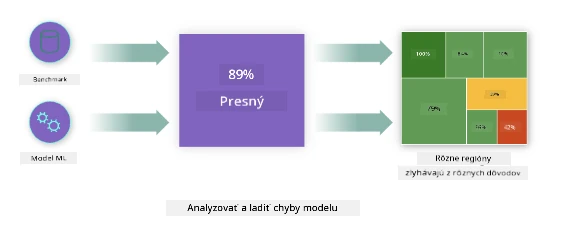
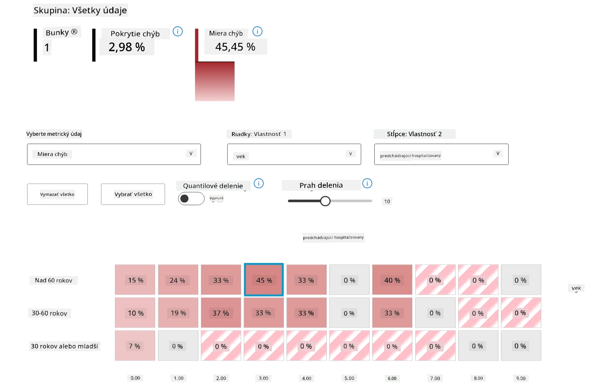
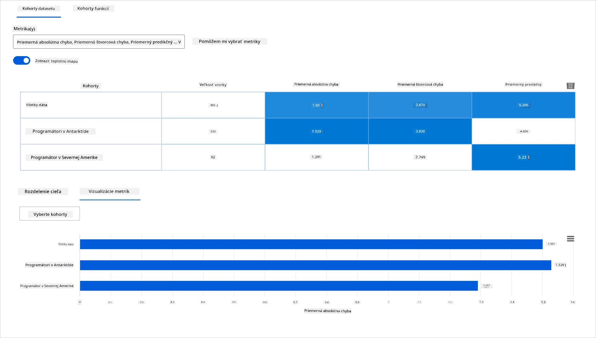
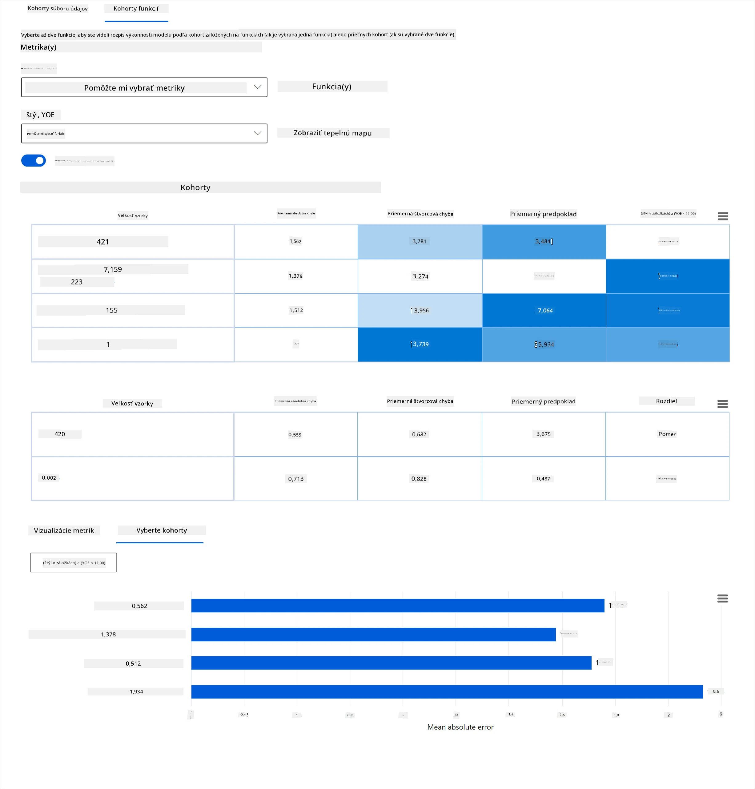
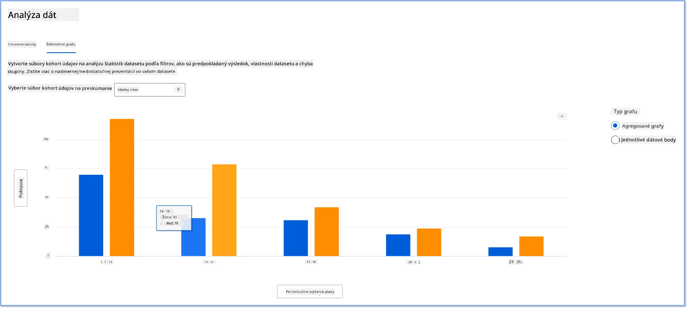
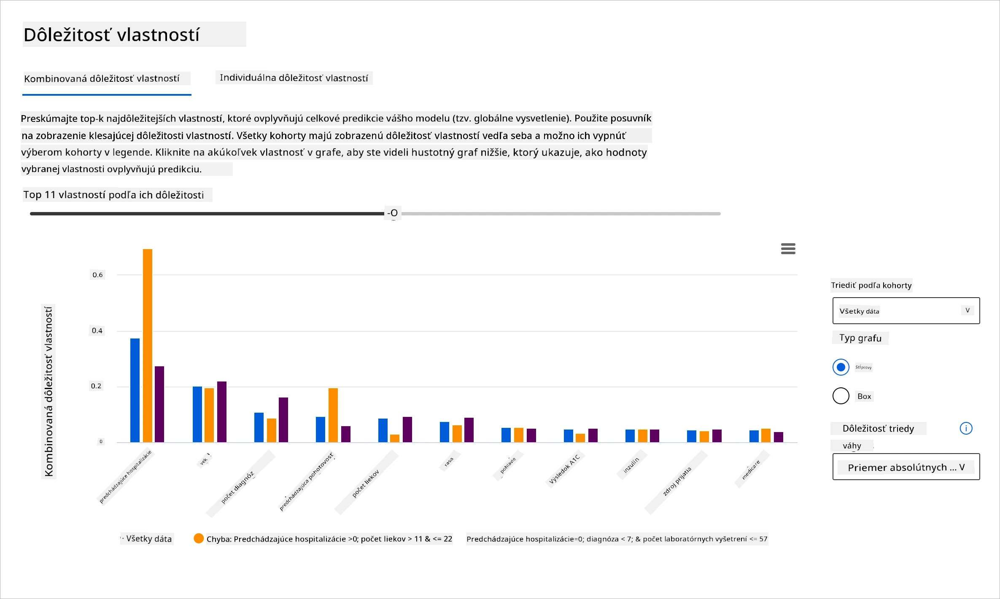
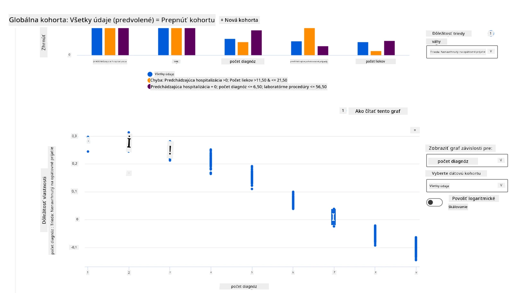

# Postscript: Ladenie modelov v strojovom učení pomocou komponentov panela Responsible AI
 

## [Prednáškový kvíz](https://ff-quizzes.netlify.app/en/ml/)
 
## Úvod

Strojové učenie ovplyvňuje náš každodenný život. AI sa dostáva do niektorých z najdôležitejších systémov, ktoré ovplyvňujú nás ako jednotlivcov, ako aj našu spoločnosť, od zdravotnej starostlivosti, financií, vzdelávania až po zamestnanosť. Napríklad systémy a modely sa podieľajú na každodenných rozhodovacích úlohách, ako sú zdravotné diagnózy alebo detekcia podvodov. Vývoj v oblasti AI spolu s rýchlym zavádzaním sú sprevádzané rastúcimi spoločenskými očakávaniami a reguláciou v reakcii na to. Neustále vidíme oblasti, kde systémy AI nespĺňajú očakávania; prinášajú nové výzvy; a vlády začínajú regulovať AI riešenia. Preto je dôležité tieto modely analyzovať s cieľom zabezpečiť spravodlivé, spoľahlivé, inkluzívne, transparentné a zodpovedné výsledky pre všetkých.

V tomto kurze sa pozrieme na praktické nástroje, ktoré možno použiť na posúdenie, či model má problémy zodpovedného AI. Tradičné techniky ladenia strojového učenia sú zvyčajne založené na kvantitatívnych výpočtoch, ako je súhrnná presnosť alebo priemerná chyba. Predstavte si, čo sa stane, keď dáta, ktoré používate na vytvorenie týchto modelov, obsahujú menej určitých demografických skupín, ako napríklad rasa, pohlavie, politické názory, náboženstvo, alebo ak takéto skupiny neprimerane zastupujú. Čo ak výstup modelu interpretujete tak, že uprednostňuje niektorú demografickú skupinu? To môže viesť k nadmernému alebo nedostatočnému zastúpeniu týchto citlivých skupín, čo spôsobí problémy so spravodlivosťou, inkluzivitou alebo spoľahlivosťou modelu. Ďalším faktorom je, že modely strojového učenia sa považujú za čierne skrinky, čo sťažuje pochopenie a vysvetlenie, čo ovplyvňuje predikciu modelu. Toto sú výzvy, ktorým čelia dátoví vedci a vývojári AI, keď nemajú dostatočné nástroje na ladenie a posúdenie spravodlivosti alebo spoľahlivosti modelu.

V tejto lekcii sa naučíte ladiť svoje modely pomocou:

-	**Analýza chýb**: identifikujte, kde v distribúcii dát má model vysoké miery chýb.
-	**Prehľad modelu**: vykonajte porovnávaciu analýzu medzi rôznymi dátovými kohortami, aby ste odhalili rozdiely vo výkonových metrikách modelu.
-	**Analýza dát**: preskúmajte, kde môže dôjsť k nadmernému alebo nedostatočnému zastúpeniu vašich dát, čo môže model skresliť v prospech jednej demografickej skupiny oproti druhej.
-	**Dôležitosť atribútov**: pochopte, ktoré atribúty ovplyvňujú predikcie modelu na globálnej alebo lokálnej úrovni.

## Predpoklady

Ako predpoklad si prosím prejdite prehľad [Responsible AI tools for developers](https://www.microsoft.com/ai/ai-lab-responsible-ai-dashboard)

> 

## Analýza chýb

Tradičné metriky výkonu modelu používané na meranie presnosti sú väčšinou založené na výpočtoch správnych a nesprávnych predikcií. Napríklad určiť, že model je presný 89 % času s chybou 0,001, možno považovať za dobrý výkon. Chyby však často nie sú rovnomerne rozložené v základnej dátovej sade. Môžete mať skóre presnosti modelu 89 %, ale zistiť, že existujú určité časti dát, kde model zlyháva 42 % času. Následky týchto vzorcov zlyhaní v určitých dátových skupinách môžu viesť k problémom so spravodlivosťou alebo spoľahlivosťou. Je nevyhnutné pochopiť oblasti, kde model dobre funguje alebo nie. Dátové oblasti s vysokým počtom nepresností v modeli môžu byť dôležitou dátovou demografickou skupinou.

Komponent Analýza chýb na paneli RAI zobrazuje, ako je zlyhanie modelu rozložené naprieč rôznymi kohortami pomocou stromovej vizualizácie. To je užitočné pri identifikovaní atribútov alebo oblastí s vysokou chybovosťou vo vašich dátach. Keď vidíte, odkiaľ prichádza väčšina nepresností modelu, môžete začať vyšetrovací proces. Tiež môžete vytvárať dátové kohorty na vykonanie analýzy. Tieto dátové kohorty pomáhajú pri ladení, aby ste zistili, prečo model funguje dobre v jednej kohorte, ale zle v druhej.

Vizualizačné indikátory na stromovej mape pomáhajú rýchlejšie lokalizovať problémové oblasti. Napríklad, tmavší odtieň červenej farby uzla stromu znamená vyššiu mieru chýb.

Heatmapa je ďalšia vizualizačná funkcia, ktorú používatelia môžu použiť na vyšetrovanie miery chýb pomocou jedného alebo dvoch atribútov s cieľom nájsť príčinu chýb modelu naprieč celou dátovou sadou alebo kohortami.

Používajte analýzu chýb, keď potrebujete:

* Získať hlboké pochopenie, ako sú zlyhania modelu rozložené naprieč dátovou sadou a rôznymi vstupnými a atribútovými rozmermi.
* Rozčleniť súhrnné metriky výkonu na automatické odhalenie chybových kohort na informovanie o cieľových krokoch zmierňovania.

## Prehľad modelu

Hodnotenie výkonu modelu strojového učenia vyžaduje celostné pochopenie jeho správania. To možno dosiahnuť prezeraním viacerých metrík, ako sú miera chýb, presnosť, recall, presnosť alebo MAE (Mean Absolute Error), aby sa odhalili rozdiely medzi výkonovými metrikami. Jedna metrika môže vyzerať skvele, ale nepresnosti môže odhaliť iná metrika. Porovnávanie metrík naprieč celou dátovou sadou alebo kohortami pomáha objasniť, kde model funguje dobre alebo nie. Toto je obzvlášť dôležité pri sledovaní výkonu modelu medzi citlivými a necitlivými atribútmi (napríklad rasa pacienta, pohlavie alebo vek) na odhalenie potenciálnej nespravodlivosti modelu. Napríklad zistenie, že model je chybnejší v kohorte s citlivými atribútmi, môže odhaliť potenciálnu nespravodlivosť modelu.

Komponent Prehľad modelu na paneli RAI pomáha nielen pri analýze výkonových metrík dátovej reprezentácie v kohorte, ale poskytuje používateľom možnosť porovnávať správanie modelu naprieč rôznymi kohortami.

Funkcia analýzy založenej na atribútoch komponentu umožňuje používateľom zúžiť dátové podskupiny v rámci konkrétneho atribútu na identifikáciu anomálií na detailnej úrovni. Napríklad panel má vstavanú inteligenciu na automatické generovanie kohort pre používateľom zvolený atribút (napr. *„time_in_hospital < 3“* alebo *„time_in_hospital >= 7“*). Toto umožňuje používateľovi izolovať konkrétny atribút zo širšej dátovej skupiny, aby zistil, či je kľúčovým faktorom ovplyvňujúcim chybné výstupy modelu.

Komponent Prehľad modelu podporuje dve triedy metrík disparity:

**Disparita vo výkone modelu**: Tieto metriky vypočítavajú rozdiel (disparitu) v hodnotách vybranej výkonovej metriky naprieč podsúbormi dát. Tu je niekoľko príkladov:

* Disparita v miere presnosti
* Disparita v miere chýb
* Disparita v presnosti (precision)
* Disparita v recall
* Disparita v priemernej absolútnej chybe (MAE)

**Disparita v miere výberu**: Táto metrika obsahuje rozdiel v miere výberu (priaznivej predikcie) medzi podsúbormi. Príkladom je disparita v schvaľovaní úverov. Miera výberu znamená zlomok dátových bodov v každej triede klasifikovaných ako 1 (v binárnej klasifikácii) alebo rozloženie predikčných hodnôt (v regresii).

## Analýza dát

> „Ak budete dostatočne dlho mučiť dáta, priznajú všetko“ - Ronald Coase

Toto tvrdenie znie extrémne, ale je pravda, že dáta možno manipulovať tak, aby podporili akýkoľvek záver. Takáto manipulácia sa niekedy deje neúmyselne. Ako ľudia máme všetci predsudky a často je ťažké vedome si uvedomiť, kedy ich do dát vnášame. Zaručiť spravodlivosť v AI a strojovom učení zostáva zložitou výzvou.

Dáta sú veľkým slepým miestom pre tradičné metriky výkonu modelu. Môžete mať vysoké skóre presnosti, ale to neodráža základnú dátovú zaujatost, ktorá môže byť vo vašej dataset. Napríklad, ak má dataset zamestnancov 27 % žien na vedúcich pozíciách a 73 % mužov na rovnakej úrovni, AI model na inzerovanie pracovných miest vycvičený na týchto dátach môže cieliť prevažne na mužskú časť publika pre vedúce pozície. Táto nevyváženosť v dátach skreslila predikciu modelu v prospech jedného pohlavia. Odhaľuje to problém spravodlivosti, kde v AI modeli existuje genderová zaujatost.

Komponent Analýza dát na paneli RAI pomáha identifikovať oblasti, kde dochádza k nadmernému alebo nedostatočnému zastúpeniu v datasetoch. Pomáha používateľom diagnostikovať príčinu chýb a problémov so spravodlivosťou spôsobených nerovnováhou dát alebo nedostatočným zastúpením konkrétnej dátovej skupiny. Umožňuje používateľom vizualizovať dataset na základe predikovaných a skutočných výsledkov, skupín chýb a špecifických atribútov. Niekedy objavenie podzastúpenej dátovej skupiny môže tiež odhaliť, že model sa neučí dobre, a preto dochádza k veľkému počtu nepresností. Model, ktorý má dátovú zaujatost, nie je len otázkou spravodlivosti, ale tiež ukazuje, že model nie je inkluzívny ani spoľahlivý.

Používajte analýzu dát, keď potrebujete:

* Preskúmať štatistiky datasetu výberom rôznych filtrov na rozdelenie dát do rôznych dimenzií (známych tiež ako kohorty).
* Pochopiť rozloženie datasetu medzi rôznymi kohortami a atribútovými skupinami.
* Určiť, či sú zistenia týkajúce sa spravodlivosti, analýzy chýb a kauzality (získané z iných komponentov panela) dôsledkom distribúcie datasetu.
* Rozhodnúť, v ktorých oblastiach je potrebné zozbierať viac dát na zmiernenie chýb vyplývajúcich z problémov so zastúpením, šumu v označeniach, šumu v atribútoch, zaujatosti v označeniach a podobných faktorov.

## Interpretovateľnosť modelu

Modely strojového učenia majú tendenciu byť čiernymi skrinkami. Pochopenie, ktoré kľúčové atribúty dát ovplyvňujú predikciu modelu, môže byť náročné. Je dôležité zabezpečiť transparentnosť, prečo model vykonal určitú predikciu. Napríklad, ak AI systém predpovedá, že diabetický pacient je ohrozený opätovným prijatím do nemocnice do 30 dní, mal by byť schopný poskytnúť podporné dáta, ktoré viedli k tejto predikcii. Mať takéto dátové indikátory prináša transparentnosť, ktorá pomáha lekárom alebo nemocniciam robiť dobre informované rozhodnutia. Okrem toho, schopnosť vysvetliť, prečo model vykonal predikciu pre konkrétneho pacienta, umožňuje zodpovednosť v súlade so zdravotnými predpismi. Keď používate modely strojového učenia spôsobmi, ktoré ovplyvňujú životy ľudí, je kľúčové pochopiť a vysvetliť, čo ovplyvňuje správanie modelu. Vysvetliteľnosť a interpretovateľnosť modelu pomáha odpovedať na otázky v scenároch ako:

* Ladenie modelu: Prečo môj model urobil túto chybu? Ako môžem model zlepšiť?
* Spolupráca človek-AI: Ako môžem porozumieť a dôverovať rozhodnutiam modelu?
* Súlad s reguláciou: Spĺňa môj model zákonné požiadavky?

Komponent Dôležitosť atribútov na paneli RAI vám pomáha ladiť a získať komplexné pochopenie, ako model robí predikcie. Je to tiež užitočný nástroj pre profesionálov v oblasti strojového učenia a rozhodovacích činiteľov na vysvetlenie a preukázanie vplyvu atribútov na správanie modelu v súlade s reguláciami. Ďalej môžu používatelia preskúmať globálne aj lokálne vysvetlenia, aby overili, ktoré atribúty ovplyvňujú predikciu modelu. Globálne vysvetlenia uvádzajú najdôležitejšie atribúty, ktoré ovplyvnili celkové predikcie modelu. Lokálne vysvetlenia zobrazujú, ktoré atribúty viedli k predikcii modelu v konkrétnom prípade. Schopnosť vyhodnocovať lokálne vysvetlenia je užitočná aj pri ladení alebo audite konkrétneho prípadu na lepšie pochopenie a interpretáciu, prečo model vykonal presnú alebo nepresnú predikciu.

* Globálne vysvetlenia: Napríklad, ktoré atribúty ovplyvňujú celkové správanie modelu na predikciu opätovného prijatia diabetických pacientov do nemocnice?
* Lokálne vysvetlenia: Napríklad, prečo bol diabetický pacient nad 60 rokov s predchádzajúcimi hospitalizáciami predpovedaný byť prijatý alebo neprijatý späť do nemocnice do 30 dní?

Pri ladení modelu a skúmaní jeho výkonu naprieč rôznymi kohortami, Dôležitosť atribútov ukazuje, aký vplyv má atribút v rámci kohôrt. Pomáha odhaliť anomálie pri porovnávaní úrovne vplyvu atribútu na chybné predikcie modelu. Komponent Dôležitosť atribútov môže zobraziť, ktoré hodnoty v atribúte pozitívne alebo negatívne ovplyvnili výsledok modelu. Napríklad, ak model urobil nepresnú predikciu, komponent vám umožňuje presne určiť, ktoré atribúty alebo hodnoty atribútov viedli k tejto predikcii. Táto úroveň detailov pomáha nielen pri ladení, ale prináša aj transparentnosť a zodpovednosť pri audite. Nakoniec komponent môže pomôcť identifikovať problémy so spravodlivosťou. Ilustračným príkladom je, ak citlivý atribút ako etnická príslušnosť alebo pohlavie má vysoký vplyv na predikciu modelu, môže to byť znakom rasovej alebo genderovej zaujatosti v modeli.

Používajte interpretovateľnosť, keď potrebujete:

* Určiť, do akej miery sú predikcie vášho AI systému dôveryhodné tým, že pochopíte, ktoré atribúty sú pre predikcie najdôležitejšie.
* Pristúpiť k ladeniu modelu tak, že najprv pochopíte model a zistíte, či používa zdravé atribúty alebo iba falošné korelácie.
* Odhaľovať potenciálne zdroje nespravodlivosti tým, že pochopíte, či model zakladá predikcie na citlivých atribútoch alebo na atribútoch, ktoré s nimi silne korelujú.
* Budovať dôveru používateľov v rozhodnutia modelu generovaním lokálnych vysvetlení na ilustráciu ich výsledkov.
* Dokončiť regulačný audit AI systému na validáciu modelov a monitorovanie vplyvu rozhodnutí modelu na ľudí.

## Záver

Všetky komponenty panela RAI sú praktické nástroje, ktoré vám pomáhajú vytvárať modely strojového učenia, ktoré sú menej škodlivé a spoľahlivejšie pre spoločnosť. Zlepšujú prevenciu hrozieb ľudským právam; diskrimináciu alebo vylučovanie určitých skupín z životných príležitostí; a riziko fyzického alebo psychického poškodenia. Tiež pomáhajú budovať dôveru v rozhodnutia vášho modelu generovaním lokálnych vysvetlení, ktoré ilustrujú ich výsledky. Niektoré z potenciálnych škôd možno klasifikovať ako:

- **Alokácia**, ak je napríklad preferované pohlavie alebo etnický pôvod pred iným.
- **Kvalita služby**. Ak trénujete dáta iba na jeden konkrétny scenár, ale realita je oveľa zložitejšia, vedie to k zlému výkonu služby.
- **Stereotypizácia**. Spájanie danej skupiny s predpokladanými atribútmi.

- **Znehodnocovanie**. Nespravodlivo kritizovať a označovať niečo alebo niekoho.
- **Nadmerné alebo nedostatočné zastúpenie**. Myšlienka je, že určitá skupina nie je viditeľná v určitom povolaní, a akákoľvek služba alebo funkcia, ktorá to naďalej propaguje, prispieva k škode.

### Azure RAI dashboard
 
[Azure RAI dashboard](https://learn.microsoft.com/en-us/azure/machine-learning/concept-responsible-ai-dashboard?WT.mc_id=aiml-90525-ruyakubu) je postavený na open-source nástrojoch vyvinutých vedúcimi akademickými inštitúciami a organizáciami vrátane Microsoftu, ktoré sú kľúčové pre dátových vedcov a vývojárov AI lepšie pochopiť správanie modelu, objaviť a zmierniť neželané problémy z AI modelov.

- Naučte sa používať rôzne komponenty s pomocou dokumentácie pre RAI dashboard [docs.](https://learn.microsoft.com/en-us/azure/machine-learning/how-to-responsible-ai-dashboard?WT.mc_id=aiml-90525-ruyakubu)

- Pozrite si niektoré vzorové RAI dashboard [sample notebooks](https://github.com/Azure/RAI-vNext-Preview/tree/main/examples/notebooks) na ladenie zodpovednejších AI scenárov v Azure Machine Learning.
  
---
## 🚀 Výzva
 
Aby sme predišli zavádzaniu štatistických alebo dátových predsudkov už na začiatku, mali by sme:

- mať rôznorodé zázemie a perspektívy medzi ľuďmi pracujúcimi na systémoch
- investovať do datasetov, ktoré odrážajú rozmanitosť našej spoločnosti
- vyvíjať lepšie metódy na odhaľovanie a opravovanie predsudkov, keď vzniknú

Zamyslite sa nad reálnymi situáciami, kde je nespravodlivosť zjavná pri tvorbe a používaní modelov. Čo ďalšie by sme mali zvážiť?

## [Kvíz po prednáške](https://ff-quizzes.netlify.app/en/ml/)
## Prehľad a samostatné štúdium
 
V tejto lekcii ste sa naučili niektoré praktické nástroje na začlenenie zodpovednej AI v strojovom učení.

Pozrite si tento workshop a ponorte sa hlbšie do tém:

- Responsible AI Dashboard: Všetko na jednom mieste pre uvedenie RAI do praxe od Besmira Nushi a Mehrnoosh Sameki

> 🎥 Kliknite na obrázok vyššie pre video: Responsible AI Dashboard: Všetko na jednom mieste pre uvedenie RAI do praxe od Besmira Nushi a Mehrnoosh Sameki
 
Prečítajte si nasledujúce materiály a naučte sa viac o zodpovednej AI a ako budovať dôveryhodnejšie modely:

- Nástroje Microsoft RAI dashboard na ladenie ML modelov: [Responsible AI tools resources](https://aka.ms/rai-dashboard)

- Preskúmajte sadu nástrojov Responsible AI: [Github](https://github.com/microsoft/responsible-ai-toolbox)

- Microsoft RAI resource center: [Responsible AI Resources – Microsoft AI](https://www.microsoft.com/ai/responsible-ai-resources?activetab=pivot1%3aprimaryr4)

- Výskumná skupina Microsoft FATE: [FATE: Fairness, Accountability, Transparency, and Ethics in AI - Microsoft Research](https://www.microsoft.com/research/theme/fate/)

## Zadanie

[Preskúmať RAI dashboard](assignment.md)

---

<!-- CO-OP TRANSLATOR DISCLAIMER START -->
**Vyhlásenie o zodpovednosti**:
Tento dokument bol preložený pomocou AI prekladateľskej služby [Co-op Translator](https://github.com/Azure/co-op-translator). Hoci sa snažíme o presnosť, vezmite prosím na vedomie, že automatické preklady môžu obsahovať chyby alebo nepresnosti. Pôvodný dokument v jeho natívnom jazyku by mal byť považovaný za autoritatívny zdroj. Pre kritické informácie sa odporúča profesionálny ľudský preklad. Nie sme zodpovední za žiadne nedorozumenia alebo nesprávne interpretácie vyplývajúce z použitia tohto prekladu.
<!-- CO-OP TRANSLATOR DISCLAIMER END -->