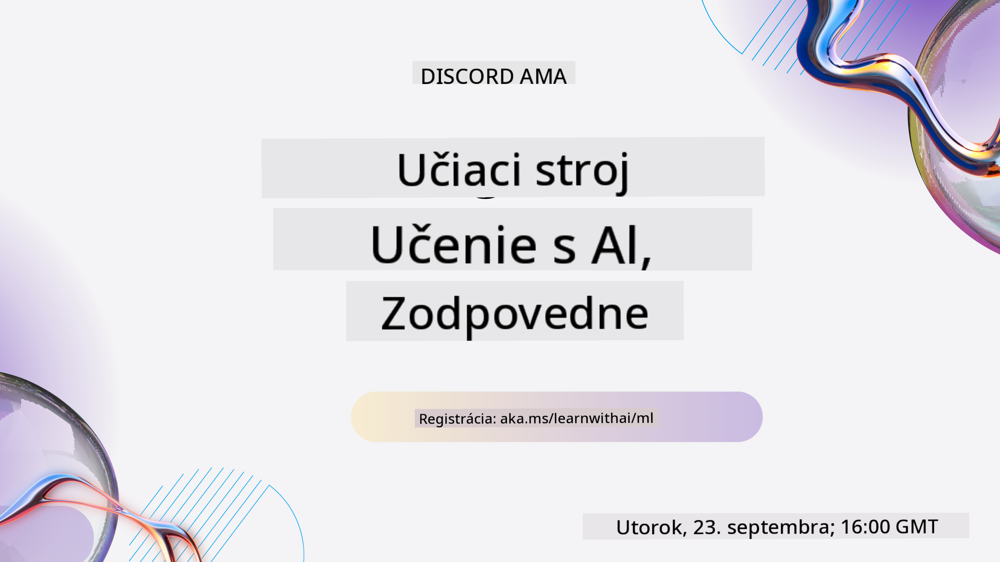
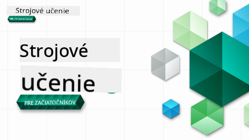

<!--
CO_OP_TRANSLATOR_METADATA:
{
  "original_hash": "7a13afb3674838f557d61f8d67e4d5f8",
  "translation_date": "2025-10-24T09:21:21+00:00",
  "source_file": "README.md",
  "language_code": "sk"
}
-->

### 🌐 Podpora viacerých jazykov

#### Podporované cez GitHub Action (Automatizované a vždy aktuálne)

<!-- CO-OP TRANSLATOR LANGUAGES TABLE START -->
[Arabčina](../ar/README.md) | [Bengálčina](../bn/README.md) | [Bulharčina](../bg/README.md) | [Barmčina (Mjanmarsko)](../my/README.md) | [Čínština (zjednodušená)](../zh/README.md) | [Čínština (tradičná, Hongkong)](../hk/README.md) | [Čínština (tradičná, Macao)](../mo/README.md) | [Čínština (tradičná, Taiwan)](../tw/README.md) | [Chorvátčina](../hr/README.md) | [Čeština](../cs/README.md) | [Dánčina](../da/README.md) | [Holandčina](../nl/README.md) | [Estónčina](../et/README.md) | [Fínčina](../fi/README.md) | [Francúzština](../fr/README.md) | [Nemčina](../de/README.md) | [Gréčtina](../el/README.md) | [Hebrejčina](../he/README.md) | [Hindčina](../hi/README.md) | [Maďarčina](../hu/README.md) | [Indonézština](../id/README.md) | [Taliančina](../it/README.md) | [Japončina](../ja/README.md) | [Kórejčina](../ko/README.md) | [Litovčina](../lt/README.md) | [Malajčina](../ms/README.md) | [Maráthčina](../mr/README.md) | [Nepálčina](../ne/README.md) | [Nórčina](../no/README.md) | [Perzština (Farsi)](../fa/README.md) | [Poľština](../pl/README.md) | [Portugalčina (Brazília)](../br/README.md) | [Portugalčina (Portugalsko)](../pt/README.md) | [Pandžábčina (Gurmukhi)](../pa/README.md) | [Rumunčina](../ro/README.md) | [Ruština](../ru/README.md) | [Srbčina (cyrilika)](../sr/README.md) | [Slovenčina](./README.md) | [Slovinčina](../sl/README.md) | [Španielčina](../es/README.md) | [Swahilčina](../sw/README.md) | [Švédčina](../sv/README.md) | [Tagalog (Filipínčina)](../tl/README.md) | [Tamilčina](../ta/README.md) | [Thajčina](../th/README.md) | [Turečtina](../tr/README.md) | [Ukrajinčina](../uk/README.md) | [Urdu](../ur/README.md) | [Vietnamčina](../vi/README.md)
<!-- CO-OP TRANSLATOR LANGUAGES TABLE END -->

#### Pripojte sa k našej komunite

Máme prebiehajúcu sériu učenia sa s AI na Discorde, dozviete sa viac a pripojte sa k nám na [Learn with AI Series](https://aka.ms/learnwithai/discord) od 18. do 30. septembra 2025. Získate tipy a triky na používanie GitHub Copilot pre Data Science.

# Strojové učenie pre začiatočníkov - Kurikulum

> 🌍 Cestujte po svete, keď objavujeme strojové učenie prostredníctvom svetových kultúr 🌍

Cloud Advocates v Microsofte s radosťou ponúkajú 12-týždňové, 26-lekciové kurikulum o **strojovom učení**. V tomto kurikule sa naučíte o tom, čo sa niekedy nazýva **klasické strojové učenie**, pričom sa primárne používa knižnica Scikit-learn a vyhýba sa hlbokému učeniu, ktoré je pokryté v našom [kurikule AI pre začiatočníkov](https://aka.ms/ai4beginners). Spojte tieto lekcie s naším kurikulom ['Data Science for Beginners'](https://aka.ms/ds4beginners), tiež!

Cestujte s nami po svete, keď aplikujeme tieto klasické techniky na údaje z rôznych oblastí sveta. Každá lekcia obsahuje kvízy pred a po lekcii, písomné pokyny na dokončenie lekcie, riešenie, úlohu a ďalšie. Náš projektovo orientovaný prístup vám umožní učiť sa pri budovaní, čo je osvedčený spôsob, ako si nové zručnosti lepšie zapamätať.

**✍️ Srdečné poďakovanie našim autorom** Jen Looper, Stephen Howell, Francesca Lazzeri, Tomomi Imura, Cassie Breviu, Dmitry Soshnikov, Chris Noring, Anirban Mukherjee, Ornella Altunyan, Ruth Yakubu a Amy Boyd

**🎨 Poďakovanie aj našim ilustrátorom** Tomomi Imura, Dasani Madipalli a Jen Looper

**🙏 Špeciálne poďakovanie 🙏 našim Microsoft Student Ambassador autorom, recenzentom a prispievateľom obsahu**, najmä Rishit Dagli, Muhammad Sakib Khan Inan, Rohan Raj, Alexandru Petrescu, Abhishek Jaiswal, Nawrin Tabassum, Ioan Samuila a Snigdha Agarwal

**🤩 Extra vďaka Microsoft Student Ambassadors Eric Wanjau, Jasleen Sondhi a Vidushi Gupta za naše lekcie v R!**

# Začíname

Postupujte podľa týchto krokov:
1. **Forknite repozitár**: Kliknite na tlačidlo "Fork" v pravom hornom rohu tejto stránky.
2. **Klonujte repozitár**:   `git clone https://github.com/microsoft/ML-For-Beginners.git`

> [nájdite všetky ďalšie zdroje pre tento kurz v našej kolekcii Microsoft Learn](https://learn.microsoft.com/en-us/collections/qrqzamz1nn2wx3?WT.mc_id=academic-77952-bethanycheum)

> 🔧 **Potrebujete pomoc?** Pozrite si náš [Sprievodca riešením problémov](TROUBLESHOOTING.md) pre riešenia bežných problémov s inštaláciou, nastavením a spúšťaním lekcií.

**[Študenti](https://aka.ms/student-page)**, na použitie tohto kurikula si forknite celý repozitár do svojho vlastného GitHub účtu a dokončite cvičenia sami alebo v skupine:

- Začnite kvízom pred prednáškou.
- Prečítajte si prednášku a dokončite aktivity, zastavte sa a zamyslite sa pri každej kontrole vedomostí.
- Pokúste sa vytvoriť projekty pochopením lekcií namiesto spúšťania riešenia kódu; tento kód je však dostupný v priečinkoch `/solution` v každej projektovo orientovanej lekcii.
- Urobte kvíz po prednáške.
- Dokončite výzvu.
- Dokončite úlohu.
- Po dokončení skupiny lekcií navštívte [Diskusnú tabuľu](https://github.com/microsoft/ML-For-Beginners/discussions) a "učte sa nahlas" vyplnením príslušného PAT rubriky. 'PAT' je nástroj na hodnotenie pokroku, ktorý je rubrikou, ktorú vyplníte na ďalšie učenie. Môžete tiež reagovať na iné PAT, aby sme sa učili spolu.

> Na ďalšie štúdium odporúčame sledovať tieto [Microsoft Learn](https://docs.microsoft.com/en-us/users/jenlooper-2911/collections/k7o7tg1gp306q4?WT.mc_id=academic-77952-leestott) moduly a učebné cesty.

**Učitelia**, [pridali sme niekoľko návrhov](for-teachers.md) na použitie tohto kurikula.

---

## Video prehliadky

Niektoré lekcie sú dostupné ako krátke videá. Všetky nájdete priamo v lekciách alebo na [ML for Beginners playlist na YouTube kanáli Microsoft Developer](https://aka.ms/ml-beginners-videos) kliknutím na obrázok nižšie.

---

## Spoznajte tím

**Gif od** [Mohit Jaisal](https://linkedin.com/in/mohitjaisal)

> 🎥 Kliknite na obrázok vyššie pre video o projekte a ľuďoch, ktorí ho vytvorili!

---

## Pedagogika

Pri tvorbe tohto kurikula sme si vybrali dve pedagogické zásady: zabezpečiť, aby bolo praktické **projektovo orientované** a aby obsahovalo **časté kvízy**. Okrem toho má toto kurikulum spoločnú **tému**, ktorá mu dodáva súdržnosť.

Zabezpečením, že obsah je v súlade s projektmi, sa proces stáva pre študentov pútavejším a zlepšuje sa zapamätanie konceptov. Okrem toho nízko-stresový kvíz pred hodinou nastavuje úmysel študenta na učenie sa témy, zatiaľ čo druhý kvíz po hodine zabezpečuje ďalšie zapamätanie. Toto kurikulum bolo navrhnuté tak, aby bolo flexibilné a zábavné a mohlo byť absolvované celé alebo čiastočne. Projekty začínajú malé a postupne sa stávajú zložitejšími na konci 12-týždňového cyklu. Toto kurikulum tiež obsahuje dodatok o reálnych aplikáciách ML, ktorý môže byť použitý ako extra kredit alebo ako základ pre diskusiu.

> Nájdite náš [Kódex správania](CODE_OF_CONDUCT.md), [Prispievanie](CONTRIBUTING.md), [Preklady](TRANSLATIONS.md) a [Riešenie problémov](TROUBLESHOOTING.md). Uvítame vašu konštruktívnu spätnú väzbu!

## Každá lekcia obsahuje

- voliteľný sketchnote
- voliteľné doplnkové video
- video prehliadku (len niektoré lekcie)
- [kvíz na zahriatie pred prednáškou](https://ff-quizzes.netlify.app/en/ml/)
- písomnú lekciu
- pre projektovo orientované lekcie, podrobné návody na vytvorenie projektu
- kontroly vedomostí
- výzvu
- doplnkové čítanie
- úlohu
- [kvíz po prednáške](https://ff-quizzes.netlify.app/en/ml/)

> **Poznámka o jazykoch**: Tieto lekcie sú primárne napísané v Pythone, ale mnohé sú dostupné aj v R. Na dokončenie lekcie v R prejdite do priečinka `/solution` a hľadajte lekcie v R. Obsahujú príponu .rmd, ktorá predstavuje **R Markdown** súbor, ktorý možno jednoducho definovať ako vloženie `code chunks` (R alebo iných jazykov) a `YAML header` (ktorý určuje, ako formátovať výstupy ako PDF) do `Markdown dokumentu`. Ako taký slúži ako príkladný autorovací rámec pre dátovú vedu, pretože vám umožňuje kombinovať váš kód, jeho výstup a vaše myšlienky tým, že ich zapíšete do Markdown. Navyše, R Markdown dokumenty môžu byť vykreslené do výstupných formátov ako PDF, HTML alebo Word.

> **Poznámka o kvízoch**: Všetky kvízy sú obsiahnuté v [priečinku Quiz App](../../quiz-app), celkovo 52 kvízov po tri otázky. Sú prepojené priamo z lekcií, ale aplikáciu kvízov je možné spustiť lokálne; postupujte podľa pokynov v priečinku `quiz-app` na lokálne hosťovanie alebo nasadenie na Azure.

| Číslo lekcie |                             Téma                              |                   Skupina lekcií                   | Ciele učenia                                                                                                             |                                                              Prepojená lekcia                                                               |                        Autor                        |
| :-----------: | :------------------------------------------------------------: | :-------------------------------------------------: | ------------------------------------------------------------------------------------------------------------------------------- | :--------------------------------------------------------------------------------------------------------------------------------------: | :--------------------------------------------------: |
|      01       |                Úvod do strojového učenia                |      [Úvod](1-Introduction/README.md)       | Naučte sa základné koncepty strojového učenia                                                                                |                                             [Lekcia](1-Introduction/1-intro-to-ML/README.md)                                             |                       Muhammad                       |
|      02       |                História strojového učenia                 |      [Úvod](1-Introduction/README.md)       | Zoznámte sa s históriou tohto odboru                                                                                         |                                            [Lekcia](1-Introduction/2-history-of-ML/README.md)                                            |                     Jen a Amy                      |
|      03       |                 Spravodlivosť a strojové učenie                  |      [Úvod](1-Introduction/README.md)       | Aké sú dôležité filozofické otázky týkajúce sa spravodlivosti, ktoré by študenti mali zvážiť pri vytváraní a aplikovaní modelov strojového učenia? |                                              [Lekcia](1-Introduction/3-fairness/README.md)                                               |                        Tomomi                        |
|      04       |                Techniky strojového učenia                 |      [Úvod](1-Introduction/README.md)       | Aké techniky používajú výskumníci strojového učenia na vytváranie modelov strojového učenia?                                                                       |                                          [Lekcia](1-Introduction/4-techniques-of-ML/README.md)                                           |                    Chris a Jen                     |
|      05       |                   Úvod do regresie                   |        [Regresia](2-Regression/README.md)         | Začnite s Pythonom a Scikit-learn pre regresné modely                                                                  |         [Python](2-Regression/1-Tools/README.md) • [R](../../2-Regression/1-Tools/solution/R/lesson_1.html)         |      Jen • Eric Wanjau       |
|      06       |                Ceny tekvíc v Severnej Amerike 🎃                |        [Regresia](2-Regression/README.md)         | Vizualizujte a vyčistite údaje na prípravu pre strojové učenie                                                                                  |          [Python](2-Regression/2-Data/README.md) • [R](../../2-Regression/2-Data/solution/R/lesson_2.html)          |      Jen • Eric Wanjau       |
|      07       |                Ceny tekvíc v Severnej Amerike 🎃                |        [Regresia](2-Regression/README.md)         | Vytvorte lineárne a polynomiálne regresné modely                                                                                   |        [Python](2-Regression/3-Linear/README.md) • [R](../../2-Regression/3-Linear/solution/R/lesson_3.html)        |      Jen a Dmitry • Eric Wanjau       |
|      08       |                Ceny tekvíc v Severnej Amerike 🎃                |        [Regresia](2-Regression/README.md)         | Vytvorte logistický regresný model                                                                                               |     [Python](2-Regression/4-Logistic/README.md) • [R](../../2-Regression/4-Logistic/solution/R/lesson_4.html)      |      Jen • Eric Wanjau       |
|      09       |                          Webová aplikácia 🔌                          |           [Webová aplikácia](3-Web-App/README.md)            | Vytvorte webovú aplikáciu na použitie vášho trénovaného modelu                                                                                       |                                                 [Python](3-Web-App/1-Web-App/README.md)                                                  |                         Jen                          |
|      10       |                 Úvod do klasifikácie                 |    [Klasifikácia](4-Classification/README.md)     | Vyčistite, pripravte a vizualizujte svoje údaje; úvod do klasifikácie                                                            | [Python](4-Classification/1-Introduction/README.md) • [R](../../4-Classification/1-Introduction/solution/R/lesson_10.html)  | Jen a Cassie • Eric Wanjau |
|      11       |             Lahodné ázijské a indické kuchyne 🍜             |    [Klasifikácia](4-Classification/README.md)     | Úvod do klasifikátorov                                                                                                     | [Python](4-Classification/2-Classifiers-1/README.md) • [R](../../4-Classification/2-Classifiers-1/solution/R/lesson_11.html) | Jen a Cassie • Eric Wanjau |
|      12       |             Lahodné ázijské a indické kuchyne 🍜             |    [Klasifikácia](4-Classification/README.md)     | Viac klasifikátorov                                                                                                                | [Python](4-Classification/3-Classifiers-2/README.md) • [R](../../4-Classification/3-Classifiers-2/solution/R/lesson_12.html) | Jen a Cassie • Eric Wanjau |
|      13       |             Lahodné ázijské a indické kuchyne 🍜             |    [Klasifikácia](4-Classification/README.md)     | Vytvorte webovú aplikáciu odporúčania pomocou vášho modelu                                                                                    |                                              [Python](4-Classification/4-Applied/README.md)                                              |                         Jen                          |
|      14       |                   Úvod do zhlukovania                   |        [Zhlukovanie](5-Clustering/README.md)         | Vyčistite, pripravte a vizualizujte svoje údaje; Úvod do zhlukovania                                                                |         [Python](5-Clustering/1-Visualize/README.md) • [R](../../5-Clustering/1-Visualize/solution/R/lesson_14.html)         |      Jen • Eric Wanjau       |
|      15       |              Preskúmanie nigérijských hudobných chutí 🎧              |        [Zhlukovanie](5-Clustering/README.md)         | Preskúmajte metódu zhlukovania K-Means                                                                                           |           [Python](5-Clustering/2-K-Means/README.md) • [R](../../5-Clustering/2-K-Means/solution/R/lesson_15.html)           |      Jen • Eric Wanjau       |
|      16       |        Úvod do spracovania prirodzeného jazyka ☕️         |   [Spracovanie prirodzeného jazyka](6-NLP/README.md)    | Naučte sa základy NLP vytvorením jednoduchého bota                                                                             |                                             [Python](6-NLP/1-Introduction-to-NLP/README.md)                                              |                       Stephen                        |
|      17       |                      Bežné úlohy NLP ☕️                      |   [Spracovanie prirodzeného jazyka](6-NLP/README.md)    | Prehĺbte svoje znalosti NLP pochopením bežných úloh potrebných pri práci so štruktúrami jazyka                          |                                                    [Python](6-NLP/2-Tasks/README.md)                                                     |                       Stephen                        |
|      18       |             Preklad a analýza sentimentu ♥️              |   [Spracovanie prirodzeného jazyka](6-NLP/README.md)    | Preklad a analýza sentimentu s Jane Austen                                                                             |                                            [Python](6-NLP/3-Translation-Sentiment/README.md)                                             |                       Stephen                        |
|      19       |                  Romantické hotely v Európe ♥️                  |   [Spracovanie prirodzeného jazyka](6-NLP/README.md)    | Analýza sentimentu s recenziami hotelov 1                                                                                         |                                               [Python](6-NLP/4-Hotel-Reviews-1/README.md)                                                |                       Stephen                        |
|      20       |                  Romantické hotely v Európe ♥️                  |   [Spracovanie prirodzeného jazyka](6-NLP/README.md)    | Analýza sentimentu s recenziami hotelov 2                                                                                         |                                               [Python](6-NLP/5-Hotel-Reviews-2/README.md)                                                |                       Stephen                        |
|      21       |            Úvod do predikcie časových radov             |        [Časové rady](7-TimeSeries/README.md)        | Úvod do predikcie časových radov                                                                                         |                                             [Python](7-TimeSeries/1-Introduction/README.md)                                              |                      Francesca                       |
|      22       | ⚡️ Svetová spotreba energie ⚡️ - predikcia časových radov s ARIMA |        [Časové rady](7-TimeSeries/README.md)        | Predikcia časových radov s ARIMA                                                                                              |                                                 [Python](7-TimeSeries/2-ARIMA/README.md)                                                 |                      Francesca                       |
|      23       |  ⚡️ Svetová spotreba energie ⚡️ - predikcia časových radov s SVR  |        [Časové rady](7-TimeSeries/README.md)        | Predikcia časových radov s Support Vector Regressor                                                                           |                                                  [Python](7-TimeSeries/3-SVR/README.md)                                                  |                       Anirban                        |
|      24       |             Úvod do posilňovacieho učenia             | [Posilňovacie učenie](8-Reinforcement/README.md) | Úvod do posilňovacieho učenia s Q-Learning                                                                          |                                             [Python](8-Reinforcement/1-QLearning/README.md)                                              |                        Dmitry                        |
|      25       |                 Pomôžte Petrovi vyhnúť sa vlkovi! 🐺                  | [Posilňovacie učenie](8-Reinforcement/README.md) | Posilňovacie učenie Gym                                                                                                      |                                                [Python](8-Reinforcement/2-Gym/README.md)                                                 |                        Dmitry                        |
|  Postscript   |            Scenáre a aplikácie strojového učenia v reálnom svete            |      [ML v praxi](9-Real-World/README.md)       | Zaujímavé a odhaľujúce aplikácie klasického strojového učenia                                                               |                                             [Lekcia](9-Real-World/1-Applications/README.md)                                              |                         Tím                         |
|  Postscript   |            Ladenie modelov v strojovom učení pomocou RAI dashboardu          |      [ML v praxi](9-Real-World/README.md)       | Ladenie modelov v strojovom učení pomocou komponentov Responsible AI dashboard                                                              |                                             [Lekcia](9-Real-World/2-Debugging-ML-Models/README.md)                                              |                         Ruth Yakubu                       |

> [nájdite všetky ďalšie zdroje pre tento kurz v našej kolekcii Microsoft Learn](https://learn.microsoft.com/en-us/collections/qrqzamz1nn2wx3?WT.mc_id=academic-77952-bethanycheum)

## Offline prístup

Túto dokumentáciu môžete spustiť offline pomocou [Docsify](https://docsify.js.org/#/). Forknite tento repozitár, [nainštalujte Docsify](https://docsify.js.org/#/quickstart) na svojom lokálnom počítači a potom v koreňovom priečinku tohto repozitára zadajte `docsify serve`. Webová stránka bude dostupná na porte 3000 na vašom localhoste: `localhost:3000`.

## PDF súbory

Nájdite PDF verziu učebných osnov s odkazmi [tu](https://microsoft.github.io/ML-For-Beginners/pdf/readme.pdf).

## 🎒 Ďalšie kurzy 

Náš tím vytvára aj ďalšie kurzy! Pozrite si:

### Azure / Edge / MCP / Agentov

---
 
### Generatívna AI séria

[-9333EA?style=for-the-badge&labelColor=E5E7EB&color=9333EA)](https://github.com/microsoft/Generative-AI-for-beginners-dotnet?WT.mc_id=academic-105485-koreyst)
[-C084FC?style=for-the-badge&labelColor=E5E7EB&color=C084FC)](https://github.com/microsoft/generative-ai-for-beginners-java?WT.mc_id=academic-105485-koreyst)
[-E879F9?style=for-the-badge&labelColor=E5E7EB&color=E879F9)](https://github.com/microsoft/generative-ai-with-javascript?WT.mc_id=academic-105485-koreyst)

---
 
### Základné učenie
  
  
  
  
  
  
  

---

### Copilot séria  
  
  
  

## Získanie pomoci  

Ak sa zaseknete alebo máte otázky ohľadom vytvárania AI aplikácií, pridajte sa:  

  

Ak máte spätnú väzbu k produktom alebo narazíte na chyby pri vývoji, navštívte:  

  

---

**Zrieknutie sa zodpovednosti**:  
Tento dokument bol preložený pomocou služby AI prekladu [Co-op Translator](https://github.com/Azure/co-op-translator). Aj keď sa snažíme o presnosť, prosím, berte na vedomie, že automatizované preklady môžu obsahovať chyby alebo nepresnosti. Pôvodný dokument v jeho rodnom jazyku by mal byť považovaný za autoritatívny zdroj. Pre kritické informácie sa odporúča profesionálny ľudský preklad. Nenesieme zodpovednosť za akékoľvek nedorozumenia alebo nesprávne interpretácie vyplývajúce z použitia tohto prekladu.