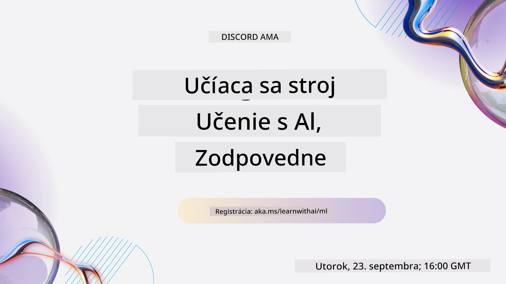
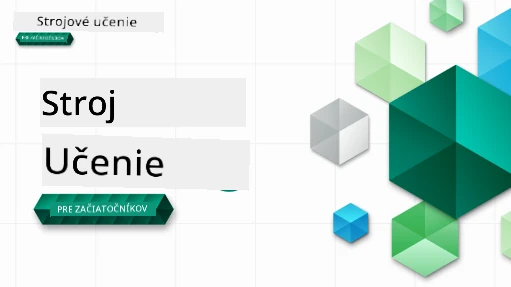

[](https://github.com/microsoft/ML-For-Beginners/blob/master/LICENSE)
[](https://GitHub.com/microsoft/ML-For-Beginners/graphs/contributors/)
[](https://GitHub.com/microsoft/ML-For-Beginners/issues/)
[](https://GitHub.com/microsoft/ML-For-Beginners/pulls/)
[](http://makeapullrequest.com)

[](https://GitHub.com/microsoft/ML-For-Beginners/watchers/)
[](https://GitHub.com/microsoft/ML-For-Beginners/network/)
[](https://GitHub.com/microsoft/ML-For-Beginners/stargazers/)

### 🌐 Podpora viacerých jazykov

#### Podporované cez GitHub Action (automatizované a vždy aktuálne)

<!-- CO-OP TRANSLATOR LANGUAGES TABLE START -->
[Arabic](../ar/README.md) | [Bengali](../bn/README.md) | [Bulgarian](../bg/README.md) | [Burmese (Myanmar)](../my/README.md) | [Chinese (Simplified)](../zh-CN/README.md) | [Chinese (Traditional, Hong Kong)](../zh-HK/README.md) | [Chinese (Traditional, Macau)](../zh-MO/README.md) | [Chinese (Traditional, Taiwan)](../zh-TW/README.md) | [Croatian](../hr/README.md) | [Czech](../cs/README.md) | [Danish](../da/README.md) | [Dutch](../nl/README.md) | [Estonian](../et/README.md) | [Finnish](../fi/README.md) | [French](../fr/README.md) | [German](../de/README.md) | [Greek](../el/README.md) | [Hebrew](../he/README.md) | [Hindi](../hi/README.md) | [Hungarian](../hu/README.md) | [Indonesian](../id/README.md) | [Italian](../it/README.md) | [Japanese](../ja/README.md) | [Kannada](../kn/README.md) | [Khmer](../km/README.md) | [Korean](../ko/README.md) | [Lithuanian](../lt/README.md) | [Malay](../ms/README.md) | [Malayalam](../ml/README.md) | [Marathi](../mr/README.md) | [Nepali](../ne/README.md) | [Nigerian Pidgin](../pcm/README.md) | [Norwegian](../no/README.md) | [Persian (Farsi)](../fa/README.md) | [Polish](../pl/README.md) | [Portuguese (Brazil)](../pt-BR/README.md) | [Portuguese (Portugal)](../pt-PT/README.md) | [Punjabi (Gurmukhi)](../pa/README.md) | [Romanian](../ro/README.md) | [Russian](../ru/README.md) | [Serbian (Cyrillic)](../sr/README.md) | [Slovak](./README.md) | [Slovenian](../sl/README.md) | [Spanish](../es/README.md) | [Swahili](../sw/README.md) | [Swedish](../sv/README.md) | [Tagalog (Filipino)](../tl/README.md) | [Tamil](../ta/README.md) | [Telugu](../te/README.md) | [Thai](../th/README.md) | [Turkish](../tr/README.md) | [Ukrainian](../uk/README.md) | [Urdu](../ur/README.md) | [Vietnamese](../vi/README.md)

> **Preferujete klonovanie lokálne?**
>
> Tento repozitár obsahuje viac ako 50 jazykových prekladov, čo výrazne zväčšuje veľkosť sťahovania. Ak chcete klonovať bez prekladov, použite sparse checkout:
>
> **Bash / macOS / Linux:**
> ```bash
> git clone --filter=blob:none --sparse https://github.com/microsoft/ML-For-Beginners.git
> cd ML-For-Beginners
> git sparse-checkout set --no-cone '/*' '!translations' '!translated_images'
> ```
>
> **CMD (Windows):**
> ```cmd
> git clone --filter=blob:none --sparse https://github.com/microsoft/ML-For-Beginners.git
> cd ML-For-Beginners
> git sparse-checkout set --no-cone "/*" "!translations" "!translated_images"
> ```
>
> Toto vám poskytne všetko potrebné na dokončenie kurzu s oveľa rýchlejším sťahovaním.
<!-- CO-OP TRANSLATOR LANGUAGES TABLE END -->

#### Pridajte sa k našej komunite

[](https://discord.gg/nTYy5BXMWG)

Máme prebiehajúcu sériu "Learn with AI" na Discorde, dozviete sa viac a pridajte sa k nám na [Learn with AI Series](https://aka.ms/learnwithai/discord) od 18. do 30. septembra 2025. Získate tipy a triky používania GitHub Copilot pre Data Science.



# Strojové učenie pre začiatočníkov – učebný plán

> 🌍 Cestujte po svete, zatiaľ čo preskúmavame Strojové učenie prostredníctvom svetových kultúr 🌍

Cloud Advokáti v Microsoft s potešením ponúkajú 12-týždňový, 26-lekčný učebný plán venovaný **Strojovému učeniu**. V tomto učebnom pláne sa naučíte, čo sa niekedy nazýva **klasické strojové učenie**, využívajúc hlavne knižnicu Scikit-learn a vyhnúc sa hlbokému učeniu, ktoré je pokryté v našom [učebnom pláne AI pre začiatočníkov](https://aka.ms/ai4beginners). Tieto lekcie tiež porovnajte s naším [učebným plánom Zvuky pre začiatočníkov](https://aka.ms/ds4beginners)!

Cestujte s nami po svete, keď aplikujeme tieto klasické techniky na dáta z rôznych oblastí sveta. Každá lekcia obsahuje kvízy pred a po lekcii, písomné inštrukcie na dokončenie lekcie, riešenie, úlohu a ďalšie. Naša projektová pedagogika vám umožní učiť sa pri tvorbe, čo je osvedčený spôsob, ako sa nové zručnosti lepšie zapamätajú.

**✍️ Srdečná vďaka našim autorom** Jen Looper, Stephen Howell, Francesca Lazzeri, Tomomi Imura, Cassie Breviu, Dmitry Soshnikov, Chris Noring, Anirban Mukherjee, Ornella Altunyan, Ruth Yakubu a Amy Boyd

**🎨 Ďakujeme tiež našim ilustrátorom** Tomomi Imura, Dasani Madipalli a Jen Looper

**🙏 Špeciálna vďaka 🙏 patrí našim Microsoft Student Ambassador autorom, recenzentom a prispievateľom obsahu**, najmä Rishit Dagli, Muhammad Sakib Khan Inan, Rohan Raj, Alexandru Petrescu, Abhishek Jaiswal, Nawrin Tabassum, Ioan Samuila a Snigdha Agarwal

**🤩 Extra poďakovanie patrí Microsoft Student Ambassadors Eric Wanjau, Jasleen Sondhi a Vidushi Gupta za naše lekcie v R!**

# Začíname

Postupujte podľa týchto krokov:
1. **Vytvorte si fork repozitára**: Kliknite na tlačidlo "Fork" v pravom hornom rohu tejto stránky.
2. **Klonujte repozitár**:   `git clone https://github.com/microsoft/ML-For-Beginners.git`

> 💡 **Rýchly tip na štart:** Chcete začať v prehliadači bez lokálnej inštalácie Pythonu? Použite [GitHub Codespaces](https://github.com/features/codespaces) na vytvorenie cloudového vývojového prostredia pre váš fork. Otvorte zelené menu **Code**, vyberte **Codespaces** a vytvorte codespace; podľa potreby v ňom nainštalujte závislosti každej lekcie.

> [nájdite všetky ďalšie zdroje pre tento kurz v našej kolekcii Microsoft Learn](https://learn.microsoft.com/en-us/collections/qrqzamz1nn2wx3?WT.mc_id=academic-77952-bethanycheum)

> 🔧 **Potrebujete pomoc?** Prezrite si náš [sprievodca riešením problémov](TROUBLESHOOTING.md) pre bežné problémy so inštaláciou, nastavením a spúšťaním lekcií.


**[Študenti](https://aka.ms/student-page)**, aby ste mohli používať tento učebný plán, vytvorte si fork celého repozitára na svoj vlastný GitHub účet a absolvujte cvičenia sami alebo v skupine:

- Začnite predprednáškovým kvízom.
- Prečítajte si prednášku a dokončite aktivity, zastavujte sa a rozmýšľajte pri každej kontrole vedomostí.
- Pokúste sa vytvoriť projekty na základe pochopenia lekcií, namiesto spúšťania kódu riešenia; tento kód je však k dispozícii v priečinkoch `/solution` každej projektovo orientovanej lekcie.
- Absolvujte postprednáškový kvíz.
- Dokončite výzvu.
- Dokončite zadanie.
- Po dokončení skupiny lekcií navštívte [Diskusné fórum](https://github.com/microsoft/ML-For-Beginners/discussions) a "učte sa nahlas" vyplnením vhodnej rubriky PAT. PAT je nástroj na hodnotenie pokroku, ktorý vypĺňate na podporu svojho učenia. Môžete tiež reagovať na iné PAT, aby sme sa mohli učiť spoločne.

> Na ďalšie štúdium odporúčame sledovať tieto [Microsoft Learn](https://docs.microsoft.com/en-us/users/jenlooper-2911/collections/k7o7tg1gp306q4?WT.mc_id=academic-77952-leestott) moduly a vzdelávacie cesty.

**Učitelia**, pridali sme [niektoré návrhy](for-teachers.md) na využitie tohto učebného plánu.

---

## Video prechádzky

Niektoré lekcie sú dostupné ako krátke video. Všetky nájdete priamo v lekciách alebo na [playliste ML for Beginners na Microsoft Developer YouTube kanáli](https://aka.ms/ml-beginners-videos) kliknutím na obrázok nižšie.

[](https://aka.ms/ml-beginners-videos)

---

## Spoznajte tím

[](https://youtu.be/Tj1XWrDSYJU)

**Gif od** [Mohit Jaisal](https://linkedin.com/in/mohitjaisal)

> 🎥 Kliknite na obrázok vyššie pre video o projekte a ľuďoch, ktorí ho vytvorili!

---

## Pedagogika

Pri tvorbe tohto učebného plánu sme zvolili dve pedagogické zásady: zabezpečenie, že je to praktické a **projektovo orientované** a že obsahuje **časté kvízy**. Okrem toho má tento učebný plán spoločnú **tému**, ktorá mu dodáva zjednocujúci prvok.

Zabezpečením toho, že obsah súvisí s projektmi, sa proces vyučovania stáva pre študentov zaujímavejším a zlepšuje sa uchovávanie pojmov. Okrem toho kvíz s nízkym stávkovým rizikom pred lekciou nastolí zámer študenta učiť sa danú tému, zatiaľ čo druhý kvíz po lekcii zabezpečuje ďalšie zapamätanie. Tento učebný plán bol vytvorený tak, aby bol flexibilný a zábavný, a možno ho absolvovať celý alebo čiastočne. Projekty začínajú malé a koncom 12-týždňového cyklu sa stávajú čoraz komplexnejšími. Kurz zahŕňa aj dodatok o reálnych aplikáciách ML, ktorý možno využiť ako extra kredit alebo ako základ pre diskusiu.

> Nájdite naše usmernenia [Code of Conduct](CODE_OF_CONDUCT.md), [Contributing](CONTRIBUTING.md), [Translations](..) a [Troubleshooting](TROUBLESHOOTING.md). Radi prijímame vašu konštruktívnu spätnú väzbu!

## Každá lekcia obsahuje

- voliteľnú skicu poznámok
- voliteľné doplnkové video
- video prechádzku (len niektoré lekcie)
- [kvíz na rozcvičku pred lekciou](https://ff-quizzes.netlify.app/en/ml/)
- písomnú lekciu
- pre projektovo orientované lekcie, krok-za-krokom návody, ako vytvoriť projekt
- kontroly vedomostí
- výzvu
- doplnkové čítanie
- zadanie
- [kvíz po lekcii](https://ff-quizzes.netlify.app/en/ml/)

> **Poznámka o jazykoch**: Tieto lekcie sú primárne písané v Pythone, ale mnohé sú dostupné aj v R. Ak chcete dokončiť lekciu v R, choďte do priečinka `/solution` a vyhľadajte lekcie v R. Tie obsahujú príponu .rmd, čo predstavuje súbor **R Markdown**, ktorý možno jednoducho definovať ako vloženie `kódových blokov` (R alebo iných jazykov) a `YAML hlavičky` (ktorá určuje formát výstupov ako PDF) v `Markdown dokumente`. Tak slúži ako vzorový autorský rámec pre dátovú vedu, keďže umožňuje kombinovať kód, jeho výstup a vaše myšlienky, ktoré môžete zaznamenať v Markdown formáte. Okrem toho R Markdown dokumenty môžu byť vykreslené do formátov ako PDF, HTML alebo Word.

> **Poznámka o kvízoch**: Všetky kvízy sú obsiahnuté v priečinku [Quiz App](../../quiz-app), celkovo je to 52 kvízov so 3 otázkami každý. Sú prepojené z lekcií, ale kvízovú aplikáciu možno spustiť lokálne; postupujte podľa inštrukcií v priečinku `quiz-app`, aby ste ju mohli spustiť lokálne alebo nasadiť na Azure.

| Číslo lekcie |                              Téma                              |                    Skupina lekcií                    | Ciele učenia                                                                                                             |                                                             Prepojená lekcia                                                              |                        Autor                        |
| :-----------: | :------------------------------------------------------------: | :-------------------------------------------------: | ------------------------------------------------------------------------------------------------------------------------------- | :--------------------------------------------------------------------------------------------------------------------------------------: | :--------------------------------------------------: |
|      01       |                Úvod do strojového učenia                      |      [Úvod](1-Introduction/README.md)       | Naučte sa základné koncepty strojového učenia                                                                                |                                             [Lekcia](1-Introduction/1-intro-to-ML/README.md)                                             |                       Muhammad                       |
|      02       |                História strojového učenia                      |      [Úvod](1-Introduction/README.md)       | Zoznámte sa s históriou, ktorá stojí za touto oblasťou                                                                           |                                            [Lekcia](1-Introduction/2-history-of-ML/README.md)                                            |                     Jen a Amy                      |
|      03       |                 Spravodlivosť a strojové učenie                |      [Úvod](1-Introduction/README.md)       | Aké sú dôležité filozofické otázky okolo spravodlivosti, ktoré by študenti mali zvážiť pri budovaní a aplikovaní ML modelov? |                                              [Lekcia](1-Introduction/3-fairness/README.md)                                               |                        Tomomi                        |
|      04       |                Techniky pre strojové učenie                    |      [Úvod](1-Introduction/README.md)       | Aké techniky používa výskum ML na budovanie ML modelov?                                                                       |                                          [Lekcia](1-Introduction/4-techniques-of-ML/README.md)                                           |                    Chris a Jen                     |
|      05       |                   Úvod do regresie                             |        [Regresia](2-Regression/README.md)         | Začnite s Python a Scikit-learn pre regresné modely                                                                            |         [Python](2-Regression/1-Tools/README.md) • [R](../../2-Regression/1-Tools/solution/R/lesson_1.html)         |      Jen • Eric Wanjau       |
|      06       |                Ceny tekvíc v Severnej Amerike 🎃               |        [Regresia](2-Regression/README.md)         | Vizualizujte a vyčistite dáta na prípravu pre ML                                                                               |          [Python](2-Regression/2-Data/README.md) • [R](../../2-Regression/2-Data/solution/R/lesson_2.html)          |      Jen • Eric Wanjau       |
|      07       |                Ceny tekvíc v Severnej Amerike 🎃               |        [Regresia](2-Regression/README.md)         | Vytvorte lineárne a polynomiálne regresné modely                                                                               |        [Python](2-Regression/3-Linear/README.md) • [R](../../2-Regression/3-Linear/solution/R/lesson_3.html)        |      Jen a Dmitry • Eric Wanjau       |
|      08       |                Ceny tekvíc v Severnej Amerike 🎃               |        [Regresia](2-Regression/README.md)         | Postavte logistický regresný model                                                                                             |     [Python](2-Regression/4-Logistic/README.md) • [R](../../2-Regression/4-Logistic/solution/R/lesson_4.html)      |      Jen • Eric Wanjau       |
|      09       |                          Webová aplikácia 🔌                  |           [Web app](3-Web-App/README.md)           | Postavte webovú aplikáciu na použitie vášho vytrénovaného modelu                                                              |                                                 [Python](3-Web-App/1-Web-App/README.md)                                                  |                         Jen                          |
|      10       |                 Úvod do klasifikácie                           |    [Klasifikácia](4-Classification/README.md)   | Vyčistite, pripravte a vizualizujte svoje dáta; úvod do klasifikácie                                                            | [Python](4-Classification/1-Introduction/README.md) • [R](../../4-Classification/1-Introduction/solution/R/lesson_10.html)  | Jen a Cassie • Eric Wanjau |
|      11       |             Vynikajúce ázijské a indické kuchyne 🍜            |    [Klasifikácia](4-Classification/README.md)   | Úvod do klasifikátorov                                                                                                         | [Python](4-Classification/2-Classifiers-1/README.md) • [R](../../4-Classification/2-Classifiers-1/solution/R/lesson_11.html) | Jen a Cassie • Eric Wanjau |
|      12       |             Vynikajúce ázijské a indické kuchyne 🍜            |    [Klasifikácia](4-Classification/README.md)   | Viac klasifikátorov                                                                                                            | [Python](4-Classification/3-Classifiers-2/README.md) • [R](../../4-Classification/3-Classifiers-2/solution/R/lesson_12.html) | Jen a Cassie • Eric Wanjau |
|      13       |             Vynikajúce ázijské a indické kuchyne 🍜            |    [Klasifikácia](4-Classification/README.md)   | Postavte webovú aplikáciu na odporúčanie používajúcu váš model                                                                  |                                              [Python](4-Classification/4-Applied/README.md)                                              |                         Jen                          |
|      14       |                   Úvod do zhlukovania                           |        [Zhlukovanie](5-Clustering/README.md)         | Vyčistite, pripravte a vizualizujte svoje dáta; úvod do zhlukovania                                                            |         [Python](5-Clustering/1-Visualize/README.md) • [R](../../5-Clustering/1-Visualize/solution/R/lesson_14.html)         |      Jen • Eric Wanjau       |
|      15       |              Objavovanie nigerijských hudobných chutí 🎧       |        [Zhlukovanie](5-Clustering/README.md)         | Preskúmajte K-Means metódu zhlukovania                                                                                        |           [Python](5-Clustering/2-K-Means/README.md) • [R](../../5-Clustering/2-K-Means/solution/R/lesson_15.html)           |      Jen • Eric Wanjau       |
|      16       |        Úvod do spracovania prirodzeného jazyka ☕️              |   [Spracovanie prirodzeného jazyka](6-NLP/README.md)   | Naučte sa základy NLP vytvorením jednoduchého bota                                                                              |                                             [Python](6-NLP/1-Introduction-to-NLP/README.md)                                              |                       Stephen                        |
|      17       |                      Bežné úlohy NLP ☕️                        |   [Spracovanie prirodzeného jazyka](6-NLP/README.md)   | Prehĺbte svoje znalosti NLP porozumením bežných úloh potrebných pri práci s jazykovými štruktúrami                               |                                                    [Python](6-NLP/2-Tasks/README.md)                                                     |                       Stephen                        |
|      18       |             Preklad a analýza sentimentu ♥️                     |   [Spracovanie prirodzeného jazyka](6-NLP/README.md)   | Preklad a analýza sentimentu s Jane Austen                                                                                     |                                            [Python](6-NLP/3-Translation-Sentiment/README.md)                                             |                       Stephen                        |
|      19       |                  Romantické hotely v Európe ♥️                  |   [Spracovanie prirodzeného jazyka](6-NLP/README.md)   | Analýza sentimentu na základe recenzií hotelov 1                                                                               |                                               [Python](6-NLP/4-Hotel-Reviews-1/README.md)                                                |                       Stephen                        |
|      20       |                  Romantické hotely v Európe ♥️                  |   [Spracovanie prirodzeného jazyka](6-NLP/README.md)   | Analýza sentimentu na základe recenzií hotelov 2                                                                               |                                               [Python](6-NLP/5-Hotel-Reviews-2/README.md)                                                |                       Stephen                        |
|      21       |            Úvod do predikcie časových radov                    |        [Časové rady](7-TimeSeries/README.md)        | Úvod do predikcie časových radov                                                                                              |                                             [Python](7-TimeSeries/1-Introduction/README.md)                                              |                      Francesca                       |
|      22       | ⚡️ Svetová spotreba energie ⚡️ – predikcia časových radov s ARIMA |        [Časové rady](7-TimeSeries/README.md)        | Predikcia časových radov pomocou ARIMA                                                                                        |                                                 [Python](7-TimeSeries/2-ARIMA/README.md)                                                 |                      Francesca                       |
|      23       |  ⚡️ Svetová spotreba energie ⚡️ – predikcia časových radov s SVR  |        [Časové rady](7-TimeSeries/README.md)        | Predikcia časových radov pomocou Support Vector Regressor                                                                     |                                                  [Python](7-TimeSeries/3-SVR/README.md)                                                  |                       Anirban                        |
|      24       |             Úvod do posilňovacieho učenia                      | [Posilňovacie učenie](8-Reinforcement/README.md) | Úvod do posilňovacieho učenia s Q-Learning                                                                                    |                                             [Python](8-Reinforcement/1-QLearning/README.md)                                              |                        Dmitry                        |
|      25       |                 Pomôžte Petrovi vyhnúť sa vlkovi! 🐺            | [Posilňovacie učenie](8-Reinforcement/README.md) | Posilňovacie učenie Gym                                                                                                       |                                                [Python](8-Reinforcement/2-Gym/README.md)                                                 |                        Dmitry                        |
|  Postscript   |            Skutočné scenáre a aplikácie ML v praxi              |      [ML v teréne](9-Real-World/README.md)       | Zaujímavé a poučné reálne aplikácie klasického ML                                                                             |                                             [Lekcia](9-Real-World/1-Applications/README.md)                                              |                         Tím                         |
|  Postscript   |            Ladenie modelu v ML pomocou RAI dashboardu           |      [ML v teréne](9-Real-World/README.md)       | Ladenie modelu v strojovom učení pomocou komponentov dashboardu Responsible AI                                                |                                             [Lekcia](9-Real-World/2-Debugging-ML-Models/README.md)                                              |                     Ruth Yakubu                      |

> [nájdite všetky ďalšie zdroje pre tento kurz v našej zbierke Microsoft Learn](https://learn.microsoft.com/en-us/collections/qrqzamz1nn2wx3?WT.mc_id=academic-77952-bethanycheum)

## Offline prístup

Túto dokumentáciu môžete spustiť offline pomocou [Docsify](https://docsify.js.org/#/). Vytvorte si fork tohto repozitára, [nainštalujte Docsify](https://docsify.js.org/#/quickstart) na svojom lokálnom zariadení a potom v koreňovom adresári tohto repozitára zadajte príkaz `docsify serve`. Webová stránka bude dostupná na porte 3000 na vašom localhoste: `localhost:3000`.

## PDF súbory

Nájdite pdf osnovy s odkazmi [tu](https://microsoft.github.io/ML-For-Beginners/pdf/readme.pdf).


## 🎒 Iné kurzy

Náš tím vytvára aj iné kurzy! Pozrite si:

<!-- CO-OP TRANSLATOR OTHER COURSES START -->
### LangChain
[](https://aka.ms/langchain4j-for-beginners)
[](https://aka.ms/langchainjs-for-beginners?WT.mc_id=m365-94501-dwahlin)
[](https://github.com/microsoft/langchain-for-beginners?WT.mc_id=m365-94501-dwahlin)
---

### Azure / Edge / MCP / Agentov
[](https://github.com/microsoft/AZD-for-beginners?WT.mc_id=academic-105485-koreyst)
[](https://github.com/microsoft/edgeai-for-beginners?WT.mc_id=academic-105485-koreyst)
[](https://github.com/microsoft/mcp-for-beginners?WT.mc_id=academic-105485-koreyst)
[](https://github.com/microsoft/ai-agents-for-beginners?WT.mc_id=academic-105485-koreyst)

---
 
### Séria Generatívnej AI
[](https://github.com/microsoft/generative-ai-for-beginners?WT.mc_id=academic-105485-koreyst)
[-9333EA?style=for-the-badge&labelColor=E5E7EB&color=9333EA)](https://github.com/microsoft/Generative-AI-for-beginners-dotnet?WT.mc_id=academic-105485-koreyst)
[-C084FC?style=for-the-badge&labelColor=E5E7EB&color=C084FC)](https://github.com/microsoft/generative-ai-for-beginners-java?WT.mc_id=academic-105485-koreyst)
[-E879F9?style=for-the-badge&labelColor=E5E7EB&color=E879F9)](https://github.com/microsoft/generative-ai-with-javascript?WT.mc_id=academic-105485-koreyst)

---
 
### Základy vzdelávania
[](https://aka.ms/ml-beginners?WT.mc_id=academic-105485-koreyst)
[](https://aka.ms/datascience-beginners?WT.mc_id=academic-105485-koreyst)
[](https://aka.ms/ai-beginners?WT.mc_id=academic-105485-koreyst)
[](https://github.com/microsoft/Security-101?WT.mc_id=academic-96948-sayoung)
[](https://aka.ms/webdev-beginners?WT.mc_id=academic-105485-koreyst)
[](https://aka.ms/iot-beginners?WT.mc_id=academic-105485-koreyst)
[](https://github.com/microsoft/xr-development-for-beginners?WT.mc_id=academic-105485-koreyst)

---
 
### Séria Copilot
[](https://aka.ms/GitHubCopilotAI?WT.mc_id=academic-105485-koreyst)
[](https://github.com/microsoft/mastering-github-copilot-for-dotnet-csharp-developers?WT.mc_id=academic-105485-koreyst)
[](https://github.com/microsoft/CopilotAdventures?WT.mc_id=academic-105485-koreyst)
<!-- CO-OP TRANSLATOR OTHER COURSES END -->

## Získanie pomoci

Ak sa zaseknete alebo máte otázky počas učenia strojového učenia alebo tvorby AI aplikácií, nebojte sa — pomoc je k dispozícii.

Môžete sa pripojiť do diskusií s inými študentmi a vývojármi, klásť otázky a zdieľať svoje nápady s komunitou.

- Pripojte sa ku komunite, aby ste kládli otázky a učili sa spolu s ostatnými
- Diskutujte o konceptoch strojového učenia a nápadoch na projekty
- Získajte rady od skúsených vývojárov

Podporná komunita je skvelý spôsob, ako rozvíjať svoje schopnosti a riešiť problémy rýchlejšie.

[Microsoft Foundry Discord Community](https://discord.gg/nTYy5BXMWG)

Ak narazíte na chyby, problémy alebo máte návrhy na zlepšenia, môžete tiež otvoriť **problém** v tomto repozitári, aby ste nahlásili problém.

Pre spätnú väzbu k produktu alebo na vyhľadávanie existujúcich príspevkov komunity, navštívte Vývojárske fórum:

[](https://aka.ms/foundry/forum)

## Dodatočné tipy na učenie

- Po každej lekcii si prejdite poznámkové bloky pre lepšie porozumenie.
- Trénujte implementáciu algoritmov sami.
- Preskúmajte reálne dátové súbory pomocou naučených konceptov.

---

<!-- CO-OP TRANSLATOR DISCLAIMER START -->
**Vyhlásenie o zodpovednosti**:
Tento dokument bol preložený pomocou AI prekladateľskej služby [Co-op Translator](https://github.com/Azure/co-op-translator). Hoci sa snažíme o presnosť, vezmite prosím na vedomie, že automatické preklady môžu obsahovať chyby alebo nepresnosti. Pôvodný dokument v jeho natívnom jazyku by mal byť považovaný za autoritatívny zdroj. Pre kritické informácie sa odporúča profesionálny ľudský preklad. Nie sme zodpovední za žiadne nedorozumenia alebo nesprávne interpretácie vyplývajúce z použitia tohto prekladu.
<!-- CO-OP TRANSLATOR DISCLAIMER END -->