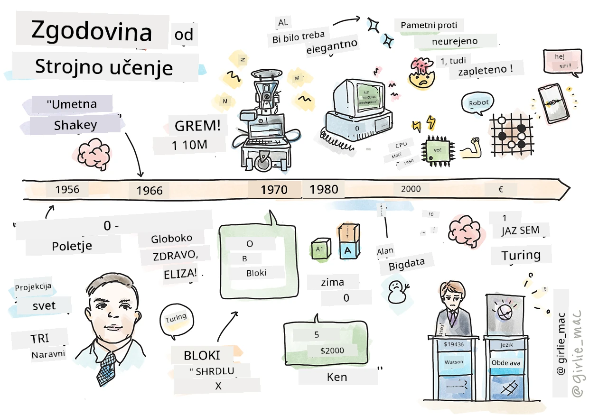
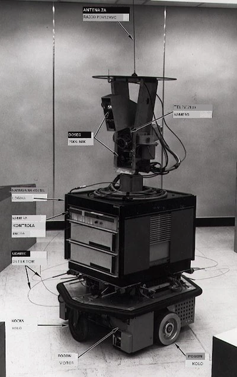
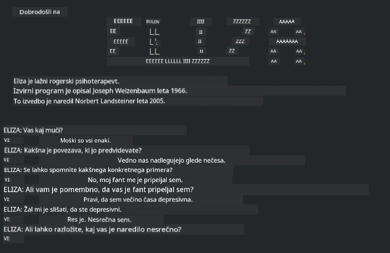

# Zgodovina strojnega učenja

> Sketchnote avtorja [Tomomi Imura](https://www.twitter.com/girlie_mac)

## [Pred-predavalni kviz](https://ff-quizzes.netlify.app/en/ml/)

---

> 🎥 Kliknite na zgornjo sliko za kratek video, ki obravnava to lekcijo.

V tej lekciji bomo pregledali glavne mejnike v zgodovini strojnega učenja in umetne inteligence.

Zgodovina umetne inteligence (UI) kot področja je prepletena z zgodovino strojnega učenja, saj so algoritmi in računalniški napredki, ki podpirajo strojno učenje, vplivali na razvoj UI. Uporno si je zapomniti, da so se ta področja kot samostojne vede začela oblikovati v 50. letih prejšnjega stoletja, vendar so pomembna [algoritemska, statistična, matematična, računalniška in tehnična odkritja](https://wikipedia.org/wiki/Timeline_of_machine_learning) nastala in prekrivala to obdobje že prej. Pravzaprav ljudje razmišljajo o teh vprašanjih že [stotine let](https://wikipedia.org/wiki/History_of_artificial_intelligence): ta članek obravnava zgodovinska intelektualna izhodišča ideje 'mišljajočega stroja.'

---
## Opazna odkritja

- 1763, 1812 [Bayesov izrek](https://wikipedia.org/wiki/Bayes%27_theorem) in njegovi predhodniki. Ta izrek in njegove aplikacije temeljijo na sklepanju, ki opisuje verjetnost dogodka glede na predhodno znanje.
- 1805 [Teorija najmanjših kvadratov](https://wikipedia.org/wiki/Least_squares) francoskega matematika Adriena-Marieja Legendreja. O tej teoriji bomo izvedeli v naši enoti o regresiji, pomaga pri prilagajanju podatkov.
- 1913 [Markovljevi procesi](https://wikipedia.org/wiki/Markov_chain), poimenovani po ruskem matematiku Andreju Markovu, se uporabljajo za opis zaporedja možnih dogodkov glede na prejšnje stanje.
- 1957 [Perceptron](https://wikipedia.org/wiki/Perceptron) je vrsta linearnega klasifikatorja, ki ga je izumil ameriški psiholog Frank Rosenblatt in je osnova za napredek v globokem učenju.

---

- 1967 [Najbližji sosed](https://wikipedia.org/wiki/Nearest_neighbor) je algoritem, prvotno zasnovan za načrtovanje poti. V kontekstu strojnega učenja se uporablja za odkrivanje vzorcev.
- 1970 [Algoritem backpropagation](https://wikipedia.org/wiki/Backpropagation) se uporablja za treniranje [federiranih nevronskih mrež](https://wikipedia.org/wiki/Feedforward_neural_network).
- 1982 [Rekurentne nevronske mreže](https://wikipedia.org/wiki/Recurrent_neural_network) so umetne nevronske mreže, izpeljane iz fidervand nevronskih mrež, ki ustvarjajo časovne grafe.

✅ Naredite malo raziskave. Kateri drugi datumi izstopajo kot ključni v zgodovini ML in UI?

---
## 1950: Stroji, ki razmišljajo

Alan Turing, izjemna osebnost, ki ga je [javnost leta 2019](https://wikipedia.org/wiki/Icons:_The_Greatest_Person_of_the_20th_Century) izbrala za največjega znanstvenika 20. stoletja, velja za tistega, ki je pomagal položiti temelje za koncept 'stroja, ki zna razmišljati'. Sooči se je z dvomljivci in svojo potrebo po empiričnih dokazih tega koncepta deloma z ustvarjanjem [Turingovega testa](https://www.bbc.com/news/technology-18475646), ki ga boste raziskali v naših lekcijah NLP.

---
## 1956: Poletni raziskovalni projekt Dartmouth

"Poletni raziskovalni projekt Dartmouth o umetni inteligenci je bil ključni dogodek za umetno inteligenco kot področje," in prav tukaj je bil skovan izraz 'umetna inteligenca' ([vir](https://250.dartmouth.edu/highlights/artificial-intelligence-ai-coined-dartmouth)).

> Vsak vidik učenja ali katera koli druga lastnost inteligence se načeloma lahko tako natančno opiše, da je mogoče narediti stroj, ki jo simulira.

---

Vodilni raziskovalec, profesor matematike John McCarthy, je upal "nadaljevati na podlagi predpostavke, da je vsak vidik učenja ali katera koli druga lastnost inteligence načeloma tako natančno opisan, da ga je mogoče simulirati z napravo." Udeleženci so med drugim bili tudi drugi strokovnjaki na tem področju, kot je Marvin Minsky.

Delavnica je bila zaslužna za začetek in spodbujanje več razprav, vključno z "vzrastjo simboličnih metod, sistemov osredotočenih na omejene domene (zgodnji ekspertski sistemi) ter deduktivnih sistemov v primerjavi z induktivnimi sistemi." ([vir](https://wikipedia.org/wiki/Dartmouth_workshop)).

---
## 1956 - 1974: "Zlata leta"

Od 50. let do sredine 70. let je optimizem cvetel v upanju, da bo umetna inteligenca rešila številne probleme. Leta 1967 je Marvin Minsky samozavestno dejal, da bo "v eni generaciji ... problem ustvarjanja 'umetne inteligence' bistveno rešen." (Minsky, Marvin (1967), Computation: Finite and Infinite Machines, Englewood Cliffs, N.J.: Prentice-Hall)

Raziskave naravnega jezikovnega procesiranja so cvetele, iskanje je bilo izpopolnjeno in močnejše, uveden je bil koncept 'mikrosvetov', kjer so bile preproste naloge opravljene z navodili v preprostem jeziku.

---

Raziskave so bile dobro financirane s strani vladnih agencij, doseženi so bili napredki v računanju in algoritmih ter zgrajeni prototipi inteligentnih strojev. Med temi stroji so:

* [Shakey robot](https://wikipedia.org/wiki/Shakey_the_robot), ki je lahko manevriral in sam odločal o izvajanju nalog 'inteligentno'.

    
    > Shakey leta 1972

---

* Eliza, zgodnji 'chatterbot', je lahko komuniciral z ljudmi in deloval kot primitiven 'terapevt'. O Elizi boste izvedeli več v lekcijah NLP.

    
    > Ena različica Elize, chatbot

---

* "Blocks world" je bil primer mikrosveta, kjer se lahko kocke zložijo in razvrstijo, ter preizkušali so eksperimente za učenje strojev odločanja. Napredki, ustvarjeni z knjižnicami, kot je [SHRDLU](https://wikipedia.org/wiki/SHRDLU), so pomagali pospešiti obdelavo jezika.

    

    > 🎥 Kliknite zgornjo sliko za video: Blocks world s SHRDLU

---
## 1974 - 1980: "Zima UI"

Do sredine 70. let je postalo jasno, da je kompleksnost ustvarjanja 'inteligentnih strojev' podcenjena in da je obljuba glede razpoložljive računalniške moči precenjena. Financiranje se je izsušilo in zaupanje v področje je upadlo. Nekateri dejavniki, ki so vplivali na to so bili:
---
- **Omejitve**. Računalniška moč je bila preveč omejena.
- **Kombinatorični eksponentni porast**. Število parametrov, ki jih je bilo treba naučiti, je eksponentno naraščalo, ko so od računalnikov zahtevali več, brez sorazmernega razvoja računske moči in zmogljivosti.
- **Pomanjkanje podatkov**. Pomanjkanje podatkov je oviralo testiranje, razvoj in izboljševanje algoritmov.
- **Ali postavljamo prava vprašanja?**. Tudi postavljena vprašanja so začeli podvomiti. Raziskovalci so naleteli na kritike glede svojih pristopov:
  - Turingovi testi so bili izpodbijani z različnimi idejami, med drugim s 'teorijo kitajske sobe', ki je trdila, da "programiranje digitalnega računalnika lahko daje vtis, da razume jezik, a ne more resnično razumeti." ([vir](https://plato.stanford.edu/entries/chinese-room/))
  - Izpostavljene so bile etične dileme uvajanja umetnih inteligenc, kot je "terapevt" ELIZA v družbo.

---

Hkrati so se začele oblikovati različne šole razmišljanja v UI. Nastala je dihotomija med ["scruffy" (nereden) in "neat" (urejen) UI](https://wikipedia.org/wiki/Neats_and_scruffies) praksami. _Scruffy_ laboratoriji so ure in ure spreminjali programe, dokler niso dosegli želenih rezultatov. _Neat_ laboratoriji so se "osredotočali na logiko in formalno reševanje problemov." ELIZA in SHRDLU sta bila znana _scruffy_ sistema. V 80. letih, ko je nastala potreba po reproducibilnosti ML sistemov, je _neat_ pristop postopoma prevladal, saj so njegovi rezultati bolj pojasnjivi.

---
## Ekspertski sistemi v 80. letih

Ko se je področje razvijalo, je bilo vedno bolj jasno, kako koristno je za podjetja, v 80. letih pa je prišlo tudi do razširitve 'ekspertskih sistemov'. "Ekspertski sistemi so bili med prvimi res uspešnimi oblikami programske opreme za umetno inteligenco (UI)." ([vir](https://wikipedia.org/wiki/Expert_system)).

Ta tip sistema je v resnici _hibridni_, delno sestavljen iz pravnega motorja, ki opredeljuje poslovne zahteve, in sklepalnega motorja, ki je temeljil na sistemu pravil za izpeljavo novih dejstev.

V tem obdobju je tudi začela naraščati pozornost do nevronskih mrež.

---
## 1987 - 1993: UI 'Premor'

Razširjenost specializirane strojne opreme za ekspertske sisteme je privedla do prevelike specializacije. Vzpon osebnih računalnikov je izzival tudi te velike, specializirane, centralizirane sisteme. Pričel se je proces demokratizacije računalništva, ki je pozneje odprl pot za sodoben razcvet velikih podatkov.

---
## 1993 - 2011

To obdobje je prineslo novo dobo za ML in UI, da se rešijo nekatere težave, ki so jih prej povzročala pomanjkanje podatkov in računalniške moči. Količina podatkov se je začela hitro povečevati in postajala širše dostopna, za dobro ali slabo, predvsem s pojavom pametnih telefonov okoli leta 2007. Računalniška moč je eksponentno naraščala, algoritmi pa so se razvijali z njo. Področje je začelo dozorevati, saj so se dnevi nenehnih eksperimentov iz preteklosti začeli oblikovati v pravo disciplino.

---
## Danes

Danes strojno učenje in umetna inteligenca segata skoraj v vsak del naših življenj. Ta doba zahteva previdno razumevanje tveganj in potencialnih učinkov teh algoritmov na človeška življenja. Kot je dejal Brad Smith iz Microsofta, "Informacijska tehnologija odpira vprašanja, ki segajo do bistva temeljnih človekovih pravic, kot sta zasebnost in svoboda izražanja. Ta vprašanja povečujejo odgovornost tehnoloških podjetij, ki ustvarjajo te izdelke. Po našem mnenju to zahteva tudi premišljeno državno regulacijo in razvoj norm glede sprejemljivih uporab." ([vir](https://www.technologyreview.com/2019/12/18/102365/the-future-of-ais-impact-on-society/)).

---

Še ni znano, kaj prinaša prihodnost, vendar je pomembno razumeti te računalniške sisteme ter programsko opremo in algoritme, ki jih poganjajo. Upamo, da vam bo ta učni program pomagal pridobiti boljše razumevanje, da boste lahko sami sprejeli odločitev.

> 🎥 Kliknite na zgornjo sliko za video: Yann LeCun razpravlja o zgodovini globokega učenja v tej predavanju

---
## 🚀Izziv

Poglobite se v enega od teh zgodovinskih trenutkov in spoznajte več o ljudeh, ki stojijo za njimi. So fascinantni liki, nobeno znanstveno odkritje ni nastalo v kulturnem vakumu. Kaj odkrijete?

## [Po-predavalni kviz](https://ff-quizzes.netlify.app/en/ml/)

---
## Pregled & Samostojno učenje

Tukaj je nekaj stvari za gledanje in poslušanje:

[Ta podcast, kjer Amy Boyd razpravlja o evoluciji UI](http://runasradio.com/Shows/Show/739)

---

## Domača naloga

[Ustvarite časovnico](assignment.md)

---

<!-- CO-OP TRANSLATOR DISCLAIMER START -->
**Omejitev odgovornosti**:
Ta dokument je bil preveden z uporabo AI prevajalske storitve [Co-op Translator](https://github.com/Azure/co-op-translator). Čeprav si prizadevamo za natančnost, vas prosimo, da upoštevate, da avtomatizirani prevodi lahko vsebujejo napake ali netočnosti. Izvirni dokument v njegovem izvirnem jeziku je treba obravnavati kot avtoritativni vir. Za kritične informacije je priporočljiv strokovni človeški prevod. Ne odgovarjamo za morebitna nesporazume ali napačne interpretacije, ki izhajajo iz uporabe tega prevoda.
<!-- CO-OP TRANSLATOR DISCLAIMER END -->