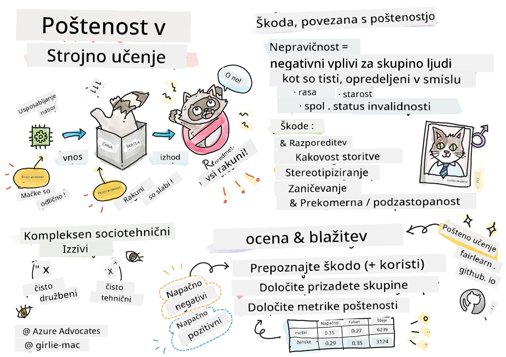
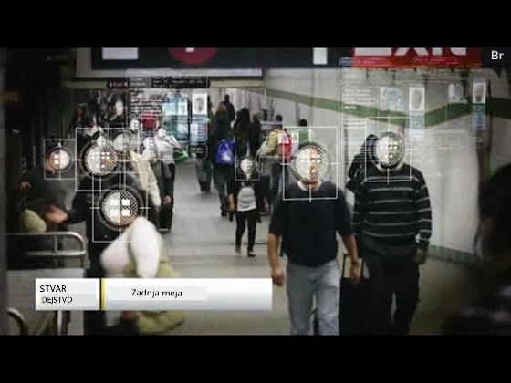

# Izdelava rešitev strojnega učenja z odgovorno umetno inteligenco
 

> Skicirna beležka avtorja [Tomomi Imura](https://www.twitter.com/girlie_mac)

## [Predpredavalni kviz](https://ff-quizzes.netlify.app/en/ml/)
 
## Uvod

V tem učnem programu boste začeli odkrivati, kako strojno učenje vpliva na naše vsakdanje življenje. Že zdaj so sistemi in modeli vključeni v dnevna odločanja, kot so zdravstvene diagnoze, odobritve posojil ali odkrivanje prevar. Zato je pomembno, da ti modeli dobro delujejo in zagotavljajo rezultate, ki so zaupanja vredni. Tako kot katera koli programska oprema bodo tudi sistemi umetne inteligence kdaj zgrešili pričakovanja ali imeli nezaželen izid. Zato je ključno razumeti in pojasniti vedenje AI modela. 

Predstavljajte si, kaj se lahko zgodi, če podatki, ki jih uporabljate za izdelavo teh modelov, manjkajo nekatere demografske skupine, kot so rasa, spol, politična usmeritev, vera, ali nesorazmerno predstavljajo te demografske skupine. Kaj pa, če se izhod modela interpretira v korist določene demografske skupine? Kakšne so posledice za aplikacijo? Poleg tega, kaj se zgodi, ko ima model škodljiv izid in škodi ljudem? Kdo je odgovoren za vedenje AI sistema? To so nekatere izmed vprašanj, ki jih bomo raziskovali v tem učnem programu. 

V tej lekciji boste: 

- Povečali zavedanje o pomenu pravičnosti v strojnem učenju in s tem povezanih škodah.
- Spoznali prakso raziskovanja izstopajočih primerov in nenavadnih scenarijev za zagotavljanje zanesljivosti in varnosti
- Pridobili razumevanje potrebe po opolnomočenju vseh z oblikovanjem vključujočih sistemov
- Raziskali, kako nujno je varovanje zasebnosti in varnosti podatkov ter ljudi
- Videli, zakaj je pomemben pristop skozi prozorno škatlo za pojasnjevanje vedenja AI modelov
- Biti pozorni na to, kako je odgovornost ključna za gradnjo zaupanja v AI sisteme

## Predpogoj

Za predpogoj, prosimo opravi "Principi odgovorne umetne inteligence" učno pot in si oglejte spodnji video na to temo:

Izvedite več o odgovorni umetni inteligenci z učenjem na tej [učni poti](https://docs.microsoft.com/learn/modules/responsible-ai-principles/?WT.mc_id=academic-77952-leestott)

> 🎥 Kliknite zgornjo sliko za video: Microsoftov pristop k odgovorni umetni inteligenci

## Pravičnost

Sistemi umetne inteligence naj obravnavajo vse pošteno in naj se izogibajo različnemu vplivu na podobne skupine ljudi. Na primer, ko sistemi umetne inteligence nudijo navodila glede zdravljenja, vlog za posojila ali zaposlovanja, bi morali dati iste priporočila vsem z podobnimi simptomi, finančnimi pogoji ali strokovnimi kvalifikacijami. Vsak izmed nas kot človek nosi dedne predsodke, ki vplivajo na naše odločitve in dejanja. Ti predsodki se lahko pokažejo v podatkih, ki jih uporabljamo za usposabljanje AI sistemov. Takšna manipulacija se lahko zgodi tudi nehote. Pogosto je težko zavestno vedeti, kdaj vnašate pristranskost v podatke. 

**"Nepravičnost"** vključuje negativne učinke ali "škode" za določeno skupino ljudi, kot so opredeljene glede na raso, spol, starost ali invalidnost. Glavne škode, povezane s pravičnostjo, lahko razvrstimo kot: 

- **Dodeljevanje**, če je na primer spol ali narodnost v prid eni skupini pred drugo.
- **Kakovost storitve**. Če usposobite model za en poseben scenarij, vendar je realnost veliko bolj kompleksna, vodi do slabo delujoče storitve. Na primer, dozirnik mila za roke, ki ni mogel zaznati ljudi s temnejšo kožo. [Reference](https://gizmodo.com/why-cant-this-soap-dispenser-identify-dark-skin-1797931773)
- **Ocenjevanje na nepošten način**. Nepravično kritizirati in označiti nekaj ali nekoga. Na primer, tehnologija za označevanje slik je žal neuspešno označila slike temnopoltih ljudi kot gorile.
- **Prekomerna ali prenizka zastopanost**. Ideja je, da določena skupina ni prisotna na določenem poklicnem področju, in kakršnakoli storitev ali funkcija, ki to nadaljuje, povzroča škodo.
- **Stereotipiziranje**. Povezovanje določene skupine s predhodno določenimi lastnostmi. Na primer, sistem za prevajanje med angleščino in turščino lahko zaradi stereotipnih povezav z besedami glede spola povzroča netočnosti.

> prevod v turščino

> prevod nazaj v angleščino

Pri načrtovanju in testiranju AI sistemov moramo zagotoviti, da je umetna inteligenca pravična in ni programirana za pristranske ali diskriminatorne odločitve, katerih sprejemanje je ljudem prav tako prepovedano. Zagotavljanje pravičnosti v umetni inteligenci in strojnem učenju ostaja kompleksen sociotehnični izziv. 

### Zanesljivost in varnost

Za gradnjo zaupanja morajo biti AI sistemi zanesljivi, varni in dosledni v normalnih in nepričakovanih razmerah. Pomembno je vedeti, kako se bodo AI sistemi obnašali v različnih situacijah, posebej ko so izstopajoči primeri. Pri izdelavi AI rešitev je treba nameniti veliko pozornosti obravnavi širokega spektra okoliščin, s katerimi se bodo AI rešitve srečale. Na primer, avtonomni avtomobil mora varnost ljudi postaviti na prvo mesto. Posledično mora AI, ki poganja avto, upoštevati vse možne scenarije, s katerimi se lahko avto sreča, kot so noč, nevihte ali snežni viharji, otroci, ki prečkajo cesto, hišni ljubljenčki, cestna gradbišča itd. Kako dobro lahko AI sistem zanesljivo in varno obvladuje pester nabor pogojev, odraža stopnjo predvidevanja podatkovnega znanstvenika ali razvijalca AI med načrtovanjem ali testiranjem sistema.  

> [🎥 Kliknite tukaj za video: ](https://www.microsoft.com/videoplayer/embed/RE4vvIl)

### Vključujočnost

AI sistemi naj bodo zasnovani tako, da vključujejo in opolnomočajo vse. Pri načrtovanju in uvajanju AI sistemov podatkovni znanstveniki in razvijalci AI prepoznajo in odpravijo morebitne ovire v sistemu, ki bi lahko nehote izključile ljudi. Na primer, po svetu je 1 milijarda oseb z invalidnostmi. Z razvojem AI lahko dostopajo do širokega spektra informacij in priložnosti lažje v svojem vsakdanjem življenju. Z odpravljanjem ovir se ustvarjajo priložnosti za inovacije in razvoj AI izdelkov z boljšimi izkušnjami, ki koristijo vsem. 

> [🎥 Kliknite tukaj za video: vključujočnost v AI](https://www.microsoft.com/videoplayer/embed/RE4vl9v)

### Varnost in zasebnost 

AI sistemi morajo biti varni in spoštovati zasebnost ljudi. Ljudje manj zaupajo sistemom, ki ogrožajo njihovo zasebnost, podatke ali življenje. Pri usposabljanju modelov strojnega učenja se zanašamo na podatke za dosego najboljših rezultatov. Pri tem je treba upoštevati izvor podatkov in njihovo integriteto. Na primer, ali so bili podatki posredovani s strani uporabnikov ali so bili javno dostopni? Nadalje, pri delu s podatki je ključno razviti AI sisteme, ki lahko varujejo zaupne informacije in odbijajo napade. Ker AI postaja vse bolj razširjena, je varovanje zasebnosti in varnost pomembnih osebnih in poslovnih informacij vse bolj kritično in kompleksno. Težave z zasebnostjo in varnostjo podatkov zahtevajo še posebej veliko pozornosti pri AI, ker je dostop do podatkov ključnega pomena za točne in informirane napovedi ter odločitve o ljudeh. 

> [🎥 Kliknite tukaj za video: varnost v AI](https://www.microsoft.com/videoplayer/embed/RE4voJF)

- Kot industrija smo dosegli pomemben napredek na področju zasebnosti in varnosti, ki ga je močno spodbudila zakonodaja, kot je GDPR (Splošna uredba o varstvu podatkov). 
- Vendar pa moramo pri AI sistemih priznati napetost med potrebo po več osebnih podatkih za bolj osebne in učinkovite sisteme ter zasebnostjo. 
- Tako kot pri vzpostavitvi povezanih računalnikov z internetom, tudi pri AI opažamo velik porast varnostnih vprašanj. 
- Hkrati smo videli, da se AI uporablja za izboljšanje varnosti. Na primer, večina sodobnih protivirusnih skenerjev danes temelji na heuristikah AI. 
- Potrebno je zagotoviti, da naši procesi podatkovnih znanosti harmonično vključujejo najnovejše prakse zasebnosti in varnosti. 

### Preglednost
AI sistemi morajo biti razumljivi. Ključni del preglednosti je pojasnjevanje vedenja AI sistemov in njihovih komponent. Izboljšanje razumevanja AI sistemov zahteva, da zainteresirane strani razumejo, kako in zakaj delujejo, da lahko prepoznajo morebitne težave z uspešnostjo, varnostjo in zasebnostjo, predsodke, izključujoče prakse ali nenamerne izide. Prav tako verjamemo, da bi morali uporabniki AI sistemov biti pošteni in odprti glede tega, kdaj, zakaj in kako jih uporabljajo, kot tudi o omejitvah sistemov, ki jih uporabljajo. Na primer, če banka uporablja AI sistem za podporo svojim odločitvam o posojilih potrošnikom, je pomembno pregledati izide in razumeti, kateri podatki vplivajo na priporočila sistema. Vlade začinjajo regulirati AI v različnih industrijah, zato morajo podatkovni znanstveniki in organizacije pojasniti, ali AI sistem izpolnjuje regulativne zahteve, zlasti, ko pride do nezaželenega izida. 

> [🎥 Kliknite tukaj za video: preglednost v AI](https://www.microsoft.com/videoplayer/embed/RE4voJF)

- Ker so AI sistemi zelo kompleksni, je težko razumeti, kako delujejo in razlagati rezultate. 
- Ta pomanjkljivo razumevanje vpliva na način upravljanja, operativnosti in dokumentacije teh sistemov. 
- Še pomembneje pa to vpliva na odločitve, sprejete na podlagi rezultatov, ki jih ti sistemi proizvajajo. 

### Odgovornost 
 
Osebe, ki načrtujejo in uvajajo AI sisteme, morajo biti odgovorne za delovanje svojih sistemov. Potreba po odgovornosti je še posebej pomembna pri občutljivih tehnologijah, kot je prepoznavanje obrazov. Nedavno je naraslo povpraševanje po tehnologiji prepoznavanja obrazov, zlasti pri organih pregona, ki vidijo potencial tehnologije za iskanje pogrešanih otrok. Vendar pa bi te tehnologije lahko vlade potencialno uporabile za ogrožanje temeljnih svoboščin državljanov, na primer omogočanje stalnega nadzora določenih posameznikov. Zato morajo podatkovni znanstveniki in organizacije prevzeti odgovornost za vpliv svojega AI sistema na posameznike ali družbo.

> 🎥 Kliknite zgornjo sliko za video: Opozorila pred množičnim nadzorom s prepoznavanjem obrazov 

Na koncu je eno največjih vprašanj za našo generacijo, kot prvo generacijo, ki prinaša AI v družbo, kako zagotoviti, da bodo računalniki ostali odgovorni ljudem in kako zagotoviti, da bodo ljudje, ki računalnike načrtujejo, odgovorni do vseh drugih.

## Ocena vpliva 

Pred usposabljanjem modela strojnega učenja je pomembno opraviti oceno vpliva, da se razume namen AI sistema; kakšna je predvidena uporaba; kje bo nameščen; in kdo bo interagiralo s sistemom. To pomaga ocenjevalcem ali testnim osebam pri ocenjevanju sistema vedeti, katere dejavnike morajo upoštevati pri prepoznavanju morebitnih tveganj in pričakovanih posledic.

Spodaj so navedena področja osredotočenosti pri izvajanju ocene vpliva:

* **Neželeni vpliv na posameznike**. Biti pozoren na kakršne koli omejitve, zahteve, neodobrene uporabe ali znane omejitve, ki ovirajo delovanje sistema, je ključno za zagotovitev, da sistem ni uporabljen na način, ki bi lahko škodoval posameznikom.
* **Zahteve glede podatkov**. Razumevanje, kako in kje bo sistem uporabljal podatke, omogoča ocenjevalcem raziskovanje morebitnih zahtev glede podatkov, ki jih je treba upoštevati (npr. GDPR ali HIPAA predpisi o podatkih). Poleg tega je treba oceniti, ali je vir ali količina podatkov zadostna za usposabljanje.
* **Povzetek vpliva**. Zberite seznam morebitnih škod, ki bi lahko nastale zaradi uporabe sistema. V celotnem življenjskem ciklu ML preglejte, ali so ugotovljene težave ublažene ali rešene.
* **Uporabni cilji** za vsako od šestih osnovnih načel. Ocenite, ali so cilji vsakega načela doseženi in ali obstajajo vrzeli.

## Odpravljanje napak z odgovorno AI  

Podobno kot odpravljanje napak v programski aplikaciji je odpravljanje napak v AI sistemu potreben proces prepoznavanja in reševanja težav v sistemu. Obstaja veliko dejavnikov, ki lahko vplivajo na to, da model ne deluje tako, kot se pričakuje ali odgovorno. Večina tradicionalnih meritev uspešnosti modela so kvantitativni seštevki uspešnosti modela, ki niso dovolj za analizo, kako model krši načela odgovorne AI. Poleg tega je model strojnega učenja črna skrinjica, zaradi česar je težko razumeti, kaj povzroča njegov izid ali dati pojasnilo, ko naredi napako. Kasneje v tem tečaju bomo spoznali, kako uporabiti nadzorno ploščo Responsible AI za pomoč pri odpravljanju napak AI sistemov. Nadzorna plošča zagotavlja celovito orodje za podatkovne znanstvenike in razvijalce AI za izvedbo:

* **Analiza napak**. Za prepoznavanje porazdelitve napak modela, ki lahko vplivajo na pravičnost ali zanesljivost sistema.
* **Pregled modela**. Za odkrivanje, kje so razlike v uspešnosti modela med različnimi podatkovnimi skupinami.
* **Analiza podatkov**. Za razumevanje porazdelitve podatkov in prepoznavanje morebitnih pristranskosti, ki bi lahko povzročile težave z pravičnostjo, vključevanjem in zanesljivostjo.
* **Razložljivost modela**. Za razumevanje, kaj vpliva ali določa napovedi modela. To pomaga pri pojasnjevanju vedenja modela, kar je pomembno za preglednost in odgovornost.

## 🚀 Izziv 
 
Da bi preprečili uvajanje škod v prvi vrsti, moramo: 

- imeti raznolikost ozadij in pogledov med ljudmi, ki delajo na sistemih 
- vlagati v podatkovne nize, ki odražajo raznolikost naše družbe 
- razvijati boljše metode skozi celoten življenjski cikel strojnega učenja za odkrivanje in odpravljanje odgovorne AI, ko se pojavi 

Premislite o resničnih situacijah, kjer je nezanesljivost modela očitna pri gradnji in uporabi modela. Kaj še bi morali upoštevati? 

## [Popredavalni kviz](https://ff-quizzes.netlify.app/en/ml/)

## Pregled & Samostojno učenje 
 

V tej lekciji ste se naučili nekaj osnovnih pojmov pravičnosti in nepravičnosti v strojni inteligenci.  
 
Oglejte si ta delavnico za poglobljeno razumevanje tem: 

- V prizadevanju za odgovorno AI: Prinašanje načel v prakso avtorjev Besmira Nushi, Mehrnoosh Sameki in Amit Sharma

> 🎥 Kliknite zgornjo sliko za video: RAI Toolbox: Open-source okvir za izgradnjo odgovorne AI avtorjev Besmira Nushi, Mehrnoosh Sameki in Amit Sharma

Prav tako preberite: 

- Microsoftov center virov RAI: [Responsible AI Resources – Microsoft AI](https://www.microsoft.com/ai/responsible-ai-resources?activetab=pivot1%3aprimaryr4) 

- Microsoftova raziskovalna skupina FATE: [FATE: Fairness, Accountability, Transparency, and Ethics in AI - Microsoft Research](https://www.microsoft.com/research/theme/fate/) 

RAI Toolbox: 

- [Responsible AI Toolbox GitHub repozitorij](https://github.com/microsoft/responsible-ai-toolbox)

Preberite o orodjih Azure Machine Learning za zagotavljanje pravičnosti:

- [Azure Machine Learning](https://docs.microsoft.com/azure/machine-learning/concept-fairness-ml?WT.mc_id=academic-77952-leestott) 

## Naloga

[Raziskujte RAI Toolbox](assignment.md)

---

<!-- CO-OP TRANSLATOR DISCLAIMER START -->
**Omejitev odgovornosti**:
Ta dokument je bil preveden z uporabo AI prevajalske storitve [Co-op Translator](https://github.com/Azure/co-op-translator). Čeprav si prizadevamo za natančnost, vas prosimo, da upoštevate, da avtomatizirani prevodi lahko vsebujejo napake ali netočnosti. Izvirni dokument v njegovem izvirnem jeziku je treba obravnavati kot avtoritativni vir. Za kritične informacije je priporočljiv strokovni človeški prevod. Ne odgovarjamo za morebitna nesporazume ali napačne interpretacije, ki izhajajo iz uporabe tega prevoda.
<!-- CO-OP TRANSLATOR DISCLAIMER END -->