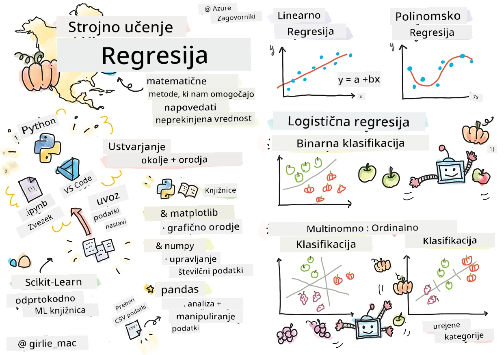
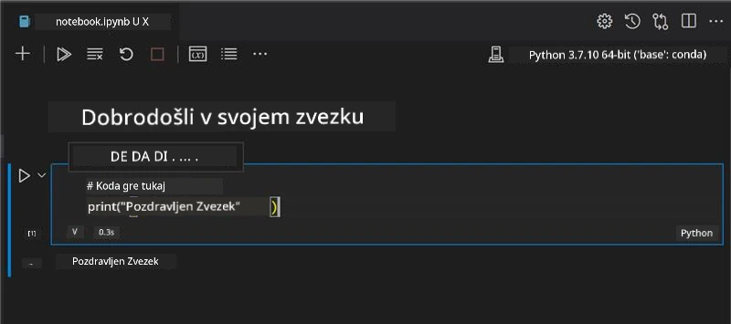
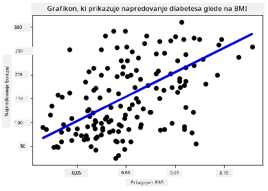

# Začnite s Python in Scikit-learn za regresijske modele



> Sketchnote avtorja [Tomomi Imura](https://www.twitter.com/girlie_mac)

## [Predpredavalni kviz](https://ff-quizzes.netlify.app/en/ml/)

> ### [Ta lekcija je na voljo tudi v R!](../../../../2-Regression/1-Tools/solution/R/lesson_1.html)

## Uvod

V teh štirih lekcijah boste odkrili, kako zgraditi regresijske modele. Kmalu bomo govorili, čemu so ti modeli namenjeni. A preden karkoli naredite, se prepričajte, da imate postavljena prava orodja za začetek procesa!

V tej lekciji se boste naučili:

- Kako konfigurirati računalnik za lokalne naloge strojnega učenja.
- Kako delati z Jupyter zvezki (notebooks).
- Kako uporabiti Scikit-learn, vključno z namestitvijo.
- Raziščete linearno regresijo z vajo na praktičnem primeru.

## Namestitve in konfiguracije

[](https://youtu.be/-DfeD2k2Kj0 "ML za začetnike - Nastavite svoja orodja za gradnjo modelov strojnega učenja")

> 🎥 Kliknite zgornjo sliko za kratek video o nastavitvi računalnika za ML.

1. **Namestite Python**. Poskrbite, da imate [Python](https://www.python.org/downloads/) nameščen na računalniku. Python boste uporabljali za številne naloge na področju podatkovne znanosti in strojnega učenja. Večina računalniških sistemov že vsebuje namestitev Pythona. Na voljo so tudi koristni [Python Coding Paketi](https://code.visualstudio.com/learn/educators/installers?WT.mc_id=academic-77952-leestott), ki nekaterim uporabnikom olajšajo nastavitev.

   Nekatere uporabe Pythona zahtevajo eno različico programske opreme, druge pa drugo. Iz tega razloga je koristno delati znotraj [virtualnega okolja](https://docs.python.org/3/library/venv.html).

2. **Namestite Visual Studio Code**. Prepričajte se, da imate Visual Studio Code nameščen na računalniku. Sledite tem navodilom za [namestitev Visual Studio Code](https://code.visualstudio.com/) za osnovno namestitev. Python boste v tem tečaju uporabljali v Visual Studio Code, zato je koristno, da osvežite znanje o tem, kako [konfigurirati Visual Studio Code](https://docs.microsoft.com/learn/modules/python-install-vscode?WT.mc_id=academic-77952-leestott) za razvoj v Pythonu.

   > Postanite udobni z uporabo Pythona tako, da preletite to zbirko [učnih modulov](https://docs.microsoft.com/users/jenlooper-2911/collections/mp1pagggd5qrq7?WT.mc_id=academic-77952-leestott)
   >
   > [](https://youtu.be/yyQM70vi7V8 "Nastavitev Pythona z Visual Studio Code")
   >
   > 🎥 Kliknite zgornjo sliko za video: uporaba Pythona znotraj VS Code.

3. **Namestite Scikit-learn**, tako da sledite [tem navodilom](https://scikit-learn.org/stable/install.html). Ker morate uporabljati Python 3, je priporočljivo uporabiti virtualno okolje. Če nameščate to knjižnico na M1 Mac, so na zgoraj povezani strani posebna navodila.

1. **Namestite Jupyter Notebook**. Potrebovali boste [namestiti paket Jupyter](https://pypi.org/project/jupyter/).

## Vaše razvojno okolje za ML

Za razvijanje vaše Python kode in ustvarjanje modelov strojnega učenja boste uporabljali **zvezke**. Ta tip datotek je pogosto orodje podatkovnih znanstvenikov in jih lahko prepoznate po priponi `.ipynb`.

Zvezki so interaktivno okolje, ki razvijalcu omogoča tako pisanje kode kot dodajanje opomb in pisanje dokumentacije okoli kode, kar je zelo koristno za eksperimentalne ali raziskovalne projekte.

[](https://youtu.be/7E-jC8FLA2E "ML za začetnike - Nastavitev Jupyter zvezkov za začetek gradnje regresijskih modelov")

> 🎥 Kliknite zgornjo sliko za kratek video skozi to vajo.

### Vaja - delo z zvezkom

V tej mapi boste našli datoteko _notebook.ipynb_.

1. Odprite _notebook.ipynb_ v Visual Studio Code.

   Začne se bosta zagnala strežnik Jupyter s Pythonom 3+. V zvezku boste našli dele, ki jih je možno `pognati`, kose kode. Kodo lahko pognate tako, da izberete ikono, ki izgleda kot gumb za predvajanje.

1. Izberite ikono `md` in dodajte nekaj markdowna ter naslednje besedilo **# Dobrodošli v vašem zvezku**.

   Nato dodajte nekaj Python kode.

1. Vtipkajte **print('hello notebook')** v razdelek s kodo.
1. Izberite puščico za zagon kode.

   Videli boste natisnjen izpis:

    ```output
    hello notebook
    ```



Kodo lahko prepletate s komentarji, da dokumentirate zvezek.

✅ Razmislite za trenutek, kako drugačno je razvojno okolje spletnega razvijalca v primerjavi z okoljem podatkovnega znanstvenika.

## Zagon Scikit-learn

Zdaj, ko je Python nastavljen v vašem lokalnem okolju in ste udobni z Jupyter zvezki, se seznanimo enako udobno s Scikit-learn (izgovarja se `sci` kot v `science`). Scikit-learn ponuja [obsežen API](https://scikit-learn.org/stable/modules/classes.html#api-ref), ki vam pomaga pri opravljanju nalog strojnega učenja.

Po njihovem [spletnem mestu](https://scikit-learn.org/stable/getting_started.html) "je Scikit-learn odprtokodna knjižnica strojnega učenja, ki podpira nadzorovano in nenadzorovano učenje. Prav tako nudi različna orodja za prilagajanje modelov, predobdelavo podatkov, izbor in vrednotenje modela ter številne druge pripomočke."

V tem tečaju boste uporabili Scikit-learn in druga orodja za gradnjo modelov strojnega učenja za izvedbo tistih nalog, ki jih imenujemo 'tradicionalno strojno učenje'. Zavestno smo se izognili nevronskim mrežam in globokemu učenju, saj so bolje pokriti v našem prihajajočem učnem načrtu 'AI za začetnike'.

Scikit-learn olajša gradnjo modelov in njihovo vrednotenje glede na uporabo. Osredotoča se predvsem na numerične podatke in vsebuje več vgrajenih podatkovnih zbirk za učenje. Vključuje tudi vnaprej pripravljene modele za preizkušanje. Raziskajmo proces nalaganja že pripravljenih podatkov in uporabo vgrajenega ocenilca - prvega ML modela s Scikit-learn na osnovi osnovnih podatkov.

## Vaja - vaš prvi Scikit-learn zvezek

> Ta vodič je navdihnila [linearna regresija primer](https://scikit-learn.org/stable/auto_examples/linear_model/plot_ols.html#sphx-glr-auto-examples-linear-model-plot-ols-py) na Scikit-learn spletni strani.


[](https://youtu.be/2xkXL5EUpS0 "ML za začetnike - vaš prvi linearni regresijski projekt v Pythonu")

> 🎥 Kliknite zgornjo sliko za kratek video skozi to vajo.

V datoteki _notebook.ipynb_ povezanih s to lekcijo počistite vse celice z klikom ikone 'koš'.

V tem razdelku boste delali z majhnim podatkovnim nizom o diabetiku, ki je vključen v Scikit-learn za učne namene. Predstavljajte si, da želite preizkusiti zdravljenje za bolnike z diabetesom. Modeli strojnega učenja bi vam lahko pomagali določiti, kateri bolniki bi bolje reagirali na zdravljenje, glede na kombinacije spremenljivk. Tudi zelo osnovni regresijski model, ko je vizualiziran, vam lahko pokaže informacije o spremenljivkah, ki bi pomagale organizirati vaše teoretične klinične preizkuse.

✅ Obstaja veliko vrst regresijskih metod, izbira prave pa je odvisna od vprašanja, na katero iščete odgovor. Če želite napovedati verjetno višino osebe določene starosti, uporabite linearno regresijo, saj iščete **numerično vrednost**. Če vas zanima, ali naj se ena vrsta kuhinje šteje kot veganska ali ne, iščete **kategorijsko dodelitev**, zato bi uporabili logistično regresijo. O logistični regresiji se boste naučili več kasneje. Premislite o nekaterih vprašanjih, ki si jih lahko zastavite o podatkih, in katere od teh metod bi bile ustreznejše.

Začnimo s to nalogo.

### Uvoz knjižnic

Za to nalogo bomo uvozili nekaj knjižnic:

- **matplotlib**. Uporabna [orodje za risanje grafov](https://matplotlib.org/), ki ga bomo uporabili za izdelavo črtnega grafa.
- **numpy**. [numpy](https://numpy.org/doc/stable/user/whatisnumpy.html) je koristna knjižnica za upravljanje numeričnih podatkov v Pythonu.
- **sklearn**. To je knjižnica [Scikit-learn](https://scikit-learn.org/stable/user_guide.html).

Uvozite nekaj knjižnic, ki vam bodo pomagale pri nalogah.

1. Dodajte uvoze tako, da vnesete naslednjo kodo:

   ```python
   import matplotlib.pyplot as plt
   import numpy as np
   from sklearn import datasets, linear_model, model_selection
   ```

   Zgoraj uvažate `matplotlib`, `numpy` in uvažate `datasets`, `linear_model` ter `model_selection` iz `sklearn`. `model_selection` se uporablja za razdelitev podatkov na učne in testne sklope.

### Diabetični podatkovni niz

Vgrajeni [diabetični podatkovni niz](https://scikit-learn.org/stable/datasets/toy_dataset.html#diabetes-dataset) vključuje 442 vzorcev podatkov o diabetesu, z 10 značilnimi spremenljivkami, nekaj naslova:

- starost: starost v letih
- bmi: indeks telesne mase
- bp: povprečni krvni tlak
- s1 tc: T celice (vrsta belih krvnih celic)

✅ Ta podatkovni niz vključuje koncept 'spola' kot značilno spremenljivko, pomembno za raziskave o diabetesu. Veliko medicinskih podatkovnih nizov vključuje tovrstno binarno klasifikacijo. Premislite, kako bi takšne kategorizacije lahko izključile določene dele prebivalstva iz zdravljenj.

Zdaj naložite podatka X in y.

> 🎓 Zapomnite si, da gre za nadzorovano učenje in potrebujemo imenovani cilj 'y'.

V novi celici s kodo naložite diabetični podatkovni niz s klicem `load_diabetes()`. Vhod `return_X_y=True` signalizira, da bo `X` podatkovna matrika, `y` pa regresijski cilj.

1. Dodajte nekaj ukazov za izpis oblike podatkovne matrike in njenega prvega elementa:

    ```python
    X, y = datasets.load_diabetes(return_X_y=True)
    print(X.shape)
    print(X[0])
    ```

    Kar prejemate kot odgovor, je nabor dveh vrednosti (tuple). To, kar počnete, je, da dodelite prvi dve vrednosti iz nabora `X` in `y` vrstnem redu. Več o [tuple](https://wikipedia.org/wiki/Tuple) lahko preberete.

    Vidite lahko, da podatki vsebujejo 442 elemente, oblikovane v tabele z 10 elementi:

    ```text
    (442, 10)
    [ 0.03807591  0.05068012  0.06169621  0.02187235 -0.0442235  -0.03482076
    -0.04340085 -0.00259226  0.01990842 -0.01764613]
    ```

    ✅ Razmislite o povezavi med podatki in regresijskim ciljem. Linearna regresija napoveduje razmerja med značilko X in ciljno spremenljivko y. Ali lahko poiščete [cilj](https://scikit-learn.org/stable/datasets/toy_dataset.html#diabetes-dataset) za diabetični podatkovni niz v dokumentaciji? Kaj ta podatkovni niz prikazuje glede na cilj?

2. Nato izberite del tega podatkovnega niza za prikaz tako, da izberete 3. stolpec podatkovnega niza. To lahko naredite z uporabo operatorja `:`, ki izbere vse vrstice, in nato izberete 3. stolpec z indeksom (2). Podatke lahko tudi preoblikujete v 2D tabelo - kot zahtevano za prikaz - z uporabo `reshape(n_rows, n_columns)`. Če je kateri parameter -1, se ta dimenzija samodejno izračuna.

   ```python
   X = X[:, 2]
   X = X.reshape((-1,1))
   ```

   ✅ Kadarkoli izpišite podatke, da preverite obliko.

3. Ko imate podatke pripravljene za prikaz, preverite, če vam lahko stroj pomaga določiti logično razdelitev števil v tem podatkovnem nizu. Za to morate razdeliti podatke (X) in cilj (y) na učne in testne sklade. Scikit-learn omogoča enostavno razdelitev testnih podatkov na določenem mestu.

   ```python
   X_train, X_test, y_train, y_test = model_selection.train_test_split(X, y, test_size=0.33)
   ```

4. Zdaj ste pripravljeni na učenje modela! Naložite linearni regresijski model in ga trenirajte z učnimi sklopi X in y z uporabo `model.fit()`:

    ```python
    model = linear_model.LinearRegression()
    model.fit(X_train, y_train)
    ```

    ✅ Funkcijo `model.fit()` boste pogosto videli v knjižnicah za ML, kot je TensorFlow.

5. Nato ustvarite napoved z uporabo testnih podatkov, z uporabo funkcije `predict()`. To bo uporabljeno za risanje črte med podatkovnimi skupinami.

    ```python
    y_pred = model.predict(X_test)
    ```

6. Zdaj je čas, da prikažete podatke na grafikonu. Matplotlib je zelo uporabno orodje za to nalogo. Naredite razpršeni graf (scatterplot) vseh testnih podatkov X in y ter uporabite napoved, da narišete črto na najbolj primernem mestu, med skupinami podatkov modela.

    ```python
    plt.scatter(X_test, y_test,  color='black')
    plt.plot(X_test, y_pred, color='blue', linewidth=3)
    plt.xlabel('Scaled BMIs')
    plt.ylabel('Disease Progression')
    plt.title('A Graph Plot Showing Diabetes Progression Against BMI')
    plt.show()
    ```

   


   ✅ Razmislite malo o tem, kaj se tukaj dogaja. Ravna črta poteka skozi veliko majhnih točk podatkov, a kaj točno počne? Vidite, kako bi morali uporabiti to črto, da napoveste, kje naj bi se nova, nevidena podatkovna točka ujemala glede na y os grafa? Poskusite z besedami opisati praktično uporabo tega modela.

Čestitke, zgradili ste svoj prvi linearni regresijski model, z njim ustvarili napoved in jo prikazali na grafu!

---
## 🚀Izziv

Narišite drugo spremenljivko iz tega nabora podatkov. Namig: uredite to vrstico: `X = X[:,2]`. Glede na cilj tega nabora podatkov, kaj lahko odkrijete o napredovanju diabetesa kot bolezni?
## [Kvizi po predavanju](https://ff-quizzes.netlify.app/en/ml/)

## Pregled in samostojno učenje

V tej vadnici ste delali s preprosto linearno regresijo, ne z enospremenljivostno ali večspremenljivostno linearno regresijo. Preberite nekaj o razlikah med temi metodami ali si oglejte [ta video](https://www.coursera.org/lecture/quantifying-relationships-regression-models/linear-vs-nonlinear-categorical-variables-ai2Ef)

Preberite več o pojmu regresije in razmislite, kakšna vprašanja lahko ta tehnika odgovori. Oglejte si ta [vodnik](https://docs.microsoft.com/learn/modules/train-evaluate-regression-models?WT.mc_id=academic-77952-leestott), da poglobite svoje razumevanje.

## Naloga

[Drug nabor podatkov](assignment.md)

---

<!-- CO-OP TRANSLATOR DISCLAIMER START -->
**Omejitev odgovornosti**:
Ta dokument je bil preveden z uporabo AI prevajalske storitve [Co-op Translator](https://github.com/Azure/co-op-translator). Čeprav si prizadevamo za natančnost, vas prosimo, da upoštevate, da avtomatizirani prevodi lahko vsebujejo napake ali netočnosti. Izvirni dokument v njegovem izvirnem jeziku je treba obravnavati kot avtoritativni vir. Za kritične informacije je priporočljiv strokovni človeški prevod. Ne odgovarjamo za morebitna nesporazume ali napačne interpretacije, ki izhajajo iz uporabe tega prevoda.
<!-- CO-OP TRANSLATOR DISCLAIMER END -->