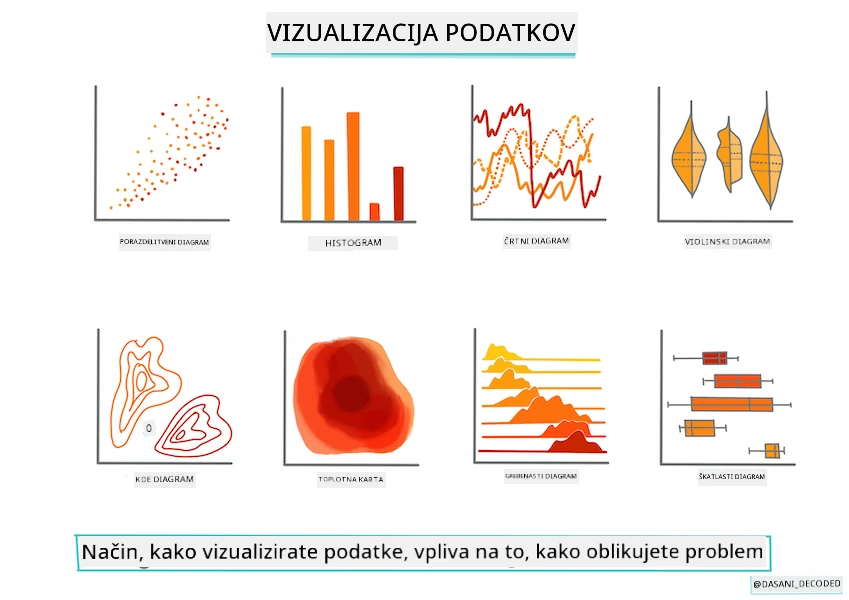
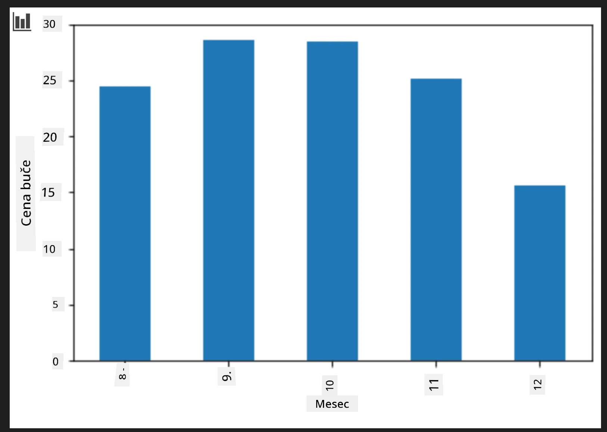
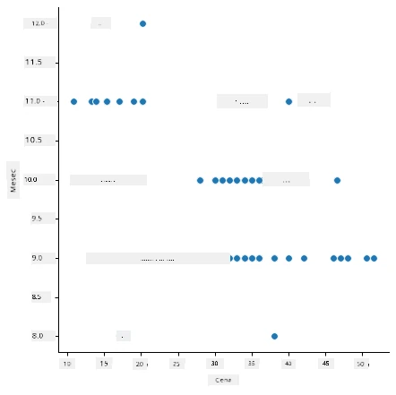
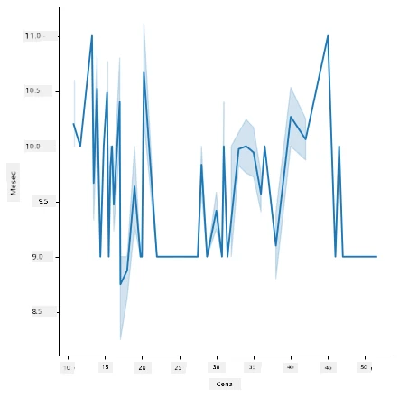
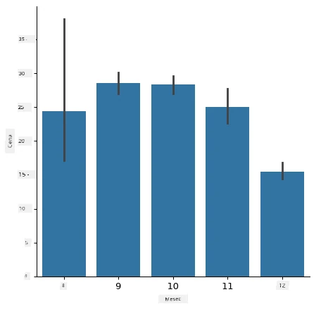
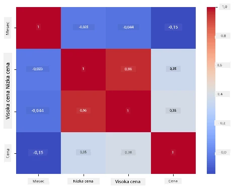

# Zgradite regresijski model s Scikit-learn: pripravite in vizualizirajte podatke



Infografika avtorja [Dasani Madipalli](https://twitter.com/dasani_decoded)

## [Predpredavanje kviz](https://ff-quizzes.netlify.app/en/ml/)

> ### [To lekcijo je na voljo tudi v R!](../../../../2-Regression/2-Data/solution/R/lesson_2.html)

## Uvod

Zdaj, ko imate pripravljena orodja za začetek gradnje modelov strojnega učenja s Scikit-learn, ste pripravljeni začeti postavljati vprašanja svojim podatkom. Ko delate s podatki in uporabljate rešitve strojnega učenja, je zelo pomembno razumeti, kako zastaviti pravilno vprašanje, da boste lahko pravilno odkrili potenciale vašega nabora podatkov.

V tej lekciji se boste naučili:

- Kako pripraviti podatke za gradnjo modela.
- Kako uporabiti Matplotlib za vizualizacijo podatkov.
- Kako uporabiti Seaborn za izraženejšo vizualizacijo podatkov.

## Postavljanje pravih vprašanj podatkom

Vprašanje, na katerega potrebujete odgovor, bo določilo, katere vrste ML algoritmov boste uporabili. Kakovost odgovora, ki ga prejmete, bo močno odvisna od narave vaših podatkov.

Oglejte si [podatke](https://github.com/microsoft/ML-For-Beginners/blob/main/2-Regression/data/US-pumpkins.csv) za to lekcijo. To .csv datoteko lahko odprete v VS Code. Hitro pregledovanje takoj pokaže, da so v podatkih prazna mesta in mešanica nizov in številčnih podatkov. Tudi stolpec z imenom 'Package' je nenavaden, saj so podatki mešanica med 'sacks', 'bins' in drugimi vrednostmi. Podatki so pravzaprav rahlo zmedeni.

[](https://youtu.be/5qGjczWTrDQ "ML za začetnike - Kako analizirati in očistiti dataset")

> 🎥 Kliknite zgornjo sliko za kratek video, ki prikazuje pripravo podatkov za to lekcijo.

Pravzaprav ni pogosto, da dobite neposredno uporabljiv dataset za takojšnjo ustvarjanje ML modela. V tej lekciji se boste naučili, kako pripraviti surove podatke z uporabo standardnih knjižnic v Pythonu. Prav tako se boste naučili različnih tehnik za vizualizacijo podatkov.

## Študija primera: 'trg buč'

V tej mapi boste našli .csv datoteko v korenski mapi `data` z imenom [US-pumpkins.csv](https://github.com/microsoft/ML-For-Beginners/blob/main/2-Regression/data/US-pumpkins.csv), ki vključuje 1757 vrstic podatkov o trgu buč, razvrščenih po skupinah po mestih. To so surovi podatki, pridobljeni iz [Specialty Crops Terminal Markets Standard Reports](https://www.marketnews.usda.gov/mnp/fv-report-config-step1?type=termPrice), ki jih distribuira Ministrstvo za kmetijstvo Združenih držav Amerike.

### Priprava podatkov

Ti podatki so v javni domeni. Na spletni strani USDA jih je mogoče prenesti v več ločenih datotekah, po mestih. Da bi se izognili preveliki količini datotek, smo vse podatke združili v eno preglednico, tako da smo podatke že malce _pripravili_. Naslednje poglejmo podatke podrobneje.

### Podatki o bučah - zgodnji zaključki

Kaj opažate pri teh podatkih? Že ste videli, da je tam mešanica nizov, številk, praznin in nenavadnih vrednosti, ki jih morate razumeti.

Kakšno vprašanje lahko zastavite tem podatkom s pomočjo regresijske tehnike? Kaj pa "Napovej ceno buče za prodajo v določenem mesecu"? Obnovitev podatkov kaže, da boste morali narediti nekaj sprememb, da ustvarite potrebno podatkovno strukturo za to nalogo.
## Vaja - analiza podatkov o bučah

Uporabimo [Pandas](https://pandas.pydata.org/) (kratica za `Python Data Analysis`), orodje, ki je zelo uporabno za oblikovanje podatkov, za analizo in pripravo teh podatkov o bučah.

### Najprej preverite manjkajoče datume

Najprej boste morali izvesti korake za preverjanje manjkajočih datumov:

1. Pretvorite datume v format meseca (to so ameriški datumi, format je `MM/DD/YYYY`).
2. Izvlecite mesec v nov stolpec.

Odprite _notebook.ipynb_ datoteko v Visual Studio Code in uvozite preglednico v nov Pandas dataframe.

1. Uporabite funkcijo `head()`, da si ogledate prvih pet vrstic.

    ```python
    import pandas as pd
    pumpkins = pd.read_csv('../data/US-pumpkins.csv')
    pumpkins.head()
    ```

    ✅ Katero funkcijo bi uporabili za ogled zadnjih pet vrstic?

1. Preverite, če so v trenutnem dataframe-u manjkajoči podatki:

    ```python
    pumpkins.isnull().sum()
    ```

    Podatki manjkajo, vendar morda to za trenutni namen ni pomembno.

1. Da bi bilo delo s dataframe-om lažje, izberite samo stolpce, ki jih potrebujete, z uporabo funkcije `loc`, ki iz izvirnega dataframe-a izvleče skupino vrstic (kot prvi parameter) in stolpcev (kot drugi parameter). Izraz `:` v spodnjem primeru pomeni "vse vrstice".

    ```python
    columns_to_select = ['Package', 'Low Price', 'High Price', 'Date']
    pumpkins = pumpkins.loc[:, columns_to_select]
    ```

### Drugič, določi povprečno ceno buče

Razmislite, kako določiti povprečno ceno buče v določenem mesecu. Katere stolpce bi izbrali za to nalogo? Namig: potrebujete 3 stolpce.

Rešitev: vzamete povprečje stolpcev `Low Price` in `High Price` za izpolnitev novega stolpca Price in pretvorite stolpec Date tako, da prikazuje samo mesec. Na srečo, kot kaže zgornja kontrola, manjkajočih podatkov za datume ali cene ni.

1. Za izračun povprečja dodajte naslednjo kodo:

    ```python
    price = (pumpkins['Low Price'] + pumpkins['High Price']) / 2

    month = pd.DatetimeIndex(pumpkins['Date']).month

    ```

   ✅ Po želji lahko katerikoli podatek preverite z `print(month)`.

2. Nato kopirajte pretvorjene podatke v svež Pandas dataframe:

    ```python
    new_pumpkins = pd.DataFrame({'Month': month, 'Package': pumpkins['Package'], 'Low Price': pumpkins['Low Price'],'High Price': pumpkins['High Price'], 'Price': price})
    ```

    Izpis vašega dataframe-a bo prikazal čist in urejen podatkovni niz, na katerega lahko zgradite novi regresijski model.

### A počakajte! Nekaj je sumljivo tukaj

Če pogledate stolpec `Package`, se buče prodajajo v različnih konfiguracijah. Nekatere se prodajajo v količinah '1 1/9 bushel', nekatere v '1/2 bushel', nekatere na bučo, nekatere na funt, in nekatere v velikih škatlah različnih širino.

> Buče se zdijo zelo težke za dosledno tehtanje

Če se poglobite v izvirne podatke, je zanimivo, da imajo vse vrednosti z `Unit of Sale`, enako 'EACH' ali 'PER BIN', tudi tip `Package` po palcu, po zabojniku ali 'each'. Buče se zdi, da so zelo težke za dosledno tehtanje, zato jih filtrirajmo tako, da izberemo samo buče z nizom 'bushel' v stolpcu `Package`.

1. Dodajte filter na vrh datoteke, pod začetnim uvozom .csv:

    ```python
    pumpkins = pumpkins[pumpkins['Package'].str.contains('bushel', case=True, regex=True)]
    ```

    Če zdaj izpišete podatke, boste videli, da dobite samo približno 415 vrstic podatkov, ki vsebujejo buče po bushel-ih.

### A počakajte! Še nekaj je treba narediti

Ste opazili, da se količina bushel razlikuje po vrsticah? Potrebno je normalizirati cene, da bodo prikazane cene na bushel, zato naredite račun, da standardizirate vrednosti.

1. Dodajte te vrstice za blokom, ki ustvarja dataframe new_pumpkins:

    ```python
    new_pumpkins.loc[new_pumpkins['Package'].str.contains('1 1/9'), 'Price'] = price/(1 + 1/9)

    new_pumpkins.loc[new_pumpkins['Package'].str.contains('1/2'), 'Price'] = price/(1/2)
    ```

✅ Po podatkih [The Spruce Eats](https://www.thespruceeats.com/how-much-is-a-bushel-1389308) je teža bushela odvisna od vrste pridelka, saj je to meritev volumna. "Bushel paradižnika, na primer, naj bi tehtal 56 funtov... Listi in zelenjava zavzamejo več prostora z manjšo težo, zato bushel špinače tehta le 20 funtov." Vse je precej zapleteno! Ne trudimo se s pretvorbo bushel-v-funte, temveč cenimo po bushel-u. Vse to študijsko delo o bushel-ih buč pa kaže, kako pomembno je razumeti naravo podatkov!

Zdaj lahko analizirate cene na enoto glede na njihovo mero bushel. Če podatke še enkrat izpišete, boste videli, kako so standardizirani.

✅ Ste opazili, da so buče, ki se prodajajo na pol bushela, zelo drage? Ali lahko ugotovite, zakaj? Namig: majhne buče so veliko dražje kot velike, verjetno zato, ker jih je na bushel veliko več, glede na neuporabljeni prostor, ki ga zavzema ena velika votla buča za pito.

## Strategije vizualizacije

Del naloge podatkovnega znanstvenika je prikazati kakovost in naravo podatkov, s katerimi dela. Pogosto ustvarjajo zanimive vizualizacije, grafične prikaze, grafikone in diagrame, ki prikazujejo različne vidike podatkov. S tem vizualno pokažejo odnose in praznine, ki bi jih sicer težko odkrili.

[](https://youtu.be/SbUkxH6IJo0 "ML za začetnike - Kako vizualizirati podatke z Matplotlib")

> 🎥 Kliknite zgornjo sliko za kratek video, ki obravnava vizualizacijo podatkov za to lekcijo.

Vizualizacije lahko prav tako pomagajo določiti tehniko strojnega učenja, ki je za podatke najbolj primerna. Na primer, razpršeni diagram, ki nakazuje vrstico, pomeni, da so podatki dober kandidat za linearno regresijsko vajo.

Ena izmed knjižnic za vizualizacijo podatkov, ki dobro deluje v Jupyter beležnicah, je [Matplotlib](https://matplotlib.org/) (ki ste jo videli tudi v prejšnji lekciji).

> Pridobite več izkušenj z vizualizacijo podatkov s temi [tutoriali](https://docs.microsoft.com/learn/modules/explore-analyze-data-with-python?WT.mc_id=academic-77952-leestott).

## Vaja - eksperimentirajte z Matplotlib

Poskusite ustvariti nekaj osnovnih grafikonov za prikaz novega dataframe-a, ki ste ga pravkar ustvarili. Kaj bi prikazal osnovni graf linije?

1. Uvozite Matplotlib na vrh datoteke, pod uvozom Pandas:

    ```python
    import matplotlib.pyplot as plt
    ```

1. Ponovno zaženite celoten notebook, da osvežite.
1. Na dnu beležnice dodajte celico za risanje podatkov kot box plot:

    ```python
    price = new_pumpkins.Price
    month = new_pumpkins.Month
    plt.scatter(price, month)
    plt.show()
    ```

    

    Je ta graf uporaben? Ali vas kaj preseneča?

    Ni posebej uporaben, saj vašo podatkovno množico prikaže samo kot razpršena točke v določenem mesecu.

### Naredite ga uporabnega

Za prikaz uporabnih podatkov v grafih običajno potrebujete, da podatke nekako skupinsko združite. Poskusimo ustvariti graf, kjer y os prikazuje mesece, podatki pa pokažejo porazdelitev podatkov.

1. Dodajte celico za ustvarjanje skupinskega stolpčnega grafikona:

    ```python
    new_pumpkins.groupby(['Month'])['Price'].mean().plot(kind='bar')
    plt.ylabel("Pumpkin Price")
    ```

    

    To je bolj uporabna vizualizacija podatkov! Zdi se, da nakazuje, da so najvišje cene buč septembra in oktobra. Ali to ustreza vašim pričakovanjem? Zakaj ali zakaj ne?

## Vaja - eksperimentiranje s Seaborn

Matplotlib je močan, vendar za izdelavo premišljenega grafikona pogosto zahteva veliko kode. [Seaborn](https://seaborn.pydata.org/) je knjižnica, ki je zgrajena _na vrhu_ Matplotlib in je namenjena statistični vizualizaciji podatkov. Deluje neposredno s Pandas dataframe-i, uporablja privlačne privzete sloge in omogoča ustvarjanje informativnih grafikonov z veliko manj kode. Ker Seaborn vrača Matplotlib objekte, lahko še vedno uporabite vse, kar že poznate o Matplotlib, za fino nastavljanje rezultata.

> Če Seaborn še nimate nameščenega, ga namestite z `pip install seaborn`.

1. Uvozite Seaborn na vrh beležnice, pod ostalimi uvozi. Običajno ga uvozimo kot `sns`:

    ```python
    import seaborn as sns
    ```

### Razpršeni grafikoni za prikaz odnosov

Velik del raziskovanja podatkov pred gradnjo modela je iskanje _odnosov_ med spremenljivkami. [Razpršeni grafikon](https://en.wikipedia.org/wiki/Scatter_plot) je eno izmed najboljših orodij za to: če točke sledijo neki liniji, bi lahko bili ti dve spremenljivki korelirani, kar je dober znak, da linearni regresijski model lahko deluje.

1. Ponovno ustvarite razpršeni grafikon cena-mesec, kot prej, tokrat z uporabom Seabornove funkcije [`relplot()`](https://seaborn.pydata.org/generated/seaborn.relplot.html) (relacijski grafikon), ki deluje neposredno z vašimi dataframe stolpci:

    ```python
    sns.relplot(x="Price", y="Month", data=new_pumpkins)
    ```

    

    Opazite, kako predajate _imena stolpcev_ in dataframe, Seaborn pa sam poskrbi za oznake osi.

2. Lahko preklopite na linijski grafikon tako, da podate `kind="line"`. Seaborn celo nariše senčeno območje, ki kaže interval zaupanja okoli linije:

    ```python
    sns.relplot(x="Price", y="Month", kind="line", data=new_pumpkins)
    ```

    

    Ti podatki so precej šumni, zato linijski grafikon morda ni najbolj jasna izbira tukaj — vendar kaže, kako enostavno lahko v Seabornu spremenite tipe grafikona.

### Stolpčni grafikoni za prikaz porazdelitev


Prej ste ročno združili podatke, da ste ustvarili stolpični diagram z Matplotlib. Seabornova funkcija [`catplot()`](https://seaborn.pydata.org/generated/seaborn.catplot.html) (kategorijski diagram) lahko za vas opravi združevanje in agregacijo. Privzeto `kind="bar"` prikaže povprečje vsake kategorije skupaj s črno črto, ki označuje interval zaupanja.

1. Ustvarite stolpični diagram povprečne cene na mesec:

    ```python
    sns.catplot(x="Month", y="Price", data=new_pumpkins, kind="bar")
    ```

    

    To potrjuje, kar ste videli z Matplotlib — cene se vrhunsko dvignejo okoli septembra in oktobra — vendar Seaborn prav tako vizualizira, koliko se cena _spreminja_ znotraj posameznega meseca.

### Toplotne karte za prikaz korelacij

Razsevni diagrami primerjajo dve spremenljivki hkrati. Ko imate več številčnih stolpcev, vam [toplotna karta](https://en.wikipedia.org/wiki/Heat_map) omogoča ogled jakosti zveze med _vsakim_ parom stolpcev hkrati. To je pogost način, da ugotovite, katere lastnosti so najbolj korelirane, preden se odločite, katere vključiti v model (in ta vrsta diagrama se kasneje uporablja za prikaz zmede matričnih klasifikacij).

1. Zgradite korelacijsko matriko s Pandas, nato jo narišite s Seabornovo funkcijo [`heatmap()`](https://seaborn.pydata.org/generated/seaborn.heatmap.html). Možnost `annot=True` natisne vrednosti korelacije na vsakem polju:

    ```python
    correlations = new_pumpkins[['Month', 'Low Price', 'High Price', 'Price']].corr()
    sns.heatmap(correlations, annot=True, cmap="coolwarm")
    ```

    

    Vrednosti blizu `1` (ali `-1`) pomenijo, da so stolpci močno _linearno_ korelirani. Opazite, kako sta `Low Price` in `High Price` skoraj popolnoma korelirana. `Month`, po drugi strani, kaže šibko linearno korelacijo s ceno — čeprav je stolpični diagram zgoraj pokazal jasen sezonski vrh septembra in oktobra. To je pomembna lekcija: koeficient korelacije meri samo _črto_ odnosa, zato lahko spregleda sezonske ali druge nelinearne vzorce. ✅ Zakaj je koristno pogledati tako toplotno karto *kot* diagrame, kot je stolpični diagram, preden se odločite, katere stolpce uporabiti?

### Matplotlib ali Seaborn?

Obe knjižnici sta vredni učenja:

- **Matplotlib** vam omogoča podrobno kontrolo nad vsakim elementom diagrama in je osnova, na kateri slonijo skoraj vse druge Python knjižnice za risanje.
- **Seaborn** nudi funkcije višje ravni in privlačne privzete nastavitve za statistične diagrame, deluje neposredno s podatkovnimi okviri in je pogosto hitrejši za raziskovalno analizo podatkov.

Pogosto delo je, da najprej uporabite Seaborn za hitro raziskovanje podatkov, nato pa preklopite na Matplotlib, ko potrebujete prilagoditve podrobnosti.

---

## 🚀Izziv

Raziščite različne vrste vizualizacij, ki jih ponujata Matplotlib in Seaborn. Kateri tipi so najbolj primerni za regresijske probleme?

## [Kvizi po predavanjih](https://ff-quizzes.netlify.app/en/ml/)

## Povzetek in samostojno učenje

Oglejte si različne načine za vizualizacijo podatkov. Naredite seznam razpoložljivih knjižnic in zabeležite, katere so najboljše za določene vrste nalog, na primer 2D vizualizacije proti 3D vizualizacijam. Kaj odkrijete?

## Domača naloga

[Raziskovanje vizualizacij](assignment.md)

---

<!-- CO-OP TRANSLATOR DISCLAIMER START -->
**Omejitev odgovornosti**:
Ta dokument je bil preveden z uporabo AI prevajalske storitve [Co-op Translator](https://github.com/Azure/co-op-translator). Čeprav si prizadevamo za natančnost, vas prosimo, da upoštevate, da avtomatizirani prevodi lahko vsebujejo napake ali netočnosti. Izvirni dokument v njegovem izvirnem jeziku je treba obravnavati kot avtoritativni vir. Za kritične informacije je priporočljiv strokovni človeški prevod. Ne odgovarjamo za morebitna nesporazume ali napačne interpretacije, ki izhajajo iz uporabe tega prevoda.
<!-- CO-OP TRANSLATOR DISCLAIMER END -->