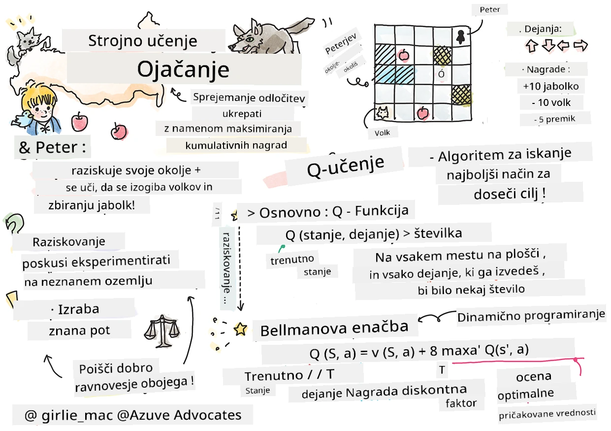

# Uvod v učenje s krepitvijo in Q-učenje


> Sketchnote avtorja [Tomomi Imura](https://www.twitter.com/girlie_mac)

Učenje s krepitvijo vključuje tri pomembne pojme: agent, nekaj stanj in nabor dejanj za vsako stanje. Z izvajanjem dejanja v določenem stanju agent prejme nagrado. Ponovno si predstavljajte računalniško igro Super Mario. Vi ste Mario, v igralni ravni, stojite ob robu pečine. Nad vami je kovček. Vi, kot Mario, v igralni ravni, na določenem mestu ... to je vaše stanje. Premik za korak desno (dejanje) vas bo ponesel preko roba in to bi vam dalo nizko numerično oceno. Vendar pa bi pritisk na gumb za skok omogočil, da si pridobite točko in bi ostali živi. To je pozitiven izid in to bi moralo podeliti pozitivno numerično oceno.

Z uporabo učenja s krepitvijo in simulatorja (igre) se lahko naučite igrati igro tako, da maksimizirate nagrado, ki je ostati živ in zbrati čim več točk.

[](https://www.youtube.com/watch?v=lDq_en8RNOo)

> 🎥 Kliknite na sliko zgoraj, da slišite Dmitryja o učenju s krepitvijo

## [Predpredavalni kviz](https://ff-quizzes.netlify.app/en/ml/)

## Predpogoji in namestitev

V tej lekciji bomo eksperimentirali z nekaj Python kode. Morali bi biti sposobni zagnati Jupyter Notebook iz te lekcije, bodisi na svojem računalniku ali nekje v oblaku.

Lahko odprete [lekcijsko beležko](https://github.com/microsoft/ML-For-Beginners/blob/main/8-Reinforcement/1-QLearning/notebook.ipynb) in sledite tej lekciji, da se jo naučite.

> **Opomba:** Če odpirate to kodo iz oblaka, morate prav tako pridobiti datoteko [`rlboard.py`](https://github.com/microsoft/ML-For-Beginners/blob/main/8-Reinforcement/1-QLearning/rlboard.py), ki se uporablja v kodi beležke. Dodajte jo v isti imenik kot beležko.

## Uvod

V tej lekciji bomo raziskovali svet **[Peter in volk](https://en.wikipedia.org/wiki/Peter_and_the_Wolf)**, ki je navdihnjen z glasbeno pravljico ruske skladateljice, [Sergeja Prokofieva](https://en.wikipedia.org/wiki/Sergei_Prokofiev). Uporabili bomo **učvrstitev učenja**, da bo Peter raziskal svoje okolje, zbiral okusne jabolke in se izogibal srečanju z volkom.

**Učenje s krepitvijo** (RL) je tehnika učenja, ki nam omogoča, da se naučimo optimalnega vedenja **agenta** v določenem **okolju** z izvajanjem številnih poskusov. Agent v tem okolju mora imeti določen **cilj**, definiran z **funkcijo nagrajevanja**.

## Okolje

Zaradi preprostosti si zamislimo Peterjev svet kot kvadratno ploščo velikosti `width` x `height`, kot je ta:


Vsaka celica na tej plošči je lahko:

* **tla**, po katerih lahko hodijo Peter in druge živali.
* **voda**, po kateri očitno ne morete hoditi.
* **drevo** ali **trava**, mesto kjer se lahko spočijete.
* **jabolko**, ki predstavlja nekaj, kar bi Peter z veseljem našel, da bi se nahranil.
* **volk**, ki je nevaren in se mu je treba izogniti.

Obstaja ločen Python modul, [`rlboard.py`](https://github.com/microsoft/ML-For-Beginners/blob/main/8-Reinforcement/1-QLearning/rlboard.py), ki vsebuje kodo za delo s tem okoljem. Ker ta koda ni pomembna za razumevanje naših konceptov, bomo modul uvozili in ga uporabili za ustvarjanje vzorčne plošče (koda blok 1):

```python
from rlboard import *

width, height = 8,8
m = Board(width,height)
m.randomize(seed=13)
m.plot()
```

Ta koda naj natisne sliko okolja, podobno zgornji.

## Dejanja in politika

V našem primeru je Peterjev cilj najti jabolko, pri tem pa se izogniti volku in drugim oviram. Za to lahko preprosto hodi, dokler ne najde jabolka.

Zato lahko na kateri koli poziciji izbere eno od naslednjih dejanj: gor, dol, levo in desno.

Ta dejanja bomo definirali kot slovar in jih povezali s pari ustreznih sprememb koordinat. Na primer, premik desno (`R`) ustreza paru `(1,0)`. (koda blok 2):

```python
actions = { "U" : (0,-1), "D" : (0,1), "L" : (-1,0), "R" : (1,0) }
action_idx = { a : i for i,a in enumerate(actions.keys()) }
```

Na kratko, strategija in cilj tega scenarija sta naslednja:

- **Strategija**, našega agenta (Petra) je definirana s tako imenovano **politiko**. Politika je funkcija, ki vrne dejanje za katerokoli dano stanje. V našem primeru je stanje problema predstavljeno s ploščo, vključno s trenutno pozicijo igralca.

- **Cilj** učenja s krepitvijo je, da na koncu pridobimo dobro politiko, ki nam bo omogočila učinkovito reševanje problema. Kot osnovno politiko bomo upoštevali najpreprostejšo, imenovano **naključni sprehod**.

## Naključni sprehod

Najprej rešimo problem z implementacijo strategije naključnega sprehoda. Pri naključnem sprehodu bomo naključno izbirali naslednje dejanje iz dovoljenih dejanj, dokler ne pridemo do jabolka (koda blok 3).

1. Implementirajte naključni sprehod z naslednjo kodo:

    ```python
    def random_policy(m):
        return random.choice(list(actions))
    
    def walk(m,policy,start_position=None):
        n = 0 # število korakov
        # nastavi začetni položaj
        if start_position:
            m.human = start_position 
        else:
            m.random_start()
        while True:
            if m.at() == Board.Cell.apple:
                return n # uspeh!
            if m.at() in [Board.Cell.wolf, Board.Cell.water]:
                return -1 # pojedel volk ali utonil
            while True:
                a = actions[policy(m)]
                new_pos = m.move_pos(m.human,a)
                if m.is_valid(new_pos) and m.at(new_pos)!=Board.Cell.water:
                    m.move(a) # naredi dejanski premik
                    break
            n+=1
    
    walk(m,random_policy)
    ```

    Klic funkcije `walk` naj vrne dolžino ustrezne poti, ki se lahko razlikuje pri vsakem zagonu. 

1. Poženite eksperiment sprehoda večkrat (recimo 100-krat) in natisnite nastale statistike (koda blok 4):

    ```python
    def print_statistics(policy):
        s,w,n = 0,0,0
        for _ in range(100):
            z = walk(m,policy)
            if z<0:
                w+=1
            else:
                s += z
                n += 1
        print(f"Average path length = {s/n}, eaten by wolf: {w} times")
    
    print_statistics(random_policy)
    ```

    Upoštevajte, da je povprečna dolžina poti približno 30-40 korakov, kar je precej veliko, glede na dejstvo, da je povprečna razdalja do najbližjega jabolka približno 5-6 korakov.

    Vidite lahko tudi, kako izgleda Peterjevo gibanje med naključnim sprehodom:

    

## Funkcija nagrajevanja

Da bi naredili našo politiko bolj pametno, moramo razumeti, kater premiki so "boljši" od drugih. Za to moramo definirati naš cilj.

Cilj lahko definiramo z vidika **funkcije nagrajevanja**, ki vrne neko vrednost ocene za vsako stanje. Višje število pomeni boljšo funkcijo nagrajevanja. (koda blok 5)

```python
move_reward = -0.1
goal_reward = 10
end_reward = -10

def reward(m,pos=None):
    pos = pos or m.human
    if not m.is_valid(pos):
        return end_reward
    x = m.at(pos)
    if x==Board.Cell.water or x == Board.Cell.wolf:
        return end_reward
    if x==Board.Cell.apple:
        return goal_reward
    return move_reward
```

Zanimivo pri funkcijah nagrajevanja je, da v večini primerov *dobimo pomembno nagrado šele na koncu igre*. To pomeni, da mora naš algoritem nekako zapomniti "dobre" korake, ki vodijo do pozitivne nagrade na koncu, in povečati njihovo pomembnost. Prav tako je treba discouraged vsa dejanja, ki vodijo do slabih rezultatov.

## Q-učenje

Algoritem, ki ga bomo obravnavali, se imenuje **Q-učenje**. V tem algoritmu je politika definirana z funkcijo (ali podatkovno strukturo), imenovano **Q-tabela**. Ta beleži "dobroto" vsakega dejanja v določenem stanju.

Ime Q-tabela dobi, ker je pogosto priročno predstavljati jo kot tabelo ali večdimenzionalno matriko. Ker naša plošča ima dimenziji `width` x `height`, lahko Q-tabelo predstavimo z numpy matriko z obliko `width` x `height` x `len(actions)`: (koda blok 6)

```python
Q = np.ones((width,height,len(actions)),dtype=np.float)*1.0/len(actions)
```

Opazite, da začnemo z vsemi vrednostmi Q-tabele nastavljeno na enako vrednost, v našem primeru 0.25. To ustreza "politični random walk", saj so vsi premiki v vsakem stanju enako dobri. Q-tabelo lahko predamo funkciji `plot` za vizualizacijo tabele na plošči: `m.plot(Q)`.


V središču vsake celice je "puščica", ki kaže prednostno smer gibanja. Ker so vse smeri enake, je prikazana pika.

Zdaj moramo zagnati simulacijo, raziskati okolje in se naučiti boljše porazdelitve vrednosti Q-tabele, kar nam bo omogočilo, da hitreje najdemo pot do jabolka.

## Bistvo Q-učenja: Bellmanova enačba

Ko začnemo z gibanjem, bo vsako dejanje imelo pripadajočo nagrado, torej lahko teoretično izberemo naslednje dejanje glede na najvišjo takojšnjo nagrado. Vendar pa v večini stanj ta poteza ne bo dosegla našega cilja - doseči jabolko, zato ne moremo takoj odločiti, katera smer je boljša.

> Zapomnite si, da ni pomemben takojšnji rezultat, ampak končni rezultat, ki ga bomo dobili na koncu simulacije.

Da bi upoštevali to zamaknjeno nagrado, moramo uporabiti principe **[dinamičnega programiranja](https://en.wikipedia.org/wiki/Dynamic_programming)**, ki nam omogočajo rekurzivno razmišljanje o našem problemu.

Predpostavimo, da smo sedaj v stanju *s* in želimo preiti v naslednje stanje *s'*. S tem bomo prejeli takojšnjo nagrado *r(s,a)*, definirano s funkcijo nagrajevanja, poleg tega pa še neko prihodnjo nagrado. Če predpostavimo, da naša Q-tabela pravilno odraža "privlačnost" vsakega dejanja, potem bomo v stanju *s'* izbrali dejanje *a*, ki ustreza maksimalni vrednosti *Q(s',a')*. Zato bo najboljša možna prihodnja nagrada v stanju *s* definirana kot `max`<sub>a'</sub>*Q(s',a')* (maksimum je tukaj izračunan preko vseh možnih dejanj *a'* v stanju *s'*).

To daje **Bellmanovo formulo** za izračun vrednosti Q-tabele v stanju *s*, glede na dejanje *a*:


Tukaj je γ tako imenovani **faktor diskontiranja**, ki določa, v kolikšni meri naj se trenutno nagrado preferira pred prihodnjo nagrado in obratno.

## Algoritem učenja

Glede na zgornjo enačbo lahko zdaj napišemo psevdokodo za naš algoritem učenja:

* Inicializiraj Q-tabelo Q z enakimi vrednostmi za vsa stanja in dejanja
* Nastavi hitrost učenja α ← 1
* Ponovi simulacijo večkrat
   1. Začni na naključni poziciji
   1. Ponovi
        1. Izberi dejanje *a* v stanju *s*
        2. Izvedi dejanje s premikom v novo stanje *s'*
        3. Če zasledimo pogoj konca igre ali je celotna nagrada premajhna - končaj simulacijo  
        4. Izračunaj nagrado *r* v novem stanju
        5. Posodobi Q-funkcijo po Bellmanovi enačbi: *Q(s,a)* ← *(1-α)Q(s,a)+α(r+γ max<sub>a'</sub>Q(s',a'))*
        6. *s* ← *s'*
        7. Posodobi skupno nagrado in znižaj α.

## Izkoristi vs. raziskuj

V zgornjem algoritmu nismo natančno določili, kako izbrati dejanje v koraku 2.1. Če dejanja izbiramo naključno, bomo naključno **raziskovali** okolje, in precej verjetno bomo pogosto umrli ter obiskali območja, kjer sicer ne bi šli. Alternativni pristop bi bil **izkoristiti** že znane vrednosti Q-tabele in tako izbrati najboljše dejanje (z višjo vrednostjo v Q-tabeli) v stanju *s*. To pa bi nas preprečilo, da bi raziskali druga stanja, zato verjetno ne bomo našli optimalne rešitve.

Zato je najboljši pristop doseči ravnovesje med raziskovanjem in izkoriščanjem. To dosežemo tako, da izbiramo dejanje v stanju *s* z verjetnostmi, sorazmernimi z vrednostmi v Q-tabeli. Na začetku, ko so vrednosti Q-tabele vse enake, bi to ustrezalo naključni izbiri, vendar ko se več naučimo o našem okolju, bomo verjetneje sledili optimalni poti, hkrati pa bomo agentu dovolili, da včasih izbere neodkrito pot.

## Implementacija v Pythonu

Zdaj smo pripravljeni implementirati algoritem učenja. Pred tem potrebujemo še funkcijo, ki bo pretvorila poljubna števila v Q-tabeli v vektor verjetnosti za ustrezna dejanja.

1. Ustvari funkcijo `probs()`:

    ```python
    def probs(v,eps=1e-4):
        v = v-v.min()+eps
        v = v/v.sum()
        return v
    ```

    Dodamo nekaj `eps` originalnemu vektorju, da se izognemo deljenju z 0 v začetnem primeru, ko so vse komponente vektorja enake.

Zaženimo algoritem učenja skozi 5000 poskusov, imenovanih tudi **epoh**: (koda blok 8)
```python
    for epoch in range(5000):
    
        # Izberi začetno točko
        m.random_start()
        
        # Začni potovanje
        n=0
        cum_reward = 0
        while True:
            x,y = m.human
            v = probs(Q[x,y])
            a = random.choices(list(actions),weights=v)[0]
            dpos = actions[a]
            m.move(dpos,check_correctness=False) # dovolimo igralcu, da se premakne izven plošče, kar zaključuje epizodo
            r = reward(m)
            cum_reward += r
            if r==end_reward or cum_reward < -1000:
                lpath.append(n)
                break
            alpha = np.exp(-n / 10e5)
            gamma = 0.5
            ai = action_idx[a]
            Q[x,y,ai] = (1 - alpha) * Q[x,y,ai] + alpha * (r + gamma * Q[x+dpos[0], y+dpos[1]].max())
            n+=1
```

Po izvedbi tega algoritma naj bi bila Q-tabela posodobljena z vrednostmi, ki določajo privlačnost različnih dejanj v vsakem koraku. Poskusimo lahko vizualizirati Q-tabelo tako, da izrišemo vektor v vsaki celici, ki kaže v želeno smer gibanja. Zaradi preprostosti narišemo majhen krog namesto konice puščice.


## Preverjanje politike

Ker Q-tabela našteta "privlačnost" vsakega dejanja v vsakem stanju, jo je razmeroma enostavno uporabiti za določanje učinkovite navigacije v našem svetu. V najpreprostejšem primeru lahko izberemo dejanje, ki ustreza najvišji vrednosti v Q-tabeli: (koda blok 9)

```python
def qpolicy_strict(m):
        x,y = m.human
        v = probs(Q[x,y])
        a = list(actions)[np.argmax(v)]
        return a

walk(m,qpolicy_strict)
```


> Če zgornjo kodo preizkusite večkrat, boste morda opazili, da se včasih "zatakne" in morate pritisniti gumb STOP v zvezku, da jo prekinete. To se zgodi, ker so lahko situacije, ko se dve stanji "kažeta" drug na drugega glede optimalne Q-vrednosti, v tem primeru agent nenehno prehaja med tema stanji.

## 🚀Izziv

> **Naloga 1:** Spremenite funkcijo `walk`, da omejite največjo dolžino poti na določeno število korakov (recimo 100) in opazujte, kako zgornja koda občasno vrne to vrednost.

> **Naloga 2:** Spremenite funkcijo `walk` tako, da ne bo šla nazaj na kraje, kjer je že bila prej. S tem boste preprečili zanko v funkciji `walk`, vendar pa se agent lahko še vedno znajde "ujet" na mestu, iz katerega ne more pobegniti.

## Navigacija

Boljša navigacijska politika bi bila tista, ki smo jo uporabili med učenjem, ki združuje izkoriščanje in raziskovanje. V tej politiki bomo vsako dejanje izbrali z določeno verjetnostjo, sorazmerno vrednostim v Q-tabeli. Ta strategija lahko še vedno privede do tega, da agent nazaj pride na že raziskano položaj, vendar, kot vidite v spodnji kodi, to vodi do zelo kratke povprečne poti do želenega mesta (spomnite se, da `print_statistics` zažene simulacijo 100-krat): (koda blok 10)

```python
def qpolicy(m):
        x,y = m.human
        v = probs(Q[x,y])
        a = random.choices(list(actions),weights=v)[0]
        return a

print_statistics(qpolicy)
```

Po zagonu te kode bi morali dobiti precej krajšo povprečno dolžino poti kot prej, v območju 3-6.

## Preučevanje procesa učenja

Kot smo že omenili, je proces učenja ravnotežje med raziskovanjem in izkoriščanjem pridobljenega znanja o strukturi problema. Videli smo, da so rezultati učenja (sposobnost pomagati agentu najti kratko pot do cilja) izboljšani, vendar je tudi zanimivo opazovati, kako se povprečna dolžina poti obnaša med procesom učenja:


Povzetek učenja:

- **Povprečna dolžina poti se povečuje**. Tukaj lahko vidimo, da se povprečna dolžina poti najprej poveča. To je verjetno posledica dejstva, da, ko ne vemo ničesar o okolju, se verjetno zataknemo v slabih stanjih, kot sta voda ali volk. Ko se več naučimo in začnemo uporabljati to znanje, lahko okolje dlje raziskujemo, vendar še ne vemo zelo dobro, kje so jabolka.

- **Dolžina poti se skrajša, ko se več naučimo**. Ko se naučimo dovolj, postane agentu lažje doseči cilj in dolžina poti začne upadati. Kljub temu smo še vedno odprti za raziskovanje, zato pogosto odklonimo od najboljše poti in raziskujemo nove možnosti, zaradi česar je pot daljša od optimalne.

- **Dolžina nenadoma naraste**. Še nekaj, kar lahko opazimo na tem grafu, je, da se je dolžina nekje nenadoma povečala. To kaže na stokastičen značaj procesa in da lahko kdaj "pokvarimo" koeficiente v Q-tabeli z prepisovanjem z novimi vrednostmi. To bi bilo idealno minimizirati z zmanjševanjem stopnje učenja (na primer proti koncu treninga prilagodimo vrednosti Q-tabele le z majhno vrednostjo).

Na splošno je pomembno vedeti, da uspeh in kakovost procesa učenja močno odvisna od parametrov, kot so stopnja učenja, upad stopnje učenja in faktor diskontiranja. Ti parametri se pogosto imenujejo **hiperparametri**, da jih razlikujemo od **parametrov**, ki jih optimiziramo med učenjem (na primer koeficienti v Q-tabeli). Proces iskanja najboljših vrednosti hiperparametrov se imenuje **optimizacija hiperparametrov** in si zasluži svojo temo.

## [Kvizek po predavanju](https://ff-quizzes.netlify.app/en/ml/)

## Domača naloga 
[Bolj realističen svet](assignment.md)

---

<!-- CO-OP TRANSLATOR DISCLAIMER START -->
**Omejitev odgovornosti**:
Ta dokument je bil preveden z uporabo AI prevajalske storitve [Co-op Translator](https://github.com/Azure/co-op-translator). Čeprav si prizadevamo za natančnost, vas prosimo, da upoštevate, da avtomatizirani prevodi lahko vsebujejo napake ali netočnosti. Izvirni dokument v njegovem izvirnem jeziku je treba obravnavati kot avtoritativni vir. Za kritične informacije je priporočljiv strokovni človeški prevod. Ne odgovarjamo za morebitna nesporazume ali napačne interpretacije, ki izhajajo iz uporabe tega prevoda.
<!-- CO-OP TRANSLATOR DISCLAIMER END -->