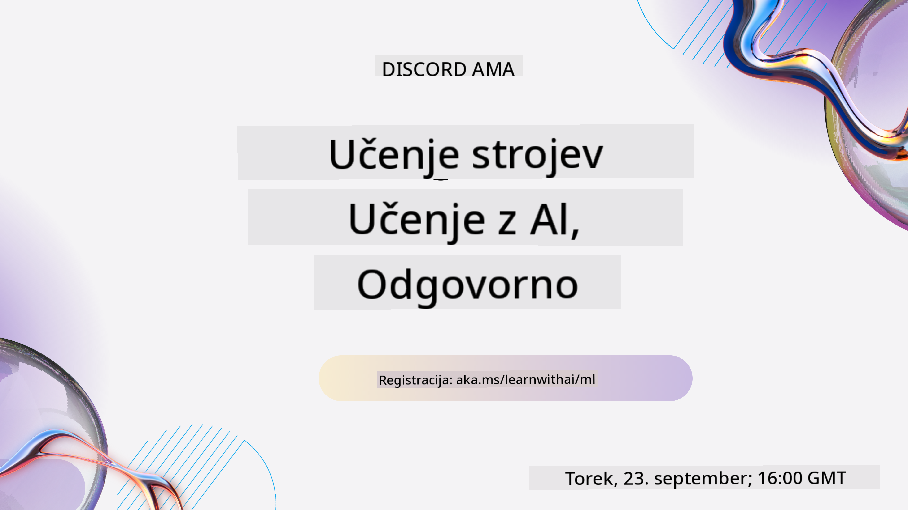
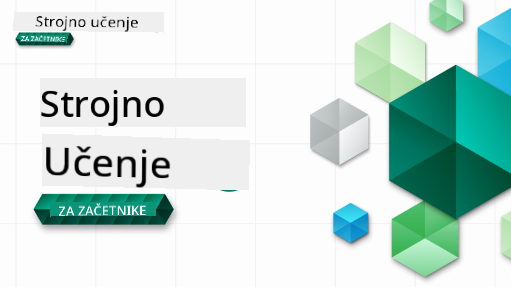

<!--
CO_OP_TRANSLATOR_METADATA:
{
  "original_hash": "7a13afb3674838f557d61f8d67e4d5f8",
  "translation_date": "2025-10-24T09:25:42+00:00",
  "source_file": "README.md",
  "language_code": "sl"
}
-->
  
  
  
  
  

  
  
  

### 🌐 Podpora za več jezikov  

#### Podprto prek GitHub Action (Samodejno in vedno posodobljeno)  

<!-- TABELA JEZIKOV ZA SODELOVANJE PREVAJALCEV ZAČETEK -->
[Arabščina](../ar/README.md) | [Bengalščina](../bn/README.md) | [Bolgarščina](../bg/README.md) | [Burmanščina (Mjanmar)](../my/README.md) | [Kitajščina (poenostavljena)](../zh/README.md) | [Kitajščina (tradicionalna, Hongkong)](../hk/README.md) | [Kitajščina (tradicionalna, Macao)](../mo/README.md) | [Kitajščina (tradicionalna, Tajvan)](../tw/README.md) | [Hrvaščina](../hr/README.md) | [Češčina](../cs/README.md) | [Danščina](../da/README.md) | [Nizozemščina](../nl/README.md) | [Estonščina](../et/README.md) | [Finščina](../fi/README.md) | [Francoščina](../fr/README.md) | [Nemščina](../de/README.md) | [Grščina](../el/README.md) | [Hebrejščina](../he/README.md) | [Hindijščina](../hi/README.md) | [Madžarščina](../hu/README.md) | [Indonezijščina](../id/README.md) | [Italijanščina](../it/README.md) | [Japonščina](../ja/README.md) | [Korejščina](../ko/README.md) | [Litvanščina](../lt/README.md) | [Malajščina](../ms/README.md) | [Maratščina](../mr/README.md) | [Nepalščina](../ne/README.md) | [Norveščina](../no/README.md) | [Perzijščina (Farsi)](../fa/README.md) | [Poljščina](../pl/README.md) | [Portugalščina (Brazilija)](../br/README.md) | [Portugalščina (Portugalska)](../pt/README.md) | [Pandžabščina (Gurmukhi)](../pa/README.md) | [Romunščina](../ro/README.md) | [Ruščina](../ru/README.md) | [Srbščina (cirilica)](../sr/README.md) | [Slovaščina](../sk/README.md) | [Slovenščina](./README.md) | [Španščina](../es/README.md) | [Svahili](../sw/README.md) | [Švedščina](../sv/README.md) | [Tagalog (Filipino)](../tl/README.md) | [Tamilščina](../ta/README.md) | [Tajščina](../th/README.md) | [Turščina](../tr/README.md) | [Ukrajinščina](../uk/README.md) | [Urdu](../ur/README.md) | [Vietnamščina](../vi/README.md)  
<!-- TABELA JEZIKOV ZA SODELOVANJE PREVAJALCEV KONEC -->

#### Pridružite se naši skupnosti  

  

Imamo serijo učenja z umetno inteligenco na Discordu, izvedite več in se nam pridružite na [Serija učenja z umetno inteligenco](https://aka.ms/learnwithai/discord) od 18. do 30. septembra 2025. Prejeli boste nasvete in trike za uporabo GitHub Copilot za podatkovno znanost.  

  

# Strojno učenje za začetnike - Kurikulum  

> 🌍 Potujte po svetu, ko raziskujemo strojno učenje skozi prizmo svetovnih kultur 🌍  

Cloud Advocates pri Microsoftu z veseljem ponujajo 12-tedenski, 26-lekcijski kurikulum o **strojnem učenju**. V tem kurikulumu se boste naučili o tem, kar se včasih imenuje **klasično strojno učenje**, pri čemer boste večinoma uporabljali knjižnico Scikit-learn in se izognili globokemu učenju, ki je obravnavano v našem [kurikulumu AI za začetnike](https://aka.ms/ai4beginners). Te lekcije lahko združite tudi z našim kurikulumom ['Podatkovna znanost za začetnike'](https://aka.ms/ds4beginners).  

Potujte z nami po svetu, ko uporabljamo te klasične tehnike na podatkih iz različnih delov sveta. Vsaka lekcija vključuje kvize pred in po lekciji, pisna navodila za dokončanje lekcije, rešitev, nalogo in še več. Naša projektno usmerjena pedagogika vam omogoča učenje skozi gradnjo, kar je dokazano učinkovit način za pridobivanje novih veščin.  

**✍️ Iskrena zahvala našim avtorjem** Jen Looper, Stephen Howell, Francesca Lazzeri, Tomomi Imura, Cassie Breviu, Dmitry Soshnikov, Chris Noring, Anirban Mukherjee, Ornella Altunyan, Ruth Yakubu in Amy Boyd  

**🎨 Zahvala tudi našim ilustratorjem** Tomomi Imura, Dasani Madipalli in Jen Looper  

**🙏 Posebna zahvala 🙏 našim Microsoft Student Ambassador avtorjem, recenzentom in prispevalcem vsebine**, zlasti Rishit Dagli, Muhammad Sakib Khan Inan, Rohan Raj, Alexandru Petrescu, Abhishek Jaiswal, Nawrin Tabassum, Ioan Samuila in Snigdha Agarwal  

**🤩 Dodatna zahvala Microsoft Student Ambassadors Eric Wanjau, Jasleen Sondhi in Vidushi Gupta za naše lekcije v R!**  

# Začetek  

Sledite tem korakom:  
1. **Forkajte repozitorij**: Kliknite na gumb "Fork" v zgornjem desnem kotu te strani.  
2. **Klonirajte repozitorij**:   `git clone https://github.com/microsoft/ML-For-Beginners.git`  

> [poiščite vse dodatne vire za ta tečaj v naši zbirki Microsoft Learn](https://learn.microsoft.com/en-us/collections/qrqzamz1nn2wx3?WT.mc_id=academic-77952-bethanycheum)  

> 🔧 **Potrebujete pomoč?** Preverite naš [Vodnik za odpravljanje težav](TROUBLESHOOTING.md) za rešitve pogostih težav pri namestitvi, nastavitvi in izvajanju lekcij.  

**[Študenti](https://aka.ms/student-page)**, za uporabo tega kurikuluma, forkajte celoten repozitorij v svoj GitHub račun in dokončajte vaje sami ali v skupini:  

- Začnite s kvizom pred predavanjem.  
- Preberite predavanje in dokončajte aktivnosti, ustavite se in razmislite pri vsakem preverjanju znanja.  
- Poskusite ustvariti projekte z razumevanjem lekcij, namesto da bi samo zagnali rešitev kode; vendar je ta koda na voljo v mapah `/solution` v vsaki projektno usmerjeni lekciji.  
- Opravite kviz po predavanju.  
- Dokončajte izziv.  
- Dokončajte nalogo.  
- Po zaključku skupine lekcij obiščite [Diskusijsko ploščo](https://github.com/microsoft/ML-For-Beginners/discussions) in "učite se na glas" tako, da izpolnite ustrezno PAT rubriko. 'PAT' je orodje za ocenjevanje napredka, ki je rubrika, ki jo izpolnite za nadaljnje učenje. Lahko se tudi odzovete na druge PAT-e, da se učimo skupaj.  

> Za nadaljnje študije priporočamo, da sledite tem [Microsoft Learn](https://docs.microsoft.com/en-us/users/jenlooper-2911/collections/k7o7tg1gp306q4?WT.mc_id=academic-77952-leestott) modulom in učnim potem.  

**Učitelji**, vključili smo [nekaj predlogov](for-teachers.md) o tem, kako uporabiti ta kurikulum.  

---

## Video vodiči  

Nekatere lekcije so na voljo kot kratki video posnetki. Vse te najdete v lekcijah ali na [seznamu predvajanja ML za začetnike na YouTube kanalu Microsoft Developer](https://aka.ms/ml-beginners-videos) s klikom na spodnjo sliko.  

  

---

## Spoznajte ekipo  

  

**Gif avtorja** [Mohit Jaisal](https://linkedin.com/in/mohitjaisal)  

> 🎥 Kliknite zgornjo sliko za video o projektu in ljudeh, ki so ga ustvarili!  

---

## Pedagogika  

Pri oblikovanju tega kurikuluma smo se odločili za dva pedagoška načela: zagotoviti, da je praktično **projektno usmerjeno** in da vključuje **pogoste kvize**. Poleg tega ima ta kurikulum skupno **temo**, ki mu daje kohezijo.  

Z zagotavljanjem, da se vsebina ujema s projekti, je proces bolj privlačen za študente, koncepti pa se bolje ohranijo. Poleg tega nizko-stresni kviz pred predavanjem usmeri pozornost študenta na učenje teme, medtem ko drugi kviz po predavanju zagotavlja nadaljnjo ohranitev znanja. Ta kurikulum je bil zasnovan tako, da je prilagodljiv in zabaven ter ga je mogoče vzeti v celoti ali delno. Projekti se začnejo majhni in postajajo vse bolj kompleksni do konca 12-tedenskega cikla. Ta kurikulum vključuje tudi dodatek o realnih aplikacijah strojnega učenja, ki ga je mogoče uporabiti kot dodatno nalogo ali kot osnovo za razpravo.  

> Poiščite naš [Kodeks ravnanja](CODE_OF_CONDUCT.md), [Prispevanje](CONTRIBUTING.md), [Prevajanje](TRANSLATIONS.md) in [Vodnik za odpravljanje težav](TROUBLESHOOTING.md). Veseli bomo vaših konstruktivnih povratnih informacij!  

## Vsaka lekcija vključuje  

- opcijsko skico  
- opcijski dopolnilni video  
- video vodič (samo nekatere lekcije)  
- [kviz za ogrevanje pred predavanjem](https://ff-quizzes.netlify.app/en/ml/)  
- pisno lekcijo  
- za projektno usmerjene lekcije, vodnike po korakih, kako zgraditi projekt  
- preverjanje znanja  
- izziv  
- dopolnilno branje  
- nalogo  
- [kviz po predavanju](https://ff-quizzes.netlify.app/en/ml/)  

> **Opomba o jezikih**: Te lekcije so večinoma napisane v Pythonu, vendar so mnoge na voljo tudi v R. Za dokončanje lekcije v R pojdite v mapo `/solution` in poiščite lekcije v R. Vključujejo razširitev .rmd, ki predstavlja **R Markdown** datoteko, ki jo je mogoče preprosto opredeliti kot vdelavo `kodnih blokov` (R ali drugih jezikov) in `YAML glave` (ki usmerja, kako formatirati izhode, kot je PDF) v `Markdown dokumentu`. Tako služi kot zgleden avtorski okvir za podatkovno znanost, saj vam omogoča kombiniranje kode, njenega izhoda in vaših misli z zapisovanjem v Markdown. Poleg tega je mogoče dokumente R Markdown upodobiti v izhodne formate, kot so PDF, HTML ali Word.  

> **Opomba o kvizih**: Vsi kvizi so vsebovani v [mapi Quiz App](../../quiz-app), skupaj 52 kvizov s po tremi vprašanji. Povezani so znotraj lekcij, vendar je aplikacijo za kvize mogoče zagnati lokalno; sledite navodilom v mapi `quiz-app`, da jo gostite lokalno ali namestite na Azure.  

| Številka lekcije |                             Tema                              |                   Skupina lekcij                   | Cilji učenja                                                                                                             |                                                              Povezana lekcija                                                               |                        Avtor                        |  
| :-----------: | :------------------------------------------------------------: | :-------------------------------------------------: | ------------------------------------------------------------------------------------------------------------------------------- | :--------------------------------------------------------------------------------------------------------------------------------------: | :--------------------------------------------------: |  
|      01       |                Uvod v strojno učenje                           |      [Uvod](1-Introduction/README.md)               | Spoznajte osnovne koncepte strojnega učenja                                                                                     |                                             [Lekcija](1-Introduction/1-intro-to-ML/README.md)                                             |                       Muhammad                       |
|      02       |                Zgodovina strojnega učenja                      |      [Uvod](1-Introduction/README.md)               | Spoznajte zgodovino tega področja                                                                                               |                                            [Lekcija](1-Introduction/2-history-of-ML/README.md)                                            |                     Jen in Amy                       |
|      03       |                 Pravičnost in strojno učenje                   |      [Uvod](1-Introduction/README.md)               | Katere pomembne filozofske vidike pravičnosti bi morali študenti upoštevati pri gradnji in uporabi modelov strojnega učenja?    |                                              [Lekcija](1-Introduction/3-fairness/README.md)                                               |                        Tomomi                        |
|      04       |                Tehnike za strojno učenje                      |      [Uvod](1-Introduction/README.md)               | Katere tehnike uporabljajo raziskovalci strojnega učenja za gradnjo modelov strojnega učenja?                                   |                                          [Lekcija](1-Introduction/4-techniques-of-ML/README.md)                                           |                    Chris in Jen                      |
|      05       |                   Uvod v regresijo                            |        [Regresija](2-Regression/README.md)          | Začnite s Pythonom in Scikit-learn za modele regresije                                                                          |         [Python](2-Regression/1-Tools/README.md) • [R](../../2-Regression/1-Tools/solution/R/lesson_1.html)         |      Jen • Eric Wanjau       |
|      06       |                Cene buč v Severni Ameriki 🎃                   |        [Regresija](2-Regression/README.md)          | Vizualizirajte in očistite podatke za pripravo na strojno učenje                                                               |          [Python](2-Regression/2-Data/README.md) • [R](../../2-Regression/2-Data/solution/R/lesson_2.html)          |      Jen • Eric Wanjau       |
|      07       |                Cene buč v Severni Ameriki 🎃                   |        [Regresija](2-Regression/README.md)          | Zgradite linearne in polinomske regresijske modele                                                                              |        [Python](2-Regression/3-Linear/README.md) • [R](../../2-Regression/3-Linear/solution/R/lesson_3.html)        |      Jen in Dmitry • Eric Wanjau       |
|      08       |                Cene buč v Severni Ameriki 🎃                   |        [Regresija](2-Regression/README.md)          | Zgradite logistični regresijski model                                                                                          |     [Python](2-Regression/4-Logistic/README.md) • [R](../../2-Regression/4-Logistic/solution/R/lesson_4.html)      |      Jen • Eric Wanjau       |
|      09       |                          Spletna aplikacija 🔌                 |           [Spletna aplikacija](3-Web-App/README.md) | Zgradite spletno aplikacijo za uporabo vašega treniranega modela                                                                |                                                 [Python](3-Web-App/1-Web-App/README.md)                                                  |                         Jen                          |
|      10       |                 Uvod v klasifikacijo                          |    [Klasifikacija](4-Classification/README.md)      | Očistite, pripravite in vizualizirajte svoje podatke; uvod v klasifikacijo                                                     | [Python](4-Classification/1-Introduction/README.md) • [R](../../4-Classification/1-Introduction/solution/R/lesson_10.html)  | Jen in Cassie • Eric Wanjau |
|      11       |             Okusne azijske in indijske jedi 🍜                 |    [Klasifikacija](4-Classification/README.md)      | Uvod v klasifikatorje                                                                                                          | [Python](4-Classification/2-Classifiers-1/README.md) • [R](../../4-Classification/2-Classifiers-1/solution/R/lesson_11.html) | Jen in Cassie • Eric Wanjau |
|      12       |             Okusne azijske in indijske jedi 🍜                 |    [Klasifikacija](4-Classification/README.md)      | Več klasifikatorjev                                                                                                            | [Python](4-Classification/3-Classifiers-2/README.md) • [R](../../4-Classification/3-Classifiers-2/solution/R/lesson_12.html) | Jen in Cassie • Eric Wanjau |
|      13       |             Okusne azijske in indijske jedi 🍜                 |    [Klasifikacija](4-Classification/README.md)      | Zgradite spletno aplikacijo za priporočila z uporabo vašega modela                                                             |                                              [Python](4-Classification/4-Applied/README.md)                                              |                         Jen                          |
|      14       |                   Uvod v razvrščanje                          |        [Razvrščanje](5-Clustering/README.md)        | Očistite, pripravite in vizualizirajte svoje podatke; uvod v razvrščanje                                                       |         [Python](5-Clustering/1-Visualize/README.md) • [R](../../5-Clustering/1-Visualize/solution/R/lesson_14.html)         |      Jen • Eric Wanjau       |
|      15       |              Raziskovanje glasbenih okusov v Nigeriji 🎧       |        [Razvrščanje](5-Clustering/README.md)        | Raziskovanje metode K-Means                                                                                                    |           [Python](5-Clustering/2-K-Means/README.md) • [R](../../5-Clustering/2-K-Means/solution/R/lesson_15.html)           |      Jen • Eric Wanjau       |
|      16       |        Uvod v obdelavo naravnega jezika ☕️                    |   [Obdelava naravnega jezika](6-NLP/README.md)      | Spoznajte osnove obdelave naravnega jezika z izdelavo preprostega bota                                                         |                                             [Python](6-NLP/1-Introduction-to-NLP/README.md)                                              |                       Stephen                        |
|      17       |                      Pogoste naloge NLP ☕️                    |   [Obdelava naravnega jezika](6-NLP/README.md)      | Poglobite svoje znanje NLP z razumevanjem pogostih nalog pri delu z jezikovnimi strukturami                                    |                                                    [Python](6-NLP/2-Tasks/README.md)                                                     |                       Stephen                        |
|      18       |             Prevajanje in analiza sentimenta ♥️               |   [Obdelava naravnega jezika](6-NLP/README.md)      | Prevajanje in analiza sentimenta z Jane Austen                                                                                 |                                            [Python](6-NLP/3-Translation-Sentiment/README.md)                                             |                       Stephen                        |
|      19       |                  Romantični hoteli v Evropi ♥️                |   [Obdelava naravnega jezika](6-NLP/README.md)      | Analiza sentimenta z ocenami hotelov 1                                                                                        |                                               [Python](6-NLP/4-Hotel-Reviews-1/README.md)                                                |                       Stephen                        |
|      20       |                  Romantični hoteli v Evropi ♥️                |   [Obdelava naravnega jezika](6-NLP/README.md)      | Analiza sentimenta z ocenami hotelov 2                                                                                        |                                               [Python](6-NLP/5-Hotel-Reviews-2/README.md)                                                |                       Stephen                        |
|      21       |            Uvod v napovedovanje časovnih vrst                 |        [Časovne vrste](7-TimeSeries/README.md)      | Uvod v napovedovanje časovnih vrst                                                                                            |                                             [Python](7-TimeSeries/1-Introduction/README.md)                                              |                      Francesca                       |
|      22       | ⚡️ Svetovna poraba energije ⚡️ - napovedovanje časovnih vrst z ARIMA |        [Časovne vrste](7-TimeSeries/README.md)      | Napovedovanje časovnih vrst z ARIMA                                                                                           |                                                 [Python](7-TimeSeries/2-ARIMA/README.md)                                                 |                      Francesca                       |
|      23       |  ⚡️ Svetovna poraba energije ⚡️ - napovedovanje časovnih vrst z SVR  |        [Časovne vrste](7-TimeSeries/README.md)      | Napovedovanje časovnih vrst z regressorjem podpornih vektorjev                                                                |                                                  [Python](7-TimeSeries/3-SVR/README.md)                                                  |                       Anirban                        |
|      24       |             Uvod v učenje z okrepitvijo                       | [Učenje z okrepitvijo](8-Reinforcement/README.md)   | Uvod v učenje z okrepitvijo z Q-Learning                                                                                      |                                             [Python](8-Reinforcement/1-QLearning/README.md)                                              |                        Dmitry                        |
|      25       |                 Pomagajte Petru ubežati volku! 🐺             | [Učenje z okrepitvijo](8-Reinforcement/README.md)   | Učenje z okrepitvijo v Gym                                                                                                    |                                                [Python](8-Reinforcement/2-Gym/README.md)                                                 |                        Dmitry                        |
|  Postscript   |            Resnični scenariji in aplikacije strojnega učenja  |      [ML v naravi](9-Real-World/README.md)          | Zanimive in razkrivajoče resnične aplikacije klasičnega strojnega učenja                                                      |                                             [Lekcija](9-Real-World/1-Applications/README.md)                                              |                         Ekipa                        |
|  Postscript   |            Odpravljanje napak modelov v ML z uporabo nadzorne plošče RAI |      [ML v naravi](9-Real-World/README.md)          | Odpravljanje napak modelov strojnega učenja z uporabo komponent nadzorne plošče za odgovorno AI                               |                                             [Lekcija](9-Real-World/2-Debugging-ML-Models/README.md)                                              |                         Ruth Yakubu                       |

> [poiščite vse dodatne vire za ta tečaj v naši zbirki Microsoft Learn](https://learn.microsoft.com/en-us/collections/qrqzamz1nn2wx3?WT.mc_id=academic-77952-bethanycheum)

## Dostop brez povezave

To dokumentacijo lahko zaženete brez povezave z uporabo [Docsify](https://docsify.js.org/#/). Forkajte to repozitorij, [namestite Docsify](https://docsify.js.org/#/quickstart) na svojo lokalno napravo, nato pa v korenski mapi tega repozitorija vnesite `docsify serve`. Spletna stran bo na voljo na portu 3000 na vašem localhostu: `localhost:3000`.

## PDF-ji

Najdite PDF učnega načrta s povezavami [tukaj](https://microsoft.github.io/ML-For-Beginners/pdf/readme.pdf).

## 🎒 Drugi tečaji 

Naša ekipa ustvarja tudi druge tečaje! Oglejte si:

### Azure / Edge / MCP / Agentje

---

### Serija generativne AI

[-9333EA?style=for-the-badge&labelColor=E5E7EB&color=9333EA)](https://github.com/microsoft/Generative-AI-for-beginners-dotnet?WT.mc_id=academic-105485-koreyst)
[-C084FC?style=for-the-badge&labelColor=E5E7EB&color=C084FC)](https://github.com/microsoft/generative-ai-for-beginners-java?WT.mc_id=academic-105485-koreyst)
[-E879F9?style=for-the-badge&labelColor=E5E7EB&color=E879F9)](https://github.com/microsoft/generative-ai-with-javascript?WT.mc_id=academic-105485-koreyst)

---

### Osnovno učenje
  
  
  
  
  
  
  

---

### Serija Copilot  
  
  
  

## Pomoč  

Če se zataknete ali imate vprašanja o gradnji AI aplikacij, se pridružite:  

  

Če imate povratne informacije o izdelku ali naletite na napake med gradnjo, obiščite:  

  

---

**Omejitev odgovornosti**:  
Ta dokument je bil preveden z uporabo storitve za prevajanje AI [Co-op Translator](https://github.com/Azure/co-op-translator). Čeprav si prizadevamo za natančnost, vas prosimo, da upoštevate, da lahko avtomatizirani prevodi vsebujejo napake ali netočnosti. Izvirni dokument v njegovem maternem jeziku naj se šteje za avtoritativni vir. Za ključne informacije priporočamo profesionalni človeški prevod. Ne odgovarjamo za morebitne nesporazume ali napačne razlage, ki izhajajo iz uporabe tega prevoda.