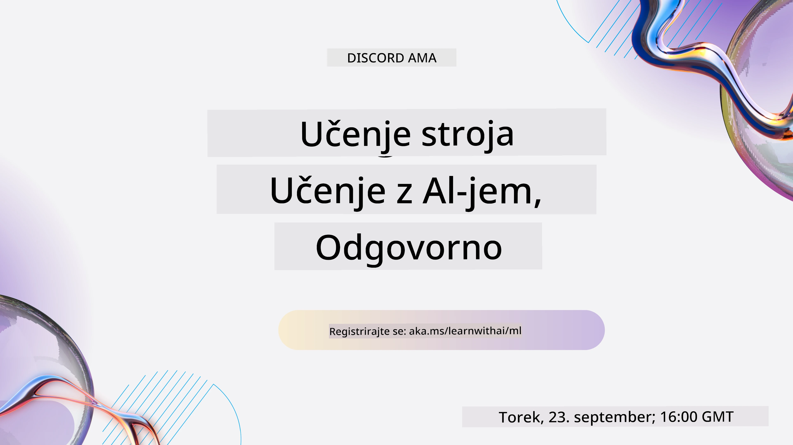
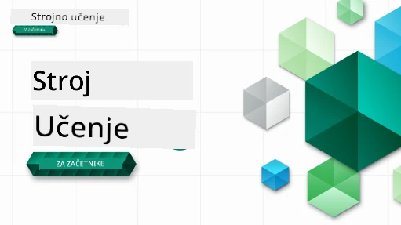

[](https://github.com/microsoft/ML-For-Beginners/blob/master/LICENSE)
[](https://GitHub.com/microsoft/ML-For-Beginners/graphs/contributors/)
[](https://GitHub.com/microsoft/ML-For-Beginners/issues/)
[](https://GitHub.com/microsoft/ML-For-Beginners/pulls/)
[](http://makeapullrequest.com)

[](https://GitHub.com/microsoft/ML-For-Beginners/watchers/)
[](https://GitHub.com/microsoft/ML-For-Beginners/network/)
[](https://GitHub.com/microsoft/ML-For-Beginners/stargazers/)

### 🌐 Podpora za več jezikov

#### Podprto preko GitHub Action (avtomatizirano in vedno posodobljeno)

<!-- CO-OP TRANSLATOR LANGUAGES TABLE START -->
[Arabic](../ar/README.md) | [Bengali](../bn/README.md) | [Bulgarian](../bg/README.md) | [Burmese (Myanmar)](../my/README.md) | [Chinese (Simplified)](../zh-CN/README.md) | [Chinese (Traditional, Hong Kong)](../zh-HK/README.md) | [Chinese (Traditional, Macau)](../zh-MO/README.md) | [Chinese (Traditional, Taiwan)](../zh-TW/README.md) | [Croatian](../hr/README.md) | [Czech](../cs/README.md) | [Danish](../da/README.md) | [Dutch](../nl/README.md) | [Estonian](../et/README.md) | [Finnish](../fi/README.md) | [French](../fr/README.md) | [German](../de/README.md) | [Greek](../el/README.md) | [Hebrew](../he/README.md) | [Hindi](../hi/README.md) | [Hungarian](../hu/README.md) | [Indonesian](../id/README.md) | [Italian](../it/README.md) | [Japanese](../ja/README.md) | [Kannada](../kn/README.md) | [Khmer](../km/README.md) | [Korean](../ko/README.md) | [Lithuanian](../lt/README.md) | [Malay](../ms/README.md) | [Malayalam](../ml/README.md) | [Marathi](../mr/README.md) | [Nepali](../ne/README.md) | [Nigerian Pidgin](../pcm/README.md) | [Norwegian](../no/README.md) | [Persian (Farsi)](../fa/README.md) | [Polish](../pl/README.md) | [Portuguese (Brazil)](../pt-BR/README.md) | [Portuguese (Portugal)](../pt-PT/README.md) | [Punjabi (Gurmukhi)](../pa/README.md) | [Romanian](../ro/README.md) | [Russian](../ru/README.md) | [Serbian (Cyrillic)](../sr/README.md) | [Slovak](../sk/README.md) | [Slovenian](./README.md) | [Spanish](../es/README.md) | [Swahili](../sw/README.md) | [Swedish](../sv/README.md) | [Tagalog (Filipino)](../tl/README.md) | [Tamil](../ta/README.md) | [Telugu](../te/README.md) | [Thai](../th/README.md) | [Turkish](../tr/README.md) | [Ukrainian](../uk/README.md) | [Urdu](../ur/README.md) | [Vietnamese](../vi/README.md)

> **Raje lokalno klonirate?**
>
> Ta repozitorij vsebuje prevode v več kot 50 jezikih, kar znatno poveča velikost prenosa. Če želite klonirati brez prevodov, uporabite sparse checkout:
>
> **Bash / macOS / Linux:**
> ```bash
> git clone --filter=blob:none --sparse https://github.com/microsoft/ML-For-Beginners.git
> cd ML-For-Beginners
> git sparse-checkout set --no-cone '/*' '!translations' '!translated_images'
> ```
>
> **CMD (Windows):**
> ```cmd
> git clone --filter=blob:none --sparse https://github.com/microsoft/ML-For-Beginners.git
> cd ML-For-Beginners
> git sparse-checkout set --no-cone "/*" "!translations" "!translated_images"
> ```
>
> Tako pridobite vse, kar potrebujete za dokončanje tečaja, z veliko hitrejšim prenosom.
<!-- CO-OP TRANSLATOR LANGUAGES TABLE END -->

#### Pridružite se naši skupnosti

[](https://discord.gg/nTYy5BXMWG)

V okviru serije Discord learn with AI poteka učenje z umetno inteligenco, izveste več in se nam pridružite na [Learn with AI Series](https://aka.ms/learnwithai/discord) od 18. do 30. septembra 2025. Dobili boste nasvete in trike za uporabo GitHub Copilot za podatkovno znanost.



# Strojno učenje za začetnike - učni načrt

> 🌍 Potujte po svetu, medtem ko raziskujemo strojno učenje skozi svetovne kulture 🌍

Microsoftovi zagovorniki oblaka z veseljem ponujajo 12-tedenski, 26-lekcijski učni načrt, ki se osredotoča na **strojno učenje**. V tem učnem načrtu boste spoznali tisto, kar imenujemo **klasično strojno učenje**, kjer se večinoma uporablja knjižnica Scikit-learn, medtem ko globoko učenje pokrivamo v našem [učnem načrtu AI for Beginners](https://aka.ms/ai4beginners). Te lekcije lahko združite tudi z našim [učnim načrtom Data Science for Beginners](https://aka.ms/ds4beginners)!

Potujte z nami po svetu, medtem ko klasične tehnike uporabljamo na podatkih iz različnih svetovnih področij. Vsaka lekcija vključuje pred- in po-lekcijske kvize, pisna navodila za dokončanje lekcije, rešitev, naloge in še več. Naša pedagoška zasnova, ki temelji na projektih, vam omogoča učenje skozi ustvarjanje, kar je dokazano učinkovit način za utrjevanje novih znanj.

**✍️ Iskrena hvala našim avtorjem** Jen Looper, Stephen Howell, Francesca Lazzeri, Tomomi Imura, Cassie Breviu, Dmitry Soshnikov, Chris Noring, Anirban Mukherjee, Ornella Altunyan, Ruth Yakubu in Amy Boyd

**🎨 Zahvale tudi našim ilustratorjem** Tomomi Imura, Dasani Madipalli in Jen Looper

**🙏 Posebna zahvala 🙏 našim Microsoft Student Ambassador avtorjem, recenzentom in prispevkarjem vsebine**, zlasti Rishit Dagli, Muhammad Sakib Khan Inan, Rohan Raj, Alexandru Petrescu, Abhishek Jaiswal, Nawrin Tabassum, Ioan Samuila in Snigdha Agarwal

**🤩 Dodatna hvala Microsoft Student Ambassadors Eric Wanjau, Jasleen Sondhi in Vidushi Gupta za naše lekcije v R!**

# Začetek

Sledite tem korakom:
1. **Razvejajte repozitorij**: Kliknite gumb "Fork" v zgornjem desnem kotu te strani.
2. **Klonirajte repozitorij**: `git clone https://github.com/microsoft/ML-For-Beginners.git`

> 💡 **Hiter začetek:** Želite začeti v brskalniku brez nastavitve Pythona lokalno? Uporabite [GitHub Codespaces](https://github.com/features/codespaces) za ustvarjanje oblačnega razvojnega okolja za vaš fork. Odprite zelen meni **Code**, izberite **Codespaces** in ustvarite codespace; po potrebi namestite potrebne odvisnosti za posamezne lekcije.

> [vse dodatne vire za ta tečaj najdete v naši zbirki Microsoft Learn](https://learn.microsoft.com/en-us/collections/qrqzamz1nn2wx3?WT.mc_id=academic-77952-bethanycheum)

> 🔧 **Potrebujete pomoč?** Preverite naš [Vodnik za odpravljanje težav](TROUBLESHOOTING.md) za rešitve pogostih problemov z namestitvijo, nastavitvijo in izvajanjem lekcij.


**[Študenti](https://aka.ms/student-page)**, za uporabo tega učnega načrta razvejajte celoten repozitorij v svoj GitHub račun in rešitve naredite sami ali v skupini:

- Začnite s predpredavanjem kvizom.
- Preberite predavanje in dokončajte aktivnosti, občasno ustavite in premislite ob vsakem preverjanju znanja.
- Poskusite ustvariti projekte sami s pomočjo razumevanja lekcij, ne samo z izvajanjem kode rešitve; koda rešitve je na voljo v mapah `/solution` v vsakem lekcijskem modulu, usmerjenem v projekte.
- Opravite kviz po predavanju.
- Dokončajte izziv.
- Dokončajte domačo nalogo.
- Po zaključku skupine lekcij obiščite [Discussion Board](https://github.com/microsoft/ML-For-Beginners/discussions) in "učite se na glas", tako da izpolnite ustrezno PAT lestvico. 'PAT' pomeni Orodje za ocenjevanje napredka, ki ga izpolnite za poglobitev učenja. Prav tako lahko reagirate na PAT-e drugih, da se skupaj učimo.

> Za nadaljnje študijsko gradivo priporočamo spremljanje teh modulov in učnih poti na [Microsoft Learn](https://docs.microsoft.com/en-us/users/jenlooper-2911/collections/k7o7tg1gp306q4?WT.mc_id=academic-77952-leestott).

**Učitelji**, vključili smo [nekaj predlogov](for-teachers.md), kako uporabljati ta učni načrt.

---

## Video predstavitve

Nekatere lekcije so na voljo kot kratki videi. Vse jih lahko najdete vključene v lekcije ali na [ML for Beginners seznamu predvajanja na YouTube kanalu Microsoft Developer](https://aka.ms/ml-beginners-videos) s klikom na spodnjo sliko.

[](https://aka.ms/ml-beginners-videos)

---

## Spoznajte ekipo

[](https://youtu.be/Tj1XWrDSYJU)

**Gif avtor:** [Mohit Jaisal](https://linkedin.com/in/mohitjaisal)

> 🎥 Kliknite zgornjo sliko za video o projektu in ljudeh, ki so ga ustvarili!

---

## Pedagogika

Izbrali smo dva pedagoška principa pri gradnji tega učnega načrta: zagotoviti, da je praktično **na projektih osnovano** in da vključuje **pogoste kvize**. Poleg tega ima ta učni načrt skupno **temo** za kohezivnost.

Z zagotavljanjem, da je vsebina usklajena s projekti, je postopek bolj zanimiv za študente in izboljša se ohranjanje konceptov. Nizek vložek kviza pred predavanjem postavi namen študenta za učenje teme, medtem ko drugi kviz po predavanju zagotovi dodatno ohranitev znanja. Ta učni načrt je zasnovan kot prilagodljiv in zabaven ter ga lahko opravite v celoti ali delno. Projekti se začnejo majhni in postopoma postanejo bolj kompleksni do konca 12-tedenskega cikla. Ta učni načrt vključuje tudi dodatno poglavje o praktičnih aplikacijah strojnega učenja, ki ga lahko uporabite kot dodatno oceno ali kot osnovo za razpravo.

> Najdete naš [Kodeks ravnanja](CODE_OF_CONDUCT.md), [Prispevamo](CONTRIBUTING.md), [Prevodi](..) in [Odpravljanje težav](TROUBLESHOOTING.md) smernice. Veselimo se vaših konstruktivnih povratnih informacij!

## Vsaka lekcija vključuje

- neobvezen skicirni zapisek
- neobvezen dopolnjujoči video
- video predstavitev (samo pri nekaterih lekcijah)
- [pripravni kviz pred predavanjem](https://ff-quizzes.netlify.app/en/ml/)
- pisno predavanje
- pri lekcijah na osnovi projektov vodiči korak za korakom, kako zgraditi projekt
- preverjanja znanja
- izziv
- dopolnilno branje
- domača naloga
- [kviz po predavanju](https://ff-quizzes.netlify.app/en/ml/)

> **Opomba o jezikih**: Te lekcije so večinoma napisane v Pythonu, vendar je veliko tudi v R. Za dokončanje R lekcije pojdite v mapo `/solution` in poiščite R lekcije. Vsebujejo .rmd pripono, ki predstavlja **R Markdown** datoteko, kar lahko enostavno definiramo kot vdelavo `kodnih blokov` (v R ali drugih jezikih) in `YAML glave` (ki vodi oblikovanje izhodov, kot je PDF) v `Markdown dokument`. Zato je to odlična avtorska platforma za podatkovno znanost, ker omogoča združevanje vaše kode, izhoda in misli, saj jih lahko zapisujete v Markdown. Poleg tega je mogoče dokumente R Markdown pretvoriti v izhodne formate, kot so PDF, HTML ali Word.

> **Opomba o kvizih**: Vsi kvizi so v [mapi Quiz App](../../quiz-app), skupno 52 kvizov, vsak s tremi vprašanji. Povezani so znotraj lekcij, vendar lahko quiz app zaženete lokalno; sledite navodilom v mapi `quiz-app` za lokalno gostovanje ali namestitev v Azure.

| Številka lekcije |                             Tema                              |                   Skupina lekcij                   | Cilji učenja                                                                                                             |                                                              Povezana lekcija                                                               |                        Avtor                        |
| :-----------: | :------------------------------------------------------------: | :-------------------------------------------------: | ------------------------------------------------------------------------------------------------------------------------------- | :--------------------------------------------------------------------------------------------------------------------------------------: | :--------------------------------------------------: |
|      01       |                Uvod v strojno učenje                          |      [Introduction](1-Introduction/README.md)       | Spoznajte osnovne pojme strojnega učenja                                                                                         |                                             [Lesson](1-Introduction/1-intro-to-ML/README.md)                                             |                       Muhammad                       |
|      02       |                Zgodovina strojnega učenja                     |      [Introduction](1-Introduction/README.md)       | Spoznajte zgodovino tega področja                                                                                                |                                            [Lesson](1-Introduction/2-history-of-ML/README.md)                                            |                     Jen and Amy                      |
|      03       |                 Pravičnost in strojno učenje                  |      [Introduction](1-Introduction/README.md)       | Kateri so pomembni filozofski vidiki pravičnosti, ki jih morajo študenti upoštevati pri gradnji in uporabi ML modelov?             |                                              [Lesson](1-Introduction/3-fairness/README.md)                                               |                        Tomomi                        |
|      04       |                Tehnike za strojno učenje                      |      [Introduction](1-Introduction/README.md)       | Katere tehnike uporabljajo raziskovalci ML za gradnjo ML modelov?                                                               |                                          [Lesson](1-Introduction/4-techniques-of-ML/README.md)                                           |                    Chris and Jen                     |
|      05       |                   Uvod v regresijo                            |        [Regression](2-Regression/README.md)         | Začnite z uporabo Pythona in Scikit-learn za regresijske modele                                                                 |         [Python](2-Regression/1-Tools/README.md) • [R](../../2-Regression/1-Tools/solution/R/lesson_1.html)         |      Jen • Eric Wanjau       |
|      06       |                Cene buč v Severni Ameriki 🎃                  |        [Regression](2-Regression/README.md)         | Vizualizirajte in očistite podatke v pripravi za ML                                                                              |          [Python](2-Regression/2-Data/README.md) • [R](../../2-Regression/2-Data/solution/R/lesson_2.html)          |      Jen • Eric Wanjau       |
|      07       |                Cene buč v Severni Ameriki 🎃                  |        [Regression](2-Regression/README.md)         | Izgradite linearne in polinomske regresijske modele                                                                             |        [Python](2-Regression/3-Linear/README.md) • [R](../../2-Regression/3-Linear/solution/R/lesson_3.html)        |      Jen and Dmitry • Eric Wanjau       |
|      08       |                Cene buč v Severni Ameriki 🎃                  |        [Regression](2-Regression/README.md)         | Izgradite logistični regresijski model                                                                                           |     [Python](2-Regression/4-Logistic/README.md) • [R](../../2-Regression/4-Logistic/solution/R/lesson_4.html)      |      Jen • Eric Wanjau       |
|      09       |                          Spletna aplikacija 🔌                |           [Web App](3-Web-App/README.md)            | Izdelajte spletno aplikacijo za uporabo vašega naučenega modela                                                                 |                                                 [Python](3-Web-App/1-Web-App/README.md)                                                  |                         Jen                          |
|      10       |                 Uvod v klasifikacijo                         |    [Classification](4-Classification/README.md)     | Očistite, pripravite in vizualizirajte podatke; uvod v klasifikacijo                                                            | [Python](4-Classification/1-Introduction/README.md) • [R](../../4-Classification/1-Introduction/solution/R/lesson_10.html)  | Jen and Cassie • Eric Wanjau |
|      11       |             Slastne azijske in indijske kuhinje 🍜            |    [Classification](4-Classification/README.md)     | Uvod v klasifikatorje                                                                                                           | [Python](4-Classification/2-Classifiers-1/README.md) • [R](../../4-Classification/2-Classifiers-1/solution/R/lesson_11.html) | Jen and Cassie • Eric Wanjau |
|      12       |             Slastne azijske in indijske kuhinje 🍜            |    [Classification](4-Classification/README.md)     | Več klasifikatorjev                                                                                                             | [Python](4-Classification/3-Classifiers-2/README.md) • [R](../../4-Classification/3-Classifiers-2/solution/R/lesson_12.html) | Jen and Cassie • Eric Wanjau |
|      13       |             Slastne azijske in indijske kuhinje 🍜            |    [Classification](4-Classification/README.md)     | Izdelajte priporočilno spletno aplikacijo s svojim modelom                                                                        |                                              [Python](4-Classification/4-Applied/README.md)                                              |                         Jen                          |
|      14       |                   Uvod v grozdenje                           |        [Clustering](5-Clustering/README.md)         | Očistite, pripravite in vizualizirajte podatke; uvod v grozdenje                                                                |         [Python](5-Clustering/1-Visualize/README.md) • [R](../../5-Clustering/1-Visualize/solution/R/lesson_14.html)         |      Jen • Eric Wanjau       |
|      15       |              Raziskovanje nigerijskih glasbenih okusov 🎧      |        [Clustering](5-Clustering/README.md)         | Raziskujte metodo grozdenja K-sredin                                                                                           |           [Python](5-Clustering/2-K-Means/README.md) • [R](../../5-Clustering/2-K-Means/solution/R/lesson_15.html)           |      Jen • Eric Wanjau       |
|      16       |        Uvod v obdelavo naravnega jezika ☕️                   |   [Natural language processing](6-NLP/README.md)    | Naučite se osnov NLP s izdelavo preprostega bota                                                                                |                                             [Python](6-NLP/1-Introduction-to-NLP/README.md)                                              |                       Stephen                        |
|      17       |                      Pogoste naloge NLP ☕️                   |   [Natural language processing](6-NLP/README.md)    | Poglobite svoje znanje NLP z razumevanjem pogostih nalog pri delu z jezikovnimi strukturami                                     |                                                    [Python](6-NLP/2-Tasks/README.md)                                                     |                       Stephen                        |
|      18       |             Prevodi in analiza čustev ♥️                      |   [Natural language processing](6-NLP/README.md)    | Prevodi in analiza čustev z Jane Austen                                                                                         |                                            [Python](6-NLP/3-Translation-Sentiment/README.md)                                             |                       Stephen                        |
|      19       |                  Romantični hoteli Evrope ♥️                  |   [Natural language processing](6-NLP/README.md)    | Analiza čustev z ocenami hotelov 1                                                                                              |                                               [Python](6-NLP/4-Hotel-Reviews-1/README.md)                                                |                       Stephen                        |
|      20       |                  Romantični hoteli Evrope ♥️                  |   [Natural language processing](6-NLP/README.md)    | Analiza čustev z ocenami hotelov 2                                                                                              |                                               [Python](6-NLP/5-Hotel-Reviews-2/README.md)                                                |                       Stephen                        |
|      21       |            Uvod v napovedovanje časovnih vrst                  |        [Time series](7-TimeSeries/README.md)        | Uvod v napovedovanje časovnih vrst                                                                                            |                                             [Python](7-TimeSeries/1-Introduction/README.md)                                              |                      Francesca                       |
|      22       | ⚡️ Svetovna poraba energije ⚡️ - napovedovanje časovnih vrst z ARIMA |        [Time series](7-TimeSeries/README.md)        | Napovedovanje časovnih vrst z ARIMA                                                                                            |                                                 [Python](7-TimeSeries/2-ARIMA/README.md)                                                 |                      Francesca                       |
|      23       |  ⚡️ Svetovna poraba energije ⚡️ - napovedovanje časovnih vrst z SVR  |        [Time series](7-TimeSeries/README.md)        | Napovedovanje časovnih vrst s podporno vektorsko regresijo                                                                      |                                                  [Python](7-TimeSeries/3-SVR/README.md)                                                  |                       Anirban                        |
|      24       |             Uvod v učenje s krepitvijo                         | [Reinforcement learning](8-Reinforcement/README.md) | Uvod v učenje s krepitvijo s Q-læringom                                                                                        |                                             [Python](8-Reinforcement/1-QLearning/README.md)                                              |                        Dmitry                        |
|      25       |                 Pomagajte Petru, da se izogne volku! 🐺       | [Reinforcement learning](8-Reinforcement/README.md) | Učenje s krepitvijo v Gymu                                                                                                     |                                                [Python](8-Reinforcement/2-Gym/README.md)                                                 |                        Dmitry                        |
|  Postscript   |            Praktični scenariji in uporabe ML                   |      [ML in the Wild](9-Real-World/README.md)       | Zanimive in razkrivajoče praktične uporabe klasičnega ML                                                                         |                                             [Lesson](9-Real-World/1-Applications/README.md)                                              |                         Team                         |
|  Postscript   |            Odpravljanje napak v modelih ML z uporabo RAI nadzorne plošče            |      [ML in the Wild](9-Real-World/README.md)       | Odpravljanje napak v strojnih učnih modelih z uporabo komponent nadzorne plošče Responsible AI                                   |                                             [Lesson](9-Real-World/2-Debugging-ML-Models/README.md)                                              |                     Ruth Yakubu                      |

> [poiščite vse dodatne vire za ta tečaj v naši zbirki Microsoft Learn](https://learn.microsoft.com/en-us/collections/qrqzamz1nn2wx3?WT.mc_id=academic-77952-bethanycheum)

## Dostop brez povezave

To dokumentacijo lahko uporabljate brez povezave z [Docsify](https://docsify.js.org/#/). Naredite fork tega repozitorija, [namestite Docsify](https://docsify.js.org/#/quickstart) na vaš lokalni računalnik in nato v korenski mapi tega repozitorija zaženite `docsify serve`. Spletna stran bo na voljo na vratih 3000 na vašem lokalnem gostitelju: `localhost:3000`.

## PDF-ji

Najdete pdf učnega načrta z povezavami [tukaj](https://microsoft.github.io/ML-For-Beginners/pdf/readme.pdf).


## 🎒 Drugi tečaji

Naša ekipa pripravlja tudi druge tečaje! Oglejte si:

<!-- CO-OP TRANSLATOR OTHER COURSES START -->
### LangChain
[](https://aka.ms/langchain4j-for-beginners)
[](https://aka.ms/langchainjs-for-beginners?WT.mc_id=m365-94501-dwahlin)
[](https://github.com/microsoft/langchain-for-beginners?WT.mc_id=m365-94501-dwahlin)
---

### Azure / Edge / MCP / Agentje
[](https://github.com/microsoft/AZD-for-beginners?WT.mc_id=academic-105485-koreyst)
[](https://github.com/microsoft/edgeai-for-beginners?WT.mc_id=academic-105485-koreyst)
[](https://github.com/microsoft/mcp-for-beginners?WT.mc_id=academic-105485-koreyst)
[](https://github.com/microsoft/ai-agents-for-beginners?WT.mc_id=academic-105485-koreyst)

---
 
### Serija o generativni umetni inteligenci
[](https://github.com/microsoft/generative-ai-for-beginners?WT.mc_id=academic-105485-koreyst)
[-9333EA?style=for-the-badge&labelColor=E5E7EB&color=9333EA)](https://github.com/microsoft/Generative-AI-for-beginners-dotnet?WT.mc_id=academic-105485-koreyst)
[-C084FC?style=for-the-badge&labelColor=E5E7EB&color=C084FC)](https://github.com/microsoft/generative-ai-for-beginners-java?WT.mc_id=academic-105485-koreyst)
[-E879F9?style=for-the-badge&labelColor=E5E7EB&color=E879F9)](https://github.com/microsoft/generative-ai-with-javascript?WT.mc_id=academic-105485-koreyst)

---
 
### Osnove učenja
[](https://aka.ms/ml-beginners?WT.mc_id=academic-105485-koreyst)
[](https://aka.ms/datascience-beginners?WT.mc_id=academic-105485-koreyst)
[](https://aka.ms/ai-beginners?WT.mc_id=academic-105485-koreyst)
[](https://github.com/microsoft/Security-101?WT.mc_id=academic-96948-sayoung)
[](https://aka.ms/webdev-beginners?WT.mc_id=academic-105485-koreyst)
[](https://aka.ms/iot-beginners?WT.mc_id=academic-105485-koreyst)
[](https://github.com/microsoft/xr-development-for-beginners?WT.mc_id=academic-105485-koreyst)

---
 
### Serija Copilot
[](https://aka.ms/GitHubCopilotAI?WT.mc_id=academic-105485-koreyst)
[](https://github.com/microsoft/mastering-github-copilot-for-dotnet-csharp-developers?WT.mc_id=academic-105485-koreyst)
[](https://github.com/microsoft/CopilotAdventures?WT.mc_id=academic-105485-koreyst)
<!-- CO-OP TRANSLATOR OTHER COURSES END -->

## Pridobivanje pomoči

Če se zataknete ali imate vprašanja med učenjem strojnega učenja ali gradnjo AI aplikacij, ne skrbite — pomoč je na voljo.

Pridružite se lahko razpravam z drugimi udeleženci in razvijalci, postavljate vprašanja in delite svoje ideje z skupnostjo.

- Pridružite se skupnosti, da postavljate vprašanja in se učite z drugimi
- Razpravljajte o konceptih strojnega učenja in idejah projektov
- Pridobite usmeritve izkušenih razvijalcev

Podporna skupnost je odličen način za razvoj vaših veščin in hitrejše reševanje problemov.

[Microsoft Foundry Discord skupnost](https://discord.gg/nTYy5BXMWG)

Če naletite na napake, hrošče ali imate predloge za izboljšave, lahko v tem repozitoriju odprete **Issue** za poročanje o težavi.

Za povratne informacije o izdelku ali iskanje obstoječih prispevkov v skupnosti obiščite razvijalski forum:

[](https://aka.ms/foundry/forum)

## Dodatni nasveti za učenje

- Po vsaki lekciji preglejte zapiske za boljše razumevanje.
- Vadite samostojno izvajanje algoritmov.
- Raziskujte realne podatkovne zbirke z uporabo naučenih konceptov.

---

<!-- CO-OP TRANSLATOR DISCLAIMER START -->
**Omejitev odgovornosti**:
Ta dokument je bil preveden z uporabo AI prevajalske storitve [Co-op Translator](https://github.com/Azure/co-op-translator). Čeprav si prizadevamo za natančnost, vas prosimo, da upoštevate, da avtomatizirani prevodi lahko vsebujejo napake ali netočnosti. Izvirni dokument v njegovem izvirnem jeziku je treba obravnavati kot avtoritativni vir. Za kritične informacije je priporočljiv strokovni človeški prevod. Ne odgovarjamo za morebitna nesporazume ali napačne interpretacije, ki izhajajo iz uporabe tega prevoda.
<!-- CO-OP TRANSLATOR DISCLAIMER END -->