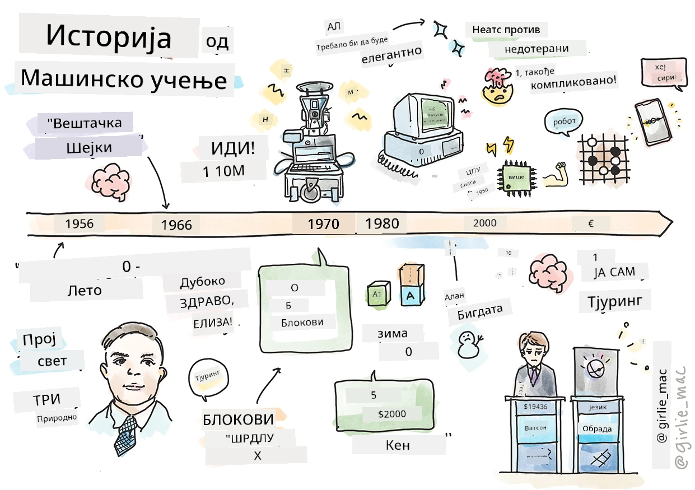
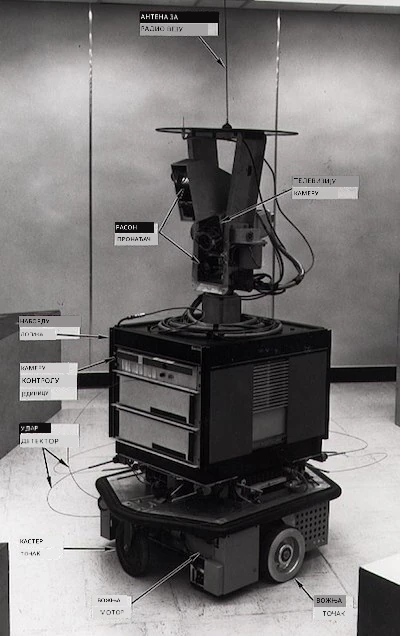
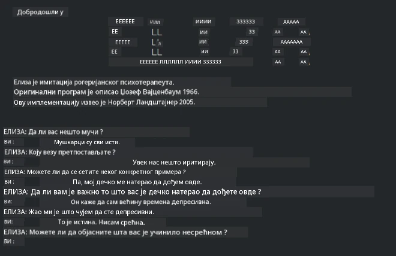

# Историја машинског учења

> Скечнот од [Томоми Имуре](https://www.twitter.com/girlie_mac)

## [Претквиз предавања](https://ff-quizzes.netlify.app/en/ml/)

---

> 🎥 Кликните на слику изнад за кратак видео који пролази кроз ову лекцију.

У овој лекцији ћемо проћи кроз главне прекретнице у историји машинског учења и вештачке интелигенције.

Историја вештачке интелигенције (ВИ) као области је испреплетана са историјом машинског учења, јер су алгоритми и напредак у рачунарству који стоје иза МУ допринели развоју ВИ. Корисно је запамтити да, иако су се ове области као посебне дисциплине почеле кристализовати 1950-их, важна [алгоритамска, статистичка, математичка, рачунарска и техничка открића](https://wikipedia.org/wiki/Timeline_of_machine_learning) претходила су и преклапала са овим периодом. Заправо, људи су размишљали о овим питањима [стотинама година](https://wikipedia.org/wiki/History_of_artificial_intelligence): овај чланак разматра историјске интелектуалне основе идеје „машине која мисли.”

---
## Значајна открића

- 1763, 1812 [Бајесова теорема](https://wikipedia.org/wiki/Bayes%27_theorem) и њени претходници. Ова теорема и њена примена лежи у основи инференције, описујући вероватноћу догађаја на основу претходног знања.
- 1805 [Теорија најмањих квадрата](https://wikipedia.org/wiki/Least_squares) од француског математичара Адријен-Мари Лежандра. Ова теорија, коју ћете научити у јединици регресије, помаже у прилагођавању података.
- 1913 [Марковљеви ланци](https://wikipedia.org/wiki/Markov_chain), названи по руском математичару Андреју Маркову, користе се за описивање низа могућих догађаја на основу претходног стања.
- 1957 [Перцептрон](https://wikipedia.org/wiki/Perceptron) је врста линеарног класификатора који је изумео амерички психолог Френк Розенблат и лежи у основи напретка дубоког учења.

---

- 1967 [Најближи сусед](https://wikipedia.org/wiki/Nearest_neighbor) је алгоритам изворно дизајниран за мапирање рута. У контексту машинског учења користи се за детекцију образаца.
- 1970 [Повратна пропагација](https://wikipedia.org/wiki/Backpropagation) се користи за тренирање [фидфорвард неуралних мрежа](https://wikipedia.org/wiki/Feedforward_neural_network).
- 1982 [Рекурентне неуралне мреже](https://wikipedia.org/wiki/Recurrent_neural_network) су вештачке неуралне мреже изведене из фидфорвард неуралних мрежа које креирају временске графове.

✅ Урадите мало истраживање. Који други датуми истичу као пресудни у историји МУ и ВИ?

---
## 1950: Машине које мисле

Алан Тјуринг, заиста изузетна личност која је [по гласовима јавности 2019.](https://wikipedia.org/wiki/Icons:_The_Greatest_Person_of_the_20th_Century) проглашена за највећег научника 20. века, заслужан је за полагање темеља концепту „машине која може да мисли.“ Он се суочавао с критикама и потребом за емпиријским доказима овог концепта делом кроз стварање [Тјуринговог теста](https://www.bbc.com/news/technology-18475646), који ћете проучавати у нашим лекцијама о обради природног језика.

---
## 1956: Летњи истраживачки пројекат у Дартмуту

„Летњи истраживачки пројекат у Дартмуту о вештачкој интелигенцији био је значајан догађај за ВИ као област,“ и баш тамо је скован термин 'вештачка интелигенција' ([извор](https://250.dartmouth.edu/highlights/artificial-intelligence-ai-coined-dartmouth)).

> Сваки аспект учења или било која друга особина интелигенције може у принципу бити тако прецизно описана да машина може бити направљена да то симулира.

---

Главни истраживач, професор математике Џон Меккарти, надао се „да ће се поступати на основу претпоставке да сваки аспект учења или било која друга особина интелигенције може у принципу бити тако прецизно описана да се машина може направити да то симулира.“ Учесници су укључивали још једног великана у области, Марвина Минског.

Радеоница је препозната као покретач и охрабрење за неколико дискусија укључујући „успон симболичких метода, система усмерених на ограничене домене (рани експертски системи) и дедуктивних система у односу на индуктивне системе.“ ([извор](https://wikipedia.org/wiki/Dartmouth_workshop)).

---
## 1956 - 1974: „Златна доба“

Од 1950-их до средине '70-их, оптимизам је био велик у нади да ће ВИ решити многе проблеме. 1967. године Марвин Мински је сигурно изјавио да „унутар једне генерације... проблем стварања 'вештачке интелигенције' биће у великој мери решен.“ (Мински, Марвин (1967), Computation: Finite and Infinite Machines, Englewood Cliffs, N.J.: Prentice-Hall)

Истраживање обраде природног језика је цветао, претрага је унапређена и постала моћнија, а концепт „микро-светова“ је креиран, где су једноставни задаци извршавани коришћењем језичких упута.

---

Истраживања су била добро финансирана од стране владиних агенција, направљени су напредци у рачунању и алгоритмима, а прототипови интелигентних машина су изграђени. Неке од ових машина укључују:

* [Shakey робота](https://wikipedia.org/wiki/Shakey_the_robot), који је могао да се креће и одлучује како да изврши задаци „интелигентно“.

    
    > Shakey 1972. године

---

* Елиза, рани „чатбот“, могла је да разговара са људима и да делује као примитивни „терапеут“. Више ћете сазнати о Елизи у лекцијама о обради природног језика.

    
    > Верзија Елизе, чатбот

---

* „Свет блокова“ био је пример микро-света где су блокови могли да се слажу и сортирају, а експерименти у учењу машина да праве одлуке могли су да се тестирају. Напредак изграђен са библиотекама као што је [SHRDLU](https://wikipedia.org/wiki/SHRDLU) помогао је унапређење обраде језика.

    

    > 🎥 Кликните на слику изнад за видео: Свет блокова са SHRDLU

---
## 1974 - 1980: „Зима ВИ“

Средином 1970-их постало је јасно да је сложеност прављења „интелигентних машина“ потцењена и да је обећање, с обзиром на расположиву рачунску снагу, било прецењено. Финансирање је пресушило и поверење у област се успорило. Нека питања која су утицала на поверење укључују:
---
- **Ограничења**. Рачунска снага је била сувише ограничена.
- **Комбинаторна експлозија**. Број параметара које је требало тренирати растао је експоненцијално како су од рачунара захтевани сложенији задаци, без паралелне еволуције рачунске снаге и капацитета.
- **Недостатак података**. Недостатак података је отежавао процес тестирања, развоја и усавршавања алгоритама.
- **Да ли постављамо права питања?**. Саме постављене питања су започела сумњу. Истраживачи су почели да примају критике о својим приступима:
  - Тјурингови тестови су доведени у питање, између осталог, теоријом „кинеске собе“ која је тврдилa да „програмирање дигиталног рачунара може учинити да изгледа као да разуме језик, али не може произвести стварно разумевање.“ ([извор](https://plato.stanford.edu/entries/chinese-room/))
  - Изазвани су етички изазови увођења вештачких интелигенција као што је „терапеут“ ЕЛИЗА у друштво.

---

У исто време, формирале су се различите школе мишљења у вези са ВИ. Успостављена је дихотомија између пракси ["неуредна" и "уредна ВИ"](https://wikipedia.org/wiki/Neats_and_scruffies). _Неуредни_ лабораторији су сати уређивали програме док нису добили жељене резултате. _Уредне_ лабораторије су се „фокусирале на логику и формално решавање проблема“. ЕЛИЗА и SHRDLU су били добро познати _неуредни_ системи. Током 1980-их, како је захтев за репродуцирањем МУ система растао, _уредни_ приступ је постепено преузимао примат јер су његови резултати биле јасније објашњиви.

---
## 1980-те: Експертски системи

Како је област расло, корист за пословање је постала јаснија, а током 1980-их и ширење „експертских система“. „Експертски системи били су међу првим стварно успешним облицима софтвера вештачке интелигенције (ВИ).“ ([извор](https://wikipedia.org/wiki/Expert_system)).

Овај тип система је заправо _хибридан_, састоји се делимично од правила пословне логике и инферентног механизма који користи ова правила за извођење нових закључака.

У овом периоду је такође повећана пажња на неуралне мреже.

---
## 1987 - 1993: „Охлађење“ ВИ

Ширење специјализованог хардвера за експертске системе имало је несрећан ефекат сувише велике специјализације. Појавом персоналних рачунара почела је конкуренција великим, специјализованим, централизованим системима. Демократизација рачунарства је започела и на крају отворила пут за модерни експлозију великих података.

---
## 1993 - 2011

Ова епоха је донела нову фазу у којој су МУ и ВИ могли да реше неке од раније насталих проблема због недостатка података и рачунске снаге. Количина података почела је брзо да расте и постаје доступнија, на боље и лоше, посебно уз појаву паметних телефона око 2007. Рачунска снага експоненцијално је расла, а алгоритми су се развијали уз њу. Област је почела да сазрева како су рани, неформални дани почели да се кристалишу у праву дисциплину.

---
## Сада

Данас машинско учење и вештачка интелигенција додирују скоро све аспекте наших живота. Ова ера захтева пажљиво разумевање ризика и потенцијалних утицаја ових алгоритама на људске животе. Како је изјавио Брад Смит из Мајкрософта, „Информационе технологије постављају питања која дотичу основна права као што су приватност и слобода изражавања. Та питања повећавају одговорност технолошких компанија које стварају ове производе. По нашем мишљењу, такође позивају на промишљену регулативу владе и развој норми о прихватљивим коришћењима“ ([извор](https://www.technologyreview.com/2019/12/18/102365/the-future-of-ais-impact-on-society/)).

---

Остаје да се види шта будућност доноси, али важно је разумети ове рачунарске системе и софтвер и алгоритме који их покрећу. Надамо се да ће овај курикулум помоћи да стекнете боље разумевање како бисте сами могли да донесете одлуку.

> 🎥 Кликните на слику изнад за видео: Јан ЛеКун говори о историји дубоког учења у овој лекцији

---
## 🚀Изазов

Упустите се у неки од ових историјских тренутака и сазнајте више о људима иза њих. Постоје фасцинантне личности, а ниједно научно откриће није настало у културном вакууму. Шта откривате?

## [Постквиз предавања](https://ff-quizzes.netlify.app/en/ml/)

---
## Преглед и Самостално учење

Ево ствари које треба погледати и послушати:

[Овај подкаст у коме Ејми Бојд разматра еволуцију ВИ](http://runasradio.com/Shows/Show/739)

---

## Задатак

[Креирајте временску линију](assignment.md)

---

<!-- CO-OP TRANSLATOR DISCLAIMER START -->
**Изјава о одрицању одговорности**:
Овај документ је преведен коришћењем услуге за аутоматски превод [Co-op Translator](https://github.com/Azure/co-op-translator). Иако тежимо тачности, имајте у виду да аутоматски преводи могу садржати грешке или нетачности. Оригинални документ на његовом изворном језику треба сматрати ауторитативним извором. За критичне информације препоручује се професионални људски превод. Нисмо одговорни за било каква неспоразума или погрешна тумачења која произилазе из коришћења овог превода.
<!-- CO-OP TRANSLATOR DISCLAIMER END -->