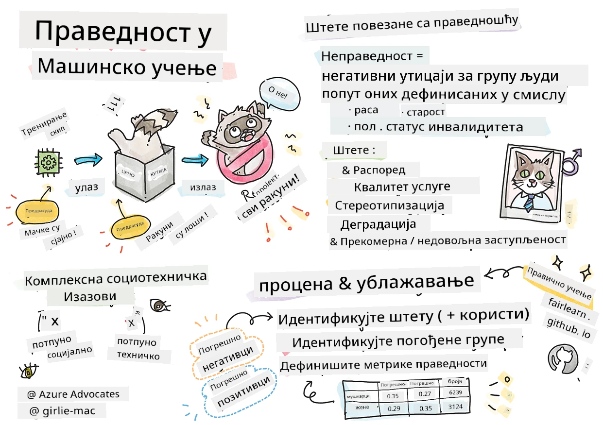

# Прављење решења машинског учења са одговорним AI-јем
 

> Скетчнот од [Tomomi Imura](https://www.twitter.com/girlie_mac)

## [Квиз пре предавања](https://ff-quizzes.netlify.app/en/ml/)
 
## Увод

У овом курикулуму почећете да откривате како машинско учење може и утиче на наше свакодневне животе. Већ сада, системи и модели учествују у свакодневним задацима доношења одлука, као што су дијагнозе у здравству, одобрења за кредите или откривање превара. Због тога је важно да ти модели добро функционишу како би обезбедили резултате којима се може веровати. Као и било која софтверска апликација, AI системи могу испасти испод очекивања или имати непожељан исход. Зато је суштински важно бити у стању да разумемо и објаснимо понашање AI модела.

Замислите шта се може десити када подаци које користите за прављење ових модела недостају одређене демографије, као што су раса, пол, политички став, религија или када непропорционално представљају те демографије. Шта ако се резултат модела тумачи тако да фаворизује неку демографску групу? Која је последица за апликацију? Поред тога, шта се дешава када модел има неповољан исход и штети људима? Ко је одговоран за понашање AI система? Ово су нека од питања која ћемо истражити у овом курсу.

У овом часу ћете:

- Подићи свест о значају правде у машинском учењу и штетама повезаним са неправдом.
- Упознати се са праксом испитивања одступања и необичних сценарија ради осигурања поузданости и безбедности.
- Степеновати разумевање о потреби оснаживања свих дизајнирањем инклузивних система.
- Истражити колико је важно заштитити приватност и безбедност података и људи.
- Увидети значај приступа "прозирне кутије" за објашњење понашања AI модела.
- Бити свестан колико је одговорност важна за изградњу поверења у AI системе.

## Предзнање

Као предуслов, молимо вас да прођете „Принципе одговорног AI-ја“ преко Learn Path-а и погледате видео испод о теми:

Сазнајте више о Одговорном AI-ју пратећи овај [Learn Path](https://docs.microsoft.com/learn/modules/responsible-ai-principles/?WT.mc_id=academic-77952-leestott)

> 🎥 Кликните на слику горе за видео: Приступ Microsoft-a одговорном AI-ју

## Праведност

AI системи треба да све третирају праведно и избегавају да утичу на сличне групе људи на различите начине. На пример, када AI системи дају смернице о медицинском лечењу, захтевима за кредитима или запошљавању, они треба да дају исте препоруке свима са сличним симптомима, финансијским околностима или професионалним квалификацијама. Сваки од нас као човек носи заједничке предрасуде које утичу на наше одлуке и поступке. Ове предрасуде могу бити видљиве у подацима које користимо за тренирање AI система. Таква манипулација понекад се догађа ненамерно. Често је тешко свесно знати када уводите пристрасност у податке.

**„Неправедност“** обухвата негативне утицаје или „штете“ за групу људи, као што су оне дефинисане у смислу расе, пола, старости или инвалидитета. Главне штете повезане са правдом могу се класификовати као:

- **Расподела**, ако се, на пример, фаворизује пол или етницитет у односу на друге.
- **Квалитет услуге**. Ако тренирате податке за одређени сценарио, а стварност је много сложенија, то доводи до лоших перформанси услуге. На пример, диспенсер за сапун који није могао да препозна људе са тамнијом кожом. [Референца](https://gizmodo.com/why-cant-this-soap-dispenser-identify-dark-skin-1797931773)
- **Понижавање**. Неправедно критиковање и етикетирање нечега или некога. На пример, технологија за означавање слика је погрешно означавала слике тамнопутих људи као гориле.
- **Прекомерна или недовољна заступљеност**. Идеја је да одређена група није видљива у одређеним професијама, а свака услуга или функција која то наставља да промовише доприноси штети.
- **Стереотипизација**. Повезивање одређене групе са унапред додељеним особинама. На пример, систем за превођење између енглеског и турског може имати нетачности због речи које имају стереотипне асоцијације са полом.

> превод на турски

> повратни превод на енглески

При дизајнирању и тестирању AI система, требало би да обезбедимо да је AI праведан и да није програмиран да доноси пристрасне или дискриминаторске одлуке, што је и људима забрањено. Обезбеђивање правде у AI и машинском учењу остаје сложен социотехнички изазов.

### Поузданост и безбедност

Да би се изградило поверење, AI системи морају бити поуздани, безбедни и доследни у нормалним и неочекиваним условима. Важно је знати како ће се AI системи понашати у различитим ситуацијама, посебно када су у питању одступања. При прављењу AI решења, мора се посветити значајна пажња како се носити са широким спектром околности са којима се AI решења могу сусрести. На пример, аутономни аутомобил мора ставити безбедност људи на прво место. Као резултат тога, AI који покреће аутомобил мора узети у обзир све могуће сценарије са којима се возило може суочити, као што су ноћ, олује или снежне мећаве, деца која трче преко улице, кућни љубимци, радови на путу итд. Колико добро AI систем може поуздано и сигурно да се носи са широким спектром услова одражава ниво предвиђања који је стручњак за податке или AI развојач узео у обзир током дизајна или тестирања система.

> [🎥 Кликните овде за видео: ](https://www.microsoft.com/videoplayer/embed/RE4vvIl)

### Инклузивност

AI системи треба да буду дизајнирани да укључе и оснаже све људе. При дизајнирању и имплементацији AI система, стручњаци за податке и AI развојачи идентификују и уклањају потенцијалне препреке у систему које непланирано могу искључити људе. На пример, у свету има милијарду људи са инвалидитетом. Са напретком у AI-ју, они могу лакше приступити широком спектру информација и прилика у свакодневном животу. Уклањањем препрека стварају се могућности за иновације и развој AI производа са бољим искуствима која користе свима.

> [🎥 Кликните овде за видео: инклузивност у AI-ју](https://www.microsoft.com/videoplayer/embed/RE4vl9v)

### Безбедност и приватност

AI системи треба да буду безбедни и да поштују приватност људи. Људи имају мање поверења у системе који стављају њихову приватност, информације или животе у ризик. При тренирању модела машинског учења ослањамо се на податке да произведемо најбоље резултате. При томе морамо узети у обзир порекло података и њихов интегритет. На пример, да ли су подаци унели корисници или су јавно доступни? Даље, приликом рада са подацима, кључно је развити AI системе који могу заштитити поверљиве информације и одољети нападима. Како AI постаје све заступљенији, заштита приватности и обезбеђивање важних личних и пословних информација постају све критичнији и сложенији. Питања приватности и безбедности података захтевају посебну пажњу у AI-ју јер је приступ подацима неопходан за то да AI системи праве прецизне и добро информисане предикције и одлуке о људима.

> [🎥 Кликните овде за видео: безбедност у AI-ју](https://www.microsoft.com/videoplayer/embed/RE4voJF)

- Као индустрија, направили смо значајан напредак у области приватности и безбедности, подстакнут регулацијама као што је GDPR (Општа уредба о заштити података).
- Међутим, код AI система морамо признати тензију између потребе за више личних података како би системи били персонализованији и ефикаснији – и приватности.
- Као и са рађањем повезаних рачунара са интернетом, такође се бележи велики пораст безбедносних проблема повезаних са AI-јем.
- Истовремено смо видели да се AI употребљава за побољшање безбедности. На пример, већина модерних антивирусних скенера данас користи AI хеуристике.
- Морамо осигурати да наши процеси Data Science хармонично спајају најновије праксе у области приватности и безбедности.

### Транспарентност
AI системи треба да буду разумљиви. Кључни део транспарентности је објашњавање понашања AI система и њихових компоненти. Побољшање разумевања AI система захтева да заинтересоване стране разумеју како и зашто функционишу тако да могу идентификовати потенцијалне проблеме у перформансама, безбедносне и приватносне забринутости, пристрасности, искључиве праксе или нежељене исходе. Такође верујемо да они који користе AI системе треба да буду искрени и отворени о томе када, зашто и како их бирају да примене. Као и о ограничењима система које користе. На пример, ако банка користи AI систем за подршку у одлучивању о потрошачким кредитима, важно је испитати исходе и разумети који подаци утичу на препоруке система. Владе почињу да регулишу AI у различитим индустријама, па стручњаци за податке и организације морају објаснити да ли AI систем испуњава регулаторне захтеве, посебно када постоји непожељан исход.

> [🎥 Кликните овде за видео: транспарентност у AI-ју](https://www.microsoft.com/videoplayer/embed/RE4voJF)

- Пошто су AI системи веома сложени, тешко је разумети како функционишу и тумачити резултате.
- Овај недостатак разумевања утиче на начин на који се ти системи управљају, оперативно изводе и документују.
- Овај недостаци у разумевању највише утиче на одлуке донете на основу резултата које ти системи производе.

### Одговорност
 
Људи који дизајнирају и примењују AI системе морају бити одговорни за то како њихови системи функционишу. Потреба за одговорношћу је посебно важна код осетљивих технологија као што је препознавање лица. Недавно, забележена је растућа потражња за технологијом препознавања лица, нарочито од организација за спровођење закона које виде потенцијал технологије за примене као што је проналажење нестале деце. Међутим, те технологије би могле потенцијално бити коришћене од стране владе за угрозу основних слобода грађана, на пример, омогућавајући континуирани надзор одређених појединаца. Стога стручњаци за податке и организације морају бити одговорни за то како њихов AI систем утиче на појединце или друштво.

> 🎥 Кликните на слику горе за видео: Упозорења о масовном надзору преко препознавања лица

На крају, једно од највећих питања за нашу генерацију, као прву генерацију која уводи AI у друштво, јесте како обезбедити да рачунари остану одговорни људима и како обезбедити да људи који дизајнирају рачунаре остану одговорни свима осталима.

## Процена утицаја

Пре тренирања модела машинског учења, важно је спровести процену утицаја да бисте разумели сврху AI система; која је намењена употреба; где ће бити премештен; и ко ће комуницирати са системом. Ово је корисно за рецензенте или тестере који оцењују систем да знају које факторе треба узети у обзир при идентификовању потенцијалних ризика и очекиваних последица.

Следећа су подручја фокусирања при извођењу процене утицаја:

* **Негативан утицај на појединце**. Будите свесни било каквих ограничења или захтева, неприкладне употребе или познатих ограничења која коче перформансе система, што је важно да се осигура да систем неће бити употребљен на начин који може нанети штету појединцима.
* **Захтеви за податке**. Разумевање како и где ће систем користити податке омогућава рецензентима да испитају све захтеве за податке о којима треба водити рачуна (нпр., GDPR или HIPAA регулативе о подацима). Такође, проверите да ли су извор или количина података довољни за тренирање.
* **Сажетак утицаја**. Прикупите листу потенцијалних штета које могу настати коришћењем система. Током целог ML животног циклуса прегледајте да ли су идентификовани проблеми ублажени или решени.
* **Примениљиви циљеви** за сваких шест основних принципа. Процените да ли су циљеви сваког од принципа постигнути и да ли постоје било какви недостаци.

## Отклањање грешака уз одговорни AI

Слично као и отклањање грешака у софтверској апликацији, отклањање грешака у AI систему је нужан процес идентификовања и решавања проблема у систему. Постоји много фактора који могу утицати на то да модел не функционише према очекивањима или одговорно. Већина традиционалних метрика перформанси модела су квантитативна агрегатна мера укупних перформанси модела, што није довољно за анализу како модел крши принципе одговорног AI-ја. Штавише, модел машинског учења је црна кутија која отежава разумевање шта покреће његов исход или пружање објашњења када направи грешку. Касније у овом курсу научићемо како користити Одговорни AI контролни панел за помоћ при отклањању грешака у AI системима. Контролни панел пружа холистички алат за стручњаке за податке и AI развојаче да изврше:

* **Анализу грешака**. Да идентификују расподелу грешака у моделу која може утицати на праведност или поузданост система.
* **Преглед модела**. Да открију где постоје разлике у перформансама модела по кохортама података.
* **Анализу података**. Да разумеју расподелу података и идентификују потенцијалну пристрасност која може довести до проблема са праведношћу, инклузивношћу и поузданошћу.
* **Интерпретабилност модела**. Да разумеју шта утиче на предвиђања модела. Ово помаже у објашњењу понашања модела, што је важно за транспарентност и одговорност.

## 🚀 Изазов
 
Да бисмо спречили увођење штета у првом реду, требало би да:

- имамо разноликост порекла и перспектива међу људима који раде на системима
- улажемо у скупе података које одражавају разноликост нашег друштва
- развијамо боље методе кроз цео животни циклус машинског учења за откривање и исправљање одговорног AI-ја када се појави

Размислите о стварним животним ситуацијама где је непоузданост модела очигледна у изградњи и коришћењу модела. Шта још треба узети у обзир?

## [Квиз после предавања](https://ff-quizzes.netlify.app/en/ml/)

## Преглед и самостални рад
 

У овој лекцији сте научили неке основе концепата правичности и неправичности у машинском учењу.  
 
Погледајте овај радионицу да бисте дубље спознали теме: 

- У потрази за одговорном вештачком интелигенцијом: Преношење принципа у праксу од Бесмире Нуши, Мехрнуш Самеки и Амита Шарме

> 🎥 Кликните на слику изнад за видео: RAI Toolbox: Отворени оквир за изградњу одговорне вештачке интелигенције од Бесмире Нуши, Мехрнуш Самеки и Амита Шарме

Такође прочитајте: 

- Microsoft-ов центар ресурса за одговорну вештачку интелигенцију: [Responsible AI Resources – Microsoft AI](https://www.microsoft.com/ai/responsible-ai-resources?activetab=pivot1%3aprimaryr4) 

- Microsoft-ова FATE истраживачка група: [FATE: Правичност, одговорност, транспарентност и етика у AI - Microsoft Research](https://www.microsoft.com/research/theme/fate/) 

RAI Toolbox: 

- [GitHub репозиторијум Responsible AI Toolbox](https://github.com/microsoft/responsible-ai-toolbox)

Прочитајте о алатима Azure Machine Learning за обезбеђивање правичности:

- [Azure Machine Learning](https://docs.microsoft.com/azure/machine-learning/concept-fairness-ml?WT.mc_id=academic-77952-leestott) 

## Задаци

[Истражите RAI Toolbox](assignment.md)

---

<!-- CO-OP TRANSLATOR DISCLAIMER START -->
**Изјава о одрицању одговорности**:
Овај документ је преведен коришћењем услуге за аутоматски превод [Co-op Translator](https://github.com/Azure/co-op-translator). Иако тежимо тачности, имајте у виду да аутоматски преводи могу садржати грешке или нетачности. Оригинални документ на његовом изворном језику треба сматрати ауторитативним извором. За критичне информације препоручује се професионални људски превод. Нисмо одговорни за било каква неспоразума или погрешна тумачења која произилазе из коришћења овог превода.
<!-- CO-OP TRANSLATOR DISCLAIMER END -->