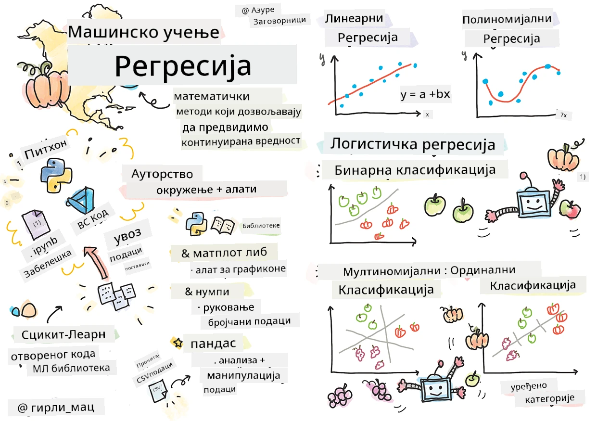
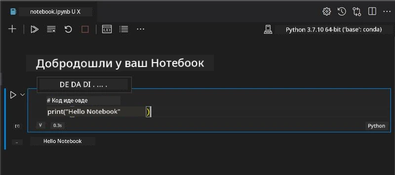
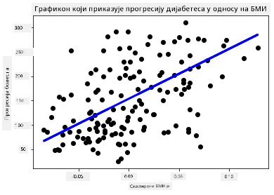

# Започните са Python-ом и Scikit-learn-ом за регресионе моделе



> Скецкноут аутора [Томоми Имура](https://www.twitter.com/girlie_mac)

## [Квиз пре предавања](https://ff-quizzes.netlify.app/en/ml/)

> ### [Овај час је доступан и у R-у!](../../../../2-Regression/1-Tools/solution/R/lesson_1.html)

## Увод

У ова четири часа ћете открити како да градите регресионе моделе. Ускоро ћемо разговарати чему они служе. Али пре него што започнете било шта, уверите се да имате исправне алате спремне за почетак процеса!

У овом часу ћете научити како да:

- Конфигуришете свој рачунар за локалне задатке машинског учења.
- Радите са Јупитер бележницама.
- Користите Scikit-learn, укључујући инсталацију.
- Истражите линеарну регресију кроз практичну вежбу.

## Инсталације и конфигурације

[](https://youtu.be/-DfeD2k2Kj0 "ML за почетнике - Подесите алате спремне за изградњу модела машинског учења")

> 🎥 Кликните на слику изнад за кратак видео у коме ћете видети како да конфигуришете рачунар за МЛ.

1. **Инсталирајте Python**. Уверите се да је [Python](https://www.python.org/downloads/) инсталиран на вашем рачунару. Python ћете користити за многе задатке у науци о подацима и машинском учењу. Већина рачунарских система већ има инсталиран Python. Такође постоје корисни [Python кодинг пакети](https://code.visualstudio.com/learn/educators/installers?WT.mc_id=academic-77952-leestott) који олакшавају подешавање за неке кориснике.

   Међутим, неке примене Pythona захтевају једну верзију софтвера, док друге користе другу верзију. Због тога је корисно радити у оквиру [виртуелног окружења](https://docs.python.org/3/library/venv.html).

2. **Инсталирајте Visual Studio Code**. Уверите се да имате Visual Studio Code инсталиран на вашем рачунару. Пратите ове инструкције да бисте [инсталирали Visual Studio Code](https://code.visualstudio.com/) за основну инсталацију. У овом курсу ћете користити Python у Visual Studio Code-у, па можда желите да се упознате са тим како да [конфигуришете Visual Studio Code](https://docs.microsoft.com/learn/modules/python-install-vscode?WT.mc_id=academic-77952-leestott) за Python развој.

   > Уживајте у раду са Python-ом тако што ћете прорадити ову збирку [Learn модула](https://docs.microsoft.com/users/jenlooper-2911/collections/mp1pagggd5qrq7?WT.mc_id=academic-77952-leestott)
   >
   > [](https://youtu.be/yyQM70vi7V8 "Подеси Python са Visual Studio Code")
   >
   > 🎥 Кликните на слику изнад за видео: коришћење Python-а унутар VS Code.

3. **Инсталирајте Scikit-learn**, пратећи [ове инструкције](https://scikit-learn.org/stable/install.html). Пошто морате да будете сигурни да користите Python 3, препоручује се коришћење виртуелног окружења. Напомена, ако инсталирате ову библиотеку на M1 Mac компјутер, на страници везаном изнад има посебних упутстава.

1. **Инсталирајте Jupyter Notebook**. Биће вам потребно да [инсталирате Jupyter пакет](https://pypi.org/project/jupyter/).

## Ваш ауторски ML окружење

Користићете **бележнице** за развој свог Python кода и креирање модела машинског учења. Овај тип фајла је уобичајени алат за научнике података, а може се препознати по наставку или екстензији `.ipynb`.

Бележнице су интерактивно окружење које омогућава програмеру да и пише код и додаје белешке и документацију око кода, што је веома корисно за експерименталне или истраживачке пројекте.

[](https://youtu.be/7E-jC8FLA2E "ML за почетнике - Подеси Jupyter бележнице за почетак изградње регресионх модела")

> 🎥 Кликните на слику изнад за кратак видео који води кроз ову вежбу.

### Вежба - рад са бележницом

У овом директоријуму ћете пронаћи фајл _notebook.ipynb_.

1. Отворите _notebook.ipynb_ у Visual Studio Code-у.

   Јупитер сервер ће се покренути са Python 3+ верзијом. У бележници ћете пронаћи области које се могу `run`-овати, односно комаде кода. Код блок можете покренути тако што ћете изабрати иконицу која изгледа као дугме за репродукцију.

1. Изаберите `md` иконицу и додајте мало markdown-а, са следећим текстом **# Добродошли у вашу бележницу**.

   Затим додајте неки Python код.

1. Откуцајте **print('hello notebook')** у блок кода.
1. Изаберите стрелицу да покренете код.

   Требало би да видите исписану изјаву:

    ```output
    hello notebook
    ```



Код можете пројектирати коментарима како бисте документовали бележницу.

✅ Размислите на тренутак колико је радно окружење веб програмера различито у односу на окружење научника података.

## Покретање са Scikit-learn-ом

Сада када је Python подешен у вашем локалном окружењу, и када сте удобни са Јупитер бележницама, хајде да се упознамо са Scikit-learn-ом ( изговара се `сај` као у `сајенс`). Scikit-learn пружа [обиман API](https://scikit-learn.org/stable/modules/classes.html#api-ref) који вам помаже да извршавате МЛ задатке.

Према њиховом [сајту](https://scikit-learn.org/stable/getting_started.html), "Scikit-learn је отворена библиотека за машинско учење која подржава надзирано и ненадзирано учење. Такође пружа различите алате за подешавање модела, претходну обраду података, избор модела и процену, као и многе друге корисне функције."

У овом курсу ћете користити Scikit-learn и друге алате за изградњу модела машинског учења за извођење онога што зовемо 'традиционални машински задаци'. Намерно смо избегли неуралне мреже и дубоко учење, јер ће они бити боље покривени у нашем предстојећем курикулуму 'AI за почетнике'.

Scikit-learn олакшава изградњу модела и њихову процену за коришћење. Првенствено је фокусиран на коришћење нумеричких података и садржи неколико већ припремљених скупова података који се могу користити као алати за учење. Такође укључује и унапред изграђене моделе које студенти могу испробати. Прво ћемо истражити процес учитавања пакованих података и коришћење уграђених естиматора првог МЛ модела са Scikit-learn-ом са основним подацима.

## Вежба - ваша прва Scikit-learn бележница

> Овај туторијал је инспирисан [примером линеарне регресије](https://scikit-learn.org/stable/auto_examples/linear_model/plot_ols.html#sphx-glr-auto-examples-linear-model-plot-ols-py) на Scikit-learn сајту.


[](https://youtu.be/2xkXL5EUpS0 "ML за почетнике - Ваш први пројекат линеарне регресије у Python-у")

> 🎥 Кликните на слику изнад за кратак видео који вас води кроз ову вежбу.

У фајлу _notebook.ipynb_ везаном за овај час очистите све ћелије притиском на икону 'канте за смеће'.

У овом делу радићете са малим скупом података о дијабетесу који је уграђен у Scikit-learn у сврху учења. Замислите да желите да тестирате терапију за дијабетичаре. Модели машинског учења могу вам помоћи да одредите који пацијенти би боље реаговали на лечење, на основу комбинација променљивих. Чак и веома базичан регресијски модел, када се визуализује, може показати информације о променљивим које би вам помогле да организујете своја теоријска клиничка испитивања.

✅ Постоје многе врсте регресионх метода, а коју ћете изабрати зависи од питања на које тражите одговор. Ако желите да предвидите вероватну висину особе одређеног узраста, користили бисте линеарну регресију, јер тражите **нумеричку вредност**. Ако сте заинтересовани да сазнате да ли би врста кухиње требало да се сматра веганском или не, тражите **категоријску припадност**, па бисте користили логистичку регресију. Више ћете научити о логистичкој регресији касније. Размислите мало о питањима која можете поставити подацима и која од ових метода би била примеренија.

Хајде да започнемо овај задатак.

### Увоз библиотека

За овај задатак увешћемо неке библиотеке:

- **matplotlib**. Корисан је [алат за графиконе](https://matplotlib.org/) и користићемо га за прављење линеарног графика.
- **numpy**. [numpy](https://numpy.org/doc/stable/user/whatisnumpy.html) је корисна библиотека за рад са нумеричким подацима у Python-у.
- **sklearn**. Ово је библиотека [Scikit-learn](https://scikit-learn.org/stable/user_guide.html).

Увезите неке библиотеке које ће вам помоћи у задацима.

1. Додајте увозе тако што ћете откуцати следећи код:

   ```python
   import matplotlib.pyplot as plt
   import numpy as np
   from sklearn import datasets, linear_model, model_selection
   ```

   Изнад увозите `matplotlib`, `numpy` и увозите `datasets`, `linear_model` и `model_selection` из `sklearn`. `model_selection` се користи за подељивање података на тренинг и тест сетове.

### Скуп података о дијабетесу

Уграђени [дијабетес скуп података](https://scikit-learn.org/stable/datasets/toy_dataset.html#diabetes-dataset) укључује 442 узорка података о дијабетесу, са 10 променљивих карактеристика, неке од којих су:

- age: година старости
- bmi: индекс телесне масе
- bp: просечни крвни притисак
- s1 tc: Т ћелије (врста белих крвних зрнаца)

✅ Овај скуп података укључује појам 'пол' као променљиву карактеристику важну за истраживања у вези дијабетеса. Многи медицински скупови података укључују ову врсту бинарне класификације. Размислите мало о томе како такве категоризације могу искључити одређене делове популације из лечења.

Сада учитајте податке X и y.

> 🎓 Запамтите, ово је надзирано учење и треба нам именовани 'y' циљ.

У новој ћелији кода учитајте дијабетес скуп података позивањем `load_diabetes()`. Улаз `return_X_y=True` сигнализира да ће `X` бити матрица података, а `y` циљ регресије.

1. Додајте неке команде штампе да бисте приказали облик матрице података и њен први елемент:

    ```python
    X, y = datasets.load_diabetes(return_X_y=True)
    print(X.shape)
    print(X[0])
    ```

    Оно што добијате као одговор је кортеж. Додељујете прве две вредности кортежа `X` и `y` респективно. Сазнајте више [о кортежима](https://wikipedia.org/wiki/Tuple).

    Можете видети да ови подаци имају 442 ставке у облику низова од 10 елемената:

    ```text
    (442, 10)
    [ 0.03807591  0.05068012  0.06169621  0.02187235 -0.0442235  -0.03482076
    -0.04340085 -0.00259226  0.01990842 -0.01764613]
    ```

    ✅ Размислите мало о односу између података и циљне променљиве регресије. Линеарна регресија предвиђа односе између карактеристика X и циљне променљиве y. Можете ли пронаћи [циљ](https://scikit-learn.org/stable/datasets/toy_dataset.html#diabetes-dataset) за скуп дијабетес података у документацији? Шта овај скуп података демонстрира, с обзиром на тај циљ?

2. Затим изаберите део овог скупа података за приказ тако што ћете изабрати 3. колону скупа података. То можете урадити коришћењем оператора `:` да изаберете све редове, па онда изаберите 3. колону индексирану са (2). Такође можете променити облик података у 2Д низ - како је потребно за график - коришћењем `reshape(n_rows, n_columns)`. Ако је један од параметара -1, одговарајућа димензија се аутоматски израчунава.

   ```python
   X = X[:, 2]
   X = X.reshape((-1,1))
   ```

   ✅ У сваком тренутку испишите податке да проверите њихов облик.

3. Сада када имате податке спремне за цртање, можете видети да ли машина може помоћи у одређивању логичне поделе између бројева у овом скупу података. Да бисте то урадили, потребно је да поделите и податке (X) и циљ (y) на тест и тренинг скупове података. Scikit-learn има једноставан начин да то уради; можете поделити тест податке у одређеној тачки.

   ```python
   X_train, X_test, y_train, y_test = model_selection.train_test_split(X, y, test_size=0.33)
   ```

4. Сада сте спремни да обучите свој модел! Учитајте линеарни регресијски модел и обучите га са svojim X и y тренинг скуповима коришћењем `model.fit()`:

    ```python
    model = linear_model.LinearRegression()
    model.fit(X_train, y_train)
    ```

    ✅ `model.fit()` је функција коју ћете видети у многим МЛ библиотекама као што је TensorFlow

5. Затим направите предвиђање користећи тест податке, користећи функцију `predict()`. Ово ће се користити за цртање линије између група података

    ```python
    y_pred = model.predict(X_test)
    ```

6. Сада је време да прикажете податке на графикону. Matplotlib је врло користан алат за овај задатак. Направите расути графикон свих тест података X и y, и користите предвиђање да црта линију на најприкладнијем месту, између група података модела.

    ```python
    plt.scatter(X_test, y_test,  color='black')
    plt.plot(X_test, y_pred, color='blue', linewidth=3)
    plt.xlabel('Scaled BMIs')
    plt.ylabel('Disease Progression')
    plt.title('A Graph Plot Showing Diabetes Progression Against BMI')
    plt.show()
    ```

   


   ✅ Размислите мало о томе шта се овде дешава. Права линија пролази кроз многе мале тачке података, али шта она тачно ради? Можете ли видети како треба да користите ову линију да предвидите где би нова, непозната тачка података требало да се уклопи у односу на y осу графика? Покушајте да речима изразите практичну употребу овог модела.

Честитамо, направили сте свој први модел линеарне регресије, направили предвиђање уз њега и приказали га на графику!

---
## 🚀Изазов

Прикажите другу варијаблу из овог скупа података. Савет: уредите овај ред: `X = X[:,2]`. Узимајући у обзир циљ овог скупа података, шта сте у могућности да сазнате о напретку дијабетеса као болести?
## [Квиз након предавања](https://ff-quizzes.netlify.app/en/ml/)

## Преглед и самосталан рад

У овом туторијалу радили сте са простом линеарном регресијом, уместо са униваријантном или вишеструком линеарном регресијом. Прочитајте мало о разликама између ових метода, или погледајте [овaj видео](https://www.coursera.org/lecture/quantifying-relationships-regression-models/linear-vs-nonlinear-categorical-variables-ai2Ef)

Прочитајте више о концепту регресије и размислите о томе која питања ова техника може да одговори. Пређите овај [туторијал](https://docs.microsoft.com/learn/modules/train-evaluate-regression-models?WT.mc_id=academic-77952-leestott) да продубите своје разумевање.

## Задатак

[Други скуп података](assignment.md)

---

<!-- CO-OP TRANSLATOR DISCLAIMER START -->
**Изјава о одрицању одговорности**:
Овај документ је преведен коришћењем услуге за аутоматски превод [Co-op Translator](https://github.com/Azure/co-op-translator). Иако тежимо тачности, имајте у виду да аутоматски преводи могу садржати грешке или нетачности. Оригинални документ на његовом изворном језику треба сматрати ауторитативним извором. За критичне информације препоручује се професионални људски превод. Нисмо одговорни за било каква неспоразума или погрешна тумачења која произилазе из коришћења овог превода.
<!-- CO-OP TRANSLATOR DISCLAIMER END -->