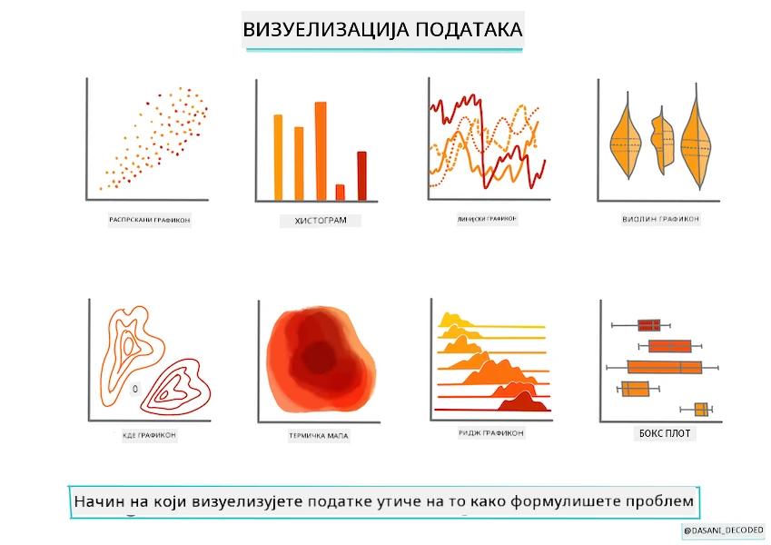
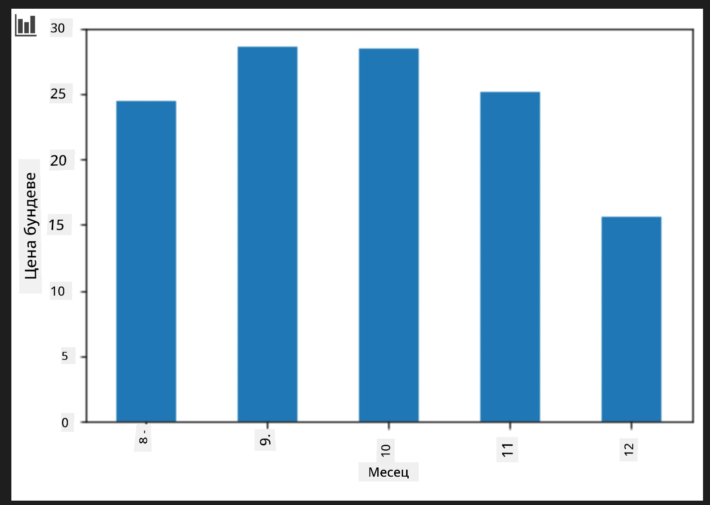
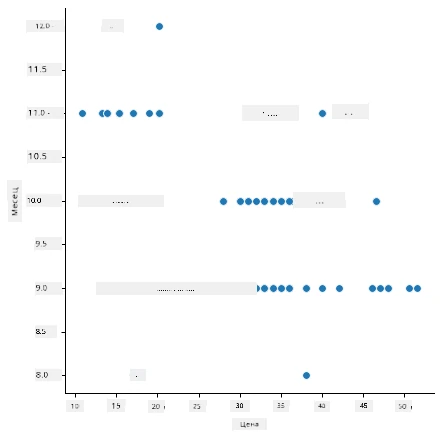
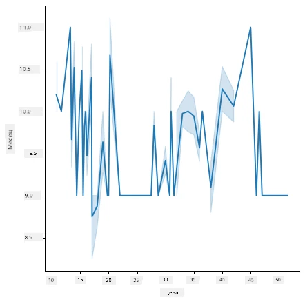
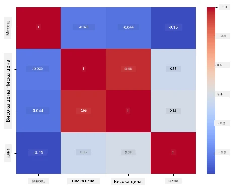

# Направите регресиону моделе користећи Scikit-learn: припремите и визуализујте податке



Инфографик аутора [Dasani Madipalli](https://twitter.com/dasani_decoded)

## [Квиз пре предавања](https://ff-quizzes.netlify.app/en/ml/)

> ### [Ова лекција је доступна и у R-у!](../../../../2-Regression/2-Data/solution/R/lesson_2.html)

## Увод

Сада када сте спремни са алатима потребним за почетак прављења модела машинског учења са Scikit-learn, спремни сте да почнете постављати питања у вези са вашим подацима. Како радите са подацима и примените МЛ решења, веома је важно разумети како поставити право питање како бисте правилно откључали потенцијале вашег скупа података.

У овој лекцији ћете научити:

- Како припремити податке за прављење модела.
- Како користити Matplotlib за визуализацију података.
- Како користити Seaborn за изражајнију визуализацију података.

## Постављање правог питања за ваше податке

Питање на које желите да добијете одговор одредиће које врсте МЛ алгоритама ћете користити. А квалитет одговора зависиће у великој мери од природе ваших података.

Погледајте [подаците](https://github.com/microsoft/ML-For-Beginners/blob/main/2-Regression/data/US-pumpkins.csv) за ову лекцију. Можете отворити овај .csv фајл у VS Code. Брзо прелиставање одмах показује да постоје празнине и микс стрингова и нумеричких података. Постоји и чудан колона „Package“ где су подаци мешавина 'врећа', 'каса' и других вредности. Податак је, у ствари, помало неред.

[](https://youtu.be/5qGjczWTrDQ "ML за почетнике - Како анализирати и очистити скуп података")

> 🎥 Кликните на слику изнад за кратак видео о припреми података за ову лекцију.

У ствари, није често да вам буде дато скуп података који је потпуно спреман за коришћење у стварању МЛ модела одмах. У овој лекцији научићете како да припремите сирови скуп података користећи стандардне Python библиотеке. Такође ћете научити различите технике за визуализацију података.

## Студија случаја: 'тржиште бундеве'

У овом фолдеру ћете пронаћи .csv фајл у основном `data` фолдеру под називом [US-pumpkins.csv](https://github.com/microsoft/ML-For-Beginners/blob/main/2-Regression/data/US-pumpkins.csv) који укључује 1757 линија података о тржишту бунава, сортираних по градовима. Ово су сирови подаци изведени из [Специјализованих извештаја терминалних тржишта ароматичног воћа и поврћа](https://www.marketnews.usda.gov/mnp/fv-report-config-step1?type=termPrice) које дистрибуира Министарство пољопривреде Сједињених Држава.

### Припрема података

Ови подаци су у јавном домену. Могу се преузети у многим посебним фајловима по градовима са USDA веб сајта. Да бисмо избегли превише посебних фајлова, конкатеновали смо све податке по градовима у једну табелу, тако да смо већ мало _припремили_ податке. Следеће, хајде да пажљивије погледамо податке.

### Податак о бундеви - рани закључци

Шта примећујете у вези са овим подацима? Већ сте видели да постоји мешавина стрингова, бројева, празних поља и чудних вредности које треба разумети.

Какво питање можете поставити овим подацима користећи регресиону технику? Шта кажете на „Предвидети цену бундеве за продају током одређеног месеца“. Поново гледајући податке, постоје неке промене које требате направити за креирање структуре података неопходне за задатак.
## Вежба - анализирајте податке о бундеви

Хајде да користимо [Pandas](https://pandas.pydata.org/) (назив значи `Python Data Analysis`), алат врло користан за обликовање података, да анализирамо и припремимо ове податке о бундеви.

### Прво, проверите да ли недостају датуми

Прво ћете морати предузети кораке да проверите да ли недостају датуми:

1. Конвертујте датуме у формат месеца (ово су амерички датуми, па је формат `MM/DD/YYYY`).
2. Извуците месец у нову колону.

Отворите фајл _notebook.ipynb_ у Visual Studio Code и увезите табелу у нови Pandas dataframe.

1. Користите функцију `head()` да бисте видели првих пет редова.

    ```python
    import pandas as pd
    pumpkins = pd.read_csv('../data/US-pumpkins.csv')
    pumpkins.head()
    ```

    ✅ Коју функцију бисте користили да видите последњих пет редова?

1. Проверите да ли у тренутном dataframe-у недостају подаци:

    ```python
    pumpkins.isnull().sum()
    ```

    Постоје недостајући подаци, али можда то неће утицати на задатак који треба решити.

1. Да бисте упростили рад са dataframe-ом, изаберите само колоне које су вам потребне, користећи `loc` функцију која извлачи из оригиналног dataframe-а групу редова (први параметар) и колона (други параметар). Израз `:` у овом случају значи „сви редови“.

    ```python
    columns_to_select = ['Package', 'Low Price', 'High Price', 'Date']
    pumpkins = pumpkins.loc[:, columns_to_select]
    ```

### Друго, одредите просечну цену бундеве

Размислите како да одредите просечну цену бундеве у одређеном месецу. Које колоне бисте изабрали за овај задатак? Наговештај: потребне су вам 3 колоне.

Решење: узмите просек колона `Low Price` и `High Price` за нову колону Цена, и конвертујте колону Датум тако да приказује само месец. Срећом, према претходној провери, нема недостајућих података за датуме или цене.

1. Да бисте израчунали просек, додајте следећи код:

    ```python
    price = (pumpkins['Low Price'] + pumpkins['High Price']) / 2

    month = pd.DatetimeIndex(pumpkins['Date']).month

    ```

   ✅ Слободно штампајте податке које желите проверавати користећи `print(month)`.

2. Сада копирајте своје конвертоване податке у нови Pandas dataframe:

    ```python
    new_pumpkins = pd.DataFrame({'Month': month, 'Package': pumpkins['Package'], 'Low Price': pumpkins['Low Price'],'High Price': pumpkins['High Price'], 'Price': price})
    ```

    Штампањем вашег dataframe-а видећете чист, уређен скуп података на коме можете да креирате нови регресиони модел.

### Али сачекајте! Има нечега чудног овде

Ако погледате колону `Package`, бундеве се продају у многим различитим конфигурацијама. Неке се продају у мерама „1 1/9 бушел“, неке у „1/2 бушел“ мерама, неке по бунди, неке по фунти, а неке у великим кутијама различитих ширина.

> Бундеве изгледају веома тешке за доследно мерење

Детаљније гледајући оригиналне податке, занимљиво је да све што има `Unit of Sale` једнако 'EACH' или 'PER BIN' има и тип `Package` по инчу, по каси, или „сваки“. Бундеве делују веома тешке за поновљиво мерење, зато их филтрирајте тако што ћете изабрати само бундеве са стрингом 'bushel' у колони `Package`.

1. Додајте филтер на врх фајла, испод увоза .csv датотеке:

    ```python
    pumpkins = pumpkins[pumpkins['Package'].str.contains('bushel', case=True, regex=True)]
    ```

    Ако сада одштампате податке, видећете да добијате само око 415 редова података који садрже бундеве по бушелу.

### Али сачекајте! Још једна ствар је потребна

Да ли сте приметили да се количина бушела разликује по реду? Потребно је нормализовати цене тако да приказујете цену по бушелу, па урадите неке математичке операције да стандардујете то.

1. Додајте ове линије после блока који креира new_pumpkins dataframe:

    ```python
    new_pumpkins.loc[new_pumpkins['Package'].str.contains('1 1/9'), 'Price'] = price/(1 + 1/9)

    new_pumpkins.loc[new_pumpkins['Package'].str.contains('1/2'), 'Price'] = price/(1/2)
    ```

✅ Према [The Spruce Eats](https://www.thespruceeats.com/how-much-is-a-bushel-1389308), тежина бушела зависи од врсте производа, јер је то мера запремине. „Бушел парадајза, на пример, треба да тежи 56 фунти... Листови и зелена салата заузимају више простора али мање теже, па бушел спанаћа има само 20 фунти.“ Све је прилично компликовано! Хајде да не мешамо конверзију бушела у фунте, већ да ценимо по бушелу. Све ово проучавање бушела бундеве показује колико је важно разумети природу ваших података!

Сада можете анализирати цене по јединици на основу њихове бушел мере. Ако још једном штампате податке, можете видети како је стандардизовано.

✅ Да ли сте приметили да су бундеве продаване по пола бушела веома скупе? Можете ли претпоставити зашто? Наговештај: мале бундеве су много скупље од великих, вероватно зато што их има много више у бушелу, с обзиром на неискоришћени простор који заузима једна велика шупља колачасто обликована бундева.

## Стратегије визуализације

Део улоге научника података је да демонстрира квалитет и природу података са којима ради. Да би то урадили, често праве занимљиве визуализације, односно графиконе, графикe и дијаграме, који приказују различите аспекте података. На овај начин, могу визуелно показати односе и празнине које су иначе тешко уочљиве.

[](https://youtu.be/SbUkxH6IJo0 "ML за почетнике - Како визуализовати податке помоћу Matplotlib")

> 🎥 Кликните на слику изнад за кратак видео о визуализацији података за ову лекцију.

Визуализације такође могу помоћи у одређивању технике машинског учења која је најприкладнија за податке. Сцаттерплот (прераспршивање тачака) који изгледа као да прати линију, на пример, указује на то да су подаци добри кандидати за линеарну регресију.

Једна библиотека за визуализацију података која добро ради у Jupyter Notebook-у је [Matplotlib](https://matplotlib.org/) (коју сте видели и у претходној лекцији).

> Стекните више искуства са визуализацијом података у [овим туторијалима](https://docs.microsoft.com/learn/modules/explore-analyze-data-with-python?WT.mc_id=academic-77952-leestott).

## Вежба - експериментишите са Matplotlib

Покушајте направити основне графиконе да бисте приказали нови dataframe који сте управо креирали. Шта би основни линијски график показао?

1. Увозите Matplotlib на врху фајла, испод увоза Pandas:

    ```python
    import matplotlib.pyplot as plt
    ```

1. Поново покрените цео notebook да га освежите.
1. На дну notebook-а додајте ћелију која приказује податке као box plot:

    ```python
    price = new_pumpkins.Price
    month = new_pumpkins.Month
    plt.scatter(price, month)
    plt.show()
    ```

    

    Да ли је ово користан графикон? Да ли вас нешто на њему изненађује?

    Није посебно користан јер све што ради је да приказује ваше податке као распршене тачке по месецу.

### Учинимо га корисним

Да бисте приказали корисне податке, обично требате некако груписати податке. Покушајмо направити графикон где y оса показује месеце, а подаци показују расподелу података.

1. Додајте ћелију за креирање груписаног bar филтрираног графикона:

    ```python
    new_pumpkins.groupby(['Month'])['Price'].mean().plot(kind='bar')
    plt.ylabel("Pumpkin Price")
    ```

    

    Ово је кориснија визуализација података! Изгледа да највиша цена за бундеве пада у септембру и октобру. Да ли вам ово одговара? Зашто или зашто не?

## Вежба - експериментишите са Seaborn

Matplotlib је моћан, али може захтевати много кода да би се направио леп графикон. [Seaborn](https://seaborn.pydata.org/) је библиотека направљена _на врху_ Matplotlib-а која је дизајнирана за статистичку визуализацију података. Ради директно са Pandas dataframe-овима, примењује атрактивне подразумеване стилове и омогућава вам да направите информативне графиконе уз много мање кода. Пошто Seaborn враћа Matplotlib објекте, и даље можете користити све што већ знате о Matplotlib за прецизно подешавање резултата.

> Ако још нисте инсталирали Seaborn, инсталирајте га командом `pip install seaborn`.

1. Увозите Seaborn на врху notebook-а, испод осталих увоза. Конвенциониално се увози као `sns`:

    ```python
    import seaborn as sns
    ```

### Сцаттерплотови за показивање односа

Велики део истраживања података пре прављења модела је тражење _односа_ између променљивих. [Сцаттерплот](https://en.wikipedia.org/wiki/Scatter_plot) је један од најбољих алата за то: ако тачке изгледају као да прате линију, могуће је да две променљиве кореспондирају, што је добар знак да линеарни регресион модели могу радити.

1. Поново направите price-to-month scatter plot од раније, овог пута користећи Seaborn-ову [`relplot()`](https://seaborn.pydata.org/generated/seaborn.relplot.html) (релациони график), који ради директно са колонама вашег dataframe-а:

    ```python
    sns.relplot(x="Price", y="Month", data=new_pumpkins)
    ```

    

    Приметите како прослеђујете _имена колона_ и dataframe, а Seaborn се брине о ознакама оса.

2. Можете променити на линијски график додавањем `kind="line"`. Seaborn чак црта засенчену област која показује интервал поверења око линије:

    ```python
    sns.relplot(x="Price", y="Month", kind="line", data=new_pumpkins)
    ```

    

    Ови подаци су прилично шумни, па линијски график није најјаснији избор овде — али приказује колико је лако променити тип графикона у Seaborn-у.

### Бар графикони за показивање расподела


Раније сте ручно груписали податке да бисте направили график са ступцима користећи Matplotlib. Seaborn-ов [`catplot()`](https://seaborn.pydata.org/generated/seaborn.catplot.html) (катарички график) може урадити груписање и агрегирање за вас. По подразумеваној вредности, `kind="bar"` приказује просек сваке категорије уз црну линију која означава интервал поверења.

1. Направите график са ступцима за просечну цену по месецу:

    ```python
    sns.catplot(x="Month", y="Price", data=new_pumpkins, kind="bar")
    ```

    

    Ово потврђује оно што сте видели са Matplotlib-ом — цене достижу врхунац око септембра и октобра — али Seaborn такође визуализује колико се цена _разликује_ у оквиру сваког месеца.

### Heatmaps за приказ корелација

Распршени графикони упоређују по две променљиве у једном тренутку. Када имате неколико нумеричких колона, [heatmap](https://en.wikipedia.org/wiki/Heat_map) вам омогућава да видите јачину везе између _сваког_ пара колона одједном. Ово је уобичајен начин да се уочи које су карактеристике највише корелиране пре избора шта ћете унети у модел (исти тип графика се касније користи за приказ матрица конфузије у класификацији).

1. Направите матрицу корелације уз помоћ Pandas-а, затим је нацртајте користећи Seaborn-ов [`heatmap()`](https://seaborn.pydata.org/generated/seaborn.heatmap.html). Опција `annot=True` исписује вредности корелације у сваком пољу:

    ```python
    correlations = new_pumpkins[['Month', 'Low Price', 'High Price', 'Price']].corr()
    sns.heatmap(correlations, annot=True, cmap="coolwarm")
    ```

    

    Вредности близу `1` (или `-1`) значе да су колоне снажно _лнијарно_ корелиране. Обратите пажњу како су `Low Price` и `High Price` скоро савршено корелирани. Са друге стране, `Month` показује само слаб линеарни однос са ценом — иако је горе приказани график са ступцима открио јасан сезонски врхунац у септембру и октобру. То је важна лекција: коефицијент корелације мери само _праволинијске_ односе, па може пропустити сезонске или друге нелинеарне обрасце. ✅ Зашто је корисно погледати како heatmap *такође* и графиконе као што је график са ступцима пре него што одлучите које колоне ћете користити?

### Matplotlib или Seaborn?

Вредни су за познавање оба:

- **Matplotlib** вам даје прецизну контролу над сваким елементом графика и представља основу на којој се граде готово све остале библиотеке за цртање у Питону.
- **Seaborn** пружа функције вишег нивоа и атрактивне подразумеване вредности за статистичке графиконе, ради директно са пандас dataframe-има, и често је бржи за експлоративну анализу података.

Уобичајени радни ток је да прво користите Seaborn да брзо истражите податке, а затим пређете на Matplotlib када треба да прилагодите детаље.

---

## 🚀Изазов

Истражите различите типове визуализације које нуде Matplotlib и Seaborn. Који су типови најприкладнији за проблеме регресије?

## [Квиз након предавања](https://ff-quizzes.netlify.app/en/ml/)

## Преглед и самостални рад

Погледајте различите начине визуализације података. Направите листу разних доступних библиотека и забележите које су најбоље за одређене типове задатака, на пример 2Д визуализације у односу на 3Д визуализације. Шта сте открили?

## Задаци

[Истраживање визуализације](assignment.md)

---

<!-- CO-OP TRANSLATOR DISCLAIMER START -->
**Изјава о одрицању одговорности**:
Овај документ је преведен коришћењем услуге за аутоматски превод [Co-op Translator](https://github.com/Azure/co-op-translator). Иако тежимо тачности, имајте у виду да аутоматски преводи могу садржати грешке или нетачности. Оригинални документ на његовом изворном језику треба сматрати ауторитативним извором. За критичне информације препоручује се професионални људски превод. Нисмо одговорни за било каква неспоразума или погрешна тумачења која произилазе из коришћења овог превода.
<!-- CO-OP TRANSLATOR DISCLAIMER END -->