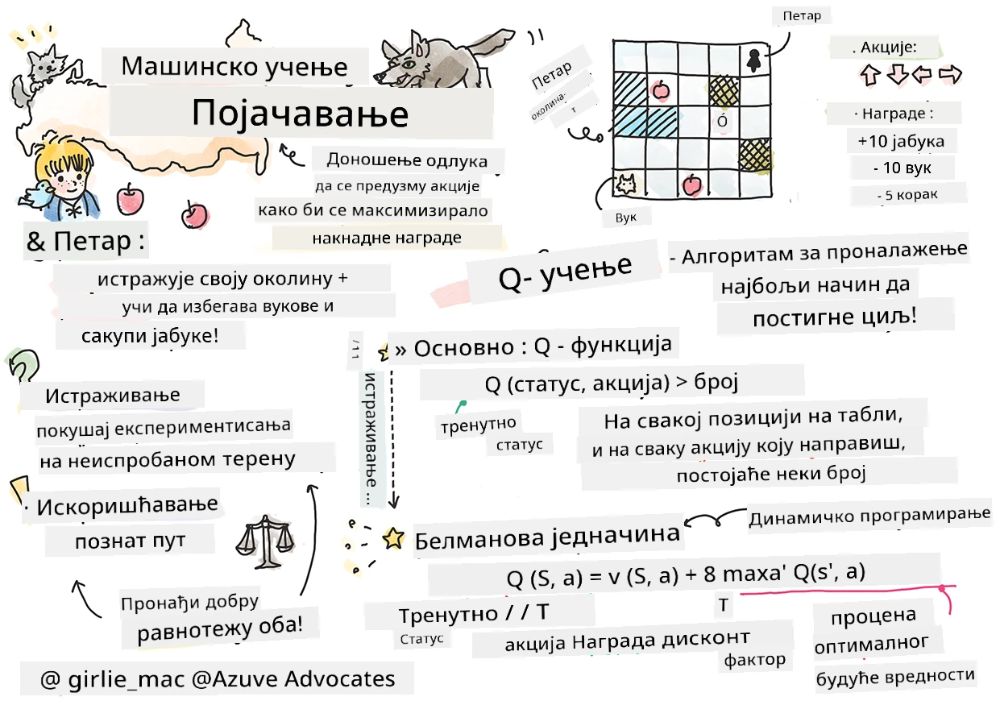

# Увод у учење појачавањем и Q-учење


> Скицнот од [Томоми Имура](https://www.twitter.com/girlie_mac)

Учење појачавањем укључује три важна појма: агент, неке стања, и скуп акција по сваком стању. Извршавањем акције у одређеном стању, агент добија награду. Опет замислите видео игру Супер Марио. Ви сте Марио, налазите се на нивоу игре, стојите поред ивице литице. Изнад вас је новчић. Ви као Марио, на нивоу игре, у одређеној позицији ... то је ваше стање. Померање корака удесно (акција) ће вас одвести преко ивице, што би вам дало низак бројчани резултат. Међутим, притискање дугмета за скок омогућило би вам да освојите поен и останете живи. То је позитиван исход и треба да вам додели позитиван бројчани резултат.

Коришћењем учења појачавањем и симулатора (игре), можете научити како да играте игру да максимализујете награду, што је останак жив и освајање што више поена.

[](https://www.youtube.com/watch?v=lDq_en8RNOo)

> 🎥 Кликните на слику изнад да бисте чули Дмитрија како говори о учењу појачавањем

## [Предквиз](https://ff-quizzes.netlify.app/en/ml/)

## Предуслови и подешавање

У овој лекцији ћемо експериментисати са неким кодом у Пајтону. Требало би да будете у могућности да покренете код из Јупитер бележнице из ове лекције, било на свом рачунару или негде у облаку.

Можете отворити [бележницу лекције](https://github.com/microsoft/ML-For-Beginners/blob/main/8-Reinforcement/1-QLearning/notebook.ipynb) и проћи кроз ову лекцију да бисте изградили.

> **Напомена:** Ако отварате овај код из облака, такође морате преузети фајл [`rlboard.py`](https://github.com/microsoft/ML-For-Beginners/blob/main/8-Reinforcement/1-QLearning/rlboard.py), који се користи у коду бележнице. Додајте га у исти директоријум као бележницу.

## Увод

У овој лекцији истражићемо свет **[Петер и Вук](https://en.wikipedia.org/wiki/Peter_and_the_Wolf)**, инспирисан музичком бајком руског композитора, [Сергеја Прокофјева](https://en.wikipedia.org/wiki/Sergei_Prokofiev). Користићемо **учење појачавањем** да омогућимо Петеру да истражује своје окружење, сакупља укусне јабуке и избегава сусрет са вуком.

**Учење појачавањем** (RL) је техника учења која нам омогућава да научимо оптимално понашање **агента** у неком **окружењу** извођењем многих експеримената. Агент у овом окружењу треба да има неки **циљ**, дефинисан кроз **функцију награде**.

## Окружење

Ради једноставности, погледајмо Петеров свет као квадратну таблу димензија `ширина` x `висина`, овако:


Свака ћелија ове табле може бити:

* **земља**, по којој Петер и друга створења могу ходати.
* **вода**, по којој очигледно не можете ходати.
* **дрво** или **трава**, место где можете одморити.
* **јабука**, која представља нешто што би Петер био срећан да нађе да би се нахранио.
* **вук**, који је опасан и треба га избегавати.

Постоји одвојени Пајтон модул, [`rlboard.py`](https://github.com/microsoft/ML-For-Beginners/blob/main/8-Reinforcement/1-QLearning/rlboard.py), који садржи код за рад са овим окружењем. Пошто овај код није битан за разумевање наших концепата, увезћемо модул и користити га за прављење пример табле (код блок 1):

```python
from rlboard import *

width, height = 8,8
m = Board(width,height)
m.randomize(seed=13)
m.plot()
```

Овај код би требао да испише слику окружења сличну оној горе.

## Акције и политика

У нашем примеру, Петеров циљ би био да пронађе јабуку, избегавајући вука и друге препреке. Да би то урадио, он у суштини може да шета док не пронађе јабуку.

Стога, на било којој позицији, он може да бира између следећих акција: горе, доле, лево и десно.

Ове акције дефинисаћемо као речник и мапирати их на парове одговарајућих промена координата. На пример, кретање удесно (`R`) одговара пару `(1,0)`. (код блок 2):

```python
actions = { "U" : (0,-1), "D" : (0,1), "L" : (-1,0), "R" : (1,0) }
action_idx = { a : i for i,a in enumerate(actions.keys()) }
```

Да резимирамо, стратегија и циљ овог сценарија су следећи:

- **Стратегија**, нашег агента (Петера) дефинише се као такозвана **политика**. Политика је функција која враћа акцију у сваком датом стању. У нашем случају, стање проблема представља табла, укључујући тренутну позицију играча.

- **Циљ**, учења појачавањем је коначно научити добру политику која ће нам омогућити да проблем решимо ефикасно. Међутим, као полазну основу, размотримо најједноставнију политику названу **случајна шетња**.

## Случајна шетња

Прво ћемо решити наш проблем имплементирањем стратегије случајне шетње. Са случајном шетњом, насумично ћемо бирати следећу акцију из дозвољених акција, све док не стигнемо до јабуке (код блок 3).

1. Имплементирајте случајну шетњу са следећим кодом:

    ```python
    def random_policy(m):
        return random.choice(list(actions))
    
    def walk(m,policy,start_position=None):
        n = 0 # број корака
        # постави почетну позицију
        if start_position:
            m.human = start_position 
        else:
            m.random_start()
        while True:
            if m.at() == Board.Cell.apple:
                return n # успех!
            if m.at() in [Board.Cell.wolf, Board.Cell.water]:
                return -1 # поједен од вука или се удавио
            while True:
                a = actions[policy(m)]
                new_pos = m.move_pos(m.human,a)
                if m.is_valid(new_pos) and m.at(new_pos)!=Board.Cell.water:
                    m.move(a) # изврши стварни потез
                    break
            n+=1
    
    walk(m,random_policy)
    ```

    Позив функције `walk` треба да врати дужину одговарајућег пута, која може да варира између покретања. 

1. Покрените експеримент шетње више пута (рецимо 100) и одштампајте резултујућу статистику (код блок 4):

    ```python
    def print_statistics(policy):
        s,w,n = 0,0,0
        for _ in range(100):
            z = walk(m,policy)
            if z<0:
                w+=1
            else:
                s += z
                n += 1
        print(f"Average path length = {s/n}, eaten by wolf: {w} times")
    
    print_statistics(random_policy)
    ```

    Имајте у виду да је просечна дужина пута око 30-40 корака, што је прилично много, с обзиром на чињеницу да је просечна удаљеност до најближе јабуке око 5-6 корака.

    Такође можете видети како изгледа Петерово кретање током случајне шетње:

    

## Функција награде

Да бисмо нашу политику учинили интелигентнијом, морамо разумети које су акције "боље" од других. Да бисмо то урадили, морамо дефинисати наш циљ.

Циљ се може дефинисати у терминима **функције награде**, која ће враћати неку вредност резултата за сваки статус. Што је број већи, то је функција награде боља. (код блок 5)

```python
move_reward = -0.1
goal_reward = 10
end_reward = -10

def reward(m,pos=None):
    pos = pos or m.human
    if not m.is_valid(pos):
        return end_reward
    x = m.at(pos)
    if x==Board.Cell.water or x == Board.Cell.wolf:
        return end_reward
    if x==Board.Cell.apple:
        return goal_reward
    return move_reward
```

Интересантна ствар код функција награде је да у већини случајева *награда нам се додељује тек на крају игре*. То значи да наш алгоритам треба на неки начин да запамти "добре" кораке који воде до позитивне награде на крају и повећа њихов значај. Слично томе, све акције које доводе до лоших резултата требало би да буду неохрабриване.

## Q-учење

Алгоритам који ћемо овде размотрити зове се **Q-учење**. У овом алгоритму, политика се дефинише кроз функцију (или структуру података) звану **Q-табела**. Она бележи "квалитет" сваке од акција у датом стању.

Зове се Q-табела јер је често практично представити је као табелу или више-димензионални низ. Пошто наша табла има димензије `ширина` x `висина`, можемо представити Q-табелу користећи numpy низ са обликом `ширина` x `висина` x `len(actions)`: (код блок 6)

```python
Q = np.ones((width,height,len(actions)),dtype=np.float)*1.0/len(actions)
```

Приметите да иницијализујемо све вредности Q-табеле са истом вредношћу, у нашем случају - 0.25. То одговара политици случајне шетње, јер су све акције у сваком стању подједнако добре. Можемо проследити Q-табелу функцији `plot` како бисмо визуелизовали табелу на табли: `m.plot(Q)`.


У центру сваке ћелије налази се "стрелица" која указује на преферирани смер кретања. Пошто су сви смерови једнаки, приказује се тачка.

Сада треба да покренемо симулацију, истражимо наше окружење и научимо бољу дистрибуцију вредности у Q-табели, која ће нам омогућити да много брже пронађемо пут до јабуке.

## Суштина Q-учења: Белманова једначина

Када почнемо са кретањем, свака акција ће имати одговарајућу награду, тј. можемо теоретски изабрати следећу акцију на основу највеће тренутне награде. Међутим, у већини стања, тај потез неће довести до нашег циља да стигнемо до јабуке, па не можемо одмах одлучити који је смер бољи.

> Имајте на уму да није битан непосредни резултат, већ коначни резултат који ћемо добити на крају симулације.

Да бисмо узели у обзир ову одложену награду, морамо применити принципе **[динамичког програмирања](https://en.wikipedia.org/wiki/Dynamic_programming)**, који нам омогућавају да размишљамо о проблему рекурзивно.

Претпоставимо да смо сада у стању *s*, и желимо да пређемо у следеће стање *s'*. То извршењем добијамо непосредну награду *r(s,a)*, дефинисану функцијом награде, плус неку будућу награду. Ако претпоставимо да наша Q-табела исправно одражава "атрактивност" сваке акције, онда ћемо у стању *s'* изабрати акцију *a* која одговара максималној вредности *Q(s',a')*. Дакле, најбоља могућа будућа награда коју можемо добити у стању *s* биће дефинисана као `max`<sub>a'</sub>*Q(s',a')* (максимум се овде рачуна преко свих могућих акција *a'* у стању *s'*).

Ово даје **Белманову формулу** за израчунавање вредности Q-табеле у стању *s*, за дате акције *a*:


Овде је γ такозвани **фактор дисконта** који одређује у којој мери треба више да цените текућу награду у односу на будућу и обрнуто.

## Алгоритам учења

Имајући горњу једначину, сада можемо написати псеудо-код за наш алгоритам учења:

* Иницијализуј Q-табелу Q са једнаким вредностима за сва стања и акције
* Постави стопу учења α ← 1
* Понови симулацију више пута
   1. Почни са насумичном позицијом
   1. Понови
        1. Изабери акцију *a* у стању *s*
        2. Изврши акцију тако што ћеш прећи у ново стање *s'*
        3. Ако дође до краја игре или је укупан резултат преслаб - изађи из симулације  
        4. Израчунај награду *r* у новом стању
        5. Ажурирај Q-функцију према Белмановој једначини: *Q(s,a)* ← *(1-α)Q(s,a)+α(r+γ max<sub>a'</sub>Q(s',a'))*
        6. *s* ← *s'*
        7. Ажурирај укупан резултат и смањи α.

## Експлоатација против експлорације

У горе описаном алгоритму нисмо прецизирали како тачно изабрати акцију у кораку 2.1. Ако насумично бирамо акцију, насумично ћемо **истраживати** окружење, и прилично је вероватно да ћемо често погинути и истражити делове где иначе не бисмо ишли. Алтернативни приступ био би да **искористимо** вредности из Q-табеле које већ познајемо, и да изаберемо најбољу акцију (са већом Q-вредношћу) у стању *s*. Међутим, то ће спречити истраживање других стања и вероватно нећемо пронаћи оптимално решење.

Стога, најбољи приступ је пронаћи равнотежу између истраживања и експлоатације. Ово се може урадити тако што ћемо изабрати акцију у стању *s* са вероватноћама пропорционалним вредностима у Q-табели. На почетку, када су све вредности Q-табеле исте, то одговара насумичном избору, али како учимо више о нашем окружењу, вероватније ћемо пратити оптималну руту, док ћемо истовремено понекад агенту дозвољавати да одабере неистражени пут.

## Пајтон имплементација

Сада смо спремни да имплементирамо алгоритам учења. Пре тога, такође нам треба функција која ће претворити произвољне бројеве из Q-табеле у низ вероватноћа за одговарајуће акције.

1. Креирајте функцију `probs()`:

    ```python
    def probs(v,eps=1e-4):
        v = v-v.min()+eps
        v = v/v.sum()
        return v
    ```

    Додајемо мало `eps` оригиналном вектору да бисмо избегли дељење са 0 у почетном случају када су све компоненте вектора идентичне.

Покрените алгоритам учења кроз 5000 експеримената, познатих и као **епохе**: (код блок 8)
```python
    for epoch in range(5000):
    
        # Изаберите почетну тачку
        m.random_start()
        
        # Почните путовање
        n=0
        cum_reward = 0
        while True:
            x,y = m.human
            v = probs(Q[x,y])
            a = random.choices(list(actions),weights=v)[0]
            dpos = actions[a]
            m.move(dpos,check_correctness=False) # дозвољавамо играчу да се креће ван табле, што завршава епизоду
            r = reward(m)
            cum_reward += r
            if r==end_reward or cum_reward < -1000:
                lpath.append(n)
                break
            alpha = np.exp(-n / 10e5)
            gamma = 0.5
            ai = action_idx[a]
            Q[x,y,ai] = (1 - alpha) * Q[x,y,ai] + alpha * (r + gamma * Q[x+dpos[0], y+dpos[1]].max())
            n+=1
```

Након извршавања овог алгоритма, Q-табела би требало да буде ажурирана вредностима које дефинишу атрактивност различитих акција у сваком кораку. Можемо покушати да визуелизујемо Q-табелу тако што ћемо нацртати вектор у свакој ћелији који ће показивати жељени смер кретања. Ради једноставности, цртамо мали круг уместо пикселе стрелице.


## Провера политике

Пошто Q-табела садржи "атрактивност" сваке акције у сваком стању, прилично је једноставно користити је за дефинисање ефикасне навигације у нашем свету. У најједноставнијем случају, можемо изабрати акцију која одговара највећој вредности у Q-табели: (код блок 9)

```python
def qpolicy_strict(m):
        x,y = m.human
        v = probs(Q[x,y])
        a = list(actions)[np.argmax(v)]
        return a

walk(m,qpolicy_strict)
```


> Ако покушате горе наведени код више пута, можда ћете приметити да понекад „закључа“, и морате да притиснете дугме СТОП у бележници да бисте га прекинули. То се дешава јер могу постојати ситуације када две стања „упућују“ једно на друго у смислу оптималне Q-вредности, у којима случај агент непрестано креће између тих стања.

## 🚀Изазов

> **Задатак 1:** Измените функцију `walk` тако да ограничи максималну дужину путање на одређени број корака (на пример, 100), и посматрајте код горе како повремено враћа ову вредност.

> **Задатак 2:** Измените функцију `walk` тако да се не враћа на места где је већ био раније. Ово ће спречити да функција `walk` улази у петљу, међутим, агент и даље може да се „зароби“ на локацији из које не може да побегне.

## Навигација

Боља навигациона политика би била она коју смо користили током тренирања, која комбинује експлоатацију и истраживање. У овој политици бирамо сваки поступак са одређеном вероватноћом, пропорционалном вредностима у Q-табели. Ова стратегија и даље може довести до тога да агент враћа назад на позицију коју је већ истражио, али, као што видите из кода испод, резултира веома кратком просечном дужином пута до жељене локације (имајте на уму да `print_statistics` покреће симулацију 100 пута): (код блок 10)

```python
def qpolicy(m):
        x,y = m.human
        v = probs(Q[x,y])
        a = random.choices(list(actions),weights=v)[0]
        return a

print_statistics(qpolicy)
```

Након извршења овог кода, требало би да добијете знатно мању просечну дужину пута од раније, у распону од 3-6.

## Испитивање процеса учења

Као што смо поменули, процес учења је равнотежа између истраживања и експлоатације стеченог знања о структури простора проблема. Видели смо да су резултати учења (способност да помогне агенту да пронађе кратак пут до циља) побољшани, али такође је занимљиво посматрати како се просечна дужина пута понаша током процеса учења:


Ученје се може сажети овако:

- **Просечна дужина пута расте**. Оно што овде видимо јесте да у почетку просечна дужина пута опада. Веројатно је то због тога што, када не знамо ништа о окружењу, вероватно ћемо најчешће завршити заробљени у лошим стањима, води или код вука. Како учимо и почнемо да користимо ово знање, можемо дужи период истраживати окружење, али још увек не знамо врло добро где су јабуке.

- **Дужина пута се смањује како учимо**. Када довољно научимо, агентијеј постаје лакше да достигне циљ, и дужина пута почиње да се скраћује. Међутим, још увек смо отворени за истраживање, па често одступамо од најбољег пута и истражујемо нове могућности, чинећи пут дуже од оптималног.

- **Дужина нагло расте**. Такође примећујемо на овом графикону да је у неком тренутку дужина нагло порасла. Ово указује на стохастичку природу процеса и на то да у неком тренутку можемо „покварити“ коефицијенте у Q-табели преписивањем новим вредностима. Ово би идеално требало минимизовати смањењем стопе учења (на пример, ка крају тренирања, вредности у Q-табели прилагођавамо само за малу вредност).

У целини, важно је запамтити да успех и квалитет процеса учења значајно зависе од параметара као што су стопа учења, смањење стопе учења и фактор дисконта. Ови се често зову **хиперпараметри**, како би се разликовали од **параметара**, које оптимизујемо током тренирања (на пример, коефицијенти у Q-табели). Процес проналажења најбољих вредности хиперпараметара назива се **оптимизација хиперпараметара**, и заслужује посебну тему.

## [Квиз после предавања](https://ff-quizzes.netlify.app/en/ml/)

## Задатак 
[Реалнији свет](assignment.md)

---

<!-- CO-OP TRANSLATOR DISCLAIMER START -->
**Изјава о одрицању одговорности**:
Овај документ је преведен коришћењем услуге за аутоматски превод [Co-op Translator](https://github.com/Azure/co-op-translator). Иако тежимо тачности, имајте у виду да аутоматски преводи могу садржати грешке или нетачности. Оригинални документ на његовом изворном језику треба сматрати ауторитативним извором. За критичне информације препоручује се професионални људски превод. Нисмо одговорни за било каква неспоразума или погрешна тумачења која произилазе из коришћења овог превода.
<!-- CO-OP TRANSLATOR DISCLAIMER END -->