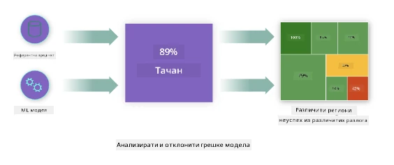
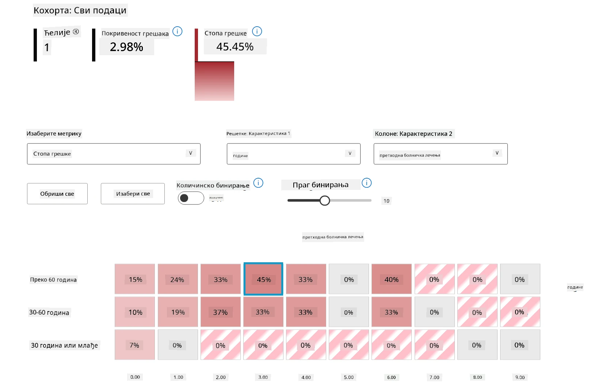
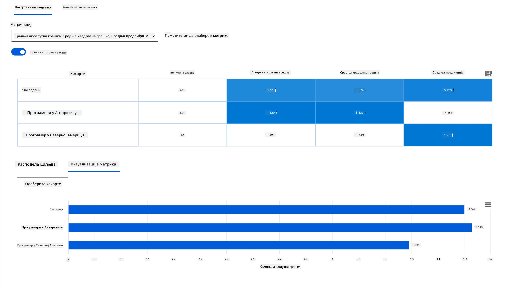
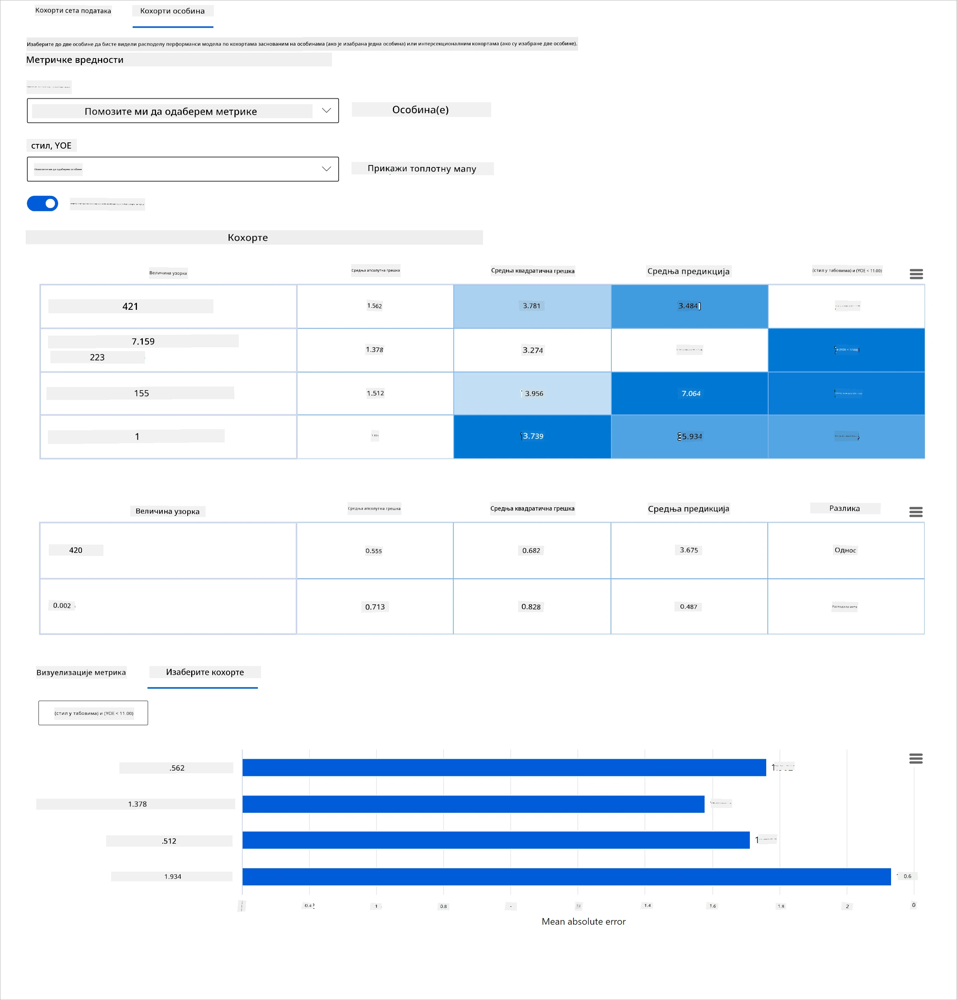
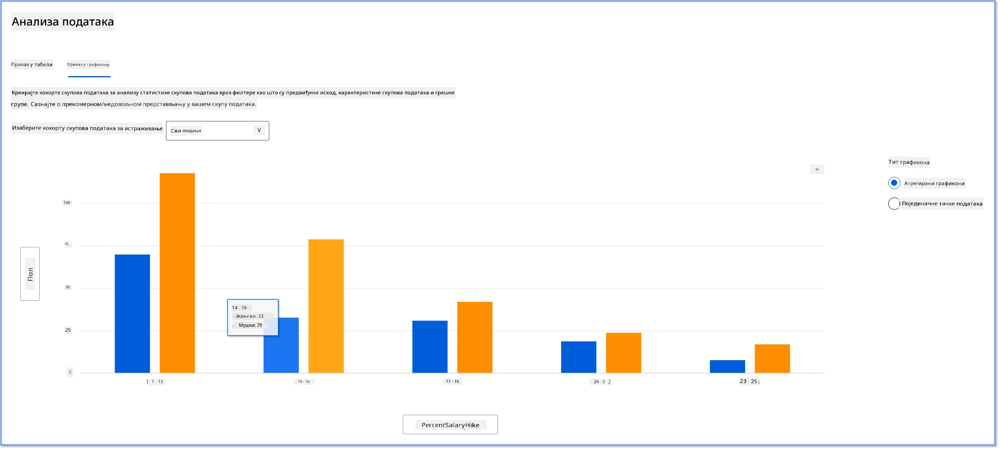
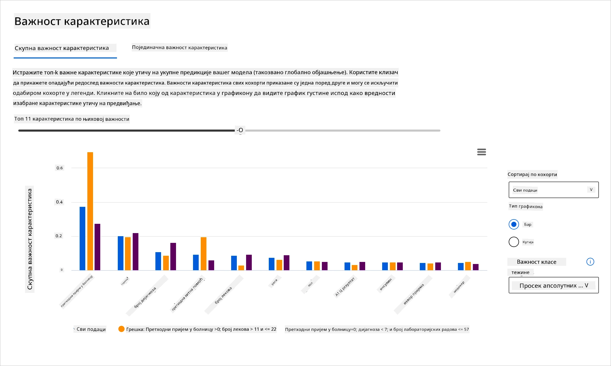
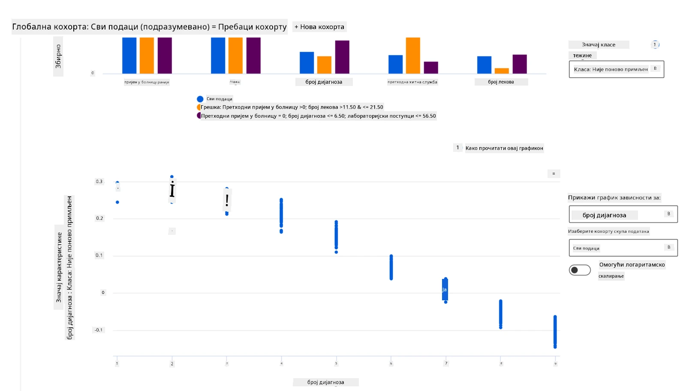

# Поштскриптум: Дебаговање модела у машинском учењу уз коришћење компоненти одговорног AI контролног панела
 

## [Претест пред предавање](https://ff-quizzes.netlify.app/en/ml/)
 
## Увод

Машинско учење утиче на наше свакодневне животе. AI налази примену у неким од најважнијих система који утичу на нас као појединце као и на наше друштво, од здравства, финансија, образовања до запошљавања. На пример, системи и модели учествују у свакодневним задацима доношења одлука, као што су здравствене дијагнозе или откривање преваре. Последично, напреци у AI-у заједно са убрзаном применом сусрећу се са еволуирајућим друштвеним очекивањима и растућом регулативом као одговором. Константно видимо области где AI системи настављају да не испуњавају очекивања; они откривају нове изазове; и владе почињу да регулишу AI решења. Стога је важно да се ти модели анализирају како би обезбедили праведне, поуздане, инклузивне, транспарентне и одговорне резултате за све.

У овом курикулуму, погледаћемо практичне алате који се могу користити да се процени да ли модел има проблеме са одговорним AI-ом. Традиционалне технике дебаговања машинског учења обично су засноване на квантитативним прорачунима као што су агрегирана тачност или просечни губитак грешке. Замислите шта се може десити када подаци које користите за изградњу ових модела немају одређене демографске податке, као што су раса, пол, политички став, религија, или непропорционално представљају те демографије. Шта ако се излаз модела тумачи тако да фаворизује неку демографију? То може увести пре или потцењену репрезентацију ових осетљивих група карактеристика и резултирати проблемима правичности, инклузивности или поузданости модела. Још један фактор је да се модели машинског учења сматрају црним кутијама, што отежава разумевање и објашњење шта покреће предикцију модела. Све ово су изазови са којима се сусрећу научници за податке и AI програмери када немају адекватне алате за дебаговање и процену правичности или поверења у модел.

У овој лекцији научићете како да дебагујете своје моделе користећи:

-	**Анализа грешака**: идентификовати где у дистрибуцији ваших података модел има високе стопе грешака.
-	**Преглед модела**: извршити упоредну анализу различитих података како би се откриле разлике у вашим метрикама перформанси модела.
-	**Анализа података**: истражити где може бити пре или потцењена репрезентација ваших података која може искривити модел да фаворизује једну демографију у односу на другу.
-	**Важност карактеристика**: разумети које карактеристике утичу на предикције вашег модела на глобалном или локалном нивоу.

## Предуслови

Као предуслов, молимо вас да прегледате [Responsible AI алате за програмере](https://www.microsoft.com/ai/ai-lab-responsible-ai-dashboard)

> 

## Анализа грешака

Традиционалне мере перформанси модела које се користе за мерење тачности углавном се заснивају на прорачунима заснованим на тачним и нетачним предикцијама. На пример, утврђивање да је модел тачан 89% времена са губитком грешке од 0.001 може се сматрати добрим перформансама. Грешке често нису равномерно распоређене у вашем базном скупу података. Можете добити оцену тачности модела 89%, али открити да постоје различите регије у вашим подацима где модел пада у 42% случајева. Последица ових образаца неуспеха у одређеним групама података може довести до проблема са правичношћу или поузданошћу. Важно је разумети области у којима модел добро функционише или не. Подручја података где постоји велики број нетачности у вашем моделу могу се показати као важна демографска категорија.

Компонента Анализа грешака на RAI контролном панелу илуструје како је неуспех модела распоређен кроз различите подгрупе помоћу визуализације стабла. Ово је корисно за идентификовање карактеристика или области где је стопа грешке висока у вашим подацима. Погледом где долази до највише нетачности у моделу, можете почети да истражујете корен узрока. Такође можете креирати подгрупе података за извођење анализе. Ове подгрупе података помажу у процесу дебаговања да се утврди зашто је перформанса модела добра у једној подгрупи, али погрешна у другој.

Визуелни индикатори на мапи стабла помажу у бржем лоцирању проблематичних области. На пример, што је тамнија нијанса црвене боје на чвору стабла, то је стопа грешке већа.

Топлотна мапа је још једна функција визуализације коју корисници могу користити за истраживање стопе грешака користећи једну или две карактеристике како би пронашли узрочник грешака модела у целом скупу података или подгрупама.

Користите анализу грешака кад вам је потребно да:

* Добијете дубоко разумевање како су грешке модела распоређене преко скупа података и кроз више улазних и карактеристичних димензија.
* Разложите агрегиране метрике перформанси да бисте аутоматски открили погрешне подгрупе и информисали о усмереним корацима за ублажавање.

## Преглед модела

Евалуација перформанси модела машинског учења захтева добијање холистичког разумевања његовог понашања. То се може постићи прегледом више метрика као што су стопа грешке, тачност, повраћај, прецизност или MAE (просечна апсолутна грешка) како би се пронашле разлике у метрикама перформанси. Једна метрика перформанси може изгледати одлично, али нетачности се могу открити у другој метрици. Поред тога, поређење метрика ради откривања разлика кроз цео скуп података или подгрупе помаже да се осветли где модел добро функционише, а где не. Ово је посебно важно када се посматра учинак модела међу осетљивим у односу на неосетљиве карактеристике (нпр. раса пацијента, пол или старост) како би се откриле потенцијалне неправде које модел може имати. На пример, откривање да је модел више нетачан у подгрупи са осетљивим карактеристикама може указати на потенцијалну неправду модела.

Компонента Преглед модела на RAI контролном панелу помаже не само у анализи метрика перформанси представљених у датој подгрупи, већ пружа корисницима могућност да упореде понашање модела кроз различите подгрупе.

Функционалност анализе засноване на карактеристикама омогућава корисницима да сузе подгрупе података у оквиру одређене карактеристике како би идентификовали аномалије на детаљном нивоу. На пример, контролни панел има уграђену интелигенцију за аутоматско креирање подгрупа за карактеристику коју корисник одабере (нпр. *"time_in_hospital < 3"* или *"time_in_hospital >= 7"*). Ово омогућава кориснику да издвоји одређену карактеристику из већег скупа података да би видео да ли она кључно утиче на погрешне резултате модела.

Компонента Преглед модела подржава две класе метрика разлика:

**Разлика у перформансама модела**: Ове метрике рачунају разлику (диспропорцију) у вредностима одабране метрике перформанси кроз подгрупе података. Ево неколико примера:

* Разлика у стопи тачности
* Разлика у стопи грешке
* Разлика у прецизности
* Разлика у повраћају
* Разлика у просечној апсолутној грешци (MAE)

**Разлика у стопи избора**: Ова метрика садржи разлику у стопи избора (повољна предикција) међу подгрупама. Пример овог је разлика у стопама одобрења кредита. Стопа избора значи део података у свакој класи означених као 1 (у бинарној класификацији) или распоред вредности предикције (у регресији).

## Анализа података

> "Ако дуго мучите податке, она ће признати све шта желите" - Роналд Коуз

Ова изјава звучи екстремно, али истина је да се подаци могу манипулисати да подрже било који закључак. Такав начин манипулације се понекад дешава ненамјерно. Као људи, сви имамо предрасуде, и често је тешко свесно знати када уводите пристрасност у податке. Гарантовање правичности у AI-у и машинском учењу остаје компликован изазов.

Подаци су велики слепи угао традиционалних метрика перформанси модела. Можете имати високе оцене тачности, али то не одражава увек унутрашњу пристрасност у вашем скупу података. На пример, ако скуп података запослених има 27% жена на руководећим позицијама у компанији и 73% мушкараца на истом нивоу, AI модел за оглашавање послова обучен на тим подацима могао би циљати претежно мушку публику за високе пословне позиције. Ова неуравнотеженост у подацима изкривила је предикцију модела да фаворизује један пол. Ово открива проблем правичности где постоји родна пристрасност у AI моделу.

Компонента Анализа података на RAI контролном панелу помаже да се идентификују области где постоји пре и потцењена репрезентација у скупу података. Помоћу ње корисници могу дијагностиковати корен узрока грешака и проблема правичности насталих од неуравнотежености података или недостатка репрезентације одређене групе података. Ово даје корисницима могућност да визуелизују скупове података на основу предвиђених и стварних исхода, група грешака и одређених карактеристика. Понекад откривање потцењене групе података може такође показати да модел не учи добро, па самим тим има високу нетачност. Имате ли модел са пристрасношћу у подацима није само проблем правичности већ показује да модел није инклузиван ни поуздан.

Користите анализу података када вам је потребно да:

* Истражите статистике вашег скупа података бирајући различите филтере да податке поделите у различите димензије (познате као подгрупе).
* Разумете расподелу вашег скупа података кроз различите подгрупе и групе карактеристика.
* Одредите да ли ваша сазнања о правичности, анализи грешака и узрочности (изведена из других компоненти контролног панела) произилазе из расподеле вашег скупа података.
* Одлучите у којим областима да прикупљате више података како бисте ублажили грешке које потичу од проблема са репрезентацијом, буком ознака, буком карактеристика, пристрасношћу у ознакама и сличним факторима.

## Интерпретирање модела

Модели машинског учења обично су црне кутије. Разумевање које кључне карактеристике података покрећу претпоставку модела може бити изазов. Важно је обезбедити транспарентност у вези са разлозима због којих модел даје одређену предикцију. На пример, ако AI систем предвиђа да је дијабетични пацијент у ризику да буде поново примљен у болницу за мање од 30 дана, треба да буде у стању да пружи пратни податак који је довео до те предикције. Имање индикатора који подржавају податке доноси транспарентност која помаже клиничарима или болницама да донесу добро информисане одлуке. Поред тога, могућност да се објасни зашто је модел направио предикцију за појединачног пацијента омогућава одговорност у складу са здравственим прописима. Када користите моделе машинског учења на начине који утичу на животе људи, кључно је разумети и објаснити шта утиче на понашање модела. Објашњивост и интерпретабилност модела помаже у одговору на питања у сценаријима као што су:

* Дебаговање модела: Зашто је мој модел направио ову грешку? Како могу побољшати модел?
* Сарадња човека и AI: Како да разумем и верујем одлукама модела?
* Усклађеност са прописима: Да ли мој модел испуњава законске захтеве?

Компонента Важност карактеристика на RAI контролном панелу помаже у дебаговању и добијању комплетног разумевања како модел доноси предикције. Такође је користан алат за професионалце машинског учења и доносиоце одлука да објасне и покажу доказе о карактеристикама које утичу на понашање модела ради усклађености са прописима. Корисници могу истражити како глобална тако и локална објашњења да би потврдили које карактеристике покрећу предикцију модела. Глобална објашњења наводе главне карактеристике које су утицале на укупну предикцију модела. Локална објашњења приказују које карактеристике су довеле до предикције модела за појединачни случај. Могућност евалуације локалних објашњења такође је корисна при дебаговању или ревизији одређеног случаја да боље разумете и протумачите зашто је модел направио прецизну или непоуздану предикцију.

* Глобална објашњења: На пример, које карактеристике утичу на укупно понашање модела за поновни пријем пацијєнта са дијабетесом у болницу?
* Локална објашњења: На пример, зашто је пацијент са дијабетесом старији од 60 година са претходним пријемима прогнозирано да ће бити поновно примљен или не у року од 30 дана у болницу?

У процесу дебаговања испитивања перформанси модела кроз различите подгрупе, Важност карактеристика показује колико утицај има одређена карактеристика унутар подгрупа. Помоћу ње се откривају аномалије поређењем нивоа утицаја који карактеристика има у покретању погрешних предикција модела. Компонента Важност карактеристика може приказати које вредности карактеристике позитивно или негативно утичу на исход модела. На пример, ако је модел направио нетачну предикцију, компонента вам пружа могућност да продрете дубље и прецизно утврдите које карактеристике или вредности карактеристика су довеле до предикције. Овај ниво детаља помаже не само при дебаговању већ пружа транспарентност и одговорност у ревизијским ситуацијама. Коначно, компонента може помоћи у идентификовању проблема правичности. Да илуструјемо, ако осетљива карактеристика као што је етничка припадност или пол има велики утицај на предикцију модела, то може бити знак расне или родне пристрасности у моделу.

Користите интерпретабилност када вам је потребно да:

* Одредите колико су поуздане предикције вашег AI система разумевањем које су карактеристике најважније за предикције.
* Приступите дебаговању модела тако што прво разумете модел и идентификујете да ли користи здраве карактеристике или само лажне корелације.
* Откријете потенцијалне изворе неправедности разумевањем да ли модел базира предикције на осетљивим карактеристикама или на карактеристикама високо корелираним са њима.
* Изградите поверење корисника у одлуке вашег модела генеришући локална објашњења која илуструју њихове исходе.
* Завршите регулаторску ревизију AI система како бисте валидирали моделе и пратили утицај одлука модела на људе.

## Закључак

Све компоненте RAI контролног панела су практични алати који вам помажу да изградите моделе машинског учења који су мање штетни и поузданији за друштво. Побољшавају превенцију претњи људским правима; дискриминацију или искључивање одређених група из животних прилика; и ризик од физичке или психолошке повреде. Такође помажу изградњи поверења у одлуке вашег модела генеришући локална објашњења која илуструју њихове исходе. Неке од потенцијалних штета могу се класификовати као:

- **Додела**, ако је, на пример, пол или етничка припадност фаворизована у односу на другу.
- **Квалитет услуге**. Ако тренирате податке за један конкретан сценарио, а стварност је знатно сложенија, то доводи до лоше перформансе услуге.
- **Стереотипизација**. Повезивање дате групе са унапред додељеним карактеристикама.

- **Омаловажавање**. Несправедливо критиковање и означавање нечега или некога.
- **Прекомерна или недовољна заступљеност**. Идеја да се одређена група не види у одређеној професији, и свака услуга или функција која наставља да то промовише доприноси штети.

### Azure RAI контролна табла
 
[Azure RAI контролна табла](https://learn.microsoft.com/en-us/azure/machine-learning/concept-responsible-ai-dashboard?WT.mc_id=aiml-90525-ruyakubu) је изграђена на алатима отвореног кода које су развиле водеће академске институције и организације, укључујући Microsoft, и од кључног су значаја за научнике података и развојне програмере вештачке интелигенције да боље разумеју понашање модела, открију и ублаже непожељне проблеме у AI моделима.

- Научите како да користите различите компоненте тако што ћете погледати документацију за RAI контролну таблу. [docs.](https://learn.microsoft.com/en-us/azure/machine-learning/how-to-responsible-ai-dashboard?WT.mc_id=aiml-90525-ruyakubu)

- Погледајте неке примерке RAI контролне табле у облику ноутбукова за отклањање грешака у одговорнијим AI сценаријима у Azure Machine Learning. 
  
---
## 🚀 Изазов 
 
Да бисмо спречили увођење статистичких или податочних предрасуда од почетка, требало би да: 

- имамо разноликост позадина и перспектива међу људима који раде на системима 
- улажемо у скупове података који одражавају разноликост нашег друштва 
- развијамо боље методе за откривање и исправљање предрасуда када се појаве 

Размислите о стварним сценаријима где је неправда очигледна у изградњи и коришћењу модела. Шта још треба да узмемо у обзир? 

## [Квиз после предавања](https://ff-quizzes.netlify.app/en/ml/)
## Преглед и самостална студија 
 
У овој лекцији сте научили неке од практичних алата за укључивање одговорне AI у машинско учење.  

Погледајте овај радионицу да бисте дубље ушли у теме: 

- Responsible AI Dashboard: Једно место за оперативно коришћење RAI у пракси, од Бесмире Нуши и Мехрнуш Самеки

> 🎥 Кликните на слику изнад за видео: Responsible AI Dashboard: Једно место за оперативно коришћење RAI у пракси од Бесмире Нуши и Мехрнуш Самеки
 
Позовите се на следеће материјале за више информација о одговорној AI и како градити поузданије моделе: 

- Microsoft-ови алати RAI контролне табле за отклањање грешака у ML моделима: [Responsible AI tools resources](https://aka.ms/rai-dashboard)

- Истражите Responsible AI скуп алата: [Github](https://github.com/microsoft/responsible-ai-toolbox)

- Microsoft-ов ресурсни центар за RAI: [Responsible AI Resources – Microsoft AI](https://www.microsoft.com/ai/responsible-ai-resources?activetab=pivot1%3aprimaryr4) 

- Microsoft-ова FATE истраживачка група: [FATE: Fairness, Accountability, Transparency, and Ethics in AI - Microsoft Research](https://www.microsoft.com/research/theme/fate/) 

## Задатак

[Истражите RAI контролну таблу](assignment.md)

---

<!-- CO-OP TRANSLATOR DISCLAIMER START -->
**Изјава о одрицању одговорности**:
Овај документ је преведен коришћењем услуге за аутоматски превод [Co-op Translator](https://github.com/Azure/co-op-translator). Иако тежимо тачности, имајте у виду да аутоматски преводи могу садржати грешке или нетачности. Оригинални документ на његовом изворном језику треба сматрати ауторитативним извором. За критичне информације препоручује се професионални људски превод. Нисмо одговорни за било каква неспоразума или погрешна тумачења која произилазе из коришћења овог превода.
<!-- CO-OP TRANSLATOR DISCLAIMER END -->