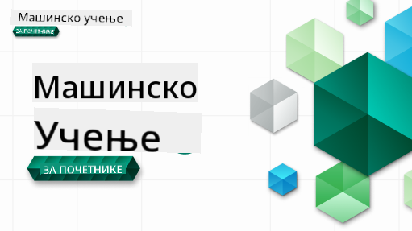

<!--
CO_OP_TRANSLATOR_METADATA:
{
  "original_hash": "7a13afb3674838f557d61f8d67e4d5f8",
  "translation_date": "2025-10-24T09:23:57+00:00",
  "source_file": "README.md",
  "language_code": "sr"
}
-->
  
  
  
  
  

  
  
  

### 🌐 Подршка за више језика  

#### Подршка путем GitHub Action (аутоматизовано и увек ажурирано)  

<!-- CO-OP TRANSLATOR LANGUAGES TABLE START -->  
[Арапски](../ar/README.md) | [Бенгалски](../bn/README.md) | [Бугарски](../bg/README.md) | [Бирмански (Мјанмар)](../my/README.md) | [Кинески (поједностављени)](../zh/README.md) | [Кинески (традиционални, Хонг Конг)](../hk/README.md) | [Кинески (традиционални, Макао)](../mo/README.md) | [Кинески (традиционални, Тајван)](../tw/README.md) | [Хрватски](../hr/README.md) | [Чешки](../cs/README.md) | [Дански](../da/README.md) | [Холандски](../nl/README.md) | [Естонски](../et/README.md) | [Фински](../fi/README.md) | [Француски](../fr/README.md) | [Немачки](../de/README.md) | [Грчки](../el/README.md) | [Хебрејски](../he/README.md) | [Хинди](../hi/README.md) | [Мађарски](../hu/README.md) | [Индонежански](../id/README.md) | [Италијански](../it/README.md) | [Јапански](../ja/README.md) | [Корејски](../ko/README.md) | [Литвански](../lt/README.md) | [Малајски](../ms/README.md) | [Марати](../mr/README.md) | [Непалски](../ne/README.md) | [Норвешки](../no/README.md) | [Персијски (фарси)](../fa/README.md) | [Пољски](../pl/README.md) | [Португалски (Бразил)](../br/README.md) | [Португалски (Португал)](../pt/README.md) | [Пенџабски (Гурмуки)](../pa/README.md) | [Румунски](../ro/README.md) | [Руски](../ru/README.md) | [Српски (ћирилица)](./README.md) | [Словачки](../sk/README.md) | [Словеначки](../sl/README.md) | [Шпански](../es/README.md) | [Свахили](../sw/README.md) | [Шведски](../sv/README.md) | [Тагалог (Филипински)](../tl/README.md) | [Тамилски](../ta/README.md) | [Тајландски](../th/README.md) | [Турски](../tr/README.md) | [Украјински](../uk/README.md) | [Урду](../ur/README.md) | [Вијетнамски](../vi/README.md)  
<!-- CO-OP TRANSLATOR LANGUAGES TABLE END -->  

#### Придружите се нашој заједници  

  

Имамо серију учења са AI на Discord-у, сазнајте више и придружите нам се на [Learn with AI Series](https://aka.ms/learnwithai/discord) од 18. до 30. септембра 2025. Добићете савете и трикове за коришћење GitHub Copilot-а за Data Science.  

  

# Машинско учење за почетнике - Курикулум  

> 🌍 Путујте око света док истражујемо машинско учење кроз културе света 🌍  

Cloud Advocates у Microsoft-у са задовољством нуде 12-недељни, 26-лекцијски курикулум о **машинском учењу**. У овом курикулуму, научићете о ономе што се понекад назива **класично машинско учење**, користећи углавном библиотеку Scikit-learn и избегавајући дубоко учење, које је покривено у нашем [AI for Beginners' curriculum](https://aka.ms/ai4beginners). Упарите ове лекције са нашим курикулумом ['Data Science for Beginners'](https://aka.ms/ds4beginners), такође!  

Путујте са нама око света док примењујемо ове класичне технике на податке из различитих делова света. Свака лекција укључује квизове пре и после лекције, писана упутства за завршетак лекције, решење, задатак и још много тога. Наш приступ заснован на пројектима омогућава вам да учите кроз практичан рад, што је доказан начин да нове вештине остану трајно усвојене.  

**✍️ Срдачна захвалност нашим ауторима** Џен Лупер, Стивен Хауел, Франческа Лазери, Томоми Имура, Каси Бревиу, Дмитриј Сошњиков, Крис Норинг, Анирбан Мукерџи, Орнела Алтуњан, Рут Јакубу и Ејми Бојд  

**🎨 Захвалност и нашим илустраторима** Томоми Имура, Дасани Мадипали и Џен Лупер  

**🙏 Посебна захвалност 🙏 нашим Microsoft Student Ambassador ауторима, рецензентима и сарадницима**, посебно Ришиту Даглију, Мухамаду Сакибу Кхану Инану, Рохану Рају, Александру Петреску, Абишеку Џајсвалу, Наврин Табасум, Јоану Самуили и Снигдхи Агарвал  

**🤩 Додатна захвалност Microsoft Student Ambassador-има Ерику Ванџау, Џаслин Сонди и Видуши Гупти за наше лекције о R програмском језику!**  

# Почетак  

Пратите ове кораке:  
1. **Fork репозиторијум**: Кликните на дугме "Fork" у горњем десном углу ове странице.  
2. **Clone репозиторијум**:   `git clone https://github.com/microsoft/ML-For-Beginners.git`  

> [пронађите све додатне ресурсе за овај курс у нашој Microsoft Learn колекцији](https://learn.microsoft.com/en-us/collections/qrqzamz1nn2wx3?WT.mc_id=academic-77952-bethanycheum)  

> 🔧 **Потребна помоћ?** Погледајте наш [Водич за решавање проблема](TROUBLESHOOTING.md) за решења уобичајених проблема са инсталацијом, подешавањем и извођењем лекција.  

**[Студенти](https://aka.ms/student-page)**, да бисте користили овај курикулум, направите fork целог репозиторијума на свој GitHub налог и завршите вежбе сами или у групи:  

- Почните са квизом пре предавања.  
- Прочитајте предавање и завршите активности, паузирајући и размишљајући на сваком провери знања.  
- Покушајте да креирате пројекте разумевањем лекција уместо покретања решења кода; међутим, тај код је доступан у `/solution` фолдерима у свакој лекцији заснованој на пројекту.  
- Урадите квиз након предавања.  
- Завршите изазов.  
- Завршите задатак.  
- Након завршетка групе лекција, посетите [Дискусиони одбор](https://github.com/microsoft/ML-For-Beginners/discussions) и "учите гласно" попуњавањем одговарајућег PAT рубрика. 'PAT' је алат за процену напретка који је рубрика коју попуњавате ради даљег учења. Такође можете реаговати на друге PAT-ове како бисмо заједно учили.  

> За даље учење, препоручујемо праћење ових [Microsoft Learn](https://docs.microsoft.com/en-us/users/jenlooper-2911/collections/k7o7tg1gp306q4?WT.mc_id=academic-77952-leestott) модула и путева учења.  

**Наставници**, укључили смо [неке предлоге](for-teachers.md) о томе како да користите овај курикулум.  

---  

## Видео водичи  

Неке лекције су доступне као кратки видео записи. Све их можете пронаћи унутар лекција или на [ML for Beginners плејлисти на Microsoft Developer YouTube каналу](https://aka.ms/ml-beginners-videos) кликом на слику испод.  

  

---  

## Упознајте тим  

  

**Gif by** [Mohit Jaisal](https://linkedin.com/in/mohitjaisal)  

> 🎥 Кликните на слику изнад за видео о пројекту и људима који су га креирали!  

---  

## Педагогија  

Одабрали смо два педагошка принципа приликом креирања овог курикулума: осигурање да је практично **заснован на пројектима** и да укључује **честе квизове**. Поред тога, овај курикулум има заједничку **тему** која му даје кохезију.  

Осигуравањем да садржај одговара пројектима, процес постаје занимљивији за студенте, а задржавање концепата ће бити побољшано. Поред тога, квиз са ниским ризиком пре часа поставља намеру студента ка учењу теме, док други квиз након часа осигурава даље задржавање. Овај курикулум је дизајниран да буде флексибилан и забаван и може се узети у целини или делимично. Пројекти почињу малим и постају све сложенији до краја 12-недељног циклуса. Овај курикулум такође укључује постскриптум о стварним применама ML-а, који се може користити као додатни кредит или као основа за дискусију.  

> Пронађите наш [Кодекс понашања](CODE_OF_CONDUCT.md), [Упутства за допринос](CONTRIBUTING.md), [Превод](TRANSLATIONS.md) и [Водич за решавање проблема](TROUBLESHOOTING.md). Добродошли сте да нам дате конструктивне повратне информације!  

## Свака лекција укључује  

- опциони скетч  
- опциони допунски видео  
- видео водич (само неке лекције)  
- [квиз за загревање пре предавања](https://ff-quizzes.netlify.app/en/ml/)  
- писану лекцију  
- за лекције засноване на пројектима, водиче корак по корак како изградити пројекат  
- провере знања  
- изазов  
- допунско читање  
- задатак  
- [квиз након предавања](https://ff-quizzes.netlify.app/en/ml/)  

> **Напомена о језицима**: Ове лекције су углавном написане на Python-у, али многе су доступне и на R-у. Да бисте завршили лекцију на R-у, идите у `/solution` фолдер и потражите лекције на R-у. Оне укључују .rmd екстензију која представља **R Markdown** фајл који се може једноставно дефинисати као уграђивање `code chunks` (R или других језика) и `YAML header` (који води како форматирати излаз као PDF) у `Markdown документ`. Као такав, служи као примерни оквир за ауторство у науци о подацима јер вам омогућава да комбинујете свој код, његов излаз и своје мисли тако што их записујете у Markdown-у. Штавише, R Markdown документи могу бити рендеровани у излазне формате као што су PDF, HTML или Word.  

> **Напомена о квизовима**: Сви квизови се налазе у [Quiz App фолдеру](../../quiz-app), за укупно 52 квиза са по три питања. Они су повезани из лекција, али апликација за квиз може се покренути локално; пратите упутства у `quiz-app` фолдеру за локално хостовање или Azure деплој.  

| Број лекције |                             Тема                              |                   Груписање лекција                   | Циљеви учења                                                                                                             |                                                              Повезана лекција                                                               |                        Аутор                        |  
| :-----------: | :------------------------------------------------------------: | :-------------------------------------------------: | ------------------------------------------------------------------------------------------------------------------------------- | :--------------------------------------------------------------------------------------------------------------------------------------: | :--------------------------------------------------: |  
|      01       |                Увод у машинско учење                          |      [Introduction](1-Introduction/README.md)       | Научите основне концепте машинског учења                                                                                       |                                             [Lesson](1-Introduction/1-intro-to-ML/README.md)                                             |                       Мухамед                        |
|      02       |                Историја машинског учења                       |      [Introduction](1-Introduction/README.md)       | Упознајте историју која стоји иза ове области                                                                                  |                                            [Lesson](1-Introduction/2-history-of-ML/README.md)                                            |                     Џен и Ејми                       |
|      03       |                 Праведност и машинско учење                   |      [Introduction](1-Introduction/README.md)       | Која су важна филозофска питања о праведности која студенти треба да узму у обзир приликом креирања и примене ML модела?         |                                              [Lesson](1-Introduction/3-fairness/README.md)                                               |                        Томоми                        |
|      04       |                Технике машинског учења                        |      [Introduction](1-Introduction/README.md)       | Које технике истраживачи машинског учења користе за креирање ML модела?                                                         |                                          [Lesson](1-Introduction/4-techniques-of-ML/README.md)                                           |                    Крис и Џен                       |
|      05       |                   Увод у регресију                            |        [Regression](2-Regression/README.md)         | Започните рад са Python-ом и Scikit-learn-ом за регресионе моделе                                                              |         [Python](2-Regression/1-Tools/README.md) • [R](../../2-Regression/1-Tools/solution/R/lesson_1.html)         |      Џен • Ерик Ванџау       |
|      06       |                Цене бундева у Северној Америци 🎃             |        [Regression](2-Regression/README.md)         | Визуализујте и очистите податке у припреми за машинско учење                                                                    |          [Python](2-Regression/2-Data/README.md) • [R](../../2-Regression/2-Data/solution/R/lesson_2.html)          |      Џен • Ерик Ванџау       |
|      07       |                Цене бундева у Северној Америци 🎃             |        [Regression](2-Regression/README.md)         | Направите линеарне и полиномске регресионе моделе                                                                              |        [Python](2-Regression/3-Linear/README.md) • [R](../../2-Regression/3-Linear/solution/R/lesson_3.html)        |      Џен и Дмитриј • Ерик Ванџау       |
|      08       |                Цене бундева у Северној Америци 🎃             |        [Regression](2-Regression/README.md)         | Направите логистички регресиони модел                                                                                          |     [Python](2-Regression/4-Logistic/README.md) • [R](../../2-Regression/4-Logistic/solution/R/lesson_4.html)      |      Џен • Ерик Ванџау       |
|      09       |                          Веб апликација 🔌                    |           [Web App](3-Web-App/README.md)            | Направите веб апликацију за коришћење вашег обученог модела                                                                     |                                                 [Python](3-Web-App/1-Web-App/README.md)                                                  |                         Џен                          |
|      10       |                 Увод у класификацију                          |    [Classification](4-Classification/README.md)     | Очистите, припремите и визуализујте своје податке; увод у класификацију                                                        | [Python](4-Classification/1-Introduction/README.md) • [R](../../4-Classification/1-Introduction/solution/R/lesson_10.html)  | Џен и Кеси • Ерик Ванџау |
|      11       |             Укусна азијска и индијска кухиња 🍜               |    [Classification](4-Classification/README.md)     | Увод у класификаторе                                                                                                           | [Python](4-Classification/2-Classifiers-1/README.md) • [R](../../4-Classification/2-Classifiers-1/solution/R/lesson_11.html) | Џен и Кеси • Ерик Ванџау |
|      12       |             Укусна азијска и индијска кухиња 🍜               |    [Classification](4-Classification/README.md)     | Више класификатора                                                                                                             | [Python](4-Classification/3-Classifiers-2/README.md) • [R](../../4-Classification/3-Classifiers-2/solution/R/lesson_12.html) | Џен и Кеси • Ерик Ванџау |
|      13       |             Укусна азијска и индијска кухиња 🍜               |    [Classification](4-Classification/README.md)     | Направите веб апликацију за препоруке користећи ваш модел                                                                       |                                              [Python](4-Classification/4-Applied/README.md)                                              |                         Џен                          |
|      14       |                   Увод у кластерисање                         |        [Clustering](5-Clustering/README.md)         | Очистите, припремите и визуализујте своје податке; увод у кластерисање                                                          |         [Python](5-Clustering/1-Visualize/README.md) • [R](../../5-Clustering/1-Visualize/solution/R/lesson_14.html)         |      Џен • Ерик Ванџау       |
|      15       |              Истраживање музичких укуса у Нигерији 🎧         |        [Clustering](5-Clustering/README.md)         | Истражите метод кластерисања K-Means                                                                                           |           [Python](5-Clustering/2-K-Means/README.md) • [R](../../5-Clustering/2-K-Means/solution/R/lesson_15.html)           |      Џен • Ерик Ванџау       |
|      16       |        Увод у обраду природног језика ☕️                     |   [Natural language processing](6-NLP/README.md)    | Научите основе NLP креирањем једноставног бота                                                                                 |                                             [Python](6-NLP/1-Introduction-to-NLP/README.md)                                              |                       Стивен                         |
|      17       |                      Уобичајени NLP задаци ☕️                |   [Natural language processing](6-NLP/README.md)    | Продубите своје знање о NLP-у разумевањем уобичајених задатака који се јављају приликом рада са језичким структурама             |                                                    [Python](6-NLP/2-Tasks/README.md)                                                     |                       Стивен                         |
|      18       |             Превод и анализа сентимента ♥️                   |   [Natural language processing](6-NLP/README.md)    | Превод и анализа сентимента уз Џејн Остин                                                                                      |                                            [Python](6-NLP/3-Translation-Sentiment/README.md)                                             |                       Стивен                         |
|      19       |                  Романтични хотели Европе ♥️                 |   [Natural language processing](6-NLP/README.md)    | Анализа сентимента уз рецензије хотела 1                                                                                       |                                               [Python](6-NLP/4-Hotel-Reviews-1/README.md)                                                |                       Стивен                         |
|      20       |                  Романтични хотели Европе ♥️                 |   [Natural language processing](6-NLP/README.md)    | Анализа сентимента уз рецензије хотела 2                                                                                       |                                               [Python](6-NLP/5-Hotel-Reviews-2/README.md)                                                |                       Стивен                         |
|      21       |            Увод у прогнозирање временских серија             |        [Time series](7-TimeSeries/README.md)        | Увод у прогнозирање временских серија                                                                                          |                                             [Python](7-TimeSeries/1-Introduction/README.md)                                              |                      Франческа                       |
|      22       | ⚡️ Светска потрошња енергије ⚡️ - прогнозирање временских серија са ARIMA |        [Time series](7-TimeSeries/README.md)        | Прогнозирање временских серија са ARIMA                                                                                        |                                                 [Python](7-TimeSeries/2-ARIMA/README.md)                                                 |                      Франческа                       |
|      23       |  ⚡️ Светска потрошња енергије ⚡️ - прогнозирање временских серија са SVR  |        [Time series](7-TimeSeries/README.md)        | Прогнозирање временских серија са Support Vector Regressor                                                                     |                                                  [Python](7-TimeSeries/3-SVR/README.md)                                                  |                       Анирбан                        |
|      24       |             Увод у учење кроз појачање                        | [Reinforcement learning](8-Reinforcement/README.md) | Увод у учење кроз појачање са Q-Learning                                                                                       |                                             [Python](8-Reinforcement/1-QLearning/README.md)                                              |                        Дмитриј                       |
|      25       |                 Помозите Петру да избегне вука! 🐺            | [Reinforcement learning](8-Reinforcement/README.md) | Учење кроз појачање у Gym-у                                                                                                    |                                                [Python](8-Reinforcement/2-Gym/README.md)                                                 |                        Дмитриј                       |
|  Постскриптум |            Реални сценарији и апликације машинског учења      |      [ML in the Wild](9-Real-World/README.md)       | Занимљиве и откривајуће стварне апликације класичног машинског учења                                                            |                                             [Lesson](9-Real-World/1-Applications/README.md)                                              |                         Тим                          |
|  Постскриптум |            Дебаговање модела у машинском учењу уз RAI таблу  |      [ML in the Wild](9-Real-World/README.md)       | Дебаговање модела у машинском учењу уз компоненте Responsible AI табле                                                         |                                             [Lesson](9-Real-World/2-Debugging-ML-Models/README.md)                                              |                         Рут Јакубу                       |

> [пронађите све додатне ресурсе за овај курс у нашој Microsoft Learn колекцији](https://learn.microsoft.com/en-us/collections/qrqzamz1nn2wx3?WT.mc_id=academic-77952-bethanycheum)

## Офлајн приступ

Можете покренути ову документацију офлајн користећи [Docsify](https://docsify.js.org/#/). Форкујте овај репозиторијум, [инсталирајте Docsify](https://docsify.js.org/#/quickstart) на вашем локалном рачунару, а затим у коренском фолдеру овог репозиторијума укуцајте `docsify serve`. Веб сајт ће бити доступан на порту 3000 на вашем localhost-у: `localhost:3000`.

## PDF документи

Пронађите PDF наставног плана са линковима [овде](https://microsoft.github.io/ML-For-Beginners/pdf/readme.pdf).

## 🎒 Остали курсеви 

Наш тим производи и друге курсеве! Погледајте:

<!-- CO-OP TRANSLATOR OTHER COURSES START -->
### Azure / Edge / MCP / Агенти

---
 
### Генеративна AI серија

[-9333EA?style=for-the-badge&labelColor=E5E7EB&color=9333EA)](https://github.com/microsoft/Generative-AI-for-beginners-dotnet?WT.mc_id=academic-105485-koreyst)
[-C084FC?style=for-the-badge&labelColor=E5E7EB&color=C084FC)](https://github.com/microsoft/generative-ai-for-beginners-java?WT.mc_id=academic-105485-koreyst)
[-E879F9?style=for-the-badge&labelColor=E5E7EB&color=E879F9)](https://github.com/microsoft/generative-ai-with-javascript?WT.mc_id=academic-105485-koreyst)

---
 
### Основно учење
  
  
  
  
  
  
  

---

### Copilot serija  
  
  
  

## Dobijanje pomoći  

Ako zapnete ili imate pitanja o izradi AI aplikacija, pridružite se:  

  

Ako imate povratne informacije o proizvodu ili naiđete na greške tokom izrade, posetite:  

  

---

**Одрицање од одговорности**:  
Овај документ је преведен помоћу услуге за превођење уз помоћ вештачке интелигенције [Co-op Translator](https://github.com/Azure/co-op-translator). Иако настојимо да обезбедимо тачност, молимо вас да имате у виду да аутоматизовани преводи могу садржати грешке или нетачности. Оригинални документ на изворном језику треба сматрати меродавним извором. За критичне информације препоручује се професионални превод од стране људи. Не преузимамо одговорност за било каква погрешна тумачења или неспоразуме који могу настати услед коришћења овог превода.