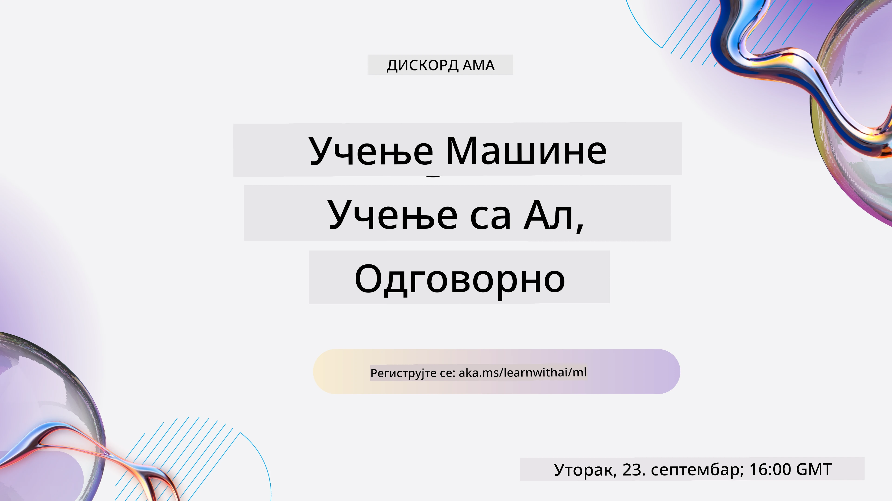
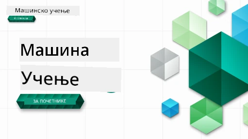

<!--
CO_OP_TRANSLATOR_METADATA:
{
  "original_hash": "ec8385130a8239ad9d827175126a0722",
  "translation_date": "2026-01-01T13:36:57+00:00",
  "source_file": "README.md",
  "language_code": "sr"
}
-->

### 🌐 Подршка на више језика

#### Подржано путем GitHub Action (аутоматизовано и увек ажурно)

<!-- CO-OP TRANSLATOR LANGUAGES TABLE START -->
[Арапски](../ar/README.md) | [Бенгалски](../bn/README.md) | [Бугарски](../bg/README.md) | [Бирмански (Мјанмар)](../my/README.md) | [Кинески (поједностављени)](../zh/README.md) | [Кинески (традиционални, Хонг Конг)](../hk/README.md) | [Кинески (традиционални, Макао)](../mo/README.md) | [Кинески (традиционални, Тајван)](../tw/README.md) | [Хрватски](../hr/README.md) | [Чешки](../cs/README.md) | [Дански](../da/README.md) | [Холандски](../nl/README.md) | [Естонски](../et/README.md) | [Фински](../fi/README.md) | [Француски](../fr/README.md) | [Немачки](../de/README.md) | [Грчки](../el/README.md) | [Хебрејски](../he/README.md) | [Хинди](../hi/README.md) | [Мађарски](../hu/README.md) | [Индонежански](../id/README.md) | [Италијански](../it/README.md) | [Јапански](../ja/README.md) | [Каннатa](../kn/README.md) | [Корејски](../ko/README.md) | [Литвански](../lt/README.md) | [Малајски](../ms/README.md) | [Малајалам](../ml/README.md) | [Марати](../mr/README.md) | [Непалски](../ne/README.md) | [Нигеријски Пиџин](../pcm/README.md) | [Норвешки](../no/README.md) | [Персијски (Фарси)](../fa/README.md) | [Пољски](../pl/README.md) | [Португалски (Бразил)](../br/README.md) | [Португалски (Португал)](../pt/README.md) | [Пунџаби (Гурмухи)](../pa/README.md) | [Румунски](../ro/README.md) | [Руски](../ru/README.md) | [Српски (ћирилица)](./README.md) | [Словачки](../sk/README.md) | [Словеначки](../sl/README.md) | [Шпански](../es/README.md) | [Свахили](../sw/README.md) | [Шведски](../sv/README.md) | [Тагалог (Филипински)](../tl/README.md) | [Тамилски](../ta/README.md) | [Телугу](../te/README.md) | [Тајски](../th/README.md) | [Турски](../tr/README.md) | [Украјински](../uk/README.md) | [Урду](../ur/README.md) | [Вијетнамски](../vi/README.md)
<!-- CO-OP TRANSLATOR LANGUAGES TABLE END -->

#### Придружите се нашој заједници

Имамо покренуту Discord серију „Учите уз AI“, сазнајте више и придружите нам се на [Learn with AI Series](https://aka.ms/learnwithai/discord) од 18. до 30. септембра 2025. Добићете савете и трикове за коришћење GitHub Copilot-а за науку о подацима.

# Машинско учење за почетнике - Наставни програм

> 🌍 Путујте око света док истражујемо Машинско учење кроз културе света 🌍

Cloud Advocates у компанији Microsoft са задовољством нуде 12-недељни, 26-часовни наставни програм који се бави темом **Машинског учења**. У овом наставном програму научићете о ономе што се понекад назива **класично машинско учење**, користећи углавном библиотеку Scikit-learn и избегавајући дубоко учење, које је покривено у нашем [наставном програму 'AI for Beginners'](https://aka.ms/ai4beginners). Упарујте ове лекције и са нашим [наставним програмом 'Data Science for Beginners'](https://aka.ms/ds4beginners)!

Путујте са нама широм света док примењујемо ове класичне технике на податке из многих делова света. Свака лекција садржи пред- и пост-лекцијске квизове, писана упутства за завршетак лекције, решење, задатак и још много тога. Наша педагошка методологија заснована на пројектима омогућава вам да учите док градите, што је доказано као ефикасан начин за усвајање нових вештина.

**✍️ Велика захвалност нашим ауторима** Jen Looper, Stephen Howell, Francesca Lazzeri, Tomomi Imura, Cassie Breviu, Dmitry Soshnikov, Chris Noring, Anirban Mukherjee, Ornella Altunyan, Ruth Yakubu и Amy Boyd

**🎨 Хвала и нашим илустраторима** Tomomi Imura, Dasani Madipalli, и Jen Looper

**🙏 Посебна захвалност 🙏 нашим Microsoft Student Ambassador ауторима, рецензентима и доприносиоцима садржаја**, нарочито Rishit Dagli, Muhammad Sakib Khan Inan, Rohan Raj, Alexandru Petrescu, Abhishek Jaiswal, Nawrin Tabassum, Ioan Samuila, и Snigdha Agarwal

**🤩 Додатна захвалност Microsoft Student Ambassadors Eric Wanjau, Jasleen Sondhi, и Vidushi Gupta за наше R лекције!**

# Како почети

Пратите ове кораке:
1. **Форк-овање репозиторијума**: Кликните на дугме "Fork" у горњем десном углу ове странице.
2. **Клонирај репозиторијум**:   `git clone https://github.com/microsoft/ML-For-Beginners.git`

> [пронађите све додатне ресурсе за овај курс у нашој Microsoft Learn колекцији](https://learn.microsoft.com/en-us/collections/qrqzamz1nn2wx3?WT.mc_id=academic-77952-bethanycheum)

> 🔧 **Потребна помоћ?** Погледајте наш [Водич за решавање проблема](TROUBLESHOOTING.md) за решења уобичајених проблема са инсталацијом, подешавањем и покретањем лекција.

**[Студенти](https://aka.ms/student-page)**, да бисте користили овај наставни програм, форкујте цео репо на свој GitHub налог и завршите вежбе сами или у групи:

- Почните са уводним квизом пре предавања.
- Прочитајте предавање и завршите активности, правећи паузе и размишљајући на сваком провера знања.
- Покушајте да направите пројекте разумећи лекције уместо да само покренете код решења; сваки такав код је доступан у фолдерима `/solution` у свакој лекцији заснованој на пројекту.
- Положеите пост-лекцијски квиз.
- Решите изазов.
- Завршите задатак.
- Након завршетка групе лекција, посетите [Discussion Board](https://github.com/microsoft/ML-For-Beginners/discussions) и „учите наглас“ попуњавајући одговарајућу PAT рубрику. 'PAT' је алат за процену напретка који је рубрика коју попуњавате да бисте унапредили своје учење. Можете такође реаговати на друге PAT-ове да бисмо учили заједно.

> За даље изучавање, препоручујемо праћење ових модула и пута за учење на [Microsoft Learn](https://docs.microsoft.com/en-us/users/jenlooper-2911/collections/k7o7tg1gp306q4?WT.mc_id=academic-77952-leestott).

**Наставници**, укључили смо [неке предлоге](for-teachers.md) о томе како користити овај наставни програм.

---

## Видео прегледи

Неке од лекција доступне су у кратком видео формату. Све их можете наћи у оквиру лекција или на [плејлисту ML for Beginners на Microsoft Developer YouTube каналу](https://aka.ms/ml-beginners-videos) кликом на слику испод.

---

## Упознајте тим

**Гиф од** [Mohit Jaisal](https://linkedin.com/in/mohitjaisal)

> 🎥 Кликните на слику изнад за видео о пројекту и људима који су га креирали!

---

## Педагогија

Изабрали смо два педагошка начела приликом израде овог наставног програма: осигурати да је практичан и заснован на пројектима (**project-based**) и да укључује **честе квизове**. Поред тога, овај наставни програм има заједничку **тему** која му даје кохезију.

Осигуравајући да садржај буде повезан са пројектима, процес учења постаје занимљивији за студенте и задржавање концепата ће бити побољшано. Поред тога, квиз са малим улогом пре предавања поставља намеру студента ка учењу теме, док други квиз након предавања обезбеђује додатно задржавање. Овај наставни програм је дизајниран да буде флексибилан и забаван и може се похађати у целини или делимично. Пројекти почињу једноставно и постају све сложенији до краја 12-недељног периода. Овај програм такође укључује постскриптум о реалним применама ML-а, који се може користити као додатни бод или као основа за дискусију.

> Пронађите наш [Код понашања](CODE_OF_CONDUCT.md), [Како допринети](CONTRIBUTING.md), [Превођење](TRANSLATIONS.md) и [Водич за решавање проблема](TROUBLESHOOTING.md). Добро дочекујемо ваше конструктивне коментаре!

## Свака лекција садржи

- опционална скичнота
- опционални додатни видео
- видео преглед (само неке лекције)
- [уводни квиз пре предавања](https://ff-quizzes.netlify.app/en/ml/)
- писана лекција
- за лекције засноване на пројектима, водичи корак-по-корак о томе како направити пројекат
- провере знања
- изазов
- додатна литература
- задатак
- [квиз после предавања](https://ff-quizzes.netlify.app/en/ml/)

> **Напомена о језицима**: Ове лекције су углавном написане у Python-у, али многе су такође доступне у R. Да бисте завршили R лекцију, идите у фолдер `/solution` и потражите R лекције. Оне укључују .rmd екстензију која представља **R Markdown** фајл који се може једноставно дефинисати као уграђивање `code chunks` (R или других језика) и `YAML header` (који упућује како форматирати излазе као што је PDF) у `Markdown document`. Као таква, служи као пример алата за ауторски рад у науци о подацима јер вам омогућава да комбинујете ваш код, његов излаз и ваше мисли тако што вам омогућава да их запишете у Markdown. Поред тога, R Markdown документи се могу рендеровати у излазне формате као што су PDF, HTML или Word.

> **Напомена у вези квизова**: Сви квизови су садржани у [фолдеру Quiz App](../../quiz-app), укупно 52 квиза са по три питања. Они су повезани изнутра у лекцијама, али quiz апликација може бити покренута локално; пратите упутства у фолдеру `quiz-app` да бисте је хостовали локално или распоредили на Azure.

| Lesson Number |                             Topic                              |                   Lesson Grouping                   | Learning Objectives                                                                                                             |                                                              Linked Lesson                                                               |                        Author                        |
| :-----------: | :------------------------------------------------------------: | :-------------------------------------------------: | ------------------------------------------------------------------------------------------------------------------------------- | :--------------------------------------------------------------------------------------------------------------------------------------: | :--------------------------------------------------: |
|      01       |                Увод у машинско учење                |      [Увод](1-Introduction/README.md)       | Сазнајте основне појмове машинског учења                                                                                |                                             [Лекција](1-Introduction/1-intro-to-ML/README.md)                                             |                       Muhammad                       |
|      02       |                Историја машинског учења                 |      [Увод](1-Introduction/README.md)       | Сазнајте историју која стоји иза ове области                                                                                         |                                            [Лекција](1-Introduction/2-history-of-ML/README.md)                                            |                     Jen and Amy                      |
|      03       |                 Правичност и машинско учење                  |      [Увод](1-Introduction/README.md)       | Која су важна филозофска питања о правичности која студенти треба да размотре при изградњи и примени ML модела? |                                              [Лекција](1-Introduction/3-fairness/README.md)                                               |                        Tomomi                        |
|      04       |                Технике машинског учења                 |      [Увод](1-Introduction/README.md)       | Које технике истраживачи машинског учења користе за изградњу ML модела?                                                                       |                                          [Лекција](1-Introduction/4-techniques-of-ML/README.md)                                           |                    Chris and Jen                     |
|      05       |                   Увод у регресију                   |        [Регресија](2-Regression/README.md)         | Започните са Python-ом и Scikit-learn-ом за регресионе моделе                                                                  |         [Python](2-Regression/1-Tools/README.md) • [R](../../2-Regression/1-Tools/solution/R/lesson_1.html)         |      Jen • Eric Wanjau       |
|      06       |                Цене бундеве у Северној Америци 🎃                |        [Регресија](2-Regression/README.md)         | Визуализујте и очистите податке у припреми за ML                                                                                  |          [Python](2-Regression/2-Data/README.md) • [R](../../2-Regression/2-Data/solution/R/lesson_2.html)          |      Jen • Eric Wanjau       |
|      07       |                Цене бундеве у Северној Америци 🎃                |        [Регресија](2-Regression/README.md)         | Изградите линеарне и полиномне регресионе моделе                                                                                   |        [Python](2-Regression/3-Linear/README.md) • [R](../../2-Regression/3-Linear/solution/R/lesson_3.html)        |      Jen and Dmitry • Eric Wanjau       |
|      08       |                Цене бундеве у Северној Америци 🎃                |        [Регресија](2-Regression/README.md)         | Изградите логистички регресионни модел                                                                                               |     [Python](2-Regression/4-Logistic/README.md) • [R](../../2-Regression/4-Logistic/solution/R/lesson_4.html)      |      Jen • Eric Wanjau       |
|      09       |                          Веб апликација 🔌                          |           [Веб апликација](3-Web-App/README.md)            | Изградите веб апликацију за коришћење вашег обученог модела                                                                                       |                                                 [Python](3-Web-App/1-Web-App/README.md)                                                  |                         Jen                          |
|      10       |                 Увод у класификацију                 |    [Класификација](4-Classification/README.md)     | Очистите, припремите и визуализујте податке; увод у класификацију                                                            | [Python](4-Classification/1-Introduction/README.md) • [R](../../4-Classification/1-Introduction/solution/R/lesson_10.html)  | Jen and Cassie • Eric Wanjau |
|      11       |             Укусна азијска и индијска кухиња 🍜             |    [Класификација](4-Classification/README.md)     | Увод у класификаторе                                                                                                     | [Python](4-Classification/2-Classifiers-1/README.md) • [R](../../4-Classification/2-Classifiers-1/solution/R/lesson_11.html) | Jen and Cassie • Eric Wanjau |
|      12       |             Укусна азијска и индијска кухиња 🍜             |    [Класификација](4-Classification/README.md)     | Више класификатора                                                                                                                | [Python](4-Classification/3-Classifiers-2/README.md) • [R](../../4-Classification/3-Classifiers-2/solution/R/lesson_12.html) | Jen and Cassie • Eric Wanjau |
|      13       |             Укусна азијска и индијска кухиња 🍜             |    [Класификација](4-Classification/README.md)     | Изградите веб апликацију за препоруке користећи ваш модел                                                                                    |                                              [Python](4-Classification/4-Applied/README.md)                                              |                         Jen                          |
|      14       |                   Увод у кластеризацију                   |        [Кластеризација](5-Clustering/README.md)         | Очистите, припремите и визуализујте податке; увод у кластеризацију                                                                |         [Python](5-Clustering/1-Visualize/README.md) • [R](../../5-Clustering/1-Visualize/solution/R/lesson_14.html)         |      Jen • Eric Wanjau       |
|      15       |              Истраживање музичких укуса у Нигерији 🎧              |        [Кластеризација](5-Clustering/README.md)         | Истражите K-Means метод кластеризације                                                                                           |           [Python](5-Clustering/2-K-Means/README.md) • [R](../../5-Clustering/2-K-Means/solution/R/lesson_15.html)           |      Jen • Eric Wanjau       |
|      16       |        Увод у обраду природног језика (NLP) ☕️         |   [Обрада природног језика](6-NLP/README.md)    | Научите основе NLP-а правећи једноставног бота                                                                             |                                             [Python](6-NLP/1-Introduction-to-NLP/README.md)                                              |                       Stephen                        |
|      17       |                      Уобичајени NLP задаци ☕️                      |   [Обрада природног језика](6-NLP/README.md)    | Проширите своје знање о NLP-у разумевањем уобичајених задатака који су потребни при раду са језичким структурама                          |                                                    [Python](6-NLP/2-Tasks/README.md)                                                     |                       Stephen                        |
|      18       |             Превођење и анализа сентимента ♥️              |   [Обрада природног језика](6-NLP/README.md)    | Превођење и анализа сентимента уз Jane Austen                                                                             |                                            [Python](6-NLP/3-Translation-Sentiment/README.md)                                             |                       Stephen                        |
|      19       |                  Романтични хотели Европе ♥️                  |   [Обрада природног језика](6-NLP/README.md)    | Анализа сентимента уз рецензије хотела 1                                                                                         |                                               [Python](6-NLP/4-Hotel-Reviews-1/README.md)                                                |                       Stephen                        |
|      20       |                  Романтични хотели Европе ♥️                  |   [Обрада природног језика](6-NLP/README.md)    | Анализа сентимента уз рецензије хотела 2                                                                                         |                                               [Python](6-NLP/5-Hotel-Reviews-2/README.md)                                                |                       Stephen                        |
|      21       |            Увод у прогнозирање временских серија             |        [Временске серије](7-TimeSeries/README.md)        | Увод у прогнозирање временских серија                                                                                         |                                             [Python](7-TimeSeries/1-Introduction/README.md)                                              |                      Francesca                       |
|      22       | ⚡️ Потрошња електричне енергије у свету ⚡️ - прогнозирање временских серија помоћу ARIMA |        [Временске серије](7-TimeSeries/README.md)        | Прогнозирање временских серија помоћу ARIMA                                                                                              |                                                 [Python](7-TimeSeries/2-ARIMA/README.md)                                                 |                      Francesca                       |
|      23       |  ⚡️ Потрошња електричне енергије у свету ⚡️ - прогнозирање временских серија помоћу SVR  |        [Временске серије](7-TimeSeries/README.md)        | Прогнозирање временских серија помоћу Support Vector Regressor-а                                                                           |                                                  [Python](7-TimeSeries/3-SVR/README.md)                                                  |                       Anirban                        |
|      24       |             Увод у учење појачањем             | [Учење појачањем](8-Reinforcement/README.md) | Увод у учење појачањем са Q-Learning-ом                                                                          |                                             [Python](8-Reinforcement/1-QLearning/README.md)                                              |                        Dmitry                        |
|      25       |                 Помозите Peter-у да избегне вука! 🐺                  | [Учење појачањем](8-Reinforcement/README.md) | Учење појачањем Gym                                                                                                      |                                                [Python](8-Reinforcement/2-Gym/README.md)                                                 |                        Dmitry                        |
|  Postscript   |            Сценарији и примене ML у стварном свету            |      [ML у стварном свету](9-Real-World/README.md)       | Интересантне и упечатљиве примене класичног ML-а у стварном свету                                                               |                                             [Лекција](9-Real-World/1-Applications/README.md)                                              |                         Team                         |
|  Postscript   |            Отклањање грешака модела у ML користећи RAI dashboard          |      [ML у стварном свету](9-Real-World/README.md)       | Отклањање грешака модела у машинском учењу користећи компоненте Responsible AI контролне табле                                                              |                                             [Лекција](9-Real-World/2-Debugging-ML-Models/README.md)                                              |                         Ruth Yakubu                       |

> [пронађите све додатне ресурсе за овај курс у нашој Microsoft Learn колекцији](https://learn.microsoft.com/en-us/collections/qrqzamz1nn2wx3?WT.mc_id=academic-77952-bethanycheum)

## Приступ ван мреже

Ова документација се може покренути ван мреже користећи [Docsify](https://docsify.js.org/#/). Форкујте овај репозиторијум, [инсталирајте Docsify](https://docsify.js.org/#/quickstart) на свом локалном рачунару, а затим у коренском фолдеру овог репа укуцајте `docsify serve`. Вебсајт ће бити сервирани на порту 3000 на вашем localhost: `localhost:3000`.

## PDF-ови

Пронађите PDF наставног плана са линковима [овде](https://microsoft.github.io/ML-For-Beginners/pdf/readme.pdf).

## 🎒 Остали курсеви 

Наш тим ствара и друге курсеве! Погледајте:

<!-- CO-OP TRANSLATOR OTHER COURSES START -->
### LangChain

---

### Azure / Edge / MCP / Агенти

---
 
### Генеративни AI серијал

[-9333EA?style=for-the-badge&labelColor=E5E7EB&color=9333EA)](https://github.com/microsoft/Generative-AI-for-beginners-dotnet?WT.mc_id=academic-105485-koreyst)
[-C084FC?style=for-the-badge&labelColor=E5E7EB&color=C084FC)](https://github.com/microsoft/generative-ai-for-beginners-java?WT.mc_id=academic-105485-koreyst)
[-E879F9?style=for-the-badge&labelColor=E5E7EB&color=E879F9)](https://github.com/microsoft/generative-ai-with-javascript?WT.mc_id=academic-105485-koreyst)

---
 
### Основно учење

---
 
### Copilot серија

<!-- CO-OP TRANSLATOR OTHER COURSES END -->

## Како добити помоћ

Ако заглавите или имате било каквих питања о прављењу AI апликација. Придружите се другим учесницима и искусним програмерима у дискусијама о MCP. То је подржавајућа заједница у којој су питања добродошла и знање се слободно дели.

Ако имате повратне информације о производу или наиђете на грешке током развоја, посетите:

---

<!-- CO-OP TRANSLATOR DISCLAIMER START -->
Изјава о одрицању одговорности:
Овај документ је преведен уз помоћ услуге за машински превод [Co-op Translator](https://github.com/Azure/co-op-translator). Иако се трудимо да будемо прецизни, имајте у виду да аутоматски преводи могу садржати грешке или нетачности. Оригинални документ на свом изворном језику треба сматрати меродавним извором. За критичне информације препоручује се професионални превод који изврши стручни преводилац. Не сносимо одговорност за било каква неразумевања или погрешна тумачења која произилазе из коришћења овог превода.
<!-- CO-OP TRANSLATOR DISCLAIMER END -->