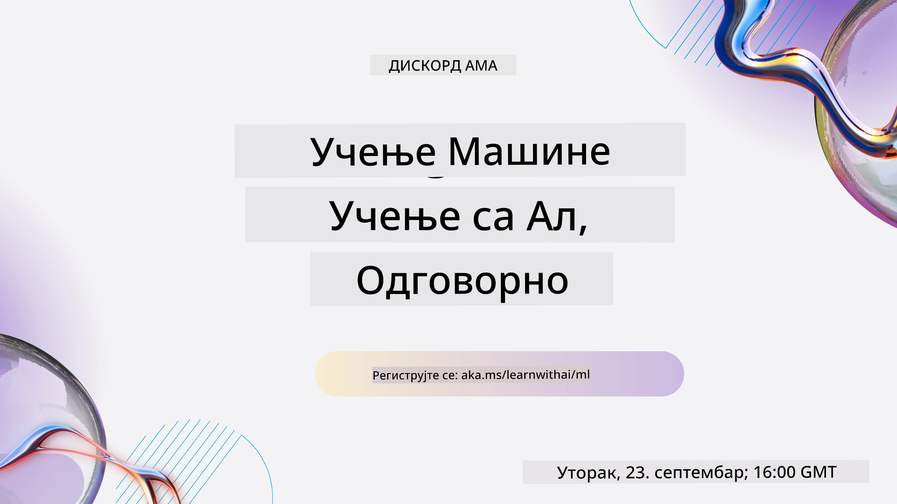
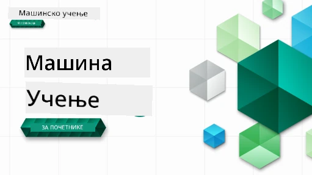

[](https://github.com/microsoft/ML-For-Beginners/blob/master/LICENSE)
[](https://GitHub.com/microsoft/ML-For-Beginners/graphs/contributors/)
[](https://GitHub.com/microsoft/ML-For-Beginners/issues/)
[](https://GitHub.com/microsoft/ML-For-Beginners/pulls/)
[](http://makeapullrequest.com)

[](https://GitHub.com/microsoft/ML-For-Beginners/watchers/)
[](https://GitHub.com/microsoft/ML-For-Beginners/network/)
[](https://GitHub.com/microsoft/ML-For-Beginners/stargazers/)

### 🌐 Подршка за више језика

#### Подржано преко GitHub акције (аутоматизовано и увек ажурно)

<!-- CO-OP TRANSLATOR LANGUAGES TABLE START -->
[Arabic](../ar/README.md) | [Bengali](../bn/README.md) | [Bulgarian](../bg/README.md) | [Burmese (Myanmar)](../my/README.md) | [Chinese (Simplified)](../zh-CN/README.md) | [Chinese (Traditional, Hong Kong)](../zh-HK/README.md) | [Chinese (Traditional, Macau)](../zh-MO/README.md) | [Chinese (Traditional, Taiwan)](../zh-TW/README.md) | [Croatian](../hr/README.md) | [Czech](../cs/README.md) | [Danish](../da/README.md) | [Dutch](../nl/README.md) | [Estonian](../et/README.md) | [Finnish](../fi/README.md) | [French](../fr/README.md) | [German](../de/README.md) | [Greek](../el/README.md) | [Hebrew](../he/README.md) | [Hindi](../hi/README.md) | [Hungarian](../hu/README.md) | [Indonesian](../id/README.md) | [Italian](../it/README.md) | [Japanese](../ja/README.md) | [Kannada](../kn/README.md) | [Khmer](../km/README.md) | [Korean](../ko/README.md) | [Lithuanian](../lt/README.md) | [Malay](../ms/README.md) | [Malayalam](../ml/README.md) | [Marathi](../mr/README.md) | [Nepali](../ne/README.md) | [Nigerian Pidgin](../pcm/README.md) | [Norwegian](../no/README.md) | [Persian (Farsi)](../fa/README.md) | [Polish](../pl/README.md) | [Portuguese (Brazil)](../pt-BR/README.md) | [Portuguese (Portugal)](../pt-PT/README.md) | [Punjabi (Gurmukhi)](../pa/README.md) | [Romanian](../ro/README.md) | [Russian](../ru/README.md) | [Serbian (Cyrillic)](./README.md) | [Slovak](../sk/README.md) | [Slovenian](../sl/README.md) | [Spanish](../es/README.md) | [Swahili](../sw/README.md) | [Swedish](../sv/README.md) | [Tagalog (Filipino)](../tl/README.md) | [Tamil](../ta/README.md) | [Telugu](../te/README.md) | [Thai](../th/README.md) | [Turkish](../tr/README.md) | [Ukrainian](../uk/README.md) | [Urdu](../ur/README.md) | [Vietnamese](../vi/README.md)

> **Волите да клонирате локално?**
>
> Ово складиште укључује преводе на више од 50 језика што знатно повећава величину преузимања. За клонирање без превода, користите sparse checkout:
>
> **Bash / macOS / Linux:**
> ```bash
> git clone --filter=blob:none --sparse https://github.com/microsoft/ML-For-Beginners.git
> cd ML-For-Beginners
> git sparse-checkout set --no-cone '/*' '!translations' '!translated_images'
> ```
>
> **CMD (Windows):**
> ```cmd
> git clone --filter=blob:none --sparse https://github.com/microsoft/ML-For-Beginners.git
> cd ML-For-Beginners
> git sparse-checkout set --no-cone "/*" "!translations" "!translated_images"
> ```
>
> Ово вам даје све што је потребно за завршетак курса уз много брже преузимање.
<!-- CO-OP TRANSLATOR LANGUAGES TABLE END -->

#### Придружите се нашој заједници

[](https://discord.gg/nTYy5BXMWG)

Имамо текућу серију на Discord-у "учење уз помоћ АИ", сазнајте више и придружите нам се на [Learn with AI Series](https://aka.ms/learnwithai/discord) од 18. до 30. септембра 2025. Добит ћете савете и трикове за коришћење GitHub Copilot-а за Data Science.



# Машинско учење за почетнике - Курикулум

> 🌍 Путујте око света док истражујемо машинско учење кроз светске културе 🌍

Cloud Advocates у Microsoft-у нуде 12-недељни, 26-часовни курикулум посвећен **Машинском учењу**. У овом курикулуму научићете оно што се понекад назива **класичним машинским учењем**, користећи претежно Scikit-learn библиотеку и избегавајући дубоко учење, које је обрађено у нашем [AI for Beginners' курикулуму](https://aka.ms/ai4beginners). Такође упарите ове лекције са нашим ['Data Science for Beginners' курикулумом](https://aka.ms/ds4beginners)!

Путујте са нама широм света док примењујемо ове класичне технике на податке из многих делова света. Свакa лекција садржи квиз пре и после лекције, писана упутства за завршетак лекције, решење, задатак и још много тога. Наша педагогија заснована на пројектима омогућава вам учење кроз израду, доказани начин да нове вештине заиста остану.

**✍️ Искрена захвалност нашим ауторима** Јен Лупер, Стивен Хауел, Франческа Лаззери, Томоми Имура, Кеси Бревију, Дмитриј Сошников, Крис Норинг, Анирбан Мукерџи, Орнела Алтуњан, Рут Јакубу и Ејми Бојд

**🎨 Захваљујемо се и нашим илустраторима** Томоми Имура, Дасани Мадипали и Јен Лупер

**🙏 Посебна захвалност 🙏 нашим Microsoft Student Ambassador ауторима, рецензентима и сарадницима на садржају**, нарочито Ришиту Даглију, Мухамаду Сакибу Хану Инану, Рохану Рају, Александру Петреску, Абхишеку Јајсвалу, Наврин Табасум, Јоану Самуила и Снигдхи Агарвал

**🤩 Додатна захвалност Microsoft Student Ambassadors Ерику Ванџау, Јаслин Сонди и Видуши Гупти за наше R лекције!**

# Почетак рада

Пратите ове кораке:
1. **Форк овог репозиторијума**: Кликните на дугме "Fork" у горњем десном углу ове странице.
2. **Клонирајте репозиторијум**:   `git clone https://github.com/microsoft/ML-For-Beginners.git`

> 💡 **Савет за брз почетак:** Желите да почнете у прегледачу без подешавања Питхона на локалном уређају? Користите [GitHub Codespaces](https://github.com/features/codespaces) да креирате cloud окружење за развој за свој форк. Отворите зелени мени **Code**, изаберите **Codespaces**, и направите нови codespace; инсталирајте потребне зависности за сваку лекцију по потреби.

> [пронађите све додатне ресурсе за овај курс у нашој Microsoft Learn колекцији](https://learn.microsoft.com/en-us/collections/qrqzamz1nn2wx3?WT.mc_id=academic-77952-bethanycheum)

> 🔧 **Треба вам помоћ?** Погледајте наш [Водич за решавање проблема](TROUBLESHOOTING.md) за решења уобичајених проблема са инсталацијом, подешавањем и покретањем лекција.


**[Студенти](https://aka.ms/student-page)**, за коришћење овог курикулума, форкујте цео репо на свој GitHub налог и завршите вежбе сами или у групи:

- Почните са квизом пре предавања.
- Прочитајте предавање и завршите активности, правећи паузе и размишљајући о сваком проверавњу знања.
- Покушајте направити пројекте самостално разумевајући лекције, а не само покретањем кода решења; ипак, тај код је доступан у `/solution` фолдерима у свакој лекцији заснованој на пројекту.
- Урадите квиз након предавања.
- Завршите изазов.
- Завршите задатак.
- Након завршетка групе лекција, посетите [Discussion Board](https://github.com/microsoft/ML-For-Beginners/discussions) и „учите гласно“ попуњавајући одговарајућу PAT рубрику. 'PAT' је алат за процену напретка, рубрика коју попуњавате за даље учење. Такође можете реаговати на друге PAT-ове да бисмо учили заједно.

> За додатно учење препоручујемо пратите ове [Microsoft Learn](https://docs.microsoft.com/en-us/users/jenlooper-2911/collections/k7o7tg1gp306q4?WT.mc_id=academic-77952-leestott) модуле и ученичке путање.

**Наставници**, укључили смо [неке предлоге](for-teachers.md) како користити овај курикулум.

---

## Видео прегледи

Неке лекције су доступне као кратки видео снимци. Све их можете пронаћи у линији унутар лекција или на [ML for Beginners плејлисти на Microsoft Developer YouTube каналу](https://aka.ms/ml-beginners-videos) кликом на слику испод.

[](https://aka.ms/ml-beginners-videos)

---

## Упознајте тим

[](https://youtu.be/Tj1XWrDSYJU)

**Гиф од** [Mohit Jaisal](https://linkedin.com/in/mohitjaisal)

> 🎥 Кликните на горњу слику за видео о пројекту и људима који су га направили!

---

## Педагогија

Док смо градили овај курикулум, изабрали смо два педагошка принципа: осигурати да је практичан и **базиран на пројектима** и да укључује **честе квизове**. Поред тога, овај курикулум има заједничку **тему** да му да кохерентност.

Осигуравањем да садржај одговара пројектима, процес је занимљивији за студенте и концепти ће се боље задржати. Поред тога, квиз унапред поставља намеру студента ка учењу теме, а други квиз након часа осигурава даље задржавање знања. Овај курикулум је дизајниран да буде флексибилан и забаван и може се радити у целини или делимично. Пројекти почињу једноставно и постају све сложенији током 12-недељног циклуса. Курикулум такође садржи завршни део о стварним примени машинског учења, који може бити коришћен као додатни бод или као основа за дискусију.

> Пронађите наш [Кодекс понашања](CODE_OF_CONDUCT.md), [Како допринети](CONTRIBUTING.md), [Преводи](..) и [Водич за решавање проблема](TROUBLESHOOTING.md). Добродошле су ваше конструктивне повратне информације!

## Свaка лекција укључује

- опциони скичнот
- опциони додатни видео
- видео преглед (само неке лекције)
- [квиз за загревање пре предавања](https://ff-quizzes.netlify.app/en/ml/)
- писану лекцију
- за лекције засноване на пројектима, корак-по-корак упутства како направити пројекат
- провере знања
- изазов
- додатно читање
- задатак
- [квиз након предавања](https://ff-quizzes.netlify.app/en/ml/)

> **Напомена о језицима**: Ове лекције су углавном написане на Python-у, али многе су доступне и у R-у. За завршетак R лекције идите у `/solution` фолдер и потражите R лекције. Оне укључују .rmd екстензију која представља **R Markdown** фајл, што се може једноставно дефинисати као уграђивање `кодних блокова` (R или других језика) и `YAML хедера` (који води како форматирати излазе као PDF) у `Markdown документ`. Као таква, служи као одличан ауторски оквир за науку о подацима јер вам омогућава да комбинујете свој код, његов излаз и своје мисли тако што их записујете у Markdown-у. Поред тога, R Markdown документи могу бити рендеровани у форматима као што су PDF, HTML или Word.

> **Напомена о квизовима**: Сви квизови су садржани у [Quiz App фасцикли](../../quiz-app), укупно 52 квиза са по три питања. Они су линковани из лекција али Quiz App се може покренути и локално; пратите упутства у `quiz-app` фолдеру да га локално хостирате или деплојујете на Azure.

| Број лекције |                             Тема                              |                   Груписање лекција                   | Циљеви учења                                                                                                             |                                                              Повезана лекција                                                               |                        Аутор                        |
| :-----------: | :------------------------------------------------------------: | :-------------------------------------------------: | ------------------------------------------------------------------------------------------------------------------------------- | :--------------------------------------------------------------------------------------------------------------------------------------: | :--------------------------------------------------: |
|      01       |                 Увод у машинско учење                       |      [Introduction](1-Introduction/README.md)       | Научите основне појмове иза машинског учења                                                                                      |                                             [Lesson](1-Introduction/1-intro-to-ML/README.md)                                             |                       Мухаммад                        |
|      02       |                  Историја машинског учења                   |      [Introduction](1-Introduction/README.md)       | Научите историју која стоји иза ове области                                                                                      |                                            [Lesson](1-Introduction/2-history-of-ML/README.md)                                            |                     Џен и Ејми                        |
|      03       |             Праведност и машинско учење                      |      [Introduction](1-Introduction/README.md)       | Која су важна филозофска питања око праведности која студенти треба да размотре приликом прављења и примене МЛ модела?            |                                              [Lesson](1-Introduction/3-fairness/README.md)                                               |                        Томоми                        |
|      04       |              Технике за машинско учење                       |      [Introduction](1-Introduction/README.md)       | Које технике истраживачи МЛ користе за израду МЛ модела?                                                                          |                                          [Lesson](1-Introduction/4-techniques-of-ML/README.md)                                           |                    Крис и Џен                       |
|      05       |                 Увод у регресију                             |        [Regression](2-Regression/README.md)         | Почните са Питоном и Scikit-learn за регресионе моделе                                                                           |         [Python](2-Regression/1-Tools/README.md) • [R](../../2-Regression/1-Tools/solution/R/lesson_1.html)         |      Џен • Ерик Вањау       |
|      06       |              Цена бундеве у Северној Америци 🎃              |        [Regression](2-Regression/README.md)         | Визуелизујте и очистите податке као припрему за МЛ                                                                                |          [Python](2-Regression/2-Data/README.md) • [R](../../2-Regression/2-Data/solution/R/lesson_2.html)          |      Џен • Ерик Вањау       |
|      07       |              Цена бундеве у Северној Америци 🎃              |        [Regression](2-Regression/README.md)         | Направите линеарне и полиномијалне регресионе моделе                                                                               |        [Python](2-Regression/3-Linear/README.md) • [R](../../2-Regression/3-Linear/solution/R/lesson_3.html)        |      Џен и Дмитриј • Ерик Вањау       |
|      08       |              Цена бундеве у Северној Америци 🎃              |        [Regression](2-Regression/README.md)         | Направите логистичку регресију                                                                                                   |     [Python](2-Regression/4-Logistic/README.md) • [R](../../2-Regression/4-Logistic/solution/R/lesson_4.html)      |      Џен • Ерик Вањау       |
|      09       |                         Веб апликација 🔌                    |           [Web App](3-Web-App/README.md)            | Направите веб апликацију да бисте користили свој тренирани модел                                                                  |                                                 [Python](3-Web-App/1-Web-App/README.md)                                                  |                         Џен                          |
|      10       |                 Увод у класификацију                         |    [Classification](4-Classification/README.md)     | Очистите, припремите и визуелизујте своје податке; увod у класификацију                                                           | [Python](4-Classification/1-Introduction/README.md) • [R](../../4-Classification/1-Introduction/solution/R/lesson_10.html)  | Џен и Кеси • Ерик Вањау |
|      11       |            Укусна азијска и индијска кухиња 🍜              |    [Classification](4-Classification/README.md)     | Увод у класификаторе                                                                                                             | [Python](4-Classification/2-Classifiers-1/README.md) • [R](../../4-Classification/2-Classifiers-1/solution/R/lesson_11.html) | Џен и Кеси • Ерик Вањау |
|      12       |            Укусна азијска и индијска кухиња 🍜              |    [Classification](4-Classification/README.md)     | Више класификатора                                                                                                               | [Python](4-Classification/3-Classifiers-2/README.md) • [R](../../4-Classification/3-Classifiers-2/solution/R/lesson_12.html) | Џен и Кеси • Ерик Вањау |
|      13       |            Укусна азијска и индијска кухиња 🍜              |    [Classification](4-Classification/README.md)     | Направите препоручивачку веб апликацију користећи свој модел                                                                       |                                              [Python](4-Classification/4-Applied/README.md)                                              |                         Џен                          |
|      14       |                   Увод у кластерирање                         |        [Clustering](5-Clustering/README.md)         | Очистите, припремите и визуелизујте своје податке; Увод у кластерирање                                                           |         [Python](5-Clustering/1-Visualize/README.md) • [R](../../5-Clustering/1-Visualize/solution/R/lesson_14.html)         |      Џен • Ерик Вањау       |
|      15       |             Истраживање музичких укуса Нигерије 🎧            |        [Clustering](5-Clustering/README.md)         | Истражите K-Means кластерирање                                                                                                   |           [Python](5-Clustering/2-K-Means/README.md) • [R](../../5-Clustering/2-K-Means/solution/R/lesson_15.html)           |      Џен • Ерик Вањау       |
|      16       |          Увод у обраду природног језика ☕️                  |   [Natural language processing](6-NLP/README.md)    | Научите основе о NLP правећи једноставног бота                                                                                   |                                             [Python](6-NLP/1-Introduction-to-NLP/README.md)                                              |                       Стивен                        |
|      17       |                     Уобичајени задаци у NLP ☕️                |   [Natural language processing](6-NLP/README.md)    | Продубите своје знање о NLP разумевањем уобичајених задатака у раду са језичким структурама                                        |                                                    [Python](6-NLP/2-Tasks/README.md)                                                     |                       Стивен                        |
|      18       |             Превођење и анализа сентимента ♥️                |   [Natural language processing](6-NLP/README.md)    | Превођење и анализа сентимента са Џејн Остин                                                                                     |                                            [Python](6-NLP/3-Translation-Sentiment/README.md)                                             |                       Стивен                        |
|      19       |                Романтични хотели Европе ♥️                   |   [Natural language processing](6-NLP/README.md)    | Анализа сентимента са рецензијама хотела 1                                                                                       |                                               [Python](6-NLP/4-Hotel-Reviews-1/README.md)                                                |                       Стивен                        |
|      20       |                Романтични хотели Европе ♥️                   |   [Natural language processing](6-NLP/README.md)    | Анализа сентимента са рецензијама хотела 2                                                                                       |                                               [Python](6-NLP/5-Hotel-Reviews-2/README.md)                                                |                       Стивен                        |
|      21       |            Увод у прогнозирање временских серија            |        [Time series](7-TimeSeries/README.md)        | Увод у прогнозирање временских серија                                                                                           |                                             [Python](7-TimeSeries/1-Introduction/README.md)                                              |                      Франческа                       |
|      22       | ⚡️ Потрошња електричне енергије у свету ⚡️ - прогнозирање временских серија са ARIMA |        [Time series](7-TimeSeries/README.md)        | Прогнозирање временских серија са ARIMA                                                                                          |                                                 [Python](7-TimeSeries/2-ARIMA/README.md)                                                 |                      Франческа                       |
|      23       |  ⚡️ Потрошња електричне енергије у свету ⚡️ - прогнозирање временских серија са SVR  |        [Time series](7-TimeSeries/README.md)        | Прогнозирање временских серија са Support Vector Regressor                                                                       |                                                  [Python](7-TimeSeries/3-SVR/README.md)                                                  |                       Анирбан                        |
|      24       |             Увод у појачано учење                             | [Reinforcement learning](8-Reinforcement/README.md) | Увод у појачано учење са Q-Learning                                                                                              |                                             [Python](8-Reinforcement/1-QLearning/README.md)                                              |                        Дмитриј                        |
|      25       |                Помозите Питеру да избегне вука! 🐺            | [Reinforcement learning](8-Reinforcement/README.md) | Гим за појачано учење                                                                                                            |                                                [Python](8-Reinforcement/2-Gym/README.md)                                                 |                        Дмитриј                        |
|  Postscript   |          Реални сценарији и примене машинског учења          |      [ML in the Wild](9-Real-World/README.md)       | Интересантне и откривајуће примене класичног МЛ у стварном свету                                                                  |                                             [Lesson](9-Real-World/1-Applications/README.md)                                              |                         Тим                          |
|  Postscript   |          Дебаговање модела у МЛ помоћу RAI контролне табле    |      [ML in the Wild](9-Real-World/README.md)       | Дебаговање модела у машинском учењу користећи компоненте Responsible AI контролне табле                                            |                                             [Lesson](9-Real-World/2-Debugging-ML-Models/README.md)                                              |                     Рут Јакубу                      |

> [пронађите све додатне ресурсе за овај курс у нашој колекцији Microsoft Learn](https://learn.microsoft.com/en-us/collections/qrqzamz1nn2wx3?WT.mc_id=academic-77952-bethanycheum)

## Оффлине приступ

Можете покретати ову документацију оффлине користећи [Docsify](https://docsify.js.org/#/). Форкујте овај репозиторијум, [инсталирајте Docsify](https://docsify.js.org/#/quickstart) на вашем локалном рачунару, а затим у коренском фолдеру овог репозиторијума укуцајте `docsify serve`. Веб сајт ће бити доступан на порту 3000 на вашем localhost-у: `localhost:3000`.

## PDF-ови

Пронађите pdf програм курса са линковима [овде](https://microsoft.github.io/ML-For-Beginners/pdf/readme.pdf).


## 🎒 Други курсеви 

Наш тим производи и друге курсеве! Погледајте:

<!-- CO-OP TRANSLATOR OTHER COURSES START -->
### LangChain
[](https://aka.ms/langchain4j-for-beginners)
[](https://aka.ms/langchainjs-for-beginners?WT.mc_id=m365-94501-dwahlin)
[](https://github.com/microsoft/langchain-for-beginners?WT.mc_id=m365-94501-dwahlin)
---

### Azure / Edge / MCP / Агенти
[](https://github.com/microsoft/AZD-for-beginners?WT.mc_id=academic-105485-koreyst)
[](https://github.com/microsoft/edgeai-for-beginners?WT.mc_id=academic-105485-koreyst)
[](https://github.com/microsoft/mcp-for-beginners?WT.mc_id=academic-105485-koreyst)
[](https://github.com/microsoft/ai-agents-for-beginners?WT.mc_id=academic-105485-koreyst)

---
 
### Серия генеративне вештачке интелигенције
[](https://github.com/microsoft/generative-ai-for-beginners?WT.mc_id=academic-105485-koreyst)
[-9333EA?style=for-the-badge&labelColor=E5E7EB&color=9333EA)](https://github.com/microsoft/Generative-AI-for-beginners-dotnet?WT.mc_id=academic-105485-koreyst)
[-C084FC?style=for-the-badge&labelColor=E5E7EB&color=C084FC)](https://github.com/microsoft/generative-ai-for-beginners-java?WT.mc_id=academic-105485-koreyst)
[-E879F9?style=for-the-badge&labelColor=E5E7EB&color=E879F9)](https://github.com/microsoft/generative-ai-with-javascript?WT.mc_id=academic-105485-koreyst)

---
 
### Основно учење
[](https://aka.ms/ml-beginners?WT.mc_id=academic-105485-koreyst)
[](https://aka.ms/datascience-beginners?WT.mc_id=academic-105485-koreyst)
[](https://aka.ms/ai-beginners?WT.mc_id=academic-105485-koreyst)
[](https://github.com/microsoft/Security-101?WT.mc_id=academic-96948-sayoung)
[](https://aka.ms/webdev-beginners?WT.mc_id=academic-105485-koreyst)
[](https://aka.ms/iot-beginners?WT.mc_id=academic-105485-koreyst)
[](https://github.com/microsoft/xr-development-for-beginners?WT.mc_id=academic-105485-koreyst)

---
 
### Копилот серија
[](https://aka.ms/GitHubCopilotAI?WT.mc_id=academic-105485-koreyst)
[](https://github.com/microsoft/mastering-github-copilot-for-dotnet-csharp-developers?WT.mc_id=academic-105485-koreyst)
[](https://github.com/microsoft/CopilotAdventures?WT.mc_id=academic-105485-koreyst)
<!-- CO-OP TRANSLATOR OTHER COURSES END -->

## Добијање помоћи

Ако сте запели или имате питања током учења машинског учења или прављења AI апликација, не брините — помоћ је доступна.

Можете се придружити дискусијама са другим полазницима и програмерима, постављати питања и делити своје идеје са заједницом.

- Придружите се заједници да бисте постављали питања и учили са другима
- Разговарајте о концептима машинског учења и идејама пројеката
- Добите смернице од искусних програмера

Подршка заједнице је одличан начин да унапредите своје вештине и брже решавате проблеме.

[Microsoft Foundry Discord Community](https://discord.gg/nTYy5BXMWG)

Ако наиђете на грешке или имате предлоге за побољшања, можете отворити **Issue** у овом репозиторијуму да пријавите проблем.

За повратне информације о производу или претрагу постојећих постова у заједници, посетите Developer Forum:

[](https://aka.ms/foundry/forum)

## Додатни савети за учење

- Прегледајте записнике после сваке лекције за боље разумевање.
- Вежбајте самостално имплементацију алгоритама.
- Истражујте стварне скупове података користећи научене концепте.

---

<!-- CO-OP TRANSLATOR DISCLAIMER START -->
**Изјава о одрицању одговорности**:
Овај документ је преведен коришћењем услуге за аутоматски превод [Co-op Translator](https://github.com/Azure/co-op-translator). Иако тежимо тачности, имајте у виду да аутоматски преводи могу садржати грешке или нетачности. Оригинални документ на његовом изворном језику треба сматрати ауторитативним извором. За критичне информације препоручује се професионални људски превод. Нисмо одговорни за било каква неспоразума или погрешна тумачења која произилазе из коришћења овог превода.
<!-- CO-OP TRANSLATOR DISCLAIMER END -->