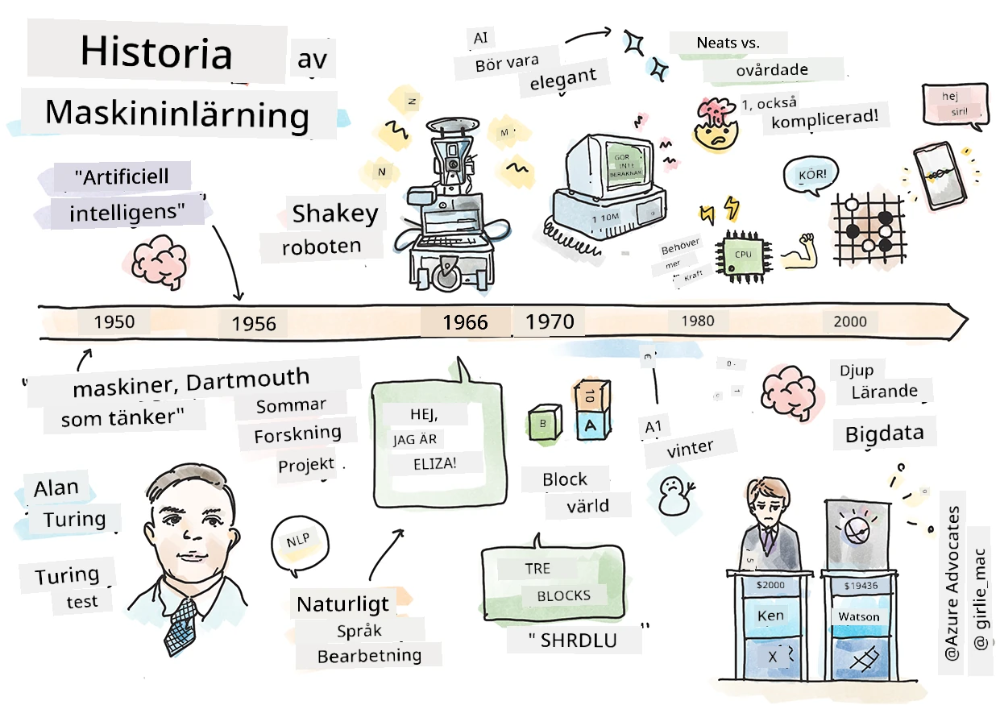
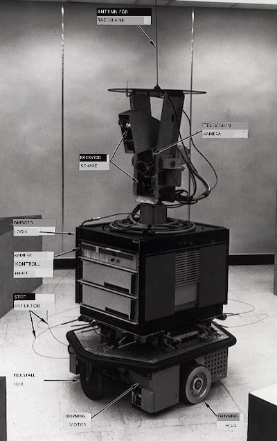
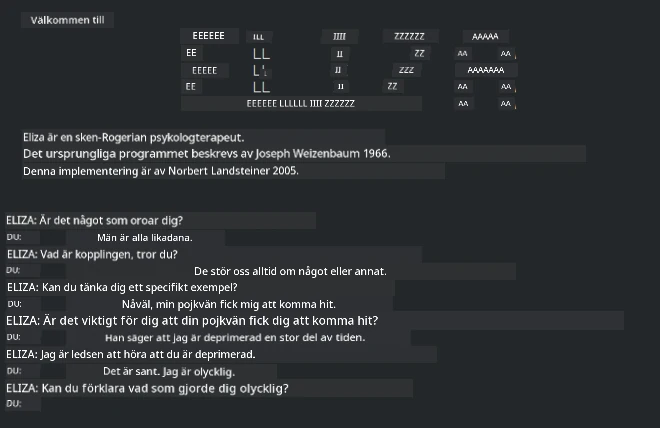

# Historien om maskininlärning

> Sketchnote av [Tomomi Imura](https://www.twitter.com/girlie_mac)

## [Quiz före föreläsningen](https://ff-quizzes.netlify.app/en/ml/)

---

> 🎥 Klicka på bilden ovan för en kort video som går igenom denna lektion.

I denna lektion går vi igenom de stora milstolparna i maskininlärningens och artificiell intelligens historia.

Historien om artificiell intelligens (AI) som ett fält är sammanflätad med maskininlärningens historia, eftersom de algoritmer och beräkningsframsteg som ligger till grund för ML bidrog till utvecklingen av AI. Det är bra att komma ihåg att även om dessa områden som särskilda forskningsfält började kristalliseras på 1950-talet, fanns viktiga [algoritmiska, statistiska, matematiska, beräknings- och tekniska upptäckter](https://wikipedia.org/wiki/Timeline_of_machine_learning) redan innan och överlappade denna era. Faktum är att människor har funderat över dessa frågor i [hundratals år](https://wikipedia.org/wiki/History_of_artificial_intelligence): denna artikel diskuterar de historiska intellektuella grunderna för idén om en ”tänkande maskin.”

---
## Noterbara upptäckter

- 1763, 1812 [Bayes sats](https://wikipedia.org/wiki/Bayes%27_theorem) och dess föregångare. Denna sats och dess tillämpningar utgör grunden för inferens och beskriver sannolikheten för att en händelse inträffar baserat på tidigare kunskap.
- 1805 [Minsta kvadratmetoden](https://wikipedia.org/wiki/Least_squares) av den franske matematikern Adrien-Marie Legendre. Denna teori, som du kommer att lära dig om i vår avsnitt om Regression, hjälper till med datatanpassning.
- 1913 [Markovkedjor](https://wikipedia.org/wiki/Markov_chain), uppkallade efter den ryske matematikern Andrey Markov, används för att beskriva en följd av möjliga händelser baserat på ett tidigare tillstånd.
- 1957 [Perceptron](https://wikipedia.org/wiki/Perceptron) är en typ av linjär klassificerare uppfunnen av den amerikanske psykologen Frank Rosenblatt, som ligger till grund för framsteg inom djupinlärning.

---

- 1967 [Närmaste granne](https://wikipedia.org/wiki/Nearest_neighbor) är en algoritm ursprungligen utformad för att kartlägga rutter. Inom ML används den för att upptäcka mönster.
- 1970 [Backpropagation](https://wikipedia.org/wiki/Backpropagation) används för att träna [feedforward neurala nätverk](https://wikipedia.org/wiki/Feedforward_neural_network).
- 1982 [Recurrent Neural Networks (återkommande neurala nätverk)](https://wikipedia.org/wiki/Recurrent_neural_network) är artificiella neurala nätverk härledda från feedforward-neurala nätverk som skapar temporala grafer.

✅ Gör lite egen research. Vilka andra datum är viktiga i ML:s och AI:s historia?

---
## 1950: Maskiner som tänker

Alan Turing, en verkligt anmärkningsvärd person som [av allmänheten 2019](https://wikipedia.org/wiki/Icons:_The_Greatest_Person_of_the_20th_Century) röstades fram som 1900-talets största vetenskapsman, tillskrivs äran att ha hjälpt till att lägga grunden för konceptet en 'maskin som kan tänka.' Han kämpade med tvivlare och sin egen behov av empiriska bevis för detta koncept delvis genom att skapa [Turing-testet](https://www.bbc.com/news/technology-18475646), som du kommer att utforska i våra NLP-lektioner.

---
## 1956: Dartmouth Summer Research Project

”Dartmouth Summer Research Project on artificial intelligence var en banbrytande händelse för artificiell intelligens som forskningsfält,” och det var här termen ”artificiell intelligens” myntades ([källa](https://250.dartmouth.edu/highlights/artificial-intelligence-ai-coined-dartmouth)).

> Varje aspekt av lärande eller någon annan funktion av intelligens kan i princip beskrivas så precist att en maskin kan skapas för att simulera det.

---

Den ledande forskaren, matematikprofessorn John McCarthy, hoppades ”att fortsätta med antagandet att varje aspekt av lärande eller annan funktion av intelligens i princip kan beskrivas så precist att en maskin kan skapas för att simulera detta.” Deltagarna inkluderade en annan framstående person inom området, Marvin Minsky.

Workshoppen anses ha initierat och uppmuntrat flera diskussioner inklusive ”uppkomsten av symboliska metoder, system fokuserade på begränsade domäner (tidiga expertsystem) och deduktiva system kontra induktiva system.” ([källa](https://wikipedia.org/wiki/Dartmouth_workshop)).

---
## 1956 - 1974: ”De gyllene åren”

Från 1950-talet fram till mitten av 70-talet var optimismen hög med hopp om att AI kunde lösa många problem. 1967 uttalade Marvin Minsky sig självsäkert att ”Inom en generation ... kommer problemet att skapa ’artificiell intelligens’ i stort sett att vara löst.” (Minsky, Marvin (1967), Computation: Finite and Infinite Machines, Englewood Cliffs, N.J.: Prentice-Hall)

Forskningen inom naturlig språkbehandling blomstrade, sökmetoder förfinades och gjordes kraftfullare, och konceptet ’mikrovärldar’ skapades där enkla uppgifter kunde lösas med rena språkinstruktioner.

---

Forskningen finansierades väl av statliga myndigheter, framsteg gjordes inom beräkningar och algoritmer och prototyper av intelligenta maskiner byggdes. Några av dessa maskiner inkluderar:

* [Shakey roboten](https://wikipedia.org/wiki/Shakey_the_robot), som kunde manövrera och själv avgöra hur uppgifter skulle utföras ’intelligent’.

    
    > Shakey år 1972

---

* Eliza, en tidig ’chatterbot’, kunde samtala med människor och fungera som en primitiv ’terapeut’. Du kommer att lära dig mer om Eliza i NLP-lektionerna.

    
    > En version av Eliza, en chatbot

---

* ”Blockvärlden” var ett exempel på en mikrovärld där block kunde staplas och sorteras och experiment i att lära maskiner fatta beslut kunde testas. Framsteg med bibliotek som [SHRDLU](https://wikipedia.org/wiki/SHRDLU) hjälpte till att driva språkbehandling framåt.

    

    > 🎥 Klicka på bilden ovan för en video: Blockvärlden med SHRDLU

---
## 1974 - 1980: ”AI Vinter”

I mitten av 1970-talet blev det tydligt att komplexiteten i att skapa ’intelligenta maskiner’ hade underskattats och att löftet, med den tillgängliga beräkningskraften, hade överskattats. Finansieringen sinade och förtroendet för området avtog. Några problem som påverkade förtroendet inkluderade:
---
- **Begränsningar**. Beräkningskraften var för begränsad.
- **Kombinatorisk explosion**. Antalet parametrar som behövde tränas ökade exponentiellt när mer krävdes av datorerna, utan en parallell utveckling av beräkningskraft och kapacitet.
- **Brist på data**. Det fanns en brist på data som hindrade processen att testa, utveckla och förbättra algoritmerna.
- **Ställer vi rätt frågor?**. De frågor som ställdes började ifrågasättas. Forskare fick kritik för sina angreppssätt:
  - Turing-testet ifrågasattes, bland annat genom ’kinesiska rummet-teorin’ som hävdade att ”programmering av en digital dator kan få det att verka som att datorn förstår språk men kan inte producera verklig förståelse.” ([källa](https://plato.stanford.edu/entries/chinese-room/))
  - Etiken kring att introducera artificiella intelligenser som ”terapeuten” ELIZA i samhället utmanades.

---

Samtidigt började olika AI-skolor bildas. En dikotomi skapades mellan ["otämjd" och "prydlig AI"](https://wikipedia.org/wiki/Neats_and_scruffies). _Otämjda_ laboratorier tweekade program i timmar tills önskat resultat uppnåddes. _Prydlig_ laboratorier ”fokuserade på logik och formellt problemlösande”. ELIZA och SHRDLU var kända _otämjda_ system. Under 1980-talet, när kravet blev att göra ML-system reproducerbara, tog _prydlig_ metoden successivt ledningen eftersom dess resultat är mer förklarliga.

---
## 1980-talets expertsystem

När området växte blev dess nytta för affärslivet tydligare, och på 1980-talet ökade även spridningen av ’expertsystem’. ”Expertsystem var bland de första verkliga framgångsrika formerna av mjukvara för artificiell intelligens (AI).” ([källa](https://wikipedia.org/wiki/Expert_system)).

Denna typ av system är faktiskt _hybrid_, bestående delvis av en regelmotor som definierar affärskrav och en inferensmotor som använder regelsystemet för att härleda nya fakta.

Denna era såg också ökat fokus på neurala nätverk.

---
## 1987 - 1993: AI 'Chill'

Spridningen av specialiserad expertsystem-hårdvara hade den olyckliga effekten att den blev för specialiserad. Uppkomsten av persondatorer konkurrerade också med dessa stora, specialiserade, centraliserade system. Demokratiseringen av databehandling hade börjat och banade slutligen väg för den moderna explosionen av big data.

---
## 1993 - 2011

Denna epok innebar en ny era för ML och AI att kunna lösa vissa av de problem som tidigare orsakats av brist på data och beräkningskraft. Mängden data började snabbt öka och bli mer tillgänglig, till det bättre och sämre, särskilt med smarttelefonens framväxt omkring 2007. Beräkningskraften expanderade exponentiellt och algoritmer utvecklades parallellt. Fältet började mogna när de fria dagarna förflöt till en verklig disciplin.

---
## Nu

Idag berör maskininlärning och AI nästan varje del av våra liv. Denna era kräver noggrann förståelse av risker och potentiella effekter av dessa algoritmer på människors liv. Som Microsofts Brad Smith sagt: ”Informationsteknologi väcker frågor som går till kärnan i grundläggande mänskliga rättighetsskydd som integritet och yttrandefrihet. Dessa frågor ökar ansvaret för teknikföretag som skapar dessa produkter. Enligt vår mening kräver de också genomtänkt statlig reglering och utveckling av normer för acceptabla användningar” ([källa](https://www.technologyreview.com/2019/12/18/102365/the-future-of-ais-impact-on-society/)).

---

Det återstår att se vad framtiden har att erbjuda, men det är viktigt att förstå dessa datasystem och den mjukvara och de algoritmer de kör. Vi hoppas att detta kursmaterial hjälper dig att få en bättre förståelse så att du själv kan ta ställning.

> 🎥 Klicka på bilden ovan för en video: Yann LeCun diskuterar historien om djupinlärning i denna föreläsning

---
## 🚀Utmaning

Fördjupa dig i ett av dessa historiska ögonblick och lär dig mer om personerna bakom dem. Det finns fascinerande karaktärer och ingen vetenskaplig upptäckt skapas någonsin i ett kulturellt vakuum. Vad upptäcker du?

## [Quiz efter föreläsningen](https://ff-quizzes.netlify.app/en/ml/)

---
## Repetition & Självstudier

Här är saker att titta på och lyssna till:

[Denna podcast där Amy Boyd diskuterar AI:s utveckling](http://runasradio.com/Shows/Show/739)

---

## Uppgift

[Skapa en tidslinje](assignment.md)

---

<!-- CO-OP TRANSLATOR DISCLAIMER START -->
**Ansvarsfriskrivning**:
Detta dokument har översatts med hjälp av AI-översättningstjänsten [Co-op Translator](https://github.com/Azure/co-op-translator). Även om vi strävar efter noggrannhet, var vänlig notera att automatiska översättningar kan innehålla fel eller brister. Det ursprungliga dokumentet på dess modersmål bör betraktas som den auktoritativa källan. För kritisk information rekommenderas professionell mänsklig översättning. Vi ansvarar inte för några missförstånd eller feltolkningar som uppstår till följd av användningen av denna översättning.
<!-- CO-OP TRANSLATOR DISCLAIMER END -->