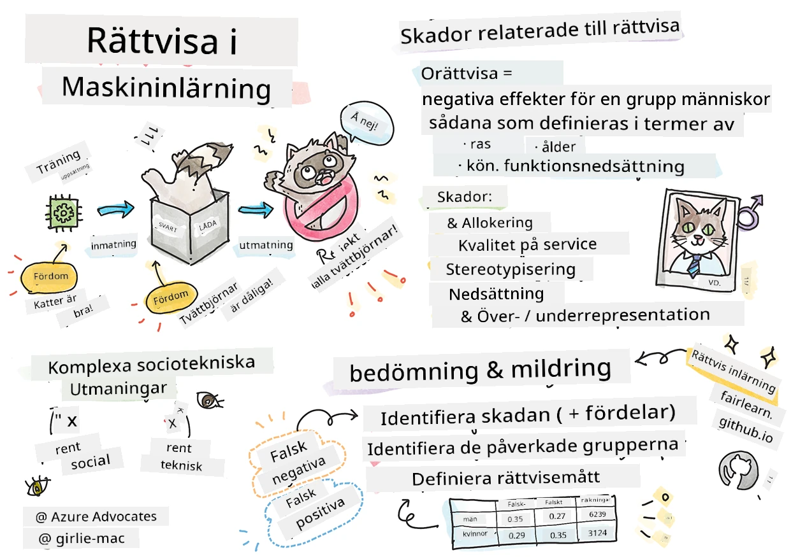

# Bygga maskininlärningslösningar med ansvarsfull AI
 

> Sketchnote av [Tomomi Imura](https://www.twitter.com/girlie_mac)

## [Förföreläsningsquiz](https://ff-quizzes.netlify.app/en/ml/)
 
## Introduktion

I denna kursplan kommer du att börja upptäcka hur maskininlärning kan och påverkar våra vardagsliv. Redan nu är system och modeller involverade i dagliga beslutsuppgifter, såsom vårddiagnoer, låneansökningar eller bedrägeridetektering. Så det är viktigt att dessa modeller fungerar bra för att leverera resultat som är pålitliga. Precis som vilken programvara som helst kommer AI-system att missa förväntningar eller ha oönskade resultat. Därför är det avgörande att kunna förstå och förklara beteendet hos en AI-modell.

Föreställ dig vad som kan hända när de data du använder för att bygga dessa modeller saknar vissa demografiska grupper, såsom ras, kön, politisk åsikt, religion, eller oproportionerligt representerar sådana grupper. Vad händer när modellens resultat tolkas för att gynna någon demografisk grupp? Vad är konsekvensen för applikationen? Dessutom, vad händer när modellen ger ett negativt resultat som skadar människor? Vem är ansvarig för AI-systemets beteende? Det är några frågor vi kommer att utforska i denna kursplan.

I denna lektion kommer du att:

- Öka din medvetenhet om vikten av rättvisa i maskininlärning och skador relaterade till rättvisa.
- Bli bekant med övningen att utforska avvikare och ovanliga scenarier för att säkerställa tillförlitlighet och säkerhet
- Få förståelse för behovet att ge alla kraft genom att designa inkluderande system
- Utforska hur viktigt det är att skydda integritet och säkerhet för data och människor
- Se vikten av att ha en glaslåda-ansats för att förklara beteendet hos AI-modeller
- Vara medveten om hur ansvar är avgörande för att bygga förtroende för AI-system

## Förkunskaper

Som förkunskap, vänligen genomför "Principerna för ansvarsfull AI"-lärvägen och titta på videon nedan om ämnet:

Lär dig mer om ansvarfull AI genom att följa denna [Lärväg](https://docs.microsoft.com/learn/modules/responsible-ai-principles/?WT.mc_id=academic-77952-leestott)

> 🎥 Klicka på bilden ovan för en video: Microsofts ansats till ansvarsfull AI

## Rättvisa

AI-system bör behandla alla rättvist och undvika att påverka liknande grupper av människor på olika sätt. Till exempel, när AI-system ger vägledning om medicinsk behandling, låneansökningar eller anställning bör de ge samma rekommendationer till alla med liknande symtom, ekonomiska omständigheter eller yrkesmässiga kvalifikationer. Var och en av oss människor bär på ärvda fördomar som påverkar våra beslut och handlingar. Dessa fördomar kan vara uppenbara i de data som vi använder för att träna AI-system. Sådana manipulationer kan ibland ske omedvetet. Det är ofta svårt att medvetet veta när man introducerar bias i data.

**"Orättvisa"** omfattar negativa effekter eller "skador" för en grupp människor, såsom de definierade utifrån ras, kön, ålder eller funktionshinder. De huvudsakliga rättviserelaterade skadorna kan klassificeras som:

- **Tilldelning**, om ett kön eller en etnicitet till exempel gynnas över en annan.
- **Tjänstekvalitet**. Om du tränar data för ett specifikt scenario men verkligheten är mycket mer komplex, leder det till en dålig fungerande tjänst. Till exempel en handtvålsdispenser som inte tycktes kunna känna av människor med mörk hud. [Referens](https://gizmodo.com/why-cant-this-soap-dispenser-identify-dark-skin-1797931773)
- **Nedsättning**. Att orättvist kritisera och etikettera något eller någon. Till exempel felmärkning av bilder på mörkhyade personer som gorillor av en bildmärkningsteknik.
- **Över- eller underrepresentation**. Idén är att en viss grupp inte syns inom ett visst yrke, och varje tjänst eller funktion som fortsätter att främja detta bidrar till skada.
- **Stereotypisering**. Att koppla en given grupp med förutbestämda attribut. Till exempel kan ett språköversättningssystem mellan engelska och turkiska ha felaktigheter på grund av ord med stereotypa könsassociationer.

> översättning till turkiska

> översättning tillbaka till engelska

När man designar och testar AI-system behöver vi säkerställa att AI är rättvist och inte programmerat att fatta partiska eller diskriminerande beslut, vilka människor också är förbjudna att fatta. Att garantera rättvisa i AI och maskininlärning förblir en komplex socioteknisk utmaning.

### Tillförlitlighet och säkerhet

För att bygga förtroende behöver AI-system vara tillförlitliga, säkra och konsekventa under normala och oväntade förhållanden. Det är viktigt att veta hur AI-system beter sig i olika situationer, särskilt när de är avvikare. När man bygger AI-lösningar måste det finnas stor fokus på hur man hanterar en mängd olika omständigheter som AI-lösningarna kan möta. Till exempel måste en självkörande bil prioritera människors säkerhet. Som resultat behöver AI som driver bilen ta hänsyn till alla möjliga scenarier som bilen kan stöta på som natt, åskväder eller snöstormar, barn som springer över gatan, husdjur, vägbyggen etc. Hur bra ett AI-system kan hantera ett brett spektrum av förhållanden pålitligt och säkert speglar hur väl dataforskaren eller AI-utvecklaren förutsett situationerna vid design eller testning av systemet.

> [🎥 Klicka här för en video: ](https://www.microsoft.com/videoplayer/embed/RE4vvIl)

### Inkluderande

AI-system bör designas för att engagera och stärka alla. När man designar och implementerar AI-system identifierar dataforskare och AI-utvecklare potentiella hinder i systemet som kan oavsiktligt exkludera människor. Till exempel finns det en miljard personer med funktionsnedsättningar runt om i världen. Med AI:s framsteg kan de enklare få tillgång till ett brett spektrum av information och möjligheter i sina vardagsliv. Genom att ta bort hindren skapas möjligheter att utveckla AI-produkter med bättre upplevelser som gynnar alla.

> [🎥 Klicka här för en video: inkludering i AI](https://www.microsoft.com/videoplayer/embed/RE4vl9v)

### Säkerhet och integritet

AI-system bör vara säkra och respektera människors integritet. Människor har mindre förtroende för system som riskerar deras integritet, information eller liv. När maskininlärningsmodeller tränas förlitar vi oss på data för att producera bästa resultat. Då måste ursprunget och integriteten hos datan beaktas. Till exempel, var datan användargenererad eller offentligt tillgänglig? När man arbetar med data är det avgörande att utveckla AI-system som kan skydda konfidentiell information och motstå attacker. Eftersom AI blir allt vanligare blir det mer kritiskt och komplext att skydda integritet och säkerställa viktig personlig och affärsinformation. Frågor om integritet och datasäkerhet kräver särskild närvaro för AI eftersom tillgång till data är avgörande för att AI-system ska kunna göra korrekta och välgrundade förutsägelser och beslut om människor.

> [🎥 Klicka här för en video: säkerhet i AI](https://www.microsoft.com/videoplayer/embed/RE4voJF)

- Som bransch har vi gjort betydande framsteg inom integritet och säkerhet, drivet av regler som GDPR (Allmän dataskyddsförordning).
- Ändå måste vi med AI-system erkänna spänningen mellan behovet av mer personlig data för att göra systemen mer personliga och effektiva - och integritet.
- Precis som med uppkomsten av uppkopplade datorer med internet ser vi också en stor ökning av säkerhetsproblem relaterade till AI.
- Samtidigt har vi sett AI användas för att förbättra säkerheten. Till exempel drivs de flesta moderna antivirusprogram idag av AI-heuristik.
- Vi måste säkerställa att våra Data Science-processer harmoniserar med de senaste praxis för integritet och säkerhet.

### Transparens
AI-system bör vara begripliga. En avgörande del av transparens är att förklara beteendet hos AI-system och deras komponenter. Att förbättra förståelsen för AI-system kräver att intressenter förstår hur och varför de fungerar så att de kan identifiera potentiella prestandaproblem, säkerhets- och integritetsbekymmer, partiskhet, exkluderande praxis eller oönskade utfall. Vi anser också att de som använder AI-system bör vara ärliga och öppna om när, varför och hur de väljer att använda dem. Samt begränsningarna av systemen de använder. Till exempel, om en bank använder ett AI-system för att stödja sina utlåningsbeslut, är det viktigt att granska resultaten och förstå vilka data som påverkar systemets rekommendationer. Regeringar börjar reglera AI inom olika branscher, så dataforskare och organisationer måste kunna förklara om ett AI-system uppfyller regelkrav, särskilt när ett oönskat resultat sker.

> [🎥 Klicka här för en video: transparens i AI](https://www.microsoft.com/videoplayer/embed/RE4voJF)

- Eftersom AI-system är så komplexa är det svårt att förstå hur de fungerar och tolka resultaten.
- Denna brist på förståelse påverkar hur dessa system hanteras, driftssätts och dokumenteras.
- Denna brist på förståelse påverkar ännu viktigare besluten som fattas med resultaten dessa system producerar.

### Ansvarsskyldighet
 
Personer som designar och distribuerar AI-system måste vara ansvariga för hur deras system fungerar. Behovet av ansvar är särskilt viktigt med känslig teknik som ansiktsigenkänning. På senare tid har efterfrågan på ansiktsigenkänningsteknologi ökat, särskilt från brottsbekämpande myndigheter som ser teknikens potential i tillämpningar som att hitta saknade barn. Dock kan dessa tekniker potentiellt användas av en regering för att sätta medborgarnas grundläggande friheter i riskzonen genom att till exempel möjliggöra kontinuerlig övervakning av specifika personer. Därför behöver dataforskare och organisationer ansvara för hur deras AI-system påverkar individer eller samhället.

> 🎥 Klicka på bilden ovan för en video: Varningar om massövervakning via ansiktsigenkänning

I slutändan är en av de största frågorna för vår generation, som den första generationen som för AI till samhället, hur man säkerställer att datorer förblir ansvariga inför människor och hur man säkerställer att de som designar datorer förblir ansvariga inför alla andra.

## Påverkansbedömning

Innan man tränar en maskininlärningsmodell är det viktigt att genomföra en påverkansbedömning för att förstå syftet med AI-systemet; vad den avsedda användningen är; var det kommer att implementeras; och vem som kommer att interagera med systemet. Dessa är hjälpsamma för granskare eller testare som utvärderar systemet för att veta vilka faktorer att ta i beaktning vid identifiering av potentiella risker och förväntade konsekvenser.

Följande är fokusområden vid genomförande av en påverkansbedömning:

* **Negativ påverkan på individer**. Att vara medveten om begränsningar eller krav, otillåten användning eller kända begränsningar som hindrar systemets prestanda är avgörande för att säkerställa att systemet inte används på ett sätt som kan skada individer.
* **Datakrav**. Att få förståelse för hur och var systemet kommer att använda data gör det möjligt för granskare att undersöka vilka datakrav som behöver beaktas (t.ex. GDPR eller HIPAA-regler). Utöver detta undersöks om källan eller mängden data är tillräcklig för träning.
* **Sammanfattning av påverkan**. Samla en lista över potentiella skador som kan uppstå från användning av systemet. Under maskininlärningscykeln ska det ses över om de identifierade problemen mildras eller åtgärdas.
* **Tillämpliga mål** för var och en av de sex kärnprinciperna. Utvärdera om målen från varje princip uppnås och om det finns några luckor.

## Felsökning med ansvarsfull AI

Precis som att felsöka en programvara är felsökning av ett AI-system en nödvändig process för att identifiera och lösa problem i systemet. Det finns många faktorer som kan påverka att en modell inte fungerar som förväntat eller ansvarsfullt. De flesta traditionella modellprestandamått är kvantitativa sammanställningar av modellens prestation, vilket inte är tillräckligt för att analysera hur en modell bryter mot principerna för ansvarsfull AI. Dessutom är en maskininlärningsmodell en svart låda som gör det svårt att förstå vad som styr dess resultat eller ge förklaring när den gör ett misstag. Senare i kursen kommer vi att lära oss hur man använder den ansvarsfulla AI-instrumentpanelen för att hjälpa till att felsöka AI-system. Instrumentpanelen erbjuder ett helhetsverktyg för dataforskare och AI-utvecklare att utföra:

* **Felfördelningsanalys**. För att identifiera felens fördelning i modellen som kan påverka systemets rättvisa eller tillförlitlighet.
* **Modellöversikt**. För att upptäcka var det finns skillnader i modellens prestanda över datasegment.
* **Dataanalys**. För att förstå datadistributionen och identifiera potentiell partiskhet i data som kan leda till problem med rättvisa, inkludering och tillförlitlighet.
* **Modelltoförståelse**. För att förstå vad som påverkar eller styr modellens förutsägelser. Detta hjälper till att förklara modellens beteende, vilket är viktigt för transparens och ansvar.

## 🚀 Utmaning
 
För att förhindra att skador introduceras från början bör vi:

- ha en mångfald av bakgrunder och perspektiv bland de som arbetar med system
- investera i datamängder som speglar mångfalden i vårt samhälle
- utveckla bättre metoder genom hela maskininlärningscykeln för att upptäcka och korrigera ansvarslös AI när det inträffar

Tänk på verkliga scenarier där en modells opålitlighet är uppenbar vid modellbyggande och användning. Vad mer bör vi ta hänsyn till?

## [Efterföreläsningsquiz](https://ff-quizzes.netlify.app/en/ml/)

## Genomgång & Självstudier
 

I den här lektionen har du lärt dig grunderna i begreppen rättvisa och orättvisa inom maskininlärning.  
 
Titta på denna workshop för att fördjupa dig i ämnena: 

- I jakten på ansvarig AI: Att omsätta principer i praktiken av Besmira Nushi, Mehrnoosh Sameki och Amit Sharma

> 🎥 Klicka på bilden ovan för en video: RAI Toolbox: Ett öppen källkodsramverk för att bygga ansvarig AI av Besmira Nushi, Mehrnoosh Sameki och Amit Sharma

Läs också: 

- Microsofts RAI resurscenter: [Responsible AI Resources – Microsoft AI](https://www.microsoft.com/ai/responsible-ai-resources?activetab=pivot1%3aprimaryr4) 

- Microsofts FATE forskargrupp: [FATE: Fairness, Accountability, Transparency, and Ethics in AI - Microsoft Research](https://www.microsoft.com/research/theme/fate/) 

RAI Toolbox: 

- [Responsible AI Toolbox GitHub-repository](https://github.com/microsoft/responsible-ai-toolbox)

Läs om Azure Machine Learnings verktyg för att säkerställa rättvisa:

- [Azure Machine Learning](https://docs.microsoft.com/azure/machine-learning/concept-fairness-ml?WT.mc_id=academic-77952-leestott) 

## Uppgift

[Utforska RAI Toolbox](assignment.md)

---

<!-- CO-OP TRANSLATOR DISCLAIMER START -->
**Ansvarsfriskrivning**:
Detta dokument har översatts med hjälp av AI-översättningstjänsten [Co-op Translator](https://github.com/Azure/co-op-translator). Även om vi strävar efter noggrannhet, var vänlig notera att automatiska översättningar kan innehålla fel eller brister. Det ursprungliga dokumentet på dess modersmål bör betraktas som den auktoritativa källan. För kritisk information rekommenderas professionell mänsklig översättning. Vi ansvarar inte för några missförstånd eller feltolkningar som uppstår till följd av användningen av denna översättning.
<!-- CO-OP TRANSLATOR DISCLAIMER END -->