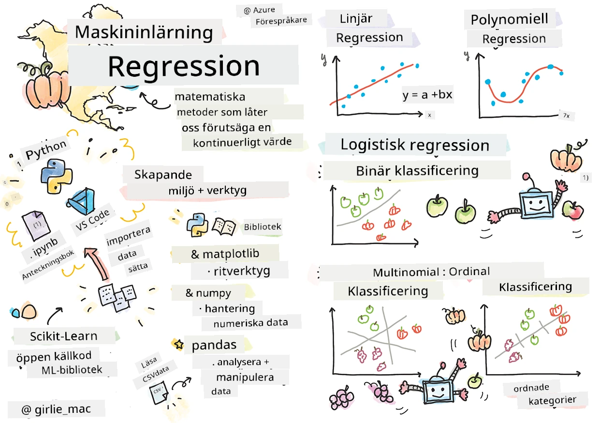
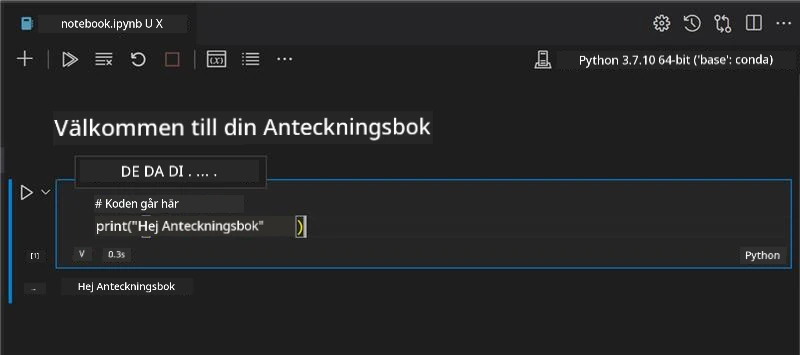
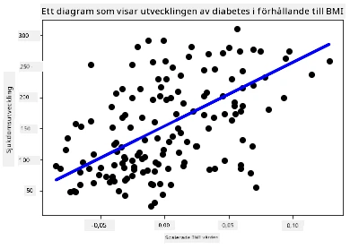

# Kom igång med Python och Scikit-learn för regressionsmodeller



> Skiss av [Tomomi Imura](https://www.twitter.com/girlie_mac)

## [Förhandsföreläsningsquiz](https://ff-quizzes.netlify.app/en/ml/)

> ### [Den här lektionen finns tillgänglig i R!](../../../../2-Regression/1-Tools/solution/R/lesson_1.html)

## Introduktion

I dessa fyra lektioner kommer du att upptäcka hur man bygger regressionsmodeller. Vi kommer snart att diskutera vad de används till. Men innan du gör något, se till att du har rätt verktyg på plats för att starta processen!

I denna lektion kommer du att lära dig hur man:

- Konfigurerar din dator för lokala maskininlärningsuppgifter.
- Arbetar med Jupyter Notebooks.
- Använder Scikit-learn, inklusive installation.
- Utforskar linjär regression med en praktisk övning.

## Installationer och konfigurationer

[](https://youtu.be/-DfeD2k2Kj0 "ML för nybörjare - Sätt upp dina verktyg klara för att bygga maskininlärningsmodeller")

> 🎥 Klicka på bilden ovan för en kort video som går igenom hur du konfigurerar din dator för ML.

1. **Installera Python**. Se till att [Python](https://www.python.org/downloads/) är installerat på din dator. Du kommer att använda Python för många datavetenskaps- och maskininlärningsuppgifter. De flesta datorer har redan en Python-installation. Det finns användbara [Python Coding Packs](https://code.visualstudio.com/learn/educators/installers?WT.mc_id=academic-77952-leestott) tillgängliga också, för att underlätta installationen för vissa användare.

   Vissa användningsområden för Python kräver dock en version av programvaran, medan andra kräver en annan version. Därför är det användbart att arbeta inom en [virtuell miljö](https://docs.python.org/3/library/venv.html).

2. **Installera Visual Studio Code**. Se till att du har Visual Studio Code installerat på din dator. Följ dessa instruktioner för att [installera Visual Studio Code](https://code.visualstudio.com/) för grundinstallationen. Du kommer att använda Python i Visual Studio Code i denna kurs, så du kanske vill fräscha upp hur man [konfigurerar Visual Studio Code](https://docs.microsoft.com/learn/modules/python-install-vscode?WT.mc_id=academic-77952-leestott) för Python-utveckling.

   > Bli bekväm med Python genom att arbeta igenom denna samling av [Lär-moduler](https://docs.microsoft.com/users/jenlooper-2911/collections/mp1pagggd5qrq7?WT.mc_id=academic-77952-leestott)
   >
   > [](https://youtu.be/yyQM70vi7V8 "Installera Python med Visual Studio Code")
   >
   > 🎥 Klicka på bilden ovan för en video: använda Python i VS Code.

3. **Installera Scikit-learn**, genom att följa [dessa instruktioner](https://scikit-learn.org/stable/install.html). Eftersom du behöver vara säker på att använda Python 3, rekommenderas det att använda en virtuell miljö. Observera att om du installerar detta bibliotek på en M1 Mac, finns särskilda instruktioner på den länkade sidan ovan.

1. **Installera Jupyter Notebook**. Du behöver [installera Jupyter-paketet](https://pypi.org/project/jupyter/).

## Din ML-miljö för författande

Du kommer att använda **notebooks** för att utveckla din Python-kod och skapa maskininlärningsmodeller. Denna typ av fil är ett vanligt verktyg för datavetare, och de kan identifieras av deras suffix eller filändelse `.ipynb`.

Notebooks är en interaktiv miljö som låter utvecklaren både koda och lägga till anteckningar och skriva dokumentation runt koden, vilket är ganska hjälpsamt för experimentella eller forskningsinriktade projekt.

[](https://youtu.be/7E-jC8FLA2E "ML för nybörjare - Sätt upp Jupyter Notebooks för att börja bygga regressionsmodeller")

> 🎥 Klicka på bilden ovan för en kort video som går igenom denna övning.

### Övning - arbeta med en notebook

I denna mapp hittar du filen _notebook.ipynb_.

1. Öppna _notebook.ipynb_ i Visual Studio Code.

   En Jupyter-server startar med Python 3+ igång. Du kommer att hitta områden i notebooken som kan `köras`, kodavsnitt. Du kan köra ett kodblock genom att välja ikonen som ser ut som en play-knapp.

1. Välj `md`-ikonen och lägg till lite markdown, och följande text **# Välkommen till din notebook**.

   Nästa, lägg till lite Python-kod.

1. Skriv **print('hello notebook')** i kodblocket.
1. Välj pilen för att köra koden.

   Du bör se det utskrivna uttalandet:

    ```output
    hello notebook
    ```



Du kan väva in din kod med kommentarer för att själv dokumentera notebooken.

✅ Tänk en stund på hur olika en webbutvecklares arbetsmiljö är jämfört med en datavetenskapspersons.

## Upp och igång med Scikit-learn

Nu när Python är inställt i din lokala miljö och du är bekväm med Jupyter Notebooks, låt oss bli lika bekväma med Scikit-learn (uttalas `sci` som i `science`). Scikit-learn tillhandahåller ett [omfattande API](https://scikit-learn.org/stable/modules/classes.html#api-ref) för att hjälpa dig utföra ML-uppgifter.

Enligt deras [webbplats](https://scikit-learn.org/stable/getting_started.html), "Scikit-learn är ett öppet källkods-bibliotek för maskininlärning som stöder övervakad och oövervakad inlärning. Det erbjuder också olika verktyg för passformsanpassning, datarenas, modellval och utvärdering, samt många andra hjälpmedel."

I denna kurs kommer du att använda Scikit-learn och andra verktyg för att bygga maskininlärningsmodeller för att utföra det vi kallar 'traditionella maskininlärnings'uppgifter. Vi har medvetet undvikit neurala nätverk och djupinlärning, eftersom de täcks bättre i vår kommande 'AI för nybörjare'-kurs.

Scikit-learn gör det enkelt att bygga modeller och utvärdera dem för användning. Det är främst inriktat på att använda numerisk data och innehåller flera färdiga datasets som lärverktyg. Det inkluderar även förbyggda modeller för studenter att prova. Låt oss först utforska processen att ladda förpaketerad data och använda en inbyggd estimator, den första ML-modellen med Scikit-learn, med några grundläggande data.

## Övning - din första Scikit-learn notebook

> Denna handledning inspirerades av [exemplet på linjär regression](https://scikit-learn.org/stable/auto_examples/linear_model/plot_ols.html#sphx-glr-auto-examples-linear-model-plot-ols-py) på Scikit-learns webbplats.


[](https://youtu.be/2xkXL5EUpS0 "ML för nybörjare - Ditt första linjära regressionsprojekt i Python")

> 🎥 Klicka på bilden ovan för en kort video som går igenom denna övning.

I filen _notebook.ipynb_ kopplad till denna lektion, rensa ut alla celler genom att trycka på ikonen för 'papperskorgen'.

I denna sektion kommer du att arbeta med en liten dataset om diabetes som är inbyggd i Scikit-learn för inlärningsändamål. Föreställ dig att du vill testa en behandling för diabetiker. Maskininlärningsmodeller kan hjälpa dig att avgöra vilka patienter som skulle svara bättre på behandlingen, baserat på kombinationer av variabler. Även en mycket grundläggande regressionsmodell, när den visualiseras, kan visa information om variabler som skulle hjälpa dig att organisera dina teoretiska kliniska studier.

✅ Det finns många typer av regressionsmetoder, och vilken du väljer beror på det svar du söker. Om du vill förutsäga sannolik längd för en person av en viss ålder, skulle du använda linjär regression, eftersom du söker ett **numeriskt värde**. Om du är intresserad av att upptäcka om en typ av matlagning bör betraktas som vegansk eller inte, söker du en **kategoriindelning** och skulle därför använda logistisk regression. Du kommer att lära dig mer om logistisk regression senare. Tänk lite på några frågor du kan ställa om data, och vilken av dessa metoder som skulle vara mer lämplig.

Låt oss sätta igång med denna uppgift.

### Importera bibliotek

För denna uppgift kommer vi att importera några bibliotek:

- **matplotlib**. Det är ett användbart [grafverktyg](https://matplotlib.org/) och vi kommer att använda det för att skapa ett linjediagram.
- **numpy**. [numpy](https://numpy.org/doc/stable/user/whatisnumpy.html) är ett användbart bibliotek för hantering av numerisk data i Python.
- **sklearn**. Detta är [Scikit-learn](https://scikit-learn.org/stable/user_guide.html)-biblioteket.

Importera några bibliotek för att hjälpa dig med dina uppgifter.

1. Lägg till importerna genom att skriva följande kod:

   ```python
   import matplotlib.pyplot as plt
   import numpy as np
   from sklearn import datasets, linear_model, model_selection
   ```

   Ovan importerar du `matplotlib`, `numpy` och du importerar `datasets`, `linear_model` och `model_selection` från `sklearn`. `model_selection` används för att dela upp data i tränings- och testset.

### Diabetes-datasettet

Det inbyggda [diabetes-datasettet](https://scikit-learn.org/stable/datasets/toy_dataset.html#diabetes-dataset) innehåller 442 datapunkter om diabetes, med 10 funktioner (features), några av dessa inkluderar:

- age: ålder i år
- bmi: kroppsmassindex
- bp: genomsnittligt blodtryck
- s1 tc: T-celler (en typ av vita blodkroppar)

✅ Detta dataset inkluderar kön som en viktig forskningsvariabel för diabetes. Många medicinska dataset innehåller denna typ av binär klassificering. Tänk lite på hur kategoriseringar som denna kan exkludera vissa delar av en befolkning från behandlingar.

Nu, ladda in X- och y-datan.

> 🎓 Kom ihåg, detta är övervakad inlärning, och vi behöver ett namngivet 'y'-mål.

I en ny kodcell, ladda diabetes-datasettet genom att anropa `load_diabetes()`. Parametern `return_X_y=True` signalerar att `X` kommer att vara en datamatris och `y` kommer att vara regressionsmålet.

1. Lägg till några print-kommandon för att visa form på datamatrisen och dess första element:

    ```python
    X, y = datasets.load_diabetes(return_X_y=True)
    print(X.shape)
    print(X[0])
    ```

    Vad du får tillbaka är en tuppel. Det du gör är att tilldela de två första värdena i tuppeln till `X` respektive `y`. Läs mer [om tupplar](https://wikipedia.org/wiki/Tuple).

    Du kan se att denna data består av 442 objekt formade i arrayer med 10 element:

    ```text
    (442, 10)
    [ 0.03807591  0.05068012  0.06169621  0.02187235 -0.0442235  -0.03482076
    -0.04340085 -0.00259226  0.01990842 -0.01764613]
    ```

    ✅ Tänk lite på relationen mellan data och regressionsmålet. Linjär regression förutspår samband mellan funktion X och måldata y. Kan du hitta [målet](https://scikit-learn.org/stable/datasets/toy_dataset.html#diabetes-dataset) för diabetes-datasettet i dokumentationen? Vad demonstrerar detta dataset, givet målet?

2. Välj sedan en del av detta dataset att plottas genom att välja den 3:e kolumnen i datasetet. Du kan göra detta genom att använda `:` för att välja alla rader, och sedan välja den 3:e kolumnen med index (2). Du kan också omforma datat till en 2D-array - som krävs för plottning - genom att använda `reshape(n_rows, n_columns)`. Om en av parametrarna är -1 beräknas motsvarande dimension automatiskt.

   ```python
   X = X[:, 2]
   X = X.reshape((-1,1))
   ```

   ✅ Skriv ut datat när som helst för att kontrollera dess form.

3. Nu när du har data redo att plottas, kan du se om en maskin kan hjälpa till att avgöra en logisk uppdelning mellan talen i detta dataset. För detta behöver du dela både data (X) och målet (y) i test- och träningsset. Scikit-learn har ett enkelt sätt att göra detta; du kan dela din testdata vid en given punkt.

   ```python
   X_train, X_test, y_train, y_test = model_selection.train_test_split(X, y, test_size=0.33)
   ```

4. Nu är du redo att träna din modell! Ladda in linjär regressionsmodell och träna den med dina träningsset X och y med `model.fit()`:

    ```python
    model = linear_model.LinearRegression()
    model.fit(X_train, y_train)
    ```

    ✅ `model.fit()` är en funktion du kommer se i många ML-bibliotek som TensorFlow

5. Skapa sedan en prediktion med testdata, med funktionen `predict()`. Detta används för att rita linjen mellan datagrupperna

    ```python
    y_pred = model.predict(X_test)
    ```

6. Nu är det dags att visa data i en plot. Matplotlib är ett mycket användbart verktyg för denna uppgift. Skapa ett spridningsdiagram av all X och y testdata, och använd prediktionen för att rita en linje på bästa plats mellan modellens datagruppering.

    ```python
    plt.scatter(X_test, y_test,  color='black')
    plt.plot(X_test, y_pred, color='blue', linewidth=3)
    plt.xlabel('Scaled BMIs')
    plt.ylabel('Disease Progression')
    plt.title('A Graph Plot Showing Diabetes Progression Against BMI')
    plt.show()
    ```

   


   ✅ Tänk lite på vad som händer här. En rät linje går genom många små datapunkter, men vad gör den egentligen? Kan du se hur du borde kunna använda den här linjen för att förutsäga var en ny, osedd datapunkt borde passa in i förhållande till plottens y-axel? Försök att sätta i ord det praktiska användningsområdet för den här modellen.

Grattis, du byggde din första linjära regressionsmodell, skapade en förutsägelse med den, och visade den i en plot!

---
## 🚀Utmaning

Plotta en annan variabel från denna dataset. Tips: redigera denna rad: `X = X[:,2]`. Med tanke på denna datasets mål, vad kan du upptäcka om diabetes progression som sjukdom?
## [Quiz efter föreläsningen](https://ff-quizzes.netlify.app/en/ml/)

## Repetition & Självstudier

I denna handledning arbetade du med enkel linjär regression, snarare än univariat eller multipel linjär regression. Läs lite om skillnaderna mellan dessa metoder, eller titta på [denna video](https://www.coursera.org/lecture/quantifying-relationships-regression-models/linear-vs-nonlinear-categorical-variables-ai2Ef)

Läs mer om begreppet regression och fundera över vilka typer av frågor som kan besvaras med denna teknik. Ta denna [handledning](https://docs.microsoft.com/learn/modules/train-evaluate-regression-models?WT.mc_id=academic-77952-leestott) för att fördjupa din förståelse.

## Uppgift

[En annan dataset](assignment.md)

---

<!-- CO-OP TRANSLATOR DISCLAIMER START -->
**Ansvarsfriskrivning**:
Detta dokument har översatts med hjälp av AI-översättningstjänsten [Co-op Translator](https://github.com/Azure/co-op-translator). Även om vi strävar efter noggrannhet, var vänlig notera att automatiska översättningar kan innehålla fel eller brister. Det ursprungliga dokumentet på dess modersmål bör betraktas som den auktoritativa källan. För kritisk information rekommenderas professionell mänsklig översättning. Vi ansvarar inte för några missförstånd eller feltolkningar som uppstår till följd av användningen av denna översättning.
<!-- CO-OP TRANSLATOR DISCLAIMER END -->