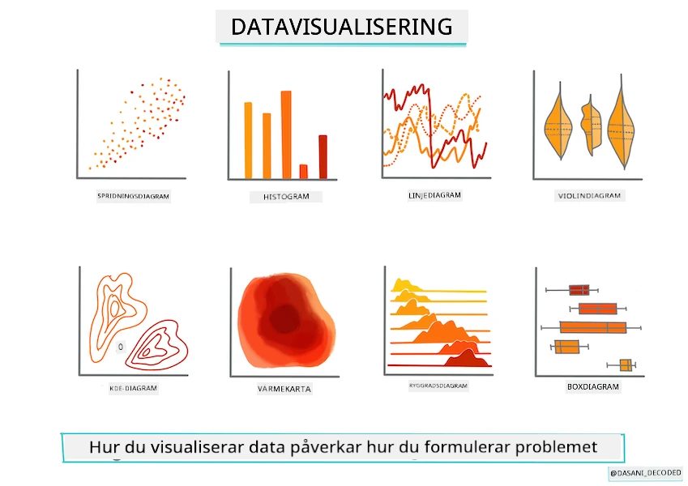
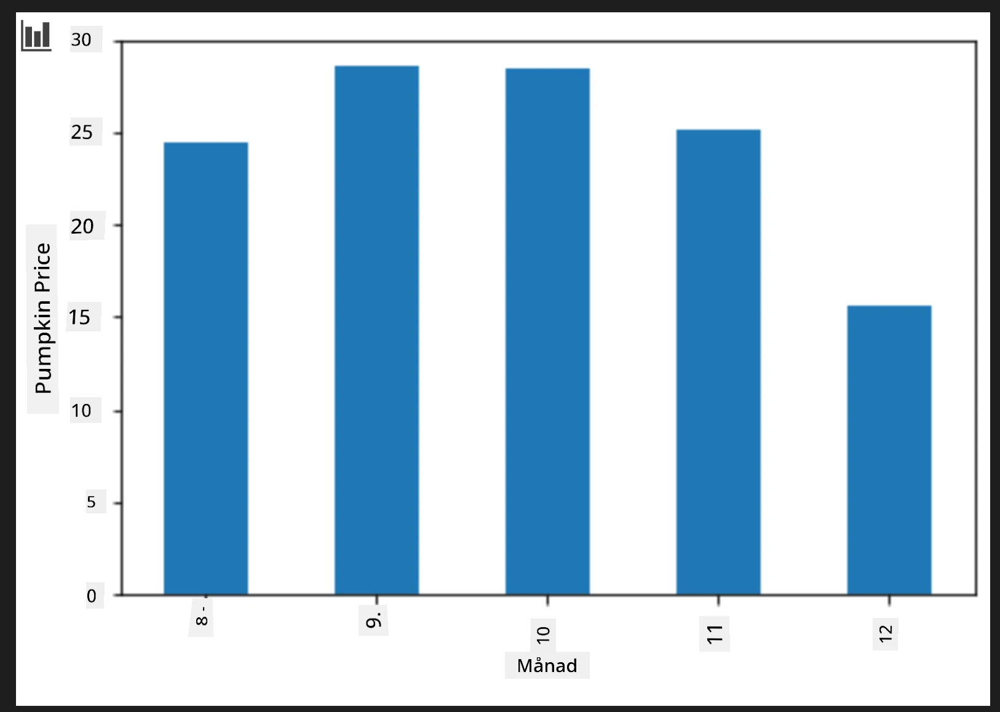
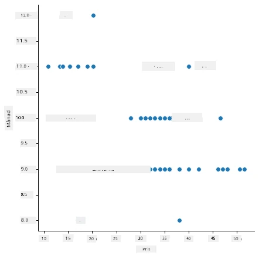
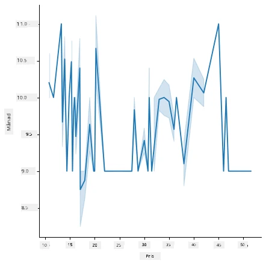
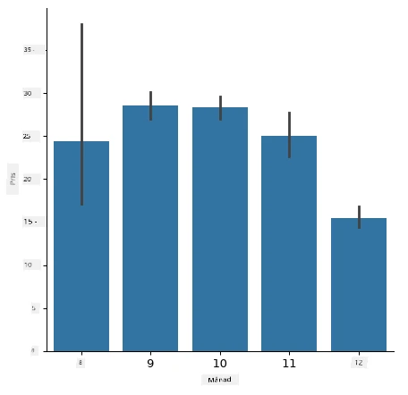
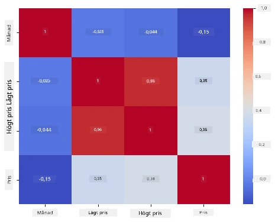

# Bygg en regressionsmodell med Scikit-learn: förbered och visualisera data



Informationsgrafik av [Dasani Madipalli](https://twitter.com/dasani_decoded)

## [Förföreläsningsquiz](https://ff-quizzes.netlify.app/en/ml/)

> ### [Den här lektionen finns på R!](../../../../2-Regression/2-Data/solution/R/lesson_2.html)

## Introduktion

Nu när du har verktygen du behöver för att börja arbeta med maskininlärningsmodellering med Scikit-learn är du redo att börja ställa frågor till din data. När du arbetar med data och använder ML-lösningar är det mycket viktigt att förstå hur man ställer rätt fråga för att riktigt kunna låsa upp potentialen i din dataset.

I den här lektionen kommer du att lära dig:

- Hur du förbereder din data för modellbyggande.
- Hur du använder Matplotlib för datavisualisering.
- Hur du använder Seaborn för mer uttrycksfull datavisualisering.

## Att ställa rätt fråga till din data

Den fråga du behöver besvarad avgör vilken typ av ML-algoritmer du kommer att använda. Och kvaliteten på svaret du får tillbaka är starkt beroende på datats natur.

Ta en titt på [datan](https://github.com/microsoft/ML-For-Beginners/blob/main/2-Regression/data/US-pumpkins.csv) som tillhandahålls för denna lektion. Du kan öppna denna .csv-fil i VS Code. En snabb genomgång visar genast att det finns tomma värden och en blandning av strängar och numerisk data. Det finns också en konstig kolumn som heter 'Package' där datan är en blandning mellan 'säckar', 'lådor' och andra värden. Datan är faktiskt lite rörig.

[](https://youtu.be/5qGjczWTrDQ "ML för nybörjare - Hur man analyserar och rengör en dataset")

> 🎥 Klicka på bilden ovan för en kort video som går igenom förberedelse av data för denna lektion.

Det är faktiskt inte särskilt vanligt att få en dataset som är helt klar att använda för att skapa en ML-modell direkt ur lådan. I den här lektionen kommer du att lära dig hur man förbereder en rå dataset med standardbibliotek i Python. Du kommer också att lära dig olika tekniker för att visualisera data.

## Fallstudie: 'pumpinmarknaden'

I den här mappen hittar du en .csv-fil i rotmappen `data` kallad [US-pumpkins.csv](https://github.com/microsoft/ML-For-Beginners/blob/main/2-Regression/data/US-pumpkins.csv) som inkluderar 1757 rader med data om marknaden för pumpor, sorterad efter grupper per stad. Detta är rådata hämtat från [Specialty Crops Terminal Markets Standard Reports](https://www.marketnews.usda.gov/mnp/fv-report-config-step1?type=termPrice) distribuerade av United States Department of Agriculture.

### Förbereda data

Denna data är offentlig. Den kan laddas ner i många separata filer, per stad, från USDA:s webbplats. För att undvika för många separata filer har vi sammanfogat all stadsdata i ett kalkylblad, så vi har redan _förberett_ datan lite. Nästa steg är att titta närmare på datan.

### Pumpdata - tidiga slutsatser

Vad lägger du märke till med denna data? Du har redan sett att det är en blandning av strängar, siffror, tomma värden och konstiga värden som du behöver tolka.

Vilken fråga kan du ställa till denna data, med hjälp av en regressionsmetod? Vad sägs om "Förutsäg priset på en pumpa som säljs under en given månad". Om vi ser på datan igen finns det några förändringar du behöver göra för att skapa den datastruktur som krävs för uppgiften.
## Övning - analysera pumpdata

Låt oss använda [Pandas](https://pandas.pydata.org/), (namnet står för `Python Data Analysis`) ett verktyg som är mycket användbart för att forma data, för att analysera och förbereda denna pumpdata.

### Först, kontrollera för saknade datum

Du behöver först ta steg för att kontrollera saknade datum:

1. Konvertera datumen till månadsformat (detta är amerikanska datum, så formatet är `MM/DD/YYYY`).
2. Extrahera månaden till en ny kolumn.

Öppna _notebook.ipynb_ filen i Visual Studio Code och importera kalkylbladet till en ny Pandas dataframe.

1. Använd `head()`-funktionen för att visa de fem första raderna.

    ```python
    import pandas as pd
    pumpkins = pd.read_csv('../data/US-pumpkins.csv')
    pumpkins.head()
    ```

    ✅ Vilken funktion skulle du använda för att visa de fem sista raderna?

1. Kontrollera om det finns saknad data i den nuvarande dataframen:

    ```python
    pumpkins.isnull().sum()
    ```

    Det finns saknad data, men kanske spelar det ingen roll för uppgiften.

1. För att göra din dataframe lättare att arbeta med, välj endast de kolumner du behöver, med `loc`-funktionen som extraherar en grupp av rader (som första parameter) och kolumner (som andra parameter) från originaldataframen. Uttrycket `:` i fallet nedan betyder "alla rader".

    ```python
    columns_to_select = ['Package', 'Low Price', 'High Price', 'Date']
    pumpkins = pumpkins.loc[:, columns_to_select]
    ```

### För det andra, bestäm genomsnittspris på pumpa

Fundera på hur du ska bestämma genomsnittspriset på en pumpa under en månad. Vilka kolumner skulle du välja för denna uppgift? Tips: du behöver 3 kolumner.

Lösning: ta ett genomsnitt av kolumnerna `Low Price` och `High Price` för att fylla i den nya kolumnen Price, och konvertera Date-kolumnen så att den endast visar månaden. Lyckligtvis finns, enligt ovanstående kontroll, ingen saknad data för datum eller priser.

1. För att beräkna genomsnittet lägg till följande kod:

    ```python
    price = (pumpkins['Low Price'] + pumpkins['High Price']) / 2

    month = pd.DatetimeIndex(pumpkins['Date']).month

    ```

   ✅ Känn dig fri att skriva ut vilken data du vill kontrollera med `print(month)`.

2. Kopiera nu din konverterade data till en ny Pandas dataframe:

    ```python
    new_pumpkins = pd.DataFrame({'Month': month, 'Package': pumpkins['Package'], 'Low Price': pumpkins['Low Price'],'High Price': pumpkins['High Price'], 'Price': price})
    ```

    Att skriva ut din dataframe visar en ren och prydlig dataset på vilken du kan bygga din nya regressionsmodell.

### Men vänta! Det är något konstigt här

Om du tittar på `Package`-kolumnen säljs pumporna i många olika konfigurationer. Några säljs i '1 1/9 bushel' mått, några i '1/2 bushel', några per pumpa, några per pund, och några i stora lådor med varierande bredder.

> Pumpor verkar vara mycket svåra att väga konsekvent

Genom att gräva i originaldatan är det intressant att allt med `Unit of Sale` som är 'EACH' eller 'PER BIN' också har `Package`-typen per tum, per låda eller 'per styck'. Pumpor verkar alltså vara svåra att väga konsekvent, så låt oss filtrera dem genom att välja endast pumpor med strängen 'bushel' i sin `Package`-kolumn.

1. Lägg till en filterrad högst upp i filen, under den första .csv-importen:

    ```python
    pumpkins = pumpkins[pumpkins['Package'].str.contains('bushel', case=True, regex=True)]
    ```

    Om du skriver ut datan nu kan du se att du endast får de cirka 415 rader med data som innehåller pumpor per bushel.

### Men vänta! Det är en sak till att göra

Lade du märke till att bushel-mängden varierar per rad? Du behöver normalisera prissättningen så att priset visas per bushel, så gör lite beräkningar för att standardisera det.

1. Lägg till dessa rader efter blocket som skapar new_pumpkins-dataframen:

    ```python
    new_pumpkins.loc[new_pumpkins['Package'].str.contains('1 1/9'), 'Price'] = price/(1 + 1/9)

    new_pumpkins.loc[new_pumpkins['Package'].str.contains('1/2'), 'Price'] = price/(1/2)
    ```

✅ Enligt [The Spruce Eats](https://www.thespruceeats.com/how-much-is-a-bushel-1389308) beror vikten för en bushel på typen av produkt eftersom det är ett volymmått. "En bushel tomater, till exempel, ska väga 56 pund... Löv och gröna blad tar mer plats med mindre vikt, så en bushel spenat väger bara 20 pund." Allt är ganska komplicerat! Vi ska inte bry oss om att göra en omräkning från bushel till pund, utan prissätta per bushel. All denna studie av bushels pumpor visar dock hur viktigt det är att förstå datats natur!

Nu kan du analysera prissättningen per enhet baserat på deras bushelmått. Om du skriver ut datan en gång till kan du se hur den är standardiserad.

✅ Lade du märke till att pumpor som säljs per halv bushel är mycket dyra? Kan du lista ut varför? Tips: små pumpor är mycket dyrare än stora, förmodligen eftersom det finns så många fler av dem per bushel, med tanke på det oanvända utrymmet som tas av en stor ihålig pajpumpa.

## Visualiseringsstrategier

En del av en dataspecialists roll är att visa kvaliteten och arten av data de arbetar med. För att göra detta skapar de ofta intressanta visualiseringar, eller diagram, grafer och tabeller, som visar olika aspekter av data. På detta sätt kan de visuellt visa samband och luckor som annars är svåra att upptäcka.

[](https://youtu.be/SbUkxH6IJo0 "ML för nybörjare - Hur man visualiserar data med Matplotlib")

> 🎥 Klicka på bilden ovan för en kort video som går igenom visualisering av data för denna lektion.

Visualiseringar kan också hjälpa till att bestämma den mest lämpliga maskininlärningstekniken för datan. Ett punktdiagram som verkar följa en linje indikerar till exempel att datan är en bra kandidat för en linjär regressionsövning.

Ett bibliotek för datavisualisering som fungerar bra i Jupyter notebooks är [Matplotlib](https://matplotlib.org/) (som du också såg i föregående lektion).

> Få mer erfarenhet av datavisualisering i [dessa handledningar](https://docs.microsoft.com/learn/modules/explore-analyze-data-with-python?WT.mc_id=academic-77952-leestott).

## Övning - experimentera med Matplotlib

Försök skapa några grundläggande diagram för att visa den nya dataframen du just skapade. Vad skulle ett grundläggande linjediagram visa?

1. Importera Matplotlib högst upp i filen, under Pandas-importen:

    ```python
    import matplotlib.pyplot as plt
    ```

1. Kör om hela notebooken för att uppdatera.
1. Lägg längst ner i notebooken till en cell för att rita datan som en boxplot:

    ```python
    price = new_pumpkins.Price
    month = new_pumpkins.Month
    plt.scatter(price, month)
    plt.show()
    ```

    

    Är detta ett användbart diagram? Överraskar något dig med det?

    Det är inte särskilt användbart då allt det gör är att visa din data som en spridning av punkter i en given månad.

### Gör det användbart

För att få diagram att visa användbar data brukar man behöva gruppera data på något sätt. Låt oss försöka skapa ett diagram där y-axeln visar månaderna och datan demonstrerar datadistributionen.

1. Lägg till en cell för att skapa ett grupperat stapeldiagram:

    ```python
    new_pumpkins.groupby(['Month'])['Price'].mean().plot(kind='bar')
    plt.ylabel("Pumpkin Price")
    ```

    

    Detta är en mer användbar datavisualisering! Det verkar indikera att det högsta priset för pumpor inträffar i september och oktober. Stämmer det med dina förväntningar? Varför eller varför inte?

## Övning - experimentera med Seaborn

Matplotlib är kraftfullt, men det kan krävas mycket kod för att producera ett snyggt diagram. [Seaborn](https://seaborn.pydata.org/) är ett bibliotek byggt _ovanpå_ Matplotlib som är utformat för statistisk datavisualisering. Det arbetar direkt med Pandas dataframes, tillämpar attraktiva standardstilar och låter dig skapa informativa diagram med mycket mindre kod. Eftersom Seaborn returnerar Matplotlib-objekt kan du fortfarande använda allt du redan vet om Matplotlib för att finjustera resultatet.

> Om du inte redan har Seaborn installerat, installera det med `pip install seaborn`.

1. Importera Seaborn högst upp i notebooken, under de andra importerna. Det importeras konventionellt som `sns`:

    ```python
    import seaborn as sns
    ```

### Punktdiagram för att visa relationer

En stor del av att utforska data innan man bygger en modell är att leta efter _relationer_ mellan variabler. Ett [punktdiagram](https://en.wikipedia.org/wiki/Scatter_plot) är ett av de bästa verktygen för detta: om punkterna verkar följa en linje kan de två variablerna vara korrelerade, vilket är ett gott tecken på att en linjär regressionsmodell kan fungera.

1. Återskapa punktdiagrammet pris-månad från tidigare, denna gång med Seaborns [`relplot()`](https://seaborn.pydata.org/generated/seaborn.relplot.html) (relationsdiagram), som fungerar direkt med dina dataframe-kolumner:

    ```python
    sns.relplot(x="Price", y="Month", data=new_pumpkins)
    ```

    

    Lägg märke till hur du anger _kolumnnamnen_ och dataframen, och Seaborn ordnar axelrubrikerna åt dig.

2. Du kan byta till ett linjediagram genom att skicka `kind="line"`. Seaborn ritar till och med ett skuggat band som visar konfidensintervallet kring linjen:

    ```python
    sns.relplot(x="Price", y="Month", kind="line", data=new_pumpkins)
    ```

    

    Denna data är ganska brusig, så ett linjediagram är inte det klaraste valet här — men det visar hur enkelt du kan byta diagramtyp i Seaborn.

### Stapeldiagram för att visa fördelningar


Tidigare grupperade du data för hand för att skapa ett stapeldiagram med Matplotlib. Seaborns [`catplot()`](https://seaborn.pydata.org/generated/seaborn.catplot.html) (kategoriplott) kan göra gruppering och aggregering åt dig. Som standard visar `kind="bar"` medelvärdet för varje kategori tillsammans med en svart linje som indikerar konfidensintervallet.

1. Skapa ett stapeldiagram över genomsnittspris per månad:

    ```python
    sns.catplot(x="Month", y="Price", data=new_pumpkins, kind="bar")
    ```

    

    Detta bekräftar vad du såg med Matplotlib — priserna är som högst runt september och oktober — men Seaborn visualiserar också hur mycket priset _varierar_ inom varje månad.

### Värmekartor för att visa korrelationer

Scatterplots jämför två variabler åt gången. När du har flera numeriska kolumner låter en [värmekarta](https://en.wikipedia.org/wiki/Heat_map) dig se styrkan i relationen mellan _varje_ par av kolumner samtidigt. Detta är ett vanligt sätt att upptäcka vilka egenskaper som är mest korrelerade innan man väljer vad som ska matas in i en modell (och samma typ av diagram används senare för att visa förvirringsmatriser vid klassificering).

1. Bygg en korrelationsmatris med Pandas och rita sedan upp den med Seaborns [`heatmap()`](https://seaborn.pydata.org/generated/seaborn.heatmap.html). Alternativet `annot=True` skriver ut korrelationsvärdena i varje cell:

    ```python
    correlations = new_pumpkins[['Month', 'Low Price', 'High Price', 'Price']].corr()
    sns.heatmap(correlations, annot=True, cmap="coolwarm")
    ```

    

    Värden nära `1` (eller `-1`) betyder att kolumnerna är starkt _linjärt_ korrelerade. Notera hur `Low Price` och `High Price` nästan är perfekt korrelerade. `Month` däremot visar endast en svag linjär korrelation med priset — även om stapeldiagrammet ovan avslöjade en tydlig säsongstopp i september och oktober. Det är en viktig lärdom: korrelationskoefficienten mäter bara _raka-linje_-relationer, så den kan missa säsongsmönster eller andra icke-linjära samband. ✅ Varför är det användbart att titta på både en värmekarta *och* diagram som stapeldiagrammet innan du bestämmer vilka kolumner som ska användas?

### Matplotlib eller Seaborn?

Båda biblioteken är värda att känna till:

- **Matplotlib** ger dig finjusterad kontroll över varje element i ett diagram och är grunden som nästan alla andra Python-plottningsbibliotek bygger på.
- **Seaborn** tillhandahåller funktioner på högre nivå och attraktiva standardinställningar för statistiska diagram, arbetar direkt med dataframes och är ofta snabbare för utforskande dataanalys.

En vanlig arbetsgång är att använda Seaborn för att snabbt utforska din data, och sedan gå ner till Matplotlib när du behöver anpassa detaljerna.

---

## 🚀Utmaning

Utforska de olika typer av visualiseringar som Matplotlib och Seaborn erbjuder. Vilka typer är mest lämpliga för regressionsproblem?

## [Quiz efter föreläsningen](https://ff-quizzes.netlify.app/en/ml/)

## Repetition & Självstudier

Ta en titt på de många sätten att visualisera data. Gör en lista över de olika tillgängliga biblioteken och notera vilka som är bäst för olika typer av uppgifter, till exempel 2D-visualiseringar jämfört med 3D-visualiseringar. Vad upptäcker du?

## Uppgift

[Utforska visualisering](assignment.md)

---

<!-- CO-OP TRANSLATOR DISCLAIMER START -->
**Ansvarsfriskrivning**:
Detta dokument har översatts med hjälp av AI-översättningstjänsten [Co-op Translator](https://github.com/Azure/co-op-translator). Även om vi strävar efter noggrannhet, var vänlig notera att automatiska översättningar kan innehålla fel eller brister. Det ursprungliga dokumentet på dess modersmål bör betraktas som den auktoritativa källan. För kritisk information rekommenderas professionell mänsklig översättning. Vi ansvarar inte för några missförstånd eller feltolkningar som uppstår till följd av användningen av denna översättning.
<!-- CO-OP TRANSLATOR DISCLAIMER END -->