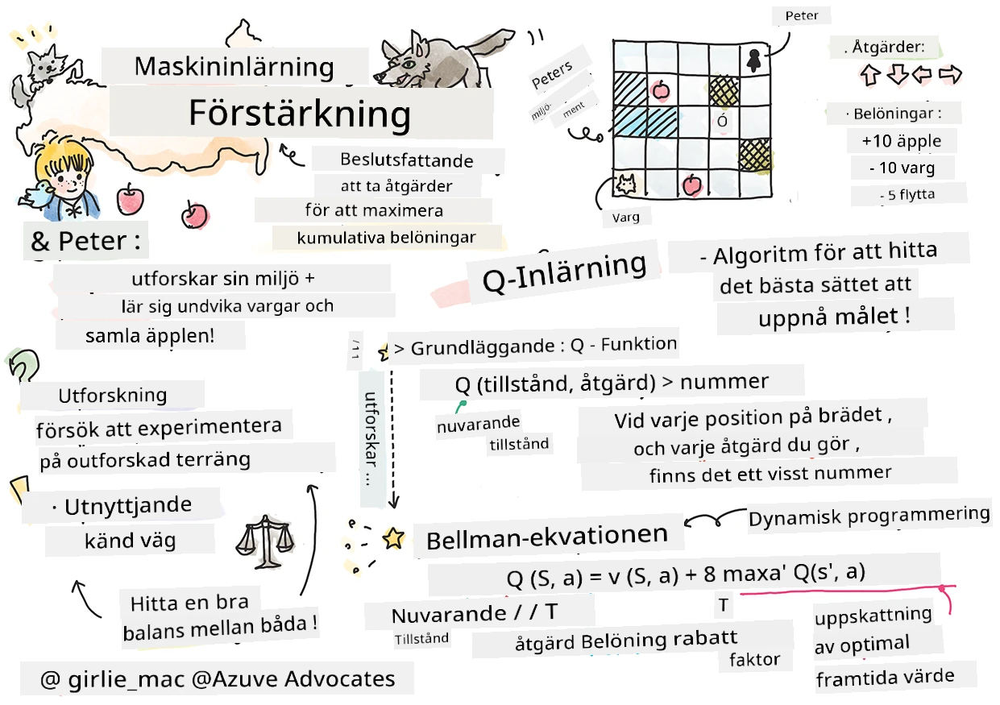

# Introduktion till förstärkningsinlärning och Q-lärande


> Sketchnote av [Tomomi Imura](https://www.twitter.com/girlie_mac)

Förstärkningsinlärning involverar tre viktiga begrepp: agenten, vissa tillstånd och en uppsättning handlingar per tillstånd. Genom att utföra en handling i ett specificerat tillstånd får agenten en belöning. Föreställ dig igen datorspelet Super Mario. Du är Mario, du är i en spelnivå, stående bredvid en klippkant. Ovanför dig finns en mynt. Du som Mario, i en spelnivå, på en specifik position ... det är ditt tillstånd. Att flytta ett steg åt höger (en handling) skulle få dig att falla över kanten, och det skulle ge dig ett lågt numeriskt poäng. Men att trycka på hoppknappen skulle låta dig få en poäng och du skulle överleva. Det är ett positivt resultat och det borde belöna dig med ett positivt numeriskt poäng.

Genom att använda förstärkningsinlärning och en simulator (spelet), kan du lära dig hur du spelar spelet för att maximera belöningen som är att överleva och samla så många poäng som möjligt.

[](https://www.youtube.com/watch?v=lDq_en8RNOo)

> 🎥 Klicka på bilden ovan för att höra Dmitry diskutera förstärkningsinlärning

## [För-frågesport](https://ff-quizzes.netlify.app/en/ml/)

## Förkunskaper och installation

I denna lektion kommer vi att experimentera med lite kod i Python. Du bör kunna köra Jupyter Notebook-koden från denna lektion, antingen på din dator eller någonstans i molnet.

Du kan öppna [lektionen notebook](https://github.com/microsoft/ML-For-Beginners/blob/main/8-Reinforcement/1-QLearning/notebook.ipynb) och gå igenom denna lektion för att bygga.

> **Notera:** Om du öppnar denna kod från molnet, behöver du också hämta filen [`rlboard.py`](https://github.com/microsoft/ML-For-Beginners/blob/main/8-Reinforcement/1-QLearning/rlboard.py), som används i notebook-koden. Lägg den i samma mapp som notebookfilen.

## Introduktion

I denna lektion ska vi utforska världen av **[Peter och vargen](https://en.wikipedia.org/wiki/Peter_and_the_Wolf)**, inspirerad av en musikalisk folksaga av en rysk kompositör, [Sergej Prokofiev](https://en.wikipedia.org/wiki/Sergei_Prokofiev). Vi ska använda **förstärkningsinlärning** för att låta Peter utforska sin omgivning, samla läckra äpplen och undvika vargen.

**Förstärkningsinlärning** (RL) är en inlärningsteknik som låter oss lära oss ett optimalt beteende för en **agent** i en viss **miljö** genom att genomföra många experiment. En agent i denna miljö ska ha något slags **mål**, definierat av en **belöningsfunktion**.

## Miljön

För enkelhetens skull, låt oss betrakta Peters värld som en kvadratisk spelplan med storleken `width` x `height`, så här:


Varje cell i denna spelplan kan vara:

* **mark**, där Peter och andra varelser kan gå.
* **vatten**, där du uppenbarligen inte kan gå.
* ett **träd** eller **gräs**, en plats där du kan vila.
* ett **äpple**, som representerar något Peter skulle bli glad att hitta för att mata sig själv.
* en **varg**, som är farlig och bör undvikas.

Det finns ett separat Pythonmodul, [`rlboard.py`](https://github.com/microsoft/ML-For-Beginners/blob/main/8-Reinforcement/1-QLearning/rlboard.py), som innehåller koden för att arbeta med denna miljö. Eftersom denna kod inte är viktig för att förstå våra koncept, kommer vi att importera modulen och använda den för att skapa spelplanen (kodblock 1):

```python
from rlboard import *

width, height = 8,8
m = Board(width,height)
m.randomize(seed=13)
m.plot()
```

Denna kod bör skriva ut en bild av miljön liknande den ovan.

## Handlingar och policy

I vårt exempel skulle Peters mål vara att hitta ett äpple, samtidigt som han undviker vargen och andra hinder. För att göra detta kan han i princip gå runt tills han hittar ett äpple.

Därför kan han i varje position välja mellan följande handlingar: upp, ner, vänster och höger.

Vi definierar dessa handlingar som en ordbok, och kopplar dem till par med motsvarande koordinatförändringar. Till exempel skulle att gå åt höger (`R`) motsvara paret `(1,0)`. (kodblock 2):

```python
actions = { "U" : (0,-1), "D" : (0,1), "L" : (-1,0), "R" : (1,0) }
action_idx = { a : i for i,a in enumerate(actions.keys()) }
```

Sammanfattningsvis är strategin och målet i detta scenario följande:

- **Strategin**, för vår agent (Peter) definieras av en så kallad **policy**. En policy är en funktion som returnerar handlingen vid varje givet tillstånd. I vårt fall representeras problemtillståndet av spelplanen, inklusive spelarens aktuella position.

- **Målet** med förstärkningsinlärning är att så småningom lära sig en bra policy som gör att vi kan lösa problemet effektivt. Men som en baslinje kan vi betrakta den enklaste policyn som kallas **random walk**.

## Random walk

Låt oss först lösa vårt problem genom att implementera en random walk-strategi. Med random walk väljer vi slumpmässigt nästa handling från tillåtna handlingar, tills vi når äpplet (kodblock 3).

1. Implementera random walk med koden nedan:

    ```python
    def random_policy(m):
        return random.choice(list(actions))
    
    def walk(m,policy,start_position=None):
        n = 0 # antal steg
        # sätt startposition
        if start_position:
            m.human = start_position 
        else:
            m.random_start()
        while True:
            if m.at() == Board.Cell.apple:
                return n # framgång!
            if m.at() in [Board.Cell.wolf, Board.Cell.water]:
                return -1 # uppäten av varg eller drunknad
            while True:
                a = actions[policy(m)]
                new_pos = m.move_pos(m.human,a)
                if m.is_valid(new_pos) and m.at(new_pos)!=Board.Cell.water:
                    m.move(a) # genomför själva flytten
                    break
            n+=1
    
    walk(m,random_policy)
    ```

    Anropet till `walk` bör returnera längden på motsvarande väg, vilket kan variera från körning till körning.

1. Kör walk-experimentet flera gånger (t.ex. 100), och skriv ut den resulterande statistiken (kodblock 4):

    ```python
    def print_statistics(policy):
        s,w,n = 0,0,0
        for _ in range(100):
            z = walk(m,policy)
            if z<0:
                w+=1
            else:
                s += z
                n += 1
        print(f"Average path length = {s/n}, eaten by wolf: {w} times")
    
    print_statistics(random_policy)
    ```

    Observera att den genomsnittliga längden av en väg är runt 30-40 steg, vilket är ganska mycket med tanke på att det genomsnittliga avståndet till närmaste äpple är omkring 5-6 steg.

    Du kan också se hur Peters rörelse ser ut under random walk:

    

## Belöningsfunktion

För att göra vår policy mer intelligent behöver vi förstå vilka rörelser som är "bättre" än andra. För att göra detta behöver vi definiera vårt mål.

Målet kan definieras i termer av en **belöningsfunktion**, som returnerar ett poängvärde för varje tillstånd. Ju högre nummer, desto bättre belöningsfunktion. (kodblock 5)

```python
move_reward = -0.1
goal_reward = 10
end_reward = -10

def reward(m,pos=None):
    pos = pos or m.human
    if not m.is_valid(pos):
        return end_reward
    x = m.at(pos)
    if x==Board.Cell.water or x == Board.Cell.wolf:
        return end_reward
    if x==Board.Cell.apple:
        return goal_reward
    return move_reward
```

En intressant sak med belöningsfunktioner är att i de flesta fall *får vi bara en betydande belöning i slutet av spelet*. Det betyder att vår algoritm på något sätt bör komma ihåg "bra" steg som leder till en positiv belöning i slutet, och öka deras vikt. På samma sätt bör alla steg som leder till dåliga resultat motverkas.

## Q-lärande

En algoritm som vi ska diskutera här kallas **Q-lärande**. I denna algoritm definieras policyn av en funktion (eller datastruktur) kallad en **Q-tabell**. Den registrerar "godheten" hos varje handling i ett givet tillstånd.

Den kallas Q-tabell eftersom det ofta är bekvämt att representera den som en tabell eller flerdimensionell array. Eftersom vår spelplan har dimensionerna `width` x `height`, kan vi representera Q-tabellen med en numpy-array med formen `width` x `height` x `len(actions)`: (kodblock 6)

```python
Q = np.ones((width,height,len(actions)),dtype=np.float)*1.0/len(actions)
```

Observera att vi initialiserar alla värden i Q-tabellen med ett lika värde, i vårt fall - 0.25. Detta motsvarar "random walk"-policyn, eftersom alla rörelser i varje tillstånd är lika bra. Vi kan skicka Q-tabellen till `plot`-funktionen för att visualisera tabellen på spelplanen: `m.plot(Q)`.


I mitten av varje cell finns en "pil" som indikerar den föredragna rörelseriktningen. Eftersom alla riktningar är lika visas en punkt.

Nu behöver vi köra simuleringen, utforska vår miljö och lära oss en bättre fördelning av Q-tabellvärden, vilket gör att vi kan hitta vägen till äpplet mycket snabbare.

## Kärnan i Q-lärande: Bellmans ekvation

När vi börjar röra oss kommer varje handling att ha en motsvarande belöning, dvs. vi kan teoretiskt välja nästa handling baserat på högsta omedelbara belöning. Men i de flesta tillstånd kommer rörelsen inte att uppnå vårt mål att nå äpplet, och därför kan vi inte omedelbart bestämma vilken riktning som är bättre.

> Kom ihåg att det inte är det omedelbara resultatet som är viktigt, utan snarare det slutgiltiga resultatet som vi får i slutet av simuleringen.

För att ta hänsyn till denna fördröjda belöning behöver vi använda principerna för **[dynamisk programmering](https://en.wikipedia.org/wiki/Dynamic_programming)**, som låter oss tänka på vårt problem rekursivt.

Anta att vi nu är i tillståndet *s*, och vi vill gå till nästa tillstånd *s'*. Genom att göra detta får vi den omedelbara belöningen *r(s,a)*, definierad av belöningsfunktionen, plus någon framtida belöning. Om vi antar att vår Q-tabell korrekt speglar "attraktiviteten" av varje handling, kommer vi i tillstånd *s'* att välja en handling *a'* som motsvarar maxvärdet av *Q(s',a')*. Alltså kommer den bästa möjliga framtida belöningen vi kan få i tillstånd *s* att definieras som `max`<sub>a'</sub>*Q(s',a')* (maximum här beräknas över alla möjliga handlingar *a'* i tillstånd *s'*).

Detta ger **Bellmans formel** för att beräkna värdet i Q-tabellen i tillstånd *s*, givet handling *a*:


Här är γ den så kallade **diskonteringsfaktorn** som avgör i vilken utsträckning du bör föredra nuvarande belöning framför framtida belöning och vice versa.

## Inlärningsalgoritm

Med ekvationen ovan kan vi nu skriva pseudokod för vår inlärningsalgoritm:

* Initiera Q-tabellen Q med lika siffror för alla tillstånd och handlingar
* Sätt inlärningshastighet α ← 1
* Upprepa simuleringen många gånger
   1. Starta på slumpmässig position
   1. Upprepa
        1. Välj en handling *a* i tillstånd *s*
        2. Utför handlingen genom att röra dig till ett nytt tillstånd *s'*
        3. Om vi stöter på slutet av spelet eller total belöning är för låg - avsluta simuleringen  
        4. Beräkna belöningen *r* i det nya tillståndet
        5. Uppdatera Q-funktionen enligt Bellmans ekvation: *Q(s,a)* ← *(1-α)Q(s,a)+α(r+γ max<sub>a'</sub>Q(s',a'))*
        6. *s* ← *s'*
        7. Uppdatera den totala belöningen och minska α.

## Exploatera vs. utforska

I algoritmen ovan specificerade vi inte exakt hur vi ska välja en handling vid steg 2.1. Om vi väljer handlingen slumpmässigt kommer vi att slumpmässigt **utforska** miljön, och vi kommer sannolikt att dö ofta samt utforska områden där vi normalt inte skulle gå. Ett alternativ är att **exploatera** Q-tabellens värden som vi redan känner till, och därmed välja den bästa handlingen (med högre Q-tabellvärde) i tillstånd *s*. Detta kommer dock att hindra oss från att utforska andra tillstånd, och det är troligt att vi inte hittar den optimala lösningen.

Därför är det bästa tillvägagångssättet att hitta en balans mellan utforskning och exploatering. Detta kan göras genom att välja handling i tillstånd *s* med sannolikhet proportionell mot värdena i Q-tabellen. I början, när Q-tabellens värden är lika, motsvarar det ett slumpmässigt val, men när vi lär oss mer om vår miljö skulle vi sannolikt följa den optimala vägen samtidigt som agenten får välja den outforskade vägen då och då.

## Python-implementation

Vi är nu redo att implementera inlärningsalgoritmen. Innan dess behöver vi en funktion som konverterar godtyckliga siffror i Q-tabellen till en vektor av sannolikheter för motsvarande handlingar.

1. Skapa funktionen `probs()`:

    ```python
    def probs(v,eps=1e-4):
        v = v-v.min()+eps
        v = v/v.sum()
        return v
    ```

    Vi lägger till några `eps` till den ursprungliga vektorn för att undvika division med 0 i det initiala fallet, när alla komponenter i vektorn är identiska.

Kör sedan inlärningsalgoritmen under 5000 experiment, även kallade **epoker**: (kodblock 8)
```python
    for epoch in range(5000):
    
        # Välj startpunkt
        m.random_start()
        
        # Börja resa
        n=0
        cum_reward = 0
        while True:
            x,y = m.human
            v = probs(Q[x,y])
            a = random.choices(list(actions),weights=v)[0]
            dpos = actions[a]
            m.move(dpos,check_correctness=False) # vi tillåter spelaren att röra sig utanför spelbrädet, vilket avslutar episoden
            r = reward(m)
            cum_reward += r
            if r==end_reward or cum_reward < -1000:
                lpath.append(n)
                break
            alpha = np.exp(-n / 10e5)
            gamma = 0.5
            ai = action_idx[a]
            Q[x,y,ai] = (1 - alpha) * Q[x,y,ai] + alpha * (r + gamma * Q[x+dpos[0], y+dpos[1]].max())
            n+=1
```

Efter att ha kört denna algoritm bör Q-tabellen uppdateras med värden som definierar attraktionskraften för olika handlingar vid varje steg. Vi kan försöka visualisera Q-tabellen genom att rita en vektor i varje cell som pekar i önskad rörelseriktning. För enkelhetens skull ritar vi en liten cirkel istället för ett pilhuvud.


## Kontrollera policyn

Eftersom Q-tabellen listar "attraktiviteten" för varje handling i varje tillstånd är det ganska enkelt att använda den för att definiera effektiv navigering i vår värld. I det enklaste fallet kan vi välja handlingen som motsvarar högst Q-tabellvärde: (kodblock 9)

```python
def qpolicy_strict(m):
        x,y = m.human
        v = probs(Q[x,y])
        a = list(actions)[np.argmax(v)]
        return a

walk(m,qpolicy_strict)
```


> Om du provar koden ovan flera gånger kan du märka att den ibland "fastnar" och att du behöver trycka på STOP-knappen i anteckningsboken för att avbryta den. Detta händer eftersom det kan finnas situationer där två tillstånd "pekar" på varandra när det gäller optimal Q-värde, vilket gör att agenten hamnar i att röra sig mellan dessa tillstånd på obestämd tid.

## 🚀Utmaning

> **Uppgift 1:** Ändra `walk`-funktionen för att begränsa den maximala längden på sökvägen till ett visst antal steg (säg 100), och se hur koden ovan ibland returnerar detta värde.

> **Uppgift 2:** Ändra `walk`-funktionen så att den inte går tillbaka till platser där den redan har varit tidigare. Detta förhindrar att `walk` hamnar i en loop, men agenten kan ändå bli "fast" på en plats som den inte kan ta sig ifrån.

## Navigering

En bättre navigeringspolicy skulle vara den vi använde under träningen, som kombinerar utnyttjande och utforskning. I denna policy kommer vi att välja varje handling med en viss sannolikhet, proportionell mot värdena i Q-tabellen. Denna strategi kan fortfarande leda till att agenten återvänder till en position den redan har utforskat, men som du kan se i koden nedan, resulterar det i en mycket kort genomsnittlig väg till önskad plats (kom ihåg att `print_statistics` kör simuleringen 100 gånger): (kodblock 10)

```python
def qpolicy(m):
        x,y = m.human
        v = probs(Q[x,y])
        a = random.choices(list(actions),weights=v)[0]
        return a

print_statistics(qpolicy)
```

Efter att ha kört denna kod bör du få en mycket kortare genomsnittlig väglängd än tidigare, i intervallet 3-6.

## Undersöka inlärningsprocessen

Som vi har nämnt är inlärningsprocessen en balans mellan utforskning och utnyttjande av tillägnad kunskap om problemets struktur. Vi har sett att resultaten av inlärningen (förmågan att hjälpa en agent att hitta en kort väg till målet) har förbättrats, men det är också intressant att observera hur den genomsnittliga väglängden beter sig under inlärningsprocessen:


Slutsatserna av inlärningen kan sammanfattas som:

- **Genomsnittlig väglängd ökar**. Det vi ser här är att väglängden först ökar. Detta beror sannolikt på att när vi inte vet något om miljön är vi sannolika att fastna i dåliga tillstånd, vatten eller varg. När vi lär oss mer och börjar använda denna kunskap kan vi utforska miljön längre, men vi vet fortfarande inte var äpplena finns så bra.

- **Väglängd minskar när vi lär oss mer**. När vi lärt oss tillräckligt blir det lättare för agenten att nå målet, och väglängden börjar minska. Vi är dock fortfarande öppna för utforskning, så vi avviker ofta från den bästa vägen och utforskar nya alternativ, vilket gör vägen längre än optimalt.

- **Längden ökar abrupt**. Vad vi också observerar i denna graf är att längden vid någon punkt ökade abrupt. Detta indikerar den stokastiska naturen i processen, och att vi vid någon punkt kan "förstöra" koefficienterna i Q-tabellen genom att skriva över dem med nya värden. Detta bör idealiskt minimeras genom att minska inlärningshastigheten (till exempel mot slutet av träningen justerar vi endast värdena i Q-tabellen med ett litet värde).

Överlag är det viktigt att komma ihåg att framgången och kvaliteten på inlärningsprocessen i hög grad beror på parametrar, såsom inlärningshastighet, minskning av inlärningshastighet och diskonteringsfaktor. Dessa kallas ofta **hyperparametrar** för att skilja dem från **parametrar**, som vi optimerar under träningen (till exempel koefficienterna i Q-tabellen). Processen att hitta de bästa hyperparametervärdena kallas **hyperparameteroptimering** och förtjänar ett eget ämne.

## [Quiz efter föreläsning](https://ff-quizzes.netlify.app/en/ml/)

## Uppgift
[En mer realistisk värld](assignment.md)

---

<!-- CO-OP TRANSLATOR DISCLAIMER START -->
**Ansvarsfriskrivning**:
Detta dokument har översatts med hjälp av AI-översättningstjänsten [Co-op Translator](https://github.com/Azure/co-op-translator). Även om vi strävar efter noggrannhet, var vänlig notera att automatiska översättningar kan innehålla fel eller brister. Det ursprungliga dokumentet på dess modersmål bör betraktas som den auktoritativa källan. För kritisk information rekommenderas professionell mänsklig översättning. Vi ansvarar inte för några missförstånd eller feltolkningar som uppstår till följd av användningen av denna översättning.
<!-- CO-OP TRANSLATOR DISCLAIMER END -->