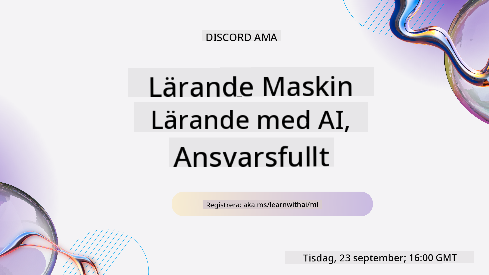
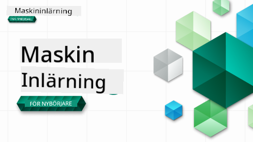

<!--
CO_OP_TRANSLATOR_METADATA:
{
  "original_hash": "a54f98da7bbee99ddc62a9e490eef7dc",
  "translation_date": "2025-09-29T22:02:45+00:00",
  "source_file": "README.md",
  "language_code": "sv"
}
-->
  
  
  
  
  

  
  
  

### 🌐 Stöd för flera språk  

#### Stöds via GitHub Action (Automatiserat och alltid uppdaterat)  

[Franska](../fr/README.md) | [Spanska](../es/README.md) | [Tyska](../de/README.md) | [Ryska](../ru/README.md) | [Arabiska](../ar/README.md) | [Persiska (Farsi)](../fa/README.md) | [Urdu](../ur/README.md) | [Kinesiska (Förenklad)](../zh/README.md) | [Kinesiska (Traditionell, Macau)](../mo/README.md) | [Kinesiska (Traditionell, Hongkong)](../hk/README.md) | [Kinesiska (Traditionell, Taiwan)](../tw/README.md) | [Japanska](../ja/README.md) | [Koreanska](../ko/README.md) | [Hindi](../hi/README.md) | [Bengali](../bn/README.md) | [Marathi](../mr/README.md) | [Nepali](../ne/README.md) | [Punjabi (Gurmukhi)](../pa/README.md) | [Portugisiska (Portugal)](../pt/README.md) | [Portugisiska (Brasilien)](../br/README.md) | [Italienska](../it/README.md) | [Polska](../pl/README.md) | [Turkiska](../tr/README.md) | [Grekiska](../el/README.md) | [Thailändska](../th/README.md) | [Svenska](./README.md) | [Danska](../da/README.md) | [Norska](../no/README.md) | [Finska](../fi/README.md) | [Holländska](../nl/README.md) | [Hebreiska](../he/README.md) | [Vietnamesiska](../vi/README.md) | [Indonesiska](../id/README.md) | [Malajiska](../ms/README.md) | [Tagalog (Filippinska)](../tl/README.md) | [Swahili](../sw/README.md) | [Ungerska](../hu/README.md) | [Tjeckiska](../cs/README.md) | [Slovakiska](../sk/README.md) | [Rumänska](../ro/README.md) | [Bulgariska](../bg/README.md) | [Serbiska (Kyrilliska)](../sr/README.md) | [Kroatiska](../hr/README.md) | [Slovenska](../sl/README.md) | [Ukrainska](../uk/README.md) | [Burmesiska (Myanmar)](../my/README.md)  

#### Gå med i vår community  

  

Vi har en pågående Discord-serie om att lära sig med AI. Läs mer och gå med oss på [Learn with AI Series](https://aka.ms/learnwithai/discord) från 18–30 september 2025. Du får tips och tricks om hur du använder GitHub Copilot för datavetenskap.  

  

# Maskininlärning för nybörjare – En kursplan  

> 🌍 Res runt i världen medan vi utforskar maskininlärning genom världens kulturer 🌍  

Cloud Advocates på Microsoft är glada att erbjuda en 12-veckors, 26-lektions kursplan om **maskininlärning**. I denna kursplan kommer du att lära dig om det som ibland kallas **klassisk maskininlärning**, främst med hjälp av Scikit-learn som bibliotek och undvika djupinlärning, vilket täcks i vår [AI för nybörjare-kursplan](https://aka.ms/ai4beginners). Kombinera dessa lektioner med vår ['Datavetenskap för nybörjare-kursplan'](https://aka.ms/ds4beginners), också!  

Res med oss runt i världen när vi tillämpar dessa klassiska tekniker på data från många delar av världen. Varje lektion innehåller quiz före och efter lektionen, skriftliga instruktioner för att slutföra lektionen, en lösning, en uppgift och mer. Vår projektbaserade pedagogik gör att du kan lära dig genom att bygga, ett beprövat sätt för nya färdigheter att fastna.  

**✍️ Stort tack till våra författare** Jen Looper, Stephen Howell, Francesca Lazzeri, Tomomi Imura, Cassie Breviu, Dmitry Soshnikov, Chris Noring, Anirban Mukherjee, Ornella Altunyan, Ruth Yakubu och Amy Boyd  

**🎨 Tack också till våra illustratörer** Tomomi Imura, Dasani Madipalli och Jen Looper  

**🙏 Speciellt tack 🙏 till våra Microsoft Student Ambassador-författare, granskare och innehållsbidragare**, särskilt Rishit Dagli, Muhammad Sakib Khan Inan, Rohan Raj, Alexandru Petrescu, Abhishek Jaiswal, Nawrin Tabassum, Ioan Samuila och Snigdha Agarwal  

**🤩 Extra tacksamhet till Microsoft Student Ambassadors Eric Wanjau, Jasleen Sondhi och Vidushi Gupta för våra R-lektioner!**  

# Kom igång  

Följ dessa steg:  
1. **Forka repot**: Klicka på "Fork"-knappen längst upp till höger på denna sida.  
2. **Klona repot**: `git clone https://github.com/microsoft/ML-For-Beginners.git`  

> [hitta alla ytterligare resurser för denna kurs i vår Microsoft Learn-samling](https://learn.microsoft.com/en-us/collections/qrqzamz1nn2wx3?WT.mc_id=academic-77952-bethanycheum)  

**[Studenter](https://aka.ms/student-page)**, för att använda denna kursplan, forka hela repot till ditt eget GitHub-konto och slutför övningarna själv eller med en grupp:  

- Börja med ett quiz före lektionen.  
- Läs lektionen och slutför aktiviteterna, pausa och reflektera vid varje kunskapskontroll.  
- Försök att skapa projekten genom att förstå lektionerna snarare än att köra lösningskoden; dock finns den koden tillgänglig i `/solution`-mapparna i varje projektorienterad lektion.  
- Ta quizet efter lektionen.  
- Slutför utmaningen.  
- Slutför uppgiften.  
- Efter att ha slutfört en lektionsgrupp, besök [Diskussionsforumet](https://github.com/microsoft/ML-For-Beginners/discussions) och "lär dig högt" genom att fylla i den relevanta PAT-mallen. En 'PAT' är ett Progress Assessment Tool som är en mall du fyller i för att fördjupa ditt lärande. Du kan också reagera på andra PATs så att vi kan lära oss tillsammans.  

> För vidare studier rekommenderar vi att följa dessa [Microsoft Learn](https://docs.microsoft.com/en-us/users/jenlooper-2911/collections/k7o7tg1gp306q4?WT.mc_id=academic-77952-leestott) moduler och lärvägar.  

**Lärare**, vi har [inkluderat några förslag](for-teachers.md) på hur man använder denna kursplan.  

---

## Videogenomgångar  

Vissa av lektionerna finns tillgängliga som korta videor. Du hittar alla dessa in-line i lektionerna, eller på [ML för nybörjare-spellistan på Microsoft Developer YouTube-kanal](https://aka.ms/ml-beginners-videos) genom att klicka på bilden nedan.  

  

---

## Möt teamet  

  

**Gif av** [Mohit Jaisal](https://linkedin.com/in/mohitjaisal)  

> 🎥 Klicka på bilden ovan för en video om projektet och personerna som skapade det!  

---

## Pedagogik  

Vi har valt två pedagogiska principer när vi byggde denna kursplan: att säkerställa att den är praktisk **projektbaserad** och att den innehåller **frekventa quiz**. Dessutom har denna kursplan ett gemensamt **tema** för att ge den sammanhållning.  

Genom att säkerställa att innehållet är kopplat till projekt görs processen mer engagerande för studenter och koncepten blir lättare att komma ihåg. Dessutom sätter ett quiz med låg insats före en klass studentens intention mot att lära sig ett ämne, medan ett andra quiz efter klassen säkerställer ytterligare retention. Denna kursplan är designad för att vara flexibel och rolig och kan tas i sin helhet eller delvis. Projekten börjar små och blir alltmer komplexa i slutet av den 12-veckors cykeln. Kursplanen inkluderar också ett efterord om verkliga tillämpningar av ML, som kan användas som extra kredit eller som grund för diskussion.  

> Hitta vår [Uppförandekod](CODE_OF_CONDUCT.md), [Bidragsriktlinjer](CONTRIBUTING.md) och [Översättningsriktlinjer](TRANSLATIONS.md). Vi välkomnar din konstruktiva feedback!  

## Varje lektion innehåller  

- valfri sketchnote  
- valfri kompletterande video  
- videogenomgång (vissa lektioner)  
- [quiz före lektionen](https://ff-quizzes.netlify.app/en/ml/)  
- skriftlig lektion  
- för projektbaserade lektioner, steg-för-steg-guider om hur man bygger projektet  
- kunskapskontroller  
- en utmaning  
- kompletterande läsning  
- uppgift  
- [quiz efter lektionen](https://ff-quizzes.netlify.app/en/ml/)  

> **En notering om språk**: Dessa lektioner är främst skrivna i Python, men många är också tillgängliga i R. För att slutföra en R-lektion, gå till `/solution`-mappen och leta efter R-lektioner. De inkluderar en .rmd-fil som representerar en **R Markdown**-fil som enkelt kan definieras som en inbäddning av `kodblock` (av R eller andra språk) och en `YAML-header` (som styr hur man formaterar utdata som PDF) i ett `Markdown-dokument`. Som sådan fungerar det som en exemplifierande författarram för datavetenskap eftersom det låter dig kombinera din kod, dess utdata och dina tankar genom att låta dig skriva ner dem i Markdown. Dessutom kan R Markdown-dokument renderas till utdataformat som PDF, HTML eller Word.  

> **En notering om quiz**: Alla quiz finns i [Quiz App-mappen](../../quiz-app), totalt 52 quiz med tre frågor vardera. De är länkade från lektionerna, men quiz-appen kan köras lokalt; följ instruktionerna i `quiz-app`-mappen för att köra lokalt eller distribuera till Azure.  

| Lektionsnummer |                             Ämne                              |                   Lektionsgruppering                   | Lärandemål                                                                                                             |                                                              Länkad lektion                                                               |                        Författare                        |  
| :-----------: | :------------------------------------------------------------: | :-------------------------------------------------: | ------------------------------------------------------------------------------------------------------------------------------- | :--------------------------------------------------------------------------------------------------------------------------------------: | :--------------------------------------------------: |  
|      01       |                Introduktion till maskininlärning                |      [Introduktion](1-Introduction/README.md)       | Lär dig de grundläggande koncepten bakom maskininlärning                                                                                |                                             [Lektion](1-Introduction/1-intro-to-ML/README.md)                                             |                       Muhammad                       |  
|      02       |                Historien om maskininlärning                 |      [Introduktion](1-Introduction/README.md)       | Lär dig historien bakom detta område                                                                                         |                                            [Lektion](1-Introduction/2-history-of-ML/README.md)                                            |                     Jen och Amy                      |  
|      03       |                 Rättvisa och maskininlärning                  |      [Introduktion](1-Introduction/README.md)       | Vilka viktiga filosofiska frågor kring rättvisa bör studenter överväga när de bygger och tillämpar ML-modeller? |                                              [Lektion](1-Introduction/3-fairness/README.md)                                               |                        Tomomi                        |
|      04       |                Tekniker för maskininlärning                   |      [Introduktion](1-Introduction/README.md)       | Vilka tekniker använder ML-forskare för att bygga ML-modeller?                                                                   |                                          [Lektion](1-Introduction/4-techniques-of-ML/README.md)                                           |                    Chris och Jen                     |
|      05       |                   Introduktion till regression                |        [Regression](2-Regression/README.md)         | Kom igång med Python och Scikit-learn för regressionsmodeller                                                                    |         [Python](2-Regression/1-Tools/README.md) • [R](../../2-Regression/1-Tools/solution/R/lesson_1.html)         |      Jen • Eric Wanjau       |
|      06       |                Nordamerikanska pumpapriser 🎃                 |        [Regression](2-Regression/README.md)         | Visualisera och rengör data som förberedelse för ML                                                                              |          [Python](2-Regression/2-Data/README.md) • [R](../../2-Regression/2-Data/solution/R/lesson_2.html)          |      Jen • Eric Wanjau       |
|      07       |                Nordamerikanska pumpapriser 🎃                 |        [Regression](2-Regression/README.md)         | Bygg linjära och polynomiska regressionsmodeller                                                                                 |        [Python](2-Regression/3-Linear/README.md) • [R](../../2-Regression/3-Linear/solution/R/lesson_3.html)        |      Jen och Dmitry • Eric Wanjau       |
|      08       |                Nordamerikanska pumpapriser 🎃                 |        [Regression](2-Regression/README.md)         | Bygg en logistisk regressionsmodell                                                                                              |     [Python](2-Regression/4-Logistic/README.md) • [R](../../2-Regression/4-Logistic/solution/R/lesson_4.html)      |      Jen • Eric Wanjau       |
|      09       |                          En webbapp 🔌                         |           [Webbapp](3-Web-App/README.md)            | Bygg en webbapp för att använda din tränade modell                                                                                |                                                 [Python](3-Web-App/1-Web-App/README.md)                                                  |                         Jen                          |
|      10       |                 Introduktion till klassificering              |    [Klassificering](4-Classification/README.md)     | Rengör, förbered och visualisera din data; introduktion till klassificering                                                     | [Python](4-Classification/1-Introduction/README.md) • [R](../../4-Classification/1-Introduction/solution/R/lesson_10.html)  | Jen och Cassie • Eric Wanjau |
|      11       |             Utsökta asiatiska och indiska rätter 🍜            |    [Klassificering](4-Classification/README.md)     | Introduktion till klassificerare                                                                                                 | [Python](4-Classification/2-Classifiers-1/README.md) • [R](../../4-Classification/2-Classifiers-1/solution/R/lesson_11.html) | Jen och Cassie • Eric Wanjau |
|      12       |             Utsökta asiatiska och indiska rätter 🍜            |    [Klassificering](4-Classification/README.md)     | Fler klassificerare                                                                                                              | [Python](4-Classification/3-Classifiers-2/README.md) • [R](../../4-Classification/3-Classifiers-2/solution/R/lesson_12.html) | Jen och Cassie • Eric Wanjau |
|      13       |             Utsökta asiatiska och indiska rätter 🍜            |    [Klassificering](4-Classification/README.md)     | Bygg en rekommendationswebbapp med din modell                                                                                    |                                              [Python](4-Classification/4-Applied/README.md)                                              |                         Jen                          |
|      14       |                   Introduktion till klustring                 |        [Klustring](5-Clustering/README.md)          | Rengör, förbered och visualisera din data; introduktion till klustring                                                           |         [Python](5-Clustering/1-Visualize/README.md) • [R](../../5-Clustering/1-Visualize/solution/R/lesson_14.html)         |      Jen • Eric Wanjau       |
|      15       |              Utforska nigerianska musiksmaker 🎧              |        [Klustring](5-Clustering/README.md)          | Utforska K-Means klustringsmetod                                                                                                 |           [Python](5-Clustering/2-K-Means/README.md) • [R](../../5-Clustering/2-K-Means/solution/R/lesson_15.html)           |      Jen • Eric Wanjau       |
|      16       |        Introduktion till naturlig språkbehandling ☕️         |   [Naturlig språkbehandling](6-NLP/README.md)       | Lär dig grunderna i NLP genom att bygga en enkel bot                                                                             |                                             [Python](6-NLP/1-Introduction-to-NLP/README.md)                                              |                       Stephen                        |
|      17       |                      Vanliga NLP-uppgifter ☕️                 |   [Naturlig språkbehandling](6-NLP/README.md)       | Fördjupa dina kunskaper i NLP genom att förstå vanliga uppgifter som krävs vid arbete med språkstrukturer                        |                                                    [Python](6-NLP/2-Tasks/README.md)                                                     |                       Stephen                        |
|      18       |             Översättning och sentimentanalys ♥️               |   [Naturlig språkbehandling](6-NLP/README.md)       | Översättning och sentimentanalys med Jane Austen                                                                                |                                            [Python](6-NLP/3-Translation-Sentiment/README.md)                                             |                       Stephen                        |
|      19       |                  Romantiska hotell i Europa ♥️                |   [Naturlig språkbehandling](6-NLP/README.md)       | Sentimentanalys med hotellrecensioner 1                                                                                         |                                               [Python](6-NLP/4-Hotel-Reviews-1/README.md)                                                |                       Stephen                        |
|      20       |                  Romantiska hotell i Europa ♥️                |   [Naturlig språkbehandling](6-NLP/README.md)       | Sentimentanalys med hotellrecensioner 2                                                                                         |                                               [Python](6-NLP/5-Hotel-Reviews-2/README.md)                                                |                       Stephen                        |
|      21       |            Introduktion till tidsserieprognoser               |        [Tidsserier](7-TimeSeries/README.md)         | Introduktion till tidsserieprognoser                                                                                            |                                             [Python](7-TimeSeries/1-Introduction/README.md)                                              |                      Francesca                       |
|      22       | ⚡️ Världens energiförbrukning ⚡️ - tidsserieprognoser med ARIMA |        [Tidsserier](7-TimeSeries/README.md)         | Tidsserieprognoser med ARIMA                                                                                                     |                                                 [Python](7-TimeSeries/2-ARIMA/README.md)                                                 |                      Francesca                       |
|      23       |  ⚡️ Världens energiförbrukning ⚡️ - tidsserieprognoser med SVR  |        [Tidsserier](7-TimeSeries/README.md)         | Tidsserieprognoser med Support Vector Regressor                                                                                 |                                                  [Python](7-TimeSeries/3-SVR/README.md)                                                  |                       Anirban                        |
|      24       |             Introduktion till förstärkningsinlärning          | [Förstärkningsinlärning](8-Reinforcement/README.md) | Introduktion till förstärkningsinlärning med Q-Learning                                                                         |                                             [Python](8-Reinforcement/1-QLearning/README.md)                                              |                        Dmitry                        |
|      25       |                 Hjälp Peter att undvika vargen! 🐺            | [Förstärkningsinlärning](8-Reinforcement/README.md) | Förstärkningsinlärning med Gym                                                                                                   |                                                [Python](8-Reinforcement/2-Gym/README.md)                                                 |                        Dmitry                        |
|  Postscript   |            Verkliga ML-scenarier och applikationer            |      [ML i verkligheten](9-Real-World/README.md)    | Intressanta och avslöjande verkliga applikationer av klassisk ML                                                                |                                             [Lektion](9-Real-World/1-Applications/README.md)                                              |                         Team                         |
|  Postscript   |            Modellfelsökning i ML med RAI-dashboard            |      [ML i verkligheten](9-Real-World/README.md)    | Modellfelsökning i maskininlärning med komponenter från Responsible AI-dashboard                                               |                                             [Lektion](9-Real-World/2-Debugging-ML-Models/README.md)                                              |                         Ruth Yakubu                       |

> [hitta alla ytterligare resurser för denna kurs i vår Microsoft Learn-samling](https://learn.microsoft.com/en-us/collections/qrqzamz1nn2wx3?WT.mc_id=academic-77952-bethanycheum)

## Offlineåtkomst

Du kan köra denna dokumentation offline med hjälp av [Docsify](https://docsify.js.org/#/). Forka detta repo, [installera Docsify](https://docsify.js.org/#/quickstart) på din lokala dator och skriv sedan `docsify serve` i rotmappen för detta repo. Webbplatsen kommer att köras på port 3000 på din localhost: `localhost:3000`.

## PDF:er

Hitta en pdf av läroplanen med länkar [här](https://microsoft.github.io/ML-For-Beginners/pdf/readme.pdf).

## 🎒 Andra kurser 

Vårt team producerar andra kurser! Kolla in:

- [Edge AI för nybörjare](https://aka.ms/edgeai-for-beginners)
- [AI-agenter för nybörjare](https://aka.ms/ai-agents-beginners)
- [Generativ AI för nybörjare](https://aka.ms/genai-beginners)
- [Generativ AI för nybörjare .NET](https://github.com/microsoft/Generative-AI-for-beginners-dotnet)
- [Generativ AI med JavaScript](https://github.com/microsoft/generative-ai-with-javascript)
- [Generativ AI med Java](https://github.com/microsoft/Generative-AI-for-beginners-java)
- [AI för nybörjare](https://aka.ms/ai-beginners)
- [Data Science för nybörjare](https://aka.ms/datascience-beginners)
- [ML för nybörjare](https://aka.ms/ml-beginners)
- [Cybersäkerhet för nybörjare](https://github.com/microsoft/Security-101) 
- [Webbutveckling för nybörjare](https://aka.ms/webdev-beginners)
- [IoT för nybörjare](https://aka.ms/iot-beginners)
- [XR-utveckling för nybörjare](https://github.com/microsoft/xr-development-for-beginners)
- [Bemästra GitHub Copilot för parprogrammering](https://github.com/microsoft/Mastering-GitHub-Copilot-for-Paired-Programming)
- [Bemästra GitHub Copilot för C#/.NET-utvecklare](https://github.com/microsoft/mastering-github-copilot-for-dotnet-csharp-developers)
- [Välj ditt eget Copilot-äventyr](https://github.com/microsoft/CopilotAdventures)

---

**Ansvarsfriskrivning**:  
Detta dokument har översatts med hjälp av AI-översättningstjänsten [Co-op Translator](https://github.com/Azure/co-op-translator). Även om vi strävar efter noggrannhet, bör det noteras att automatiserade översättningar kan innehålla fel eller felaktigheter. Det ursprungliga dokumentet på dess ursprungliga språk bör betraktas som den auktoritativa källan. För kritisk information rekommenderas professionell mänsklig översättning. Vi ansvarar inte för eventuella missförstånd eller feltolkningar som uppstår vid användning av denna översättning.