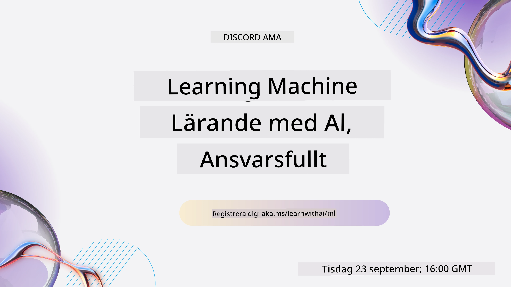
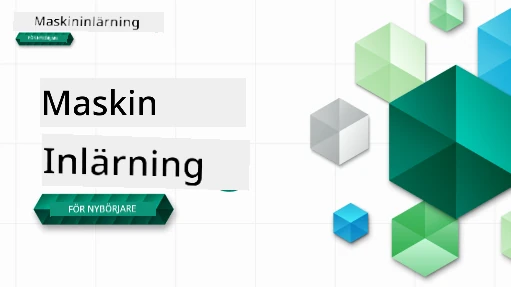

[](https://github.com/microsoft/ML-For-Beginners/blob/master/LICENSE)
[](https://GitHub.com/microsoft/ML-For-Beginners/graphs/contributors/)
[](https://GitHub.com/microsoft/ML-For-Beginners/issues/)
[](https://GitHub.com/microsoft/ML-For-Beginners/pulls/)
[](http://makeapullrequest.com)

[](https://GitHub.com/microsoft/ML-For-Beginners/watchers/)
[](https://GitHub.com/microsoft/ML-For-Beginners/network/)
[](https://GitHub.com/microsoft/ML-For-Beginners/stargazers/)

### 🌐 Flerspråkigt stöd

#### Stöds via GitHub Action (Automatiserat & Alltid Uppdaterat)

<!-- CO-OP TRANSLATOR LANGUAGES TABLE START -->
[Arabiska](../ar/README.md) | [Bengali](../bn/README.md) | [Bulgariska](../bg/README.md) | [Burmesiska (Myanmar)](../my/README.md) | [Kinesiska (Förenklad)](../zh-CN/README.md) | [Kinesiska (Traditionell, Hongkong)](../zh-HK/README.md) | [Kinesiska (Traditionell, Macau)](../zh-MO/README.md) | [Kinesiska (Traditionell, Taiwan)](../zh-TW/README.md) | [Kroatiska](../hr/README.md) | [Tjeckiska](../cs/README.md) | [Danska](../da/README.md) | [Holländska](../nl/README.md) | [Estniska](../et/README.md) | [Finska](../fi/README.md) | [Franska](../fr/README.md) | [Tyska](../de/README.md) | [Grekiska](../el/README.md) | [Hebreiska](../he/README.md) | [Hindi](../hi/README.md) | [Ungerska](../hu/README.md) | [Indonesiska](../id/README.md) | [Italienska](../it/README.md) | [Japanska](../ja/README.md) | [Kannada](../kn/README.md) | [Khmer](../km/README.md) | [Koreanska](../ko/README.md) | [Litauiska](../lt/README.md) | [Malajiska](../ms/README.md) | [Malayalam](../ml/README.md) | [Marathi](../mr/README.md) | [Nepalesiska](../ne/README.md) | [Nigeriansk Pidgin](../pcm/README.md) | [Norska](../no/README.md) | [Persiska (Farsi)](../fa/README.md) | [Polska](../pl/README.md) | [Portugisiska (Brasilien)](../pt-BR/README.md) | [Portugisiska (Portugal)](../pt-PT/README.md) | [Punjabi (Gurmukhi)](../pa/README.md) | [Rumänska](../ro/README.md) | [Ryska](../ru/README.md) | [Serbiska (Kyrilliska)](../sr/README.md) | [Slovakiska](../sk/README.md) | [Slovenska](../sl/README.md) | [Spanska](../es/README.md) | [Swahili](../sw/README.md) | [Svenska](./README.md) | [Tagalog (Filippinska)](../tl/README.md) | [Tamil](../ta/README.md) | [Telugu](../te/README.md) | [Thailändska](../th/README.md) | [Turkiska](../tr/README.md) | [Ukrainska](../uk/README.md) | [Urdu](../ur/README.md) | [Vietnamesiska](../vi/README.md)

> **Föredrar du att klona lokalt?**
>
> Detta repo inkluderar över 50 språköversättningar vilket avsevärt ökar nedladdningsstorleken. För att klona utan översättningar, använd sparse checkout:
>
> **Bash / macOS / Linux:**
> ```bash
> git clone --filter=blob:none --sparse https://github.com/microsoft/ML-For-Beginners.git
> cd ML-For-Beginners
> git sparse-checkout set --no-cone '/*' '!translations' '!translated_images'
> ```
>
> **CMD (Windows):**
> ```cmd
> git clone --filter=blob:none --sparse https://github.com/microsoft/ML-For-Beginners.git
> cd ML-For-Beginners
> git sparse-checkout set --no-cone "/*" "!translations" "!translated_images"
> ```
>
> Detta ger dig allt du behöver för att slutföra kursen med en mycket snabbare nedladdning.
<!-- CO-OP TRANSLATOR LANGUAGES TABLE END -->

#### Gå med i vårt community

[](https://discord.gg/nTYy5BXMWG)

Vi har en pågående Discord-serie för lärande med AI, lär dig mer och gå med oss på [Learn with AI Series](https://aka.ms/learnwithai/discord) från 18–30 september 2025. Du kommer att få tips och tricks om hur man använder GitHub Copilot för data science.



# Maskininlärning för nybörjare – En läroplan

> 🌍 Res runt jorden när vi utforskar Maskininlärning genom världskulturer 🌍

Cloud Advocates på Microsoft är glada att erbjuda en 12-veckors, 26-lektioners läroplan som handlar om **Maskininlärning**. I denna läroplan kommer du lära dig om vad som ibland kallas **klassisk maskininlärning**, med huvudsakligen Scikit-learn som bibliotek och undviker djupinlärning, vilken tas upp i vår [AI for Beginners-läroplan](https://aka.ms/ai4beginners). Kombinera dessa lektioner med vår ['Data Science for Beginners'-läroplan](https://aka.ms/ds4beginners) också!

Res med oss runt världen när vi applicerar dessa klassiska tekniker på data från många delar av världen. Varje lektion inkluderar för- och efterföreläsningsquiz, skriftliga instruktioner för att slutföra lektionen, en lösning, en uppgift och mer. Vår projektbaserade pedagogik låter dig lära dig medan du bygger, ett beprövat sätt för nya färdigheter att 'fästa'.

**✍️ Stort tack till våra författare** Jen Looper, Stephen Howell, Francesca Lazzeri, Tomomi Imura, Cassie Breviu, Dmitry Soshnikov, Chris Noring, Anirban Mukherjee, Ornella Altunyan, Ruth Yakubu och Amy Boyd

**🎨 Tack även till våra illustratörer** Tomomi Imura, Dasani Madipalli och Jen Looper

**🙏 Särskilt tack 🙏 till våra Microsoft Student Ambassador-författare, granskare och innehållsmedarbetare**, särskilt Rishit Dagli, Muhammad Sakib Khan Inan, Rohan Raj, Alexandru Petrescu, Abhishek Jaiswal, Nawrin Tabassum, Ioan Samuila och Snigdha Agarwal

**🤩 Extra tack till Microsoft Student Ambassadors Eric Wanjau, Jasleen Sondhi och Vidushi Gupta för våra R-lektioner!**

# Kom igång

Följ dessa steg:
1. **Fork:a repot**: Klicka på knappen "Fork" uppe i högra hörnet på denna sida.
2. **Klona repot**:   `git clone https://github.com/microsoft/ML-For-Beginners.git`

> 💡 **Snabbstartstips:** Vill du börja i en webbläsare utan att installera Python lokalt? Använd [GitHub Codespaces](https://github.com/features/codespaces) för att skapa en molnutvecklingsmiljö för din fork. Öppna den gröna **Code**-menyn, välj **Codespaces** och skapa en codespace; installera varje lektions nödvändiga beroenden inuti den vid behov.

> [hitta alla ytterligare resurser för denna kurs i vår samling på Microsoft Learn](https://learn.microsoft.com/en-us/collections/qrqzamz1nn2wx3?WT.mc_id=academic-77952-bethanycheum)

> 🔧 **Behöver du hjälp?** Kolla vår [Felsökningsguide](TROUBLESHOOTING.md) för lösningar på vanliga problem med installation, setup och körning av lektioner.


**[Studenter](https://aka.ms/student-page)**, för att använda denna läroplan, fork:a hela repot till ditt eget GitHub-konto och genomför övningarna på egen hand eller i grupp:

- Börja med ett för-lecture quiz.
- Läs föreläsningen och genomför aktiviteterna, pausa och reflektera vid varje kunskapskontroll.
- Försök skapa projekten genom att förstå lektionerna snarare än att köra lösningskoden; dock finns den koden tillgänglig i `/solution`-mapparna i varje projektorienterad lektion.
- Ta post-lecture quiz.
- Slutför utmaningen.
- Slutför uppgiften.
- Efter att ha slutfört en lektionsgrupp, besök [Diskussionsforumet](https://github.com/microsoft/ML-For-Beginners/discussions) och "lär högt" genom att fylla i rätt PAT-rubrik. En 'PAT' är ett bedömningsverktyg för framsteg som är en rubrik du fyller i för att främja ditt lärande. Du kan också reagera på andra PAT:er så att vi kan lära tillsammans.

> För vidare studier rekommenderar vi att följa dessa [Microsoft Learn](https://docs.microsoft.com/en-us/users/jenlooper-2911/collections/k7o7tg1gp306q4?WT.mc_id=academic-77952-leestott) moduler och lärvägar.

**Lärare**, vi har [inkluderat några förslag](for-teachers.md) om hur man använder denna läroplan.

---

## Video genomgångar

Några av lektionerna finns som korta videoklipp. Du kan hitta alla dessa in-line i lektionerna, eller på [ML for Beginners spellista på Microsoft Developer YouTube-kanalen](https://aka.ms/ml-beginners-videos) genom att klicka på bilden nedan.

[](https://aka.ms/ml-beginners-videos)

---

## Möt teamet

[](https://youtu.be/Tj1XWrDSYJU)

**Gif av** [Mohit Jaisal](https://linkedin.com/in/mohitjaisal)

> 🎥 Klicka på bilden ovan för en video om projektet och människorna som skapade det!

---

## Pedagogik

Vi har valt två pedagogiska principer under byggandet av denna läroplan: att säkerställa att den är praktiskt **projektbaserad** och att den inkluderar **frestande quiz**. Dessutom har denna läroplan ett gemensamt **tema** för att ge enhetlighet.

Genom att säkerställa att innehållet stämmer överens med projekt görs processen mer engagerande för studenter och behållning av koncept kommer att ökas. Dessutom sätter ett lågrisk-quiz före lektionen studentens intention mot att lära sig ett ämne, medan ett andra quiz efter klassen säkerställer ytterligare behållning. Denna läroplan designades för att vara flexibel och rolig och kan tas i sin helhet eller delvis. Projekten börjar små och blir alltmer komplexa mot slutet av den 12-veckors cykeln. Denna läroplan inkluderar också en epilog om verkliga tillämpningar av ML, vilken kan användas som extrapoäng eller som grund för diskussion.

> Hitta vår [Uppförandekod](CODE_OF_CONDUCT.md), [Bidra](CONTRIBUTING.md), [Översättningar](..) och [Felsökning](TROUBLESHOOTING.md) riktlinjer. Vi välkomnar din konstruktiva feedback!

## Varje lektion inkluderar

- valfritt sketchnote
- valfri kompletterande video
- video genomgång (endast vissa lektioner)
- [för-lecture uppvärmningsquiz](https://ff-quizzes.netlify.app/en/ml/)
- skriftlig lektion
- för projektbaserade lektioner, steg-för-steg guider för hur man bygger projektet
- kunskapskontroller
- en utmaning
- kompletterande läsning
- uppgift
- [post-lecture quiz](https://ff-quizzes.netlify.app/en/ml/)

> **En not om språk**: Dessa lektioner är huvudsakligen skrivna i Python, men många finns också tillgängliga i R. För att slutföra en R-lektion, gå till `/solution`-mappen och leta efter R-lektioner. De innehåller en .rmd filändelse som representerar en **R Markdown**-fil, vilket enkelt kan definieras som en inbäddning av `kodblock` (av R eller andra språk) och en `YAML-header` (som styr hur utdata, t.ex. PDF, formateras) i ett `Markdown-dokument`. Som sådan fungerar det som en utmärkt författarram för data science eftersom det låter dig kombinera din kod, dess utdata och dina tankar genom att låta dig skriva ner dem i Markdown. Dessutom kan R Markdown-dokument renderas till utdataformat som PDF, HTML eller Word.

> **En not om quiz**: Alla quiz finns i mappen [Quiz App](../../quiz-app), totalt 52 quiz med tre frågor vardera. De länkas från lektionerna men quiz-appen kan köras lokalt; följ instruktionerna i `quiz-app` mappen för lokal hosting eller distribution till Azure.

| Lektion Nummer |                             Ämne                              |                   Lektion Grupp                          | Lärandemål                                                                                                                   |                                                              Länkad Lektion                                                               |                        Författare                         |
| :-----------: | :------------------------------------------------------------: | :-------------------------------------------------: | ------------------------------------------------------------------------------------------------------------------------------- | :--------------------------------------------------------------------------------------------------------------------------------------: | :--------------------------------------------------: |
|      01       |                Introduktion till maskininlärning                |      [Introduction](1-Introduction/README.md)       | Lär dig de grundläggande begreppen bakom maskininlärning                                                                                  |                                             [Lesson](1-Introduction/1-intro-to-ML/README.md)                                             |                       Muhammad                       |
|      02       |                Maskininlärningens historia                 |      [Introduction](1-Introduction/README.md)       | Lär dig historien bakom detta område                                                                                         |                                            [Lesson](1-Introduction/2-history-of-ML/README.md)                                            |                     Jen and Amy                      |
|      03       |                 Rättvisa och maskininlärning                  |      [Introduction](1-Introduction/README.md)       | Vilka är de viktiga filosofiska frågorna kring rättvisa som studenter bör beakta när de bygger och använder ML-modeller? |                                              [Lesson](1-Introduction/3-fairness/README.md)                                               |                        Tomomi                        |
|      04       |                Tekniker för maskininlärning                 |      [Introduction](1-Introduction/README.md)       | Vilka tekniker använder ML-forskare för att bygga ML-modeller?                                                                       |                                          [Lesson](1-Introduction/4-techniques-of-ML/README.md)                                           |                    Chris and Jen                     |
|      05       |                   Introduktion till regression                   |        [Regression](2-Regression/README.md)         | Kom igång med Python och Scikit-learn för regressionsmodeller                                                                  |         [Python](2-Regression/1-Tools/README.md) • [R](../../2-Regression/1-Tools/solution/R/lesson_1.html)         |      Jen • Eric Wanjau       |
|      06       |                Nordamerikanska pumpapriser 🎃                |        [Regression](2-Regression/README.md)         | Visualisera och rengör data som förberedelse för ML                                                                                  |          [Python](2-Regression/2-Data/README.md) • [R](../../2-Regression/2-Data/solution/R/lesson_2.html)          |      Jen • Eric Wanjau       |
|      07       |                Nordamerikanska pumpapriser 🎃                |        [Regression](2-Regression/README.md)         | Bygg linjära och polynomiska regressionsmodeller                                                                                   |        [Python](2-Regression/3-Linear/README.md) • [R](../../2-Regression/3-Linear/solution/R/lesson_3.html)        |      Jen and Dmitry • Eric Wanjau       |
|      08       |                Nordamerikanska pumpapriser 🎃                |        [Regression](2-Regression/README.md)         | Bygg en logistisk regressionsmodell                                                                                               |     [Python](2-Regression/4-Logistic/README.md) • [R](../../2-Regression/4-Logistic/solution/R/lesson_4.html)      |      Jen • Eric Wanjau       |
|      09       |                          En webbapp 🔌                          |           [Web App](3-Web-App/README.md)            | Bygg en webbapp för att använda din tränade modell                                                                                       |                                                 [Python](3-Web-App/1-Web-App/README.md)                                                  |                         Jen                          |
|      10       |                 Introduktion till klassificering                 |    [Classification](4-Classification/README.md)     | Rengör, förbered och visualisera dina data; introduktion till klassificering                                                            | [Python](4-Classification/1-Introduction/README.md) • [R](../../4-Classification/1-Introduction/solution/R/lesson_10.html)  | Jen and Cassie • Eric Wanjau |
|      11       |             Underbara asiatiska och indiska kök 🍜             |    [Classification](4-Classification/README.md)     | Introduktion till klassificerare                                                                                                     | [Python](4-Classification/2-Classifiers-1/README.md) • [R](../../4-Classification/2-Classifiers-1/solution/R/lesson_11.html) | Jen and Cassie • Eric Wanjau |
|      12       |             Underbara asiatiska och indiska kök 🍜             |    [Classification](4-Classification/README.md)     | Fler klassificerare                                                                                                                | [Python](4-Classification/3-Classifiers-2/README.md) • [R](../../4-Classification/3-Classifiers-2/solution/R/lesson_12.html) | Jen and Cassie • Eric Wanjau |
|      13       |             Underbara asiatiska och indiska kök 🍜             |    [Classification](4-Classification/README.md)     | Bygg en rekommenderande webbapp med din modell                                                                                    |                                              [Python](4-Classification/4-Applied/README.md)                                              |                         Jen                          |
|      14       |                   Introduktion till klustring                   |        [Clustering](5-Clustering/README.md)         | Rengör, förbered och visualisera dina data; introduktion till klustring                                                                |         [Python](5-Clustering/1-Visualize/README.md) • [R](../../5-Clustering/1-Visualize/solution/R/lesson_14.html)         |      Jen • Eric Wanjau       |
|      15       |              Utforska nigerianska musiksmaker 🎧              |        [Clustering](5-Clustering/README.md)         | Utforska K-Means klustringsmetoden                                                                                           |           [Python](5-Clustering/2-K-Means/README.md) • [R](../../5-Clustering/2-K-Means/solution/R/lesson_15.html)           |      Jen • Eric Wanjau       |
|      16       |        Introduktion till naturlig språkbehandling ☕️         |   [Natural language processing](6-NLP/README.md)    | Lär dig grunderna om NLP genom att bygga en enkel bot                                                                             |                                             [Python](6-NLP/1-Introduction-to-NLP/README.md)                                              |                       Stephen                        |
|      17       |                      Vanliga NLP-uppgifter ☕️                      |   [Natural language processing](6-NLP/README.md)    | Fördjupa din NLP-kunskap genom att förstå vanliga uppgifter som krävs vid arbete med språkliga strukturer                          |                                                    [Python](6-NLP/2-Tasks/README.md)                                                     |                       Stephen                        |
|      18       |             Översättning och sentimentanalys ♥️              |   [Natural language processing](6-NLP/README.md)    | Översättning och sentimentanalys med Jane Austen                                                                             |                                            [Python](6-NLP/3-Translation-Sentiment/README.md)                                             |                       Stephen                        |
|      19       |                  Romantiska hotell i Europa ♥️                  |   [Natural language processing](6-NLP/README.md)    | Sentimentanalys med hotellrecensioner 1                                                                                         |                                               [Python](6-NLP/4-Hotel-Reviews-1/README.md)                                                |                       Stephen                        |
|      20       |                  Romantiska hotell i Europa ♥️                  |   [Natural language processing](6-NLP/README.md)    | Sentimentanalys med hotellrecensioner 2                                                                                         |                                               [Python](6-NLP/5-Hotel-Reviews-2/README.md)                                                |                       Stephen                        |
|      21       |            Introduktion till tidsserieprognoser             |        [Time series](7-TimeSeries/README.md)        | Introduktion till tidsserieprognoser                                                                                         |                                             [Python](7-TimeSeries/1-Introduction/README.md)                                              |                      Francesca                       |
|      22       | ⚡️ Världens energianvändning ⚡️ - tidsserieprognoser med ARIMA |        [Time series](7-TimeSeries/README.md)        | Tidsserieprognoser med ARIMA                                                                                              |                                                 [Python](7-TimeSeries/2-ARIMA/README.md)                                                 |                      Francesca                       |
|      23       |  ⚡️ Världens energianvändning ⚡️ - tidsserieprognoser med SVR  |        [Time series](7-TimeSeries/README.md)        | Tidsserieprognoser med Support Vector Regressor                                                                           |                                                  [Python](7-TimeSeries/3-SVR/README.md)                                                  |                       Anirban                        |
|      24       |             Introduktion till förstärkningsinlärning             | [Reinforcement learning](8-Reinforcement/README.md) | Introduktion till förstärkningsinlärning med Q-Learning                                                                          |                                             [Python](8-Reinforcement/1-QLearning/README.md)                                              |                        Dmitry                        |
|      25       |                 Hjälp Peter att undvika vargen! 🐺                  | [Reinforcement learning](8-Reinforcement/README.md) | Gym för förstärkningsinlärning                                                                                                      |                                                [Python](8-Reinforcement/2-Gym/README.md)                                                 |                        Dmitry                        |
|  Postscript   |            Verkliga ML-scenarier och tillämpningar            |      [ML in the Wild](9-Real-World/README.md)       | Intressanta och avslöjande verkliga tillämpningar av klassisk ML                                                               |                                             [Lesson](9-Real-World/1-Applications/README.md)                                              |                         Team                         |
|  Postscript   |            Felsökning av modeller i ML med RAI-instrumentpanelen            |      [ML in the Wild](9-Real-World/README.md)       | Felsökning av modeller i maskininlärning med komponenter i instrumentpanelen Responsible AI                                                              |                                             [Lesson](9-Real-World/2-Debugging-ML-Models/README.md)                                              |                     Ruth Yakubu                      |

> [hitta alla ytterligare resurser för denna kurs i vår Microsoft Learn-samling](https://learn.microsoft.com/en-us/collections/qrqzamz1nn2wx3?WT.mc_id=academic-77952-bethanycheum)

## Offlineåtkomst

Du kan köra denna dokumentation offline genom att använda [Docsify](https://docsify.js.org/#/). Forka detta repo, [installera Docsify](https://docsify.js.org/#/quickstart) på din lokala dator och skriv sedan i rotmappen för detta repo `docsify serve`. Webbplatsen kommer att serveras på port 3000 på din localhost: `localhost:3000`.

## PDF-filer

Hitta en pdf av kursplanen med länkar [här](https://microsoft.github.io/ML-For-Beginners/pdf/readme.pdf).


## 🎒 Andra kurser 

Vårt team producerar andra kurser! Kolla in:

<!-- CO-OP TRANSLATOR OTHER COURSES START -->
### LangChain
[](https://aka.ms/langchain4j-for-beginners)
[](https://aka.ms/langchainjs-for-beginners?WT.mc_id=m365-94501-dwahlin)
[](https://github.com/microsoft/langchain-for-beginners?WT.mc_id=m365-94501-dwahlin)
---

### Azure / Edge / MCP / Agenter
[](https://github.com/microsoft/AZD-for-beginners?WT.mc_id=academic-105485-koreyst)
[](https://github.com/microsoft/edgeai-for-beginners?WT.mc_id=academic-105485-koreyst)
[](https://github.com/microsoft/mcp-for-beginners?WT.mc_id=academic-105485-koreyst)
[](https://github.com/microsoft/ai-agents-for-beginners?WT.mc_id=academic-105485-koreyst)

---
 
### Generativ AI-serie
[](https://github.com/microsoft/generative-ai-for-beginners?WT.mc_id=academic-105485-koreyst)
[-9333EA?style=for-the-badge&labelColor=E5E7EB&color=9333EA)](https://github.com/microsoft/Generative-AI-for-beginners-dotnet?WT.mc_id=academic-105485-koreyst)
[-C084FC?style=for-the-badge&labelColor=E5E7EB&color=C084FC)](https://github.com/microsoft/generative-ai-for-beginners-java?WT.mc_id=academic-105485-koreyst)
[-E879F9?style=for-the-badge&labelColor=E5E7EB&color=E879F9)](https://github.com/microsoft/generative-ai-with-javascript?WT.mc_id=academic-105485-koreyst)

---
 
### Kärninlärning
[](https://aka.ms/ml-beginners?WT.mc_id=academic-105485-koreyst)
[](https://aka.ms/datascience-beginners?WT.mc_id=academic-105485-koreyst)
[](https://aka.ms/ai-beginners?WT.mc_id=academic-105485-koreyst)
[](https://github.com/microsoft/Security-101?WT.mc_id=academic-96948-sayoung)
[](https://aka.ms/webdev-beginners?WT.mc_id=academic-105485-koreyst)
[](https://aka.ms/iot-beginners?WT.mc_id=academic-105485-koreyst)
[](https://github.com/microsoft/xr-development-for-beginners?WT.mc_id=academic-105485-koreyst)

---
 
### Copilot-serie
[](https://aka.ms/GitHubCopilotAI?WT.mc_id=academic-105485-koreyst)
[](https://github.com/microsoft/mastering-github-copilot-for-dotnet-csharp-developers?WT.mc_id=academic-105485-koreyst)
[](https://github.com/microsoft/CopilotAdventures?WT.mc_id=academic-105485-koreyst)
<!-- CO-OP TRANSLATOR OTHER COURSES END -->

## Få hjälp

Om du fastnar eller har frågor medan du lär dig maskininlärning eller bygger AI-applikationer, oroa dig inte — hjälp finns tillgänglig.

Du kan delta i diskussioner med andra elever och utvecklare, ställa frågor och dela dina idéer med communityn.

- Gå med i communityn för att ställa frågor och lära dig tillsammans med andra
- Diskutera maskininlärningskoncept och projektidéer
- Få vägledning från erfarna utvecklare

En stödjande community är ett utmärkt sätt att utveckla dina färdigheter och lösa problem snabbare.

[Microsoft Foundry Discord Community](https://discord.gg/nTYy5BXMWG)

Om du stöter på buggar, fel eller har förslag på förbättringar kan du också öppna ett **Issue** i detta repository för att rapportera problemet.

För produktfeedback eller för att söka befintliga community-inlägg, besök Developer Forum:

[](https://aka.ms/foundry/forum)

## Ytterligare tips för lärande

- Gå igenom anteckningsböcker efter varje lektion för bättre förståelse.
- Öva på att implementera algoritmer självständigt.
- Utforska verkliga datamängder med hjälp av de inlärda koncepten.

---

<!-- CO-OP TRANSLATOR DISCLAIMER START -->
**Ansvarsfriskrivning**:
Detta dokument har översatts med hjälp av AI-översättningstjänsten [Co-op Translator](https://github.com/Azure/co-op-translator). Även om vi strävar efter noggrannhet, var vänlig notera att automatiska översättningar kan innehålla fel eller brister. Det ursprungliga dokumentet på dess modersmål bör betraktas som den auktoritativa källan. För kritisk information rekommenderas professionell mänsklig översättning. Vi ansvarar inte för några missförstånd eller feltolkningar som uppstår till följd av användningen av denna översättning.
<!-- CO-OP TRANSLATOR DISCLAIMER END -->