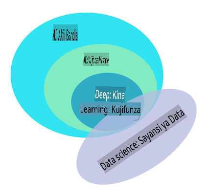

# Utangulizi wa ujifunzaji wa mashine

## [Jaribio la kabla ya muhadhara](https://gray-sand-07a10f403.1.azurestaticapps.net/quiz/1/)

---

> 🎥 Bonyeza picha hapo juu kwa video fupi inayofanya kazi kupitia somo hili.

Karibu kwenye kozi hii ya ujifunzaji wa mashine ya kiasili kwa wanaoanza! Ikiwa wewe ni mgeni kabisa kwenye mada hii, au ni mtaalamu wa ML mwenye uzoefu anayetafuta kuboresha eneo fulani, tunafurahi kuwa na wewe! Tunataka kuunda sehemu rafiki ya kuanzisha masomo yako ya ML na tutafurahi kutathmini, kujibu, na kujumuisha [maoni yako](https://github.com/microsoft/ML-For-Beginners/discussions).

> 🎥 Bonyeza picha hapo juu kwa video: John Guttag wa MIT anatambulisha ujifunzaji wa mashine

---
## Kuanza na ujifunzaji wa mashine

Kabla ya kuanza na mtaala huu, unahitaji kuwa na kompyuta yako imewekwa na tayari kuendesha vitabu vya maelezo (notebooks) kwa ndani.

- **Sanidi kompyuta yako na video hizi**. Tumia viungo vifuatavyo kujifunza [jinsi ya kusakinisha Python](https://youtu.be/CXZYvNRIAKM) kwenye mfumo wako na [kuweka mhariri wa maandishi](https://youtu.be/EU8eayHWoZg) kwa ajili ya maendeleo.
- **Jifunze Python**. Pia inashauriwa kuwa na uelewa wa msingi wa [Python](https://docs.microsoft.com/learn/paths/python-language/?WT.mc_id=academic-77952-leestott), lugha ya programu inayofaa kwa wanasayansi wa data ambayo tunatumia katika kozi hii.
- **Jifunze Node.js na JavaScript**. Pia tunatumia JavaScript mara kadhaa katika kozi hii tunapojenga programu za wavuti, kwa hivyo utahitaji kuwa na [node](https://nodejs.org) na [npm](https://www.npmjs.com/) zimesakinishwa, pamoja na [Visual Studio Code](https://code.visualstudio.com/) inayopatikana kwa ajili ya maendeleo ya Python na JavaScript.
- **Unda akaunti ya GitHub**. Kwa kuwa umetuona hapa kwenye [GitHub](https://github.com), unaweza tayari kuwa na akaunti, lakini kama huna, unda moja na kisha nakili mtaala huu kutumia wewe mwenyewe. (Usisite kutupa nyota, pia 😊)
- **Chunguza Scikit-learn**. Jijulishe na [Scikit-learn](https://scikit-learn.org/stable/user_guide.html), seti ya maktaba za ML ambazo tunazirejelea katika masomo haya.

---
## Ujifunzaji wa mashine ni nini?

Neno 'ujifunzaji wa mashine' ni moja ya maneno maarufu na yanayotumika mara nyingi siku hizi. Kuna uwezekano mkubwa kwamba umesikia neno hili angalau mara moja ikiwa una aina fulani ya ufahamu wa teknolojia, bila kujali unafanya kazi katika uwanja gani. Mitambo ya ujifunzaji wa mashine, hata hivyo, ni fumbo kwa watu wengi. Kwa mwanzilishi wa ujifunzaji wa mashine, somo hili linaweza kuhisi kuwa gumu wakati mwingine. Kwa hiyo, ni muhimu kuelewa ujifunzaji wa mashine ni nini hasa, na kujifunza kuhusu hilo hatua kwa hatua, kupitia mifano ya vitendo.

---
## Mchoro wa hype

> Google Trends inaonyesha 'mchoro wa hype' wa hivi karibuni wa neno 'ujifunzaji wa mashine'

---
## Ulimwengu wa fumbo

Tunaishi katika ulimwengu uliojaa fumbo za kuvutia. Wanasayansi wakubwa kama Stephen Hawking, Albert Einstein, na wengine wengi wamejitolea maisha yao kutafuta habari za maana ambazo zinagundua fumbo za ulimwengu unaotuzunguka. Hii ni hali ya binadamu ya kujifunza: mtoto wa binadamu hujifunza mambo mapya na kugundua muundo wa ulimwengu wao mwaka baada ya mwaka wanapokua hadi utu uzima.

---
## Ubongo wa mtoto

Ubongo wa mtoto na hisia zake hutambua ukweli wa mazingira yao na taratibu hujifunza mifumo iliyofichwa ya maisha ambayo husaidia mtoto kuunda sheria za kimantiki za kutambua mifumo iliyojifunza. Mchakato wa kujifunza wa ubongo wa binadamu hufanya wanadamu kuwa viumbe vyenye ustadi zaidi duniani. Kujifunza mfululizo kwa kugundua mifumo iliyofichwa na kisha kubuni kwenye mifumo hiyo hutuwezesha kujiboresha zaidi na zaidi katika maisha yetu yote. Uwezo huu wa kujifunza na uwezo wa kubadilika unahusiana na dhana inayoitwa [ubongo plastiki](https://www.simplypsychology.org/brain-plasticity.html). Kwa juu juu, tunaweza kuchora baadhi ya mfanano wa motisha kati ya mchakato wa kujifunza wa ubongo wa binadamu na dhana za ujifunzaji wa mashine.

---
## Ubongo wa binadamu

[Ubongo wa binadamu](https://www.livescience.com/29365-human-brain.html) hutambua mambo kutoka ulimwengu wa kweli, huchakata habari iliyotambuliwa, hufanya maamuzi ya kimantiki, na hufanya vitendo fulani kulingana na hali. Hii ndio tunaita kujiendesha kwa akili. Tunapopanga nakala ya mchakato wa tabia ya akili kwa mashine, inaitwa akili ya bandia (AI).

---
## Baadhi ya istilahi

Ingawa maneno yanaweza kuchanganywa, ujifunzaji wa mashine (ML) ni sehemu muhimu ya akili ya bandia. **ML inahusu kutumia algoriti maalum kugundua habari za maana na kupata mifumo iliyofichwa kutoka kwa data iliyotambuliwa ili kuthibitisha mchakato wa kufanya maamuzi ya kimantiki**.

---
## AI, ML, Kujifunza kwa kina

> Mchoro unaoonyesha uhusiano kati ya AI, ML, kujifunza kwa kina, na sayansi ya data. Picha ya [Jen Looper](https://twitter.com/jenlooper) iliyochochewa na [picha hii](https://softwareengineering.stackexchange.com/questions/366996/distinction-between-ai-ml-neural-networks-deep-learning-and-data-mining)

---
## Dhana za kufunika

Katika mtaala huu, tutaangazia tu dhana za msingi za ujifunzaji wa mashine ambazo mwanzilishi lazima azijue. Tunashughulikia kile tunachokiita 'ujifunzaji wa mashine wa kiasili' hasa kwa kutumia Scikit-learn, maktaba bora ambayo wanafunzi wengi hutumia kujifunza misingi. Ili kuelewa dhana pana za akili ya bandia au kujifunza kwa kina, maarifa thabiti ya msingi ya ujifunzaji wa mashine ni muhimu, na hivyo tungependa kuyatoa hapa.

---
## Katika kozi hii utajifunza:

- dhana za msingi za ujifunzaji wa mashine
- historia ya ML
- ML na usawa
- mbinu za ML za regression
- mbinu za ML za uainishaji
- mbinu za ML za clustering
- mbinu za ML za usindikaji wa lugha asilia
- mbinu za ML za utabiri wa mfululizo wa wakati
- ujifunzaji wa kuimarisha
- matumizi halisi ya ML

---
## Kile hatutafunika

- kujifunza kwa kina
- mitandao ya neva
- AI

Ili kufanya uzoefu wa kujifunza kuwa bora, tutakwepa ugumu wa mitandao ya neva, 'kujifunza kwa kina' - ujenzi wa mifano yenye tabaka nyingi kwa kutumia mitandao ya neva - na AI, ambayo tutajadili katika mtaala tofauti. Pia tutatoa mtaala ujao wa sayansi ya data ili kuzingatia kipengele hicho cha uwanja huu mkubwa.

---
## Kwa nini ujifunze ujifunzaji wa mashine?

Ujifunzaji wa mashine, kutoka mtazamo wa mifumo, unafafanuliwa kama uundaji wa mifumo ya kiotomatiki inayoweza kujifunza mifumo iliyofichwa kutoka kwa data ili kusaidia kufanya maamuzi ya akili.

Motisha hii imechochewa kwa kiasi fulani na jinsi ubongo wa binadamu unavyojifunza mambo fulani kulingana na data inayotambuliwa kutoka ulimwengu wa nje.

✅ Fikiria kwa dakika moja kwa nini biashara ingependa kujaribu kutumia mikakati ya ujifunzaji wa mashine dhidi ya kuunda injini ya sheria zilizowekwa ngumu.

---
## Matumizi ya ujifunzaji wa mashine

Matumizi ya ujifunzaji wa mashine sasa yako karibu kila mahali, na ni kama data inayoenea katika jamii zetu, inayozalishwa na simu zetu mahiri, vifaa vilivyounganishwa, na mifumo mingine. Kwa kuzingatia uwezo mkubwa wa algoriti za kisasa za ujifunzaji wa mashine, watafiti wamekuwa wakichunguza uwezo wao wa kutatua matatizo ya maisha ya kila siku yenye vipimo vingi na taaluma nyingi na matokeo mazuri.

---
## Mifano ya ML iliyotumika

**Unaweza kutumia ujifunzaji wa mashine kwa njia nyingi**:

- Kutabiri uwezekano wa ugonjwa kutoka historia ya matibabu ya mgonjwa au ripoti.
- Kutumia data ya hali ya hewa kutabiri matukio ya hali ya hewa.
- Kuelewa hisia ya maandishi.
- Kugundua habari za uongo ili kuzuia kuenea kwa propaganda.

Fedha, uchumi, sayansi ya dunia, uchunguzi wa anga, uhandisi wa biomedical, sayansi ya utambuzi, na hata nyanja za sayansi ya jamii zimechukua ujifunzaji wa mashine kutatua matatizo magumu ya uchakataji wa data katika maeneo yao.

---
## Hitimisho

Ujifunzaji wa mashine unaotomatisha mchakato wa kugundua mifumo kwa kupata maarifa ya maana kutoka kwa data halisi au data iliyotengenezwa. Imejidhihirisha kuwa na thamani kubwa katika biashara, afya, na matumizi ya kifedha, kati ya mengine.

Katika siku za usoni, kuelewa misingi ya ujifunzaji wa mashine kutakuwa lazima kwa watu kutoka fani yoyote kutokana na kuenea kwake.

---
# 🚀 Changamoto

Chora, kwenye karatasi au kwa kutumia programu ya mtandaoni kama [Excalidraw](https://excalidraw.com/), uelewa wako wa tofauti kati ya AI, ML, kujifunza kwa kina, na sayansi ya data. Ongeza baadhi ya mawazo ya matatizo ambayo kila moja ya mbinu hizi ni nzuri katika kutatua.

# [Jaribio la baada ya muhadhara](https://gray-sand-07a10f403.1.azurestaticapps.net/quiz/2/)

---
# Mapitio & Kujisomea

Ili kujifunza zaidi kuhusu jinsi unavyoweza kufanya kazi na algoriti za ML kwenye wingu, fuata [Njia ya Kujifunza](https://docs.microsoft.com/learn/paths/create-no-code-predictive-models-azure-machine-learning/?WT.mc_id=academic-77952-leestott).

Chukua [Njia ya Kujifunza](https://docs.microsoft.com/learn/modules/introduction-to-machine-learning/?WT.mc_id=academic-77952-leestott) kuhusu misingi ya ML.

---
# Kazi

[Anza na kukimbia](assignment.md)

**Kanusho**: 
Hati hii imetafsiriwa kwa kutumia huduma za tafsiri za AI za mashine. Ingawa tunajitahidi kwa usahihi, tafadhali fahamu kwamba tafsiri za kiotomatiki zinaweza kuwa na makosa au kutokuwa sahihi. Hati ya asili katika lugha yake ya asili inapaswa kuzingatiwa kama chanzo cha mamlaka. Kwa habari muhimu, tafsiri ya kibinadamu ya kitaalamu inapendekezwa. Hatutawajibika kwa kutoelewana au tafsiri zisizo sahihi zinazotokana na matumizi ya tafsiri hii.