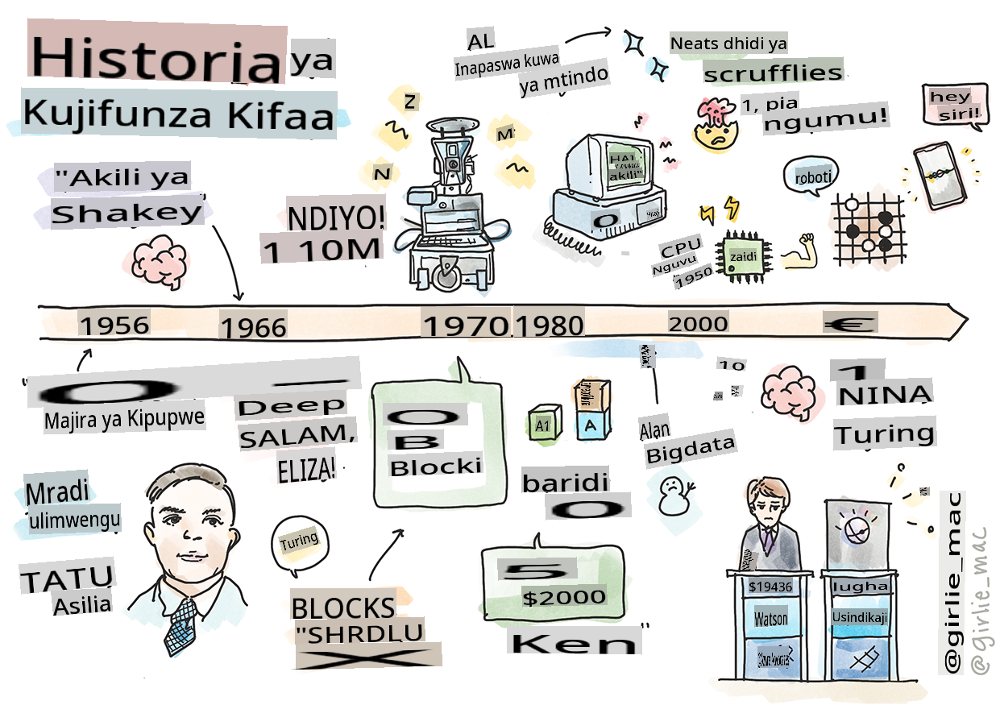
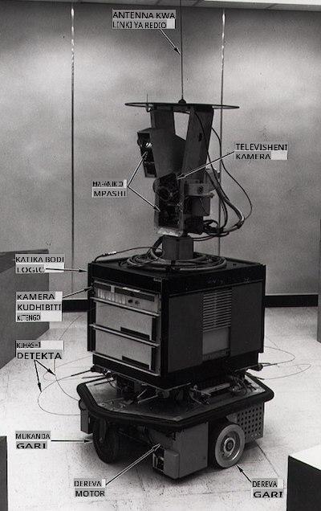
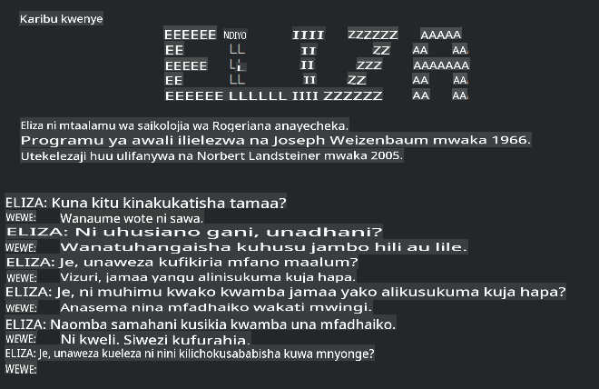

# Historia ya ujifunzaji wa mashine

> Sketchnote na [Tomomi Imura](https://www.twitter.com/girlie_mac)

## [Jaribio la kabla ya somo](https://gray-sand-07a10f403.1.azurestaticapps.net/quiz/3/)

---

> 🎥 Bonyeza picha hapo juu kwa video fupi inayopitia somo hili.

Katika somo hili, tutapitia hatua kuu katika historia ya ujifunzaji wa mashine na akili bandia.

Historia ya akili bandia (AI) kama uwanja inaunganishwa na historia ya ujifunzaji wa mashine, kwani algorithmi na maendeleo ya kompyuta yanayounga mkono ML yaliingia katika maendeleo ya AI. Ni muhimu kukumbuka kwamba, ingawa nyanja hizi kama maeneo tofauti ya uchunguzi zilianza kuimarika miaka ya 1950, [uvumbuzi muhimu wa algorithmi, takwimu, hisabati, kompyuta na kiufundi](https://wikipedia.org/wiki/Timeline_of_machine_learning) ulitangulia na kuingiliana na enzi hii. Kwa kweli, watu wamekuwa wakifikiria kuhusu maswali haya kwa [mamia ya miaka](https://wikipedia.org/wiki/History_of_artificial_intelligence): makala hii inajadili misingi ya kihistoria ya wazo la 'mashine inayofikiria.'

---
## Uvumbuzi muhimu

- 1763, 1812 [Nadharia ya Bayes](https://wikipedia.org/wiki/Bayes%27_theorem) na watangulizi wake. Nadharia hii na matumizi yake yanasaidia katika inferensi, ikielezea uwezekano wa tukio kutokea kwa msingi wa maarifa ya awali.
- 1805 [Nadharia ya Mraba Mdogo](https://wikipedia.org/wiki/Least_squares) na mtaalamu wa hesabu wa Kifaransa Adrien-Marie Legendre. Nadharia hii, ambayo utajifunza katika kitengo chetu cha Regression, husaidia katika kufaa data.
- 1913 [Minyororo ya Markov](https://wikipedia.org/wiki/Markov_chain), iliyotajwa baada ya mtaalamu wa hesabu wa Kirusi Andrey Markov, hutumika kuelezea mfululizo wa matukio yanayoweza kutokea kwa msingi wa hali ya awali.
- 1957 [Perceptron](https://wikipedia.org/wiki/Perceptron) ni aina ya kigeuaji cha mstari kilichovumbuliwa na mwanasaikolojia wa Marekani Frank Rosenblatt ambayo ina msingi katika maendeleo ya ujifunzaji wa kina.

---

- 1967 [Jirani Karibu](https://wikipedia.org/wiki/Nearest_neighbor) ni algorithmi iliyoundwa awali kwa ajili ya kupanga njia. Katika muktadha wa ML hutumika kugundua mifumo.
- 1970 [Kurudisha Nyuma](https://wikipedia.org/wiki/Backpropagation) hutumika kufundisha [mitandao ya neva ya kulisha mbele](https://wikipedia.org/wiki/Feedforward_neural_network).
- 1982 [Mitandao ya Neva ya Kurudia](https://wikipedia.org/wiki/Recurrent_neural_network) ni mitandao ya neva bandia inayotokana na mitandao ya neva ya kulisha mbele ambayo huunda grafu za muda.

✅ Fanya utafiti kidogo. Ni tarehe gani nyingine zinajitokeza kama muhimu katika historia ya ML na AI?

---
## 1950: Mashine zinazofikiria

Alan Turing, mtu wa ajabu sana ambaye alichaguliwa [na umma mwaka 2019](https://wikipedia.org/wiki/Icons:_The_Greatest_Person_of_the_20th_Century) kama mwanasayansi mkubwa wa karne ya 20, anahesabiwa kuwa alisaidia kuweka msingi wa wazo la 'mashine inayoweza kufikiria.' Alikabiliana na wapinzani na hitaji lake la ushahidi wa kimaumbile wa wazo hili kwa sehemu kwa kuunda [Mtihani wa Turing](https://www.bbc.com/news/technology-18475646), ambao utachunguza katika masomo yetu ya NLP.

---
## 1956: Mradi wa Utafiti wa Majira ya Joto wa Dartmouth

"Mradi wa Utafiti wa Majira ya Joto wa Dartmouth juu ya akili bandia ulikuwa tukio muhimu kwa akili bandia kama uwanja," na ilikuwa hapa ambapo neno 'akili bandia' lilianzishwa ([chanzo](https://250.dartmouth.edu/highlights/artificial-intelligence-ai-coined-dartmouth)).

> Kila kipengele cha kujifunza au kipengele kingine chochote cha akili kinaweza kuelezewa kwa usahihi kiasi kwamba mashine inaweza kutengenezwa ili kuiga.

---

Mtafiti mkuu, profesa wa hisabati John McCarthy, alitarajia "kuendelea kwa msingi wa nadharia kwamba kila kipengele cha kujifunza au kipengele kingine chochote cha akili kinaweza kuelezewa kwa usahihi kiasi kwamba mashine inaweza kutengenezwa ili kuiga." Washiriki walijumuisha mtu mwingine maarufu katika uwanja huo, Marvin Minsky.

Warsha hiyo inahesabiwa kuwa ilianzisha na kuhimiza majadiliano kadhaa ikiwa ni pamoja na "kuongezeka kwa mbinu za alama, mifumo inayolenga maeneo madogo (mifumo ya wataalamu wa awali), na mifumo ya upunguzaji dhidi ya mifumo ya kuingiza." ([chanzo](https://wikipedia.org/wiki/Dartmouth_workshop)).

---
## 1956 - 1974: "Miaka ya dhahabu"

Kuanzia miaka ya 1950 hadi katikati ya miaka ya '70, matumaini yalikuwa juu kwamba AI inaweza kutatua matatizo mengi. Mnamo 1967, Marvin Minsky alisema kwa kujiamini kwamba "Ndani ya kizazi ... tatizo la kuunda 'akili bandia' litatatuliwa kwa kiasi kikubwa." (Minsky, Marvin (1967), Computation: Finite and Infinite Machines, Englewood Cliffs, N.J.: Prentice-Hall)

Utafiti wa usindikaji wa lugha asilia uliendelea, utafutaji uliimarishwa na kufanywa kuwa na nguvu zaidi, na dhana ya 'ulimwengu mdogo' iliundwa, ambapo majukumu rahisi yalifanywa kwa kutumia maagizo ya lugha rahisi.

---

Utafiti ulifadhiliwa vizuri na mashirika ya serikali, maendeleo yalifanywa katika kompyuta na algorithmi, na mifano ya mashine za akili ziliundwa. Baadhi ya mashine hizi ni pamoja na:

* [Shakey roboti](https://wikipedia.org/wiki/Shakey_the_robot), ambaye angeweza kusonga na kuamua jinsi ya kufanya majukumu 'kwa akili'.

    
    > Shakey mnamo 1972

---

* Eliza, 'chatterbot' wa awali, angeweza kuzungumza na watu na kutenda kama 'mshauri' wa msingi. Utajifunza zaidi kuhusu Eliza katika masomo ya NLP.

    
    > Toleo la Eliza, chatbot

---

* "Ulimwengu wa Vitalu" ulikuwa mfano wa ulimwengu mdogo ambapo vitalu vinaweza kupangwa na kuchaguliwa, na majaribio katika kufundisha mashine kufanya maamuzi yanaweza kujaribiwa. Maendeleo yaliyofanywa na maktaba kama [SHRDLU](https://wikipedia.org/wiki/SHRDLU) yalisaidia kusukuma mbele usindikaji wa lugha.

    

    > 🎥 Bonyeza picha hapo juu kwa video: Ulimwengu wa vitalu na SHRDLU

---
## 1974 - 1980: "Majira ya baridi ya AI"

Kufikia katikati ya miaka ya 1970, ilionekana wazi kwamba ugumu wa kutengeneza 'mashine za akili' ulikuwa umepunguzwa na ahadi yake, kutokana na nguvu za kompyuta zilizopo, ilikuwa imezidishwa. Fedha zilikauka na imani katika uwanja huo ilipungua. Baadhi ya masuala yaliyopunguza imani ni pamoja na:
---
- **Mipaka**. Nguvu za kompyuta zilikuwa ndogo sana.
- **Mlipo wa mchanganyiko**. Kiasi cha vigezo vinavyohitajika kufundishwa kiliongezeka kwa kasi kama zaidi ilivyotakiwa kutoka kwa kompyuta, bila maendeleo sambamba ya nguvu za kompyuta na uwezo.
- **Upungufu wa data**. Kulikuwa na upungufu wa data ambao ulizuia mchakato wa kujaribu, kuendeleza, na kuboresha algorithmi.
- **Je, tunauliza maswali sahihi?**. Maswali yenyewe yaliyoulizwa yalianza kutiliwa shaka. Watafiti walianza kukabiliana na ukosoaji kuhusu mbinu zao:
  - Mitihani ya Turing ilianza kutiliwa shaka kwa njia mbalimbali, miongoni mwa mawazo mengine, nadharia ya 'chumba cha kichina' ambayo ilidai kwamba, "kuweka programu kwenye kompyuta ya kidigitali inaweza kuifanya ionekane kuelewa lugha lakini haiwezi kutoa uelewa wa kweli." ([chanzo](https://plato.stanford.edu/entries/chinese-room/))
  - Maadili ya kuanzisha akili bandia kama vile "mshauri" ELIZA katika jamii yalipigwa msasa.

---

Wakati huo huo, shule mbalimbali za mawazo ya AI zilianza kuunda. Mgawanyiko ulianzishwa kati ya mazoea ya ["scruffy" vs. "neat AI"](https://wikipedia.org/wiki/Neats_and_scruffies). Maabara _Scruffy_ ilibadilisha programu kwa masaa hadi walipata matokeo yaliyotakiwa. Maabara _Neat_ "zililenga kwenye mantiki na utatuzi wa matatizo rasmi". ELIZA na SHRDLU zilikuwa mifumo inayojulikana ya _scruffy_. Katika miaka ya 1980, wakati mahitaji yalipoibuka ya kufanya mifumo ya ML iweze kurudiwa, mbinu ya _neat_ ilianza kuchukua nafasi ya mbele kwani matokeo yake yanaweza kuelezeka zaidi.

---
## Mifumo ya wataalamu ya miaka ya 1980

Kadri uwanja ulivyokua, faida zake kwa biashara zilikuwa wazi zaidi, na katika miaka ya 1980 ndivyo ilivyokuwa na kuenea kwa 'mifumo ya wataalamu'. "Mifumo ya wataalamu ilikuwa miongoni mwa aina za kwanza za programu za akili bandia (AI) zilizofanikiwa kweli." ([chanzo](https://wikipedia.org/wiki/Expert_system)).

Aina hii ya mfumo ni _mseto_, ikijumuisha sehemu ya injini ya sheria inayofafanua mahitaji ya biashara, na injini ya inferensi inayotumia mfumo wa sheria ili kutoa ukweli mpya.

Enzi hii pia iliona kuongezeka kwa umakini kwa mitandao ya neva.

---
## 1987 - 1993: 'Baridi' ya AI

Kuenea kwa vifaa maalum vya mifumo ya wataalamu kulikuwa na athari mbaya ya kuwa maalum sana. Kuongezeka kwa kompyuta binafsi pia kulishindana na mifumo hii mikubwa, maalum, ya kati. Udemokrasia wa kompyuta ulikuwa umeanza, na hatimaye ilifungua njia kwa mlipuko wa kisasa wa data kubwa.

---
## 1993 - 2011

Enzi hii iliona kipindi kipya kwa ML na AI kuwa na uwezo wa kutatua baadhi ya matatizo ambayo yalisababishwa awali na ukosefu wa data na nguvu za kompyuta. Kiasi cha data kilianza kuongezeka kwa kasi na kupatikana zaidi, kwa bora na kwa mbaya, hasa na ujio wa simu mahiri karibu mwaka 2007. Nguvu za kompyuta ziliongezeka kwa kasi, na algorithmi ziliendelea pamoja. Uwanja ulianza kupata ukomavu huku siku za zamani zisizo na mpangilio zikianza kuimarika kuwa taaluma ya kweli.

---
## Sasa

Leo ujifunzaji wa mashine na AI vinagusa karibu kila sehemu ya maisha yetu. Enzi hii inahitaji uelewa wa makini wa hatari na athari zinazowezekana za algorithmi hizi kwa maisha ya binadamu. Kama Brad Smith wa Microsoft alivyoeleza, "Teknolojia ya habari inazua masuala yanayokwenda kwenye msingi wa ulinzi wa haki za binadamu kama faragha na uhuru wa kujieleza. Masuala haya yanainua uwajibikaji kwa makampuni ya teknolojia yanayounda bidhaa hizi. Kwa maoni yetu, pia yanahitaji udhibiti wa serikali wenye busara na maendeleo ya kanuni kuhusu matumizi yanayokubalika" ([chanzo](https://www.technologyreview.com/2019/12/18/102365/the-future-of-ais-impact-on-society/)).

---

Inabaki kuonekana nini kitatokea siku zijazo, lakini ni muhimu kuelewa mifumo hii ya kompyuta na programu na algorithmi wanazoendesha. Tunatumaini kwamba mtaala huu utakusaidia kupata uelewa bora ili uweze kuamua mwenyewe.

> 🎥 Bonyeza picha hapo juu kwa video: Yann LeCun anajadili historia ya ujifunzaji wa kina katika mhadhara huu

---
## 🚀Changamoto

Chunguza moja ya matukio haya ya kihistoria na ujifunze zaidi kuhusu watu walio nyuma yake. Kuna wahusika wa kuvutia, na hakuna ugunduzi wa kisayansi uliowahi kuundwa katika utupu wa kitamaduni. Unagundua nini?

## [Jaribio la baada ya somo](https://gray-sand-07a10f403.1.azurestaticapps.net/quiz/4/)

---
## Mapitio na Kujisomea

Hapa kuna vitu vya kutazama na kusikiliza:

[Podcast hii ambapo Amy Boyd anajadili mabadiliko ya AI](http://runasradio.com/Shows/Show/739)

---

## Kazi

[Tengeneza ratiba](assignment.md)

**Kanusho**: 
Hati hii imetafsiriwa kwa kutumia huduma za tafsiri za AI zinazotumia mashine. Ingawa tunajitahidi kwa usahihi, tafadhali fahamu kwamba tafsiri za kiotomatiki zinaweza kuwa na makosa au kutokuwepo kwa usahihi. Hati ya asili katika lugha yake ya asili inapaswa kuchukuliwa kama chanzo cha mamlaka. Kwa habari muhimu, tafsiri ya kitaalamu ya binadamu inapendekezwa. Hatutawajibika kwa kutokuelewana au tafsiri zisizo sahihi zinazotokana na matumizi ya tafsiri hii.