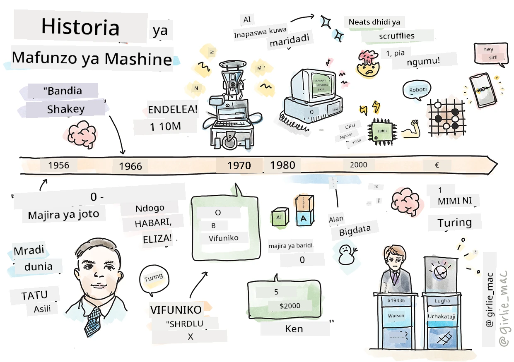
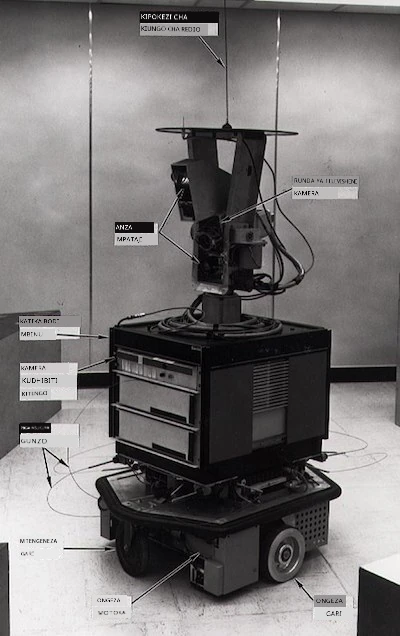
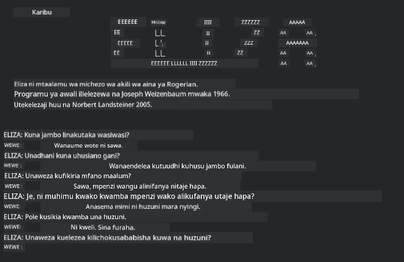

# Historia ya kujifunza kwa mashine

> Sketchnote na [Tomomi Imura](https://www.twitter.com/girlie_mac)

## [Mtihani kabla ya somo](https://ff-quizzes.netlify.app/en/ml/)

---

> 🎥 Bonyeza picha hapo juu kwa video fupi inayoelezea somo hili.

Katika somo hili, tutaangalia hatua kubwa katika historia ya kujifunza kwa mashine na akili bandia.

Historia ya akili bandia (AI) kama taaluma imeunganishwa na historia ya kujifunza kwa mashine, kwani algorithms na maendeleo ya kompyuta yanayoiendesha ML yamechangia katika maendeleo ya AI. Ni muhimu kukumbuka kwamba, ingawa nyanja hizi zilianza kujitokeza kama maeneo tofauti ya uchunguzi miaka ya 1950, [uvumbuzi muhimu wa algorithm, takwimu, hisabati, kompyuta na kiufundi](https://wikipedia.org/wiki/Timeline_of_machine_learning) ulitokea kabla na kuchanganyika na kipindi hiki. Kwa kweli, watu wamekuwa wakifikiria maswali haya kwa [maelfu ya miaka](https://wikipedia.org/wiki/History_of_artificial_intelligence): makala hii inajadili misingi ya kihistoria ya wazo la 'mashine inayowezesha kufikiri.'

---
## Uvumbuzi muhimu

- 1763, 1812 [Theorem ya Bayes](https://wikipedia.org/wiki/Bayes%27_theorem) na waliotangulia. Theorem hii na matumizi yake yanaelezea uwezekano wa tukio kutokea kutokana na maarifa ya awali.
- 1805 [Nadharia ya Least Square](https://wikipedia.org/wiki/Least_squares) na mwanahisabati wa Kifaransa Adrien-Marie Legendre. Nadharia hii, ambayo utajifunza kuhusu katika sehemu yetu ya Regression, husaidia katika kufananisha data.
- 1913 [Minyororo ya Markov](https://wikipedia.org/wiki/Markov_chain), iliyopewa jina la mwanahisabati wa Kirusi Andrey Markov, hutumika kuelezea mfululizo wa matukio yanayowezekana kulingana na hali iliyopita.
- 1957 [Perceptron](https://wikipedia.org/wiki/Perceptron) ni aina ya mtambuzi wa mstari uliogunduliwa na mwanapsychologist wa Marekani Frank Rosenblatt ambao umesukuma mbele maendeleo katika kujifunza kwa kina.

---

- 1967 [Jirani wa Karibu](https://wikipedia.org/wiki/Nearest_neighbor) ni algorithm iliyoundwa awali kwa ramani za njia. Katika muktadha wa ML hutumika kugundua mifumo.
- 1970 [Backpropagation](https://wikipedia.org/wiki/Backpropagation) hutumika kufundisha [mitandao ya neural ya feedforward](https://wikipedia.org/wiki/Feedforward_neural_network).
- 1982 [Mitandao ya Neura ya Kurudia](https://wikipedia.org/wiki/Recurrent_neural_network) ni mitandao ya neural bandia iliyotokana na mitandao ya neural ya feedforward inayounda michoro ya muda.

✅ Fanya utafiti kidogo. Ni tarehe zipi nyingine zinavutia kama za muhimu katika historia ya ML na AI?

---
## 1950: Mashine zinazofikiri

Alan Turing, mtu wa ajabu sana aliyechaguliwa [na umma mwaka 2019](https://wikipedia.org/wiki/Icons:_The_Greatest_Person_of_the_20th_Century) kama mwanasayansi bora wa karne ya 20, anatambuliwa kwa kusaidia kuweka msingi wa wazo la 'mashine inayoweza kufikiri.' Alikabiliana na wakosoaji na haja yake mwenyewe ya ushahidi wa kitaalamu wa wazo hili kwa sehemu kwa kuunda [Mtihani wa Turing](https://www.bbc.com/news/technology-18475646), ambao utaufahamu katika masomo yetu ya NLP.

---
## 1956: Mradi wa Utafiti wa Majira ya Joto Dartmouth

"Mradi wa Utafiti wa Majira ya Joto Dartmouth juu ya akili bandia ulikuwa tukio la msingi kwa akili bandia kama taaluma," na hapa ndipo neno 'akili bandia' lilipoundwa ([chanzo](https://250.dartmouth.edu/highlights/artificial-intelligence-ai-coined-dartmouth)).

> Kila sehemu ya kujifunza au sifa nyingine yoyote ya akili inaweza kuelezwa kwa usahihi kiasi kwamba mashine inaweza kutengenezwa kuitengenezea mfano.

---

Mtafiti mkuu, profesa wa hisabati John McCarthy, alitumaini "kuendelea kwa msingi wa dhana kwamba kila sehemu ya kujifunza au sifa nyingine ya akili inaweza kuelezwa kwa usahihi kiasi kwamba mashine inaweza kutengenezwa kuitengenezea mfano." Washiriki walijumuisha bingwa mwingine katika nyanja hii, Marvin Minsky.

Warsha hiyo inatambuliwa kwa kuanzisha na kuhamasisha mijadala kadhaa ikiwa ni pamoja na "kuibuka kwa mbinu za alama, mifumo inayolenga maeneo maalum (mifumo ya wataalamu ya mwanzo), na mifumo ya deduktivu dhidi ya mifumo ya induktivu." ([chanzo](https://wikipedia.org/wiki/Dartmouth_workshop)).

---
## 1956 - 1974: "Miaka ya dhahabu"

Kuanzia miaka ya 1950 hadi katikati ya miaka ya 70, matumaini yalikuwa makubwa kwamba AI inaweza kutatua matatizo mengi. Mwaka 1967, Marvin Minsky alisema kwa uhakika kwamba "Ndani ya kizazi ... tatizo la kuunda 'akili bandia' litakuwa limefanywa kwa kiasi kikubwa." (Minsky, Marvin (1967), Computation: Finite and Infinite Machines, Englewood Cliffs, N.J.: Prentice-Hall)

Utafiti wa usindikaji wa lugha asilia ulizidi kukua, utafutaji uliboreshwa na kutoa nguvu zaidi, na dhana ya 'micro-worlds' iliumbwa, ambapo kazi rahisi zilifanywa kwa kutumia maelekezo ya lugha rahisi.

---

Utafiti ulifadhiliwa vizuri na mashirika ya serikali, maendeleo yalifanywa katika kompyuta na algorithms, na mifano ya mashine za akili ilijengwa. Baadhi ya mashine hizi ni:

* [Shakey roboti](https://wikipedia.org/wiki/Shakey_the_robot), aliyekuwa na uwezo wa kusogeza na kuamua jinsi ya kutekeleza kazi kwa 'kiakili'.

    
    > Shakey mwaka 1972

---

* Eliza, 'chatterbot' wa mwanzo, aliweza kuzungumza na watu na kutenda kama 'mtaalamu wa tiba' wa mwanzo. Utajifunza zaidi kuhusu Eliza katika masomo ya NLP.

    
    > Toleo la Eliza, chatbot

---

* "Dunia ya blocks" ilikuwa mfano wa micro-world ambapo blocks zingeweza kuwekewa na kupangwa, na majaribio katika kufundisha mashine kufanya maamuzi yangeweza kujaribiwa. Maendeleo yaliyojengwa kwa maktaba kama [SHRDLU](https://wikipedia.org/wiki/SHRDLU) yaliweza kusukuma mbele usindikaji wa lugha.

    

    > 🎥 Bonyeza picha hapo juu kwa video: Dunia ya blocks na SHRDLU

---
## 1974 - 1980: "Baridi ya AI"

Katikati ya miaka ya 1970, ilibainika kuwa ugumu wa kutengeneza 'mashine za akili' ulikuwa umepungua thamani na ahadi yake, ikizingatiwa nguvu ya kompyuta iliyopo, ilizidi kutolewa kwa matumaini. Fedha zilikauka na imani katika taaluma ilipungua. Baadhi ya masuala yaliyoathiri imani ni pamoja na:
---
- **Mara za mipaka**. Nguvu ya kompyuta ilikuwa ndogo mno.
- **Mlipuko wa mchanganyiko**. Idadi ya vigezo vinavyohitaji kufundishwa ilizidiwa kwa kasi kadri kompyuta zilivyoombwa zaidi, bila mabadiliko ya sambamba ya nguvu na uwezo wa kompyuta.
- **Ukosefu wa data**. Palikuwa na upungufu wa data uliosababisha matatizo katika mchakato wa kupima, kuendeleza, na kuboresha algorithms.
- **Je, tunauliza maswali sahihi?**. Maswali yenyewe yaliianza kuhojiwa. Watafiti walianza kupokea ukosoaji kuhusu mbinu zao:
  - Mitihani ya Turing ilizuiliwa kwa njia, miongoni mwa mawazo mengine, ya 'nadharia ya chumba cha Kichina' ambayo ilipendekeza kwamba, "kuprograma kompyuta ya kidijitali kunaweza kuifanya ionekane inaelewa lugha lakini haiwezi kutoa uelewa halisi." ([chanzo](https://plato.stanford.edu/entries/chinese-room/))
  - Maadili ya kuingiza akili bandia kama "mtaalamu wa tiba" ELIZA katika jamii yalihojiwa.

---

Wakati huo huo, shule mbalimbali za fikra za AI zilianza kuundwa. Tofauti ilianzishwa kati ya mbinu za ["scruffy" vs. "neat AI"](https://wikipedia.org/wiki/Neats_and_scruffies). Maabara za _scruffy_ zilibadilisha programu kwa saa hadi walipata matokeo yanayotarajiwa. Maabara za _neat_ "ziliweka mkazo kwenye mantiki na utatuzi rasmi wa matatizo". ELIZA na SHRDLU zilikuwa mifumo maarufu ya _scruffy_. Katika miaka ya 1980, kadri ombi la kufanya mifumo ya ML iweze kurudiwa lilivyoibuka, mbinu ya _neat_ ilianza kuchukua kiongozi kwa kuwa matokeo yake ni rahisi kueleweka.

---
## Mifumo ya wataalamu ya miaka ya 1980

Kadiri taaluma ilivyozidi kukua, manufaa yake kwa biashara yalionekana wazi, na katika miaka ya 1980 pia kuenea kwa 'mifumo ya wataalamu'. "Mifumo ya wataalamu ilikuwa miongoni mwa aina za kwanza kabisa za programu za akili bandia (AI) zilizo na mafanikio ya kweli." ([chanzo](https://wikipedia.org/wiki/Expert_system)).

Aina hii ya mfumo hasa ni _mchanganyiko_, ikiwa na sehemu ya injini ya kanuni inayobainisha mahitaji ya biashara, na injini ya hitimisho inayotumia mfumo wa kanuni kutoa taarifa mpya.

Enzi hii pia ilipata umakini mkubwa kwa mitandao ya neura.

---
## 1987 - 1993: AI 'Utulivu'

Kuenea kwa vifaa maalum vya mifumo ya wataalamu kulizalisha athari ya kuwa maalumu sana. Kuibuka kwa kompyuta za kibinafsi pia kulishindana na mifumo hii mikubwa, maalum, na ya kati. Uhalisia wa kompyuta ulianza, na hatimaye ulighitaa njia kwa mlipuko wa kisasa wa data kubwa.

---
## 1993 - 2011

Kipindi hiki kilibeba enzi mpya kwa ML na AI kuwa na uwezo wa kutatua baadhi ya matatizo yaliyosababishwa awali na ukosefu wa data na nguvu ya kompyuta. Kiasi cha data kilianza kuongezeka kwa kasi na kupatikana zaidi, kwa mema na mabaya, hasa na kuibuka kwa simu janja kuanzia 2007. Nguvu ya kompyuta ilipanuka kwa kasi, na algorithms zilibadilika sambamba. Nyingi zilianza kupata umri kama enzi za uhuru wa zamani zilianza kuwa taaluma halisi.

---
## Sasa

Leo kujifunza kwa mashine na AI kunagusa karibu kila sehemu ya maisha yetu. Enzi hii inahitaji kuelewa kwa makini hatari na athari zinazowezekana za algorithms hizi katika maisha ya binadamu. Kama Brad Smith wa Microsoft amesema, "Teknolojia ya taarifa inaleta masuala yanayoingia katika msingi wa ulinzi wa haki za binadamu kama faragha na uhuru wa kuonyesha maoni. Masuala haya huongeza uwajibikaji kwa kampuni za teknolojia zinazozalisha bidhaa hizi. Kwetu, pia yanahitaji udhibiti wa serikali kwa busara na kwa maendeleo ya kanuni kuhusu matumizi yanayokubalika" ([chanzo](https://www.technologyreview.com/2019/12/18/102365/the-future-of-ais-impact-on-society/)).

---

Bado inaonekana ni nini yaliyomo katika siku za usoni, lakini ni muhimu kuelewa mifumo hii ya kompyuta na software na algorithms zinazoiendesha. Tunatumaini kuwa mtaala huu utakusaidia kupata uelewa bora ili uweze kuamua mwenyewe.

> 🎥 Bonyeza picha hapo juu kwa video: Yann LeCun anajadili historia ya kujifunza kwa kina katika somo hili

---
## 🚀Changamoto

Chunguza moja ya matukio haya ya kihistoria na ujifunze zaidi kuhusu watu waliomo nyuma yake. Kuna wahusika wa kuvutia, na hakuna ugunduzi wowote wa kisayansi uliotengenezwa katika utulivu wa kitamaduni. Unagundua nini?

## [Mtihani baada ya somo](https://ff-quizzes.netlify.app/en/ml/)

---
## Ukaguzi & Kujifunza kwa Kujitegemea

Hapa kuna vitu vya kutazama na kusikiliza:

[Podcast hii ambapo Amy Boyd anajadili mabadiliko ya AI](http://runasradio.com/Shows/Show/739)

---

## Kazi ya nyumbani

[Tengeneza mstari wa wakati](assignment.md)

---

<!-- CO-OP TRANSLATOR DISCLAIMER START -->
**Kionyozo**:
Hati hii imetafsiriwa kwa kutumia huduma ya tafsiri ya AI [Co-op Translator](https://github.com/Azure/co-op-translator). Ingawa tunajitahidi kupata usahihi, tafadhali fahamu kwamba tafsiri za kiotomatiki zinaweza kuwa na makosa au upungufu wa usahihi. Hati ya asili katika lugha yake halisi inapaswa kuchukuliwa kama chanzo cha mamlaka. Kwa taarifa muhimu, tafsiri ya kitaalamu inayofanywa na binadamu inapendekezwa. Hatutojibu kwa kuelewa vibaya au tafsiri potofu zinazotokea kutokana na matumizi ya tafsiri hii.
<!-- CO-OP TRANSLATOR DISCLAIMER END -->