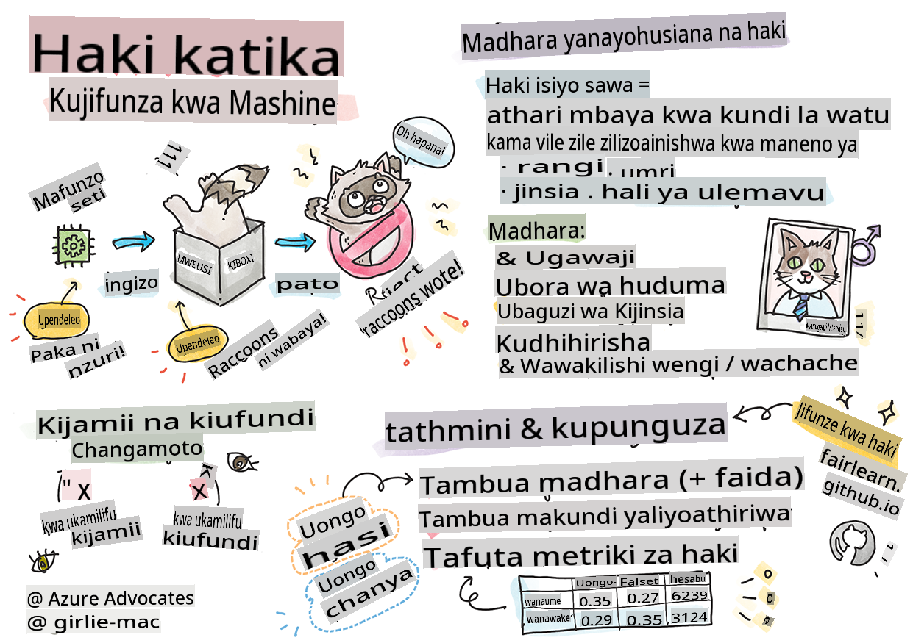
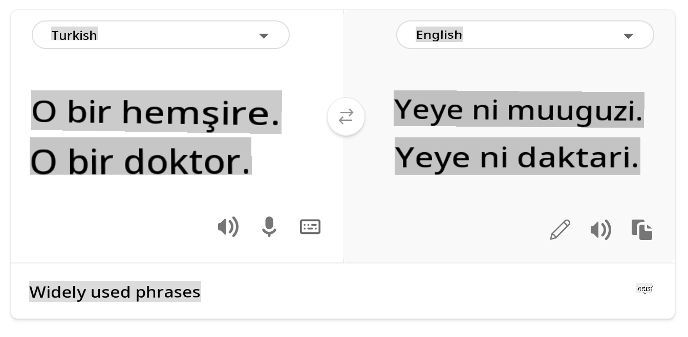
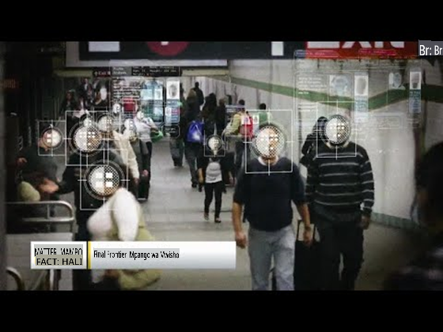

# Kujenga Suluhisho za Kujifunza kwa Mashine na AI Inayowajibika

> Sketchnote na [Tomomi Imura](https://www.twitter.com/girlie_mac)

## [Jaribio la Kabla ya Somo](https://gray-sand-07a10f403.1.azurestaticapps.net/quiz/5/)

## Utangulizi

Katika mtaala huu, utaanza kugundua jinsi kujifunza kwa mashine kunaweza na kunaathiri maisha yetu ya kila siku. Hata sasa, mifumo na mifano inahusika katika kazi za kufanya maamuzi ya kila siku, kama vile utambuzi wa afya, idhini za mikopo au kugundua udanganyifu. Kwa hivyo, ni muhimu kwamba mifano hii ifanye kazi vizuri ili kutoa matokeo yanayoaminika. Kama programu nyingine yoyote, mifumo ya AI itakosa matarajio au kuwa na matokeo yasiyofaa. Ndiyo maana ni muhimu kuelewa na kuelezea tabia ya mfano wa AI.

Fikiria nini kinaweza kutokea wakati data unayotumia kujenga mifano hii inakosa demografia fulani, kama vile rangi, jinsia, mtazamo wa kisiasa, dini, au inawakilisha kwa uwiano usio sawa demografia hizo. Je, kuhusu wakati matokeo ya mfano yanafafanuliwa kupendelea demografia fulani? Matokeo ni nini kwa programu? Zaidi ya hayo, nini kinatokea wakati mfano una matokeo mabaya na unadhuru watu? Nani anawajibika kwa tabia ya mifumo ya AI? Haya ni baadhi ya maswali tutakayochunguza katika mtaala huu.

Katika somo hili, utajifunza:

- Kuongeza ufahamu wako juu ya umuhimu wa haki katika kujifunza kwa mashine na madhara yanayohusiana na haki.
- Kufahamu mazoezi ya kuchunguza vipengele vya nje na hali zisizo za kawaida ili kuhakikisha kutegemewa na usalama.
- Kupata uelewa wa haja ya kuwawezesha wote kwa kubuni mifumo jumuishi.
- Kuchunguza jinsi ilivyo muhimu kulinda faragha na usalama wa data na watu.
- Kuona umuhimu wa kuwa na njia ya kisanduku la kioo kuelezea tabia ya mifano ya AI.
- Kuwa makini na jinsi uwajibikaji ni muhimu kujenga imani katika mifumo ya AI.

## Sharti

Kama sharti, tafadhali chukua "Kanuni za AI Inayowajibika" Njia ya Kujifunza na tazama video hapa chini kuhusu mada hiyo:

Jifunze zaidi kuhusu AI Inayowajibika kwa kufuata [Njia ya Kujifunza](https://docs.microsoft.com/learn/modules/responsible-ai-principles/?WT.mc_id=academic-77952-leestott)

> 🎥 Bofya picha hapo juu kwa video: Njia ya Microsoft kwa AI Inayowajibika

## Haki

Mifumo ya AI inapaswa kuwatendea watu wote kwa haki na kuepuka kuathiri vikundi vya watu kwa njia tofauti. Kwa mfano, mifumo ya AI inapotoa mwongozo juu ya matibabu ya matibabu, maombi ya mikopo, au ajira, inapaswa kutoa mapendekezo sawa kwa kila mtu mwenye dalili sawa, hali za kifedha, au sifa za kitaaluma. Kila mmoja wetu kama binadamu anabeba upendeleo uliorithiwa ambao unaathiri maamuzi na vitendo vyetu. Upendeleo huu unaweza kuonekana katika data tunayotumia kufundisha mifumo ya AI. U manipuli kama huo unaweza kutokea bila kukusudia. Mara nyingi ni vigumu kujua kwa makusudi wakati unaingiza upendeleo katika data.

**"Kutokuwa na haki"** kunajumuisha athari mbaya, au "madhara", kwa kikundi cha watu, kama vile wale wanaofafanuliwa kwa rangi, jinsia, umri, au hali ya ulemavu. Madhara kuu yanayohusiana na haki yanaweza kuainishwa kama:

- **Ugawaji**, kama jinsia au kabila kwa mfano inapendelewa zaidi ya nyingine.
- **Ubora wa huduma**. Ukifundisha data kwa hali moja maalum lakini hali halisi ni ngumu zaidi, inasababisha huduma duni. Kwa mfano, dispanser ya sabuni ya mkono ambayo haikuweza kuhisi watu wenye ngozi nyeusi. [Marejeleo](https://gizmodo.com/why-cant-this-soap-dispenser-identify-dark-skin-1797931773)
- **Kudhalilisha**. Kukosoa kwa njia isiyo ya haki na kuweka lebo kitu au mtu. Kwa mfano, teknolojia ya kuweka lebo picha ilivyoweka lebo vibaya picha za watu wenye ngozi nyeusi kama sokwe.
- **Uwiano wa juu au chini**. Wazo ni kwamba kikundi fulani hakionekani katika taaluma fulani, na huduma au kazi yoyote inayozidi kukuza hiyo inachangia madhara.
- **Kuweka taswira**. Kuhusisha kikundi fulani na sifa zilizotanguliwa. Kwa mfano, mfumo wa kutafsiri lugha kati ya Kiingereza na Kituruki unaweza kuwa na makosa kutokana na maneno yenye uhusiano wa taswira ya kijinsia.

> tafsiri kwa Kituruki

> tafsiri kurudi kwa Kiingereza

Wakati wa kubuni na kupima mifumo ya AI, tunahitaji kuhakikisha kwamba AI ni ya haki na haijapangiliwa kufanya maamuzi yenye upendeleo au ubaguzi, ambayo binadamu pia wamekatazwa kufanya. Kuhakikisha haki katika AI na kujifunza kwa mashine inabaki kuwa changamoto ngumu ya kijamii na kiteknolojia.

### Kutegemewa na usalama

Ili kujenga imani, mifumo ya AI inahitaji kuwa ya kutegemewa, salama, na thabiti chini ya hali za kawaida na zisizotarajiwa. Ni muhimu kujua jinsi mifumo ya AI itakavyotenda katika hali mbalimbali, hasa wakati ni vipengele vya nje. Wakati wa kujenga suluhisho za AI, inahitaji kuwepo na mkazo mkubwa juu ya jinsi ya kushughulikia hali mbalimbali ambazo suluhisho za AI zitakutana nazo. Kwa mfano, gari linalojiendesha lenyewe linahitaji kuweka usalama wa watu kama kipaumbele cha juu. Kwa hiyo, AI inayosukuma gari inahitaji kuzingatia hali zote zinazowezekana ambazo gari linaweza kukutana nazo kama usiku, dhoruba za radi au theluji, watoto wakikimbia barabarani, wanyama wa kipenzi, ujenzi wa barabara nk. Jinsi mfumo wa AI unavyoweza kushughulikia hali mbalimbali kwa kutegemewa na salama inaonyesha kiwango cha utabiri ambacho mwanasayansi wa data au mjenzi wa AI alizingatia wakati wa kubuni au kupima mfumo.

> [🎥 Bofya hapa kwa video: ](https://www.microsoft.com/videoplayer/embed/RE4vvIl)

### Ujumuishaji

Mifumo ya AI inapaswa kubuniwa kushirikisha na kuwawezesha wote. Wakati wa kubuni na kutekeleza mifumo ya AI, wanasayansi wa data na wajenzi wa AI wanatambua na kushughulikia vikwazo vinavyowezekana katika mfumo ambavyo vinaweza kwa bahati mbaya kuwazuia watu. Kwa mfano, kuna watu bilioni 1 wenye ulemavu duniani kote. Kwa maendeleo ya AI, wanaweza kufikia taarifa na fursa mbalimbali kwa urahisi zaidi katika maisha yao ya kila siku. Kwa kushughulikia vikwazo, inaunda fursa za kuunda na kukuza bidhaa za AI na uzoefu bora ambao unawanufaisha wote.

> [🎥 Bofya hapa kwa video: ujumuishaji katika AI](https://www.microsoft.com/videoplayer/embed/RE4vl9v)

### Usalama na faragha

Mifumo ya AI inapaswa kuwa salama na kuheshimu faragha ya watu. Watu wana imani ndogo katika mifumo inayoweka faragha yao, taarifa zao, au maisha yao hatarini. Wakati wa kufundisha mifano ya kujifunza kwa mashine, tunategemea data kutoa matokeo bora. Kwa kufanya hivyo, asili ya data na uadilifu lazima izingatiwe. Kwa mfano, je data ilikuwa imetolewa na mtumiaji au inapatikana hadharani? Ifuatayo, wakati wa kufanya kazi na data, ni muhimu kuunda mifumo ya AI ambayo inaweza kulinda taarifa za siri na kupinga mashambulizi. Kama AI inavyokuwa ya kawaida, kulinda faragha na kulinda taarifa muhimu za kibinafsi na biashara kunakuwa muhimu zaidi na ngumu. Masuala ya faragha na usalama wa data yanahitaji umakini wa karibu hasa kwa AI kwa sababu upatikanaji wa data ni muhimu kwa mifumo ya AI kufanya utabiri sahihi na maamuzi sahihi kuhusu watu.

> [🎥 Bofya hapa kwa video: usalama katika AI](https://www.microsoft.com/videoplayer/embed/RE4voJF)

- Kama sekta tumepiga hatua kubwa katika Faragha na usalama, tukichochewa sana na kanuni kama GDPR (Kanuni ya Ulinzi wa Taarifa za Kijumla).
- Hata hivyo, na mifumo ya AI tunapaswa kukubali mvutano kati ya haja ya data za kibinafsi zaidi ili kufanya mifumo kuwa ya kibinafsi zaidi na yenye ufanisi – na faragha.
- Kama vile kuzaliwa kwa kompyuta zilizounganishwa na intaneti, tunaona pia ongezeko kubwa la idadi ya masuala ya usalama yanayohusiana na AI.
- Wakati huo huo, tumeona AI ikitumika kuboresha usalama. Kwa mfano, skana za virusi za kisasa nyingi zinaendeshwa na heuristics za AI leo.
- Tunahitaji kuhakikisha kwamba michakato yetu ya Sayansi ya Data inachanganyika kwa usawa na mazoea ya faragha na usalama ya kisasa.

### Uwazi

Mifumo ya AI inapaswa kueleweka. Sehemu muhimu ya uwazi ni kuelezea tabia ya mifumo ya AI na vipengele vyake. Kuboresha uelewa wa mifumo ya AI kunahitaji kwamba wadau waelewe jinsi na kwa nini inavyofanya kazi ili waweze kutambua masuala ya utendaji yanayoweza kutokea, wasiwasi wa usalama na faragha, upendeleo, mazoea ya kuwatenga, au matokeo yasiyotarajiwa. Tunaamini pia kwamba wale wanaotumia mifumo ya AI wanapaswa kuwa waaminifu na wazi kuhusu lini, kwa nini, na jinsi wanavyoamua kuitumia. Pamoja na mapungufu ya mifumo wanayotumia. Kwa mfano, kama benki inatumia mfumo wa AI kusaidia maamuzi ya mikopo ya watumiaji, ni muhimu kuchunguza matokeo na kuelewa ni data gani inayoathiri mapendekezo ya mfumo. Serikali zinaanza kudhibiti AI katika sekta mbalimbali, hivyo wanasayansi wa data na mashirika lazima waelezee kama mfumo wa AI unakidhi mahitaji ya udhibiti, hasa wakati kuna matokeo yasiyofaa.

> [🎥 Bofya hapa kwa video: uwazi katika AI](https://www.microsoft.com/videoplayer/embed/RE4voJF)

- Kwa sababu mifumo ya AI ni ngumu sana, ni vigumu kuelewa jinsi inavyofanya kazi na kutafsiri matokeo.
- Ukosefu huu wa uelewa unaathiri jinsi mifumo hii inavyosimamiwa, kutekelezwa, na kuandikwa.
- Ukosefu huu wa uelewa unaathiri zaidi maamuzi yaliyofanywa kwa kutumia matokeo ambayo mifumo hii inazalisha.

### Uwajibikaji

Watu wanaobuni na kutekeleza mifumo ya AI lazima wawajibike kwa jinsi mifumo yao inavyofanya kazi. Haja ya uwajibikaji ni muhimu hasa kwa teknolojia nyeti kama utambuzi wa uso. Hivi karibuni, kumekuwa na ongezeko la mahitaji ya teknolojia ya utambuzi wa uso, hasa kutoka kwa mashirika ya utekelezaji wa sheria ambayo yanaona uwezo wa teknolojia katika matumizi kama vile kutafuta watoto waliopotea. Hata hivyo, teknolojia hizi zinaweza kutumiwa na serikali kuweka uhuru wa kimsingi wa raia wao hatarini kwa mfano, kuwezesha ufuatiliaji wa kuendelea wa watu maalum. Kwa hivyo, wanasayansi wa data na mashirika yanahitaji kuwajibika kwa jinsi mfumo wao wa AI unavyoathiri watu binafsi au jamii.

> 🎥 Bofya picha hapo juu kwa video: Onyo kuhusu Ufuatiliaji wa Misa Kupitia Utambuzi wa Uso

Hatimaye moja ya maswali makubwa zaidi kwa kizazi chetu, kama kizazi cha kwanza kinacholetea AI katika jamii, ni jinsi ya kuhakikisha kwamba kompyuta zitabaki kuwajibika kwa watu na jinsi ya kuhakikisha kwamba watu wanaobuni kompyuta wanabaki kuwajibika kwa kila mtu mwingine.

## Tathmini ya Athari

Kabla ya kufundisha mfano wa kujifunza kwa mashine, ni muhimu kufanya tathmini ya athari ili kuelewa madhumuni ya mfumo wa AI; matumizi yaliyokusudiwa; wapi itatekelezwa; na nani atakayekuwa akiingiliana na mfumo. Hizi ni muhimu kwa mthibitishaji au mpimaji kutathmini mfumo kujua ni mambo gani ya kuzingatia wakati wa kutambua hatari zinazowezekana na matokeo yanayotarajiwa.

Zifuatazo ni maeneo ya kuzingatia wakati wa kufanya tathmini ya athari:

* **Athari mbaya kwa watu binafsi**. Kuwa na ufahamu wa vikwazo au mahitaji yoyote, matumizi yasiyoungwa mkono au mapungufu yoyote yanayojulikana yanayozuia utendaji wa mfumo ni muhimu kuhakikisha kwamba mfumo hautumiwi kwa njia inayoweza kudhuru watu binafsi.
* **Mahitaji ya data**. Kupata uelewa wa jinsi na wapi mfumo utatumia data inawawezesha wakaguzi kuchunguza mahitaji yoyote ya data unayohitaji kuzingatia (mfano, kanuni za data za GDPR au HIPPA). Zaidi ya hayo, chunguza kama chanzo au wingi wa data ni wa kutosha kwa mafunzo.
* **Muhtasari wa athari**. Kusanya orodha ya madhara yanayoweza kutokea kutokana na matumizi ya mfumo. Kwenye mzunguko wa maisha wa ML, kagua kama masuala yaliyotambuliwa yamepunguzwa au kushughulikiwa.
* **Malengo yanayofaa** kwa kila moja ya kanuni sita za msingi. Tathmini kama malengo kutoka kwa kila kanuni yanatimizwa na kama kuna mapungufu yoyote.

## Kusuluhisha shida na AI inayowajibika

Sawa na kusuluhisha shida kwenye programu ya kompyuta, kusuluhisha shida kwenye mfumo wa AI ni mchakato muhimu wa kutambua na kutatua masuala kwenye mfumo. Kuna mambo mengi yanayoweza kuathiri mfano usifanye kazi kama inavyotarajiwa au kwa uwajibikaji. Metriki nyingi za utendaji wa mfano wa jadi ni jumla za kiasi za utendaji wa mfano, ambazo hazitoshi kuchambua jinsi mfano unavyokiuka kanuni za AI inayowajibika. Zaidi ya hayo, mfano wa kujifunza kwa mashine ni sanduku jeusi ambalo linafanya kuwa vigumu kuelewa nini kinachochochea matokeo yake au kutoa maelezo wakati unafanya kosa. Baadaye kwenye kozi hii, tutajifunza jinsi ya kutumia dashibodi ya AI Inayowajibika kusaidia kusuluhisha shida kwenye mifumo ya AI. Dashibodi inatoa zana kamili kwa wanasayansi wa data na wajenzi wa AI kufanya:

* **Uchambuzi wa makosa**. Kutambua usambazaji wa makosa wa mfano ambao unaweza kuathiri haki au kutegemewa kwa mfumo.
* **Muhtasari wa mfano**. Kugundua wapi kuna tofauti katika utendaji wa mfano kwenye makundi ya data.
* **Uchambuzi wa data**. Kuelewa usambazaji wa data na kutambua upendeleo wowote katika data ambao unaweza kusababisha masuala ya haki, ujumuishaji, na kutegemewa.
* **Ufafanuzi wa mfano**. Kuelewa nini kinachoathiri au kushawishi utabiri wa mfano. Hii husaidia kuelezea tabia ya mfano, ambayo ni muhimu kwa uwazi na uwajibikaji.

## 🚀 Changamoto

Ili kuzuia madhara yasitokee kwanza, tunapaswa:

- kuwa na utofauti wa asili na mitazamo miongoni mwa watu wanaofanya kazi kwenye mifumo
- kuwekeza katika seti za data zinazoakisi utofauti wa jamii yetu
- kuendeleza mbinu bora katika mzunguko wa maisha wa kujifunza kwa mashine kugundua na kurekebisha AI inayowajibika inapojitokeza

Fikiria hali halisi ambapo kutokuaminika kwa mfano ni dhahiri katika ujenzi na matumizi ya mfano. Ni nini kingine tunachopaswa kuzingatia?

## [Jaribio la Baada ya Somo](https://gray-sand-07a10f403.1.azurestaticapps.net/quiz/6/)
## Mapitio na Kujisomea

Katika somo hili, umejifunza baadhi ya misingi ya dhana za haki na

**Kanusho**: 
Hati hii imetafsiriwa kwa kutumia huduma za tafsiri za AI za mashine. Ingawa tunajitahidi kwa usahihi, tafadhali fahamu kuwa tafsiri za kiotomatiki zinaweza kuwa na makosa au kutokuwa sahihi. Hati ya asili katika lugha yake ya asili inapaswa kuchukuliwa kama chanzo cha mamlaka. Kwa taarifa muhimu, tafsiri ya kitaalamu ya kibinadamu inapendekezwa. Hatutawajibika kwa kutoelewana au tafsiri zisizo sahihi zinazotokana na matumizi ya tafsiri hii.