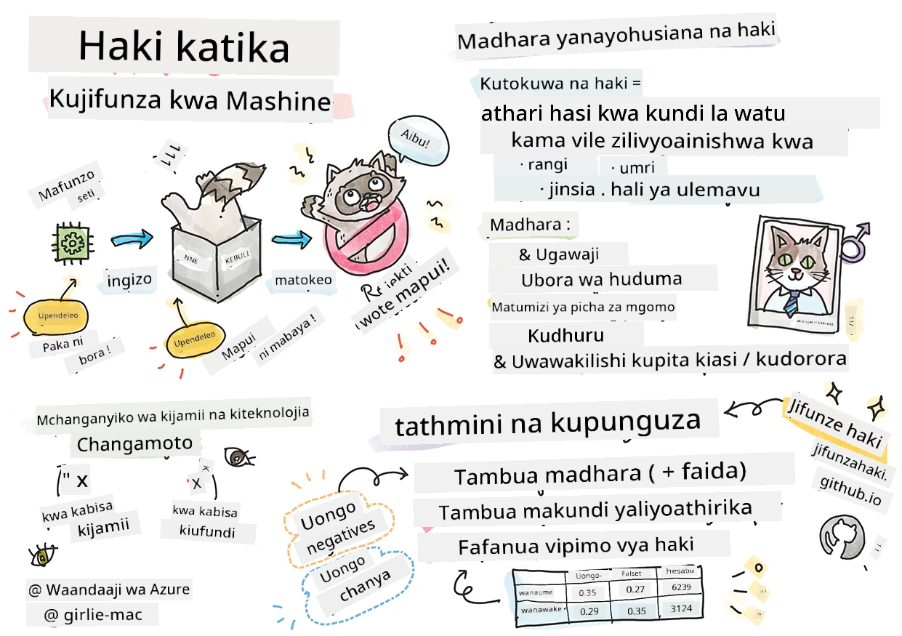
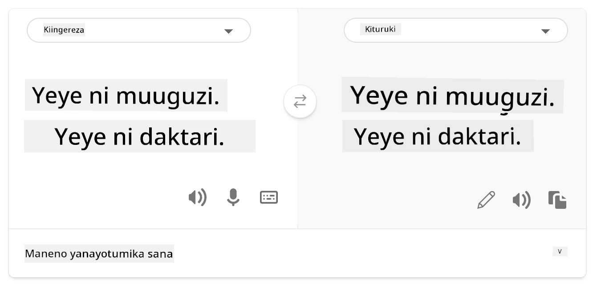
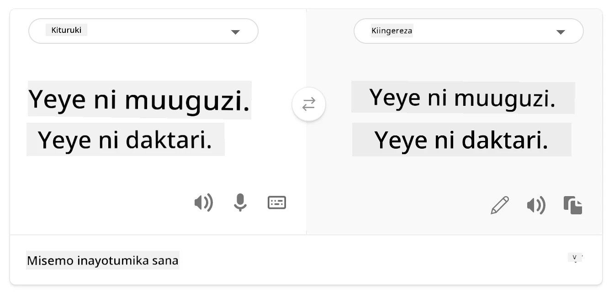
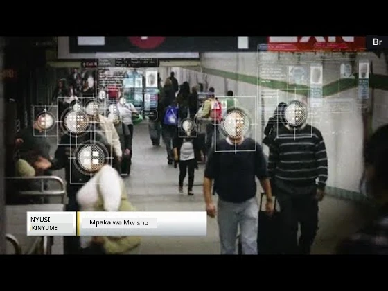

# Kujenga suluhisho za Machine Learning kwa AI yenye uwajibikaji
 

> Sketchnote na [Tomomi Imura](https://www.twitter.com/girlie_mac)

## [Mtihani kabla ya somo](https://ff-quizzes.netlify.app/en/ml/)
 
## Utangulizi

Katika mtaala huu, utaanza kugundua jinsi machine learning inavyoweza na inavyokuwa na athari katika maisha yetu ya kila siku. Hata sasa, mifumo na modeli zinahusiana na kazi za uamuzi wa kila siku, kama vile uchunguzi wa matibabu, idhini za mikopo au kugundua udanganyifu. Kwa hivyo, ni muhimu kwamba modeli hizi zifanye kazi vizuri ili kutoa matokeo yanayoaminika. Kama yoyote programu ya kompyuta, mifumo ya AI itakosa matarajio au kuwa na matokeo yasiyotarajiwa. Ndiyo maana ni muhimu kuelewa na kueleza tabia ya modeli ya AI.

Fikiria kinachoweza kutokea wakati data unayotumia kujenga modeli hizi haijumuishi baadhi ya makundi ya watu, kama vile rangi, jinsia, mtazamo wa kisiasa, dini, au kuwakilisha kwa njia isiyo sawa makundi hayo. Nini kuhusu wakati matokeo ya modeli yanatafsiriwa kupendelea baadhi ya makundi? Ni matokeo gani kwa programu hiyo? Zaidi ya hayo, nini kinatokea wakati modeli inatoa matokeo mabaya na yenye madhara kwa watu? Nani anawajibika kwa tabia ya mifumo ya AI? Hivyo ni baadhi ya maswali tutakayachunguza katika mtaala huu.

Katika somo hili, utajifunza:

- Kuongeza uelewa wako kuhusu umuhimu wa usawa katika machine learning na madhara yanayohusiana na usawa.
- Kufahamiana na mazoezi ya kuchunguza matukio ya kipekee na yasiyo ya kawaida ili kuhakikisha uaminifu na usalama.
- Kupata uelewa juu ya hitaji la kuwawezesha wote kwa kubuni mifumo jumuishi.
- Kuchunguza umuhimu wa kulinda faragha na usalama wa data na watu.
- Kuona umuhimu wa kuwa na njia ya uwazi kueleza tabia za modeli za AI.
- Kuwa makini na jinsi uwajibikaji unavyohitajika kujenga imani katika mifumo ya AI.

## Sharti la awali

Kama sharti la awali, tafadhali chukua Njia ya Kujifunza "Kanuni za AI yenye Uwajibikaji" na tazama video hii hapa chini kuhusu mada hii:

Jifunze zaidi kuhusu AI yenye uwajibikaji kwa kufuata [Njia ya Kujifunza](https://docs.microsoft.com/learn/modules/responsible-ai-principles/?WT.mc_id=academic-77952-leestott)

> 🎥 Bonyeza picha hapo juu kwa video: Njia ya Microsoft kwa AI yenye Uwajibikaji

## Usawa

Mifumo ya AI inapaswa kuwatendea watu wote kwa usawa na kuepuka kuathiri makundi sawa ya watu kwa njia tofauti. Kwa mfano, wakati mifumo ya AI inatoa mwongozo kuhusu matibabu ya afya, maombi ya mkopo, au ajira, inapaswa kutoa mapendekezo sawa kwa wote wenye dalili zinazofanana, hali za kifedha, au sifa za kitaalamu. Kila mmoja wetu kama wanadamu tunabeba upendeleo uliozalishwa ambao huathiri maamuzi na vitendo vyetu. Upendeleo huu unaweza kuonekana katika data tunayotumia kufundisha mifumo ya AI. Udanganyifu kama huo unaweza kutokea bila kusudi. Mara nyingi ni vigumu kwa makusudi kujua unapoweka upendeleo katika data.

**“Kutokuwa na usawa”** kunajumuisha athari mbaya, au “madhara”, kwa kundi la watu, kama vile zile zinazotamkwa kwa mujibu wa rangi, jinsia, umri, au hali ya ulemavu. Madhara makuu yanayohusiana na usawa yanaweza kugawanywa kama:

- **Ugawaji**, kama jinsia au kabila fulani linapendelewa zaidi ya lingine.
- **Ubora wa huduma**. Ikiwa unafundisha data kwa hali moja maalum lakini hali halisi ni ngumu zaidi, inasababisha huduma duni. Kwa mfano, kipakia sabuni cha mkono ambacho hakikuweza kugundua watu wenye ngozi nyeusi. [Rejea](https://gizmodo.com/why-cant-this-soap-dispenser-identify-dark-skin-1797931773)
- **Kudhalilisha**. Kukosoa vibaya na kumtaja mtu au kitu vibaya. Kwa mfano, teknolojia ya kutamka picha ilikosea kutaja picha za watu wenye ngozi nyeusi kama gorila.
- **Uwawakilishi kupita kiasi au kupungukiwa**. Wazo ni kwamba kundi fulani halionekani katika taaluma fulani, na huduma au kazi yoyote inayojiendeleza hivyo inaongeza madhara.
- **Kuweka alama za kijadi**. Kuhusisha kundi fulani na sifa zilizowekwa kabla. Kwa mfano, mfumo wa tafsiri ya lugha kati ya Kiingereza na Kituruki unaweza kuwa na makosa kutokana na maneno yenye muktadha wa kijinsia.

> tafsiri kwa Kituruki

> tafsiri kurudi Kiingereza

Wakati wa kubuni na kujaribu mifumo ya AI, tunahitaji kuhakikisha kwamba AI ni ya haki na haijapangwa kufanya maamuzi ya upendeleo au ubaguzi, ambayo watu pia wanakamatwa kutofanya. Kuhakikisha usawa katika AI na machine learning bado ni changamoto tata ya kijamii na kiteknolojia.

### Uaminifu na usalama

Ili kujenga imani, mifumo ya AI inahitaji kuwa ya kuaminika, salama, na thabiti chini ya hali za kawaida na zisizotarajiwa. Ni muhimu kujua jinsi mifumo ya AI itakavyoitikia katika hali tofauti, hasa wanapokuwa wa kipekee. Wakati wa kujenga suluhisho za AI, kuna haja ya kuelekeza sana jinsi ya kushughulikia hali mbalimbali ambazo suluhisho za AI zitakutana nazo. Kwa mfano, gari linalojiendesha lenyewe linahitaji kuweka usalama wa watu kipaumbele cha juu. Kwa hivyo, AI inayoendesha gari hilo inahitaji kuzingatia hali zote zinazowezekana kama usiku, radi au mvua kali, watoto wakikimbia barabarani, wanyama wa kipenzi, ujenzi wa barabara n.k. Jinsi mfumo wa AI unavyoweza kushughulikia hali mbalimbali kwa uaminifu na usalama unaonesha kiwango cha matarajio ambayo mwanasayansi wa data au mtaalamu wa AI alichukulia wakati wa kubuni au kujaribu mfumo.

> [🎥 Bonyeza hapa kwa video: ](https://www.microsoft.com/videoplayer/embed/RE4vvIl)

### Ushirikiano

Mifumo ya AI inapaswa kubuniwa kuwashirikisha na kuwawezesha wote. Wakati wa kubuni na kutekeleza mifumo ya AI, wanasayansi wa data na watengenezaji wa AI hutambua na kushughulikia vizingiti vinavyoweza kutojumuisha watu bila kusudi. Kwa mfano, kuna watu bilioni 1 wenye ulemavu duniani kote. Pamoja na maendeleo ya AI, wanaweza kupata taarifa na fursa mbalimbali kwa urahisi zaidi katika maisha yao ya kila siku. Kwa kushughulikia vizingiti hivi, kunaunda fursa za kubuni na kuendeleza bidhaa za AI zenye uzoefu bora zinazowafaidia wote.

> [🎥 Bonyeza hapa kwa video: ushirikishaji katika AI](https://www.microsoft.com/videoplayer/embed/RE4vl9v)

### Usalama na faragha

Mifumo ya AI inapaswa kuwa salama na kuheshimu faragha ya watu. Watu hawana imani na mifumo inayoweka faragha yao, taarifa au maisha hatarini. Wakati wa kufundisha modeli za machine learning, tunategemea data kutoa matokeo bora. Kwa kufanya hivyo, asili ya data na uadilifu lazima uzingatiwe. Kwa mfano, je data ilitolewa na mtumiaji au ilikuwa inapatikana hadharani? Kisha, wakati wa kutumia data, ni muhimu kuendeleza mifumo ya AI inayoweza kulinda taarifa za siri na kuhimili mashambulio. Kadiri AI inavyozidi kutumika, kulinda faragha na kuhakikisha usalama wa taarifa muhimu za watu na biashara kunakuwa muhimu zaidi na changamoto kubwa. Masuala ya faragha na usalama wa data yanahitaji umakini wa karibu kwa AI kwa sababu upatikanaji wa data ni muhimu kwa mifumo ya AI kutoa utabiri sahihi na maamuzi ya taarifa kuhusu watu.

> [🎥 Bonyeza hapa kwa video: usalama katika AI](https://www.microsoft.com/videoplayer/embed/RE4voJF)

- Kama sekta tumefanya maendeleo makubwa katika Faragha na usalama, hasa kwa sheria kama GDPR (Regulation ya Ulinzi wa Data za Kawaida).
- Hata hivyo, kwa mifumo ya AI lazima tukiri mvutano kati ya hitaji la data binafsi zaidi kufanya mifumo kuwa za kibinafsi na zenye ufanisi – na faragha.
- Kama ilivyokuwa wakati wa kuzuka kwa kompyuta zilizo na mtandao, tunashuhudia ongezeko kubwa la masuala ya usalama yanayohusiana na AI.
- Wakati huo huo, tumeona AI ikitumiwa kuboresha usalama. Kwa mfano, wengi wa skana za kisasa za virusi vinaendeshwa na heuristics za AI leo.
- Tunahitaji kuhakikisha kuwa michakato yetu ya Sayansi ya Data inaendana vyema na mbinu mpya za faragha na usalama.

### Uwazi
Mifumo ya AI inapaswa kueleweka. Sehemu muhimu ya uwazi ni kueleza tabia za mifumo ya AI na viunganishi vyake. Kuboresha uelewa wa mifumo ya AI kunahitaji wadau kuelewa jinsi na kwa nini inafanya kazi ili waweze kubaini matatizo ya utendaji, masuala ya usalama na faragha, upendeleo, mbinu za kuwatenga, au matokeo yasiyotakikana. Pia tunaamini kwamba wale wanaotumia mifumo ya AI wanapaswa kuwa waaminifu na waeleze wazi wakati, kwa nini, na jinsi wanavyotaka kuitumia. Kama vile vikwazo vya mifumo wanazotumia. Kwa mfano, ikiwa benki inatumia mfumo wa AI kusaidia maamuzi ya mikopo kwa wateja, ni muhimu kuchunguza matokeo na kuelewa data gani inayoathiri mapendekezo ya mfumo. Serikali zinaanza kuweka sheria za AI katika sekta mbalimbali, hivyo wanasayansi wa data na taasisi wanapaswa kueleza kama mfumo wa AI unakidhi masharti ya kisheria, hasa wakati kuna matokeo mabaya.

> [🎥 Bonyeza hapa kwa video: uwazi katika AI](https://www.microsoft.com/videoplayer/embed/RE4voJF)

- Kwa sababu mifumo ya AI ni ngumu sana, ni vigumu kuelewa jinsi inavyofanya kazi na kutafsiri matokeo.
- Ukosefu huu wa uelewa huathiri jinsi mifumo hii inavyosimamiwa, kuendeshwa, na kuandikwa.
- Ukosefu huu wa uelewa hasa huathiri maamuzi yanayofanywa kwa kutumia matokeo yanayotolewa na mifumo hii.

### Uwajibikaji
 
Watu wanaobuni na kuanzisha mifumo ya AI lazima wawe na uwajibikaji kwa jinsi mifumo yao inavyofanya kazi. Hitaji la uwajibikaji ni muhimu hasa kwa teknolojia nyeti kama utambuzi wa uso. Hivi karibuni, kumekuwa na ongezeko la mahitaji ya teknolojia ya utambuzi wa uso, hasa kutoka kwa mashirika ya utekelezaji wa sheria yanayoona uwezo wa teknolojia hiyo katika matumizi kama vile kutafuta watoto waliopotea. Hata hivyo, teknolojia hizi zinaweza kutumiwa na serikali kuweka hatarini uhuru wa msingi wa raia kwa mfano, kwa kuruhusu ufuatiliaji wa watu binafsi kwa muda mrefu. Hivyo, wanasayansi wa data na taasisi wanahitaji kuwajibika kwa jinsi mfumo wao wa AI unavyoathiri watu binafsi au jamii.

> 🎥 Bonyeza picha hapo juu kwa video: Onyo Kuhusu Ufuatiliaji Mkubwa Kupitia Utambuzi wa Uso

Mwisho, moja ya maswali makubwa kwa kizazi chetu, kama kizazi cha kwanza kinachowaleta AI kwa jamii, ni jinsi ya kuhakikisha kuwa kompyuta zitabaki kuwa na uwajibikaji kwa watu na jinsi ya kuhakikisha watu wanaobuni kompyuta wataendelea kuwa na uwajibikaji kwa kila mtu mwingine.

## Tathmini ya athari

Kabla ya kufundisha modeli ya machine learning, ni muhimu kufanya tathmini ya athari ili kuelewa madhumuni ya mfumo wa AI; matumizi yaliyokusudiwa; mahali utakapowekwa; na nani atakayeshirikiana na mfumo. Hizi ni msaada kwa mkaguzi au mtathmini wa mfumo kujua mambo ya kuzingatia wakati wa kubaini hatari zinazowezekana na matokeo yanayotarajiwa.

Hapa kuna maeneo ya kuzingatia wakati wa kufanya tathmini ya athari:

* **Athari mbaya kwa watu binafsi**. Kuwa na ufahamu wa vikwazo au mahitaji, matumizi yasiyoidhinishwa au vikwazo vinavyoathiri utendaji wa mfumo ni muhimu kuhakikisha mfumo hautumiki kwa njia inayoweza kuua watu binafsi.
* **Mahitaji ya data**. Kupata uelewa wa jinsi na wapi mfumo utatumia data husaidia wakaguzi kuchunguza mahitaji yoyote ya data ambayo unapaswa kuzingatia (mfano, kanuni za GDPR au HIPAA). Zaidi ya hayo, angalia kama chanzo au kiasi cha data ni cha kutosha kwa mafunzo.
* **Muhtasari wa athari**. Kusanya orodha ya madhara yanayoweza kutokea kutokana na matumizi ya mfumo. Katika mzunguko wa ML, rudi kuona kama masuala yaliyobainishwa yamepunguzwa au kushughulikiwa.
* **Malengo yanayohusika** kwa kila kanuni kuu sita. Tathmini kama malengo ya kila kanuni yametimizwa na kama kuna mapengo.

## Kutengeneza makosa na AI yenye uwajibikaji  

Kama vile kutengeneza makosa katika programu ya kompyuta, kutengeneza makosa katika mfumo wa AI ni mchakato unaohitajika wa kubaini na kutatua matatizo katika mfumo. Kuna sababu nyingi zinazoweza kufanya modeli isifanye kazi kama inavyotarajiwa au kwa uwajibikaji. Viwango vya utendaji vya modeli vya kawaida ni jumla za kiasi cha utendaji wa modeli, ambazo hazitoshi kuchambua jinsi modeli inavyoenda kinyume na kanuni za AI yenye uwajibikaji. Zaidi ya hayo, modeli ya machine learning ni boksi jeusi ambalo linafanya iwe vigumu kuelewa kinachosababisha matokeo yake au kutoa maelezo anapokosea. Baadaye katika kozi hii, tutaelewa jinsi ya kutumia dashibodi ya AI yenye Uwajibikaji kusaidia kutengeneza makosa katika mifumo ya AI. Dashibodi hutoa zana ya jumla kwa wanasayansi wa data na watengenezaji wa AI kufanya:

* **Uchambuzi wa makosa**. Kubaini mgawanyiko wa makosa wa modeli ambao unaweza kuathiri usawa au uaminifu wa mfumo.
* **Muhtasari wa modeli**. Kugundua ambapo kuna tofauti katika utendaji wa modeli kati ya makundi ya data.
* **Uchambuzi wa data**. Kuelewa mgawanyiko wa data na kubaini upendeleo wowote unaoweza kusababisha matatizo ya usawa, ushirikishaji, na uaminifu.
* **Ufafanuzi wa modeli**. Kuelewa kinacho athiri au kuathiri utabiri wa modeli. Hii husaidia kueleza tabia ya modeli, ambayo ni muhimu kwa uwazi na uwajibikaji.

## 🚀 Changamoto  
 
Ili kuzuia madhara kutokea, tunapaswa:

- kuwa na utofauti wa asili na mitazamo miongoni mwa watu wanaofanya kazi kwenye mifumo
- kuwekeza katika seti za data zinazowakilisha utofauti wa jamii yetu
- kuendeleza mbinu bora katika mzunguko wa machine learning za kugundua na kurekebisha AI yenye uwajibikaji inapojitokeza

Fikiria hali halisi ambapo kutokuwa na uaminifu kwa modeli kunadhihirika katika ujenzi na matumizi ya modeli. Ni nini kingine tunapaswa kuzingatia?

## [Mtihani baada ya somo](https://ff-quizzes.netlify.app/en/ml/)

## Mapitio & Kujifunza binafsi
 

Katika somo hili, umejifunza baadhi ya mambo ya msingi kuhusu dhana za haki na kutohaki katika kujifunza kwa mashine.  
 
Tazama warsha hii ili kuzama zaidi kwenye mada: 

- Katika kujitahidi kwa AI yenye uwajibikaji: Kuleta kanuni katika vitendo na Besmira Nushi, Mehrnoosh Sameki na Amit Sharma

> 🎥 Bonyeza picha hapo juu kwa video: Sanduku la Zana la RAI: Mwongozo wa chanzo huru wa kujenga AI yenye uwajibikaji na Besmira Nushi, Mehrnoosh Sameki, na Amit Sharma

Pia, soma: 

- Kituo cha rasilimali cha RAI cha Microsoft: [Rasilimali za AI Yenye Uwajibikaji – Microsoft AI](https://www.microsoft.com/ai/responsible-ai-resources?activetab=pivot1%3aprimaryr4) 

- Kundi la utafiti la FATE la Microsoft: [FATE: Haki, Uwajibikaji, Uwazi, na Maadili katika AI - Utafiti wa Microsoft](https://www.microsoft.com/research/theme/fate/) 

Sanduku la Zana la RAI: 

- [Hifadhidata ya GitHub ya Sanduku la Zana la AI Yenye Uwajibikaji](https://github.com/microsoft/responsible-ai-toolbox)

Soma kuhusu zana za Azure Machine Learning kuhakikisha haki:

- [Azure Machine Learning](https://docs.microsoft.com/azure/machine-learning/concept-fairness-ml?WT.mc_id=academic-77952-leestott) 

## Kazi ya nyumbani

[Chunguza Sanduku la Zana la RAI](assignment.md)

---

<!-- CO-OP TRANSLATOR DISCLAIMER START -->
**Kionyozo**:
Hati hii imetafsiriwa kwa kutumia huduma ya tafsiri ya AI [Co-op Translator](https://github.com/Azure/co-op-translator). Ingawa tunajitahidi kupata usahihi, tafadhali fahamu kwamba tafsiri za kiotomatiki zinaweza kuwa na makosa au upungufu wa usahihi. Hati ya asili katika lugha yake halisi inapaswa kuchukuliwa kama chanzo cha mamlaka. Kwa taarifa muhimu, tafsiri ya kitaalamu inayofanywa na binadamu inapendekezwa. Hatutojibu kwa kuelewa vibaya au tafsiri potofu zinazotokea kutokana na matumizi ya tafsiri hii.
<!-- CO-OP TRANSLATOR DISCLAIMER END -->