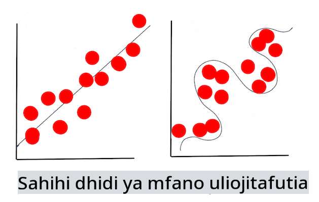

# Mbinu za Kujifunza kwa Mashine

Mchakato wa kujenga, kutumia, na kudumisha mifano ya kujifunza kwa mashine na data wanayotumia ni tofauti sana na mchakato wa maendeleo mengine mengi. Katika somo hili, tutafafanua mchakato huo, na kuainisha mbinu kuu unazohitaji kujua. Utajifunza:

- Kuelewa michakato inayounga mkono kujifunza kwa mashine kwa kiwango cha juu.
- Kuchunguza dhana za msingi kama 'mifano', 'utabiri', na 'data ya mafunzo'.

## [Maswali ya awali ya somo](https://gray-sand-07a10f403.1.azurestaticapps.net/quiz/7/)

> 🎥 Bofya picha hapo juu kwa video fupi inayopitia somo hili.

## Utangulizi

Kwa kiwango cha juu, ufundi wa kuunda michakato ya kujifunza kwa mashine (ML) unajumuisha hatua kadhaa:

1. **Amua swali**. Mchakato mwingi wa ML huanza kwa kuuliza swali ambalo haliwezi kujibiwa na programu rahisi ya masharti au injini inayotegemea sheria. Maswali haya mara nyingi huzunguka utabiri kulingana na mkusanyiko wa data.
2. **Kusanya na andaa data**. Ili uweze kujibu swali lako, unahitaji data. Ubora na, wakati mwingine, wingi wa data yako utaamua jinsi unavyoweza kujibu swali lako la awali. Kuonyesha data kwa picha ni kipengele muhimu cha awamu hii. Awamu hii pia inajumuisha kugawanya data katika kikundi cha mafunzo na cha majaribio ili kujenga mfano.
3. **Chagua mbinu ya mafunzo**. Kulingana na swali lako na asili ya data yako, unahitaji kuchagua jinsi unavyotaka kufundisha mfano ili kuakisi data yako vizuri na kufanya utabiri sahihi dhidi yake. Hii ni sehemu ya mchakato wako wa ML inayohitaji utaalamu maalum na, mara nyingi, kiasi kikubwa cha majaribio.
4. **Fundisha mfano**. Kutumia data yako ya mafunzo, utatumia algorithmi mbalimbali kufundisha mfano kutambua mifumo katika data. Mfano unaweza kutumia uzito wa ndani ambao unaweza kubadilishwa ili kutoa umuhimu kwa sehemu fulani za data kuliko zingine ili kujenga mfano bora.
5. **Tathmini mfano**. Unatumia data ambayo haijawahi kuonekana (data yako ya majaribio) kutoka seti yako iliyokusanywa ili kuona jinsi mfano unavyofanya kazi.
6. **Kurekebisha vigezo**. Kulingana na utendaji wa mfano wako, unaweza kurudia mchakato kwa kutumia vigezo tofauti, au vigeu, vinavyodhibiti tabia ya algorithmi zinazotumika kufundisha mfano.
7. **Tabiri**. Tumia pembejeo mpya kupima usahihi wa mfano wako.

## Swali gani la kuuliza

Kompyuta zina ujuzi maalum wa kugundua mifumo iliyofichwa katika data. Huduma hii ni muhimu sana kwa watafiti wenye maswali kuhusu eneo fulani ambalo haliwezi kujibiwa kwa urahisi kwa kuunda injini ya sheria inayotegemea masharti. Kwa kazi ya actuarial, kwa mfano, mwanasayansi wa data anaweza kujenga sheria zilizotengenezwa kwa mkono kuhusu vifo vya wavutaji sigara dhidi ya wasiovuta sigara.

Hata hivyo, wakati vigeu vingi vinaingizwa kwenye mlinganyo, mfano wa ML unaweza kuthibitisha kuwa bora zaidi kutabiri viwango vya vifo vya baadaye kulingana na historia ya afya ya zamani. Mfano mzuri zaidi unaweza kuwa kutabiri hali ya hewa kwa mwezi Aprili katika eneo fulani kulingana na data inayojumuisha latitudo, longitudo, mabadiliko ya hali ya hewa, ukaribu na bahari, mifumo ya mkondo wa jeti, na zaidi.

✅ [Kifurushi hiki cha slaidi](https://www2.cisl.ucar.edu/sites/default/files/2021-10/0900%20June%2024%20Haupt_0.pdf) kuhusu mifano ya hali ya hewa kinatoa mtazamo wa kihistoria wa kutumia ML katika uchambuzi wa hali ya hewa.

## Kazi za kabla ya kujenga

Kabla ya kuanza kujenga mfano wako, kuna kazi kadhaa unazohitaji kukamilisha. Ili kupima swali lako na kuunda nadharia kulingana na utabiri wa mfano, unahitaji kutambua na kusanidi vipengele kadhaa.

### Data

Ili uweze kujibu swali lako kwa uhakika wowote, unahitaji kiasi kizuri cha data ya aina sahihi. Kuna mambo mawili unayohitaji kufanya wakati huu:

- **Kusanya data**. Kumbuka somo la awali kuhusu haki katika uchambuzi wa data, kusanya data yako kwa uangalifu. Jua vyanzo vya data hii, upendeleo wowote wa asili ambao inaweza kuwa nao, na uandike asili yake.
- **Andaa data**. Kuna hatua kadhaa katika mchakato wa maandalizi ya data. Unaweza kuhitaji kukusanya data na kuiweka sawa ikiwa inatoka vyanzo mbalimbali. Unaweza kuboresha ubora na wingi wa data kupitia mbinu mbalimbali kama vile kubadilisha mistari kuwa namba (kama tunavyofanya katika [Clustering](../../5-Clustering/1-Visualize/README.md)). Unaweza pia kuzalisha data mpya, kulingana na ile ya awali (kama tunavyofanya katika [Classification](../../4-Classification/1-Introduction/README.md)). Unaweza kusafisha na kuhariri data (kama tutakavyofanya kabla ya somo la [Web App](../../3-Web-App/README.md)). Hatimaye, unaweza pia kuibadilisha na kuichanganya, kulingana na mbinu zako za mafunzo.

✅ Baada ya kukusanya na kuchakata data yako, chukua muda kuona kama umbo lake litakuruhusu kushughulikia swali lako lililokusudiwa. Inawezekana kwamba data haitafanya vizuri katika kazi yako iliyotolewa, kama tunavyogundua katika masomo yetu ya [Clustering](../../5-Clustering/1-Visualize/README.md)!

### Vipengele na Lengo

[Kipengele](https://www.datasciencecentral.com/profiles/blogs/an-introduction-to-variable-and-feature-selection) ni mali inayoweza kupimika ya data yako. Katika seti nyingi za data inaonyeshwa kama kichwa cha safu kama 'tarehe', 'ukubwa' au 'rangi'. Kipengele chako, kinachowakilishwa kwa kawaida kama `X` katika msimbo, kinawakilisha kigezo cha pembejeo ambacho kitakachotumika kufundisha mfano.

Lengo ni kitu unachojaribu kutabiri. Lengo linalowakilishwa kwa kawaida kama `y` katika msimbo, linawakilisha jibu la swali unalojaribu kuuliza kwa data yako: mwezi Desemba, malenge ya **rangi** gani yatakuwa ya bei rahisi? huko San Francisco, vitongoji gani vitakuwa na **bei** bora ya mali isiyohamishika? Wakati mwingine lengo pia huitwa sifa ya lebo.

### Kuchagua kigezo chako cha kipengele

🎓 **Uchaguzi wa Kipengele na Uchimbaji wa Kipengele** Je, unajuaje ni kigezo gani cha kuchagua wakati wa kujenga mfano? Labda utapitia mchakato wa uchaguzi wa kipengele au uchimbaji wa kipengele ili kuchagua vigezo sahihi kwa mfano unaofanya vizuri zaidi. Hata hivyo, hazifanani: "Uchimbaji wa kipengele huunda vipengele vipya kutoka kwa kazi za vipengele vya asili, wakati uchaguzi wa kipengele unarudisha sehemu ndogo ya vipengele." ([chanzo](https://wikipedia.org/wiki/Feature_selection))

### Kuonyesha data yako

Kipengele muhimu cha zana ya mwanasayansi wa data ni uwezo wa kuonyesha data kwa kutumia maktaba kadhaa bora kama Seaborn au MatPlotLib. Kuweka data yako kwa picha kunaweza kukuruhusu kugundua uhusiano uliofichwa ambao unaweza kutumia. Picha zako zinaweza pia kukusaidia kugundua upendeleo au data isiyo na uwiano (kama tunavyogundua katika [Classification](../../4-Classification/2-Classifiers-1/README.md)).

### Gawanya seti yako ya data

Kabla ya mafunzo, unahitaji kugawanya seti yako ya data katika sehemu mbili au zaidi za ukubwa usio sawa ambazo bado zinawakilisha data vizuri.

- **Mafunzo**. Sehemu hii ya seti ya data inafaa kwa mfano wako kuifundisha. Seti hii inajumuisha sehemu kubwa ya seti ya data ya awali.
- **Majaribio**. Seti ya majaribio ni kikundi huru cha data, mara nyingi hukusanywa kutoka kwa data ya awali, unayotumia kuthibitisha utendaji wa mfano uliyojenga.
- **Kuthibitisha**. Seti ya uthibitishaji ni kikundi kidogo cha mifano huru unayotumia kurekebisha vigezo vya mfano, au usanifu, ili kuboresha mfano. Kulingana na ukubwa wa data yako na swali unalouliza, unaweza usihitaji kujenga seti hii ya tatu (kama tunavyobainisha katika [Utabiri wa Mfululizo wa Muda](../../7-TimeSeries/1-Introduction/README.md)).

## Kujenga mfano

Kutumia data yako ya mafunzo, lengo lako ni kujenga mfano, au uwakilishi wa takwimu wa data yako, kwa kutumia algorithmi mbalimbali kuufundisha. Kufundisha mfano kunauweka wazi kwa data na kumruhusu kufanya mawazo kuhusu mifumo iliyogunduliwa, kuthibitisha, na kukubali au kukataa.

### Amua juu ya mbinu ya mafunzo

Kulingana na swali lako na asili ya data yako, utachagua mbinu ya kuifundisha. Kupitia [nyaraka za Scikit-learn](https://scikit-learn.org/stable/user_guide.html) - tunazotumia katika kozi hii - unaweza kuchunguza njia nyingi za kufundisha mfano. Kulingana na uzoefu wako, unaweza kuhitaji kujaribu mbinu kadhaa tofauti kujenga mfano bora zaidi. Una uwezekano wa kupitia mchakato ambapo wanasayansi wa data hutathmini utendaji wa mfano kwa kuipatia data ambayo haijawahi kuonekana, kuangalia usahihi, upendeleo, na masuala mengine yanayopunguza ubora, na kuchagua mbinu inayofaa zaidi ya mafunzo kwa kazi iliyopo.

### Fundisha mfano

Ukiwa na data yako ya mafunzo, uko tayari 'kuifaa' kuunda mfano. Utagundua kwamba katika maktaba nyingi za ML utapata msimbo 'model.fit' - ni wakati huu unapowasilisha kigezo chako cha kipengele kama safu ya thamani (kawaida 'X') na kigezo cha lengo (kawaida 'y').

### Tathmini mfano

Mara tu mchakato wa mafunzo unapokamilika (inaweza kuchukua marudio mengi, au 'epochs', kufundisha mfano mkubwa), utaweza kutathmini ubora wa mfano kwa kutumia data ya majaribio kupima utendaji wake. Data hii ni sehemu ndogo ya data ya awali ambayo mfano haujawahi kuchambua hapo awali. Unaweza kuchapisha jedwali la vipimo kuhusu ubora wa mfano wako.

🎓 **Kufaa kwa mfano**

Katika muktadha wa kujifunza kwa mashine, kufaa kwa mfano kunahusu usahihi wa kazi ya msingi ya mfano wakati inajaribu kuchambua data ambayo haijafahamika.

🎓 **Kufaa kidogo** na **kufaa kupita kiasi** ni matatizo ya kawaida yanayopunguza ubora wa mfano, kwani mfano unafaa ama si vizuri vya kutosha au vizuri sana. Hii husababisha mfano kufanya utabiri kwa karibu sana au kwa mbali sana na data yake ya mafunzo. Mfano uliokaa kupita kiasi unafanya utabiri wa data ya mafunzo vizuri sana kwa sababu umejifunza maelezo na kelele za data vizuri sana. Mfano usiofaa ni si sahihi kwani hauwezi kuchambua kwa usahihi data yake ya mafunzo wala data ambayo haijawahi 'kuona'.

> Infographic na [Jen Looper](https://twitter.com/jenlooper)

## Kurekebisha vigezo

Mara mafunzo yako ya awali yanapokamilika, angalia ubora wa mfano na fikiria kuboresha kwa kurekebisha 'vigezo vya juu'. Soma zaidi kuhusu mchakato huu [katika nyaraka](https://docs.microsoft.com/en-us/azure/machine-learning/how-to-tune-hyperparameters?WT.mc_id=academic-77952-leestott).

## Utabiri

Hii ni wakati ambapo unaweza kutumia data mpya kabisa kupima usahihi wa mfano wako. Katika mazingira ya ML 'iliyotumika', ambapo unajenga mali za wavuti kutumia mfano katika uzalishaji, mchakato huu unaweza kuhusisha kukusanya pembejeo za mtumiaji (mfano, kubofya kitufe) kuweka kigezo na kukituma kwa mfano kwa utambuzi, au tathmini.

Katika masomo haya, utagundua jinsi ya kutumia hatua hizi kuandaa, kujenga, kupima, kutathmini, na kutabiri - ishara zote za mwanasayansi wa data na zaidi, unapopiga hatua katika safari yako ya kuwa mhandisi wa ML 'kamili'.

---

## 🚀Changamoto

Chora mchoro wa mtiririko unaoakisi hatua za mtaalamu wa ML. Je, unajiona wapi sasa hivi katika mchakato huu? Unadhani utapata ugumu wapi? Nini kinaonekana rahisi kwako?

## [Maswali ya baada ya somo](https://gray-sand-07a10f403.1.azurestaticapps.net/quiz/8/)

## Mapitio na Kujisomea

Tafuta mtandaoni mahojiano na wanasayansi wa data wanaozungumzia kazi yao ya kila siku. Hapa kuna [moja](https://www.youtube.com/watch?v=Z3IjgbbCEfs).

## Kazi

[Hoji mwanasayansi wa data](assignment.md)

**Kanusho**:
Hati hii imetafsiriwa kwa kutumia huduma za kutafsiri za AI za mashine. Ingawa tunajitahidi kwa usahihi, tafadhali fahamu kuwa tafsiri za kiotomatiki zinaweza kuwa na makosa au kutokuwepo kwa usahihi. Hati asilia katika lugha yake ya asili inapaswa kuzingatiwa kuwa chanzo cha mamlaka. Kwa taarifa muhimu, tafsiri ya kitaalamu ya kibinadamu inapendekezwa. Hatutawajibika kwa kutoelewana au tafsiri zisizo sahihi zinazotokana na matumizi ya tafsiri hii.