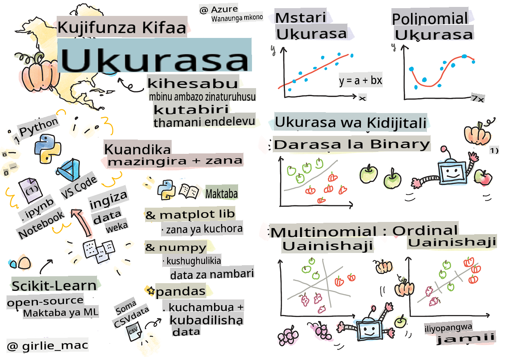
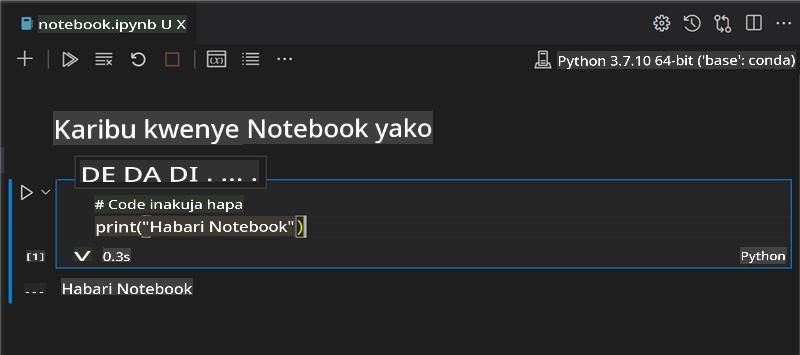
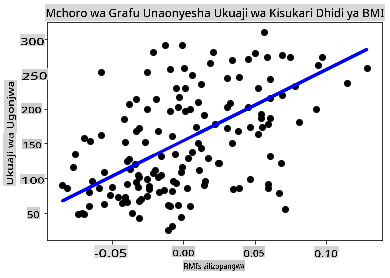

# Anza na Python na Scikit-learn kwa mifano ya regression



> Sketchnote na [Tomomi Imura](https://www.twitter.com/girlie_mac)

## [Pre-lecture quiz](https://gray-sand-07a10f403.1.azurestaticapps.net/quiz/9/)

> ### [Somohili linapatikana kwa R!](../../../../2-Regression/1-Tools/solution/R/lesson_1.html)

## Utangulizi

Katika masomo haya manne, utajifunza jinsi ya kujenga mifano ya regression. Tutazungumzia matumizi yake kwa ufupi. Lakini kabla hujaanza chochote, hakikisha una zana sahihi za kuanza mchakato!

Katika somo hili, utajifunza jinsi ya:

- Kusanidi kompyuta yako kwa kazi za kujifunza mashine za ndani.
- Kufanya kazi na daftari za Jupyter.
- Kutumia Scikit-learn, ikijumuisha usakinishaji.
- Kuchunguza regression ya linear kwa zoezi la vitendo.

## Usakinishaji na usanidi

[](https://youtu.be/-DfeD2k2Kj0 "ML kwa wanaoanza - Sanidi zana zako tayari kujenga mifano ya Kujifunza Mashine")

> 🎥 Bonyeza picha hapo juu kwa video fupi inayofanya kazi kupitia kusanidi kompyuta yako kwa ML.

1. **Sakinisha Python**. Hakikisha kuwa [Python](https://www.python.org/downloads/) imewekwa kwenye kompyuta yako. Utatumia Python kwa kazi nyingi za sayansi ya data na kujifunza mashine. Mfumo mwingi wa kompyuta tayari unajumuisha usakinishaji wa Python. Kuna [Python Coding Packs](https://code.visualstudio.com/learn/educators/installers?WT.mc_id=academic-77952-leestott) muhimu pia, ili kurahisisha usanidi kwa baadhi ya watumiaji.

   Matumizi mengine ya Python, hata hivyo, yanahitaji toleo moja la programu, wakati mengine yanahitaji toleo tofauti. Kwa sababu hii, ni muhimu kufanya kazi ndani ya [mazingira pepe](https://docs.python.org/3/library/venv.html).

2. **Sakinisha Visual Studio Code**. Hakikisha una Visual Studio Code iliyosakinishwa kwenye kompyuta yako. Fuata maelekezo haya [kusakinisha Visual Studio Code](https://code.visualstudio.com/) kwa usakinishaji wa kimsingi. Utatumia Python ndani ya Visual Studio Code katika kozi hii, kwa hivyo unaweza kutaka kujifunza jinsi ya [kusanya Visual Studio Code](https://docs.microsoft.com/learn/modules/python-install-vscode?WT.mc_id=academic-77952-leestott) kwa maendeleo ya Python.

   > Jifunze Python kwa kufanya kazi kupitia mkusanyiko huu wa [moduli za kujifunza](https://docs.microsoft.com/users/jenlooper-2911/collections/mp1pagggd5qrq7?WT.mc_id=academic-77952-leestott)
   >
   > [](https://youtu.be/yyQM70vi7V8 "Sanidi Python na Visual Studio Code")
   >
   > 🎥 Bonyeza picha hapo juu kwa video: kutumia Python ndani ya VS Code.

3. **Sakinisha Scikit-learn**, kwa kufuata [maelekezo haya](https://scikit-learn.org/stable/install.html). Kwa kuwa unahitaji kuhakikisha kuwa unatumia Python 3, inashauriwa utumie mazingira pepe. Kumbuka, ikiwa unasakinisha maktaba hii kwenye Mac M1, kuna maelekezo maalum kwenye ukurasa uliounganishwa hapo juu.

4. **Sakinisha Jupyter Notebook**. Utahitaji [kusakinisha kifurushi cha Jupyter](https://pypi.org/project/jupyter/).

## Mazingira yako ya kuandika ML

Utatumia **daftari** kuandika msimbo wako wa Python na kuunda mifano ya kujifunza mashine. Aina hii ya faili ni zana ya kawaida kwa wanasayansi wa data, na zinaweza kutambuliwa na kiambishi au ugani wake `.ipynb`.

Daftari ni mazingira ya maingiliano yanayomruhusu msanidi programu kuandika msimbo na kuongeza maelezo na kuandika nyaraka karibu na msimbo ambao ni muhimu sana kwa miradi ya majaribio au utafiti.

[](https://youtu.be/7E-jC8FLA2E "ML kwa wanaoanza - Sanidi Daftari za Jupyter kuanza kujenga mifano ya regression")

> 🎥 Bonyeza picha hapo juu kwa video fupi inayofanya kazi kupitia zoezi hili.

### Zoezi - kufanya kazi na daftari

Katika folda hii, utapata faili _notebook.ipynb_.

1. Fungua _notebook.ipynb_ ndani ya Visual Studio Code.

   Seva ya Jupyter itaanza na Python 3+ imeanza. Utapata maeneo ya daftari ambayo yanaweza kuwa `run`, vipande vya msimbo. Unaweza kuendesha kipande cha msimbo, kwa kuchagua ikoni inayofanana na kitufe cha kucheza.

2. Chagua ikoni ya `md` na ongeza kidogo ya markdown, na maandishi yafuatayo **# Karibu kwenye daftari lako**.

   Kisha, ongeza msimbo wa Python.

3. Andika **print('hello notebook')** kwenye kipande cha msimbo.
4. Chagua mshale kuendesha msimbo.

   Unapaswa kuona taarifa iliyochapishwa:

    ```output
    hello notebook
    ```



Unaweza kuchanganya msimbo wako na maoni ili kujiorodhesha daftari.

✅ Fikiria kwa dakika moja jinsi mazingira ya kazi ya msanidi wa wavuti yanavyotofautiana na yale ya mwanasayansi wa data.

## Kuanzisha na Scikit-learn

Sasa kwa kuwa Python imewekwa kwenye mazingira yako ya ndani, na unajisikia vizuri na daftari za Jupyter, hebu tujisikie vizuri vilevile na Scikit-learn (itamke `sci` as in `science`). Scikit-learn inatoa [API pana](https://scikit-learn.org/stable/modules/classes.html#api-ref) kukusaidia kufanya kazi za ML.

Kulingana na [tovuti yao](https://scikit-learn.org/stable/getting_started.html), "Scikit-learn ni maktaba ya kujifunza mashine ya chanzo wazi inayounga mkono kujifunza kwa usimamizi na bila usimamizi. Pia inatoa zana mbalimbali za kufaa mifano, uchakataji wa data, uteuzi wa mifano na tathmini, na zana nyingine nyingi."

Katika kozi hii, utatumia Scikit-learn na zana zingine kujenga mifano ya kujifunza mashine kufanya kazi tunazozita 'kujifunza mashine za jadi'. Tumeepuka makusudi mitandao ya neva na kujifunza kwa kina, kwani yanafunikwa vizuri zaidi katika mtaala wetu wa 'AI kwa Wanaoanza' unaokuja.

Scikit-learn inafanya iwe rahisi kujenga mifano na kutathmini matumizi yake. Inalenga zaidi kutumia data ya nambari na ina seti kadhaa za data zilizotengenezwa tayari kwa matumizi kama zana za kujifunza. Pia inajumuisha mifano iliyojengwa tayari kwa wanafunzi kujaribu. Hebu tuchunguze mchakato wa kupakia data iliyopakiwa tayari na kutumia estimator iliyojengwa kwa mfano wa kwanza wa ML na Scikit-learn na data ya msingi.

## Zoezi - daftari yako ya kwanza ya Scikit-learn

> Mafunzo haya yaliyochochewa na [mfano wa regression ya linear](https://scikit-learn.org/stable/auto_examples/linear_model/plot_ols.html#sphx-glr-auto-examples-linear-model-plot-ols-py) kwenye tovuti ya Scikit-learn.

[](https://youtu.be/2xkXL5EUpS0 "ML kwa wanaoanza - Mradi wako wa Kwanza wa Regression ya Linear katika Python")

> 🎥 Bonyeza picha hapo juu kwa video fupi inayofanya kazi kupitia zoezi hili.

Katika faili _notebook.ipynb_ lililohusishwa na somo hili, futa seli zote kwa kubonyeza ikoni ya 'kibuyu cha takataka'.

Katika sehemu hii, utatumia seti ndogo ya data kuhusu ugonjwa wa kisukari iliyojengwa ndani ya Scikit-learn kwa madhumuni ya kujifunza. Fikiria kwamba unataka kujaribu matibabu kwa wagonjwa wa kisukari. Mifano ya Kujifunza Mashine inaweza kukusaidia kuamua ni wagonjwa gani wataitikia matibabu bora, kulingana na mchanganyiko wa vigezo. Hata mfano wa msingi wa regression, unapowekwa kwenye grafu, unaweza kuonyesha taarifa kuhusu vigezo ambavyo vitakusaidia kupanga majaribio yako ya kinadharia ya kliniki.

✅ Kuna aina nyingi za mbinu za regression, na ile unayochagua inategemea jibu unalotafuta. Ikiwa unataka kutabiri kimo kinachowezekana kwa mtu wa umri fulani, utatumia regression ya linear, kwani unatafuta **thamani ya nambari**. Ikiwa unavutiwa na kugundua kama aina fulani ya chakula inapaswa kuzingatiwa kama mboga au la, unatafuta **ugawaji wa kitengo** kwa hivyo utatumia regression ya logistic. Utajifunza zaidi kuhusu regression ya logistic baadaye. Fikiria kidogo kuhusu maswali unayoweza kuuliza kwa data, na ni mbinu ipi itakayofaa zaidi.

Hebu tuanze kazi hii.

### Ingiza maktaba

Kwa kazi hii tutaingiza maktaba kadhaa:

- **matplotlib**. Ni zana muhimu ya [grafu](https://matplotlib.org/) na tutaichukua ili kuunda grafu ya mstari.
- **numpy**. [numpy](https://numpy.org/doc/stable/user/whatisnumpy.html) ni maktaba muhimu kwa kushughulikia data ya nambari katika Python.
- **sklearn**. Hii ni maktaba ya [Scikit-learn](https://scikit-learn.org/stable/user_guide.html).

Ingiza maktaba kadhaa kusaidia na kazi zako.

1. Ongeza ushirikishaji kwa kuandika msimbo ufuatao:

   ```python
   import matplotlib.pyplot as plt
   import numpy as np
   from sklearn import datasets, linear_model, model_selection
   ```

   Hapo juu unaingiza `matplotlib`, `numpy` and you are importing `datasets`, `linear_model` and `model_selection` from `sklearn`. `model_selection` is used for splitting data into training and test sets.

### The diabetes dataset

The built-in [diabetes dataset](https://scikit-learn.org/stable/datasets/toy_dataset.html#diabetes-dataset) includes 442 samples of data around diabetes, with 10 feature variables, some of which include:

- age: age in years
- bmi: body mass index
- bp: average blood pressure
- s1 tc: T-Cells (a type of white blood cells)

✅ This dataset includes the concept of 'sex' as a feature variable important to research around diabetes. Many medical datasets include this type of binary classification. Think a bit about how categorizations such as this might exclude certain parts of a population from treatments.

Now, load up the X and y data.

> 🎓 Remember, this is supervised learning, and we need a named 'y' target.

In a new code cell, load the diabetes dataset by calling `load_diabetes()`. The input `return_X_y=True` signals that `X` will be a data matrix, and `y` itakuwa lengo la regression.

2. Ongeza amri za kuchapisha kuonyesha umbo la data na kipengele chake cha kwanza:

    ```python
    X, y = datasets.load_diabetes(return_X_y=True)
    print(X.shape)
    print(X[0])
    ```

    Unachopata kama jibu ni tuple. Unachofanya ni kugawa maadili mawili ya kwanza ya tuple kwa `X` and `y` mtawalia. Jifunze zaidi [kuhusu tuples](https://wikipedia.org/wiki/Tuple).

    Unaweza kuona kuwa data hii ina vitu 442 vilivyoundwa katika safu za vipengele 10:

    ```text
    (442, 10)
    [ 0.03807591  0.05068012  0.06169621  0.02187235 -0.0442235  -0.03482076
    -0.04340085 -0.00259226  0.01990842 -0.01764613]
    ```

    ✅ Fikiria kidogo kuhusu uhusiano kati ya data na lengo la regression. Regression ya linear inatabiri uhusiano kati ya kipengele X na lengo la kigezo y. Je, unaweza kupata [lengo](https://scikit-learn.org/stable/datasets/toy_dataset.html#diabetes-dataset) kwa seti ya data ya kisukari katika nyaraka? Je, seti hii ya data inaonyesha nini, ikizingatiwa lengo hilo?

3. Kisha, chagua sehemu ya seti hii ya data kuipiga kwa kuchagua safu ya 3 ya seti ya data. Unaweza kufanya hivyo kwa kutumia `:` operator to select all rows, and then selecting the 3rd column using the index (2). You can also reshape the data to be a 2D array - as required for plotting - by using `reshape(n_rows, n_columns)`. Ikiwa moja ya vigezo ni -1, kipimo kinacholingana kinahesabiwa kiotomatiki.

   ```python
   X = X[:, 2]
   X = X.reshape((-1,1))
   ```

   ✅ Wakati wowote, chapisha data ili kuangalia umbo lake.

4. Sasa kwa kuwa una data tayari kupigwa, unaweza kuona ikiwa mashine inaweza kusaidia kuamua mgawanyiko wa kimantiki kati ya nambari katika seti hii ya data. Ili kufanya hivyo, unahitaji kugawanya data zote mbili (X) na lengo (y) katika seti za majaribio na mafunzo. Scikit-learn ina njia rahisi ya kufanya hivyo; unaweza kugawanya data yako ya majaribio katika sehemu fulani.

   ```python
   X_train, X_test, y_train, y_test = model_selection.train_test_split(X, y, test_size=0.33)
   ```

5. Sasa uko tayari kufundisha mfano wako! Pakia mfano wa regression ya linear na uufundishe na seti zako za mafunzo za X na y kwa kutumia `model.fit()`:

    ```python
    model = linear_model.LinearRegression()
    model.fit(X_train, y_train)
    ```

    ✅ `model.fit()` is a function you'll see in many ML libraries such as TensorFlow

5. Then, create a prediction using test data, using the function `predict()`. Hii itatumika kuchora mstari kati ya vikundi vya data

    ```python
    y_pred = model.predict(X_test)
    ```

6. Sasa ni wakati wa kuonyesha data kwenye grafu. Matplotlib ni zana muhimu sana kwa kazi hii. Unda grafu ya nukta za X na y zote za majaribio, na utumie utabiri kuchora mstari mahali panapofaa zaidi, kati ya vikundi vya data vya mfano.

    ```python
    plt.scatter(X_test, y_test,  color='black')
    plt.plot(X_test, y_pred, color='blue', linewidth=3)
    plt.xlabel('Scaled BMIs')
    plt.ylabel('Disease Progression')
    plt.title('A Graph Plot Showing Diabetes Progression Against BMI')
    plt.show()
    ```

   

   ✅ Fikiria kidogo kuhusu kinachoendelea hapa. Mstari wa moja kwa moja unapita kati ya nukta nyingi ndogo za data, lakini unafanya nini hasa? Je, unaweza kuona jinsi unavyoweza kutumia mstari huu kutabiri ambapo data mpya, isiyoonekana inapaswa kutoshea kwa uhusiano na mhimili wa y wa grafu? Jaribu kueleza kwa maneno matumizi ya vitendo ya mfano huu.

Hongera, umeunda mfano wako wa kwanza wa regression ya linear, umeunda utabiri na kuonyesha kwenye grafu!

---
## 🚀Changamoto

Piga kigezo tofauti kutoka kwa seti hii ya data. Kidokezo: hariri mstari huu: `X = X[:,2]`. Kwa kuzingatia lengo la seti hii ya data, una uwezo wa kugundua nini kuhusu maendeleo ya ugonjwa wa kisukari?
## [Post-lecture quiz](https://gray-sand-07a10f403.1.azurestaticapps.net/quiz/10/)

## Mapitio na Kujisomea

Katika mafunzo haya, ulifanya kazi na regression ya linear rahisi, badala ya regression ya univariate au multiple linear. Soma kidogo kuhusu tofauti kati ya mbinu hizi, au tazama [video hii](https://www.coursera.org/lecture/quantifying-relationships-regression-models/linear-vs-nonlinear-categorical-variables-ai2Ef)

Soma zaidi kuhusu dhana ya regression na fikiria kuhusu aina gani za maswali yanaweza kujibiwa na mbinu hii. Chukua [mafunzo haya](https://docs.microsoft.com/learn/modules/train-evaluate-regression-models?WT.mc_id=academic-77952-leestott) ili kuongeza uelewa wako.

## Kazi

[Seti ya data tofauti](assignment.md)

**Onyo**:
Hati hii imetafsiriwa kwa kutumia huduma za kutafsiri za AI zinazotegemea mashine. Ingawa tunajitahidi kwa usahihi, tafadhali fahamu kwamba tafsiri za kiotomatiki zinaweza kuwa na makosa au kutokuwa sahihi. Hati ya asili katika lugha yake ya asili inapaswa kuchukuliwa kama chanzo rasmi. Kwa habari muhimu, tafsiri ya kitaalamu ya binadamu inapendekezwa. Hatutawajibika kwa kutoelewana au kutafsiri vibaya kunakotokana na matumizi ya tafsiri hii.