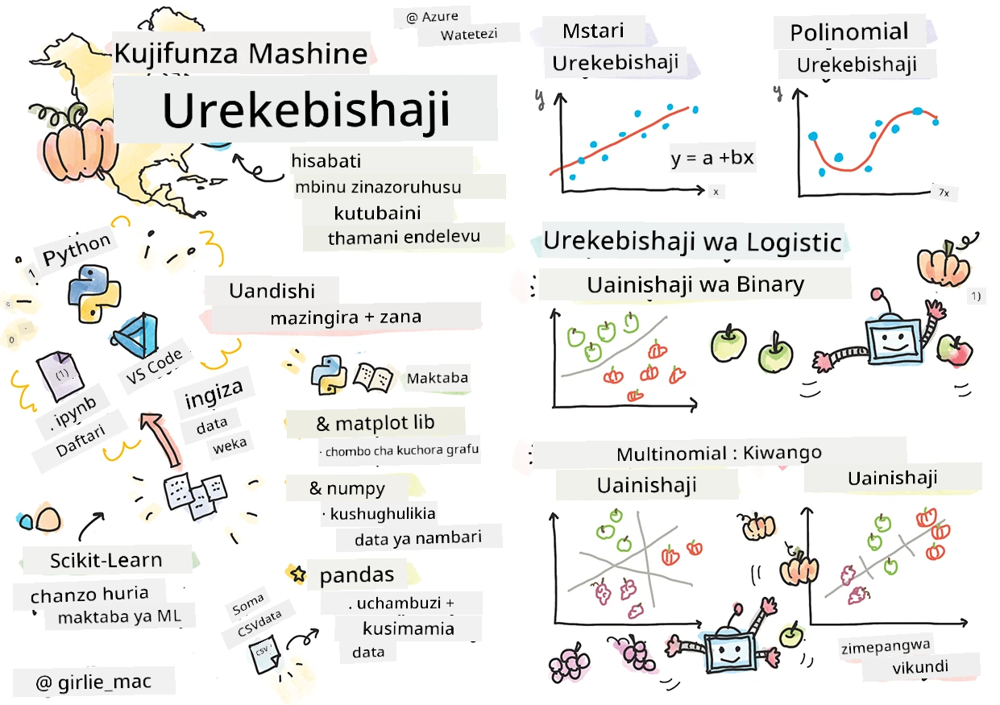
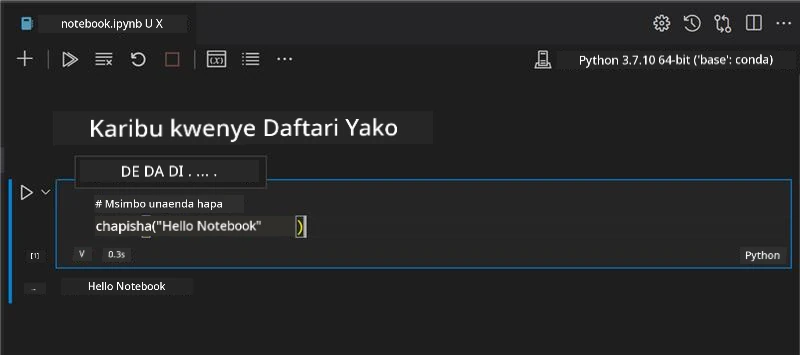
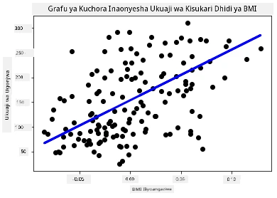

# Anza na Python na Scikit-learn kwa mifano ya urekebishaji



> Sketchnote na [Tomomi Imura](https://www.twitter.com/girlie_mac)

## [Mtihani wa kabla ya somo](https://ff-quizzes.netlify.app/en/ml/)

> ### [Somo hili linapatikana kwa R!](../../../../2-Regression/1-Tools/solution/R/lesson_1.html)

## Utangulizi

Katika masomo manne haya, utagundua jinsi ya kujenga mifano ya urekebishaji. Tutajadili kwa nini hizi ni muhimu hivi karibuni. Lakini kabla hujafanya kitu chochote, hakikisha una vifaa sahihi tayari kuanza mchakato!

Katika somo hili, utajifunza jinsi ya:

- Kusanidi kompyuta yako kwa kazi za kujifunza kwa mashine za ndani.
- Kufanya kazi na Jupyter Notebooks.
- Kutumia Scikit-learn, ikijumuisha usakinishaji.
- Kuchunguza urekebishaji wa mstari kwa zoezi la vitendo.

## Usakinishaji na usanidi

[](https://youtu.be/-DfeD2k2Kj0 "ML kwa wanaoanzisha -Weka vifaa vyako tayari kujenga modeli za Kujifunza kwa Mashine")

> 🎥 Bonyeza picha hapo juu kwa video fupi inayofundisha jinsi ya kusanidi kompyuta yako kwa ML.

1. **Sakinisha Python**. Hakikisha kwamba [Python](https://www.python.org/downloads/) imewekwa kwenye kompyuta yako. Utaweza kutumia Python kwa kazi nyingi za sayansi ya data na kujifunza kwa mashine. Mifumo mingi ya kompyuta tayari ina usakinishaji wa Python. Pia kuna [Python Coding Packs](https://code.visualstudio.com/learn/educators/installers?WT.mc_id=academic-77952-leestott) muhimu zinazopatikana kusaidia baadhi ya watumiaji kwa urahisi wa usanidi.

   Matumizi kadhaa ya Python, hata hivyo, yanahitaji toleo moja la programu, wakati mengine yanahitaji toleo tofauti. Kwa sababu hii, ni muhimu kufanya kazi ndani ya [mazingira ya virtual](https://docs.python.org/3/library/venv.html).

2. **Sakinisha Visual Studio Code**. Hakikisha una Visual Studio Code imewekwa kwenye kompyuta yako. Fuata maelekezo haya ya [kusakinisha Visual Studio Code](https://code.visualstudio.com/) kwa usakinishaji wa msingi. Utatumia Python katika Visual Studio Code katika kozi hii, hivyo huenda utataka kujifunza jinsi ya [kusanidi Visual Studio Code](https://docs.microsoft.com/learn/modules/python-install-vscode?WT.mc_id=academic-77952-leestott) kwa maendeleo ya Python.

   > Jifunze vizuri Python kwa kufanya kazi kupitia mkusanyiko wa [moduli za Kujifunza](https://docs.microsoft.com/users/jenlooper-2911/collections/mp1pagggd5qrq7?WT.mc_id=academic-77952-leestott)
   >
   > [](https://youtu.be/yyQM70vi7V8 "Weka Python na Visual Studio Code")
   >
   > 🎥 Bonyeza picha hapo juu kwa video: kutumia Python ndani ya VS Code.

3. **Sakinisha Scikit-learn**, kwa kufuata [maelekezo haya](https://scikit-learn.org/stable/install.html). Kwa sababu unahitaji kuhakikisha unatumia Python 3, inashauriwa kutumia mazingira ya virtual. Kumbuka, kama unasakinisha maktaba hii kwenye M1 Mac, kuna maelekezo maalum kwenye ukurasa uliounganishwa hapo juu.

1. **Sakinisha Jupyter Notebook**. Utahitaji [kusakinisha kifurushi cha Jupyter](https://pypi.org/project/jupyter/).

## Mazingira yako ya kuandika ML

Utatumia **notebooks** kuendeleza msimbo wako wa Python na kuunda mifano ya kujifunza kwa mashine. Aina hii ya faili ni chombo cha kawaida kwa wanasayansi wa data, na zinaweza kutambuliwa kwa kiambishi kibadilisha `.ipynb`.

Notebooks ni mazingira ya mwingiliano yanayomruhusu mendelezaji kufanya msimbo na kuongeza maelezo na kuandika nyaraka kuhusu msimbo ambayo ni msaada mkubwa kwa miradi ya majaribio au utafiti.

[](https://youtu.be/7E-jC8FLA2E "ML kwa wanaoanzisha - Weka Jupyter Notebooks kuanza kujenga mifano ya urekebishaji")

> 🎥 Bonyeza picha hapo juu kwa video fupi inayofundisha zoezi hili.

### Zoezi - fanya kazi na daftari

Katika folda hii, utapata faili _notebook.ipynb_.

1. Fungua _notebook.ipynb_ katika Visual Studio Code.

   Seva ya Jupyter itaanza na Python 3+ imeanzishwa. Utapata maeneo ya daftari inayoweza `kuwaendeshwa`, sehemu za msimbo. Unaweza kuendesha kipande cha msimbo, kwa kuchagua ikoni inayofanana na kitufe cha kucheza.

1. Chagua ikoni `md` na ongeza kidogo markdown, na maandishi yafuatayo **# Karibu kwenye daftari lako**.

   Kisha, ongeza msimbo wa Python.

1. Andika **print('hello notebook')** katika kipande cha msimbo.
1. Chagua mshale kuendesha msimbo.

   Utapaswa kuona tamko lililo chapishwa:

    ```output
    hello notebook
    ```



Unaweza kuingiza maelezo katika msimbo wako ili kujirekebisha wega kwenye daftari.

✅ Fikiria kwa muda mfupi jinsi mazingira ya kazi ya mtengenezaji wavuti yanavyotofautiana na ya mtaalamu wa sayansi ya data.

## Kuanzisha na kutumia Scikit-learn

Sasa Python imewekwa kwenye mazingira yako ya mkoa, na umezoea Jupyter Notebooks, hebu pia tujifunze vizuri Scikit-learn (taja kama `sci` kama katika `science`). Scikit-learn hutoa [API pana](https://scikit-learn.org/stable/modules/classes.html#api-ref) kusaidia kufanya kazi za ML.

Kulingana na [tovuti yao](https://scikit-learn.org/stable/getting_started.html), "Scikit-learn ni maktaba ya chanzo huria ya kujifunza kwa mashine inayounga mkono kujifunza kwa usimamizi na usiokuwa na usimamizi. Pia hutumia zana mbalimbali za kufitisha modeli, usindikaji wa data, uchaguzi wa modeli na tathmini, na huduma nyingine nyingi."

Katika kozi hii, utatumia Scikit-learn na zana nyingine kujenga mifano ya kujifunza kwa mashine kufanya kile tunachokiita 'kazi za jadi za kujifunza kwa mashine.' Tumewaepuka makusudi mitandao ya neva na ujifunzaji wa kina, kwani yanashughulikiwa vizuri zaidi katika mtaala wetu unaokuja wa 'AI kwa Wanaoanzisha.'

Scikit-learn hufanya iwe rahisi kujenga mifano na kuipima kwa matumizi. Inazingatia hasa kutumia data ya nambari na ina seti kadhaa za data zilizotayarishwa tayari kwa zana za kujifunza. Pia inajumuisha mifano iliyojengwa tayari kwa wanafunzi kujaribu. Hebu tuchunguze mchakato wa kupakia data zilizoandaliwa na kutumia kipima kilichojengwa kwa mfano wa kwanza wa ML na Scikit-learn na data rahisi.

## Zoezi - daftari lako la kwanza la Scikit-learn

> Mafunzo haya yamechukuliwa kutoka kwa [mfano wa urekebishaji wa mstari](https://scikit-learn.org/stable/auto_examples/linear_model/plot_ols.html#sphx-glr-auto-examples-linear-model-plot-ols-py) kwenye tovuti ya Scikit-learn.


[](https://youtu.be/2xkXL5EUpS0 "ML kwa wanaoanzisha - Mradi wako wa Kwanza wa Urekebishaji wa Mstari katika Python")

> 🎥 Bonyeza picha hapo juu kwa video fupi inayofundisha zoezi hili.

Katika faili la _notebook.ipynb_ linalohusiana na somo hili, safisha seli zote kwa kubonyeza ikoni ya 'mkaa taka'.

Katika sehemu hii, utafanya kazi na seti ndogo ya data kuhusu kisukari ambayo imejengwa ndani ya Scikit-learn kwa madhumuni ya kujifunza. Fikiria kama ungetaka kujaribu tiba kwa wagonjwa wa kisukari. Mifano ya Kujifunza kwa Mashine inaweza kusaidia kuamua ni wagonjwa gani wangejibu vyema tiba hiyo, kwa msingi wa mchanganyiko wa vigezo. Hata mfano rahisi wa urekebishaji, ukionyeshwa picha, unaweza kuonyesha taarifa kuhusu vigezo ambavyo vitakusaidia kupanga majaribio ya nadharia ya kliniki.

✅ Kuna aina nyingi za mbinu za urekebishaji, na ipi utakayochagua inategemea jibu unalotafuta. Ikiwa unataka kutabiri urefu unaowezekana kwa mtu wa umri fulani, utatumia urekebishaji wa mstari, kwa sababu unatafuta **thamani ya nambari**. Ikiwa unavutiwa kugundua kama aina fulani ya chakula inapaswa kuzingatiwa kuwa vegan au la, unatafuta **ugawaji wa aina** kwa hivyo utatumia urekebishaji wa logistic. Utajifunza zaidi kuhusu urekebishaji wa logistic baadaye. Fikiria kidogo kuhusu maswali unayoweza kuuliza data, na ni mbinu gani kati ya hizi zingekuwa sahihi zaidi.

Hebu tuanze kwenye kazi hii.

### Ingiza maktaba

Kwa kazi hii tutatangaza baadhi ya maktaba:

- **matplotlib**. Ni [chombo cha kuchora michoro](https://matplotlib.org/) kinachotumika kuunda mchoro wa mistari.
- **numpy**. [numpy](https://numpy.org/doc/stable/user/whatisnumpy.html) ni maktaba muhimu kwa kushughulikia data ya nambari katika Python.
- **sklearn**. Hii ni maktaba ya [Scikit-learn](https://scikit-learn.org/stable/user_guide.html).

Ingiza maktaba kusaidia kazi zako.

1. Ongeza maingizo kwa kuandika msimbo ufuatao:

   ```python
   import matplotlib.pyplot as plt
   import numpy as np
   from sklearn import datasets, linear_model, model_selection
   ```

   Juu hapa unainua `matplotlib`, `numpy` na unainua `datasets`, `linear_model` na `model_selection` kutoka `sklearn`. `model_selection` hutumika kugawanya data katika makundi ya mafunzo na majaribio.

### Seti ya data ya kisukari

Seti ya data [ya kisukari](https://scikit-learn.org/stable/datasets/toy_dataset.html#diabetes-dataset) iliyojengwa ina sampuli 442 za data kuhusu kisukari, na vigezo 10, baadhi yao ni:

- umri: umri katika miaka
- bmi: index ya uzito wa mwili
- bp: wastani wa shinikizo la damu
- s1 tc: T-Cells (aina ya seli nyeupe za damu)

✅ Seti hii ya data ina dhana ya 'jinsia' kama kigezo muhimu katika utafiti wa kisukari. Seti nyingi za data za matibabu zina aina hii ya mgawanyo wa binary. Fikiria kidogo jinsi malezo kama haya yanavyoweza kuondoa sehemu fulani za watu kutoka kwa matibabu.

Sasa, pakia data X na y.

> 🎓 Kumbuka, hii ni kujifunza kwa usimamizi, na tunahitaji 'y' linaloitwa lengo.

Katika seli mpya ya msimbo, pakia seti ya data ya kisukari kwa kuitwa `load_diabetes()`. Kuingiza `return_X_y=True` kunaashiria kuwa `X` itakuwa matriki ya data, na `y` itakuwa lengo la urekebishaji.

1. Ongeza baadhi ya amri za print ili kuonyesha umbo la matriki ya data na kipengele chake cha kwanza:

    ```python
    X, y = datasets.load_diabetes(return_X_y=True)
    print(X.shape)
    print(X[0])
    ```

    Kile unachopata kama jibu ni tuple. Unachofanya ni kugawa vitu viwili vya kwanza vya tuple kwa `X` na `y` mtawalia. Jifunze zaidi [kuhusu tuple](https://wikipedia.org/wiki/Tuple).

    Unaweza kuona kuwa data hii ina vitu 442 vilivyoumbwa katika safu za vitu 10:

    ```text
    (442, 10)
    [ 0.03807591  0.05068012  0.06169621  0.02187235 -0.0442235  -0.03482076
    -0.04340085 -0.00259226  0.01990842 -0.01764613]
    ```

    ✅ Fikiria kidogo kuhusu uhusiano kati ya data na lengo la urekebishaji. Urekebishaji wa mstari unasema mahusiano kati ya kipengele X na kigezo cha lengo y. Je, unaweza kupata [lengo](https://scikit-learn.org/stable/datasets/toy_dataset.html#diabetes-dataset) la seti ya data ya kisukari katika nyaraka? Seti hii ya data inaonyesha nini ukizingatia lengo hilo?

2. Ifuatayo, chagua sehemu ya seti hii ya data kwa kuchagua safu ya tatu ya dataset. Unaweza kufanya hivi kwa kutumia kiharusi cha `:` kuchagua mistari yote, kisha kuchagua safu ya 3 kutumia kiashiria (2). Pia unaweza kurekebisha data kuwa array ya 2D - kama inavyotakiwa kwa kuchora - kwa kutumia `reshape(n_rows, n_columns)`. Ikiwa parameta moja ni -1, kipimo kinacholingana kinakokotolewa kiotomatiki.

   ```python
   X = X[:, 2]
   X = X.reshape((-1,1))
   ```

   ✅ Wakati wowote, chapisha data ili kuangalia umbo lake.

3. Sasa una data tayari kuchorwa, unaweza kuona kama mashine inaweza kusaidia kuamua mgawanyiko wa maana kati ya nambari katika seti hii ya data. Kufanya hivyo, unahitaji kugawanya data zote (X) na lengo (y) katika seti za majaribio na mafunzo. Scikit-learn ina njia rahisi ya kufanya hili; unaweza kugawanya data zako za majaribio mahali fulani.

   ```python
   X_train, X_test, y_train, y_test = model_selection.train_test_split(X, y, test_size=0.33)
   ```

4. Sasa uko tayari kufundisha mfano wako! Pakia mfano wa urekebishaji wa mstari na uufundishe kwa seti zako za mafunzo za X na y kwa kutumia `model.fit()`:

    ```python
    model = linear_model.LinearRegression()
    model.fit(X_train, y_train)
    ```

    ✅ `model.fit()` ni kazi utakayoiwona katika maktaba nyingi za ML kama TensorFlow

5. Kisha, tengeneza utabiri kwa kutumia data ya majaribio, kwa kutumia kazi `predict()`. Hii itatumika kuchora mstari kati ya makundi ya data

    ```python
    y_pred = model.predict(X_test)
    ```

6. Sasa ni wakati wa kuonyesha data kwenye mchoro. Matplotlib ni chombo muhimu sana kwa kazi hii. Tengeneza mchoro wa pointi zote za data za majaribio X na y, na tumia utabiri kuchora mstari mahali pazuri zaidi, kati ya makundi ya data ya mfano.

    ```python
    plt.scatter(X_test, y_test,  color='black')
    plt.plot(X_test, y_pred, color='blue', linewidth=3)
    plt.xlabel('Scaled BMIs')
    plt.ylabel('Disease Progression')
    plt.title('A Graph Plot Showing Diabetes Progression Against BMI')
    plt.show()
    ```

   


   ✅ Fikiria kidogo kuhusu kinachoendelea hapa. Mstari wa moja kwa moja unapitisha kwenye nukta nyingi ndogo za data, lakini unafanya nini hasa? Unaona jinsi unavyopaswa kutumia mstari huu kutabiri wapi nukta mpya ya data ambayo haijaonekana inapaswa kuwekwa kulingana na mhimili wa y wa mchoro? Jaribu kuweka kwa maneno matumizi halisi ya modeli hii.

Hongera, umejenga modeli yako ya kwanza ya usawa wa mstari, umeunda utabiri nayo, na kuionesha kwenye mchoro!

---
## 🚀Changamoto

Choroga kigezo kingine kutoka kwenye dataset hii. Wazo: rekebisha mstari huu: `X = X[:,2]`. Kulingana na lengo la dataset hii, unaweza kugundua nini kuhusu maendeleo ya ugonjwa wa kisukari?
## [Mtihani baada ya somo](https://ff-quizzes.netlify.app/en/ml/)

## Mapitio & Kujifunza Binafsi

Katika mafunzo haya, ulifanya kazi na usawa wa mstari rahisi, badala ya usawa wa mstari wa kipengele kimoja au mwingi. Soma kidogo kuhusu tofauti kati ya mbinu hizi, au tazama [video hii](https://www.coursera.org/lecture/quantifying-relationships-regression-models/linear-vs-nonlinear-categorical-variables-ai2Ef)

Soma zaidi kuhusu dhana ya usawa wa mstari na fikiria ni aina gani za maswali yanaweza kujibiwa kwa mbinu hii. Fanya mafunzo haya [tutorial](https://docs.microsoft.com/learn/modules/train-evaluate-regression-models?WT.mc_id=academic-77952-leestott) kuongeza uelewa wako.

## Wajibu

[Dataset tofauti](assignment.md)

---

<!-- CO-OP TRANSLATOR DISCLAIMER START -->
**Kionyozo**:
Hati hii imetafsiriwa kwa kutumia huduma ya tafsiri ya AI [Co-op Translator](https://github.com/Azure/co-op-translator). Ingawa tunajitahidi kupata usahihi, tafadhali fahamu kwamba tafsiri za kiotomatiki zinaweza kuwa na makosa au upungufu wa usahihi. Hati ya asili katika lugha yake halisi inapaswa kuchukuliwa kama chanzo cha mamlaka. Kwa taarifa muhimu, tafsiri ya kitaalamu inayofanywa na binadamu inapendekezwa. Hatutojibu kwa kuelewa vibaya au tafsiri potofu zinazotokea kutokana na matumizi ya tafsiri hii.
<!-- CO-OP TRANSLATOR DISCLAIMER END -->