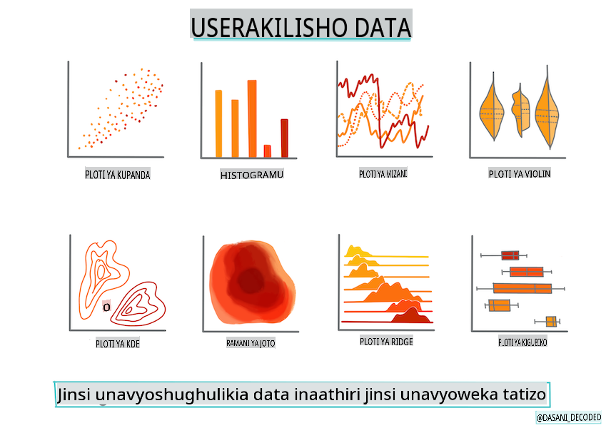
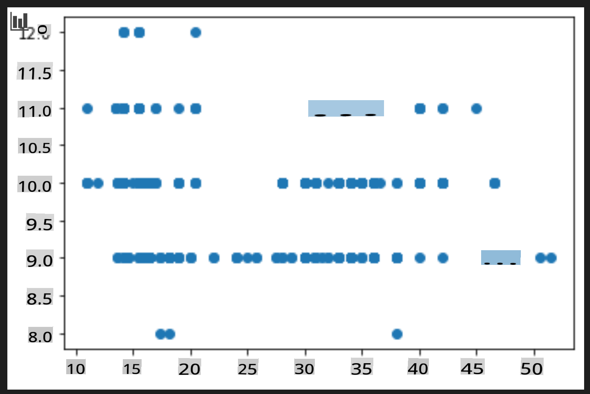
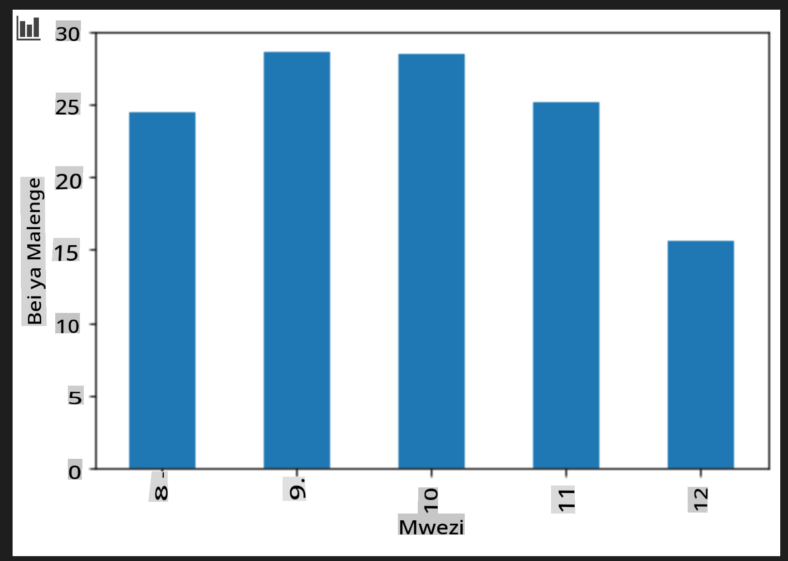

# Jenga mfano wa regression kwa kutumia Scikit-learn: andaa na onyesha data



Infographic na [Dasani Madipalli](https://twitter.com/dasani_decoded)

## [Pre-lecture quiz](https://gray-sand-07a10f403.1.azurestaticapps.net/quiz/11/)

> ### [Somo hili linapatikana katika R!](../../../../2-Regression/2-Data/solution/R/lesson_2.html)

## Utangulizi

Sasa kwa kuwa umeandaliwa na zana unazohitaji kuanza kujenga mifano ya kujifunza mashine kwa kutumia Scikit-learn, uko tayari kuanza kuuliza maswali kuhusu data zako. Unapofanya kazi na data na kutumia suluhisho za ML, ni muhimu sana kuelewa jinsi ya kuuliza swali sahihi ili kufungua uwezo wa dataset yako.

Katika somo hili, utajifunza:

- Jinsi ya kuandaa data yako kwa ajili ya kujenga mfano.
- Jinsi ya kutumia Matplotlib kwa ajili ya kuonyesha data.

## Kuuliza swali sahihi kuhusu data zako

Swali unalotaka lijibiwe litaamua ni aina gani ya algorithmi za ML utazitumia. Na ubora wa jibu unalopata utategemea sana asili ya data zako.

Angalia [data](https://github.com/microsoft/ML-For-Beginners/blob/main/2-Regression/data/US-pumpkins.csv) iliyotolewa kwa somo hili. Unaweza kufungua faili hili la .csv katika VS Code. Uskimaji wa haraka unaonyesha kuwa kuna mapengo na mchanganyiko wa data za maneno na namba. Pia kuna safu ya ajabu inayoitwa 'Package' ambapo data ni mchanganyiko kati ya 'sacks', 'bins' na thamani nyinginezo. Kwa kweli, data ni kama fujo kidogo.

[](https://youtu.be/5qGjczWTrDQ "ML for beginners - How to Analyze and Clean a Dataset")

> 🎥 Bofya picha hapo juu kwa video fupi ya kuandaa data kwa somo hili.

Kwa kweli, si kawaida sana kupewa dataset iliyo tayari kabisa kutumia ili kuunda mfano wa ML moja kwa moja. Katika somo hili, utajifunza jinsi ya kuandaa dataset ghafi kwa kutumia maktaba za kawaida za Python. Pia utajifunza mbinu mbalimbali za kuonyesha data.

## Uchunguzi wa kesi: 'soko la maboga'

Katika folda hii utapata faili la .csv katika folda kuu `data` inayoitwa [US-pumpkins.csv](https://github.com/microsoft/ML-For-Beginners/blob/main/2-Regression/data/US-pumpkins.csv) ambayo inajumuisha mistari 1757 ya data kuhusu soko la maboga, imepangwa katika makundi kwa miji. Hii ni data ghafi iliyotolewa kutoka [Specialty Crops Terminal Markets Standard Reports](https://www.marketnews.usda.gov/mnp/fv-report-config-step1?type=termPrice) inayosambazwa na Idara ya Kilimo ya Marekani.

### Kuandaa data

Data hii iko katika uwanja wa umma. Inaweza kupakuliwa katika faili nyingi tofauti, kwa kila mji, kutoka tovuti ya USDA. Ili kuepuka faili nyingi tofauti, tumeunganisha data zote za miji katika lahajedwali moja, hivyo tayari tume_anda_ data kidogo. Sasa, tuangalie kwa karibu data hiyo.

### Data ya maboga - hitimisho la awali

Unaona nini kuhusu data hii? Tayari umeona kuwa kuna mchanganyiko wa maneno, namba, mapengo na thamani za ajabu ambazo unahitaji kuzifanyia kazi.

Ni swali gani unaweza kuuliza kuhusu data hii, kwa kutumia mbinu ya Regression? Vipi kuhusu "Kutabiri bei ya boga linapouzwa katika mwezi fulani". Ukiangalia tena data, kuna mabadiliko unayohitaji kufanya ili kuunda muundo wa data unaohitajika kwa kazi hiyo.

## Zoezi - kuchambua data ya maboga

Tutumie [Pandas](https://pandas.pydata.org/), (jina linawakilisha `Python Data Analysis`) chombo kinachofaa sana kwa kuunda data, kuchambua na kuandaa data hii ya maboga.

### Kwanza, angalia tarehe zilizokosekana

Utahitaji kuchukua hatua za kuangalia tarehe zilizokosekana:

1. Badilisha tarehe kuwa muundo wa mwezi (hizi ni tarehe za Marekani, hivyo muundo ni `MM/DD/YYYY`).
2. Toa mwezi kwenye safu mpya.

Fungua faili la _notebook.ipynb_ katika Visual Studio Code na ingiza lahajedwali katika dataframe mpya ya Pandas.

1. Tumia `head()` kuona safu tano za kwanza.

    ```python
    import pandas as pd
    pumpkins = pd.read_csv('../data/US-pumpkins.csv')
    pumpkins.head()
    ```

    ✅ Ni kazi gani ungetumia kuona safu tano za mwisho?

1. Angalia kama kuna data iliyokosekana katika dataframe ya sasa:

    ```python
    pumpkins.isnull().sum()
    ```

    Kuna data iliyokosekana, lakini labda haitajalisha kwa kazi hii.

1. Ili kufanya dataframe yako iwe rahisi kufanya kazi nayo, chagua safu tu unazohitaji, kwa kutumia `loc` function which extracts from the original dataframe a group of rows (passed as first parameter) and columns (passed as second parameter). The expression `:` katika mfano hapa chini ina maana "safu zote".

    ```python
    columns_to_select = ['Package', 'Low Price', 'High Price', 'Date']
    pumpkins = pumpkins.loc[:, columns_to_select]
    ```

### Pili, tambua bei ya wastani ya boga

Fikiria jinsi ya kutambua bei ya wastani ya boga katika mwezi fulani. Ni safu gani ungechagua kwa kazi hii? Kidokezo: utahitaji safu 3.

Suluhisho: chukua wastani wa safu za `Low Price` and `High Price` kujaza safu mpya ya Price, na ubadilishe safu ya Date kuonyesha tu mwezi. Kwa bahati nzuri, kulingana na ukaguzi hapo juu, hakuna data iliyokosekana kwa tarehe au bei.

1. Ili kuhesabu wastani, ongeza msimbo ufuatao:

    ```python
    price = (pumpkins['Low Price'] + pumpkins['High Price']) / 2

    month = pd.DatetimeIndex(pumpkins['Date']).month

    ```

   ✅ Jisikie huru kuchapisha data yoyote unayotaka kukagua kwa kutumia `print(month)`.

2. Sasa, nakili data yako iliyobadilishwa katika dataframe mpya ya Pandas:

    ```python
    new_pumpkins = pd.DataFrame({'Month': month, 'Package': pumpkins['Package'], 'Low Price': pumpkins['Low Price'],'High Price': pumpkins['High Price'], 'Price': price})
    ```

    Kuchapisha dataframe yako kutaonyesha dataset safi na nadhifu ambayo unaweza kujenga mfano wako mpya wa regression.

### Lakini subiri! Kuna kitu cha ajabu hapa

Ukiangalia safu ya `Package` column, pumpkins are sold in many different configurations. Some are sold in '1 1/9 bushel' measures, and some in '1/2 bushel' measures, some per pumpkin, some per pound, and some in big boxes with varying widths.

> Pumpkins seem very hard to weigh consistently

Digging into the original data, it's interesting that anything with `Unit of Sale` equalling 'EACH' or 'PER BIN' also have the `Package` type per inch, per bin, or 'each'. Pumpkins seem to be very hard to weigh consistently, so let's filter them by selecting only pumpkins with the string 'bushel' in their `Package`.

1. Ongeza kichujio juu ya faili, chini ya uingizaji wa awali wa .csv:

    ```python
    pumpkins = pumpkins[pumpkins['Package'].str.contains('bushel', case=True, regex=True)]
    ```

    Ukiangalia data sasa, utaona kuwa unapata tu safu 415 au hivyo za data zinazojumuisha maboga kwa bushel.

### Lakini subiri! Kuna jambo moja zaidi la kufanya

Je, uliona kuwa kiasi cha bushel kinatofautiana kwa kila safu? Unahitaji kuweka bei sawa ili kuonyesha bei kwa bushel, hivyo fanya hesabu ili kuistandardize.

1. Ongeza mistari hii baada ya block inayounda dataframe mpya ya maboga:

    ```python
    new_pumpkins.loc[new_pumpkins['Package'].str.contains('1 1/9'), 'Price'] = price/(1 + 1/9)

    new_pumpkins.loc[new_pumpkins['Package'].str.contains('1/2'), 'Price'] = price/(1/2)
    ```

✅ Kulingana na [The Spruce Eats](https://www.thespruceeats.com/how-much-is-a-bushel-1389308), uzito wa bushel unategemea aina ya mazao, kwani ni kipimo cha ujazo. "Bushel ya nyanya, kwa mfano, inapaswa kuwa na uzito wa paundi 56... Majani na mboga huchukua nafasi zaidi na uzito mdogo, hivyo bushel ya spinachi ni paundi 20 tu." Ni ngumu sana! Tusijisumbue na kubadilisha bushel kuwa paundi, badala yake tuweke bei kwa bushel. Uchunguzi huu wote wa bushel za maboga, hata hivyo, unaonyesha jinsi ilivyo muhimu sana kuelewa asili ya data yako!

Sasa, unaweza kuchambua bei kwa kipimo cha bushel. Ukichapisha data tena, utaona jinsi ilivyowekwa sawa.

✅ Je, uliona kuwa maboga yanayouzwa kwa nusu bushel ni ghali sana? Je, unaweza kujua kwa nini? Kidokezo: maboga madogo ni ghali sana kuliko makubwa, labda kwa sababu kuna mengi zaidi kwa bushel, kutokana na nafasi isiyotumika inayochukuliwa na boga moja kubwa la pie.

## Mikakati ya Kuonyesha Data

Sehemu ya jukumu la mwanasayansi wa data ni kuonyesha ubora na asili ya data wanayofanya kazi nayo. Ili kufanya hivyo, mara nyingi huunda michoro ya kuvutia, au michoro, grafu, na chati, inayoonyesha vipengele tofauti vya data. Kwa njia hii, wanaweza kuonyesha kwa kuona mahusiano na mapengo ambayo vinginevyo ni vigumu kugundua.

[](https://youtu.be/SbUkxH6IJo0 "ML for beginners - How to Visualize Data with Matplotlib")

> 🎥 Bofya picha hapo juu kwa video fupi ya kuonyesha data kwa somo hili.

Michoro inaweza pia kusaidia kuamua mbinu ya kujifunza mashine inayofaa zaidi kwa data. Mchoro wa kutawanya unaoonekana kufuata mstari, kwa mfano, unaonyesha kuwa data ni mgombea mzuri kwa zoezi la regression ya mstari.

Maktaba moja ya kuonyesha data inayofanya kazi vizuri katika daftari za Jupyter ni [Matplotlib](https://matplotlib.org/) (ambayo pia uliiona katika somo lililopita).

> Pata uzoefu zaidi na kuonyesha data katika [mafunzo haya](https://docs.microsoft.com/learn/modules/explore-analyze-data-with-python?WT.mc_id=academic-77952-leestott).

## Zoezi - jaribu na Matplotlib

Jaribu kuunda michoro ya msingi kuonyesha dataframe mpya uliyoitengeneza. Je, mchoro wa mstari wa msingi ungeonyesha nini?

1. Ingiza Matplotlib juu ya faili, chini ya uingizaji wa Pandas:

    ```python
    import matplotlib.pyplot as plt
    ```

1. Endesha upya daftari lote ili kusasisha.
1. Chini ya daftari, ongeza seli kuonyesha data kama sanduku:

    ```python
    price = new_pumpkins.Price
    month = new_pumpkins.Month
    plt.scatter(price, month)
    plt.show()
    ```

    

    Je, mchoro huu ni wa manufaa? Je, kuna kitu kinachokushangaza kuhusu mchoro huu?

    Sio hasa wa manufaa kwani yote inayoonyesha ni data yako kama mchanganyiko wa pointi katika mwezi fulani.

### Fanya iwe ya manufaa

Ili michoro ionyeshe data yenye manufaa, kwa kawaida unahitaji kuunganisha data kwa namna fulani. Hebu jaribu kuunda mchoro ambapo mhimili wa y unaonyesha miezi na data inaonyesha usambazaji wa data.

1. Ongeza seli kuunda mchoro wa bar ulio na makundi:

    ```python
    new_pumpkins.groupby(['Month'])['Price'].mean().plot(kind='bar')
    plt.ylabel("Pumpkin Price")
    ```

    

    Hii ni michoro ya data yenye manufaa zaidi! Inaonekana kuonyesha kuwa bei ya juu zaidi ya maboga inatokea Septemba na Oktoba. Je, hilo linakidhi matarajio yako? Kwa nini au kwa nini siyo?

---

## 🚀Changamoto

Chunguza aina tofauti za kuonyesha data ambazo Matplotlib inatoa. Ni aina gani zinazofaa zaidi kwa matatizo ya regression?

## [Post-lecture quiz](https://gray-sand-07a10f403.1.azurestaticapps.net/quiz/12/)

## Mapitio na Kujisomea

Angalia njia nyingi za kuonyesha data. Tengeneza orodha ya maktaba mbalimbali zinazopatikana na kumbuka ni zipi ni bora kwa aina fulani za kazi, kwa mfano michoro ya 2D dhidi ya michoro ya 3D. Umegundua nini?

## Kazi

[Kuonyesha data](assignment.md)

**Kanusho**:
Hati hii imetafsiriwa kwa kutumia huduma za tafsiri za AI zinazotegemea mashine. Ingawa tunajitahidi kwa usahihi, tafadhali fahamu kwamba tafsiri za kiotomatiki zinaweza kuwa na makosa au kutokuwa sahihi. Hati asilia katika lugha yake ya asili inapaswa kuzingatiwa kama chanzo cha mamlaka. Kwa taarifa muhimu, tafsiri ya kitaalamu ya kibinadamu inapendekezwa. Hatutawajibika kwa kutoelewana au tafsiri zisizo sahihi zinazotokana na matumizi ya tafsiri hii.